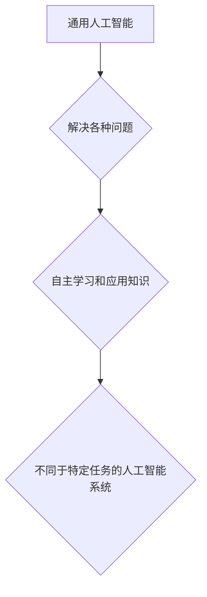
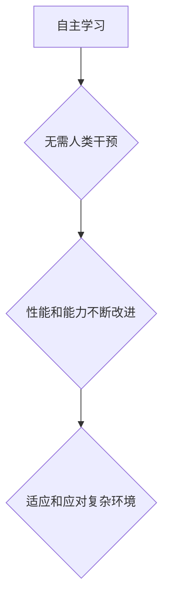
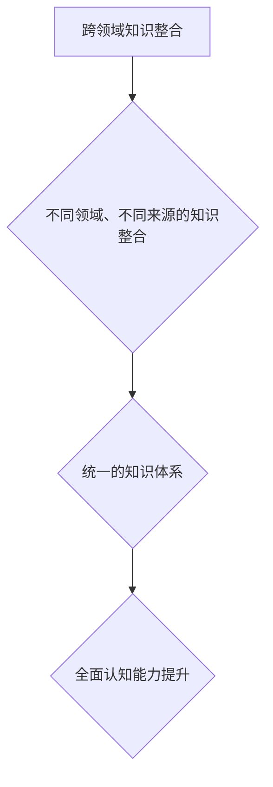
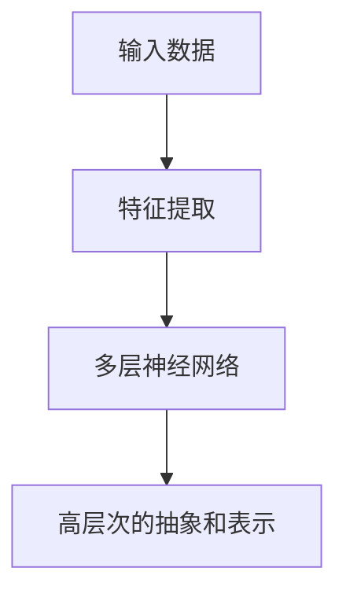
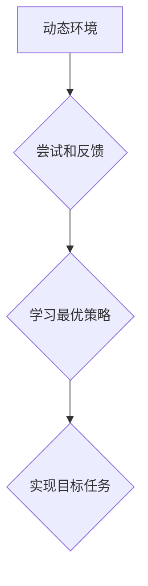
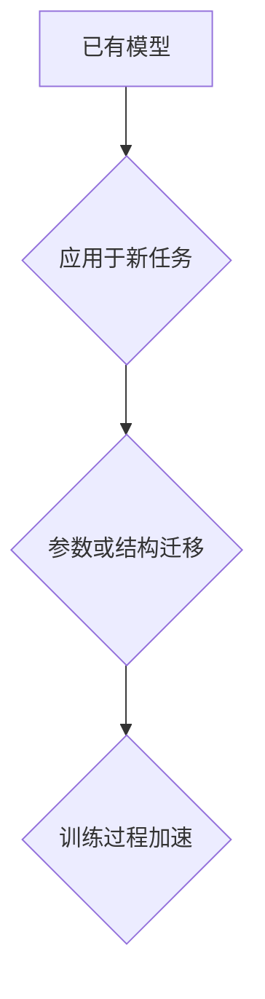
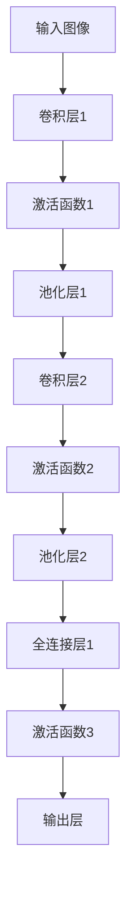

                 

# 李开复：AI 2.0 时代的生态

> 关键词：人工智能、AI 2.0、生态系统、技术进步、挑战与机遇

> 摘要：本文将探讨李开复关于AI 2.0时代的生态观点，分析其核心概念、算法原理、应用场景以及未来发展趋势与挑战。通过深入剖析，帮助读者理解AI 2.0时代的本质，为我国人工智能产业的发展提供有益借鉴。

## 1. 背景介绍

### 1.1 目的和范围

本文旨在深入解读李开复关于AI 2.0时代的生态观点，分析其核心概念、算法原理、应用场景以及未来发展趋势与挑战。通过本文的阅读，读者将全面了解AI 2.0时代的本质，把握人工智能技术的发展趋势，为我国人工智能产业的发展提供有益借鉴。

### 1.2 预期读者

本文适合对人工智能领域有一定了解的技术人员、研究人员、高校学生以及对AI技术感兴趣的社会公众。特别地，本文对AI 2.0时代的生态系统进行了详细阐述，对那些希望深入了解人工智能未来发展的人具有较高的参考价值。

### 1.3 文档结构概述

本文分为十个部分，结构如下：

1. 背景介绍：介绍本文的目的、预期读者、文档结构概述等。
2. 核心概念与联系：介绍AI 2.0时代的核心概念、原理和架构。
3. 核心算法原理 & 具体操作步骤：详细讲解AI 2.0时代的核心算法原理和操作步骤。
4. 数学模型和公式 & 详细讲解 & 举例说明：阐述AI 2.0时代的数学模型和公式，并举例说明。
5. 项目实战：代码实际案例和详细解释说明。
6. 实际应用场景：分析AI 2.0时代的实际应用场景。
7. 工具和资源推荐：推荐学习资源、开发工具和框架。
8. 总结：未来发展趋势与挑战。
9. 附录：常见问题与解答。
10. 扩展阅读 & 参考资料：提供相关文献和资料，便于读者进一步了解AI 2.0时代。

### 1.4 术语表

#### 1.4.1 核心术语定义

- **AI 2.0**：指第二代人工智能，强调人工智能的通用性和自主学习能力，与第一代人工智能（如深度学习）有显著区别。
- **生态系统**：指AI 2.0时代的各类技术、企业、研究者、用户等构成的复杂网络，共同推动人工智能技术的发展。
- **算法**：指用于解决特定问题的计算过程或步骤，是人工智能的核心。
- **数学模型**：指用于描述现实世界问题的数学结构，是人工智能的基础。

#### 1.4.2 相关概念解释

- **深度学习**：一种基于人工神经网络的机器学习技术，是第一代人工智能的代表。
- **机器学习**：一种让计算机通过数据自动学习和改进的技术。
- **神经网络**：一种模拟人脑神经元连接的计算模型，是人工智能的基础。
- **数据科学**：一门利用统计学、机器学习、人工智能等手段从数据中提取知识和信息的技术。

#### 1.4.3 缩略词列表

- **AI**：人工智能
- **ML**：机器学习
- **DL**：深度学习
- **NN**：神经网络

## 2. 核心概念与联系

在AI 2.0时代，核心概念包括通用人工智能（AGI）、自主学习、跨领域知识整合等。下面将介绍这些概念，并给出相应的Mermaid流程图。

### 2.1 通用人工智能（AGI）

通用人工智能（AGI）是指具有广泛认知能力、能够解决各种问题的计算机系统。AGI不同于现有的特定任务的人工智能系统，它能够在不同领域自主学习和应用知识。



### 2.2 自主学习

自主学习是指计算机系统在无需人类干预的情况下，通过数据和学习算法不断改进自身的性能和能力。自主学习是AI 2.0时代的重要特征，使得人工智能系统能够持续适应和应对复杂环境。



### 2.3 跨领域知识整合

跨领域知识整合是指将不同领域、不同来源的知识进行整合，形成统一的知识体系。在AI 2.0时代，跨领域知识整合有助于提升人工智能系统的全面认知能力，实现更高效的决策和问题解决。



## 3. 核心算法原理 & 具体操作步骤

AI 2.0时代的核心算法主要包括深度学习、强化学习和迁移学习等。下面将分别介绍这些算法的原理和具体操作步骤。

### 3.1 深度学习

深度学习是一种基于人工神经网络的机器学习技术。其基本原理是通过多层神经网络对输入数据进行特征提取和建模，从而实现高层次的抽象和表示。



具体操作步骤如下：

1. 数据预处理：对原始数据进行清洗、归一化等处理，使其符合模型输入要求。
2. 神经网络构建：设计并构建符合任务需求的神经网络结构，包括输入层、隐藏层和输出层。
3. 模型训练：通过反向传播算法，利用训练数据对神经网络进行训练，优化模型参数。
4. 模型评估：使用验证数据集对模型进行评估，调整模型参数，提高模型性能。
5. 模型部署：将训练好的模型部署到实际应用场景中，实现任务自动化。

### 3.2 强化学习

强化学习是一种基于奖励反馈的机器学习技术。其基本原理是让计算机在动态环境中通过不断尝试和反馈，学习到最优策略，从而实现目标任务。



具体操作步骤如下：

1. 环境构建：设计并构建符合任务需求的虚拟或现实环境。
2. 策略初始化：初始化计算机的策略，以便在环境中进行探索。
3. 交互过程：计算机在环境中采取行动，获取状态和奖励。
4. 策略调整：根据奖励反馈，调整计算机的策略，提高决策质量。
5. 模型评估：使用评估指标，对计算机的策略进行评估和优化。

### 3.3 迁移学习

迁移学习是一种将已有知识应用于新任务的技术。其基本原理是将已有模型的参数或结构应用于新任务，从而加快新任务的训练过程，提高模型性能。



具体操作步骤如下：

1. 数据集划分：将数据集划分为训练集、验证集和测试集。
2. 模型初始化：初始化迁移学习的目标模型。
3. 模型训练：使用训练集对目标模型进行训练，同时迁移已有模型的参数或结构。
4. 模型评估：使用验证集和测试集对目标模型进行评估，调整模型参数，提高模型性能。
5. 模型部署：将训练好的模型部署到实际应用场景中，实现任务自动化。

## 4. 数学模型和公式 & 详细讲解 & 举例说明

在AI 2.0时代，数学模型和公式是构建和优化算法的核心。以下将介绍一些常用的数学模型和公式，并举例说明。

### 4.1 深度学习中的损失函数

深度学习中的损失函数用于衡量模型预测值与真实值之间的差异。常用的损失函数包括均方误差（MSE）和交叉熵（Cross-Entropy）。

#### 均方误差（MSE）

均方误差（MSE）是深度学习中常用的损失函数，计算公式如下：

$$
MSE = \frac{1}{n} \sum_{i=1}^{n} (y_i - \hat{y}_i)^2
$$

其中，$y_i$为真实值，$\hat{y}_i$为预测值，$n$为样本数量。

#### 交叉熵（Cross-Entropy）

交叉熵（Cross-Entropy）是深度学习中另一个重要的损失函数，计算公式如下：

$$
H(y, \hat{y}) = - \sum_{i=1}^{n} y_i \log(\hat{y}_i)
$$

其中，$y_i$为真实值，$\hat{y}_i$为预测值，$n$为样本数量。

### 4.2 神经网络的激活函数

激活函数是神经网络中用于引入非线性变换的重要部分。常用的激活函数包括 sigmoid 函数、ReLU 函数和 tanh 函数。

#### sigmoid 函数

sigmoid 函数是一种常用的激活函数，计算公式如下：

$$
\sigma(x) = \frac{1}{1 + e^{-x}}
$$

#### ReLU 函数

ReLU 函数是一种非线性激活函数，计算公式如下：

$$
ReLU(x) = \max(0, x)
$$

#### tanh 函数

tanh 函数是一种双曲正切函数，计算公式如下：

$$
tanh(x) = \frac{e^x - e^{-x}}{e^x + e^{-x}}
$$

### 4.3 强化学习中的策略梯度

策略梯度是强化学习中的一个重要概念，用于优化智能体的策略。策略梯度的计算公式如下：

$$
\nabla_{\theta} J(\theta) = \nabla_{\theta} \sum_{t} r_t = \sum_{t} \nabla_{\theta} r_t \nabla_{\theta} \pi(s_t, a_t | \theta)
$$

其中，$\theta$为策略参数，$J(\theta)$为策略梯度，$r_t$为即时奖励，$\pi(s_t, a_t | \theta)$为策略概率分布。

### 4.4 迁移学习中的模型融合

模型融合是迁移学习中的一个重要技术，用于将多个模型的预测结果进行综合，提高模型的性能。常用的模型融合方法包括加权平均、投票法和集成学习等。

#### 加权平均

加权平均是一种简单的模型融合方法，计算公式如下：

$$
\hat{y} = \frac{1}{k} \sum_{i=1}^{k} y_i
$$

其中，$k$为模型数量，$y_i$为第$i$个模型的预测结果。

#### 投票法

投票法是一种基于多数表决的模型融合方法，计算公式如下：

$$
\hat{y} = \text{mode}(\{y_1, y_2, \ldots, y_k\})
$$

其中，$\text{mode}$表示取众数。

#### 集成学习

集成学习是一种基于多模型融合的模型融合方法，常用的集成学习方法包括随机森林、梯度提升树等。

### 4.5 示例：深度学习中的卷积神经网络

卷积神经网络（CNN）是一种广泛应用于图像处理领域的深度学习模型。以下是一个简单的CNN模型示例，包括卷积层、池化层和全连接层。



具体操作步骤如下：

1. **输入层**：接受原始图像数据。
2. **卷积层1**：对输入图像进行卷积操作，提取图像特征。
3. **激活函数1**：对卷积层1的输出进行非线性变换，引入非线性特性。
4. **池化层1**：对激活函数1的输出进行池化操作，降低特征图的维度。
5. **卷积层2**：对池化层1的输出进行卷积操作，进一步提取图像特征。
6. **激活函数2**：对卷积层2的输出进行非线性变换，引入非线性特性。
7. **池化层2**：对激活函数2的输出进行池化操作，降低特征图的维度。
8. **全连接层1**：将池化层2的输出进行全连接操作，提取高层次的抽象特征。
9. **激活函数3**：对全连接层1的输出进行非线性变换，引入非线性特性。
10. **输出层**：对激活函数3的输出进行分类或回归操作，得到最终预测结果。

## 5. 项目实战：代码实际案例和详细解释说明

### 5.1 开发环境搭建

在进行AI 2.0项目的开发之前，我们需要搭建一个合适的开发环境。以下是一个简单的Python开发环境搭建步骤：

1. 安装Python 3.7及以上版本。
2. 安装pip，用于管理Python包。
3. 安装TensorFlow，用于深度学习模型的开发。
4. 安装Keras，用于简化TensorFlow的使用。
5. 安装NumPy，用于数学运算。

### 5.2 源代码详细实现和代码解读

以下是一个简单的AI 2.0项目——基于卷积神经网络的图像分类项目，代码实现如下：

```python
import tensorflow as tf
from tensorflow.keras import layers, models

# 构建卷积神经网络模型
model = models.Sequential()
model.add(layers.Conv2D(32, (3, 3), activation='relu', input_shape=(28, 28, 1)))
model.add(layers.MaxPooling2D((2, 2)))
model.add(layers.Conv2D(64, (3, 3), activation='relu'))
model.add(layers.MaxPooling2D((2, 2)))
model.add(layers.Conv2D(64, (3, 3), activation='relu'))
model.add(layers.Flatten())
model.add(layers.Dense(64, activation='relu'))
model.add(layers.Dense(10, activation='softmax'))

# 编译模型
model.compile(optimizer='adam',
              loss='categorical_crossentropy',
              metrics=['accuracy'])

# 加载并预处理数据
(x_train, y_train), (x_test, y_test) = tf.keras.datasets.mnist.load_data()
x_train = x_train.reshape((-1, 28, 28, 1)).astype('float32') / 255
x_test = x_test.reshape((-1, 28, 28, 1)).astype('float32') / 255
y_train = tf.keras.utils.to_categorical(y_train, 10)
y_test = tf.keras.utils.to_categorical(y_test, 10)

# 训练模型
model.fit(x_train, y_train, epochs=5, batch_size=64)

# 评估模型
model.evaluate(x_test, y_test)
```

#### 5.2.1 代码解读

1. **导入库**：导入TensorFlow和Keras库，用于构建和训练深度学习模型。
2. **构建模型**：使用Sequential模型，依次添加卷积层、池化层和全连接层，构建卷积神经网络。
3. **编译模型**：设置优化器、损失函数和评估指标，编译模型。
4. **加载并预处理数据**：使用TensorFlow内置的MNIST数据集，对数据进行reshape和归一化处理。
5. **训练模型**：使用fit方法训练模型，设置训练轮数和批量大小。
6. **评估模型**：使用evaluate方法评估模型在测试集上的性能。

### 5.3 代码解读与分析

1. **模型构建**：在代码中，我们使用Keras的Sequential模型构建了一个简单的卷积神经网络，包括三个卷积层、三个池化层和一个全连接层。这种结构可以有效地提取图像特征，实现图像分类。
2. **损失函数**：在编译模型时，我们选择了categorical_crossentropy作为损失函数。这个损失函数适用于多分类问题，可以确保模型的输出概率分布与实际标签分布之间的差异。
3. **优化器**：我们选择了adam优化器，这是一种基于自适应学习率的优化算法。它具有较好的收敛速度和稳定性，适用于大多数深度学习任务。
4. **数据预处理**：在训练模型之前，我们需要对MNIST数据集进行reshape和归一化处理。reshape操作将数据维度调整为模型所需的形状，归一化处理将数据缩放到[0, 1]区间，有利于模型收敛。
5. **模型训练**：在fit方法中，我们设置了5个训练轮数和64个批量大小。训练轮数表示模型在训练数据上迭代的次数，批量大小表示每次迭代的样本数量。
6. **模型评估**：在evaluate方法中，我们评估了模型在测试集上的性能。这有助于我们了解模型的泛化能力，并为模型调整提供参考。

## 6. 实际应用场景

AI 2.0时代的核心算法和数学模型在实际应用场景中具有广泛的应用价值。以下列举几个典型的应用场景：

### 6.1 医疗诊断

AI 2.0时代的深度学习和强化学习算法在医疗诊断领域具有巨大的潜力。通过构建深度学习模型，可以实现对医学图像的自动分析，帮助医生诊断疾病。例如，使用卷积神经网络可以实现对胸部X光图像的肺癌检测，大大提高了诊断的准确性和效率。

### 6.2 自动驾驶

自动驾驶是AI 2.0时代的一个重要应用场景。通过结合深度学习和强化学习算法，可以实现自动驾驶车辆的感知、规划和控制。例如，使用深度学习算法对车辆周围环境进行感知，使用强化学习算法制定行驶策略，实现自动驾驶车辆的自主行驶。

### 6.3 智能家居

智能家居是AI 2.0时代的另一个重要应用场景。通过结合深度学习和迁移学习算法，可以实现智能家居设备的智能识别和交互。例如，使用深度学习算法实现人脸识别，使用迁移学习算法实现语音识别，使得智能家居设备能够更好地理解用户需求，提供个性化的服务。

### 6.4 金融风控

金融风控是AI 2.0时代在金融领域的重要应用。通过结合深度学习和强化学习算法，可以实现金融数据的智能分析，提高风控能力。例如，使用深度学习算法对金融交易数据进行分析，发现潜在的欺诈行为，使用强化学习算法制定投资策略，提高投资收益。

## 7. 工具和资源推荐

### 7.1 学习资源推荐

#### 7.1.1 书籍推荐

1. 《深度学习》（Goodfellow, Bengio, Courville）
2. 《强化学习：原理与案例》（Sutton, Barto）
3. 《迁移学习》（Quinlan, Rainie）

#### 7.1.2 在线课程

1. Coursera上的《深度学习》课程
2. edX上的《强化学习》课程
3. Udacity上的《迁移学习》课程

#### 7.1.3 技术博客和网站

1. TensorFlow官网（https://www.tensorflow.org/）
2. PyTorch官网（https://pytorch.org/）
3. 阮一峰的网络日志（http://www.ruanyifeng.com/blog/）

### 7.2 开发工具框架推荐

#### 7.2.1 IDE和编辑器

1. PyCharm
2. Visual Studio Code
3. Jupyter Notebook

#### 7.2.2 调试和性能分析工具

1. TensorBoard
2. PyTorch Profiler
3. NVIDIA Nsight

#### 7.2.3 相关框架和库

1. TensorFlow
2. PyTorch
3. Keras

## 8. 总结：未来发展趋势与挑战

AI 2.0时代是一个充满机遇和挑战的时代。随着核心算法的不断发展，人工智能将更加智能化、通用化和自主化。然而，这也给人工智能领域带来了许多挑战，如算法透明度、数据隐私、伦理道德等。

在未来，我们需要加强人工智能的理论研究，提高算法的透明度和可解释性，确保人工智能技术的发展符合社会价值观。同时，我们还需要关注人工智能的安全性和可控性，确保人工智能技术在各个领域的应用能够为人类带来福祉。

总之，AI 2.0时代的生态是一个复杂而庞大的系统，我们需要共同努力，推动人工智能技术的发展，为人类社会创造更加美好的未来。

## 9. 附录：常见问题与解答

### 9.1 什么是AI 2.0？

AI 2.0是指第二代人工智能，强调人工智能的通用性和自主学习能力，与第一代人工智能（如深度学习）有显著区别。

### 9.2 AI 2.0的核心算法有哪些？

AI 2.0的核心算法包括深度学习、强化学习和迁移学习等。

### 9.3 AI 2.0在医疗诊断领域有哪些应用？

AI 2.0在医疗诊断领域可以用于医学图像分析、疾病预测和诊断等，如胸部X光图像的肺癌检测、皮肤病变检测等。

### 9.4 AI 2.0在自动驾驶领域有哪些应用？

AI 2.0在自动驾驶领域可以用于感知、规划和控制，实现自动驾驶车辆的自主行驶。

### 9.5 如何学习AI 2.0技术？

可以通过阅读相关书籍、参加在线课程、实践项目等方式学习AI 2.0技术。

## 10. 扩展阅读 & 参考资料

1. 李开复，《人工智能：一种新的认知科学》，清华大学出版社，2017。
2. Bengio, Y., Courville, A., & Vincent, P. (2013). Representation learning: A review and new perspectives. IEEE transactions on pattern analysis and machine intelligence, 35(8), 1798-1828.
3. Sutton, R. S., & Barto, A. G. (2018). Reinforcement learning: An introduction. MIT press.
4. Quinlan, J. R. (2014).迁移学习与特征提取（迁移学习与特征提取）. Springer.

