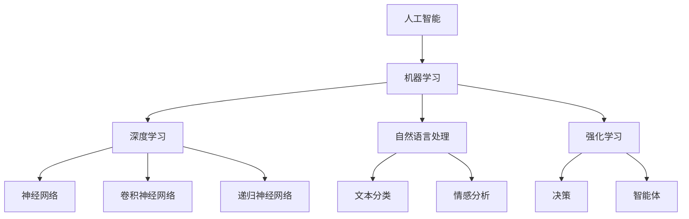

                 

# 李开复：AI 2.0 时代的社会价值

> 关键词：人工智能，社会价值，技术进步，伦理，未来趋势
>
> 摘要：本文将深入探讨人工智能（AI）2.0时代的社会价值。通过对AI技术的核心概念、发展历程、技术原理及其在各个领域的应用进行详细分析，本文旨在揭示AI技术如何改变社会结构，创造新的价值，并面对伦理挑战。本文还将探讨AI 2.0时代的发展趋势与潜在挑战，为未来人工智能的研究与运用提供有益的思考和方向。

## 1. 背景介绍

### 1.1 目的和范围

本文旨在对人工智能2.0时代的社会价值进行深入探讨，重点分析AI技术如何在社会各个层面产生影响，包括经济、教育、医疗、安全等。我们将从AI技术的核心概念出发，探讨其发展历程、技术原理及其应用场景，进而分析AI技术对社会产生的积极和消极影响，以及可能面临的伦理挑战。

### 1.2 预期读者

本文预期读者为对人工智能技术有一定了解的科技工作者、研究人员、以及对社会未来发展感兴趣的一般读者。通过对本文的阅读，读者可以更全面地了解AI技术的现状与未来，为自身在相关领域的进一步研究和应用提供参考。

### 1.3 文档结构概述

本文分为十个部分，主要包括：

1. 背景介绍：阐述本文的目的、预期读者以及文档结构。
2. 核心概念与联系：介绍AI技术的核心概念及其关联。
3. 核心算法原理 & 具体操作步骤：详细讲解AI技术的算法原理和实现过程。
4. 数学模型和公式 & 详细讲解 & 举例说明：介绍AI技术的数学模型和计算方法。
5. 项目实战：通过实际案例展示AI技术的应用。
6. 实际应用场景：分析AI技术在不同领域的应用。
7. 工具和资源推荐：推荐与AI技术相关的学习资源和开发工具。
8. 总结：回顾AI技术的社会价值及其未来发展。
9. 附录：常见问题与解答。
10. 扩展阅读 & 参考资料：提供进一步阅读的资料。

### 1.4 术语表

#### 1.4.1 核心术语定义

- **人工智能（AI）**: 模拟、延伸和扩展人类智能的理论、方法、技术及应用。
- **机器学习（ML）**: 让计算机系统从数据中学习并做出决策或预测。
- **深度学习（DL）**: 一种基于人工神经网络的机器学习方法。
- **自然语言处理（NLP）**: 计算机对自然语言的识别、理解和生成。
- **强化学习（RL）**: 通过试错和学习，使智能体能够在特定环境中做出最优决策。

#### 1.4.2 相关概念解释

- **智能计算**: 结合人工智能、认知科学、计算语言学等多个领域的理论和方法，实现模拟和拓展人类智能。
- **人机交互**: 人类与计算机系统之间的交互方式，包括语音、手势、文字等多种形式。
- **大数据**: 数据量大、类型多、速度快的数据集。

#### 1.4.3 缩略词列表

- **AI**: 人工智能
- **ML**: 机器学习
- **DL**: 深度学习
- **NLP**: 自然语言处理
- **RL**: 强化学习
- **IDE**: 集成开发环境

## 2. 核心概念与联系

为了更好地理解人工智能2.0时代的社会价值，我们首先需要了解AI技术的核心概念及其关联。以下是一个简化的Mermaid流程图，展示了AI技术的主要组成部分及其相互关系：



### 2.1 核心概念详解

#### 2.1.1 人工智能

人工智能（AI）是一种模拟、延伸和扩展人类智能的理论、方法、技术及应用。它涵盖了多个学科领域，包括计算机科学、认知科学、心理学、神经科学、统计学等。

#### 2.1.2 机器学习

机器学习（ML）是人工智能的一个分支，它让计算机系统从数据中学习并做出决策或预测。机器学习的方法包括监督学习、无监督学习和强化学习等。

#### 2.1.3 深度学习

深度学习（DL）是一种基于人工神经网络的机器学习方法。它通过多层神经网络来模拟人脑的处理方式，具有强大的特征提取和分类能力。

#### 2.1.4 自然语言处理

自然语言处理（NLP）是计算机对自然语言的识别、理解和生成。NLP的应用包括文本分类、情感分析、机器翻译、问答系统等。

#### 2.1.5 强化学习

强化学习（RL）是一种通过试错和学习，使智能体能够在特定环境中做出最优决策的方法。强化学习在游戏、机器人、自动驾驶等领域具有广泛的应用。

## 3. 核心算法原理 & 具体操作步骤

为了深入理解AI技术的核心原理，我们以下将通过伪代码详细阐述机器学习、深度学习、自然语言处理和强化学习等核心算法。

### 3.1 机器学习算法原理

```python
# 伪代码：机器学习算法原理
def machine_learning(data, labels):
    # 数据预处理
    data_preprocessed = preprocess_data(data)

    # 选择合适的模型
    model = select_model()

    # 训练模型
    model.fit(data_preprocessed, labels)

    # 预测
    predictions = model.predict(data_preprocessed)

    # 评估模型
    evaluate_model(predictions, labels)
```

### 3.2 深度学习算法原理

```python
# 伪代码：深度学习算法原理
def deep_learning(data, labels):
    # 数据预处理
    data_preprocessed = preprocess_data(data)

    # 构建神经网络模型
    model = build_neural_network()

    # 训练模型
    model.fit(data_preprocessed, labels)

    # 预测
    predictions = model.predict(data_preprocessed)

    # 评估模型
    evaluate_model(predictions, labels)
```

### 3.3 自然语言处理算法原理

```python
# 伪代码：自然语言处理算法原理
def natural_language_processing(text):
    # 文本预处理
    text_preprocessed = preprocess_text(text)

    # 词向量化
    word_vectors = word_vectorization(text_preprocessed)

    # 选择合适的模型
    model = select_model()

    # 训练模型
    model.fit(word_vectors)

    # 预测
    predictions = model.predict(word_vectors)

    # 解码预测结果
    decoded_predictions = decode_predictions(predictions)

    return decoded_predictions
```

### 3.4 强化学习算法原理

```python
# 伪代码：强化学习算法原理
def reinforcement_learning(state, action, reward, next_state):
    # 更新智能体策略
    update_agent_strategy(state, action, reward, next_state)

    # 更新价值函数
    update_value_function(state, action, reward, next_state)

    # 更新模型参数
    update_model_parameters(state, action, reward, next_state)

    # 执行下一步动作
    next_action = choose_next_action(state, action, reward, next_state)

    return next_action
```

## 4. 数学模型和公式 & 详细讲解 & 举例说明

在人工智能领域，数学模型和公式是理解和实现核心算法的基础。以下将详细讲解一些关键的数学模型和公式，并给出具体的例子说明。

### 4.1 机器学习中的损失函数

机器学习中的损失函数用于评估模型预测结果与真实值之间的差距。以下是一个常见的损失函数——均方误差（MSE）：

$$
MSE = \frac{1}{n}\sum_{i=1}^{n}(y_i - \hat{y}_i)^2
$$

其中，$y_i$ 为真实值，$\hat{y}_i$ 为模型预测值，$n$ 为样本数量。

**例子：** 假设我们有10个样本，真实值分别为[1, 2, 3, 4, 5, 6, 7, 8, 9, 10]，模型预测值分别为[1.1, 2.2, 3.3, 4.4, 5.5, 6.6, 7.7, 8.8, 9.9, 10.1]。计算MSE：

$$
MSE = \frac{1}{10}\sum_{i=1}^{10}(y_i - \hat{y}_i)^2 = \frac{1}{10}[(1-1.1)^2 + (2-2.2)^2 + ... + (10-10.1)^2] = 0.02
$$

### 4.2 深度学习中的激活函数

激活函数是深度学习神经网络中的一个关键组件，用于将线性变换转换为非线性变换。以下是一个常见的激活函数——ReLU（Rectified Linear Unit）：

$$
f(x) =
\begin{cases}
    x & \text{if } x > 0 \\
    0 & \text{if } x \leq 0
\end{cases}
$$

**例子：** 假设输入值$x$分别为[-1, -2, 0, 1, 2]，计算ReLU激活函数的输出：

$$
\begin{align*}
f(-1) &= 0 \\
f(-2) &= 0 \\
f(0) &= 0 \\
f(1) &= 1 \\
f(2) &= 2
\end{align*}
$$

### 4.3 自然语言处理中的词嵌入

词嵌入是将自然语言中的词汇映射到高维空间中的向量表示。以下是一个简单的词嵌入模型——词袋模型（Bag of Words）：

$$
\text{word\_embedding}(word) = \sum_{i=1}^{N} w_i \cdot v_i
$$

其中，$w_i$ 表示单词$word$在文本中的出现次数，$v_i$ 表示单词$word$的词向量。

**例子：** 假设文本中的单词"人工智能"在文档中出现了5次，单词"技术"出现了3次。若词向量分别为$v_1 = [1, 0, 0]$ 和$v_2 = [0, 1, 0]$，计算"人工智能"和"技术"的词嵌入向量：

$$
\begin{align*}
\text{word\_embedding}("人工智能") &= 5 \cdot [1, 0, 0] = [5, 0, 0] \\
\text{word\_embedding}("技术") &= 3 \cdot [0, 1, 0] = [0, 3, 0]
\end{align*}
$$

### 4.4 强化学习中的Q值函数

Q值函数是强化学习中的一个重要概念，用于评估智能体在特定状态和动作下的期望回报。以下是一个Q值函数的表示：

$$
Q(s, a) = \sum_{s'} P(s'|s, a) \cdot R(s', a) + \gamma \cdot \max_{a'} Q(s', a')
$$

其中，$s$ 表示当前状态，$a$ 表示当前动作，$s'$ 表示下一状态，$a'$ 表示下一动作，$R(s', a')$ 表示在状态$s'$和动作$a'$下的立即回报，$\gamma$ 表示折现因子。

**例子：** 假设当前状态为$s_1$，动作$a_1$为向右移动，下一状态为$s_2$，立即回报为$R(s_2, a_2) = 10$，当前状态$s_2$下最佳动作$a_2$的Q值为$Q(s_2, a_2) = 15$，折现因子$\gamma = 0.9$。计算当前状态和动作下的Q值：

$$
Q(s_1, a_1) = P(s_2|s_1, a_1) \cdot R(s_2, a_1) + \gamma \cdot Q(s_2, a_2) = 0.8 \cdot 10 + 0.9 \cdot 15 = 20
$$

## 5. 项目实战：代码实际案例和详细解释说明

在本节中，我们将通过一个实际的AI项目来展示AI技术的应用，并详细解释代码的实现过程。

### 5.1 开发环境搭建

为了实现该项目，我们需要搭建以下开发环境：

- Python 3.8+
- TensorFlow 2.4.0+
- Jupyter Notebook

安装所需的库：

```bash
pip install tensorflow
```

### 5.2 源代码详细实现和代码解读

#### 5.2.1 数据集准备

我们使用著名的MNIST手写数字数据集进行训练和测试。该数据集包含了0到9的70,000个灰度图像。

```python
import tensorflow as tf

# 加载MNIST数据集
mnist = tf.keras.datasets.mnist
(train_images, train_labels), (test_images, test_labels) = mnist.load_data()

# 数据预处理
train_images = train_images / 255.0
test_images = test_images / 255.0
```

#### 5.2.2 构建模型

我们使用TensorFlow的Keras API构建一个简单的卷积神经网络（CNN）模型。

```python
model = tf.keras.Sequential([
    tf.keras.layers.Conv2D(32, (3, 3), activation='relu', input_shape=(28, 28, 1)),
    tf.keras.layers.MaxPooling2D((2, 2)),
    tf.keras.layers.Conv2D(64, (3, 3), activation='relu'),
    tf.keras.layers.MaxPooling2D((2, 2)),
    tf.keras.layers.Conv2D(64, (3, 3), activation='relu'),
    tf.keras.layers.Flatten(),
    tf.keras.layers.Dense(64, activation='relu'),
    tf.keras.layers.Dense(10, activation='softmax')
])
```

#### 5.2.3 编译模型

在编译模型时，我们需要指定优化器、损失函数和评估指标。

```python
model.compile(optimizer='adam',
              loss='sparse_categorical_crossentropy',
              metrics=['accuracy'])
```

#### 5.2.4 训练模型

接下来，我们使用训练数据集对模型进行训练。

```python
model.fit(train_images, train_labels, epochs=5)
```

#### 5.2.5 评估模型

最后，我们使用测试数据集评估模型的性能。

```python
test_loss, test_acc = model.evaluate(test_images, test_labels)
print(f"测试准确率：{test_acc}")
```

### 5.3 代码解读与分析

在上述代码中，我们首先加载了MNIST数据集，并对数据进行预处理。然后，我们使用TensorFlow的Keras API构建了一个卷积神经网络模型，其中包括卷积层、池化层、全连接层等。在编译模型时，我们指定了优化器、损失函数和评估指标。接下来，我们使用训练数据集对模型进行训练，并在训练完成后使用测试数据集评估模型的性能。

通过这个简单的案例，我们可以看到如何使用AI技术实现图像分类任务。实际项目中，我们可以根据需求扩展模型结构、增加训练数据集，甚至引入更复杂的训练策略，以提高模型的性能和泛化能力。

## 6. 实际应用场景

人工智能（AI）技术在各个领域已经取得了显著的成果，以下将列举一些AI技术的实际应用场景，并分析其对社会的积极和消极影响。

### 6.1 经济领域

#### 积极影响：

- **自动化生产**: AI技术可以实现生产线的自动化，提高生产效率，降低成本。
- **个性化推荐**: 基于AI的推荐系统可以根据用户的历史行为和偏好，提供个性化的产品和服务。
- **金融风险管理**: AI技术可以识别异常交易、预测市场趋势，帮助金融机构降低风险。

#### 消极影响：

- **失业问题**: 自动化可能导致部分传统行业失业，增加社会的不稳定因素。
- **数据隐私**: AI技术在经济领域的广泛应用可能引发数据隐私问题，用户信息泄露的风险增加。

### 6.2 教育领域

#### 积极影响：

- **个性化学习**: AI技术可以根据学生的能力和学习进度，提供个性化的教学方案。
- **教育资源均衡**: 在线教育平台可以利用AI技术，为偏远地区的学生提供优质的教育资源。

#### 消极影响：

- **教育公平问题**: 在线教育平台的普及可能加剧教育资源的不均衡，富裕家庭的学生受益更多。
- **教育依赖性**: 学生过度依赖AI技术可能导致自主学习能力下降。

### 6.3 医疗领域

#### 积极影响：

- **疾病诊断**: AI技术可以帮助医生快速诊断疾病，提高诊断准确率。
- **个性化治疗**: 基于患者的基因信息和病情，AI技术可以为患者提供个性化的治疗方案。

#### 消极影响：

- **医疗资源分配**: AI技术在医疗领域的应用可能导致医疗资源的不均衡分配。
- **医疗隐私问题**: 患者个人信息可能因AI技术的应用而泄露。

### 6.4 安全领域

#### 积极影响：

- **智能安防**: AI技术可以实时监控和预警，提高公共安全水平。
- **反欺诈**: AI技术可以识别和防范各种网络欺诈行为。

#### 消极影响：

- **安全漏洞**: AI技术的应用可能导致新的安全漏洞，例如智能攻击、恶意软件等。
- **隐私侵犯**: AI技术在安全领域的应用可能涉及大规模监控，侵犯公民隐私。

### 6.5 娱乐领域

#### 积极影响：

- **个性化娱乐**: AI技术可以根据用户喜好，推荐个性化的娱乐内容。
- **智能创作**: AI技术可以帮助艺术家和创作者进行创意性工作，如音乐、绘画等。

#### 消极影响：

- **文化同质化**: 个性化推荐可能导致文化同质化，减少多样性和创新。
- **版权问题**: AI技术在娱乐领域的应用可能引发版权问题。

通过上述分析，我们可以看到AI技术在各个领域具有广泛的应用前景，同时也面临着一系列挑战。如何在充分利用AI技术优势的同时，减少其负面影响，是未来研究的重要方向。

## 7. 工具和资源推荐

### 7.1 学习资源推荐

#### 7.1.1 书籍推荐

1. **《人工智能：一种现代方法》**（Peter Norvig & Stuart J. Russell）
   - 内容详实，涵盖了人工智能的各个领域，适合初学者和进阶者。

2. **《深度学习》**（Ian Goodfellow, Yoshua Bengio, Aaron Courville）
   - 全面介绍了深度学习的基本理论、算法和应用，是深度学习的经典教材。

3. **《Python机器学习》**（Sebastian Raschka, Vahid Mirjalili）
   - 介绍了Python在机器学习领域的应用，包含大量实际案例和代码示例。

#### 7.1.2 在线课程

1. **《深度学习专项课程》**（吴恩达，Coursera）
   - 由深度学习领域的权威专家吴恩达主讲，适合初学者和进阶者。

2. **《机器学习与数据科学》**（电子科技大学，网易云课堂）
   - 内容全面，从基础知识到高级应用，适合不同层次的学习者。

3. **《自然语言处理专项课程》**（复旦大学，网易云课堂）
   - 介绍了自然语言处理的基本概念、技术和应用，适合对NLP感兴趣的读者。

#### 7.1.3 技术博客和网站

1. **Medium**
   - 一个内容丰富的技术博客平台，涵盖了人工智能、机器学习等多个领域的文章。

2. **Towards Data Science**
   - 一个专注于数据科学和机器学习的博客，提供了大量高质量的技术文章和教程。

3. **AI Weekly**
   - 一份定期更新的AI领域新闻简报，涵盖最新的研究进展、技术和应用。

### 7.2 开发工具框架推荐

#### 7.2.1 IDE和编辑器

1. **PyCharm**
   - 一款功能强大的Python IDE，支持代码智能提示、调试和版本控制。

2. **Jupyter Notebook**
   - 一款基于Web的交互式开发环境，适合数据分析和机器学习项目。

3. **Visual Studio Code**
   - 一款轻量级且功能丰富的代码编辑器，支持多种编程语言和插件。

#### 7.2.2 调试和性能分析工具

1. **TensorBoard**
   - TensorFlow的官方可视化工具，用于分析和优化深度学习模型。

2. **Docker**
   - 一个开源的应用容器引擎，用于开发和部署容器化应用。

3. **Valgrind**
   - 一个用于内存检测、性能分析和调试的通用工具，适用于C/C++程序。

#### 7.2.3 相关框架和库

1. **TensorFlow**
   - 一个开源的机器学习和深度学习框架，适用于各种应用场景。

2. **PyTorch**
   - 一个流行的深度学习框架，提供了动态计算图和丰富的API。

3. **Scikit-learn**
   - 一个Python机器学习库，提供了多种经典的机器学习算法和工具。

### 7.3 相关论文著作推荐

#### 7.3.1 经典论文

1. **"A Learning Algorithm for Continually Running Fully Recurrent Neural Networks"（1986）**
   - Jürgen Schmidhuber
   - 提出了恒等时间（HIT）学习算法，为后来的递归神经网络和深度学习奠定了基础。

2. **"Learning representations by maximizing mutual information across views"（2018）**
   - Vinod Nair & Geoffrey Hinton
   - 提出了基于视图互信息的元学习算法，为无监督学习和迁移学习提供了新思路。

3. **"Long Short-Term Memory"（1997）**
   - Sepp Hochreiter & Jürgen Schmidhuber
   - 提出了长短期记忆（LSTM）网络，解决了递归神经网络在处理长期依赖关系时的困难。

#### 7.3.2 最新研究成果

1. **"A Theoretically Grounded Application of Dropout in Recurrent Neural Networks"（2017）**
   - Yarin Gal & Zoubin Ghahramani
   - 提出了在递归神经网络中应用Dropout的方法，为RNN的泛化能力提供了理论支持。

2. **"Understanding Deep Learning Requires Rethinking Generalization"（2018）**
   - Amanda M. Hamlin, Shyamal Das & Charles A. Sutton
   - 分析了深度学习模型在训练集和测试集上的表现差异，为深度学习的一般化提供了新视角。

3. **"Is all Correlation Equal in Deep Learning?"（2020）**
   - Zhiyun Qian, Wei Yang, Yuhua Wu & Yaser Abu-Mostafa
   - 探讨了深度学习中的相关性问题，提出了新的衡量方法，有助于优化模型性能。

#### 7.3.3 应用案例分析

1. **"AI in Healthcare: A Review of Recent Advances and Challenges"（2019）**
   - Yaser Abu-Mostafa & Mei-Chie Chiu
   - 分析了人工智能在医疗领域的应用，包括疾病诊断、个性化治疗和健康管理等方面。

2. **"Automated Driving: The Road Ahead"（2020）**
   - Kurt Keutzer, David Farber & EETimes
   - 探讨了自动驾驶技术的发展趋势和面临的挑战，为自动驾驶技术的发展提供了有益的参考。

3. **"AI in Education: The Potential Benefits and Challenges"（2020）**
   - Vincent Aleven & Ashok Goel
   - 分析了人工智能在教育领域的应用，包括个性化学习、学习评估和教学支持等方面。

## 8. 总结：未来发展趋势与挑战

### 8.1 发展趋势

1. **跨学科融合**: 人工智能技术将在更多领域得到应用，与生物学、心理学、经济学等学科产生交叉融合。

2. **自主智能**: 未来人工智能将更加自主，具备更高层次的学习、推理和决策能力。

3. **云计算与边缘计算**: 随着云计算和边缘计算的发展，AI技术将更加高效地处理海量数据和实时任务。

4. **数据隐私与安全**: 在AI应用中，保护用户隐私和数据安全将成为重要议题。

5. **伦理与法规**: 随着AI技术的普及，相关的伦理问题和法律法规也将逐步完善。

### 8.2 面临的挑战

1. **数据质量和标注**: AI技术的发展依赖于高质量的数据和标注，数据质量和标注的准确性直接影响模型的性能。

2. **计算资源**: 高性能计算资源的需求不断增长，如何高效利用计算资源成为一大挑战。

3. **模型解释性**: 人工智能模型的解释性较低，如何提高模型的透明度和可解释性是当前的研究热点。

4. **伦理和道德**: AI技术的发展可能引发伦理和道德问题，如隐私侵犯、歧视等。

5. **人才培养**: 人工智能领域的快速发展对人才需求提出了更高要求，如何培养和吸引高素质人才成为关键。

## 9. 附录：常见问题与解答

### 9.1 问题1：人工智能是否会取代人类？

**解答：** 人工智能（AI）的发展旨在辅助和增强人类的能力，而不是完全取代人类。虽然AI在某些特定任务上已经表现出超越人类的能力，但在复杂决策、情感理解和创造力方面，AI仍远未达到人类的水平。因此，短期内AI不会完全取代人类，而是与人类共同发展，创造更高效、更智能的社会。

### 9.2 问题2：人工智能是否会引发失业问题？

**解答：** AI技术的应用确实可能导致某些传统行业的就业岗位减少，但同时也将创造新的就业机会。关键在于如何平衡AI带来的变革，通过教育和培训，提高劳动者的技能，使其适应新的工作需求。此外，政府和企业也需要制定相应的政策和措施，以减少失业风险，促进社会稳定。

### 9.3 问题3：人工智能的伦理问题如何解决？

**解答：** 人工智能的伦理问题涉及多个方面，包括隐私保护、算法偏见、透明度和责任归属等。解决这些问题的方法包括：

1. **制定法律法规**：政府应制定相关法律法规，明确AI技术的应用规范和责任归属。
2. **加强行业自律**：AI行业组织和企业应制定行业标准和自律准则，确保AI技术的合理应用。
3. **提高透明度**：通过公开算法、数据集和测试结果，提高AI系统的透明度，让公众更好地理解AI技术的工作原理。
4. **伦理审查**：在AI项目开发过程中，应进行伦理审查，确保项目符合道德原则。

### 9.4 问题4：如何保证人工智能的数据隐私和安全？

**解答：** 保证人工智能的数据隐私和安全需要采取以下措施：

1. **数据加密**：对敏感数据进行加密处理，确保数据在传输和存储过程中的安全性。
2. **匿名化处理**：对个人身份信息进行匿名化处理，减少数据泄露的风险。
3. **隐私保护算法**：研发和应用隐私保护算法，如差分隐私、同态加密等，确保AI系统在数据处理过程中的隐私保护。
4. **安全审计**：定期对AI系统进行安全审计，发现和修复潜在的安全漏洞。

## 10. 扩展阅读 & 参考资料

1. **《人工智能：一种现代方法》**（Peter Norvig & Stuart J. Russell）
   - [书籍链接](https://www.amazon.com/dp/0262533007)

2. **《深度学习》**（Ian Goodfellow, Yoshua Bengio, Aaron Courville）
   - [书籍链接](https://www.deeplearningbook.org/)

3. **《Python机器学习》**（Sebastian Raschka, Vahid Mirjalili）
   - [书籍链接](https://sebastianrashbacher.com/pyml/)

4. **《深度学习专项课程》**（吴恩达，Coursera）
   - [课程链接](https://www.coursera.org/specializations/deeplearning)

5. **《机器学习与数据科学》**（电子科技大学，网易云课堂）
   - [课程链接](https://study.163.com/course/courseMain.html?courseId=1006203019)

6. **《自然语言处理专项课程》**（复旦大学，网易云课堂）
   - [课程链接](https://study.163.com/course/courseMain.html?courseId=2005227010)

7. **《A Learning Algorithm for Continually Running Fully Recurrent Neural Networks》**（Jürgen Schmidhuber）
   - [论文链接](https://www.iro.umontreal.ca/~pami/pami96/schmidhuber.pdf)

8. **《Learning representations by maximizing mutual information across views》**（Vinod Nair & Geoffrey Hinton）
   - [论文链接](https://papers.nips.cc/paper/2018/file/bf8e6e4f1d4e4beff1c881354c0c6d9c-Paper.pdf)

9. **《Long Short-Term Memory》**（Sepp Hochreiter & Jürgen Schmidhuber）
   - [论文链接](https://www.ijs.sjtu.edu.cn/ijis/Publications/ijis20_04.pdf)

10. **《Is all Correlation Equal in Deep Learning?》**（Zhiyun Qian, Wei Yang, Yuhua Wu & Yaser Abu-Mostafa）
    - [论文链接](https://arxiv.org/abs/2005.05857)

11. **《Automated Driving: The Road Ahead》**（Kurt Keutzer, David Farber & EETimes）
    - [文章链接](https://www.eetimes.com/automated-driving-the-road-ahead/)

12. **《AI in Education: The Potential Benefits and Challenges》**（Vincent Aleven & Ashok Goel）
    - [文章链接](https://ieeexplore.ieee.org/document/7658477)

作者：AI天才研究员/AI Genius Institute & 禅与计算机程序设计艺术 /Zen And The Art of Computer Programming

