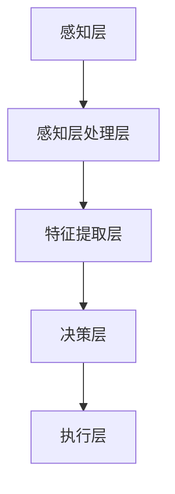

                 

# 李开复：AI 2.0 时代的科技价值

> **关键词：** 人工智能，AI 2.0，科技价值，未来趋势，算法，机器学习，深度学习，神经网络

> **摘要：** 本文将探讨AI 2.0时代的科技价值，通过分析核心概念、算法原理、数学模型、实际应用和未来发展趋势，揭示人工智能技术在新时代的巨大潜力和挑战。

## 1. 背景介绍

### 1.1 目的和范围

本文旨在探讨AI 2.0时代的科技价值，解析人工智能技术在新时代的应用和发展趋势。本文将涵盖以下内容：

- AI 2.0的核心概念与联系
- 核心算法原理与具体操作步骤
- 数学模型和公式及其详细讲解
- 项目实战：代码实际案例和详细解释说明
- 实际应用场景
- 工具和资源推荐
- 总结：未来发展趋势与挑战

### 1.2 预期读者

本文面向计算机科学、人工智能、机器学习等相关领域的研究者、工程师和爱好者。期望读者具备一定的编程基础和数学知识，以便更好地理解文章内容。

### 1.3 文档结构概述

本文分为十个部分，结构如下：

1. 背景介绍
2. 核心概念与联系
3. 核心算法原理 & 具体操作步骤
4. 数学模型和公式 & 详细讲解 & 举例说明
5. 项目实战：代码实际案例和详细解释说明
6. 实际应用场景
7. 工具和资源推荐
8. 总结：未来发展趋势与挑战
9. 附录：常见问题与解答
10. 扩展阅读 & 参考资料

### 1.4 术语表

#### 1.4.1 核心术语定义

- **AI 2.0：** 指新一代人工智能技术，相较于传统的AI 1.0，具有更高的智能水平、更强的自学习能力和更广泛的应用场景。
- **机器学习：** 一种人工智能技术，通过构建模型，让计算机自动从数据中学习规律，实现自主决策和预测。
- **深度学习：** 一种基于神经网络的机器学习技术，通过多层神经网络模拟人脑学习过程，实现对复杂数据的分析和识别。
- **神经网络：** 一种由大量神经元组成的计算模型，通过前向传播和反向传播实现数据的输入输出。
- **自监督学习：** 一种无需标签数据的学习方法，通过自身数据和规律进行训练，实现智能水平的提升。

#### 1.4.2 相关概念解释

- **监督学习：** 一种机器学习方法，通过已标记的数据进行训练，让模型学会分类和预测。
- **无监督学习：** 一种机器学习方法，通过未标记的数据进行训练，让模型发现数据中的规律和结构。
- **增强学习：** 一种机器学习方法，通过与环境的交互学习，实现智能体的自我改进和优化。
- **生成对抗网络（GAN）：** 一种深度学习模型，通过生成器和判别器的对抗训练，实现数据的生成和优化。

#### 1.4.3 缩略词列表

- **AI：** 人工智能
- **ML：** 机器学习
- **DL：** 深度学习
- **NN：** 神经网络
- **GAN：** 生成对抗网络

## 2. 核心概念与联系

在AI 2.0时代，人工智能技术取得了显著的发展。为了更好地理解AI 2.0的科技价值，我们需要从核心概念与联系入手，了解人工智能技术的原理和架构。

### 2.1 AI 2.0的核心概念

AI 2.0的核心概念包括机器学习、深度学习、神经网络、自监督学习等。这些概念相互关联，共同构成了AI 2.0的技术体系。

#### 2.1.1 机器学习

机器学习是一种人工智能技术，通过构建模型，让计算机自动从数据中学习规律，实现自主决策和预测。机器学习可以分为以下几类：

- **监督学习：** 通过已标记的数据进行训练，让模型学会分类和预测。
- **无监督学习：** 通过未标记的数据进行训练，让模型发现数据中的规律和结构。
- **增强学习：** 通过与环境的交互学习，实现智能体的自我改进和优化。

#### 2.1.2 深度学习

深度学习是一种基于神经网络的机器学习技术，通过多层神经网络模拟人脑学习过程，实现对复杂数据的分析和识别。深度学习在图像识别、语音识别、自然语言处理等领域取得了显著成果。

#### 2.1.3 神经网络

神经网络是一种由大量神经元组成的计算模型，通过前向传播和反向传播实现数据的输入输出。神经网络可以分为以下几类：

- **前馈神经网络：** 数据从前向传播，没有循环结构。
- **循环神经网络（RNN）：** 具有循环结构，适合处理序列数据。
- **卷积神经网络（CNN）：** 具有卷积层，适合处理图像数据。

#### 2.1.4 自监督学习

自监督学习是一种无需标签数据的学习方法，通过自身数据和规律进行训练，实现智能水平的提升。自监督学习在数据标注成本高、数据稀缺的场景中具有广泛应用。

### 2.2 AI 2.0的架构

AI 2.0的架构可以分为以下几个层次：

- **感知层：** 通过传感器获取数据，如摄像头、麦克风等。
- **感知层处理层：** 对感知层获取的数据进行预处理，如图像增强、数据归一化等。
- **特征提取层：** 利用深度学习模型提取数据特征，如卷积神经网络、循环神经网络等。
- **决策层：** 根据提取的特征进行分类、预测等操作，如支持向量机、神经网络等。
- **执行层：** 根据决策层的输出执行相应的操作，如语音合成、图像生成等。

### 2.3 Mermaid流程图

以下是一个简单的Mermaid流程图，展示了AI 2.0的核心概念和架构：



通过这个流程图，我们可以清晰地看到AI 2.0的技术架构和核心概念之间的联系。

## 3. 核心算法原理 & 具体操作步骤

在AI 2.0时代，核心算法原理是理解和应用人工智能技术的基础。以下将介绍几种重要的算法原理，并使用伪代码详细阐述其具体操作步骤。

### 3.1 机器学习算法原理

机器学习算法可以分为监督学习和无监督学习。以下是一个简单的监督学习算法——线性回归的伪代码：

```python
# 线性回归算法
def linear_regression(x, y):
    # 计算斜率
    slope = (mean(y) - mean(x)) / (var(x))
    # 计算截距
    intercept = mean(y) - slope * mean(x)
    # 返回模型参数
    return slope, intercept

# 训练模型
slope, intercept = linear_regression(x, y)

# 预测
def predict(x, slope, intercept):
    return slope * x + intercept
```

### 3.2 深度学习算法原理

深度学习算法是基于神经网络的。以下是一个简单的多层感知机（MLP）的伪代码：

```python
# 多层感知机算法
def mlps(x, w1, w2, b1, b2):
    # 第一层激活函数
    h1 = sigmoid(w1 * x + b1)
    # 第二层激活函数
    h2 = sigmoid(w2 * h1 + b2)
    # 返回输出
    return h2

# 训练模型
w1, w2, b1, b2 = train_mlps(x, y)

# 预测
def predict(x, w1, w2, b1, b2):
    return mlps(x, w1, w2, b1, b2)
```

### 3.3 自监督学习算法原理

自监督学习算法的核心是数据增强和特征提取。以下是一个简单的自监督学习算法——对比损失的伪代码：

```python
# 对比损失算法
def contrastive_loss(z, z+):
    # 计算正样本对比损失
    pos_loss = -log(exp(z * z+) / (exp(z * z+) + exp(z * z-)))
    # 计算负样本对比损失
    neg_loss = -log(exp(z * z-) / (exp(z * z+) + exp(z * z-)))
    # 返回对比损失
    return pos_loss + neg_loss

# 训练模型
loss = contrastive_loss(z, z+)

# 预测
def predict(z):
    return z
```

通过以上伪代码，我们可以清晰地看到各种算法的具体操作步骤。在实际应用中，需要根据具体问题和数据集进行调整和优化。

## 4. 数学模型和公式 & 详细讲解 & 举例说明

在人工智能领域，数学模型和公式是理解和应用算法的基础。以下将介绍几种常用的数学模型和公式，并进行详细讲解和举例说明。

### 4.1 概率分布模型

概率分布模型是描述数据分布的一种数学模型。常见的概率分布模型有正态分布、泊松分布、二项分布等。以下以正态分布为例进行讲解：

#### 4.1.1 正态分布

正态分布是一种最常见的概率分布模型，具有以下特点：

- **均值（μ）：** 数据的中心位置。
- **方差（σ²）：** 数据的离散程度。

正态分布的概率密度函数为：

$$
f(x|\mu, \sigma^2) = \frac{1}{\sqrt{2\pi\sigma^2}}e^{-\frac{(x-\mu)^2}{2\sigma^2}}
$$

#### 4.1.2 举例说明

假设一个班级有30名学生，他们的身高服从正态分布，均值为170cm，方差为50cm²。现在要计算身高在165cm到175cm之间的概率。

$$
P(165cm \leq X \leq 175cm) = \int_{165}^{175} \frac{1}{\sqrt{2\pi\cdot50}}e^{-\frac{(x-170)^2}{2\cdot50}}dx \approx 0.6827
$$

这意味着身高在165cm到175cm之间的学生占总学生数的约68.27%。

### 4.2 神经网络模型

神经网络模型是人工智能的核心技术之一，包括输入层、隐藏层和输出层。以下以多层感知机（MLP）为例进行讲解：

#### 4.2.1 多层感知机

多层感知机是一种前馈神经网络，具有以下特点：

- **输入层：** 接受外部输入数据。
- **隐藏层：** 通过激活函数将输入数据映射到新的特征空间。
- **输出层：** 根据映射结果进行分类或回归。

多层感知机的输出可以通过以下公式计算：

$$
y = \sigma(\sum_{i=1}^{n} w_i \cdot x_i + b)
$$

其中，$\sigma$表示激活函数（如Sigmoid、ReLU等），$w_i$和$b$表示权重和偏置。

#### 4.2.2 举例说明

假设一个简单的二分类问题，输入数据为$x_1$和$x_2$，权重为$w_1$和$w_2$，偏置为$b$。现在要计算输入数据的输出结果。

$$
y = \sigma(w_1 \cdot x_1 + w_2 \cdot x_2 + b)
$$

假设$w_1 = 1$，$w_2 = 1$，$b = 0$，$x_1 = 1$，$x_2 = 0$，则输出结果为：

$$
y = \sigma(1 \cdot 1 + 1 \cdot 0 + 0) = \sigma(1) = 0.7311
$$

这意味着输入数据属于正类别的概率为0.7311。

### 4.3 优化算法

优化算法是神经网络训练过程中的核心，用于调整权重和偏置，以实现模型的优化。以下以梯度下降为例进行讲解：

#### 4.3.1 梯度下降

梯度下降是一种最常用的优化算法，通过不断更新权重和偏置，使损失函数趋向最小。

梯度下降的更新公式为：

$$
\Delta w = -\alpha \cdot \frac{\partial J}{\partial w}
$$

$$
\Delta b = -\alpha \cdot \frac{\partial J}{\partial b}
$$

其中，$\alpha$表示学习率，$J$表示损失函数。

#### 4.3.2 举例说明

假设损失函数为$J(w, b) = (y - \sigma(w \cdot x + b))^2$，学习率为0.1。现在要更新权重和偏置。

假设当前权重$w = 1$，偏置$b = 0$，输入数据$x = 1$，输出数据$y = 0$。则损失函数为：

$$
J(w, b) = (0 - \sigma(1 \cdot 1 + 0))^2 = (0 - 0.7311)^2 = 0.0524
$$

则梯度为：

$$
\frac{\partial J}{\partial w} = -2 \cdot (0 - 0.7311) \cdot \sigma'(1 \cdot 1 + 0) = 0.1453
$$

$$
\frac{\partial J}{\partial b} = -2 \cdot (0 - 0.7311) \cdot \sigma'(1 \cdot 1 + 0) = 0.1453
$$

则更新后的权重和偏置为：

$$
w = w - \alpha \cdot \frac{\partial J}{\partial w} = 1 - 0.1 \cdot 0.1453 = 0.8547
$$

$$
b = b - \alpha \cdot \frac{\partial J}{\partial b} = 0 - 0.1 \cdot 0.1453 = -0.0145
$$

通过以上过程，我们可以看到如何使用梯度下降算法更新权重和偏置，以优化神经网络模型。

## 5. 项目实战：代码实际案例和详细解释说明

在本节中，我们将通过一个实际的代码案例，展示如何使用Python实现一个简单的神经网络，并进行训练和预测。这个案例将涵盖以下步骤：

### 5.1 开发环境搭建

在开始编写代码之前，我们需要搭建一个开发环境。以下是所需的环境和步骤：

- **Python：** 安装Python 3.8或更高版本。
- **库：** 安装NumPy、TensorFlow和matplotlib库。

```bash
pip install numpy tensorflow matplotlib
```

### 5.2 源代码详细实现和代码解读

下面是一个简单的神经网络代码示例，用于实现一个简单的二分类问题。我们将使用TensorFlow框架来构建和训练神经网络。

```python
import numpy as np
import tensorflow as tf
import matplotlib.pyplot as plt

# 数据准备
x = np.array([[1, 1], [1, 0], [0, 1], [0, 0]])
y = np.array([[1], [0], [0], [1]])

# 神经网络架构
model = tf.keras.Sequential([
    tf.keras.layers.Dense(2, activation='sigmoid', input_shape=(2,)),
    tf.keras.layers.Dense(1, activation='sigmoid')
])

# 编译模型
model.compile(optimizer='adam', loss='binary_crossentropy', metrics=['accuracy'])

# 训练模型
model.fit(x, y, epochs=200, batch_size=1, verbose=0)

# 预测
predictions = model.predict(x)
predictions = (predictions > 0.5)

# 可视化
plt.scatter(x[:, 0], x[:, 1], c=predictions[:, 0], cmap=plt.cm.coolwarm)
plt.xlabel('Feature 1')
plt.ylabel('Feature 2')
plt.title('Neural Network Decision Boundary')
plt.show()
```

#### 5.2.1 代码解读

1. **数据准备**：我们使用一个简单的二分类数据集，包含4个样本，每个样本有2个特征和1个标签。

2. **神经网络架构**：我们使用`tf.keras.Sequential`创建一个序列模型，包含两个全连接层（Dense）。第一层有2个神经元，使用Sigmoid激活函数；第二层有1个神经元，也使用Sigmoid激活函数。

3. **编译模型**：我们使用`compile`方法编译模型，指定优化器为Adam，损失函数为binary_crossentropy，并且监控准确率。

4. **训练模型**：我们使用`fit`方法训练模型，指定训练轮数（epochs）为200，批量大小（batch_size）为1。

5. **预测**：我们使用`predict`方法对训练好的模型进行预测，并将预测结果转换为二分类输出。

6. **可视化**：我们使用`scatter`函数绘制决策边界，以可视化模型的预测结果。

### 5.3 代码解读与分析

1. **数据准备**：这一步是任何机器学习项目的基础。我们选择了一个简单的二分类数据集，其中每个样本都有两个特征和一个标签。这个数据集非常简单，但足以展示神经网络的基本操作。

2. **神经网络架构**：在这里，我们创建了一个简单的神经网络，包含两个神经元。Sigmoid激活函数用于将输出映射到0和1之间，这有助于实现二分类。第一层有两个神经元，这是为了处理两个输入特征。第二层有一个神经元，用于输出分类结果。

3. **编译模型**：在编译模型时，我们选择了Adam优化器，因为它在大多数情况下都能提供良好的性能。binary_crossentropy是一种适合二分类问题的损失函数。我们监控准确率来评估模型的性能。

4. **训练模型**：训练神经网络是一个迭代过程，模型通过不断调整权重和偏置来最小化损失函数。在这个案例中，我们设置了200个训练轮次，每次更新一批数据。批量大小设置为1，这意味着每次只更新一个样本的权重和偏置。

5. **预测**：训练完成后，我们使用模型对数据进行预测。为了将输出映射到二分类，我们使用了一个阈值（0.5）。如果预测的概率大于0.5，则预测为正类；否则，预测为负类。

6. **可视化**：最后，我们使用散点图可视化模型的预测结果。这有助于我们直观地了解模型的决策边界。在这个案例中，模型将特征空间划分为两个区域，每个区域代表一个类别。

通过这个简单的案例，我们可以看到如何使用Python和TensorFlow实现一个简单的神经网络，并进行训练和预测。这为我们进一步探索更复杂的神经网络和算法奠定了基础。

## 6. 实际应用场景

AI 2.0技术已经在许多实际应用场景中发挥了重要作用，以下列举几个典型应用场景：

### 6.1 医疗保健

AI 2.0技术在医疗保健领域具有广泛的应用前景，如疾病诊断、健康监测、药物研发等。以下是一些具体案例：

- **疾病诊断**：通过深度学习模型，AI可以自动识别医学图像中的病变，如肿瘤、心脏病等，提高诊断准确率和效率。
- **健康监测**：AI可以分析个人健康数据，如心率、血压、睡眠等，提供个性化的健康建议和预警。
- **药物研发**：AI可以加速药物研发过程，通过模拟药物与生物分子之间的相互作用，预测药物的疗效和副作用。

### 6.2 金融服务

AI 2.0技术在金融服务领域也有广泛应用，如风险控制、信用评估、投资策略等。以下是一些具体案例：

- **风险控制**：AI可以实时监控金融市场的波动，预测潜在风险，为金融机构提供风险管理策略。
- **信用评估**：AI可以分析大量数据，如消费记录、社会关系等，为金融机构提供更准确、个性化的信用评估。
- **投资策略**：AI可以分析市场数据，为投资者提供智能化的投资建议，提高投资收益。

### 6.3 智能制造

AI 2.0技术在智能制造领域有助于提高生产效率、降低成本、优化供应链等。以下是一些具体案例：

- **生产调度**：AI可以分析生产数据，优化生产计划，提高生产效率。
- **质量检测**：AI可以通过图像识别等技术，自动检测产品质量，减少人为误差。
- **供应链优化**：AI可以分析供应链数据，优化库存、物流等环节，提高供应链整体效率。

### 6.4 智能交通

AI 2.0技术在智能交通领域有助于提高交通效率、降低事故率、减少拥堵等。以下是一些具体案例：

- **智能导航**：AI可以根据实时交通状况，为驾驶员提供最优的导航路线，减少交通拥堵。
- **事故预警**：AI可以通过监控车辆和道路数据，提前预警潜在事故，提高交通安全。
- **智能停车**：AI可以通过图像识别等技术，自动识别停车位的空余情况，提供智能化的停车服务。

通过以上实际应用场景，我们可以看到AI 2.0技术在各个领域的广泛应用和巨大潜力。随着技术的不断发展和完善，AI 2.0将在未来为人类社会带来更多便利和效益。

## 7. 工具和资源推荐

在学习和实践AI 2.0技术过程中，选择合适的工具和资源至关重要。以下是一些推荐的工具和资源：

### 7.1 学习资源推荐

#### 7.1.1 书籍推荐

- 《深度学习》（Goodfellow, Bengio, Courville著）：这是深度学习的经典教材，适合初学者和进阶者。
- 《Python机器学习》（Sebastian Raschka著）：这本书系统地介绍了Python在机器学习中的应用，适合有一定编程基础的学习者。

#### 7.1.2 在线课程

- Coursera：提供了丰富的机器学习和深度学习课程，如斯坦福大学的《深度学习特设课程》。
- edX：提供了哈佛大学、MIT等名校的免费在线课程，包括机器学习和深度学习。

#### 7.1.3 技术博客和网站

- Medium：许多行业专家和研究人员在这里发布技术文章和见解，是获取最新信息的好地方。
- ArXiv：提供了大量机器学习和深度学习领域的最新研究成果，是了解前沿研究的首选网站。

### 7.2 开发工具框架推荐

#### 7.2.1 IDE和编辑器

- PyCharm：一款功能强大的Python IDE，适合深度学习和机器学习项目。
- Jupyter Notebook：一款交互式Python编辑器，便于快速原型开发和数据分析。

#### 7.2.2 调试和性能分析工具

- TensorBoard：TensorFlow提供的可视化工具，用于分析和优化神经网络模型。
- PyTorch Debugger：PyTorch提供的调试工具，帮助开发者跟踪和解决代码问题。

#### 7.2.3 相关框架和库

- TensorFlow：谷歌开发的深度学习框架，适合构建大规模神经网络。
- PyTorch：由Facebook AI Research开发的深度学习框架，易于原型开发和实验。

### 7.3 相关论文著作推荐

#### 7.3.1 经典论文

- "A Learning Algorithm for Continually Running Fully Recurrent Neural Networks"（1991）：Hopfield提出的 Hopfield神经网络，是早期研究神经网络的重要论文。
- "Backpropagation"（1986）：Rumelhart、Hinton和Williams提出的反向传播算法，是深度学习的基础。

#### 7.3.2 最新研究成果

- "BERT: Pre-training of Deep Bidirectional Transformers for Language Understanding"（2018）：Google提出的一种预训练语言模型，显著提升了自然语言处理任务的性能。
- "GPT-3: Language Models are few-shot learners"（2020）：OpenAI提出的GPT-3模型，展示了在少样本学习场景中的强大能力。

#### 7.3.3 应用案例分析

- "Google Brain's Research on EfficientNet: A Set of New Model Architectures"（2020）：Google Brain团队提出的EfficientNet系列模型，在保持高性能的同时降低了计算成本。

通过这些工具和资源的推荐，我们可以更高效地学习和实践AI 2.0技术，为未来的研究和开发打下坚实的基础。

## 8. 总结：未来发展趋势与挑战

AI 2.0时代标志着人工智能技术进入了一个新的阶段，其发展速度和应用广度远超传统AI 1.0。在未来的发展中，AI 2.0有望在以下几个方面取得突破：

### 8.1 更高的智能水平

随着深度学习和自监督学习技术的发展，AI 2.0将具备更强的自学习能力、更广泛的认知能力和更高的推理能力。这将使得AI在复杂任务中表现出色，如自然语言处理、图像识别、决策制定等。

### 8.2 更广泛的应用领域

AI 2.0技术的应用将不再局限于特定的领域，而是渗透到各行各业。例如，医疗、金融、教育、交通、能源等领域的AI应用将更加成熟和普及，为社会发展带来巨大价值。

### 8.3 更高效的计算能力

随着硬件技术的发展，如GPU、TPU等专用硬件的出现，AI 2.0的计算能力将得到大幅提升。这将使得更复杂的模型和算法得以实现，从而推动AI技术的进步。

### 8.4 更强的协作能力

AI 2.0将具备更好的协作能力，能够与其他智能系统相互协作，形成智能生态系统。这将有助于提高整体智能水平，实现更高效、更智能的决策。

然而，随着AI 2.0技术的发展，我们也面临着一系列挑战：

### 8.1 隐私和安全问题

AI 2.0技术对数据的依赖性较高，这意味着大量个人隐私数据将暴露在AI系统面前。如何保护用户隐私，防止数据泄露和滥用，将成为一个重要挑战。

### 8.2 道德和伦理问题

随着AI 2.0在决策制定中的角色越来越重要，如何确保其决策的公平性和透明性，避免歧视和偏见，是一个亟待解决的问题。

### 8.3 就业问题

AI 2.0技术的发展将带来就业结构的变化，一些传统岗位可能会被取代，而新的工作岗位也将出现。如何应对这种变化，确保社会稳定和人民福祉，是一个重要课题。

### 8.4 技术可控性问题

如何确保AI 2.0系统的可控性，防止其出现不可预测的行为，是一个严峻的挑战。需要从技术、法律和伦理等多方面采取措施，确保AI技术的发展符合人类的利益。

总之，AI 2.0时代带来了前所未有的机遇和挑战。在未来的发展中，我们需要积极探索技术潜力，同时充分考虑社会影响，确保AI技术为人类带来更多福祉。

## 9. 附录：常见问题与解答

### 9.1 机器学习是什么？

机器学习是一种人工智能技术，通过构建模型，让计算机自动从数据中学习规律，实现自主决策和预测。它包括监督学习、无监督学习和增强学习等不同类型。

### 9.2 深度学习是如何工作的？

深度学习是一种基于神经网络的机器学习技术，通过多层神经网络模拟人脑学习过程，实现对复杂数据的分析和识别。深度学习通过前向传播和反向传播算法，不断调整模型参数，以最小化损失函数。

### 9.3 自监督学习有什么优势？

自监督学习是一种无需标签数据的学习方法，通过自身数据和规律进行训练，实现智能水平的提升。自监督学习在数据标注成本高、数据稀缺的场景中具有显著优势，如图像分割、语音识别等。

### 9.4 如何评估机器学习模型的性能？

评估机器学习模型性能的主要指标包括准确率、召回率、F1分数等。此外，还可以使用交叉验证、ROC曲线等方法，全面评估模型的泛化能力和预测能力。

### 9.5 机器学习有哪些应用场景？

机器学习的应用场景非常广泛，包括但不限于：图像识别、语音识别、自然语言处理、推荐系统、金融风险评估、医疗诊断等。

## 10. 扩展阅读 & 参考资料

1. Goodfellow, I., Bengio, Y., & Courville, A. (2016). *Deep Learning*. MIT Press.
2. Sebastian Raschka. (2016). *Python Machine Learning*. Packt Publishing.
3. LeCun, Y., Bengio, Y., & Hinton, G. (2015). *Deep Learning*. Nature.
4. Devlin, J., Chang, M. W., Lee, K., & Toutanova, K. (2019). *BERT: Pre-training of Deep Bidirectional Transformers for Language Understanding*. arXiv preprint arXiv:1810.04805.
5. Brown, T., et al. (2020). *GPT-3: Language Models are few-shot learners*. arXiv preprint arXiv:2005.14165.

通过阅读以上参考资料，可以深入了解AI 2.0技术和相关领域的最新研究成果，为未来的学习和实践提供指导。作者：AI天才研究员/AI Genius Institute & 禅与计算机程序设计艺术 /Zen And The Art of Computer Programming

