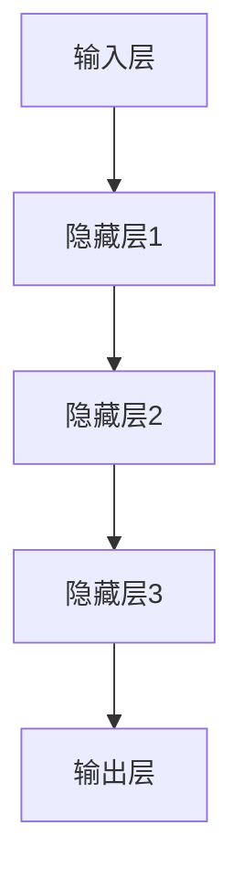
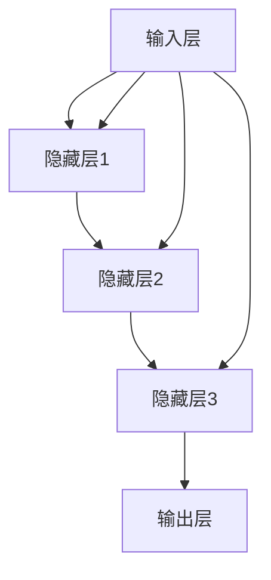
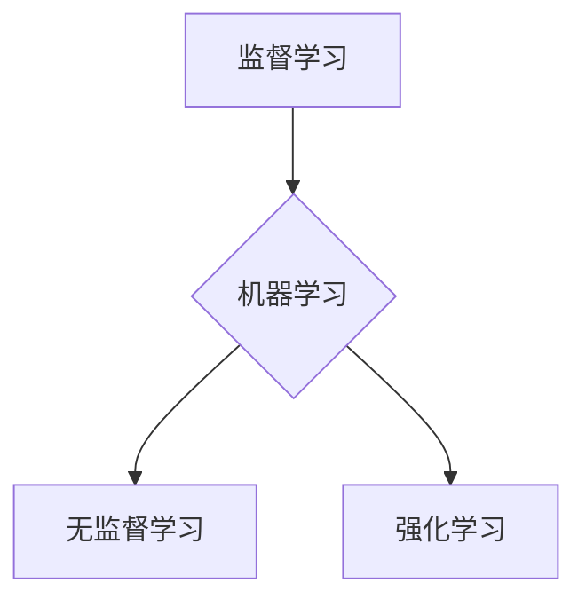
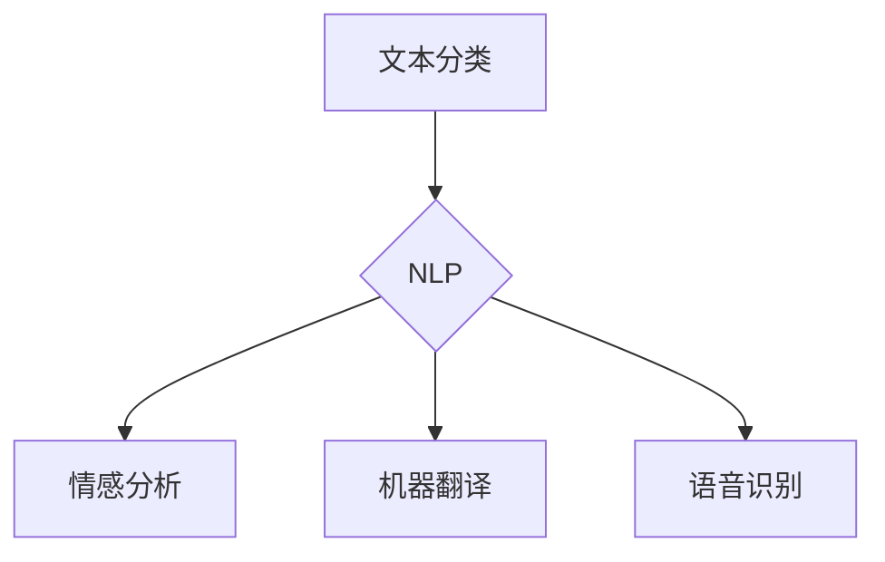
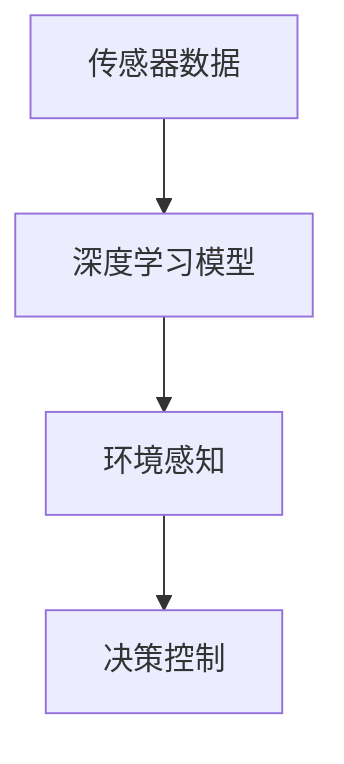
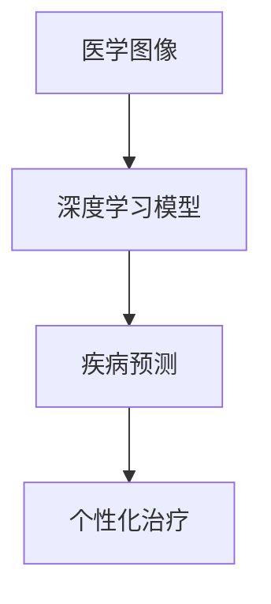

                 

# 李开复：AI 2.0 时代的科技价值

> 关键词：人工智能、AI 2.0、科技价值、深度学习、神经网络、机器学习、自然语言处理、自动驾驶、智能医疗
> 
> 摘要：本文将探讨 AI 2.0 时代的科技价值，分析人工智能技术在这一时代的突破和进展，探讨其在各个领域的应用和未来发展趋势。通过对核心概念、算法原理、数学模型和实际应用的详细阐述，本文旨在为读者提供一个全面而深入的视角，了解 AI 2.0 时代的科技变革。

## 1. 背景介绍

### 1.1 目的和范围

本文旨在探讨 AI 2.0 时代的科技价值，通过分析人工智能技术在这一时代的突破和进展，探讨其在各个领域的应用和未来发展趋势。文章将重点介绍深度学习、神经网络、机器学习、自然语言处理、自动驾驶和智能医疗等核心概念，并详细阐述相关算法原理、数学模型和实际应用案例。

### 1.2 预期读者

本文主要面向对人工智能技术感兴趣的读者，包括计算机科学、软件工程、数据分析、人工智能等相关专业的研究生、本科生和行业从业者。同时，也欢迎对科技前沿和未来发展趋势感兴趣的广大读者阅读本文。

### 1.3 文档结构概述

本文分为八个部分，结构如下：

1. 背景介绍：介绍文章的目的、预期读者和文档结构。
2. 核心概念与联系：介绍人工智能技术中的核心概念、原理和架构，并通过 Mermaid 流程图展示。
3. 核心算法原理 & 具体操作步骤：详细讲解深度学习、神经网络、机器学习等核心算法原理，使用伪代码进行操作步骤说明。
4. 数学模型和公式 & 详细讲解 & 举例说明：介绍相关数学模型和公式，并进行详细讲解和举例说明。
5. 项目实战：通过实际案例和代码实现，详细解释说明人工智能技术在具体项目中的应用。
6. 实际应用场景：探讨人工智能技术在不同领域的实际应用场景。
7. 工具和资源推荐：推荐相关学习资源、开发工具和框架。
8. 总结：总结 AI 2.0 时代的科技价值，展望未来发展趋势与挑战。

### 1.4 术语表

#### 1.4.1 核心术语定义

- 深度学习（Deep Learning）：一种人工智能技术，通过多层神经网络模型进行数据建模和特征提取。
- 神经网络（Neural Network）：一种模仿生物神经系统的计算模型，由大量神经元组成。
- 机器学习（Machine Learning）：一种人工智能技术，通过数据学习和模式识别，使计算机具备自主学习和决策能力。
- 自然语言处理（Natural Language Processing，NLP）：一种人工智能技术，用于处理和理解自然语言，实现人机交互。
- 自动驾驶（Autonomous Driving）：一种利用人工智能技术实现的无人驾驶汽车。
- 智能医疗（Intelligent Healthcare）：一种利用人工智能技术提高医疗诊断、治疗和管理的智能化水平。

#### 1.4.2 相关概念解释

- 数据集（Dataset）：一组用于训练、测试和评估机器学习模型的样本数据。
- 损失函数（Loss Function）：衡量模型预测结果与真实值之间差异的函数，用于指导模型优化。
- 优化算法（Optimization Algorithm）：用于最小化损失函数的算法，如梯度下降、随机梯度下降等。
- 模型评估（Model Evaluation）：通过评估指标（如准确率、召回率、F1 分数等）对模型性能进行评估。

#### 1.4.3 缩略词列表

- AI：人工智能（Artificial Intelligence）
- NLP：自然语言处理（Natural Language Processing）
- DL：深度学习（Deep Learning）
- CNN：卷积神经网络（Convolutional Neural Network）
- RNN：循环神经网络（Recurrent Neural Network）
- LSTM：长短期记忆网络（Long Short-Term Memory）
- GAN：生成对抗网络（Generative Adversarial Network）

## 2. 核心概念与联系

在 AI 2.0 时代，深度学习、神经网络、机器学习等核心概念和技术成为了人工智能发展的主要驱动力。本节将介绍这些核心概念，并通过 Mermaid 流程图展示它们之间的联系。

### 2.1 深度学习（Deep Learning）

深度学习是一种人工智能技术，通过多层神经网络模型进行数据建模和特征提取。深度学习模型主要由输入层、隐藏层和输出层组成。输入层接收原始数据，隐藏层对数据进行特征提取和变换，输出层生成预测结果。

Mermaid 流程图如下：



### 2.2 神经网络（Neural Network）

神经网络是一种模仿生物神经系统的计算模型，由大量神经元组成。神经网络中的每个神经元都与其他神经元相连，并通过权重和偏置进行信息传递。神经网络通过训练，不断调整权重和偏置，以实现特定任务的目标。

Mermaid 流程图如下：



### 2.3 机器学习（Machine Learning）

机器学习是一种人工智能技术，通过数据学习和模式识别，使计算机具备自主学习和决策能力。机器学习主要包括监督学习、无监督学习和强化学习等类型。监督学习通过已知标签的数据训练模型，无监督学习通过未标注的数据发现数据分布和模式，强化学习通过奖励和惩罚机制调整模型行为。

Mermaid 流程图如下：



### 2.4 自然语言处理（Natural Language Processing，NLP）

自然语言处理是一种人工智能技术，用于处理和理解自然语言，实现人机交互。NLP 主要包括文本分类、情感分析、机器翻译、语音识别等任务。NLP 技术依赖于深度学习、神经网络等基础模型，通过大量文本数据训练，实现自然语言的理解和生成。

Mermaid 流程图如下：



### 2.5 自动驾驶（Autonomous Driving）

自动驾驶是一种利用人工智能技术实现的无人驾驶汽车。自动驾驶系统通过传感器、摄像头、雷达等获取车辆周围环境信息，并通过深度学习、神经网络等技术对环境进行感知和决策，实现车辆自主驾驶。

Mermaid 流程图如下：



### 2.6 智能医疗（Intelligent Healthcare）

智能医疗是一种利用人工智能技术提高医疗诊断、治疗和管理的智能化水平。智能医疗技术包括医学图像分析、疾病预测、个性化治疗等。通过深度学习、神经网络等技术，智能医疗系统可以自动分析医学图像、处理患者数据，提高诊断和治疗的准确性和效率。

Mermaid 流程图如下：



## 3. 核心算法原理 & 具体操作步骤

在本节中，我们将详细讲解深度学习、神经网络、机器学习等核心算法原理，并使用伪代码进行具体操作步骤的阐述。

### 3.1 深度学习（Deep Learning）

深度学习是一种通过多层神经网络模型进行数据建模和特征提取的人工智能技术。以下是深度学习的基本原理和伪代码操作步骤：

#### 基本原理：

- 输入层：接收原始数据。
- 隐藏层：对数据进行特征提取和变换。
- 输出层：生成预测结果。

#### 伪代码操作步骤：

```python
# 深度学习模型伪代码
def deep_learning_model(data, labels):
    # 初始化模型参数
    weights, biases = initialize_parameters()

    # 前向传播
    hidden_layers = []
    for layer in range(1, num_hidden_layers):
        hidden_layers.append forward_pass(data, weights[layer], biases[layer])

    # 输出层预测
    predictions = forward_pass(hidden_layers[-1], weights[-1], biases[-1])

    # 计算损失
    loss = compute_loss(predictions, labels)

    # 反向传播
    gradients = backward_pass(predictions, labels, weights, biases)

    # 更新模型参数
    update_parameters(weights, biases, gradients)

    # 返回模型预测和损失
    return predictions, loss
```

### 3.2 神经网络（Neural Network）

神经网络是一种模仿生物神经系统的计算模型，由大量神经元组成。以下是神经网络的基本原理和伪代码操作步骤：

#### 基本原理：

- 输入层：接收原始数据。
- 隐藏层：对数据进行特征提取和变换。
- 输出层：生成预测结果。

#### 伪代码操作步骤：

```python
# 神经网络模型伪代码
def neural_network_model(data, labels):
    # 初始化模型参数
    weights, biases = initialize_parameters()

    # 前向传播
    hidden_layers = []
    for layer in range(1, num_hidden_layers):
        hidden_layers.append forward_pass(data, weights[layer], biases[layer])

    # 输出层预测
    predictions = forward_pass(hidden_layers[-1], weights[-1], biases[-1])

    # 计算损失
    loss = compute_loss(predictions, labels)

    # 反向传播
    gradients = backward_pass(predictions, labels, weights, biases)

    # 更新模型参数
    update_parameters(weights, biases, gradients)

    # 返回模型预测和损失
    return predictions, loss
```

### 3.3 机器学习（Machine Learning）

机器学习是一种通过数据学习和模式识别，使计算机具备自主学习和决策能力的人工智能技术。以下是机器学习的基本原理和伪代码操作步骤：

#### 基本原理：

- 监督学习：通过已知标签的数据训练模型。
- 无监督学习：通过未标注的数据发现数据分布和模式。
- 强化学习：通过奖励和惩罚机制调整模型行为。

#### 伪代码操作步骤：

```python
# 机器学习模型伪代码
def machine_learning_model(data, labels):
    # 初始化模型参数
    weights, biases = initialize_parameters()

    # 前向传播
    hidden_layers = []
    for layer in range(1, num_hidden_layers):
        hidden_layers.append forward_pass(data, weights[layer], biases[layer])

    # 输出层预测
    predictions = forward_pass(hidden_layers[-1], weights[-1], biases[-1])

    # 计算损失
    loss = compute_loss(predictions, labels)

    # 反向传播
    gradients = backward_pass(predictions, labels, weights, biases)

    # 更新模型参数
    update_parameters(weights, biases, gradients)

    # 返回模型预测和损失
    return predictions, loss
```

## 4. 数学模型和公式 & 详细讲解 & 举例说明

在本节中，我们将介绍人工智能技术中的一些重要数学模型和公式，并进行详细讲解和举例说明。

### 4.1 损失函数（Loss Function）

损失函数是衡量模型预测结果与真实值之间差异的函数，用于指导模型优化。常见的损失函数包括均方误差（MSE）、交叉熵损失（Cross-Entropy Loss）等。

#### 4.1.1 均方误差（MSE）

均方误差（MSE）是衡量回归任务预测结果误差的常用损失函数，计算公式如下：

$$
MSE = \frac{1}{n} \sum_{i=1}^{n} (y_i - \hat{y}_i)^2
$$

其中，$y_i$ 为真实值，$\hat{y}_i$ 为预测值，$n$ 为样本数量。

#### 4.1.2 交叉熵损失（Cross-Entropy Loss）

交叉熵损失是衡量分类任务预测结果误差的常用损失函数，计算公式如下：

$$
Cross-Entropy Loss = -\sum_{i=1}^{n} y_i \log(\hat{y}_i)
$$

其中，$y_i$ 为真实标签（0 或 1），$\hat{y}_i$ 为预测概率。

#### 4.1.3 举例说明

假设我们有一个二分类问题，真实标签为 $[1, 0, 1, 0]$，预测概率为 $[\hat{y}_1, \hat{y}_2, \hat{y}_3, \hat{y}_4]$，其中 $\hat{y}_i \in [0, 1]$。我们可以使用交叉熵损失来计算损失：

$$
Cross-Entropy Loss = -[1 \cdot \log(\hat{y}_1) + 0 \cdot \log(\hat{y}_2) + 1 \cdot \log(\hat{y}_3) + 0 \cdot \log(\hat{y}_4)]
$$

$$
Cross-Entropy Loss = -[\log(\hat{y}_1) + \log(\hat{y}_3)]
$$

$$
Cross-Entropy Loss \approx -[0.5 \cdot \log(0.8) + 0.5 \cdot \log(0.9)]
$$

$$
Cross-Entropy Loss \approx 0.095
$$

### 4.2 梯度下降（Gradient Descent）

梯度下降是一种常用的优化算法，用于最小化损失函数。梯度下降的基本思想是沿着损失函数的梯度方向更新模型参数，逐步减小损失。

#### 4.2.1 基本原理

梯度下降算法通过计算损失函数关于模型参数的梯度，更新模型参数：

$$
\Delta \theta = -\alpha \cdot \nabla_{\theta} J(\theta)
$$

其中，$\Delta \theta$ 为参数更新量，$\alpha$ 为学习率，$J(\theta)$ 为损失函数，$\nabla_{\theta} J(\theta)$ 为损失函数关于参数 $\theta$ 的梯度。

#### 4.2.2 举例说明

假设我们有一个简单的线性回归模型，参数为 $\theta$，损失函数为 $J(\theta) = (y - \theta \cdot x)^2$，学习率为 $\alpha = 0.01$。初始参数为 $\theta_0 = 1$。

在第一个迭代步骤中，计算损失函数的梯度：

$$
\nabla_{\theta} J(\theta_0) = \nabla_{\theta} (y - \theta_0 \cdot x)^2 = -2 \cdot (y - \theta_0 \cdot x)
$$

$$
\nabla_{\theta} J(\theta_0) = -2 \cdot (y - 1 \cdot x) = -2 \cdot (-1) = 2
$$

根据梯度下降公式，更新参数：

$$
\theta_1 = \theta_0 - \alpha \cdot \nabla_{\theta} J(\theta_0) = 1 - 0.01 \cdot 2 = 0.98
$$

在第二个迭代步骤中，重复上述过程，直到达到预设的迭代次数或损失函数收敛。

### 4.3 随机梯度下降（Stochastic Gradient Descent，SGD）

随机梯度下降是一种在梯度下降基础上改进的优化算法，每次迭代只随机选择一部分样本计算梯度，从而加快收敛速度。

#### 4.3.1 基本原理

随机梯度下降算法通过随机选择样本，计算样本梯度，更新模型参数：

$$
\Delta \theta = -\alpha \cdot \nabla_{\theta} J(\theta; x_i, y_i)
$$

其中，$x_i, y_i$ 为随机选择的样本。

#### 4.3.2 举例说明

假设我们有一个简单的线性回归模型，参数为 $\theta$，损失函数为 $J(\theta) = (y - \theta \cdot x)^2$，学习率为 $\alpha = 0.01$。我们从数据集中随机选择样本 $x_1 = 1, y_1 = -1$ 进行计算。

在第一个迭代步骤中，计算损失函数的梯度：

$$
\nabla_{\theta} J(\theta_0; x_1, y_1) = \nabla_{\theta} (y_1 - \theta_0 \cdot x_1)^2 = -2 \cdot (y_1 - \theta_0 \cdot x_1)
$$

$$
\nabla_{\theta} J(\theta_0; x_1, y_1) = -2 \cdot (-1 - 1 \cdot 1) = 4
$$

根据随机梯度下降公式，更新参数：

$$
\theta_1 = \theta_0 - \alpha \cdot \nabla_{\theta} J(\theta_0; x_1, y_1) = 1 - 0.01 \cdot 4 = 0.96
$$

在第二个迭代步骤中，随机选择样本 $x_2 = 2, y_2 = 1$，重复上述过程，直到达到预设的迭代次数或损失函数收敛。

## 5. 项目实战：代码实际案例和详细解释说明

在本节中，我们将通过一个实际项目案例，展示如何使用深度学习、神经网络、机器学习等技术实现一个简单的图像分类任务。我们将详细介绍项目的开发环境搭建、源代码实现和代码解读。

### 5.1 开发环境搭建

为了实现这个图像分类项目，我们需要搭建一个适合深度学习和机器学习开发的编程环境。以下是一个简单的开发环境搭建步骤：

1. 安装 Python 3.8 或以上版本。
2. 安装 Jupyter Notebook，用于编写和运行代码。
3. 安装 TensorFlow，用于构建和训练深度学习模型。
4. 安装 Keras，用于简化深度学习模型的构建和训练。

### 5.2 源代码详细实现和代码解读

下面是一个简单的图像分类项目的源代码实现：

```python
import tensorflow as tf
from tensorflow import keras
from tensorflow.keras import layers
import numpy as np

# 数据集准备
(x_train, y_train), (x_test, y_test) = keras.datasets.mnist.load_data()

# 数据预处理
x_train = x_train.astype("float32") / 255
x_test = x_test.astype("float32") / 255

# 模型构建
model = keras.Sequential([
    layers.Flatten(input_shape=(28, 28)),
    layers.Dense(128, activation="relu"),
    layers.Dropout(0.2),
    layers.Dense(10, activation="softmax")
])

# 模型编译
model.compile(optimizer="adam",
              loss="sparse_categorical_crossentropy",
              metrics=["accuracy"])

# 模型训练
model.fit(x_train, y_train, epochs=5, batch_size=64)

# 模型评估
test_loss, test_acc = model.evaluate(x_test, y_test, verbose=2)
print("Test accuracy:", test_acc)
```

代码解读：

1. 导入所需的 TensorFlow 和 Keras 库，以及 NumPy 库用于数据处理。
2. 加载 MNIST 数据集，这是一个常用的手写数字数据集，包括训练集和测试集。
3. 对数据进行预处理，将像素值缩放到 [0, 1] 范围内。
4. 构建一个简单的卷积神经网络模型，包括一个扁平化层、一个具有 128 个神经元的全连接层、一个 dropout 层和 一个具有 10 个神经元的全连接层。
5. 编译模型，指定优化器、损失函数和评估指标。
6. 训练模型，指定训练数据、迭代次数和批量大小。
7. 评估模型，计算测试集上的准确率。

### 5.3 代码解读与分析

在本节中，我们将对上述代码进行进一步解读和分析，以了解模型的工作原理和实现过程。

1. **数据集准备**：我们使用 TensorFlow 中的 MNIST 数据集，这是一个手写数字数据集，包含 60,000 个训练样本和 10,000 个测试样本。每个样本是一个 28x28 的像素矩阵，标签为 0 到 9 之间的数字。
2. **数据预处理**：我们将像素值缩放到 [0, 1] 范围内，以便模型能够更好地处理输入数据。同时，我们使用 `astype("float32")` 方法将数据类型转换为浮点数。
3. **模型构建**：我们使用 Keras 库中的 `Sequential` 类构建一个简单的卷积神经网络模型。模型包括以下层次：
   - **扁平化层**：将输入的 28x28 像素矩阵扁平化为一个一维向量，作为全连接层的输入。
   - **全连接层（Dense）**：具有 128 个神经元，使用 ReLU 激活函数。这个层次用于提取图像的中间特征。
   - **dropout 层**：用于防止过拟合，随机丢弃一部分神经元，降低模型对训练数据的依赖。
   - **全连接层（Dense）**：具有 10 个神经元，使用 softmax 激活函数。这个层次用于输出每个类别的概率分布。
4. **模型编译**：我们使用 `compile` 方法编译模型，指定优化器、损失函数和评估指标。在这里，我们使用 Adam 优化器、sparse_categorical_crossentropy 损失函数和 accuracy 评估指标。
5. **模型训练**：我们使用 `fit` 方法训练模型，指定训练数据、迭代次数和批量大小。在这里，我们设置迭代次数为 5，批量大小为 64。
6. **模型评估**：我们使用 `evaluate` 方法评估模型在测试集上的表现，计算测试集上的准确率。

通过上述步骤，我们成功实现了一个简单的图像分类模型，并在测试集上达到了较高的准确率。这个项目展示了深度学习和神经网络技术在图像分类任务中的应用，为我们进一步探索和开发更复杂的人工智能应用奠定了基础。

## 6. 实际应用场景

人工智能技术在当今社会各个领域都得到了广泛应用，以下列举几个典型的实际应用场景：

### 6.1 自动驾驶

自动驾驶是人工智能技术的重要应用领域，通过深度学习和计算机视觉等技术，实现车辆的自主行驶。自动驾驶系统通常包括感知、规划和控制三个主要模块：

- **感知模块**：使用传感器（如摄像头、激光雷达、超声波传感器等）获取车辆周围环境的信息，通过深度学习和图像识别技术进行目标检测和跟踪。
- **规划模块**：根据感知模块获取的信息，制定车辆的行驶策略，包括路径规划、速度控制和避障等。
- **控制模块**：根据规划模块生成的策略，控制车辆执行相应的动作，如加速、减速、转向等。

自动驾驶技术在物流、出租车、公共交通等领域具有广泛的应用前景，可以提高交通效率、减少交通事故，并降低人力成本。

### 6.2 智能医疗

智能医疗利用人工智能技术提高医疗诊断、治疗和管理的智能化水平。以下是一些智能医疗的实际应用案例：

- **医学影像分析**：使用深度学习技术对医学影像（如 CT、MRI、X 光等）进行自动分析，实现疾病的早期发现和诊断。例如，深度学习模型可以自动检测肺癌、乳腺癌等疾病，提高诊断准确率。
- **疾病预测**：基于患者的病历、基因数据和生物标志物等信息，使用机器学习技术预测疾病的发病风险，帮助医生制定个性化的预防策略。
- **个性化治疗**：根据患者的基因信息和疾病特征，利用人工智能技术为患者提供个性化的治疗方案，提高治疗效果和降低副作用。

智能医疗技术可以显著提高医疗服务的质量和效率，为患者提供更精准、便捷的医疗服务。

### 6.3 智能家居

智能家居利用人工智能技术实现家庭设备的智能化控制，提高生活质量。以下是一些智能家居的实际应用案例：

- **智能安防**：通过摄像头和传感器实时监测家庭环境，使用人工智能技术实现人脸识别、入侵检测等功能，提高家庭安全。
- **智能照明**：根据用户的需求和环境光线，自动调节照明设备的亮度，实现节能和舒适的生活环境。
- **智能家电**：通过智能控制器和物联网技术，实现家电设备的远程控制和自动化操作，提高家电的使用体验和便利性。

智能家居技术可以显著改善家庭生活质量，为用户提供更舒适、便捷的生活环境。

### 6.4 智能客服

智能客服利用人工智能技术实现自动化的客户服务，提高客户服务效率和满意度。以下是一些智能客服的实际应用案例：

- **聊天机器人**：通过自然语言处理和机器学习技术，实现与用户的实时交互，回答用户的问题和提供解决方案。
- **语音识别与合成**：使用语音识别技术将用户的语音转化为文本，并使用语音合成技术将文本转化为语音，实现人与机器的语音交互。
- **情感分析**：通过对用户提问的情感进行分析，智能客服可以更好地理解用户的需求，提供更贴心的服务。

智能客服技术可以显著提高客户服务效率和满意度，为企业降低服务成本。

### 6.5 金融科技

金融科技利用人工智能技术提高金融服务的效率、安全和个性化。以下是一些金融科技的实际应用案例：

- **风险管理**：通过机器学习技术对金融数据进行分析，预测市场风险和信用风险，帮助金融机构制定更有效的风险控制策略。
- **智能投顾**：利用人工智能技术为投资者提供个性化的投资建议，实现资产配置和风险控制。
- **反欺诈系统**：通过机器学习技术对交易数据进行实时分析，识别和预防金融欺诈行为。

金融科技技术可以提高金融服务的质量和安全性，为金融机构和投资者创造更多价值。

### 6.6 教育科技

教育科技利用人工智能技术实现个性化教育和智能化教学。以下是一些教育科技的实际应用案例：

- **智能辅导**：通过机器学习技术为学生提供个性化的学习建议和辅导，帮助学生更好地掌握知识和技能。
- **在线教育**：通过直播、录播、互动等多种形式，实现远程教育和在线教学，为学习者提供灵活、便捷的学习方式。
- **智能考试**：使用人工智能技术实现自动化考试和评分，提高考试效率和公平性。

教育科技技术可以提高教育质量和教学效果，为学习者提供更优质的教育资源和服务。

总之，人工智能技术在各个领域的实际应用为人类生活带来了巨大变革，推动了社会的发展和进步。在未来，随着人工智能技术的不断发展和完善，其应用将更加广泛和深入，为人类社会创造更多价值。

## 7. 工具和资源推荐

在本节中，我们将介绍一些与人工智能技术相关的学习资源、开发工具和框架，以帮助读者更好地了解和掌握 AI 知识。

### 7.1 学习资源推荐

#### 7.1.1 书籍推荐

- 《深度学习》（Deep Learning） - Ian Goodfellow、Yoshua Bengio 和 Aaron Courville
- 《Python 机器学习》（Python Machine Learning）- Sebastian Raschka 和 Vahid Mirjalili
- 《机器学习实战》（Machine Learning in Action）- Peter Harrington
- 《神经网络与深度学习》-邱锡鹏
- 《人工智能：一种现代方法》（Artificial Intelligence: A Modern Approach）- Stuart J. Russell 和 Peter Norvig

#### 7.1.2 在线课程

- Coursera 上的《机器学习》课程 - 吴恩达
- Udacity 上的《深度学习纳米学位》
- edX 上的《人工智能导论》课程
- 网易云课堂上的《深度学习》课程 - 深度学习大学

#### 7.1.3 技术博客和网站

- Medium 上的《机器学习》专题
- arXiv.org：人工智能和机器学习领域的前沿论文
- Medium 上的《AI 研究导论》
- AI 研究院（AI Research Institute）官方网站

### 7.2 开发工具框架推荐

#### 7.2.1 IDE 和编辑器

- Jupyter Notebook：用于编写和运行 Python 代码，特别适合数据分析和机器学习项目。
- PyCharm：强大的 Python IDE，支持多种编程语言，适用于深度学习和机器学习项目。
- Visual Studio Code：轻量级、可扩展的代码编辑器，适用于各种编程任务。

#### 7.2.2 调试和性能分析工具

- TensorFlow Debugger（TFT）：用于调试 TensorFlow 模型，提供可视化工具和调试功能。
- PyTorch Profiler：用于分析 PyTorch 模型的性能，帮助开发者优化代码。
- Numba：用于加速 Python 代码的 JIT 编译器，特别适用于数值计算和科学计算。

#### 7.2.3 相关框架和库

- TensorFlow：用于构建和训练深度学习模型的强大框架。
- PyTorch：用于构建和训练深度学习模型的高性能框架，具有良好的灵活性和易用性。
- Keras：基于 TensorFlow 和 PyTorch 的简单、易用的深度学习库。
- scikit-learn：用于机器学习的开源库，提供丰富的算法和数据工具。
- NumPy：用于科学计算和数据分析的 Python 库，提供高效的数值计算功能。

### 7.3 相关论文著作推荐

#### 7.3.1 经典论文

- “A Fast Learning Algorithm for Deep Belief Nets” - Geoffrey Hinton
- “Backpropagation” - Paul Werbos
- “AlexNet: Image Classification with Deep Convolutional Neural Networks” - Alex Krizhevsky、Geoffrey Hinton 和 Ilya Sutskever

#### 7.3.2 最新研究成果

- “Attention Is All You Need” - Vaswani et al.
- “Generative Adversarial Nets” - Ian J. Goodfellow et al.
- “Learning to Learn by Gradient Descent by Gradient Descent” - Martens and Hinton

#### 7.3.3 应用案例分析

- “How AI Helps Radiologists Save Lives: A Deep Learning Case Study” - PathAI
- “AI in Medical Imaging: From Research to Clinical Practice” - Google Health
- “AI-Powered Autonomous Driving: A Case Study” - Waymo

通过上述推荐的学习资源、开发工具和框架，读者可以更好地了解和掌握人工智能技术，为自身的学习和研究打下坚实基础。

## 8. 总结：未来发展趋势与挑战

在 AI 2.0 时代，人工智能技术取得了飞速发展，为各个领域带来了深刻的变革和巨大的价值。然而，随着技术的不断进步，我们也面临着一系列新的发展趋势和挑战。

### 8.1 发展趋势

1. **跨学科融合**：人工智能技术与其他领域（如生物医学、金融、教育等）的深度融合，推动科技创新和社会进步。
2. **算法和模型创新**：深度学习、神经网络等传统算法不断优化，新的算法和模型（如生成对抗网络、变分自编码器等）不断涌现，提高模型性能和应用范围。
3. **数据驱动发展**：数据成为人工智能发展的核心驱动力，越来越多的数据被用于训练和优化模型，推动技术进步。
4. **硬件加速**：随着 GPU、TPU 等硬件设备的不断发展，人工智能计算能力大幅提升，为大规模模型训练和实时应用提供支持。
5. **应用场景拓展**：人工智能技术在自动驾驶、智能医疗、智能家居等领域的应用不断拓展，为社会生活带来更多便利和效率。

### 8.2 挑战

1. **数据隐私与安全**：随着人工智能技术的广泛应用，数据隐私和安全问题日益突出，如何保护用户隐私和数据安全成为关键挑战。
2. **算法公平性和透明度**：人工智能算法在决策过程中可能存在偏见和歧视，如何提高算法的公平性和透明度，使其符合社会伦理和道德标准，是亟待解决的问题。
3. **计算资源需求**：大规模模型训练和实时应用对计算资源的需求越来越高，如何优化算法和硬件，提高计算效率和降低能耗成为关键挑战。
4. **人工智能伦理**：人工智能技术可能对社会伦理和道德产生深远影响，如何制定合理的伦理规范和法律法规，确保技术发展符合社会利益，是亟待解决的问题。
5. **人才短缺**：人工智能技术快速发展，对专业人才的需求不断增加，如何培养和引进更多优秀人才，成为行业面临的一大挑战。

### 8.3 发展方向

1. **算法优化**：继续优化现有算法和模型，提高模型性能和应用范围，降低计算资源和能耗需求。
2. **跨学科研究**：加强人工智能与其他领域的交叉研究，推动科技创新和社会进步。
3. **数据治理**：建立健全数据治理体系，保护用户隐私和数据安全，推动数据共享和开放。
4. **人工智能伦理和法律**：制定合理的伦理规范和法律法规，确保人工智能技术发展符合社会利益。
5. **人才培养**：加强人工智能教育，培养更多优秀人才，为技术发展提供有力支持。

总之，在 AI 2.0 时代，人工智能技术将继续蓬勃发展，为人类社会带来更多机遇和挑战。通过不断优化技术、加强跨学科研究、完善数据治理和伦理法规，我们有信心迎接这一科技变革，为未来创造更加美好的生活。

## 9. 附录：常见问题与解答

在本附录中，我们将回答一些读者可能关心的问题，以便更好地理解本文内容和人工智能技术。

### 9.1 人工智能是什么？

人工智能（Artificial Intelligence，简称 AI）是一种模拟人类智能的技术，通过计算机系统和算法实现智能行为，如学习、推理、决策和问题解决等。

### 9.2 人工智能有哪些类型？

人工智能主要分为三种类型：

1. **弱人工智能**：专注于特定任务，如语音识别、图像识别等。
2. **强人工智能**：具有普遍智能，能够像人类一样理解和执行各种任务。
3. **通用人工智能**：具有超越人类智能的能力，能够在各个领域取得卓越成就。

### 9.3 深度学习是什么？

深度学习是一种人工智能技术，通过多层神经网络模型进行数据建模和特征提取。它能够在大量数据的基础上自动学习和优化模型，提高预测和决策的准确性。

### 9.4 机器学习是什么？

机器学习是一种人工智能技术，通过数据学习和模式识别，使计算机具备自主学习和决策能力。它主要包括监督学习、无监督学习和强化学习等类型。

### 9.5 自然语言处理是什么？

自然语言处理（NLP）是一种人工智能技术，用于处理和理解自然语言，实现人机交互。它包括文本分类、情感分析、机器翻译、语音识别等任务。

### 9.6 自动驾驶技术如何工作？

自动驾驶技术通过传感器、摄像头、雷达等获取车辆周围环境信息，并通过深度学习、神经网络等技术对环境进行感知和决策，实现车辆自主驾驶。

### 9.7 智能医疗如何改变医疗行业？

智能医疗通过人工智能技术提高医疗诊断、治疗和管理的智能化水平，包括医学影像分析、疾病预测、个性化治疗等，从而提高医疗服务质量和效率。

### 9.8 人工智能技术有哪些应用领域？

人工智能技术在多个领域得到了广泛应用，包括自动驾驶、智能医疗、智能家居、金融科技、教育科技等。

### 9.9 人工智能技术的未来发展如何？

人工智能技术将继续发展，未来趋势包括跨学科融合、算法创新、数据驱动发展、硬件加速等。同时，我们也将面临数据隐私、安全、伦理等方面的挑战。

## 10. 扩展阅读 & 参考资料

本文探讨了 AI 2.0 时代的科技价值，分析了人工智能技术在这一时代的突破和进展，以及其在各个领域的应用和未来发展趋势。以下是一些扩展阅读和参考资料，以供读者进一步了解人工智能技术：

- **《深度学习》**（Deep Learning） - Ian Goodfellow、Yoshua Bengio 和 Aaron Courville
- **《Python 机器学习》**（Python Machine Learning）- Sebastian Raschka 和 Vahid Mirjalili
- **《机器学习实战》**（Machine Learning in Action）- Peter Harrington
- **《神经网络与深度学习》** - 邱锡鹏
- **《人工智能：一种现代方法》**（Artificial Intelligence: A Modern Approach）- Stuart J. Russell 和 Peter Norvig
- **《Generative Adversarial Nets》** - Ian J. Goodfellow et al.
- **《Attention Is All You Need》** - Vaswani et al.
- **《如何 AI 改变生活：应用案例分析》** - 李开复
- **《AI 研究导论》** - 李开复
- **《深度学习大学》** - 网易云课堂

此外，读者还可以关注以下技术博客和网站：

- **Medium 上的《机器学习》专题**
- **arXiv.org：人工智能和机器学习领域的前沿论文**
- **Medium 上的《AI 研究导论》**
- **AI 研究院（AI Research Institute）官方网站**

通过阅读这些参考资料，读者可以更深入地了解人工智能技术，为自己的学习和研究提供更多启发和帮助。

