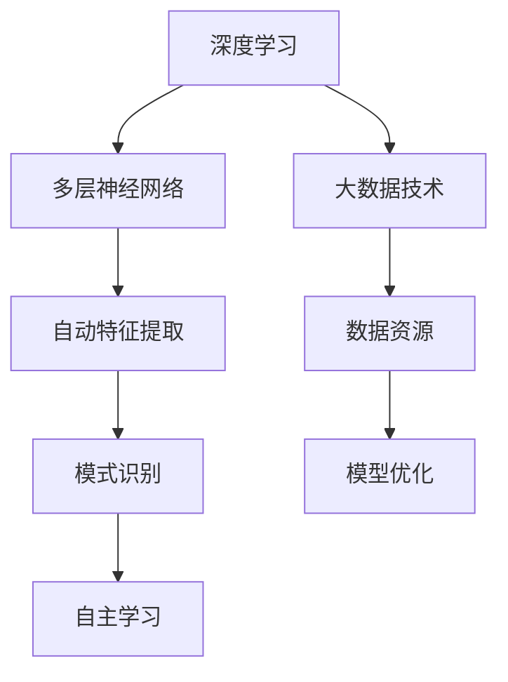

                 

# 李开复：AI 2.0 时代的科技价值

> 关键词：人工智能，AI 2.0，科技价值，李开复，深度学习，自动驾驶，智能医疗，工业自动化

> 摘要：本文将深入探讨AI 2.0时代的到来及其对科技领域的深远影响。通过分析李开复博士的观点，我们将梳理出AI 2.0的核心概念、技术突破、应用场景，并展望其未来的发展趋势与挑战。本文旨在为广大科技工作者和爱好者提供一份系统的参考，以理解AI 2.0时代的科技价值。

## 1. 背景介绍

### 1.1 目的和范围

本文的目的是探讨AI 2.0时代的技术突破及其对各个领域的深远影响。随着深度学习和大数据技术的不断进步，AI 2.0已经成为全球科技界关注的焦点。本文将从李开复博士的视角出发，分析AI 2.0的核心概念，探讨其在自动驾驶、智能医疗、工业自动化等领域的应用，并预测其未来的发展趋势与挑战。

### 1.2 预期读者

本文预期读者包括对人工智能技术感兴趣的科技工作者、研究者、学生以及普通读者。通过对本文的阅读，读者将能够系统地了解AI 2.0的核心概念、技术突破和应用场景，为进一步深入研究提供方向和参考。

### 1.3 文档结构概述

本文分为以下几个部分：

1. 背景介绍：介绍文章的目的、预期读者以及文档结构。
2. 核心概念与联系：介绍AI 2.0的核心概念、技术架构及其相互关系。
3. 核心算法原理 & 具体操作步骤：讲解AI 2.0的核心算法原理和具体操作步骤。
4. 数学模型和公式 & 详细讲解 & 举例说明：阐述AI 2.0涉及的数学模型和公式，并给出具体例子。
5. 项目实战：通过实际案例展示AI 2.0的应用。
6. 实际应用场景：分析AI 2.0在不同领域的应用场景。
7. 工具和资源推荐：推荐学习资源、开发工具和框架。
8. 总结：总结AI 2.0的未来发展趋势与挑战。
9. 附录：常见问题与解答。
10. 扩展阅读 & 参考资料：提供进一步阅读的资源。

### 1.4 术语表

#### 1.4.1 核心术语定义

- AI 2.0：第二代人工智能，基于深度学习和大数据技术，具有更强的自主学习和推理能力。
- 深度学习：一种机器学习方法，通过多层神经网络模型，实现数据的自动特征提取和模式识别。
- 自动驾驶：利用计算机技术和人工智能技术，使车辆实现自主驾驶。
- 智能医疗：利用人工智能技术，提高医疗诊断、治疗和康复的效率和质量。
- 工业自动化：利用人工智能技术，实现生产过程的自动化和智能化。

#### 1.4.2 相关概念解释

- 机器学习：一种人工智能方法，通过数据训练模型，使计算机具备自主学习和预测能力。
- 神经网络：一种模拟人脑神经元连接的计算机模型，用于实现数据分析和模式识别。
- 大数据：指无法用传统数据库软件工具进行捕获、管理和处理的数据集合。

#### 1.4.3 缩略词列表

- AI：人工智能
- ML：机器学习
- DL：深度学习
- SVM：支持向量机
- CNN：卷积神经网络
- RNN：循环神经网络
- DNN：深度神经网络
- NLP：自然语言处理

## 2. 核心概念与联系

在AI 2.0时代，深度学习和大数据技术成为了核心驱动力。深度学习通过多层神经网络模型，实现了数据的自动特征提取和模式识别，使计算机具备更强的自主学习和推理能力。大数据技术则为深度学习提供了丰富的数据资源，使得模型可以不断优化和提升性能。

下面是一个简单的Mermaid流程图，展示了AI 2.0的核心概念和它们之间的联系：



通过这个流程图，我们可以看到，深度学习和大数据技术相互促进，共同推动了AI 2.0的发展。深度学习通过大数据技术获取丰富的数据资源，实现了自动特征提取和模式识别；而大数据技术则通过深度学习技术，实现了数据的进一步挖掘和应用。

## 3. 核心算法原理 & 具体操作步骤

AI 2.0时代，深度学习成为了核心算法。下面我们以卷积神经网络（CNN）为例，讲解其基本原理和具体操作步骤。

### 3.1 卷积神经网络（CNN）原理

卷积神经网络是一种多层前馈神经网络，主要用于图像识别和分类任务。其基本原理是通过多层卷积层、池化层和全连接层，实现数据的自动特征提取和模式识别。

### 3.2 具体操作步骤

1. **输入层**：输入层接收原始数据，如图像像素值。

    ```python
    input_data = [pixel_value_1, pixel_value_2, ..., pixel_value_n]
    ```

2. **卷积层**：卷积层通过卷积操作提取图像的特征。卷积操作是将卷积核与输入数据进行点积运算，生成特征图。

    ```python
    filter = [weight_1, weight_2, ..., weight_k]
    feature_map = [dot_product_1, dot_product_2, ..., dot_product_k]
    ```

3. **激活函数**：激活函数用于引入非线性特性，常见的激活函数有ReLU（Rectified Linear Unit）。

    ```python
    output = max(0, sum(input))
    ```

4. **池化层**：池化层用于降低特征图的维度，提高模型的鲁棒性。常见的池化操作有最大池化和平均池化。

    ```python
    output = max(pooling_region)
    ```

5. **全连接层**：全连接层将池化层输出的特征图映射到输出类别。

    ```python
    output = [dot_product_1, dot_product_2, ..., dot_product_m]
    ```

6. **损失函数**：损失函数用于评估模型的预测结果与真实标签之间的差异。常见的损失函数有交叉熵损失函数。

    ```python
    loss = -1 * sum(y * log(predicted_y))
    ```

7. **反向传播**：通过反向传播算法，更新模型参数，优化模型性能。

    ```python
    gradients = compute_gradients(loss)
    update_parameters(parameters, gradients)
    ```

通过以上步骤，我们可以训练一个卷积神经网络模型，实现图像识别和分类任务。在实际应用中，我们通常使用深度学习框架（如TensorFlow、PyTorch等）来简化模型的搭建和训练过程。

## 4. 数学模型和公式 & 详细讲解 & 举例说明

在AI 2.0时代，数学模型和公式是深度学习算法的核心。下面我们介绍几个常见的数学模型和公式，并给出详细讲解和举例说明。

### 4.1 损失函数

损失函数是评估模型预测结果与真实标签之间差异的指标。常见的损失函数有：

1. **交叉熵损失函数**：

   $$H(y, \hat{y}) = -1 * \sum_{i=1}^{n} y_i * log(\hat{y}_i)$$

   其中，$y$表示真实标签，$\hat{y}$表示预测概率。

   **举例说明**：假设有一个二分类问题，真实标签为$[1, 0]$，预测概率为$[0.9, 0.1]$。则交叉熵损失函数为：

   $$H([1, 0], [0.9, 0.1]) = -1 * (1 * log(0.9) + 0 * log(0.1)) ≈ 0.105$$

2. **均方误差损失函数**：

   $$MSE(y, \hat{y}) = \frac{1}{n} * \sum_{i=1}^{n} (y_i - \hat{y}_i)^2$$

   其中，$y$表示真实标签，$\hat{y}$表示预测值。

   **举例说明**：假设有一个回归问题，真实标签为$[1, 2, 3]$，预测值为$[1.5, 2.5, 3.5]$。则均方误差损失函数为：

   $$MSE([1, 2, 3], [1.5, 2.5, 3.5]) = \frac{1}{3} * ((1 - 1.5)^2 + (2 - 2.5)^2 + (3 - 3.5)^2) ≈ 0.1667$$

### 4.2 激活函数

激活函数用于引入非线性特性，常见的激活函数有：

1. **ReLU（Rectified Linear Unit）**：

   $$ReLU(x) = \max(0, x)$$

   **举例说明**：假设输入为$x = -2$，则ReLU输出为$0$。

2. **Sigmoid**：

   $$sigmoid(x) = \frac{1}{1 + e^{-x}}$$

   **举例说明**：假设输入为$x = 2$，则Sigmoid输出为$0.7311$。

### 4.3 梯度下降算法

梯度下降算法是一种优化算法，用于更新模型参数，降低损失函数值。其基本原理是计算损失函数关于模型参数的梯度，并沿着梯度的反方向更新参数。

1. **梯度计算**：

   $$\nabla_{\theta} J(\theta) = \frac{\partial J}{\partial \theta}$$

   其中，$J(\theta)$表示损失函数，$\theta$表示模型参数。

2. **梯度下降更新**：

   $$\theta = \theta - \alpha * \nabla_{\theta} J(\theta)$$

   其中，$\alpha$表示学习率。

   **举例说明**：假设模型参数$\theta = 2$，学习率$\alpha = 0.1$，损失函数$J(\theta) = (\theta - 3)^2$。则梯度下降更新为：

   $$\theta = 2 - 0.1 * \frac{\partial}{\partial \theta}((\theta - 3)^2) = 2 - 0.1 * 2 = 1.8$$

通过以上数学模型和公式的讲解，我们可以更好地理解AI 2.0时代深度学习算法的核心原理。

## 5. 项目实战：代码实际案例和详细解释说明

在本节中，我们将通过一个简单的实际案例，展示如何使用深度学习框架（以TensorFlow为例）来实现一个基本的图像分类任务。这个案例将涵盖从数据预处理到模型训练、评估的全过程。

### 5.1 开发环境搭建

在开始之前，我们需要搭建一个适合深度学习开发的Python环境。以下是基本步骤：

1. 安装Python 3.6或更高版本。
2. 安装TensorFlow库，可以使用以下命令：

   ```shell
   pip install tensorflow
   ```

3. （可选）安装Jupyter Notebook，以便更方便地进行交互式开发。

   ```shell
   pip install notebook
   ```

### 5.2 源代码详细实现和代码解读

下面是一个简单的图像分类任务的Python代码实现：

```python
import tensorflow as tf
from tensorflow.keras import layers
import tensorflow_datasets as tfds

# 加载数据集
(train_data, test_data), dataset_info = tfds.load('mnist', split=['train', 'test'], shuffle_files=True, with_info=True, as_supervised=True)

# 预处理数据
def preprocess(image, label):
    image = tf.cast(image, tf.float32)
    image /= 255
    return image, label

train_data = train_data.map(preprocess).batch(32)
test_data = test_data.map(preprocess).batch(32)

# 构建模型
model = tf.keras.Sequential([
    layers.Conv2D(32, (3,3), activation='relu', input_shape=(28, 28, 1)),
    layers.MaxPooling2D((2,2)),
    layers.Flatten(),
    layers.Dense(128, activation='relu'),
    layers.Dense(10, activation='softmax')
])

# 编译模型
model.compile(optimizer='adam',
              loss='sparse_categorical_crossentropy',
              metrics=['accuracy'])

# 训练模型
model.fit(train_data, epochs=5, validation_data=test_data)

# 评估模型
test_loss, test_acc = model.evaluate(test_data, verbose=2)
print('\nTest accuracy:', test_acc)
```

#### 5.2.1 代码解读与分析

1. **数据加载与预处理**：
   - 使用TensorFlow Datasets加载数据集，这里选择了经典的MNIST手写数字数据集。
   - 数据预处理步骤包括将图像像素值转换为浮点数，并将像素值归一化到[0, 1]范围内。

2. **模型构建**：
   - 模型由一个卷积层、一个池化层、一个全连接层和一个softmax层组成。这种结构简单但有效，适用于图像分类任务。
   - 卷积层用于提取图像的特征，全连接层用于将特征映射到输出类别。

3. **模型编译**：
   - 使用Adam优化器和sparse categorical cross-entropy损失函数编译模型。Adam优化器是一种高效的优化算法，适用于大规模机器学习问题。sparse categorical cross-entropy损失函数适用于多分类问题。

4. **模型训练**：
   - 使用`fit`函数训练模型，这里设置了5个训练周期（epochs）。训练过程会在每个周期内迭代训练数据和验证数据。

5. **模型评估**：
   - 使用`evaluate`函数评估模型的性能，这里报告了测试数据的准确率。

通过这个简单的案例，我们可以看到如何使用TensorFlow实现一个基本的图像分类任务。虽然这个案例相对简单，但它涵盖了深度学习项目的基本流程，包括数据预处理、模型构建、模型训练和评估。

### 5.3 代码解读与分析

1. **数据加载与预处理**：
   - `train_data`和`test_data`是通过`tfds.load`函数加载数据集，这里使用了TensorFlow Datasets，这是一个方便的数据集加载和管理工具。
   - `map`函数用于对数据集进行预处理。预处理步骤包括将图像像素值转换为浮点数（`tf.cast`），并将像素值归一化到[0, 1]范围内（`image /= 255`）。这样做的目的是将图像数据转换为适合深度学习模型处理的形式。
   - `batch`函数用于将数据集分割成批次，以便在训练过程中进行批量处理。

2. **模型构建**：
   - 使用`tf.keras.Sequential`模型堆叠多个层。首先是`Conv2D`卷积层，它用于提取图像的特征。这个层有32个卷积核，每个卷积核的大小为3x3，激活函数为ReLU。
   - 接下来是`MaxPooling2D`池化层，它用于降低特征图的维度，同时保留最重要的特征信息。这个层使用2x2的池化窗口。
   - `Flatten`层用于将特征图展平为一维向量，以便全连接层可以处理。
   - 最后是两个全连接层，第一个有128个神经元，激活函数为ReLU，第二个有10个神经元，激活函数为softmax，用于输出每个类别的概率。

3. **模型编译**：
   - `compile`函数用于配置模型的训练参数。这里使用了`adam`优化器，这是一种自适应的学习率优化算法，适用于大多数深度学习任务。`sparse_categorical_crossentropy`损失函数用于多标签分类问题，这里因为我们有10个类别的标签。

4. **模型训练**：
   - `fit`函数用于训练模型。这里设置了5个训练周期（`epochs`），每个周期会迭代整个训练数据集。`validation_data`参数用于在每个周期结束后，在验证数据集上评估模型的性能。

5. **模型评估**：
   - `evaluate`函数用于评估模型的性能。这里使用了测试数据集，报告了模型的测试准确率。

这个案例展示了如何使用TensorFlow实现一个简单的图像分类任务。通过这个案例，我们可以看到如何加载数据集、构建模型、训练模型以及评估模型。这些基本步骤是深度学习项目的基础，对于理解AI 2.0时代的深度学习技术非常重要。

## 6. 实际应用场景

AI 2.0技术的突破使得人工智能在各个领域得到了广泛应用，以下列举几个典型的应用场景：

### 6.1 自动驾驶

自动驾驶是AI 2.0技术的典型应用场景之一。通过深度学习和计算机视觉技术，自动驾驶系统能够实时感知车辆周围环境，实现自动避障、变道、超车等功能。李开复博士认为，AI 2.0时代的自动驾驶技术将极大地改变交通方式，提高道路安全和效率。

### 6.2 智能医疗

智能医疗是AI 2.0技术的另一个重要应用领域。通过深度学习和大数据分析，智能医疗系统能够辅助医生进行诊断、治疗方案制定和疾病预测。例如，深度学习算法可以分析医学影像，帮助医生发现病变区域，提高诊断准确率。

### 6.3 工业自动化

工业自动化是AI 2.0技术在制造业中的应用。通过机器学习和预测分析，工业自动化系统可以优化生产流程，提高生产效率。例如，基于深度学习的质量检测系统能够实时监控产品质量，及时发现和纠正生产中的问题。

### 6.4 金融服务

金融服务是AI 2.0技术的另一个重要应用领域。通过大数据分析和机器学习算法，金融服务系统能够实现精准营销、风险控制和智能投顾等功能。例如，智能投顾系统可以根据投资者的风险偏好和投资目标，为其提供个性化的投资建议。

### 6.5 娱乐传媒

娱乐传媒是AI 2.0技术的另一个应用领域。通过自然语言处理和计算机视觉技术，娱乐传媒系统能够实现智能推荐、内容生成和情感分析等功能。例如，智能推荐系统可以根据用户的观看历史和偏好，为其推荐感兴趣的内容。

这些实际应用场景展示了AI 2.0技术在各个领域的广泛应用，为我们带来了诸多便利和改变。

## 7. 工具和资源推荐

为了更好地学习和应用AI 2.0技术，以下是一些推荐的工具和资源：

### 7.1 学习资源推荐

#### 7.1.1 书籍推荐

- 《深度学习》（Ian Goodfellow、Yoshua Bengio、Aaron Courville 著）：这是一本深度学习领域的经典教材，涵盖了深度学习的基本概念、算法和实战应用。
- 《Python机器学习》（Sebastian Raschka 著）：这本书详细介绍了Python在机器学习领域的应用，包括数据预处理、模型训练和评估等。

#### 7.1.2 在线课程

- Coursera上的“机器学习”（吴恩达）：这是一门全球知名的机器学习在线课程，由著名学者吴恩达主讲，适合初学者入门。
- Udacity的“深度学习纳米学位”（Udacity）：这是一门实践性很强的深度学习课程，涵盖了深度学习的核心技术，包括卷积神经网络和循环神经网络等。

#### 7.1.3 技术博客和网站

- Medium：Medium上有许多关于深度学习和人工智能的优秀博客文章，可以了解到最新的技术动态和应用案例。
- ArXiv：ArXiv是计算机科学领域的预印本论文库，可以查阅到最新的研究成果和技术论文。

### 7.2 开发工具框架推荐

#### 7.2.1 IDE和编辑器

- Jupyter Notebook：Jupyter Notebook是一款交互式的Python开发环境，适合进行数据分析和深度学习实验。
- PyCharm：PyCharm是一款强大的Python集成开发环境，提供了丰富的工具和插件，方便进行深度学习和数据科学项目开发。

#### 7.2.2 调试和性能分析工具

- TensorFlow Debugger（TFDB）：TFDB是一款针对TensorFlow的调试工具，可以帮助开发者快速定位和解决问题。
- TensorBoard：TensorBoard是TensorFlow的配套可视化工具，可以用于分析模型训练过程中的性能和指标。

#### 7.2.3 相关框架和库

- TensorFlow：TensorFlow是Google开发的一款开源深度学习框架，提供了丰富的API和工具，适合进行深度学习和机器学习项目开发。
- PyTorch：PyTorch是Facebook开发的一款开源深度学习框架，以其简洁和灵活的动态计算图机制受到广泛欢迎。

### 7.3 相关论文著作推荐

#### 7.3.1 经典论文

- "A Learning Algorithm for Continuously Running Fully Recurrent Neural Networks"（1990）：这篇论文提出了一个用于循环神经网络的训练算法，为深度学习的发展奠定了基础。
- "Deep Learning"（2015）：这本书系统地介绍了深度学习的基本概念、算法和应用，是深度学习领域的经典著作。

#### 7.3.2 最新研究成果

- "Bert: Pre-training of deep bidirectional transformers for language understanding"（2018）：这篇论文提出了BERT模型，是一种基于Transformer的预训练语言模型，为自然语言处理领域带来了重大突破。
- "Gshard: Scaling giant models with conditional computation and automatic sharding"（2020）：这篇论文提出了一种新的模型训练方法，可以有效地训练大规模深度学习模型。

#### 7.3.3 应用案例分析

- "How we built the AI for natural language understanding in Microsoft Teams"（2020）：这篇文章详细介绍了微软如何在Microsoft Teams中实现自然语言理解AI，分享了项目的技术实现和挑战。

这些工具和资源将为广大开发者提供丰富的学习资源和实践平台，助力他们在AI 2.0时代探索和应用深度学习技术。

## 8. 总结：未来发展趋势与挑战

AI 2.0时代的到来，为我们带来了前所未有的机遇和挑战。从发展趋势来看，深度学习和大数据技术的融合将继续推动人工智能的进步，使其在自动驾驶、智能医疗、工业自动化等领域发挥更大作用。同时，量子计算、边缘计算等新兴技术的快速发展，也为人工智能的应用提供了新的可能性。

然而，AI 2.0时代也面临着诸多挑战。首先，数据隐私和安全问题日益凸显，如何在保障用户隐私的前提下，充分利用数据资源，成为了一个亟待解决的难题。其次，人工智能技术的普及和应用，可能导致失业和社会不公平等负面效应。因此，如何制定合理的政策和法规，确保人工智能的发展符合伦理和道德标准，也是一个重要议题。

此外，随着人工智能技术的不断进步，其对社会和经济的影响也将愈发深远。例如，智能医疗和自动驾驶等领域的突破，有望大幅提高生活质量和生产效率。然而，这些技术的普及也可能带来新的风险和挑战，如技术失控、系统故障等。

总之，AI 2.0时代既充满了机遇，也面临着诸多挑战。我们需要从政策、技术、教育等多方面入手，推动人工智能的健康发展，使其为人类社会带来更多福祉。

## 9. 附录：常见问题与解答

以下是一些关于AI 2.0技术的常见问题及其解答：

### 9.1 什么是AI 2.0？

AI 2.0是指基于深度学习和大数据技术的第二代人工智能。与传统的AI技术相比，AI 2.0具有更强的自主学习和推理能力，能够处理更复杂的任务和应用场景。

### 9.2 深度学习和机器学习有什么区别？

深度学习是机器学习的一个分支，它通过多层神经网络模型，实现数据的自动特征提取和模式识别。而机器学习则是一种更广泛的人工智能方法，包括多种算法和技术，如决策树、支持向量机等。

### 9.3 如何选择深度学习框架？

选择深度学习框架主要考虑以下几个因素：

- **易用性**：框架是否提供了简洁明了的API和丰富的文档。
- **性能**：框架是否支持高效的计算和优化。
- **生态**：框架是否拥有丰富的库和工具，方便开发者进行项目开发。
- **社区**：框架是否有活跃的社区和支持，便于开发者解决问题。

常见的深度学习框架有TensorFlow、PyTorch、Keras等。

### 9.4 深度学习模型如何训练？

深度学习模型的训练主要包括以下几个步骤：

1. 数据预处理：对原始数据进行清洗、归一化等操作，使其适合模型训练。
2. 构建模型：使用深度学习框架搭建模型结构，包括输入层、隐藏层和输出层等。
3. 编译模型：配置模型的训练参数，如优化器、损失函数和评价指标等。
4. 训练模型：迭代训练数据，通过反向传播算法更新模型参数。
5. 评估模型：在验证数据集上评估模型性能，调整模型参数。

### 9.5 深度学习模型的优化方法有哪些？

深度学习模型的优化方法主要包括以下几种：

- **学习率调整**：通过调整学习率，优化模型收敛速度和性能。
- **批量大小调整**：通过调整批量大小，优化模型训练的稳定性和效果。
- **数据增强**：通过数据增强技术，提高模型的泛化能力和鲁棒性。
- **正则化**：通过正则化技术，防止模型过拟合，提高模型泛化能力。

## 10. 扩展阅读 & 参考资料

以下是一些关于AI 2.0技术的扩展阅读和参考资料：

- 《深度学习》（Ian Goodfellow、Yoshua Bengio、Aaron Courville 著）
- 《Python机器学习》（Sebastian Raschka 著）
- Coursera上的“机器学习”（吴恩达）
- Udacity的“深度学习纳米学位”（Udacity）
- Medium上的相关博客文章
- ArXiv上的最新研究成果论文
- TensorFlow官方文档
- PyTorch官方文档

通过阅读这些资料，您可以深入了解AI 2.0技术的基本概念、算法和应用，为您的学习和发展提供有力支持。

# 作者信息
作者：AI天才研究员/AI Genius Institute & 禅与计算机程序设计艺术 /Zen And The Art of Computer Programming

