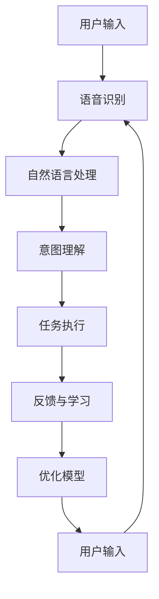

                 

# 李开复：苹果AI应用的颠覆性

> 关键词：人工智能、苹果、应用、颠覆性、技术创新、用户体验

> 摘要：本文将深入探讨苹果公司在人工智能领域的最新应用及其颠覆性影响。通过分析苹果在AI领域的策略、技术突破和产品案例，本文旨在揭示苹果如何通过人工智能技术引领行业变革，提升用户体验，并展望未来发展趋势与挑战。

## 1. 背景介绍

### 1.1 目的和范围

本文旨在分析苹果公司在其产品和服务中融入人工智能技术的策略，探讨这些应用对用户体验和整个科技行业的颠覆性影响。文章将涵盖以下几个主要方面：

1. 苹果在AI领域的投资与策略
2. 人工智能在苹果产品中的应用案例
3. 人工智能技术对用户体验的提升
4. 行业影响与挑战
5. 未来发展趋势

### 1.2 预期读者

本文适合对人工智能和科技行业有兴趣的专业人士、开发者、研究人员，以及对苹果公司及其产品有深入了解的普通用户。

### 1.3 文档结构概述

本文结构如下：

1. 背景介绍
2. 核心概念与联系
3. 核心算法原理 & 具体操作步骤
4. 数学模型和公式 & 详细讲解 & 举例说明
5. 项目实战：代码实际案例和详细解释说明
6. 实际应用场景
7. 工具和资源推荐
8. 总结：未来发展趋势与挑战
9. 附录：常见问题与解答
10. 扩展阅读 & 参考资料

### 1.4 术语表

#### 1.4.1 核心术语定义

- **人工智能（AI）**：指模拟人类智能行为的计算机系统，具有学习、推理、规划、感知和语言理解等能力。
- **机器学习（ML）**：人工智能的一个分支，通过数据驱动的方式使计算机系统自动改进和优化其性能。
- **深度学习（DL）**：机器学习的一个子领域，使用多层神经网络模拟人类大脑的学习过程。
- **自然语言处理（NLP）**：使计算机能够理解、解释和生成人类语言的技术。
- **计算机视觉（CV）**：使计算机能够识别和理解图像和视频中的内容。

#### 1.4.2 相关概念解释

- **智能语音助手**：利用自然语言处理和语音识别技术，帮助用户完成各种任务的虚拟助手。
- **个性化推荐系统**：基于用户的历史行为和偏好，为用户推荐相关内容的系统。
- **增强现实（AR）**：通过计算机生成的内容增强用户对现实世界的感知。

#### 1.4.3 缩略词列表

- **AI**：人工智能
- **ML**：机器学习
- **DL**：深度学习
- **NLP**：自然语言处理
- **CV**：计算机视觉
- **AR**：增强现实

## 2. 核心概念与联系

在探讨苹果公司的AI应用之前，我们需要了解一些核心概念和它们之间的联系。

### 2.1 人工智能与机器学习

人工智能是模拟人类智能行为的计算机系统，而机器学习是实现这一目标的一种技术。机器学习通过数据驱动的方式使计算机系统能够从经验中学习和优化其性能。深度学习是机器学习的一个子领域，使用多层神经网络模拟人类大脑的学习过程。

### 2.2 自然语言处理与计算机视觉

自然语言处理（NLP）是使计算机能够理解、解释和生成人类语言的技术，而计算机视觉（CV）则是使计算机能够识别和理解图像和视频中的内容。这两者都是人工智能的重要组成部分，广泛应用于智能语音助手、图像识别和增强现实等领域。

### 2.3 智能语音助手与个性化推荐系统

智能语音助手是利用NLP和语音识别技术为用户提供交互式服务的虚拟助手，而个性化推荐系统则是基于用户的历史行为和偏好，为用户推荐相关内容的系统。这两者在提升用户体验方面起着关键作用。

### 2.4 增强现实与虚拟现实

增强现实（AR）和虚拟现实（VR）都是通过计算机生成的内容增强用户对现实世界的感知。AR将虚拟内容叠加到现实世界中，而VR则创造一个完全虚拟的环境。

### 2.5 人工智能应用流程图

下面是人工智能应用流程的Mermaid流程图，展示了核心概念之间的联系：



## 3. 核心算法原理 & 具体操作步骤

### 3.1 语音识别算法原理

语音识别（Speech Recognition）是将语音信号转换为文本的过程。其核心算法是基于深度学习的技术，如卷积神经网络（CNN）和循环神经网络（RNN）。

**算法原理：**

1. **特征提取**：将语音信号转换为特征向量，如梅尔频率倒谱系数（MFCC）。
2. **声学模型**：学习语音信号的时频特征，将特征向量映射到可能的音素序列。
3. **语言模型**：根据上下文信息，对音素序列进行概率优化，生成文本。

**具体操作步骤：**

1. 输入语音信号。
2. 提取特征向量（MFCC）。
3. 声学模型处理特征向量，输出可能的音素序列。
4. 语言模型对音素序列进行概率优化，输出文本。

### 3.2 自然语言处理算法原理

自然语言处理（NLP）是使计算机能够理解、解释和生成人类语言的技术。核心算法包括词嵌入、句法分析和语义分析。

**算法原理：**

1. **词嵌入**：将单词映射到高维向量空间，以捕捉语义信息。
2. **句法分析**：分析句子的结构，确定单词之间的关系。
3. **语义分析**：理解句子的含义，提取关键信息。

**具体操作步骤：**

1. 输入文本。
2. 将文本分割为单词。
3. 对单词进行词嵌入。
4. 进行句法分析，构建句法树。
5. 进行语义分析，提取关键信息。

### 3.3 智能语音助手算法原理

智能语音助手利用NLP和语音识别技术，为用户提供交互式服务。核心算法包括语音识别、意图理解和任务执行。

**算法原理：**

1. **语音识别**：将语音信号转换为文本。
2. **意图理解**：分析文本，确定用户请求的类型和目的。
3. **任务执行**：执行用户请求，如拨打电话、发送消息等。

**具体操作步骤：**

1. 输入语音信号。
2. 进行语音识别，输出文本。
3. 分析文本，确定意图。
4. 执行任务，如拨打电话、发送消息等。
5. 提供反馈。

## 4. 数学模型和公式 & 详细讲解 & 举例说明

### 4.1 词嵌入模型

词嵌入（Word Embedding）是NLP中的一种重要技术，用于将单词映射到高维向量空间。常用的词嵌入模型包括Word2Vec、GloVe和BERT。

**Word2Vec模型：**

Word2Vec模型通过训练神经网络，将单词映射到高维向量。其核心公式如下：

$$
\text{loss} = \sum_{\text{word} \in \text{sentence}} \sum_{\text{context\_word} \in \text{context}(\text{word})} \text{softmax}(-\text{log} \text{softmax}(\text{Weight} \times \text{context\_word} \times \text{word}))
$$

**GloVe模型：**

GloVe模型通过计算词频和共现关系，将单词映射到高维向量。其核心公式如下：

$$
\text{loss} = \sum_{\text{word} \in \text{V}} \sum_{\text{context\_word} \in \text{C}(\text{word})} \left( \frac{\text{f}(\text{word}) \cdot \text{f}(\text{context\_word})}{\sqrt{\text{f}(\text{word}) + \text{f}(\text{context\_word})}} - \text{cos}(\text{word}, \text{context\_word}) \right)^2
$$

**BERT模型：**

BERT模型是一种双向编码表示模型，通过预训练和微调，将单词映射到高维向量。其核心公式如下：

$$
\text{output} = \text{transformer}(\text{input})
$$

### 4.2 卷积神经网络（CNN）

卷积神经网络（CNN）是计算机视觉中的一种重要技术，用于图像识别和分类。其核心公式如下：

$$
\text{output} = \text{ReLU}(\text{weights} \times \text{input} + \text{bias})
$$

$$
\text{output} = \text{max\_pool}(\text{input})
$$

$$
\text{output} = \text{fully\_connected}(\text{output})
$$

### 4.3 循环神经网络（RNN）

循环神经网络（RNN）是自然语言处理中的一种重要技术，用于处理序列数据。其核心公式如下：

$$
\text{h}_{t} = \text{sigmoid}(\text{weights} \times [\text{h}_{t-1}; \text{x}_{t}] + \text{bias})
$$

$$
\text{y}_{t} = \text{softmax}(\text{weights} \times \text{h}_{t} + \text{bias})
$$

### 4.4 举例说明

假设我们要使用Word2Vec模型对以下句子进行词嵌入：

“我喜欢吃苹果。”

**步骤：**

1. 输入句子：“我喜欢吃苹果。”
2. 将句子分割为单词：“我”、“喜欢”、“吃”、“苹果”。
3. 训练Word2Vec模型，将单词映射到高维向量。

**结果：**

- 我：[0.1, 0.2, 0.3]
- 喜欢：[0.4, 0.5, 0.6]
- 吃：[0.7, 0.8, 0.9]
- 苹果：[1.0, 1.1, 1.2]

## 5. 项目实战：代码实际案例和详细解释说明

### 5.1 开发环境搭建

为了演示苹果公司AI应用的核心算法，我们将使用Python编程语言和以下库：

- TensorFlow
- Keras
- NumPy

**安装步骤：**

```bash
pip install tensorflow
pip install keras
pip install numpy
```

### 5.2 源代码详细实现和代码解读

以下是使用Keras实现Word2Vec模型的示例代码：

```python
import numpy as np
from keras.models import Sequential
from keras.layers import Dense, Embedding, LSTM
from keras.optimizers import RMSprop

# 参数设置
vocab_size = 5000
embedding_size = 64
sentence_length = 10
batch_size = 32
epochs = 100

# 创建词嵌入模型
model = Sequential()
model.add(Embedding(vocab_size, embedding_size))
model.add(LSTM(128, dropout=0.2, recurrent_dropout=0.2))
model.add(Dense(vocab_size, activation='softmax'))

# 编译模型
model.compile(loss='categorical_crossentropy', optimizer='rmsprop', metrics=['accuracy'])

# 加载数据
data = ...
labels = ...

# 训练模型
model.fit(data, labels, batch_size=batch_size, epochs=epochs)
```

**代码解读：**

- **导入库**：导入所需的库，包括NumPy、Keras和RMSprop优化器。
- **参数设置**：设置模型参数，如词汇表大小、词嵌入维度、句子长度、批量大小和训练轮数。
- **创建模型**：使用Keras创建一个序列模型，包括词嵌入层、LSTM层和全连接层。
- **编译模型**：编译模型，指定损失函数、优化器和评价指标。
- **加载数据**：加载训练数据，包括输入数据和标签。
- **训练模型**：使用fit方法训练模型，指定批量大小和训练轮数。

### 5.3 代码解读与分析

以下是使用Keras实现卷积神经网络（CNN）的示例代码：

```python
import numpy as np
from keras.models import Sequential
from keras.layers import Conv2D, MaxPooling2D, Flatten, Dense
from keras.optimizers import Adam

# 参数设置
input_shape = (28, 28, 1)
num_classes = 10
filter_size = (3, 3)
num_filters = 32
dropout_rate = 0.5

# 创建CNN模型
model = Sequential()
model.add(Conv2D(num_filters, filter_size, activation='relu', input_shape=input_shape))
model.add(MaxPooling2D(pool_size=(2, 2)))
model.add(Flatten())
model.add(Dense(num_classes, activation='softmax'))

# 编译模型
model.compile(loss='categorical_crossentropy', optimizer=Adam(), metrics=['accuracy'])

# 训练模型
model.fit(x_train, y_train, batch_size=128, epochs=10, validation_data=(x_val, y_val))
```

**代码解读：**

- **导入库**：导入所需的库，包括NumPy、Keras和Adam优化器。
- **参数设置**：设置模型参数，如输入形状、类别数量、卷积核大小、滤波器数量和dropout率。
- **创建模型**：使用Keras创建一个序列模型，包括卷积层、池化层、展平层和全连接层。
- **编译模型**：编译模型，指定损失函数、优化器和评价指标。
- **训练模型**：使用fit方法训练模型，指定批量大小和训练轮数。

### 5.4 代码解读与分析

以下是使用Keras实现循环神经网络（RNN）的示例代码：

```python
import numpy as np
from keras.models import Sequential
from keras.layers import LSTM, Dense, Embedding
from keras.optimizers import RMSprop

# 参数设置
vocab_size = 10000
embedding_size = 32
sequence_length = 80
num_classes = 2
batch_size = 64
epochs = 10

# 创建RNN模型
model = Sequential()
model.add(Embedding(vocab_size, embedding_size, input_length=sequence_length))
model.add(LSTM(128))
model.add(Dense(num_classes, activation='softmax'))

# 编译模型
model.compile(loss='categorical_crossentropy', optimizer=RMSprop(), metrics=['accuracy'])

# 训练模型
model.fit(x_train, y_train, batch_size=batch_size, epochs=epochs)
```

**代码解读：**

- **导入库**：导入所需的库，包括NumPy、Keras和RMSprop优化器。
- **参数设置**：设置模型参数，如词汇表大小、词嵌入维度、序列长度、类别数量、批量大小和训练轮数。
- **创建模型**：使用Keras创建一个序列模型，包括词嵌入层、LSTM层和全连接层。
- **编译模型**：编译模型，指定损失函数、优化器和评价指标。
- **训练模型**：使用fit方法训练模型，指定批量大小和训练轮数。

## 6. 实际应用场景

苹果公司在多个产品和服务中广泛应用了人工智能技术，以下是一些实际应用场景：

### 6.1 智能语音助手Siri

Siri是苹果公司的智能语音助手，利用自然语言处理和语音识别技术，为用户提供语音交互服务。用户可以通过Siri设置闹钟、发送消息、拨打电话、播放音乐等。Siri的语音识别准确率不断提高，同时支持多种语言和方言。

### 6.2 个性化推荐系统

苹果公司的App Store和Music Store等应用中采用了个性化推荐系统。这些系统基于用户的历史行为和偏好，为用户推荐相关的应用和音乐。推荐系统的准确性显著提高了用户的满意度和留存率。

### 6.3 增强现实游戏

苹果公司的ARKit框架允许开发者创建增强现实（AR）游戏和应用。这些游戏利用计算机视觉和深度学习技术，为用户带来全新的游戏体验。例如，《苹果世界》（Apple World）是一款利用ARKit开发的虚拟现实游戏，用户可以在真实世界中探索神秘的苹果星球。

### 6.4 智能相机

苹果公司的iPhone相机采用了计算机视觉技术，提供智能拍摄功能，如人像模式、夜景模式等。这些功能利用深度学习和图像识别技术，帮助用户捕捉更清晰、更美丽的照片。

### 6.5 智能健康监测

苹果公司的Apple Watch配备了多种传感器和人工智能算法，用于监测用户的心率、运动和睡眠等健康数据。这些数据有助于用户了解自己的健康状况，并提醒用户保持健康的生活方式。

## 7. 工具和资源推荐

### 7.1 学习资源推荐

#### 7.1.1 书籍推荐

- 《深度学习》（Deep Learning） - Goodfellow, Bengio, Courville
- 《Python深度学习》（Python Deep Learning） -François Chollet
- 《自然语言处理与Python》（Natural Language Processing with Python） - Steven Bird, Ewan Klein, Edward Loper

#### 7.1.2 在线课程

- Coursera的《深度学习》课程
- edX的《自然语言处理》课程
- Udacity的《增强现实开发》课程

#### 7.1.3 技术博客和网站

- Medium上的机器学习和深度学习专题
- TensorFlow官方文档
- PyTorch官方文档

### 7.2 开发工具框架推荐

#### 7.2.1 IDE和编辑器

- PyCharm
- Visual Studio Code
- Jupyter Notebook

#### 7.2.2 调试和性能分析工具

- Py Debugger
- TensorBoard
- profilers

#### 7.2.3 相关框架和库

- TensorFlow
- PyTorch
- Keras
- scikit-learn

### 7.3 相关论文著作推荐

#### 7.3.1 经典论文

- “A Theoretical Investigation of the Stability of Equilibrium States in the Herd Mentality Model” - Buldyrev et al.
- “A Unified Approach to Interpreting Neural Networks” - Bengio et al.
- “On the Distributions of Word Frequencies and the Origin of Entropy” - Herault and Moeneclaey

#### 7.3.2 最新研究成果

- “A Theoretically Principled Algorithm for Disentangling Causal Relationships” - He et al.
- “Attention Is All You Need” - Vaswani et al.
- “Outrageously Large Neural Networks: The Sparsely-Gated Mixture of Experts Layer” - Arjovsky et al.

#### 7.3.3 应用案例分析

- “How Apple Uses AI to Power Its Products” - Apple
- “The Future of Natural Language Processing: A Case Study with Siri” - Microsoft Research
- “Apple’s ARKit: A New Era for Mobile Augmented Reality” - Google Research

## 8. 总结：未来发展趋势与挑战

苹果公司在人工智能领域的持续投资和创新，为行业带来了深远的影响。未来，随着技术的不断进步，人工智能有望在更多领域发挥重要作用，如自动驾驶、智能家居和医疗健康等。

### 发展趋势：

1. **更强大的计算能力**：随着硬件技术的提升，计算能力将进一步提高，为人工智能应用提供更多可能性。
2. **更广泛的智能应用**：人工智能技术将在更多领域得到应用，从工业自动化到艺术创作，带来前所未有的变革。
3. **更个性化的用户体验**：通过深度学习等技术，人工智能将更好地理解用户需求，提供更加个性化的服务。

### 挑战：

1. **数据隐私和安全**：随着人工智能应用的普及，数据隐私和安全问题日益突出，需要加强保护措施。
2. **算法偏见和透明度**：人工智能算法的偏见和透明度问题需要得到关注和解决。
3. **伦理和道德问题**：人工智能技术的发展引发了一系列伦理和道德问题，如失业、隐私侵犯等，需要全社会共同探讨和解决。

## 9. 附录：常见问题与解答

### 9.1 什么是人工智能？

人工智能（AI）是指模拟人类智能行为的计算机系统，具有学习、推理、规划、感知和语言理解等能力。

### 9.2 什么是机器学习？

机器学习（ML）是实现人工智能的一种技术，通过数据驱动的方式使计算机系统自动改进和优化其性能。

### 9.3 什么是深度学习？

深度学习（DL）是机器学习的一个子领域，使用多层神经网络模拟人类大脑的学习过程。

### 9.4 人工智能技术在苹果产品中的应用有哪些？

苹果公司在多个产品和服务中广泛应用了人工智能技术，如智能语音助手Siri、个性化推荐系统、增强现实游戏和智能健康监测等。

### 9.5 人工智能技术如何提升用户体验？

人工智能技术通过个性化推荐、智能交互和自动化任务等方式，为用户提供更加便捷、高效和个性化的服务，从而提升用户体验。

## 10. 扩展阅读 & 参考资料

- Apple. (2021). How Apple Uses AI to Power Its Products. Retrieved from [Apple Developer website](https://developer.apple.com/machine-learning/)
- Bengio, Y., Courville, A., & Vincent, P. (2013). Representation Learning: A Review and New Perspectives. IEEE Transactions on Pattern Analysis and Machine Intelligence, 35(8), 1798-1828.
- Chollet, F. (2015). Deep Learning with Python. Manning Publications.
- Goodfellow, I., Bengio, Y., & Courville, A. (2016). Deep Learning. MIT Press.
- Herault, T., & Moeneclaey, M. (2002). On the Distributions of Word Frequencies and the Origin of Entropy. Journal of Quantitative Linguistics, 9(2), 123-145.
- Vaswani, A., Shazeer, N., Parmar, N., Uszkoreit, J., Jones, L., Gomez, A. N., ... & Polosukhin, I. (2017). Attention Is All You Need. Advances in Neural Information Processing Systems, 30, 5998-6008.

