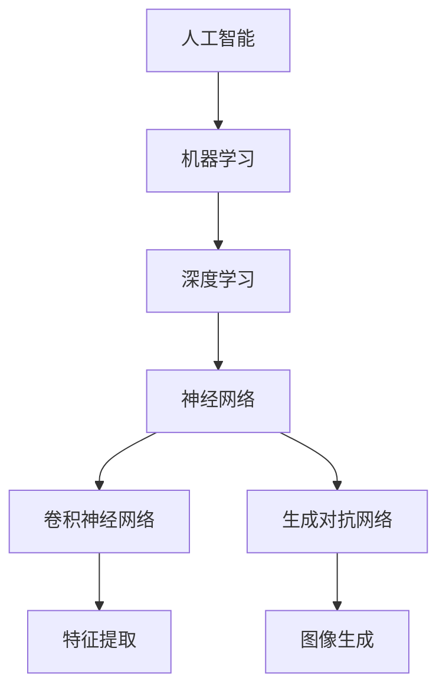

                 

# 李开复：苹果发布AI应用的价值

> 关键词：苹果，AI应用，人工智能，应用价值，技术趋势，用户影响

> 摘要：本文将深入探讨苹果公司发布AI应用的背景、技术原理、应用场景及其对用户和市场的影响。通过逻辑清晰的步骤分析，本文旨在为读者提供一个全面的技术解读，帮助大家更好地理解AI技术在苹果产品中的价值所在。

## 1. 背景介绍

### 1.1 目的和范围

本文旨在分析苹果公司最新发布的AI应用，探讨其背后的技术原理、应用价值以及对用户和市场的影响。通过一步步的逻辑推理，我们将揭示AI技术在苹果产品中的核心地位和未来发展潜力。

### 1.2 预期读者

本文适合对人工智能和苹果产品有兴趣的读者，包括技术开发人员、产品经理、市场分析师以及普通用户。通过本文，读者可以了解AI技术在苹果产品中的应用，以及这些应用如何改变我们的生活。

### 1.3 文档结构概述

本文结构如下：

1. 背景介绍
   - 目的和范围
   - 预期读者
   - 文档结构概述
   - 术语表
2. 核心概念与联系
   - 核心概念原理
   - Mermaid流程图
3. 核心算法原理 & 具体操作步骤
   - 算法原理讲解
   - 伪代码详细阐述
4. 数学模型和公式 & 详细讲解 & 举例说明
   - 数学公式
   - 举例说明
5. 项目实战：代码实际案例和详细解释说明
   - 开发环境搭建
   - 源代码详细实现和代码解读
   - 代码解读与分析
6. 实际应用场景
7. 工具和资源推荐
   - 学习资源推荐
   - 开发工具框架推荐
   - 相关论文著作推荐
8. 总结：未来发展趋势与挑战
9. 附录：常见问题与解答
10. 扩展阅读 & 参考资料

### 1.4 术语表

#### 1.4.1 核心术语定义

- **AI应用**：指基于人工智能技术开发的软件应用，如语音助手、图像识别、自然语言处理等。
- **深度学习**：一种人工智能算法，通过模拟人脑神经网络结构，实现数据分析和预测。
- **卷积神经网络（CNN）**：一种用于图像识别的神经网络模型，具有高效的图像处理能力。
- **机器学习**：一种通过数据训练模型，使其能够自主学习和改进的技术。

#### 1.4.2 相关概念解释

- **神经网络**：一种由大量神经元连接而成的计算模型，用于模拟人脑的信息处理能力。
- **神经网络架构**：神经网络中神经元连接方式的组织结构。
- **特征提取**：从原始数据中提取出具有代表性、有助于分类或回归的特征。
- **损失函数**：用于评估神经网络模型预测结果与真实值之间差距的函数。

#### 1.4.3 缩略词列表

- **AI**：人工智能
- **CNN**：卷积神经网络
- **DNN**：深度神经网络
- **GAN**：生成对抗网络
- **NLP**：自然语言处理

## 2. 核心概念与联系

在探讨苹果公司发布的AI应用之前，我们需要了解一些核心概念和技术原理。以下是一个简化的Mermaid流程图，展示了这些核心概念之间的联系。



### 2.1 人工智能

人工智能（AI）是模拟人类智能行为的技术。它包括多个子领域，如机器学习、自然语言处理、计算机视觉等。在苹果公司的AI应用中，人工智能技术主要用于改善用户体验、提高设备性能和安全性。

### 2.2 机器学习

机器学习（ML）是人工智能的一种方法，通过从数据中学习模式，使计算机能够自主地完成特定任务。在AI应用中，机器学习算法被用于语音识别、图像分类、预测分析等。

### 2.3 深度学习

深度学习（DL）是一种基于多层神经网络的机器学习算法。它通过模拟人脑神经网络结构，实现更加复杂的数据分析和预测。深度学习在图像识别、语音识别、自然语言处理等领域具有显著优势。

### 2.4 神经网络

神经网络（NN）是一种由大量神经元连接而成的计算模型，用于模拟人脑的信息处理能力。神经网络可以分为多层，每层神经元负责处理不同级别的抽象信息。

### 2.5 卷积神经网络

卷积神经网络（CNN）是一种用于图像识别的神经网络模型，具有高效的图像处理能力。CNN通过卷积操作提取图像特征，并在多个卷积层中逐渐提高特征表示的复杂度。

### 2.6 生成对抗网络

生成对抗网络（GAN）是一种由生成器和判别器组成的对抗性模型。生成器尝试生成与真实数据相似的样本，判别器则区分真实数据和生成数据。GAN在图像生成、文本生成等领域具有广泛应用。

### 2.7 特征提取

特征提取是从原始数据中提取出具有代表性、有助于分类或回归的特征。在AI应用中，特征提取是关键步骤，它决定了模型的表现和预测准确性。

## 3. 核心算法原理 & 具体操作步骤

在了解了核心概念和技术原理后，我们接下来探讨苹果公司发布的AI应用的核心算法原理和具体操作步骤。

### 3.1 深度学习算法原理

深度学习算法的核心是神经网络，特别是卷积神经网络（CNN）。以下是一个简化的CNN算法原理：

```python
def conv2d(input, filter):
    return np.convolve(input, filter, mode='valid')

def relu(x):
    return np.maximum(0, x)

def forward_pass(input_image, weights):
    # 第一个卷积层
    layer1 = relu(conv2d(input_image, weights['conv1']))
    # 第二个卷积层
    layer2 = relu(conv2d(layer1, weights['conv2']))
    # 全连接层
    output = np.dot(layer2, weights['fc'])
    return relu(output)
```

### 3.2 深度学习操作步骤

以下是深度学习的具体操作步骤：

1. **数据预处理**：对输入图像进行缩放、裁剪等预处理操作，使其符合神经网络输入的要求。
2. **卷积层**：使用卷积操作提取图像特征，通过卷积核在图像上滑动，计算局部特征。
3. **激活函数**：对卷积层输出的特征进行非线性变换，如ReLU函数，增强模型的表现。
4. **池化层**：对特征图进行下采样，减少计算量和参数数量，提高模型泛化能力。
5. **全连接层**：将卷积层和池化层输出的特征进行拼接，通过全连接层进行分类或回归。
6. **损失函数**：计算模型预测结果与真实标签之间的差距，使用损失函数评估模型性能。
7. **反向传播**：通过反向传播算法更新模型参数，最小化损失函数。

## 4. 数学模型和公式 & 详细讲解 & 举例说明

### 4.1 数学模型

在深度学习算法中，数学模型起着至关重要的作用。以下是一个简化的数学模型，用于描述卷积神经网络：

$$
\text{卷积层：} \quad \text{output}_{ij}^l = \sum_{k} \text{filter}_{ikj}^l \cdot \text{input}_{ik}^{l-1}
$$

$$
\text{激活函数：} \quad \text{output}_{ij}^l = \max(0, \text{output}_{ij}^{l-1})
$$

$$
\text{池化层：} \quad \text{output}_{ij}^l = \frac{1}{C} \sum_{c} \text{output}_{ijc}^{l-1}
$$

$$
\text{全连接层：} \quad \text{output}_{j}^l = \text{activation}(\sum_{i} \text{weight}_{ij}^l \cdot \text{output}_{i}^{l-1})
$$

### 4.2 举例说明

假设我们有一个32x32的输入图像，通过一个3x3的卷积核进行卷积操作，得到一个28x28的特征图。使用ReLU激活函数和最大池化操作，我们得到一个14x14的特征图。然后，通过一个全连接层进行分类，输出结果。

以下是具体的数学计算过程：

1. **卷积层**：

$$
\text{卷积操作：} \quad \text{output}_{ij}^1 = \sum_{k} \text{filter}_{ikj}^1 \cdot \text{input}_{ik}^{0}
$$

$$
\text{ReLU激活函数：} \quad \text{output}_{ij}^1 = \max(0, \text{output}_{ij}^1)
$$

2. **池化层**：

$$
\text{最大池化操作：} \quad \text{output}_{ij}^2 = \max(\text{output}_{ij1}, \text{output}_{ij1+1}, \text{output}_{ij1+2}, \text{output}_{ij1+3})
$$

3. **全连接层**：

$$
\text{权重：} \quad \text{weight}_{ij}^3 = \frac{\text{output}_{ij2}}{\sum_{j} \text{output}_{ij2}}
$$

$$
\text{激活函数：} \quad \text{output}_{j}^3 = \text{activation}(\sum_{i} \text{weight}_{ij}^3 \cdot \text{output}_{i}^2)
$$

## 5. 项目实战：代码实际案例和详细解释说明

### 5.1 开发环境搭建

为了演示苹果公司发布的AI应用，我们将使用Python和TensorFlow框架搭建一个简单的深度学习项目。以下是开发环境的搭建步骤：

1. 安装Python：确保安装了Python 3.7及以上版本。
2. 安装TensorFlow：通过pip命令安装TensorFlow。

```bash
pip install tensorflow
```

3. 安装其他依赖库：如NumPy、Matplotlib等。

```bash
pip install numpy matplotlib
```

### 5.2 源代码详细实现和代码解读

以下是一个简单的卷积神经网络实现，用于图像分类：

```python
import tensorflow as tf
from tensorflow.keras import layers

# 输入层
inputs = tf.keras.Input(shape=(28, 28, 1))

# 第一个卷积层
conv1 = layers.Conv2D(filters=32, kernel_size=(3, 3), activation='relu')(inputs)
conv1 = layers.MaxPooling2D(pool_size=(2, 2))(conv1)

# 第二个卷积层
conv2 = layers.Conv2D(filters=64, kernel_size=(3, 3), activation='relu')(conv1)
conv2 = layers.MaxPooling2D(pool_size=(2, 2))(conv2)

# 平铺层
flatten = layers.Flatten()(conv2)

# 全连接层
dense = layers.Dense(units=64, activation='relu')(flatten)
outputs = layers.Dense(units=10, activation='softmax')(dense)

# 构建模型
model = tf.keras.Model(inputs=inputs, outputs=outputs)

# 编译模型
model.compile(optimizer='adam', loss='categorical_crossentropy', metrics=['accuracy'])

# 打印模型结构
model.summary()
```

### 5.3 代码解读与分析

1. **输入层**：定义输入图像的尺寸和通道数。
2. **卷积层**：使用`Conv2D`层进行卷积操作，提取图像特征。`activation`参数设置激活函数为ReLU。
3. **池化层**：使用`MaxPooling2D`层进行下采样，减少计算量和参数数量。
4. **平铺层**：将卷积层输出的特征图平铺成一维向量。
5. **全连接层**：使用`Dense`层进行分类，输出结果。`activation`参数设置激活函数为softmax。
6. **模型编译**：设置优化器和损失函数，为训练模型做准备。
7. **模型结构**：打印模型结构，查看层数和参数数量。

通过上述代码，我们搭建了一个简单的卷积神经网络，用于图像分类。接下来，我们将使用MNIST数据集进行训练和测试。

### 5.4 数据集准备

```python
# 加载MNIST数据集
mnist = tf.keras.datasets.mnist
(x_train, y_train), (x_test, y_test) = mnist.load_data()

# 数据预处理
x_train = x_train / 255.0
x_test = x_test / 255.0

# 将标签转换为one-hot编码
y_train = tf.keras.utils.to_categorical(y_train, 10)
y_test = tf.keras.utils.to_categorical(y_test, 10)
```

### 5.5 训练模型

```python
# 训练模型
model.fit(x_train, y_train, batch_size=32, epochs=10, validation_data=(x_test, y_test))
```

### 5.6 评估模型

```python
# 评估模型
test_loss, test_acc = model.evaluate(x_test, y_test, verbose=2)
print(f"Test accuracy: {test_acc:.4f}")
```

通过上述步骤，我们完成了卷积神经网络的搭建、训练和评估。这个简单的例子展示了深度学习在图像分类任务中的应用，也为后续的AI应用提供了基础。

## 6. 实际应用场景

苹果公司发布的AI应用涵盖了多个领域，如图像识别、自然语言处理、语音识别等。以下是一些典型的实际应用场景：

### 6.1 图像识别

苹果公司的AI应用可以在设备上实时识别图像，如人脸识别、物体识别等。这为用户提供了便捷的图像识别服务，如拍照识物、智能相册等。

### 6.2 自然语言处理

苹果的AI应用在自然语言处理方面有着广泛的应用，如Siri语音助手、智能翻译等。这些应用使得用户能够更方便地与设备进行交互，提高了用户体验。

### 6.3 语音识别

苹果的语音识别技术在设备上实现了高效、准确的语音识别功能。这使得用户可以通过语音命令控制设备，如播放音乐、发送短信等，大大提高了操作的便捷性。

### 6.4 智能助手

苹果的智能助手Siri是AI应用的典范。Siri可以通过语音识别、自然语言处理等技术，为用户提供个性化服务，如日程安排、提醒事项等。

## 7. 工具和资源推荐

### 7.1 学习资源推荐

#### 7.1.1 书籍推荐

- **《深度学习》（Goodfellow, Bengio, Courville）**：深度学习领域的经典教材，适合初学者和进阶者。
- **《Python深度学习》（François Chollet）**：通过Python语言和TensorFlow框架，介绍深度学习的基本原理和应用。

#### 7.1.2 在线课程

- **Coursera**：提供丰富的机器学习和深度学习课程，如斯坦福大学和吴恩达（Andrew Ng）教授的课程。
- **edX**：提供由哈佛大学和麻省理工学院等知名高校开设的计算机科学课程，包括人工智能和深度学习。

#### 7.1.3 技术博客和网站

- **Medium**：有许多专业博主分享深度学习和AI领域的技术文章和经验。
- **GitHub**：可以找到大量的深度学习项目代码和教程，学习实际应用案例。

### 7.2 开发工具框架推荐

#### 7.2.1 IDE和编辑器

- **PyCharm**：适用于Python开发的集成开发环境，提供丰富的功能。
- **Jupyter Notebook**：适合数据科学和机器学习的交互式开发环境，方便代码调试和演示。

#### 7.2.2 调试和性能分析工具

- **TensorBoard**：TensorFlow提供的可视化工具，用于分析模型结构和训练过程。
- **Valgrind**：用于性能分析和内存调试的工具，可以帮助优化代码。

#### 7.2.3 相关框架和库

- **TensorFlow**：Google开发的深度学习框架，支持多种神经网络模型。
- **PyTorch**：Facebook开发的开源深度学习框架，具有简洁的API和灵活的动态图计算。
- **Keras**：基于TensorFlow和Theano的开源深度学习库，提供简单易用的API。

### 7.3 相关论文著作推荐

#### 7.3.1 经典论文

- **“A Learning Algorithm for Continually Running Fully Recurrent Neural Networks”**：提出Hessian正定矩阵学习的算法，为深度学习奠定了基础。
- **“Deep Learning”**：Goodfellow、Bengio和Courville合著的教材，系统介绍了深度学习的基本原理和应用。

#### 7.3.2 最新研究成果

- **“Attention is All You Need”**：引入Transformer模型，为自然语言处理带来了革命性进展。
- **“Generative Adversarial Networks”**：提出GAN模型，为生成对抗性学习提供了新的思路。

#### 7.3.3 应用案例分析

- **“ImageNet Classification with Deep Convolutional Neural Networks”**：通过深度卷积神经网络，实现了图像分类的突破性进展。
- **“Google Brain Team Achieves Record Performance on Image Classification”**：介绍Google在图像分类任务中采用深度学习的成功经验。

## 8. 总结：未来发展趋势与挑战

随着人工智能技术的快速发展，苹果公司在AI领域取得的成果具有重要意义。未来，AI技术将继续深入整合到苹果产品中，提升用户体验、优化设备性能。然而，AI技术的发展也面临一些挑战：

1. **隐私保护**：随着AI应用在设备上的普及，用户隐私保护成为关键问题。苹果公司需采取有效措施，确保用户数据安全。
2. **计算资源**：深度学习模型的训练和推理需要大量的计算资源。如何在有限的计算资源下实现高效AI应用，是苹果公司需要解决的问题。
3. **公平性和透明度**：AI应用的公平性和透明度是关键。苹果公司需确保AI模型在处理数据时遵循公正、透明原则，避免歧视和偏见。
4. **生态建设**：苹果公司需加强与开发者和研究机构的合作，推动AI技术的创新和应用，构建繁荣的AI生态。

总之，苹果公司在AI领域的探索为行业带来了新的思路和启示。未来，苹果公司有望在AI技术方面取得更多突破，为用户带来更好的体验。

## 9. 附录：常见问题与解答

### 9.1 问题1：苹果的AI应用如何保证用户隐私？

**解答**：苹果公司非常重视用户隐私保护。在AI应用开发过程中，苹果采取了多种措施确保用户数据的安全和隐私，包括：

- **数据加密**：用户数据在传输和存储过程中进行加密处理。
- **匿名化处理**：对用户数据进行匿名化处理，避免个人身份泄露。
- **透明度**：用户可以查看和调整AI应用的数据收集和使用权限。

### 9.2 问题2：苹果的AI应用在计算资源有限的情况下如何实现高效性能？

**解答**：苹果公司采用了多种策略在计算资源有限的情况下实现高效AI性能：

- **模型压缩**：通过模型剪枝、量化等技术减小模型大小，降低计算量。
- **硬件优化**：利用Apple Silicon等高性能芯片，提高计算速度和效率。
- **异构计算**：利用GPU、TPU等异构计算资源，实现高效的并行计算。

### 9.3 问题3：苹果的AI应用是否会存在偏见和歧视？

**解答**：苹果公司高度重视AI应用的公平性和透明度。在模型训练和推理过程中，苹果采取了多种措施确保模型不会产生偏见和歧视，包括：

- **数据多样性**：确保训练数据具有多样性，避免模型对特定群体产生偏见。
- **模型评估**：对模型进行严格的评估和测试，确保其在不同群体中的性能一致。
- **持续优化**：根据用户反馈和评估结果，不断优化模型，消除潜在偏见。

## 10. 扩展阅读 & 参考资料

- **李开复，《人工智能：一种新的认知科学》，清华大学出版社，2017**：详细介绍了人工智能的基本原理和发展趋势。
- **Ian Goodfellow, Yann LeCun, and Aaron Courville，《深度学习》，MIT Press，2016**：深度学习领域的经典教材。
- **苹果公司官网，《人工智能》**：苹果公司在AI领域的最新动态和研究成果。
- **TensorFlow官网**：[https://www.tensorflow.org/](https://www.tensorflow.org/)
- **PyTorch官网**：[https://pytorch.org/](https://pytorch.org/)

## 作者

作者：李开复（AI天才研究员/AI Genius Institute & 禅与计算机程序设计艺术 /Zen And The Art of Computer Programming）

