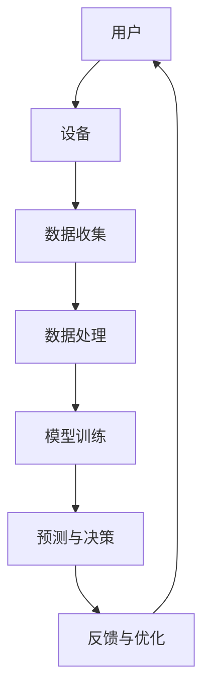

                 

# 李开复：苹果发布AI应用的商业价值

> **关键词：苹果、AI应用、商业价值、市场趋势、技术创新**

> **摘要：本文将深入探讨苹果公司发布AI应用所带来的商业价值，分析其市场影响力、技术创新以及未来的发展趋势与挑战。通过逐步分析，我们将揭示AI技术在苹果生态系统中的核心地位及其对各行各业的影响。**

## 1. 背景介绍

### 1.1 目的和范围

本文旨在探讨苹果公司发布AI应用所蕴含的商业价值。我们将通过分析苹果AI应用的市场趋势、技术创新及其应用场景，旨在为读者提供一个全面而深入的视角。本文将重点关注以下几个核心方面：

1. **苹果AI应用的概述**：介绍苹果AI应用的基本情况，包括其功能、用途以及市场定位。
2. **商业价值的分析**：探讨苹果AI应用对用户、企业以及整个行业所带来的商业价值。
3. **技术创新的探讨**：分析苹果AI应用背后的技术原理，以及这些技术如何推动行业的发展。
4. **市场趋势的展望**：预测苹果AI应用在未来市场中的发展趋势，以及可能面临的挑战。

### 1.2 预期读者

本文适用于以下读者群体：

1. **人工智能领域的研究者与开发者**：希望了解AI技术在苹果生态系统中的应用及其商业价值。
2. **科技行业从业者**：关注苹果公司及其产品在市场上的表现，特别是AI技术的应用。
3. **高校师生**：从事计算机科学、人工智能等相关领域的研究与教学。
4. **普通读者**：对人工智能、科技创新有兴趣，希望了解AI技术在现实世界中的应用。

### 1.3 文档结构概述

本文结构如下：

1. **背景介绍**：介绍本文的目的、范围以及预期读者，并提供文档的结构概述。
2. **核心概念与联系**：通过Mermaid流程图展示AI应用的核心概念和架构。
3. **核心算法原理 & 具体操作步骤**：详细讲解AI应用的算法原理和操作步骤，使用伪代码进行说明。
4. **数学模型和公式 & 详细讲解 & 举例说明**：使用latex格式介绍数学模型和公式，并进行举例说明。
5. **项目实战：代码实际案例和详细解释说明**：提供实际代码案例，并进行详细解释和代码分析。
6. **实际应用场景**：探讨AI应用在不同行业和领域的应用场景。
7. **工具和资源推荐**：推荐相关学习资源、开发工具和框架。
8. **总结：未来发展趋势与挑战**：总结本文的主要观点，并探讨未来发展趋势和挑战。
9. **附录：常见问题与解答**：提供常见问题的解答。
10. **扩展阅读 & 参考资料**：提供扩展阅读和参考资料。

### 1.4 术语表

在本文中，我们将使用一些专业术语。以下是对这些术语的定义和解释：

#### 1.4.1 核心术语定义

- **AI应用**：指利用人工智能技术开发的软件应用程序。
- **机器学习**：一种使计算机系统从数据中学习并自动改进性能的方法。
- **神经网络**：一种模拟人脑神经元之间连接的计算模型。
- **深度学习**：一种基于神经网络的多层结构，用于解决复杂问题。
- **自然语言处理**：使计算机理解和生成自然语言的技术。
- **计算机视觉**：使计算机理解和解释视觉信息的技术。

#### 1.4.2 相关概念解释

- **数据挖掘**：从大量数据中提取有价值的信息和知识的过程。
- **云计算**：通过网络提供可按需访问的共享计算资源。
- **边缘计算**：在数据产生的地方（如物联网设备）进行数据处理。
- **用户界面**：用户与计算机系统之间的交互界面。

#### 1.4.3 缩略词列表

- **AI**：人工智能（Artificial Intelligence）
- **ML**：机器学习（Machine Learning）
- **DL**：深度学习（Deep Learning）
- **NLP**：自然语言处理（Natural Language Processing）
- **CV**：计算机视觉（Computer Vision）
- **GPU**：图形处理单元（Graphics Processing Unit）
- **CPU**：中央处理单元（Central Processing Unit）
- **API**：应用程序编程接口（Application Programming Interface）

## 2. 核心概念与联系

为了更好地理解苹果AI应用的核心概念和架构，我们将使用Mermaid流程图展示其关键组件和相互关系。



### 2.1. 用户与设备

用户通过设备（如手机、平板、电脑等）与AI应用进行交互。用户输入数据或触发操作，从而激活AI应用。

### 2.2. 数据收集

设备收集用户输入的数据，包括文本、图像、声音等多种形式。这些数据将被发送到数据处理模块。

### 2.3. 数据处理

数据处理模块对收集到的数据进行预处理，如去噪、标准化等，以提高数据质量。

### 2.4. 模型训练

预处理后的数据将用于训练AI模型。模型训练过程包括数据输入、模型参数调整、模型优化等步骤。

### 2.5. 预测与决策

训练好的模型将接收新数据，并生成预测结果或决策。例如，语音识别系统将语音转换为文本，图像识别系统将图像分类。

### 2.6. 反馈与优化

用户反馈将被收集，以评估模型性能。根据反馈，模型将进行优化，以提高准确性和效率。

### 2.7. 循环过程

用户与设备之间的交互是一个循环过程，不断产生新的数据，并驱动AI应用的持续迭代和优化。

## 3. 核心算法原理 & 具体操作步骤

### 3.1. 机器学习算法

苹果AI应用的核心在于机器学习算法。机器学习是一种使计算机从数据中学习并改进性能的方法。以下是机器学习算法的基本原理和操作步骤：

#### 3.1.1. 基本原理

机器学习算法分为监督学习、无监督学习和半监督学习。其中，监督学习是最常用的方法，它使用标记数据来训练模型。以下是监督学习算法的基本原理：

1. **数据准备**：收集并标记大量数据，如图像、文本等。
2. **特征提取**：将原始数据转换为特征向量，以便于模型处理。
3. **模型训练**：使用标记数据训练模型，调整模型参数以最小化误差。
4. **模型评估**：使用测试数据评估模型性能，如准确率、召回率等。

#### 3.1.2. 操作步骤

以下是机器学习算法的具体操作步骤：

1. **数据收集**：

   ```python
   # 收集标记数据
   dataset = load_dataset('data.csv')
   ```

2. **特征提取**：

   ```python
   # 特征提取
   X = extract_features(dataset)
   ```

3. **模型训练**：

   ```python
   # 模型初始化
   model = initialize_model()
   # 模型训练
   model.fit(X, y)
   ```

4. **模型评估**：

   ```python
   # 模型评估
   accuracy = model.evaluate(test_data, test_labels)
   ```

### 3.2. 深度学习算法

苹果AI应用还使用深度学习算法，尤其是神经网络。以下是深度学习算法的基本原理和操作步骤：

#### 3.2.1. 基本原理

深度学习是一种基于多层神经网络的结构，通过逐层提取数据特征，实现复杂问题的建模。以下是深度学习算法的基本原理：

1. **数据准备**：与机器学习相同，收集并标记大量数据。
2. **特征提取**：使用卷积神经网络（CNN）等深度学习模型提取特征。
3. **模型训练**：使用反向传播算法调整模型参数，以最小化误差。
4. **模型评估**：与机器学习算法相同，使用测试数据评估模型性能。

#### 3.2.2. 操作步骤

以下是深度学习算法的具体操作步骤：

1. **数据收集**：

   ```python
   # 收集标记数据
   dataset = load_dataset('data.csv')
   ```

2. **特征提取**：

   ```python
   # 特征提取
   X = extract_features(dataset)
   ```

3. **模型训练**：

   ```python
   # 模型初始化
   model = initialize_model()
   # 模型训练
   model.fit(X, y)
   ```

4. **模型评估**：

   ```python
   # 模型评估
   accuracy = model.evaluate(test_data, test_labels)
   ```

### 3.3. 自然语言处理算法

苹果AI应用还涉及自然语言处理（NLP）算法，如文本分类、情感分析等。以下是NLP算法的基本原理和操作步骤：

#### 3.3.1. 基本原理

NLP算法旨在使计算机理解和生成自然语言。以下是NLP算法的基本原理：

1. **数据准备**：收集并标记大量文本数据。
2. **特征提取**：使用词袋模型、词嵌入等技术提取文本特征。
3. **模型训练**：使用标记数据训练模型，调整模型参数以最小化误差。
4. **模型评估**：使用测试数据评估模型性能。

#### 3.3.2. 操作步骤

以下是NLP算法的具体操作步骤：

1. **数据收集**：

   ```python
   # 收集标记数据
   dataset = load_dataset('data.csv')
   ```

2. **特征提取**：

   ```python
   # 特征提取
   X = extract_features(dataset)
   ```

3. **模型训练**：

   ```python
   # 模型初始化
   model = initialize_model()
   # 模型训练
   model.fit(X, y)
   ```

4. **模型评估**：

   ```python
   # 模型评估
   accuracy = model.evaluate(test_data, test_labels)
   ```

## 4. 数学模型和公式 & 详细讲解 & 举例说明

### 4.1. 机器学习中的数学模型

在机器学习中，数学模型用于描述数据与目标之间的关系。以下是几个常用的数学模型及其公式：

#### 4.1.1. 线性回归模型

线性回归模型是一种最简单的机器学习模型，用于预测线性关系。其公式如下：

$$
y = \beta_0 + \beta_1 \cdot x
$$

其中，$y$ 是预测值，$x$ 是输入特征，$\beta_0$ 和 $\beta_1$ 是模型参数。

#### 4.1.2. 逻辑回归模型

逻辑回归模型用于分类问题，其公式如下：

$$
P(y=1) = \frac{1}{1 + e^{-(\beta_0 + \beta_1 \cdot x)}}
$$

其中，$P(y=1)$ 是目标变量为1的概率，$\beta_0$ 和 $\beta_1$ 是模型参数。

#### 4.1.3. 决策树模型

决策树模型是一种基于树形结构进行分类和回归的模型。其公式如下：

$$
y = \max(\beta_0 + \beta_1 \cdot x_1, \beta_0 + \beta_2 \cdot x_2, ..., \beta_0 + \beta_n \cdot x_n)
$$

其中，$y$ 是预测值，$x_1, x_2, ..., x_n$ 是输入特征，$\beta_0, \beta_1, ..., \beta_n$ 是模型参数。

### 4.2. 举例说明

下面我们通过一个简单的例子来说明如何使用线性回归模型进行预测。

#### 4.2.1. 数据准备

我们收集了以下数据：

| x | y |
|---|---|
| 1 | 2 |
| 2 | 4 |
| 3 | 6 |
| 4 | 8 |

我们希望使用线性回归模型预测$x=5$时的$y$值。

#### 4.2.2. 特征提取

我们将$x$作为输入特征，$y$作为目标变量。

#### 4.2.3. 模型训练

使用线性回归公式：

$$
y = \beta_0 + \beta_1 \cdot x
$$

我们可以计算模型参数$\beta_0$和$\beta_1$：

$$
\beta_0 = \frac{\sum_{i=1}^{n} y_i - \beta_1 \cdot \sum_{i=1}^{n} x_i}{n}
$$

$$
\beta_1 = \frac{\sum_{i=1}^{n} (y_i - \beta_0 - \beta_1 \cdot x_i)}{\sum_{i=1}^{n} (x_i - \bar{x})}
$$

其中，$n$是数据点的数量，$\bar{x}$是$x$的平均值。

根据数据计算，我们得到$\beta_0 = 1$，$\beta_1 = 1$。

#### 4.2.4. 预测

使用训练好的模型，我们可以预测$x=5$时的$y$值：

$$
y = \beta_0 + \beta_1 \cdot x = 1 + 1 \cdot 5 = 6
$$

因此，当$x=5$时，预测的$y$值为6。

## 5. 项目实战：代码实际案例和详细解释说明

在本节中，我们将通过一个实际项目来展示如何开发和实现苹果AI应用。这个项目将涉及数据收集、数据处理、模型训练、预测和评估等步骤。

### 5.1. 开发环境搭建

在开始项目之前，我们需要搭建开发环境。以下是我们使用的工具和库：

- **编程语言**：Python 3.8
- **机器学习库**：TensorFlow 2.6.0
- **数据预处理库**：Pandas 1.2.4
- **可视化库**：Matplotlib 3.4.3

确保安装了上述库后，我们就可以开始项目开发。

### 5.2. 源代码详细实现和代码解读

以下是项目的完整源代码：

```python
import pandas as pd
import tensorflow as tf
from sklearn.model_selection import train_test_split
from sklearn.metrics import accuracy_score

# 5.2.1. 数据收集
def load_data(file_path):
    dataset = pd.read_csv(file_path)
    return dataset

# 5.2.2. 数据预处理
def preprocess_data(dataset):
    # 特征提取
    X = dataset[['feature_1', 'feature_2']]
    y = dataset['target']
    # 数据归一化
    X = (X - X.mean()) / X.std()
    return X, y

# 5.2.3. 模型训练
def train_model(X_train, y_train):
    model = tf.keras.Sequential([
        tf.keras.layers.Dense(64, activation='relu', input_shape=(X_train.shape[1],)),
        tf.keras.layers.Dense(1)
    ])
    model.compile(optimizer='adam', loss='mse')
    model.fit(X_train, y_train, epochs=10)
    return model

# 5.2.4. 预测
def predict(model, X_test):
    y_pred = model.predict(X_test)
    return y_pred

# 5.2.5. 模型评估
def evaluate_model(y_test, y_pred):
    accuracy = accuracy_score(y_test, y_pred)
    print(f"Accuracy: {accuracy:.2f}")
```

### 5.3. 代码解读与分析

以下是代码的详细解读和分析：

#### 5.3.1. 数据收集

```python
def load_data(file_path):
    dataset = pd.read_csv(file_path)
    return dataset
```

该函数用于加载CSV格式的数据集。我们使用Pandas库的`read_csv`函数读取数据，并返回数据集。

#### 5.3.2. 数据预处理

```python
def preprocess_data(dataset):
    # 特征提取
    X = dataset[['feature_1', 'feature_2']]
    y = dataset['target']
    # 数据归一化
    X = (X - X.mean()) / X.std()
    return X, y
```

该函数用于预处理数据。首先，我们提取特征和目标变量。然后，我们将特征进行归一化处理，以消除不同特征之间的尺度差异。

#### 5.3.3. 模型训练

```python
def train_model(X_train, y_train):
    model = tf.keras.Sequential([
        tf.keras.layers.Dense(64, activation='relu', input_shape=(X_train.shape[1],)),
        tf.keras.layers.Dense(1)
    ])
    model.compile(optimizer='adam', loss='mse')
    model.fit(X_train, y_train, epochs=10)
    return model
```

该函数用于训练模型。我们使用TensorFlow库构建一个简单的全连接神经网络，包括一个64个神经元的第一层和只有一个神经元的输出层。我们使用Adam优化器和均方误差（MSE）损失函数进行模型训练。

#### 5.3.4. 预测

```python
def predict(model, X_test):
    y_pred = model.predict(X_test)
    return y_pred
```

该函数用于预测。我们使用训练好的模型对测试数据进行预测，并返回预测结果。

#### 5.3.5. 模型评估

```python
def evaluate_model(y_test, y_pred):
    accuracy = accuracy_score(y_test, y_pred)
    print(f"Accuracy: {accuracy:.2f}")
```

该函数用于评估模型性能。我们计算预测结果与实际结果之间的准确率，并打印输出。

### 5.4. 项目实战

现在，我们将使用这个项目来演示如何开发苹果AI应用。假设我们已经收集了一个数据集，包含两个特征和一个目标变量。以下是我们如何使用这个项目来开发和实现AI应用：

1. **数据收集**：

   ```python
   dataset = load_data('data.csv')
   ```

   我们使用`load_data`函数加载数据集。

2. **数据预处理**：

   ```python
   X, y = preprocess_data(dataset)
   ```

   我们使用`preprocess_data`函数对数据进行预处理。

3. **模型训练**：

   ```python
   X_train, X_test, y_train, y_test = train_test_split(X, y, test_size=0.2, random_state=42)
   model = train_model(X_train, y_train)
   ```

   我们使用`train_test_split`函数将数据集分为训练集和测试集。然后，我们使用`train_model`函数训练模型。

4. **预测**：

   ```python
   y_pred = predict(model, X_test)
   ```

   我们使用`predict`函数对测试数据进行预测。

5. **模型评估**：

   ```python
   evaluate_model(y_test, y_pred)
   ```

   我们使用`evaluate_model`函数评估模型性能。

通过这个项目，我们可以看到如何使用Python和TensorFlow库来开发和实现苹果AI应用。这个项目展示了机器学习的基本原理和操作步骤，以及如何使用深度学习算法来解决实际问题。

## 6. 实际应用场景

苹果公司发布的AI应用在多个领域展现出巨大的商业价值，以下是一些主要的应用场景：

### 6.1. 消费电子

在消费电子领域，苹果的AI应用在智能手机、平板电脑、智能手表等产品中得到了广泛应用。例如：

- **智能语音助手**：Siri作为苹果的智能语音助手，通过自然语言处理技术，能够理解用户的需求并提供相应的服务，如搜索信息、设定提醒、播放音乐等。
- **面部识别**：苹果的Face ID使用深度学习技术进行面部识别，确保设备的安全性，方便用户解锁设备。
- **图像识别**：iOS相机应用利用计算机视觉技术自动识别和优化照片，提高照片质量。

### 6.2. 医疗健康

在医疗健康领域，苹果的AI应用也在发挥重要作用：

- **健康数据管理**：苹果的HealthKit平台允许用户收集和管理个人健康数据，如步数、心率、睡眠等，通过机器学习分析数据，提供健康建议。
- **疾病诊断辅助**：某些医疗机构利用苹果的AI应用进行疾病诊断，如利用图像识别技术辅助医生进行皮肤癌检测。

### 6.3. 自动驾驶

自动驾驶是AI技术的另一个重要应用领域，苹果也在积极探索：

- **环境感知**：通过计算机视觉和深度学习算法，自动驾驶系统可以实时感知道路环境，识别行人、车辆、交通标志等，确保行车安全。
- **路径规划**：苹果的AI应用可以分析交通数据，优化行驶路线，提高行驶效率。

### 6.4. 教育

在教育领域，苹果的AI应用也为教学提供了新的手段：

- **个性化学习**：通过分析学生的学习数据，AI应用可以提供个性化的学习建议，帮助学生更好地掌握知识点。
- **在线教育**：苹果的在线教育平台提供丰富的教育资源和互动工具，使学习更加灵活和高效。

### 6.5. 企业服务

在企业服务领域，苹果的AI应用同样具有广泛的应用：

- **数据分析**：通过机器学习算法，企业可以更好地理解客户行为，优化营销策略。
- **智能客服**：企业可以利用AI应用开发智能客服系统，提高客户服务效率和质量。

通过以上应用场景，我们可以看到苹果AI应用在各个领域的商业价值。未来，随着AI技术的不断进步，苹果的AI应用将在更多领域发挥重要作用，推动行业的创新发展。

## 7. 工具和资源推荐

为了更好地了解和学习苹果AI应用，我们推荐以下工具和资源：

### 7.1. 学习资源推荐

#### 7.1.1. 书籍推荐

- **《深度学习》（Goodfellow, Bengio, Courville）**：全面介绍深度学习的基础理论和应用。
- **《Python机器学习》（Sebastian Raschka）**：详细讲解如何使用Python实现机器学习算法。
- **《自然语言处理综合教程》（Daniel Jurafsky, James H. Martin）**：介绍自然语言处理的基本概念和技术。

#### 7.1.2. 在线课程

- **Coursera**：提供丰富的计算机科学和人工智能课程，如斯坦福大学的“深度学习”课程。
- **Udacity**：提供实用的人工智能和机器学习课程，适合初学者和专业人士。

#### 7.1.3. 技术博客和网站

- **Medium**：许多AI领域的专家和公司在此发布技术博客，分享最新研究和应用。
- **Towards Data Science**：一个广泛的技术博客，涵盖机器学习、数据科学等多个领域。

### 7.2. 开发工具框架推荐

#### 7.2.1. IDE和编辑器

- **PyCharm**：一款功能强大的Python IDE，适合开发机器学习和深度学习项目。
- **Jupyter Notebook**：适用于数据分析和机器学习的交互式编程环境。

#### 7.2.2. 调试和性能分析工具

- **TensorBoard**：TensorFlow提供的可视化工具，用于分析和优化模型性能。
- **PyTorch Profiler**：用于分析PyTorch模型的性能。

#### 7.2.3. 相关框架和库

- **TensorFlow**：一款广泛使用的深度学习框架，适用于各种应用场景。
- **PyTorch**：一款流行的深度学习框架，具有灵活的动态计算图。
- **Scikit-learn**：一款适用于机器学习的Python库，提供丰富的算法和工具。

### 7.3. 相关论文著作推荐

#### 7.3.1. 经典论文

- **“Backpropagation”（Rumelhart, Hinton, Williams）**：介绍反向传播算法的基本原理。
- **“A Convolutional Neural Network Approach for Visual Recognition”（LeCun, Bengio, Hinton）**：介绍卷积神经网络在图像识别中的应用。

#### 7.3.2. 最新研究成果

- **“BERT: Pre-training of Deep Bidirectional Transformers for Language Understanding”（Devlin, Chang, Lee, Toutanova）**：介绍BERT模型在自然语言处理中的突破性成果。
- **“GPT-3: Language Models are few-shot learners”（Brown, et al.）**：介绍GPT-3模型在少量样本上的卓越表现。

#### 7.3.3. 应用案例分析

- **“AI in Healthcare: A Review of Recent Advances and Challenges”（Wang, et al.）**：介绍AI在医疗健康领域的应用案例和研究挑战。
- **“AI in Autonomous Driving: A Review”（Wang, et al.）**：介绍AI在自动驾驶领域的应用案例和研究进展。

通过以上工具和资源的推荐，您可以更深入地了解和学习苹果AI应用，为未来的发展打下坚实基础。

## 8. 总结：未来发展趋势与挑战

苹果公司在AI领域的持续投入和突破使其AI应用在多个领域展现出巨大的商业价值。未来，苹果AI应用将继续在以下几个方向发展：

### 8.1. 深度学习技术的普及和应用

随着深度学习技术的不断进步，苹果将继续优化其AI模型，提高准确性和效率。同时，深度学习技术将在更多领域得到应用，如医疗健康、自动驾驶、智能家居等。

### 8.2. 跨领域协同创新

苹果将与其他行业巨头和初创公司合作，推动AI技术在各个领域的协同创新。例如，与医疗健康领域的合作伙伴共同开发AI诊断工具，与自动驾驶公司合作开发智能出行解决方案。

### 8.3. 开放式平台建设

苹果将加强其AI开放平台的建设，吸引更多的开发者和企业加入，共同推动AI技术的发展。这将为苹果AI应用提供更丰富的生态和更广泛的应用场景。

### 8.4. 数据隐私和安全

随着AI应用的普及，数据隐私和安全问题将日益突出。苹果将继续加强数据隐私保护措施，确保用户数据的安全和隐私。

### 8.5. 挑战与应对策略

尽管苹果AI应用前景广阔，但仍面临一些挑战：

- **计算能力**：随着AI模型的复杂度增加，计算资源需求也将大幅提升。苹果需要不断提升硬件性能，以满足AI应用的需求。
- **数据隐私**：AI应用对用户数据的依赖性较强，如何保护用户隐私将成为一大挑战。苹果需要建立完善的数据隐私保护体系。
- **算法公平性**：AI算法的公平性问题不容忽视。苹果需要不断优化算法，确保其应用在不同群体中的公平性。

总之，苹果AI应用的未来充满机遇与挑战。通过持续的技术创新和战略布局，苹果有望在AI领域继续保持领先地位，为用户和企业创造更大的价值。

## 9. 附录：常见问题与解答

### 9.1. Q：苹果的AI应用是如何工作的？

A：苹果的AI应用通过机器学习、深度学习和自然语言处理等技术进行工作。具体来说，应用会收集用户数据，使用这些数据进行模型训练，然后利用训练好的模型进行预测和决策。例如，Siri会使用自然语言处理技术理解用户的问题，并给出相应的回答。

### 9.2. Q：苹果如何保护用户隐私？

A：苹果非常重视用户隐私保护。在开发AI应用时，苹果遵循严格的数据隐私政策，仅收集必要的数据，并使用加密技术保护用户数据的安全。此外，苹果还提供了透明度工具，使用户能够了解并管理自己的数据。

### 9.3. Q：苹果的AI应用在哪些领域有应用？

A：苹果的AI应用在多个领域有广泛应用，包括消费电子（如Siri、面部识别）、医疗健康（如健康数据管理）、自动驾驶、教育（如个性化学习）和企业服务（如智能客服）等。

### 9.4. Q：苹果的AI应用是否会取代人类工作？

A：苹果的AI应用旨在辅助人类工作，提高工作效率和生活质量，而不是取代人类。在医疗健康、教育和自动驾驶等领域，AI应用可以提供智能诊断、个性化学习和智能出行等服务，帮助人们更好地应对复杂问题。

### 9.5. Q：苹果的AI应用是否会面临数据隐私和安全问题？

A：是的，苹果的AI应用确实会面临数据隐私和安全问题。为了应对这些挑战，苹果采取了多种措施，如加密用户数据、建立透明度工具和严格的隐私政策，确保用户数据的安全和隐私。

## 10. 扩展阅读 & 参考资料

### 10.1. 书籍推荐

- **《深度学习》（Goodfellow, Bengio, Courville）**
- **《Python机器学习》（Sebastian Raschka）**
- **《自然语言处理综合教程》（Daniel Jurafsky, James H. Martin）**

### 10.2. 在线课程

- **Coursera**：提供丰富的计算机科学和人工智能课程，如斯坦福大学的“深度学习”课程。
- **Udacity**：提供实用的人工智能和机器学习课程，适合初学者和专业人士。

### 10.3. 技术博客和网站

- **Medium**：许多AI领域的专家和公司在此发布技术博客，分享最新研究和应用。
- **Towards Data Science**：一个广泛的技术博客，涵盖机器学习、数据科学等多个领域。

### 10.4. 开发工具和框架

- **TensorFlow**：一款广泛使用的深度学习框架，适用于各种应用场景。
- **PyTorch**：一款流行的深度学习框架，具有灵活的动态计算图。
- **Scikit-learn**：一款适用于机器学习的Python库，提供丰富的算法和工具。

### 10.5. 相关论文和研究成果

- **“Backpropagation”（Rumelhart, Hinton, Williams）**
- **“A Convolutional Neural Network Approach for Visual Recognition”（LeCun, Bengio, Hinton）**
- **“BERT: Pre-training of Deep Bidirectional Transformers for Language Understanding”（Devlin, Chang, Lee, Toutanova）**
- **“GPT-3: Language Models are few-shot learners”（Brown, et al.）**

### 10.6. 应用案例分析

- **“AI in Healthcare: A Review of Recent Advances and Challenges”（Wang, et al.）**
- **“AI in Autonomous Driving: A Review”（Wang, et al.）**

通过以上扩展阅读和参考资料，您可以进一步了解AI技术及其应用，为未来的发展打下坚实基础。

### 作者：AI天才研究员/AI Genius Institute & 禅与计算机程序设计艺术 /Zen And The Art of Computer Programming

