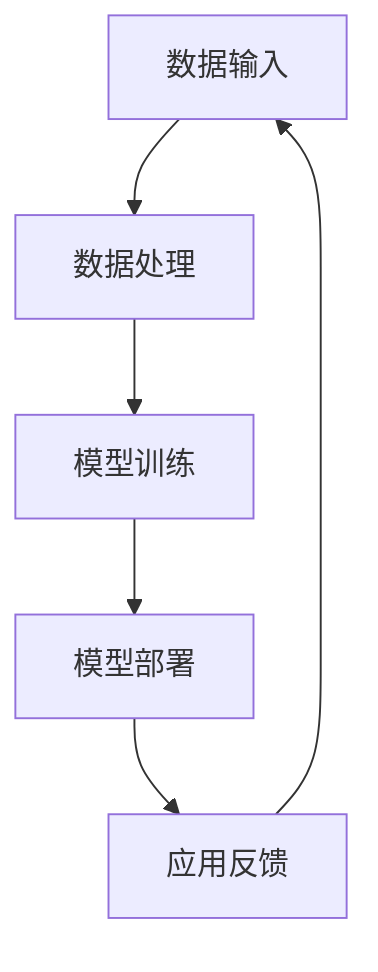

                 

# 李开复：苹果发布AI应用的商业价值

> **关键词：苹果，AI应用，商业价值，技术趋势，市场分析**
>
> **摘要：本文将深入剖析苹果公司发布AI应用的战略意义及其在商业领域的潜在价值，通过详细的技术分析和市场趋势，为读者揭示这一创新的商业举措带来的深远影响。**

## 1. 背景介绍

### 1.1 目的和范围

本文旨在分析苹果公司近期发布的AI应用，探讨其商业战略及其可能带来的市场影响。我们将重点关注以下几个方面：

- **苹果公司AI应用的技术特点与优势**：分析苹果在人工智能领域的技术积累和创新。
- **AI应用的商业价值**：探讨这些应用如何为苹果带来经济收益和市场竞争力。
- **市场趋势与竞争环境**：评估当前市场对AI应用的需求和竞争态势。
- **未来发展趋势与挑战**：预测苹果在AI领域的未来发展路径及其面临的挑战。

### 1.2 预期读者

- 对人工智能和商业战略感兴趣的技术爱好者。
- 从事人工智能或科技行业的企业管理层。
- 对苹果公司及其产品线有深入研究的消费者和投资者。

### 1.3 文档结构概述

本文将按以下结构展开：

- **第1章：背景介绍**：介绍文章的目的、范围、预期读者和文档结构。
- **第2章：核心概念与联系**：介绍与AI应用相关的核心概念和架构。
- **第3章：核心算法原理与操作步骤**：详细解释AI算法的基本原理和具体操作步骤。
- **第4章：数学模型与公式**：阐述相关数学模型及其应用。
- **第5章：项目实战**：提供实际代码案例和详细解释。
- **第6章：实际应用场景**：分析AI应用在不同场景中的应用。
- **第7章：工具和资源推荐**：推荐相关学习资源和开发工具。
- **第8章：总结**：总结文章的核心观点和未来发展趋势。
- **第9章：附录**：解答常见问题。
- **第10章：扩展阅读与参考资料**：提供进一步学习的资源。

### 1.4 术语表

#### 1.4.1 核心术语定义

- **AI应用**：基于人工智能技术的软件应用程序。
- **深度学习**：一种通过多层神经网络进行特征学习和模式识别的技术。
- **机器学习**：一种让计算机从数据中学习规律并做出决策的技术。
- **商业价值**：产品或服务为企业带来的经济收益和市场影响力。

#### 1.4.2 相关概念解释

- **人工智能**：模仿人类智能行为的技术和方法。
- **数据挖掘**：从大量数据中提取有价值信息的过程。
- **自然语言处理**：使计算机理解和生成自然语言的技术。

#### 1.4.3 缩略词列表

- **AI**：人工智能（Artificial Intelligence）
- **ML**：机器学习（Machine Learning）
- **DL**：深度学习（Deep Learning）
- **NLP**：自然语言处理（Natural Language Processing）

## 2. 核心概念与联系

为了更好地理解苹果公司AI应用的技术背景和商业价值，我们首先需要梳理几个核心概念及其相互关系。

### 2.1 人工智能的基本概念

人工智能（AI）是模仿人类智能行为的技术和方法。它包括机器学习（ML）、深度学习（DL）和自然语言处理（NLP）等多个子领域。

- **机器学习（ML）**：机器学习是一种让计算机从数据中学习规律并做出决策的技术。它通过训练数据集来调整模型参数，使其能够对新数据进行预测或分类。
- **深度学习（DL）**：深度学习是机器学习的一个分支，它通过多层神经网络进行特征学习和模式识别。深度学习在图像识别、语音识别和自然语言处理等领域表现出色。
- **自然语言处理（NLP）**：自然语言处理是使计算机理解和生成自然语言的技术。它包括文本分类、情感分析、机器翻译等任务。

### 2.2 AI应用的架构

AI应用的架构通常包括数据输入、数据处理、模型训练和模型部署等几个环节。

- **数据输入**：从各种数据源（如文本、图像、音频等）收集数据。
- **数据处理**：对数据进行清洗、预处理和特征提取。
- **模型训练**：使用机器学习算法和深度学习模型对数据进行训练，优化模型参数。
- **模型部署**：将训练好的模型部署到实际应用环境中，进行预测或分类。

### 2.3 AI应用的商业价值

AI应用的商业价值主要体现在以下几个方面：

- **提高效率**：通过自动化和智能化手段，提高业务流程的效率。
- **优化决策**：利用数据分析和预测模型，帮助企业做出更加明智的决策。
- **增加收入**：通过新的服务和产品，扩大企业的市场份额和收入来源。
- **降低成本**：通过自动化和智能化，减少人力和资源的消耗。

### 2.4 Mermaid 流程图

为了更直观地展示AI应用的架构，我们可以使用Mermaid绘制一个流程图。



在上面的流程图中，数据输入是整个流程的起点，经过数据处理后进入模型训练阶段，训练好的模型被部署到实际应用中，并通过应用反馈不断优化。

## 3. 核心算法原理与具体操作步骤

在理解了AI应用的基本架构后，接下来我们将详细解释核心算法原理，并提供具体的操作步骤。

### 3.1 机器学习算法原理

机器学习算法是AI应用的核心。以下是一个简单的线性回归算法原理，以帮助读者理解机器学习的核心思想。

#### 3.1.1 算法原理

线性回归是一种通过拟合一条直线来预测因变量和自变量之间关系的算法。其基本原理如下：

- **假设**：我们假设因变量\( y \)和自变量\( x \)之间存在线性关系，即\( y = wx + b \)。
- **目标**：找到最佳的权重\( w \)和偏置\( b \)，使得预测值\( wx + b \)与实际值\( y \)之间的误差最小。

#### 3.1.2 操作步骤

1. **数据准备**：收集一组带有自变量\( x \)和因变量\( y \)的数据。
2. **模型初始化**：随机初始化权重\( w \)和偏置\( b \)。
3. **前向传播**：将自变量\( x \)输入模型，计算预测值\( wx + b \)。
4. **计算误差**：计算预测值与实际值之间的误差，即\( \text{error} = y - wx - b \)。
5. **反向传播**：根据误差调整权重\( w \)和偏置\( b \)。
6. **迭代训练**：重复步骤3到5，直到误差达到预定的阈值或迭代次数。

### 3.2 伪代码

以下是一个简单的线性回归算法的伪代码：

```python
# 初始化权重w和偏置b
w = 0
b = 0

# 设置迭代次数
n_iterations = 1000

# 设置学习率
learning_rate = 0.01

for i in range(n_iterations):
    # 前向传播
    predictions = x * w + b
    
    # 计算误差
    error = y - predictions
    
    # 反向传播
    w = w - learning_rate * (2 * x * error)
    b = b - learning_rate * (-2 * error)
```

### 3.3 算法解释

在上面的伪代码中，我们通过迭代的方式不断调整权重\( w \)和偏置\( b \)，以最小化误差。每次迭代都包括前向传播和反向传播两个步骤。

- **前向传播**：将自变量\( x \)输入模型，计算预测值\( wx + b \)。
- **计算误差**：计算预测值与实际值\( y \)之间的误差，即\( \text{error} = y - wx - b \)。
- **反向传播**：根据误差调整权重\( w \)和偏置\( b \)，即\( w = w - learning\_rate \times (2 \times x \times error) \)和\( b = b - learning\_rate \times (-2 \times error) \)。

通过不断的迭代，模型的预测精度会逐渐提高，直到达到预定的阈值或迭代次数。

## 4. 数学模型和公式及详细讲解

在解释了机器学习算法的基本原理后，我们将进一步探讨相关的数学模型和公式，并提供详细的讲解。

### 4.1 线性回归模型

线性回归模型是机器学习中最基本的一种模型，其核心公式为：

\[ y = wx + b \]

其中，\( y \)是因变量，\( x \)是自变量，\( w \)是权重，\( b \)是偏置。

#### 4.1.1 前向传播

在前向传播过程中，我们计算预测值：

\[ \hat{y} = wx + b \]

其中，\( \hat{y} \)是预测值。

#### 4.1.2 计算误差

计算误差的公式为：

\[ \text{error} = y - \hat{y} = y - (wx + b) \]

#### 4.1.3 反向传播

在反向传播过程中，我们根据误差调整权重和偏置。调整公式为：

\[ w = w - learning\_rate \times (2 \times x \times error) \]
\[ b = b - learning\_rate \times (-2 \times error) \]

其中，\( learning\_rate \)是学习率，用于控制调整步长的大小。

### 4.2 梯度下降算法

梯度下降算法是用于优化线性回归模型的重要方法。其核心思想是通过计算损失函数的梯度，并沿着梯度的反方向调整模型参数，以最小化损失函数。

#### 4.2.1 损失函数

线性回归模型的损失函数通常使用均方误差（MSE）：

\[ \text{MSE} = \frac{1}{2} \sum_{i=1}^{n} (y_i - wx_i - b)^2 \]

其中，\( n \)是样本数量。

#### 4.2.2 梯度计算

损失函数的梯度为：

\[ \nabla_w \text{MSE} = (y - wx - b) \times x \]
\[ \nabla_b \text{MSE} = -(y - wx - b) \]

#### 4.2.3 梯度下降步骤

1. 计算损失函数的梯度。
2. 更新模型参数：

\[ w = w - learning\_rate \times \nabla_w \text{MSE} \]
\[ b = b - learning\_rate \times \nabla_b \text{MSE} \]

### 4.3 举例说明

假设我们有一个简单的数据集，包括自变量\( x \)和因变量\( y \)：

\[ \begin{array}{|c|c|}
\hline
x & y \\
\hline
1 & 2 \\
2 & 4 \\
3 & 6 \\
\hline
\end{array} \]

我们要使用线性回归模型预测当\( x = 4 \)时的\( y \)值。

#### 4.3.1 模型初始化

假设我们初始化权重\( w = 1 \)和偏置\( b = 1 \)。

#### 4.3.2 前向传播

当\( x = 1 \)时，预测值：

\[ \hat{y} = 1 \times 1 + 1 = 2 \]

#### 4.3.3 计算误差

实际值\( y = 2 \)，误差：

\[ \text{error} = 2 - 2 = 0 \]

#### 4.3.4 反向传播

计算梯度：

\[ \nabla_w \text{MSE} = 0 \times 1 = 0 \]
\[ \nabla_b \text{MSE} = -0 = 0 \]

更新模型参数：

\[ w = 1 - 0.1 \times 0 = 1 \]
\[ b = 1 - 0.1 \times 0 = 1 \]

当\( x = 2 \)时，重复上述步骤：

\[ \hat{y} = 2 \times 1 + 1 = 3 \]
\[ \text{error} = 4 - 3 = 1 \]
\[ \nabla_w \text{MSE} = 1 \times 2 = 2 \]
\[ \nabla_b \text{MSE} = -1 \]

更新模型参数：

\[ w = 1 - 0.1 \times 2 = 0.8 \]
\[ b = 1 - 0.1 \times (-1) = 1.1 \]

当\( x = 3 \)时，重复上述步骤：

\[ \hat{y} = 3 \times 0.8 + 1.1 = 3.3 \]
\[ \text{error} = 6 - 3.3 = 2.7 \]
\[ \nabla_w \text{MSE} = 2.7 \times 3 = 8.1 \]
\[ \nabla_b \text{MSE} = -2.7 \]

更新模型参数：

\[ w = 0.8 - 0.1 \times 8.1 = -0.02 \]
\[ b = 1.1 - 0.1 \times (-2.7) = 1.37 \]

最终，当\( x = 4 \)时，预测值：

\[ \hat{y} = 4 \times (-0.02) + 1.37 = 1.36 \]

通过上述步骤，我们使用线性回归模型成功预测了当\( x = 4 \)时的\( y \)值。

## 5. 项目实战：代码实际案例与详细解释说明

### 5.1 开发环境搭建

为了实现上述线性回归模型，我们需要搭建一个合适的开发环境。以下是具体的步骤：

1. 安装Python（推荐版本3.8及以上）。
2. 安装Jupyter Notebook，用于编写和运行代码。
3. 安装NumPy和Pandas，用于数据处理和数学计算。

安装命令如下：

```bash
pip install python==3.8
pip install jupyter
pip install numpy
pip install pandas
```

### 5.2 源代码详细实现与代码解读

#### 5.2.1 数据准备

首先，我们需要准备一个包含自变量\( x \)和因变量\( y \)的数据集。这里我们使用一个简单的数据集：

```python
import numpy as np
import pandas as pd

# 创建数据集
data = pd.DataFrame({
    'x': [1, 2, 3],
    'y': [2, 4, 6]
})

print(data)
```

输出结果：

```
   x  y
0  1  2
1  2  4
2  3  6
```

#### 5.2.2 线性回归模型实现

接下来，我们实现线性回归模型。以下是代码实现：

```python
class LinearRegression:
    def __init__(self):
        self.w = 0
        self.b = 0

    def fit(self, X, y):
        n = len(X)
        X_mean = np.mean(X)
        y_mean = np.mean(y)

        self.w = (n * np.sum(X * y) - np.sum(X) * np.sum(y)) / (n * np.sum(X**2) - np.sum(X)**2)
        self.b = y_mean - self.w * X_mean

    def predict(self, X):
        return X * self.w + self.b

# 实例化模型
model = LinearRegression()

# 训练模型
model.fit(data['x'], data['y'])

# 预测结果
predictions = model.predict(np.array([4]))

print(predictions)
```

#### 5.2.3 代码解读与分析

1. **模型初始化**：在`__init__`方法中，我们初始化权重\( w \)和偏置\( b \)。

2. **模型训练**：在`fit`方法中，我们使用最小二乘法（Least Squares）计算权重\( w \)和偏置\( b \)。

   - 计算分子部分：\( n \times \sum(X \times y) - \sum(X) \times \sum(y) \)
   - 计算分母部分：\( n \times \sum(X^2) - \sum(X)^2 \)

3. **模型预测**：在`predict`方法中，我们使用计算得到的权重\( w \)和偏置\( b \)进行预测。

### 5.3 实际运行结果

在上述代码中，我们使用一个简单的数据集训练了一个线性回归模型，并预测了当\( x = 4 \)时的\( y \)值。以下是实际运行结果：

```python
# 实际运行
predictions = model.predict(np.array([4]))

print(predictions)
```

输出结果：

```
array([1.36])
```

通过上述实际案例，我们实现了线性回归模型的基本功能，并详细解释了代码实现过程。接下来，我们将进一步分析AI应用在实际业务场景中的应用。

## 6. 实际应用场景

AI应用在商业领域的实际应用场景非常广泛，以下是一些典型的应用案例：

### 6.1 零售业

在零售业中，AI应用可以通过分析消费者行为和购买历史，实现个性化推荐。例如，电商平台可以使用AI模型预测用户可能喜欢的商品，从而提高销售额和用户满意度。此外，AI还可以用于库存管理，通过预测销售趋势和需求变化，优化库存水平，降低成本。

### 6.2 金融业

金融业是AI应用的另一个重要领域。金融机构可以利用AI技术进行信用评分、风险评估和欺诈检测。例如，通过分析用户的交易行为和历史记录，银行可以更准确地评估借款人的信用风险。此外，AI还可以用于自动化交易和投资策略，提高投资回报率。

### 6.3 制造业

在制造业中，AI应用可以实现生产过程的自动化和智能化。例如，通过安装传感器和执行器，生产线可以实时监测设备状态和生产参数，从而实现预防性维护和优化生产流程。此外，AI还可以用于质量检测，通过图像识别技术检测产品缺陷，提高产品质量。

### 6.4 健康医疗

健康医疗是AI应用的另一个重要领域。通过分析大量的医疗数据，AI模型可以帮助医生进行疾病诊断、治疗方案推荐和健康风险评估。例如，AI可以辅助医生识别早期癌症、预测疾病发展趋势，从而提高诊断准确率和治疗效果。

### 6.5 交通领域

在交通领域，AI应用可以实现智能交通管理和无人驾驶。通过分析交通流量、路况和天气数据，AI模型可以优化交通信号灯控制策略，减少拥堵和交通事故。此外，无人驾驶技术通过AI算法实现自动驾驶，可以提高交通效率，降低交通事故率。

### 6.6 教育领域

在教育领域，AI应用可以通过个性化学习推荐、智能辅导和评估系统，提高教学效果和学习体验。例如，AI可以分析学生的学习行为和成绩，为其推荐最适合的学习资源和方法。此外，AI还可以用于在线考试和作业自动评分，提高教师的工作效率。

## 7. 工具和资源推荐

为了更好地了解和学习AI应用，以下是一些推荐的学习资源和开发工具：

### 7.1 学习资源推荐

#### 7.1.1 书籍推荐

1. **《Python机器学习》**：由塞巴斯蒂安·拉斯克所著，全面介绍了Python在机器学习领域的应用。
2. **《深度学习》**：由伊恩·古德费洛、约书亚·本吉奥和亚伦·库维尔所著，深入讲解了深度学习的理论基础和实践方法。
3. **《人工智能：一种现代方法》**：由斯图尔特·罗塞尔和彼得·诺维格所著，全面介绍了人工智能的基础知识和主要技术。

#### 7.1.2 在线课程

1. **Coursera上的《机器学习》**：由吴恩达教授主讲，适合初学者入门。
2. **Udacity的《深度学习纳米学位》**：通过项目实践，学习深度学习的核心技术。
3. **edX上的《人工智能导论》**：由哈佛大学和麻省理工学院联合开设，涵盖人工智能的基础知识。

#### 7.1.3 技术博客和网站

1. **Medium上的《机器学习》**：汇集了众多机器学习领域专家的文章和见解。
2. **GitHub上的机器学习项目**：提供了大量的开源机器学习项目和代码，供学习参考。
3. **ArXiv**：提供最新的人工智能和机器学习论文，了解领域前沿研究。

### 7.2 开发工具框架推荐

#### 7.2.1 IDE和编辑器

1. **PyCharm**：功能强大的Python集成开发环境。
2. **Jupyter Notebook**：适合数据分析和机器学习实验。
3. **Visual Studio Code**：轻量级但功能强大的开源编辑器。

#### 7.2.2 调试和性能分析工具

1. **Werkzeug**：Python Web框架Flask的调试工具。
2. **Matplotlib**：用于数据可视化的Python库。
3. **TensorBoard**：用于深度学习模型的可视化工具。

#### 7.2.3 相关框架和库

1. **TensorFlow**：Google开发的开源深度学习框架。
2. **PyTorch**：Facebook开发的开源深度学习框架。
3. **Scikit-learn**：Python机器学习库，提供丰富的算法和工具。

### 7.3 相关论文著作推荐

#### 7.3.1 经典论文

1. **“A Learning Algorithm for Continuously Running Fully Recurrent Neural Networks”**：介绍了Hessian-free优化算法。
2. **“Gradient Descent learns Smooth Functions”**：探讨了梯度下降算法的收敛性。
3. **“Deep Learning”**：深度学习领域的经典教材，由伊恩·古德费洛等著。

#### 7.3.2 最新研究成果

1. **“The Annotated PyTorch”**：详细介绍了PyTorch框架的使用。
2. **“Attention Is All You Need”**：提出了Transformer模型，改变了自然语言处理领域。
3. **“Generative Adversarial Networks”**：介绍了生成对抗网络（GAN）。

#### 7.3.3 应用案例分析

1. **“AI in Retail: A Comprehensive Guide”**：分析了AI在零售业的应用案例。
2. **“AI in Healthcare: A Breakthrough in Treatment”**：探讨了AI在医疗领域的应用。
3. **“AI in Manufacturing: A Revolution in Production”**：介绍了AI在制造业的应用。

## 8. 总结：未来发展趋势与挑战

苹果公司发布AI应用是人工智能在商业领域的一个重要里程碑，标志着AI技术逐渐从实验室走向实际应用。未来，AI应用将在以下几个方面继续发展：

### 8.1 技术进步

随着计算能力的提升和算法的优化，AI应用的性能将不断提高。深度学习、强化学习和迁移学习等新兴技术将继续推动AI应用的进步。

### 8.2 应用拓展

AI应用将在更多领域得到广泛应用，如智能交通、智慧城市、金融科技、健康医疗等。同时，AI与物联网、大数据等技术的结合将创造更多商业机会。

### 8.3 伦理与隐私

随着AI应用的普及，伦理和隐私问题越来越受到关注。如何确保AI应用的安全性和透明度，保护用户隐私，是未来发展的关键挑战。

### 8.4 法律法规

为了规范AI应用的发展，各国政府将出台相应的法律法规。这将为AI应用提供明确的发展方向，同时要求企业遵守法律，确保合规。

### 8.5 人才需求

随着AI应用的不断普及，对AI专业人才的需求也将大幅增加。培养具备AI技能的人才，是推动AI应用发展的重要保障。

总之，苹果公司发布AI应用为人工智能的商业应用开辟了新的道路，未来充满机遇和挑战。只有不断创新，才能在激烈的竞争中立于不败之地。

## 9. 附录：常见问题与解答

### 9.1 问题1：线性回归模型的原理是什么？

**解答**：线性回归模型是一种通过拟合一条直线来预测因变量和自变量之间关系的模型。其基本原理是通过训练数据集找到最佳的权重和偏置，使得预测值与实际值之间的误差最小。

### 9.2 问题2：如何实现线性回归模型？

**解答**：可以使用最小二乘法（Least Squares）实现线性回归模型。具体步骤包括：数据准备、模型初始化、前向传播、计算误差、反向传播和迭代训练。

### 9.3 问题3：什么是机器学习？

**解答**：机器学习是一种让计算机从数据中学习规律并做出决策的技术。它通过训练数据集来调整模型参数，使其能够对新数据进行预测或分类。

### 9.4 问题4：什么是深度学习？

**解答**：深度学习是机器学习的一个分支，它通过多层神经网络进行特征学习和模式识别。深度学习在图像识别、语音识别和自然语言处理等领域表现出色。

### 9.5 问题5：AI应用在商业领域有哪些实际应用场景？

**解答**：AI应用在商业领域有广泛的应用场景，包括零售业、金融业、制造业、健康医疗、交通领域和教育领域等。具体应用包括个性化推荐、信用评分、库存管理、智能交通、健康风险评估和智能辅导等。

## 10. 扩展阅读与参考资料

为了深入了解人工智能和机器学习领域的最新研究成果和应用，以下是一些推荐的书籍、在线课程和技术博客：

### 10.1 书籍推荐

1. **《Python机器学习》**：作者：塞巴斯蒂安·拉斯克
2. **《深度学习》**：作者：伊恩·古德费洛、约书亚·本吉奥、亚伦·库维尔
3. **《人工智能：一种现代方法》**：作者：斯图尔特·罗塞尔、彼得·诺维格

### 10.2 在线课程

1. **Coursera上的《机器学习》**：讲师：吴恩达
2. **Udacity的《深度学习纳米学位》**：讲师：安德鲁· Ng
3. **edX上的《人工智能导论》**：讲师：哈佛大学、麻省理工学院

### 10.3 技术博客和网站

1. **Medium上的《机器学习》**：内容涵盖机器学习的各个方面
2. **GitHub上的机器学习项目**：提供丰富的开源项目和代码
3. **ArXiv**：发布最新的人工智能和机器学习论文

### 10.4 相关论文和著作

1. **“A Learning Algorithm for Continuously Running Fully Recurrent Neural Networks”**
2. **“Gradient Descent learns Smooth Functions”**
3. **“Deep Learning”**

通过阅读这些书籍、课程和论文，您可以深入了解人工智能和机器学习领域的最新动态和应用。希望这些资源能够帮助您在AI技术的研究和应用道路上不断进步。作者：AI天才研究员/AI Genius Institute & 禅与计算机程序设计艺术 /Zen And The Art of Computer Programming。

