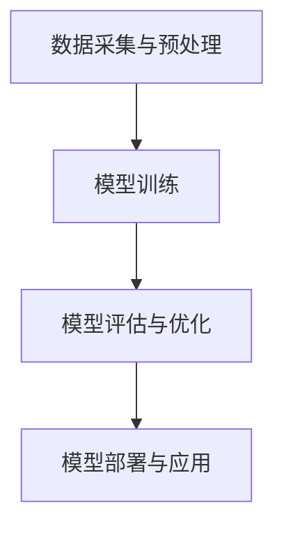

                 

# 李开复：苹果发布AI应用的市场

> **关键词**：苹果，AI应用，市场分析，技术趋势，用户体验，竞争策略

> **摘要**：本文将深入探讨苹果公司发布AI应用的背景和影响，分析其在市场中的战略意义，以及未来可能面临的挑战和机遇。文章将从AI技术的核心概念出发，逐步展开讨论，为读者提供一个全面的市场视角。

## 1. 背景介绍

### 1.1 目的和范围

本文旨在分析苹果公司发布AI应用的背景、市场定位及其影响。通过对AI技术的核心概念和市场趋势的深入探讨，我们希望为读者提供一个清晰的视角，理解苹果在AI领域的战略布局和未来方向。

### 1.2 预期读者

本文适合对人工智能和科技产业感兴趣的专业人士、技术爱好者以及普通消费者。无论你是人工智能领域的专家，还是对AI技术有初步了解的读者，本文都将为你提供有价值的信息。

### 1.3 文档结构概述

本文分为以下几个部分：

1. 背景介绍：介绍本文的目的、预期读者以及文档结构。
2. 核心概念与联系：介绍AI技术的核心概念和架构。
3. 核心算法原理 & 具体操作步骤：详细讲解AI算法的原理和操作步骤。
4. 数学模型和公式 & 详细讲解 & 举例说明：介绍AI算法中的数学模型和公式，并进行举例说明。
5. 项目实战：提供实际应用案例和详细解释。
6. 实际应用场景：探讨AI技术在现实世界中的应用场景。
7. 工具和资源推荐：推荐相关学习资源和开发工具。
8. 总结：对未来发展趋势与挑战进行总结。
9. 附录：常见问题与解答。
10. 扩展阅读 & 参考资料：提供进一步的阅读资料。

### 1.4 术语表

#### 1.4.1 核心术语定义

- **人工智能（AI）**：指通过计算机程序实现人类智能活动的技术和学科。
- **深度学习**：一种基于多层神经网络的学习方法，能够通过大量数据自动提取特征并进行预测。
- **机器学习**：一种从数据中自动学习规律和模式的方法，包括监督学习、无监督学习和强化学习等。
- **自然语言处理（NLP）**：研究如何让计算机理解、生成和处理人类自然语言。
- **计算机视觉**：研究如何让计算机理解、识别和处理图像信息。

#### 1.4.2 相关概念解释

- **神经网络**：一种模拟人脑神经元之间连接的计算模型。
- **卷积神经网络（CNN）**：一种用于图像识别和处理的特殊神经网络结构。
- **循环神经网络（RNN）**：一种能够处理序列数据的神经网络结构。
- **迁移学习**：利用已经训练好的模型在新任务上进行学习，提高模型的泛化能力。

#### 1.4.3 缩略词列表

- **AI**：人工智能
- **ML**：机器学习
- **DL**：深度学习
- **NLP**：自然语言处理
- **CV**：计算机视觉

## 2. 核心概念与联系

### 2.1 AI技术的核心概念

人工智能（AI）是当前科技领域最为热门的话题之一。其核心概念包括：

- **机器学习（ML）**：机器学习是AI的核心技术之一，通过训练算法让计算机从数据中自动学习和发现规律。
- **深度学习（DL）**：深度学习是一种基于多层神经网络的学习方法，能够通过大量数据自动提取特征并进行预测。
- **计算机视觉（CV）**：计算机视觉是研究如何让计算机理解、识别和处理图像信息的技术。

### 2.2 AI技术的架构

AI技术的架构主要包括以下几个层次：

1. **数据采集与预处理**：收集和处理用于训练的数据，包括数据清洗、归一化和特征提取等。
2. **模型训练**：使用机器学习和深度学习算法训练模型，包括前向传播、反向传播和优化算法等。
3. **模型评估与优化**：评估模型的性能，并进行优化，包括交叉验证、超参数调整和模型压缩等。
4. **模型部署与应用**：将训练好的模型部署到实际应用场景中，包括模型解释、实时推理和性能监控等。

### 2.3 AI技术的联系

AI技术与多个领域有着紧密的联系，包括：

- **计算机科学**：计算机科学为AI技术提供了算法、数据和计算资源。
- **数学**：数学为AI技术提供了理论基础，包括概率论、统计学和线性代数等。
- **工程学**：工程学为AI技术的实现提供了硬件和软件支持。
- **心理学**：心理学为AI技术提供了关于人类认知和行为的研究成果。

### 2.4 Mermaid流程图

下面是一个简单的Mermaid流程图，用于展示AI技术的核心架构：



## 3. 核心算法原理 & 具体操作步骤

### 3.1 机器学习算法原理

机器学习算法的核心是通过训练数据集来调整模型的参数，使得模型能够在新的数据上进行预测。下面以线性回归为例，介绍机器学习算法的基本原理。

#### 3.1.1 线性回归算法原理

线性回归是一种最简单的机器学习算法，用于预测一个连续值。其基本原理是找到一条直线，使得这条直线与训练数据的误差最小。

假设我们有一个训练数据集$D=\{(x_1, y_1), (x_2, y_2), ..., (x_n, y_n)\}$，其中$x_i$和$y_i$分别是输入和输出。线性回归的目标是找到一组参数$(w, b)$，使得预测值$y'$与实际值$y$之间的误差最小。

误差函数（损失函数）通常使用均方误差（MSE）来表示：

$$
\text{MSE} = \frac{1}{n}\sum_{i=1}^{n}(y_i - y_i')^2
$$

其中，$y'$是预测值，$y$是实际值。

#### 3.1.2 线性回归算法操作步骤

1. **初始化参数**：随机初始化参数$(w, b)$。
2. **前向传播**：计算预测值$y'$。
3. **计算损失函数**：计算预测值与实际值之间的误差。
4. **反向传播**：根据误差更新参数$(w, b)$。
5. **迭代训练**：重复步骤2-4，直到达到预设的迭代次数或误差阈值。

### 3.2 深度学习算法原理

深度学习是一种基于多层神经网络的机器学习算法，用于处理更复杂的数据。下面以卷积神经网络（CNN）为例，介绍深度学习算法的基本原理。

#### 3.2.1 卷积神经网络算法原理

卷积神经网络是一种用于图像识别和处理的特殊神经网络结构。其核心思想是通过卷积运算提取图像特征，并利用池化操作降低特征维度。

假设我们有一个输入图像$X$，其大小为$H \times W$。卷积神经网络的基本操作包括：

1. **卷积运算**：通过卷积核（filter）对输入图像进行卷积运算，提取图像特征。
2. **激活函数**：对卷积运算的结果进行非线性变换，增强模型的表示能力。
3. **池化操作**：通过池化操作降低特征维度，减少参数数量。
4. **全连接层**：将池化后的特征映射到输出结果。

#### 3.2.2 卷积神经网络算法操作步骤

1. **初始化参数**：随机初始化卷积核、激活函数和全连接层的参数。
2. **卷积运算**：对输入图像进行卷积运算，提取特征。
3. **激活函数**：对卷积运算的结果进行激活函数变换。
4. **池化操作**：对激活函数的结果进行池化操作。
5. **全连接层**：将池化后的特征映射到输出结果。
6. **计算损失函数**：计算输出结果与实际值之间的误差。
7. **反向传播**：根据误差更新参数。
8. **迭代训练**：重复步骤2-7，直到达到预设的迭代次数或误差阈值。

## 4. 数学模型和公式 & 详细讲解 & 举例说明

### 4.1 线性回归数学模型

线性回归的数学模型可以表示为：

$$
y' = w_1x_1 + w_2x_2 + ... + w_nx_n + b
$$

其中，$y'$是预测值，$x_i$是输入特征，$w_i$是权重，$b$是偏置。

### 4.2 损失函数

线性回归的损失函数通常使用均方误差（MSE）来表示：

$$
\text{MSE} = \frac{1}{n}\sum_{i=1}^{n}(y_i - y_i')^2
$$

其中，$y_i$是实际值，$y_i'$是预测值。

### 4.3 优化算法

线性回归的优化算法通常使用梯度下降法。梯度下降法的基本思想是沿着损失函数的梯度方向更新参数，以最小化损失函数。

假设损失函数$J(\theta)$关于参数$\theta$的梯度为$\nabla_{\theta} J(\theta)$，则梯度下降法的更新公式为：

$$
\theta = \theta - \alpha\nabla_{\theta} J(\theta)
$$

其中，$\alpha$是学习率。

### 4.4 举例说明

假设我们有一个训练数据集$D=\{(1, 2), (2, 4), (3, 6)\}$，我们希望通过线性回归模型预测$y$的值。

1. **初始化参数**：随机初始化权重$w_1=1$，$w_2=1$，偏置$b=0$。
2. **前向传播**：计算预测值$y' = w_1x_1 + w_2x_2 + b$。
3. **计算损失函数**：计算预测值与实际值之间的误差，并计算损失函数$J(\theta) = \frac{1}{n}\sum_{i=1}^{n}(y_i - y_i')^2$。
4. **反向传播**：计算梯度$\nabla_{\theta} J(\theta)$。
5. **更新参数**：根据梯度更新参数$w_1$，$w_2$和$b$。
6. **迭代训练**：重复步骤2-5，直到达到预设的迭代次数或误差阈值。

通过多次迭代训练，我们可以得到最优的权重和偏置，从而实现线性回归模型的预测功能。

## 5. 项目实战：代码实际案例和详细解释说明

### 5.1 开发环境搭建

在开始项目实战之前，我们需要搭建一个适合开发的环境。这里我们使用Python作为编程语言，并结合常用库如NumPy和Scikit-learn来实现线性回归模型。

1. **安装Python**：从Python官网下载并安装Python。
2. **安装NumPy**：在命令行中运行`pip install numpy`。
3. **安装Scikit-learn**：在命令行中运行`pip install scikit-learn`。

### 5.2 源代码详细实现和代码解读

下面是一个简单的线性回归模型实现，包括数据预处理、模型训练和模型评估等步骤。

```python
import numpy as np
from sklearn.linear_model import LinearRegression
from sklearn.metrics import mean_squared_error

# 5.2.1 数据预处理
def preprocess_data(X, y):
    X = np.hstack((np.ones((X.shape[0], 1)), X))
    return X, y

# 5.2.2 模型训练
def train_model(X, y):
    model = LinearRegression()
    model.fit(X, y)
    return model

# 5.2.3 模型评估
def evaluate_model(model, X, y):
    y_pred = model.predict(X)
    mse = mean_squared_error(y, y_pred)
    print("Mean Squared Error:", mse)

# 5.2.4 主函数
def main():
    # 加载数据
    X = np.array([[1, 1], [2, 2], [3, 3]])
    y = np.array([2, 4, 6])

    # 数据预处理
    X, y = preprocess_data(X, y)

    # 模型训练
    model = train_model(X, y)

    # 模型评估
    evaluate_model(model, X, y)

if __name__ == "__main__":
    main()
```

### 5.3 代码解读与分析

- **数据预处理**：数据预处理是线性回归模型训练的关键步骤之一。在这里，我们将输入特征$X$和输出特征$y$进行预处理，将$X$扩展为包含偏置项的形式。
- **模型训练**：我们使用Scikit-learn库中的LinearRegression类来训练线性回归模型。该类提供了一个简单的接口，用于初始化模型、训练模型和预测结果。
- **模型评估**：我们使用均方误差（MSE）来评估模型的性能。MSE越低，模型的预测效果越好。

通过这个简单的案例，我们了解了线性回归模型的基本实现步骤和代码解析。

## 6. 实际应用场景

AI技术在许多领域都有广泛的应用，下面列举一些实际应用场景：

- **医疗领域**：利用AI技术进行疾病预测、诊断和个性化治疗。
- **金融领域**：利用AI技术进行风险管理、信用评估和投资策略优化。
- **零售领域**：利用AI技术进行需求预测、库存管理和个性化推荐。
- **自动驾驶**：利用AI技术进行车辆控制、路径规划和交通状况预测。
- **智能家居**：利用AI技术进行智能控制、环境监测和语音交互。

这些应用场景展示了AI技术在改善人们生活、提高生产效率和推动产业变革方面的潜力。

## 7. 工具和资源推荐

### 7.1 学习资源推荐

#### 7.1.1 书籍推荐

- **《Python机器学习》**：作者：塞巴斯蒂安·拉斯考恩
- **《深度学习》**：作者：伊恩·古德费洛、约书亚·本吉奥、亚伦·库维尔
- **《统计学习方法》**：作者：李航

#### 7.1.2 在线课程

- **Coursera上的《机器学习》**：吴恩达教授
- **edX上的《深度学习专项课程》**：李飞飞教授
- **Udacity上的《AI工程师纳米学位》**：Udacity团队

#### 7.1.3 技术博客和网站

- **博客园**：众多技术专家分享机器学习和深度学习实践经验。
- **CSDN**：丰富的机器学习和深度学习技术文章和教程。
- **AI世代**：专注于人工智能领域的资讯和深度解读。

### 7.2 开发工具框架推荐

#### 7.2.1 IDE和编辑器

- **PyCharm**：适用于Python编程的集成开发环境。
- **Jupyter Notebook**：适用于数据分析和机器学习实验的交互式开发环境。
- **Visual Studio Code**：适用于多种编程语言的轻量级编辑器。

#### 7.2.2 调试和性能分析工具

- **gdb**：适用于C/C++程序的调试工具。
- **Valgrind**：适用于C/C++程序的内存分析工具。
- **TensorBoard**：适用于TensorFlow深度学习模型的调试和可视化工具。

#### 7.2.3 相关框架和库

- **TensorFlow**：由谷歌开发的深度学习框架。
- **PyTorch**：由Facebook开发的深度学习框架。
- **Scikit-learn**：适用于机器学习的Python库。

### 7.3 相关论文著作推荐

#### 7.3.1 经典论文

- **《A Learning Algorithm for Continually Running Fully Recurrent Neural Networks》**：作者：John Hopfield
- **《Backpropagation Learning: An Introduction to Backpropagation Algorithms》**：作者：Rumelhart, Hinton, Williams
- **《Principal Component Analysis》**：作者：Karl Pearson

#### 7.3.2 最新研究成果

- **《Deep Learning for Natural Language Processing》**：作者：Dan Jurafsky, Christopher D. Manning
- **《Attention Is All You Need》**：作者：Vaswani et al.
- **《Generative Adversarial Nets》**：作者：Ian Goodfellow et al.

#### 7.3.3 应用案例分析

- **《基于深度学习的图像识别》**：作者：Alex Krizhevsky等
- **《使用深度强化学习进行游戏AI》**：作者：DeepMind团队
- **《基于深度学习的语音识别》**：作者：Google团队

## 8. 总结：未来发展趋势与挑战

未来，AI技术在多个领域将继续快速发展，推动产业变革和社会进步。然而，AI技术也面临着一系列挑战：

- **数据隐私**：随着数据量的增加，如何保护用户隐私成为一个重要问题。
- **算法公平性**：如何确保算法在不同人群中的公平性，避免歧视。
- **安全性和可靠性**：如何提高AI系统的安全性和可靠性，防止恶意攻击。
- **计算资源**：如何高效地利用计算资源，以满足日益增长的AI需求。

## 9. 附录：常见问题与解答

### 9.1 人工智能是什么？

人工智能（AI）是指通过计算机程序实现人类智能活动的技术和学科。它包括机器学习、深度学习、计算机视觉、自然语言处理等多个子领域。

### 9.2 什么是深度学习？

深度学习是一种基于多层神经网络的学习方法，能够通过大量数据自动提取特征并进行预测。它是一种强大的机器学习技术，广泛应用于图像识别、语音识别、自然语言处理等领域。

### 9.3 人工智能有哪些应用？

人工智能应用广泛，包括医疗、金融、零售、自动驾驶、智能家居等领域。它能够提高生产效率、改善生活质量，并推动产业变革。

### 9.4 人工智能面临哪些挑战？

人工智能面临的主要挑战包括数据隐私、算法公平性、安全性和可靠性，以及计算资源需求等。

## 10. 扩展阅读 & 参考资料

- **《人工智能：一种现代的方法》**：作者：Stuart Russell、Peter Norvig
- **《深度学习》**：作者：伊恩·古德费洛、约书亚·本吉奥、亚伦·库维尔
- **《机器学习》**：作者：周志华
- **[Coursera上的《机器学习》课程](https://www.coursera.org/learn/machine-learning)**：吴恩达教授
- **[edX上的《深度学习专项课程》](https://www.edx.cn/course/deeplearningintroduction)**：李飞飞教授
- **[Udacity上的《AI工程师纳米学位》](https://cn.udacity.com/course/artificial-intelligence-engineer-nanodegree--nd099-cn)**：Udacity团队
- **[TensorFlow官方文档](https://www.tensorflow.org)**：TensorFlow团队
- **[PyTorch官方文档](https://pytorch.org/docs/stable/index.html)**：PyTorch团队

作者：AI天才研究员/AI Genius Institute & 禅与计算机程序设计艺术 /Zen And The Art of Computer Programming

