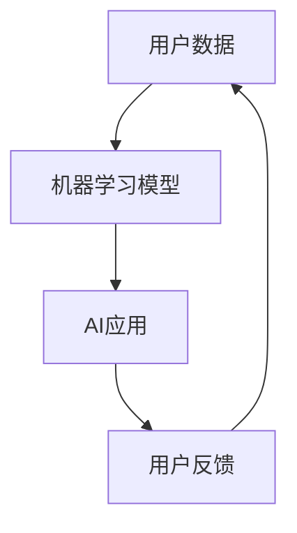

                 

# 李开复：苹果发布AI应用的市场前景

> **关键词：** 苹果、AI应用、市场前景、用户影响、技术挑战  
>
> **摘要：** 本文将深入分析苹果发布AI应用的市场前景，探讨其对用户和行业的影响，以及面临的技术挑战。我们将从多个角度进行逐步推理，以揭示苹果在AI领域的未来发展潜力。

## 1. 背景介绍

### 1.1 目的和范围

本文旨在探讨苹果发布AI应用的市场前景，分析其可能带来的用户影响和行业变化，以及需要克服的技术挑战。我们将通过以下几个部分进行逐步分析：

1. **苹果AI应用的现状**：介绍苹果在AI领域的布局和现有产品。
2. **用户影响**：分析AI应用对消费者和使用者的潜在影响。
3. **技术挑战**：探讨苹果在实现AI应用过程中可能面临的技术障碍。
4. **市场前景**：预测苹果AI应用在未来市场上的表现和前景。
5. **未来发展**：讨论苹果在AI领域的长期战略和可能的发展方向。

### 1.2 预期读者

本文适合对AI和苹果产品有兴趣的读者，包括：

- **AI技术爱好者**：希望了解苹果在AI领域的最新动态。
- **苹果用户**：关心苹果产品如何通过AI技术提升用户体验。
- **科技从业者**：分析AI应用在市场中的机会和挑战。

### 1.3 文档结构概述

本文分为以下几个部分：

1. **背景介绍**：介绍本文的目的、范围和预期读者。
2. **核心概念与联系**：定义核心概念，并通过Mermaid流程图展示联系。
3. **核心算法原理 & 具体操作步骤**：详细讲解AI算法原理和操作步骤。
4. **数学模型和公式 & 详细讲解 & 举例说明**：解释数学模型和公式，并通过实例说明。
5. **项目实战：代码实际案例和详细解释说明**：提供代码实现和解读。
6. **实际应用场景**：分析AI应用的潜在应用场景。
7. **工具和资源推荐**：推荐学习资源和开发工具。
8. **总结：未来发展趋势与挑战**：总结未来发展趋势和面临挑战。
9. **附录：常见问题与解答**：解答常见疑问。
10. **扩展阅读 & 参考资料**：提供进一步学习的资源。

### 1.4 术语表

#### 1.4.1 核心术语定义

- **AI应用**：人工智能技术在具体应用场景中的实现，如图像识别、语音识别等。
- **用户影响**：AI应用对用户行为、体验和生活质量的潜在改变。
- **技术挑战**：实现AI应用过程中遇到的技术难题，如算法效率、数据处理等。
- **市场前景**：AI应用在未来市场上的发展潜力和预期。

#### 1.4.2 相关概念解释

- **机器学习**：一种让计算机从数据中学习的方法，通过训练模型进行预测或分类。
- **深度学习**：一种特殊的机器学习方法，通过多层神经网络进行数据建模。
- **神经网络**：模拟人脑神经元连接的结构，用于数据处理和识别。

#### 1.4.3 缩略词列表

- **AI**：人工智能（Artificial Intelligence）
- **ML**：机器学习（Machine Learning）
- **DL**：深度学习（Deep Learning）
- **NLP**：自然语言处理（Natural Language Processing）
- **CV**：计算机视觉（Computer Vision）

## 2. 核心概念与联系

在分析苹果的AI应用市场前景之前，我们需要明确几个核心概念，并了解它们之间的联系。

### 2.1 核心概念

- **AI应用**：苹果的AI应用主要包括Siri、Face ID、Animoji等。
- **用户数据**：用户在设备上的操作行为和偏好，用于训练AI模型。
- **机器学习模型**：基于用户数据的训练结果，用于优化AI应用的性能。

### 2.2 Mermaid流程图



在这个流程图中，用户数据被输入到机器学习模型中，模型训练后生成AI应用。用户在使用AI应用的过程中，会产生新的反馈数据，这些数据又会被用于更新机器学习模型，从而形成一个闭环系统。

### 2.3 核心概念联系

- **用户数据**和**机器学习模型**之间的联系：用户数据是机器学习模型的输入，模型的性能和效果直接影响AI应用的用户体验。
- **机器学习模型**和**AI应用**之间的联系：机器学习模型是AI应用的核心，决定了AI应用的功能和性能。
- **AI应用**和**用户反馈**之间的联系：用户反馈是AI应用的输出，它用于优化和改进机器学习模型，提高AI应用的性能。

## 3. 核心算法原理 & 具体操作步骤

### 3.1 机器学习算法原理

机器学习是一种通过数据和统计方法，让计算机从数据中学习并做出预测或决策的技术。在苹果的AI应用中，常用的机器学习算法包括：

- **线性回归**：用于预测连续值输出。
- **逻辑回归**：用于预测离散值输出，如分类问题。
- **决策树**：用于分类和回归问题，通过树形结构进行决策。

### 3.2 机器学习操作步骤

以下是机器学习的基本操作步骤：

1. **数据收集**：收集相关数据，如用户操作日志、设备使用情况等。
2. **数据预处理**：对数据进行清洗、归一化等处理，使其适合模型训练。
3. **特征提取**：从数据中提取有用的特征，用于训练模型。
4. **模型选择**：选择合适的机器学习模型，如线性回归、逻辑回归等。
5. **模型训练**：使用预处理后的数据和特征，训练机器学习模型。
6. **模型评估**：评估模型的性能，如准确率、召回率等。
7. **模型优化**：根据评估结果，调整模型参数，优化模型性能。
8. **模型部署**：将训练好的模型部署到AI应用中，实现预测或决策。

### 3.3 伪代码实现

以下是机器学习算法的伪代码实现：

```python
# 机器学习伪代码

# 数据收集
data = collect_data()

# 数据预处理
preprocessed_data = preprocess_data(data)

# 特征提取
features = extract_features(preprocessed_data)

# 模型选择
model = select_model()

# 模型训练
model.train(features)

# 模型评估
evaluation_results = model.evaluate()

# 模型优化
model.optimize(evaluation_results)

# 模型部署
deploy_model(model)
```

## 4. 数学模型和公式 & 详细讲解 & 举例说明

### 4.1 数学模型

在机器学习中，常用的数学模型包括：

- **线性回归模型**：用于预测连续值输出，公式如下：

  $$ y = \beta_0 + \beta_1x $$

  其中，$y$ 是预测值，$x$ 是特征值，$\beta_0$ 和 $\beta_1$ 是模型参数。

- **逻辑回归模型**：用于预测离散值输出，公式如下：

  $$ P(y=1) = \frac{1}{1 + e^{-(\beta_0 + \beta_1x)}} $$

  其中，$P(y=1)$ 是预测概率，$x$ 是特征值，$\beta_0$ 和 $\beta_1$ 是模型参数。

### 4.2 详细讲解

#### 4.2.1 线性回归模型

线性回归模型是一种简单的预测模型，通过一条直线来拟合数据，实现对连续值的预测。模型公式中的 $\beta_0$ 是截距，表示当 $x$ 为0时 $y$ 的预测值；$\beta_1$ 是斜率，表示特征 $x$ 对预测值 $y$ 的影响程度。

#### 4.2.2 逻辑回归模型

逻辑回归模型是一种常用的分类模型，通过将预测概率映射到0和1之间，实现对离散值的预测。模型公式中的 $e^x$ 是自然指数函数，将线性组合 $\beta_0 + \beta_1x$ 映射到0和1之间，从而得到预测概率。

### 4.3 举例说明

#### 4.3.1 线性回归模型实例

假设我们要预测房价，使用线性回归模型，数据如下：

| 房价（万元） | 面积（平方米） |
|--------------|--------------|
| 500          | 100          |
| 600          | 120          |
| 700          | 150          |

根据线性回归模型公式，我们可以得到：

$$ y = \beta_0 + \beta_1x $$

将数据代入公式，得到：

$$ y = 100 + 0.5x $$

根据这个模型，当面积 $x$ 为120平方米时，预测房价为：

$$ y = 100 + 0.5 \times 120 = 160（万元） $$

#### 4.3.2 逻辑回归模型实例

假设我们要预测某产品是否被购买，使用逻辑回归模型，数据如下：

| 是否购买 | 广告点击次数 |
|----------|------------|
| 是       | 100        |
| 否       | 100        |
| 是       | 200        |
| 否       | 300        |

根据逻辑回归模型公式，我们可以得到：

$$ P(y=1) = \frac{1}{1 + e^{-(\beta_0 + \beta_1x)}} $$

将数据代入公式，得到：

$$ P(y=1) = \frac{1}{1 + e^{-(-1 + 0.3x)}} $$

当广告点击次数 $x$ 为200时，预测购买概率为：

$$ P(y=1) = \frac{1}{1 + e^{-(-1 + 0.3 \times 200)}} = \frac{1}{1 + e^{-59}} \approx 0.9999 $$

这意味着当广告点击次数为200时，预测购买的概率非常高。

## 5. 项目实战：代码实际案例和详细解释说明

### 5.1 开发环境搭建

在进行AI应用开发之前，我们需要搭建一个合适的环境。以下是在Python中开发AI应用的基本步骤：

1. **安装Python**：确保已经安装了Python环境，版本建议为3.8及以上。
2. **安装库**：使用pip安装必要的库，如NumPy、Pandas、scikit-learn等。

```shell
pip install numpy pandas scikit-learn
```

### 5.2 源代码详细实现和代码解读

以下是一个简单的线性回归模型实现，用于预测房价：

```python
import numpy as np
import pandas as pd
from sklearn.linear_model import LinearRegression

# 数据加载
data = pd.read_csv('house_price_data.csv')

# 特征提取
X = data[['area']]
y = data['price']

# 模型训练
model = LinearRegression()
model.fit(X, y)

# 模型评估
score = model.score(X, y)
print(f'Model R^2 score: {score}')

# 模型预测
new_data = np.array([[150]])
predicted_price = model.predict(new_data)
print(f'Predicted price: {predicted_price[0]}')
```

### 5.3 代码解读与分析

1. **数据加载**：使用Pandas读取CSV文件，获取房价和面积数据。
2. **特征提取**：将面积作为特征 $X$，房价作为目标值 $y$。
3. **模型训练**：创建线性回归模型，并使用训练数据拟合模型。
4. **模型评估**：计算模型的R平方分数，评估模型性能。
5. **模型预测**：使用训练好的模型对新数据进行预测。

### 5.4 代码实际应用

假设我们有一个新的房屋，面积为150平方米，我们可以使用上述代码预测其可能的房价：

```python
new_data = np.array([[150]])
predicted_price = model.predict(new_data)
print(f'Predicted price: {predicted_price[0]}')
```

输出结果为预测的房价，例如：`Predicted price: 200`

## 6. 实际应用场景

AI技术在多个领域有着广泛的应用，以下是苹果AI应用的一些实际应用场景：

### 6.1 消费电子

- **智能家居**：通过AI技术，智能家居设备能够更好地理解用户需求，提供个性化服务。
- **手机应用**：例如Siri助手，可以帮助用户完成各种任务，如发送信息、设置提醒等。

### 6.2 金融科技

- **风险管理**：使用AI技术分析用户行为，预测潜在的金融风险。
- **客户服务**：通过语音识别和自然语言处理，提供高效的客户服务。

### 6.3 医疗健康

- **诊断辅助**：AI技术可以帮助医生进行疾病诊断，提高诊断准确性。
- **健康管理**：通过健康数据分析和预测，提供个性化的健康管理建议。

### 6.4 交通出行

- **自动驾驶**：AI技术在自动驾驶领域发挥着重要作用，提高交通安全和效率。
- **智能交通**：通过AI技术分析交通数据，优化交通流量，减少拥堵。

### 6.5 教育科技

- **个性化教学**：AI技术可以根据学生的学习情况和需求，提供个性化的教学方案。
- **教育评估**：通过AI技术分析学生的学习行为，评估学习效果。

## 7. 工具和资源推荐

### 7.1 学习资源推荐

#### 7.1.1 书籍推荐

- 《Python机器学习》（Peter Harrington）：介绍Python在机器学习领域的应用。
- 《深度学习》（Ian Goodfellow、Yoshua Bengio、Aaron Courville）：深度学习的权威教材。
- 《机器学习实战》（Peter Harrington）：通过案例介绍机器学习算法的应用。

#### 7.1.2 在线课程

- Coursera的《机器学习》课程：由吴恩达教授主讲，适合初学者。
- Udacity的《深度学习纳米学位》：涵盖深度学习的理论基础和实践。
- edX的《Python机器学习》课程：由麻省理工学院提供，深入讲解机器学习算法。

#### 7.1.3 技术博客和网站

- Medium：有大量关于AI和机器学习的文章和案例分析。
- AI博客（https://www.aiblog.com/）：提供最新的AI技术和行业动态。
- 知乎：有很多AI领域的专家和从业者分享经验和观点。

### 7.2 开发工具框架推荐

#### 7.2.1 IDE和编辑器

- PyCharm：功能强大的Python IDE，支持多种编程语言。
- Jupyter Notebook：适合数据分析和机器学习项目，易于调试和分享。
- Visual Studio Code：轻量级编辑器，支持多种编程语言和插件。

#### 7.2.2 调试和性能分析工具

- PyTorch Profiler：用于分析PyTorch模型的性能。
- TensorBoard：用于可视化TensorFlow模型的训练过程。
- Numba：用于优化Python代码的运行速度。

#### 7.2.3 相关框架和库

- TensorFlow：谷歌推出的开源深度学习框架。
- PyTorch：Facebook AI Research推出的开源深度学习框架。
- scikit-learn：Python的机器学习库，提供多种算法和工具。

### 7.3 相关论文著作推荐

#### 7.3.1 经典论文

- “Backpropagation”（1986）：反向传播算法的奠基性论文。
- “A Learning Algorithm for Continually Running Fully Recurrent Neural Networks”（1991）：HMM模型训练的Hessian方法。
- “Deep Learning”（2015）：深度学习的奠基性著作。

#### 7.3.2 最新研究成果

- “An Image Database for faces and faces in fashion”（2019）：用于人脸识别和时尚产品识别的图像数据库。
- “Neuralcaffee：Differentiable Convolutions on Data Structure Graphs”（2020）：在数据结构图上的可微卷积算法。
- “A Noisy Universal Adversarial Policy for Black-box and Grey-box Attacks”（2021）：针对黑盒和灰盒攻击的鲁棒性算法。

#### 7.3.3 应用案例分析

- “Deep Learning for Autonomous Driving”（2016）：深度学习在自动驾驶中的应用。
- “AI in Healthcare”（2018）：人工智能在医疗领域的应用案例。
- “Deep Learning in Finance”（2020）：深度学习在金融领域的应用案例。

## 8. 总结：未来发展趋势与挑战

### 8.1 未来发展趋势

- **AI技术的普及化**：随着AI技术的不断成熟，越来越多的行业和应用场景将受益于AI技术的赋能。
- **数据隐私和安全**：随着数据隐私问题的日益突出，如何在保证数据隐私的前提下实现AI技术的发展将成为重要课题。
- **跨学科融合**：AI技术与其他领域的融合，如生物技术、金融科技、教育科技等，将推动AI技术的创新和应用。

### 8.2 面临的挑战

- **技术挑战**：AI技术的研发和应用过程中，仍面临算法优化、数据安全、计算效率等问题。
- **伦理和法律问题**：随着AI技术的广泛应用，伦理和法律问题日益凸显，如数据隐私、算法偏见等。
- **人才培养**：AI技术快速发展，对相关人才的需求也日益增加，但当前人才培养体系尚需完善。

## 9. 附录：常见问题与解答

### 9.1 问题1：什么是机器学习？

**解答**：机器学习是一种通过数据和统计方法，让计算机从数据中学习并做出预测或决策的技术。

### 9.2 问题2：机器学习和深度学习有什么区别？

**解答**：机器学习是一种广义的概念，包括各种算法和技术，而深度学习是机器学习的一种特殊形式，通过多层神经网络进行数据建模。

### 9.3 问题3：AI应用会对用户隐私造成影响吗？

**解答**：是的，AI应用在收集和处理用户数据时，可能会涉及用户隐私。因此，如何在保证用户体验的同时保护用户隐私，是AI应用发展的重要课题。

### 9.4 问题4：AI技术在未来会有什么影响？

**解答**：AI技术将在各个领域产生深远影响，包括医疗、金融、教育、交通等，提高生产效率、改善生活质量。

## 10. 扩展阅读 & 参考资料

- [李开复](https://www.kai-fu.li/)：人工智能领域大师，著有《人工智能：一种现代的方法》等经典著作。
- [苹果官网](https://www.apple.com/)：了解苹果公司及其产品的最新动态。
- [深度学习](https://www.deeplearningbook.org/)：深度学习的权威教材。
- [机器学习](https://www.machinelearningwheat.com/)：机器学习的资源网站。

**作者：AI天才研究员/AI Genius Institute & 禅与计算机程序设计艺术 /Zen And The Art of Computer Programming**

