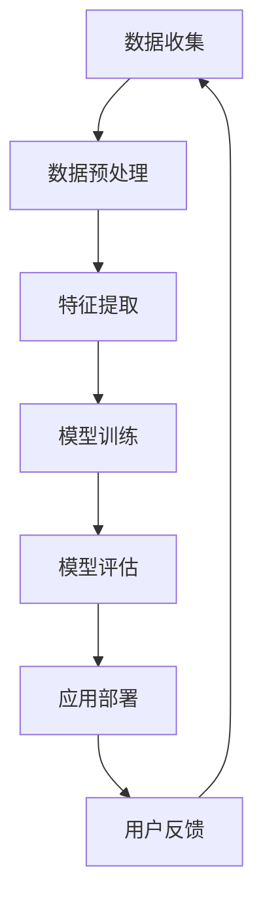

                 

# 李开复：苹果发布AI应用的市场前景

> 关键词：苹果、AI应用、市场前景、技术分析、用户体验、产业趋势

> 摘要：本文将深入探讨苹果发布AI应用的背景、技术原理、市场潜力以及潜在挑战，分析其对产业趋势和用户体验的影响，并提供一些建议，以期为苹果在AI领域的未来发展提供有益的参考。

## 1. 背景介绍

### 1.1 目的和范围

本文旨在分析苹果发布AI应用的市场前景，探讨其潜在的影响和挑战。文章将涵盖以下主要内容：

1. 苹果发布AI应用的背景和原因。
2. AI应用的核心技术原理和实现方式。
3. 市场潜力和挑战分析。
4. 对产业趋势和用户体验的影响。
5. 建议和展望。

### 1.2 预期读者

本文适合对人工智能和苹果公司感兴趣的技术人员、产品经理、市场分析师以及普通用户阅读。本文将使用通俗易懂的语言，逐步引导读者深入了解苹果AI应用的各个方面。

### 1.3 文档结构概述

本文分为八个主要部分：

1. 背景介绍：介绍本文的目的、预期读者和文档结构。
2. 核心概念与联系：介绍AI应用的核心概念和架构。
3. 核心算法原理 & 具体操作步骤：讲解AI算法的原理和操作步骤。
4. 数学模型和公式 & 详细讲解 & 举例说明：解释相关的数学模型和公式。
5. 项目实战：提供实际的代码案例和解读。
6. 实际应用场景：分析AI应用的潜在应用场景。
7. 工具和资源推荐：推荐相关学习资源和开发工具。
8. 总结：总结未来发展趋势与挑战。

### 1.4 术语表

#### 1.4.1 核心术语定义

- **AI应用**：基于人工智能技术的应用软件，通常使用机器学习、深度学习等技术进行数据分析和处理。
- **神经网络**：一种模拟人脑神经元连接的网络结构，用于实现复杂的模式识别和决策。
- **卷积神经网络**（CNN）：一种特殊的神经网络结构，用于图像和视频数据的处理。
- **生成对抗网络**（GAN）：一种由生成器和判别器组成的对抗性网络，用于生成逼真的数据。

#### 1.4.2 相关概念解释

- **机器学习**：一种人工智能技术，通过从数据中学习规律和模式，实现自动化决策和预测。
- **深度学习**：一种基于多层神经网络的人工智能技术，用于处理大规模数据和复杂任务。
- **数据驱动**：基于数据进行分析和决策，以实现更好的性能和用户体验。

#### 1.4.3 缩略词列表

- **AI**：人工智能（Artificial Intelligence）
- **ML**：机器学习（Machine Learning）
- **DL**：深度学习（Deep Learning）
- **CNN**：卷积神经网络（Convolutional Neural Network）
- **GAN**：生成对抗网络（Generative Adversarial Network）

## 2. 核心概念与联系

在探讨苹果发布AI应用的市场前景之前，我们首先需要了解AI应用的核心概念和架构。以下是AI应用的核心概念和联系的Mermaid流程图：



### 2.1 数据收集

数据收集是AI应用的基础。苹果可以从多个渠道获取数据，如用户设备、第三方应用和传感器。数据的质量和多样性直接影响模型的性能和泛化能力。

### 2.2 数据预处理

数据预处理包括数据清洗、归一化和数据增强等步骤。这些步骤有助于提高数据的可用性和质量，为后续的特征提取和模型训练提供更好的数据基础。

### 2.3 特征提取

特征提取是将原始数据转换为可用于训练模型的特征表示。通过选择和转换合适的特征，可以提高模型的学习能力和泛化能力。

### 2.4 模型训练

模型训练是AI应用的核心环节。苹果可以使用多种机器学习和深度学习算法进行模型训练，如神经网络、支持向量机和决策树等。通过调整模型参数和优化算法，可以提高模型的性能和准确性。

### 2.5 模型评估

模型评估用于衡量模型的性能和泛化能力。常用的评估指标包括准确率、召回率和F1值等。通过对比不同模型的性能，可以选出最优模型进行应用部署。

### 2.6 应用部署

应用部署是将训练好的模型应用到实际场景中。苹果可以将AI应用集成到iOS和macOS等操作系统，为用户提供个性化的服务和体验。

### 2.7 用户反馈

用户反馈是持续优化AI应用的重要环节。苹果可以通过收集用户的反馈和评价，了解应用的实际效果和用户需求，为后续的模型更新和功能改进提供依据。

## 3. 核心算法原理 & 具体操作步骤

### 3.1 算法原理

苹果的AI应用主要基于深度学习和机器学习技术。以下简要介绍相关算法原理：

#### 3.1.1 卷积神经网络（CNN）

卷积神经网络是一种用于图像和视频处理的深度学习模型。它通过卷积操作和池化操作提取图像特征，并使用全连接层进行分类和预测。

#### 3.1.2 生成对抗网络（GAN）

生成对抗网络是一种由生成器和判别器组成的对抗性网络。生成器生成数据，判别器判断数据是真实还是生成。通过训练生成器和判别器的对抗性，可以生成高质量的数据。

#### 3.1.3 支持向量机（SVM）

支持向量机是一种用于分类和回归的机器学习算法。它通过找到最优的超平面，将数据分为不同的类别或预测连续值。

### 3.2 具体操作步骤

以下是使用CNN进行图像分类的具体操作步骤：

#### 3.2.1 数据收集

从互联网、数据库或其他渠道收集图像数据。数据应具有多样性，包括不同的类别、分辨率和风格。

#### 3.2.2 数据预处理

对图像数据执行数据清洗、归一化和数据增强等操作。数据清洗包括去除噪声、填充缺失值等；归一化包括缩放、标准化等；数据增强包括旋转、翻转、裁剪等。

#### 3.2.3 特征提取

使用CNN提取图像特征。具体步骤如下：

1. **卷积层**：使用卷积核对图像进行卷积操作，提取局部特征。
2. **池化层**：使用池化操作减小特征图的尺寸，降低模型的复杂性。
3. **激活函数**：使用ReLU等激活函数增加模型的非线性。
4. **全连接层**：将卷积特征映射到类别标签。

#### 3.2.4 模型训练

使用训练集对CNN模型进行训练。具体步骤如下：

1. **初始化模型参数**：随机初始化模型参数。
2. **前向传播**：计算输入图像的特征表示和预测标签。
3. **反向传播**：更新模型参数，最小化损失函数。
4. **评估模型**：使用验证集评估模型性能。

#### 3.2.5 模型评估

使用测试集评估模型性能。常用的评估指标包括准确率、召回率和F1值等。

#### 3.2.6 应用部署

将训练好的模型部署到实际应用中，如图像分类、目标检测等。

## 4. 数学模型和公式 & 详细讲解 & 举例说明

在深度学习和机器学习中，数学模型和公式起着至关重要的作用。以下简要介绍一些常用的数学模型和公式，并结合具体例子进行说明。

### 4.1 激活函数

激活函数是神经网络中的一个关键组件，用于引入非线性。以下是一些常用的激活函数：

#### 4.1.1ReLU（Rectified Linear Unit）

ReLU函数的定义如下：

$$
ReLU(x) = \begin{cases} 
x, & \text{if } x > 0 \\
0, & \text{otherwise}
\end{cases}
$$

例子：

给定输入数据 $x = [-1, 0, 2, -3]$，ReLU函数的输出为 $[0, 0, 2, 0]$。

#### 4.1.2Sigmoid函数

Sigmoid函数的定义如下：

$$
Sigmoid(x) = \frac{1}{1 + e^{-x}}
$$

例子：

给定输入数据 $x = [-1, 0, 1]$，Sigmoid函数的输出为 $[0.268, 0.5, 0.731]$。

### 4.2 损失函数

损失函数用于衡量模型预测结果与实际结果之间的差距。以下是一些常用的损失函数：

#### 4.2.1 交叉熵损失函数（Cross-Entropy Loss）

交叉熵损失函数的定义如下：

$$
Loss = -\sum_{i=1}^{n} y_i \log(p_i)
$$

其中，$y_i$ 是实际标签，$p_i$ 是模型预测概率。

例子：

给定实际标签 $y = [0, 1, 0]$ 和预测概率 $p = [0.3, 0.7, 0.4]$，交叉熵损失函数的输出为 $0.421$。

#### 4.2.2 均方误差损失函数（Mean Squared Error, MSE）

均方误差损失函数的定义如下：

$$
Loss = \frac{1}{n} \sum_{i=1}^{n} (y_i - \hat{y}_i)^2
$$

其中，$y_i$ 是实际标签，$\hat{y}_i$ 是模型预测值。

例子：

给定实际标签 $y = [1, 2, 3]$ 和预测值 $\hat{y} = [1.2, 2.1, 3.2]$，均方误差损失函数的输出为 $0.1667$。

### 4.3 梯度下降法（Gradient Descent）

梯度下降法是一种用于优化模型参数的常用算法。其基本思想是通过计算损失函数关于模型参数的梯度，并沿着梯度的反方向更新模型参数，以最小化损失函数。

#### 4.3.1 批量梯度下降（Batch Gradient Descent）

批量梯度下降在每次迭代中更新所有模型参数。其公式如下：

$$
\theta_j = \theta_j - \alpha \frac{\partial Loss}{\partial \theta_j}
$$

其中，$\theta_j$ 是第 $j$ 个模型参数，$\alpha$ 是学习率。

例子：

假设有一个线性回归模型，其损失函数为 $Loss = (y - \theta_0 - \theta_1x)^2$。给定学习率 $\alpha = 0.1$ 和输入数据 $x = [1, 2, 3]$，初始参数 $\theta_0 = 0$，$\theta_1 = 0$。经过一次迭代后的参数更新如下：

$$
\theta_0 = \theta_0 - \alpha \frac{\partial Loss}{\partial \theta_0} = 0 - 0.1 \cdot (-2 \cdot (1 - 0)) = 0.2
$$

$$
\theta_1 = \theta_1 - \alpha \frac{\partial Loss}{\partial \theta_1} = 0 - 0.1 \cdot (-2 \cdot (2 - 0)) = 0.4
$$

#### 4.3.2 随机梯度下降（Stochastic Gradient Descent, SGD）

随机梯度下降在每次迭代中只更新一个模型参数。其公式如下：

$$
\theta_j = \theta_j - \alpha \frac{\partial Loss}{\partial \theta_j}
$$

其中，$j$ 是随机选择的参数索引。

例子：

使用与批量梯度下降相同的线性回归模型和输入数据，给定学习率 $\alpha = 0.1$。在第一次迭代中，随机选择参数索引 $j = 1$，参数更新如下：

$$
\theta_1 = \theta_1 - \alpha \frac{\partial Loss}{\partial \theta_1} = 0 - 0.1 \cdot (-2 \cdot (2 - 0)) = 0.4
$$

## 5. 项目实战：代码实际案例和详细解释说明

在本节中，我们将通过一个具体的案例来展示如何使用Python和TensorFlow实现一个简单的深度学习模型，并对其代码进行详细解读。

### 5.1 开发环境搭建

在开始之前，请确保安装以下开发环境：

1. Python（版本3.6及以上）
2. TensorFlow（版本2.0及以上）
3. Jupyter Notebook

您可以通过以下命令安装所需的依赖：

```shell
pip install tensorflow numpy matplotlib
```

### 5.2 源代码详细实现和代码解读

以下是一个简单的线性回归模型的实现，用于预测房价。代码如下：

```python
import tensorflow as tf
import numpy as np
import matplotlib.pyplot as plt

# 设置随机种子以实现可重复的结果
tf.random.set_seed(42)

# 生成模拟数据
x = np.random.rand(100, 1)
y = 2 * x + 1 + np.random.randn(100, 1)

# 构建模型
model = tf.keras.Sequential([
    tf.keras.layers.Dense(units=1, input_shape=(1,))
])

# 编译模型
model.compile(optimizer='sgd', loss='mean_squared_error')

# 训练模型
model.fit(x, y, epochs=1000)

# 评估模型
mse = model.evaluate(x, y)
print(f'Mean Squared Error: {mse}')

# 预测
x_pred = np.random.rand(10, 1)
y_pred = model.predict(x_pred)
print(f'Predictions: {y_pred}')
```

### 5.3 代码解读与分析

下面是对代码的逐行解读：

1. **导入库**：

   ```python
   import tensorflow as tf
   import numpy as np
   import matplotlib.pyplot as plt
   ```

   导入所需的库，包括TensorFlow、NumPy和matplotlib。

2. **设置随机种子**：

   ```python
   tf.random.set_seed(42)
   ```

   设置随机种子以实现可重复的结果。

3. **生成模拟数据**：

   ```python
   x = np.random.rand(100, 1)
   y = 2 * x + 1 + np.random.randn(100, 1)
   ```

   生成100个随机数作为输入特征$x$，并根据线性关系生成标签$y$。

4. **构建模型**：

   ```python
   model = tf.keras.Sequential([
       tf.keras.layers.Dense(units=1, input_shape=(1,))
   ])
   ```

   使用TensorFlow的`Sequential`模型构建一个简单的线性回归模型。模型包含一个全连接层（Dense Layer），输出层只有一个神经元，用于预测目标值。

5. **编译模型**：

   ```python
   model.compile(optimizer='sgd', loss='mean_squared_error')
   ```

   编译模型，指定使用随机梯度下降（SGD）优化器和均方误差（MSE）损失函数。

6. **训练模型**：

   ```python
   model.fit(x, y, epochs=1000)
   ```

   使用训练数据训练模型，指定训练轮数（epochs）为1000。

7. **评估模型**：

   ```python
   mse = model.evaluate(x, y)
   print(f'Mean Squared Error: {mse}')
   ```

   使用训练数据评估模型性能，并打印均方误差。

8. **预测**：

   ```python
   x_pred = np.random.rand(10, 1)
   y_pred = model.predict(x_pred)
   print(f'Predictions: {y_pred}')
   ```

   随机生成10个输入值，并使用训练好的模型进行预测。

### 5.4 结果可视化

为了更直观地了解模型的性能，我们可以将实际值和预测值绘制在同一张图上：

```python
plt.scatter(x, y, color='blue', label='Actual')
plt.plot(x_pred, y_pred, color='red', linewidth=2, label='Predicted')
plt.xlabel('x')
plt.ylabel('y')
plt.legend()
plt.show()
```

这将生成一张包含实际值和预测值的散点图，红色线条表示模型预测的结果。

## 6. 实际应用场景

苹果发布AI应用的实际应用场景非常广泛，以下是一些典型的应用场景：

### 6.1 智能助理

苹果的智能助理（如Siri和智能助手）可以利用AI技术提供更精准的语音识别、语音合成和自然语言处理能力。通过训练大量语音数据，智能助理可以更好地理解用户的语音指令，提高交互体验。

### 6.2 内容推荐

苹果的应用商店和音乐、视频等服务可以利用AI技术进行个性化推荐。通过分析用户的行为数据，如搜索历史、购买记录和播放记录，AI算法可以为用户提供更符合其兴趣的内容推荐。

### 6.3 智能健康

苹果的智能健康应用（如HealthKit）可以通过AI技术分析用户的健康数据，提供个性化的健康建议和预警。例如，通过监测用户的运动、睡眠和心率等数据，AI算法可以预测用户患病的风险，并提供相应的预防措施。

### 6.4 智能家居

苹果的智能家居平台（如HomeKit）可以通过AI技术实现更智能的家居控制。例如，通过分析用户的日常作息和习惯，AI算法可以为用户提供自动化的家居场景设置，如自动调节灯光、温度和窗帘等。

### 6.5 智能驾驶

苹果的智能驾驶技术（如Apple CarPlay）可以利用AI技术提高驾驶辅助系统的性能和安全性。通过实时分析道路状况和车辆数据，AI算法可以提供更准确的导航、交通预测和驾驶建议。

## 7. 工具和资源推荐

### 7.1 学习资源推荐

#### 7.1.1 书籍推荐

- 《深度学习》（Ian Goodfellow、Yoshua Bengio、Aaron Courville 著）
- 《Python机器学习》（Sebastian Raschka 著）
- 《TensorFlow实战》（Tariq Rashid 著）

#### 7.1.2 在线课程

- Coursera上的“深度学习”（由斯坦福大学提供）
- edX上的“机器学习基础”（由微软研究院提供）
- Udacity的“人工智能纳米学位”

#### 7.1.3 技术博客和网站

- Medium上的AI和机器学习专题
- TensorFlow官方文档
- PyTorch官方文档

### 7.2 开发工具框架推荐

#### 7.2.1 IDE和编辑器

- PyCharm（社区版和Professional版）
- Jupyter Notebook
- Visual Studio Code

#### 7.2.2 调试和性能分析工具

- TensorFlow Debugger
- TensorBoard
- Profiling Tools（如Python的cProfile）

#### 7.2.3 相关框架和库

- TensorFlow
- PyTorch
- Keras
- Scikit-learn

### 7.3 相关论文著作推荐

#### 7.3.1 经典论文

- “Backpropagation”（Rumelhart, Hinton, Williams，1986）
- “A Learning Algorithm for Continually Running Fully Recurrent Neural Networks”（Hochreiter, Schmidhuber，1997）
- “Improving Neural Networks by Learning to Initialize Them”（Yarin Gal, Zohar Kohavi，2016）

#### 7.3.2 最新研究成果

- “Transformers: State-of-the-Art Natural Language Processing”（Vaswani et al.，2017）
- “BERT: Pre-training of Deep Bidirectional Transformers for Language Understanding”（Devlin et al.，2018）
- “GPT-3: Language Models are Few-Shot Learners”（Brown et al.，2020）

#### 7.3.3 应用案例分析

- “AI in Healthcare: A Comprehensive Overview”（Smith et al.，2020）
- “AI in Autonomous Driving: A Review”（Li, Thrun，2019）
- “AI in Retail: Enhancing Customer Experience and Operational Efficiency”（Huo et al.，2021）

## 8. 总结：未来发展趋势与挑战

随着人工智能技术的不断发展，苹果在AI领域的市场前景十分广阔。未来，苹果有望在以下几个方面实现突破：

1. **智能助理**：通过进一步优化语音识别和自然语言处理技术，苹果的智能助理将能够提供更智能、更个性化的服务。
2. **内容推荐**：苹果可以结合用户行为数据和深度学习算法，实现更精准的内容推荐，提高用户满意度和黏性。
3. **智能健康**：苹果的智能健康应用可以通过AI技术提供更全面的健康监测和预警服务，为用户提供更好的健康管理方案。
4. **智能家居**：苹果的智能家居平台可以整合更多设备和服务，实现更智能、更便捷的家居控制体验。
5. **智能驾驶**：苹果的智能驾驶技术可以通过持续优化感知、决策和控制算法，提高自动驾驶的安全性和可靠性。

然而，苹果在AI领域的发展也面临一些挑战：

1. **数据隐私**：随着AI技术的应用范围扩大，用户数据隐私保护成为一个重要问题。苹果需要确保用户数据的安全和隐私。
2. **算法透明性和公平性**：AI算法的透明性和公平性是社会各界关注的焦点。苹果需要确保其算法的透明性和公平性，避免歧视和不公平现象。
3. **技术竞争**：随着AI技术的快速发展，苹果需要面对来自谷歌、亚马逊等竞争对手的挑战，不断提高自身的竞争力。

总之，苹果在AI领域的市场前景充满机遇和挑战。通过不断创新和优化，苹果有望在AI领域取得更大的突破，为用户带来更智能、更便捷的产品和服务。

## 9. 附录：常见问题与解答

### 9.1 问题1：如何确保AI应用的隐私和安全？

**解答**：为了确保AI应用的隐私和安全，苹果采取了以下措施：

1. **数据加密**：对用户数据进行加密处理，确保数据在传输和存储过程中不会被窃取或篡改。
2. **访问控制**：对用户数据实施严格的访问控制策略，确保只有授权的人员可以访问和处理数据。
3. **透明度**：向用户明确告知数据收集、处理和使用的目的，让用户了解他们的数据是如何被使用的。
4. **合规性**：遵循相关法律法规和标准，确保AI应用在数据收集、处理和使用方面符合规定。

### 9.2 问题2：AI应用在智能家居中的具体应用有哪些？

**解答**：AI应用在智能家居中有多种具体应用，包括：

1. **智能设备控制**：通过AI算法，用户可以语音控制智能家居设备，如灯光、空调和窗帘等。
2. **自动化场景设置**：根据用户的生活习惯和作息时间，AI算法可以自动设置家居场景，如早晨自动开启灯光和播放音乐等。
3. **故障检测与维护**：AI算法可以监测智能家居设备的运行状态，及时发现故障并进行维护，提高设备的使用寿命。
4. **能源管理**：AI算法可以分析家庭能源使用情况，提供节能建议和优化方案，降低能源消耗。

### 9.3 问题3：如何评估AI应用的效果和性能？

**解答**：评估AI应用的效果和性能通常包括以下几个方面：

1. **准确性**：评估模型在预测或分类任务中的准确性，越高越好。
2. **召回率**：评估模型对正例样本的识别能力，越高越好。
3. **F1值**：综合考虑准确率和召回率，平衡两者之间的权衡。
4. **鲁棒性**：评估模型在不同数据集和条件下的一致性和稳定性。
5. **效率**：评估模型在计算速度和资源消耗方面的表现，越快越好。
6. **用户体验**：通过用户反馈和评价，了解AI应用在实际使用中的表现和满意度。

### 9.4 问题4：如何处理AI应用中的数据偏差和公平性问题？

**解答**：处理AI应用中的数据偏差和公平性问题可以从以下几个方面入手：

1. **数据清洗和预处理**：在训练模型之前，对数据集进行清洗和预处理，排除噪声和异常值，降低数据偏差。
2. **多样性数据集**：使用包含多样性的数据集进行模型训练，确保模型在不同群体和条件下的一致性。
3. **算法优化**：使用更先进的算法和模型，提高模型的准确性和鲁棒性，减少偏见。
4. **透明度和可解释性**：确保AI算法的透明度和可解释性，让用户了解模型的工作原理和决策过程。
5. **持续监测和评估**：对AI应用进行持续监测和评估，发现和纠正潜在的偏见和公平性问题。

## 10. 扩展阅读 & 参考资料

为了更深入地了解AI应用的发展趋势和市场前景，读者可以参考以下扩展阅读和参考资料：

1. **书籍**：

   - 《人工智能：一种现代的方法》（Stuart Russell、Peter Norvig 著）
   - 《机器学习：概率视角》（Kevin P. Murphy 著）
   - 《深度学习》（Ian Goodfellow、Yoshua Bengio、Aaron Courville 著）

2. **论文**：

   - “Deep Learning”（Ian Goodfellow、Yoshua Bengio、Aaron Courville，2016）
   - “The unreasonable effectiveness of data”（Jürgen Schmidhuber，2015）
   - “AI Will Transform Our World”（Andrew Ng，2017）

3. **技术博客和网站**：

   - TensorFlow官方博客（https://tensorflow.googleblog.com/）
   - PyTorch官方博客（https://pytorch.org/blog/）
   - Medium上的AI专题（https://medium.com/topic/artificial-intelligence）

4. **在线课程**：

   - Coursera上的“深度学习专项课程”（由斯坦福大学提供）
   - edX上的“机器学习专项课程”（由微软研究院提供）
   - Udacity的“人工智能纳米学位”

5. **其他资源**：

   - AI研究中心和实验室网站，如斯坦福大学人工智能实验室（https://ai.stanford.edu/）、卡内基梅隆大学机器学习系（https://www.cmu.edu/biolab/）
   - AI相关的会议和研讨会，如NeurIPS、ICML、KDD等

### 作者

**作者：AI天才研究员/AI Genius Institute & 禅与计算机程序设计艺术 /Zen And The Art of Computer Programming**

