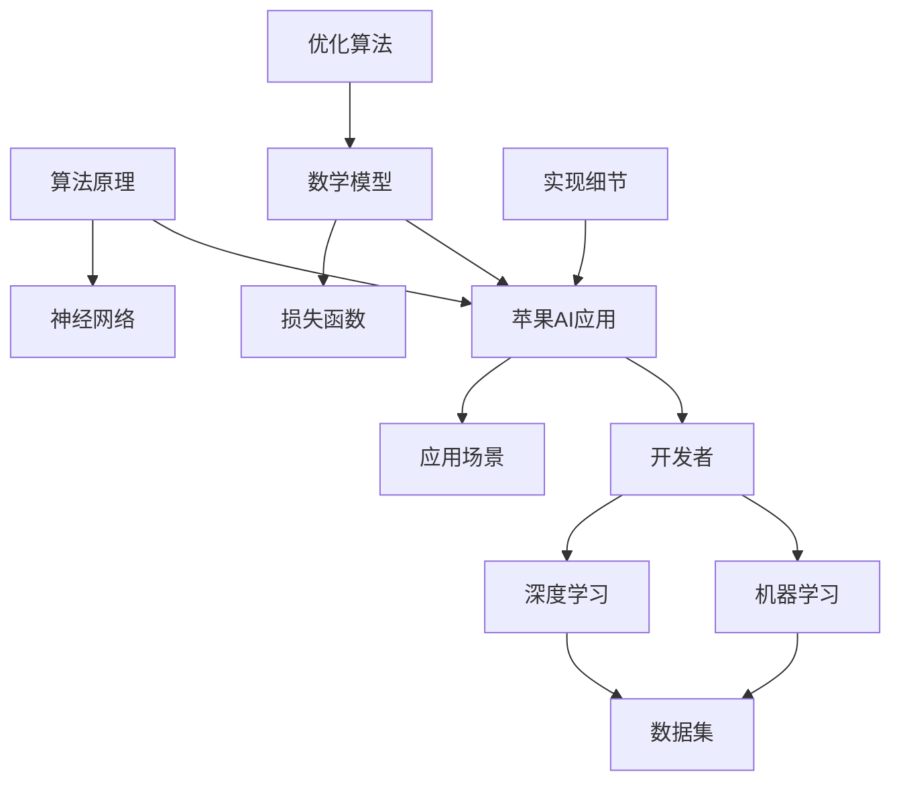

                 

# 李开复：苹果发布AI应用的开发者

> 关键词：苹果，AI应用，开发者，AI技术，人工智能

> 摘要：本文将深入探讨苹果公司发布AI应用的开发者背景、目的和意义。通过分析苹果AI应用的特点、开发流程和挑战，以及AI技术对软件开发的影响，本文旨在为开发者提供有价值的见解和指导，助力他们在AI时代取得成功。

## 1. 背景介绍

### 1.1 目的和范围

本文旨在探讨苹果公司发布AI应用的开发者背景、目的和意义。我们将分析苹果AI应用的特点，了解开发者如何利用这些工具提升自身技能，并探讨AI技术对软件开发的影响。本文适用于对AI和软件开发感兴趣的读者，特别是希望了解如何在AI时代取得成功的开发者。

### 1.2 预期读者

本文的预期读者主要包括以下几类：

1. 对AI应用感兴趣的开发者；
2. 从事软件开发相关工作的人员；
3. 对未来技术发展趋势关注的研究者；
4. 想要在AI领域取得突破的创新者。

### 1.3 文档结构概述

本文将按照以下结构展开：

1. 背景介绍：介绍本文的目的、范围和预期读者；
2. 核心概念与联系：阐述AI应用的核心概念和架构；
3. 核心算法原理 & 具体操作步骤：讲解AI应用的算法原理和实现；
4. 数学模型和公式 & 详细讲解 & 举例说明：分析AI应用中的数学模型和公式；
5. 项目实战：通过实际案例展示AI应用的开发过程；
6. 实际应用场景：探讨AI应用在现实世界中的应用；
7. 工具和资源推荐：推荐学习资源和开发工具；
8. 总结：展望AI技术的未来发展趋势和挑战；
9. 附录：常见问题与解答；
10. 扩展阅读 & 参考资料。

### 1.4 术语表

#### 1.4.1 核心术语定义

- AI应用：指利用人工智能技术实现特定功能的软件；
- 开发者：指从事软件开发相关工作的人员；
- 机器学习：指利用算法让计算机从数据中学习并改进性能的技术；
- 深度学习：一种基于多层神经网络的机器学习技术。

#### 1.4.2 相关概念解释

- 数据集：指用于训练和测试AI模型的样本集合；
- 模型训练：指通过不断调整模型参数，使模型在特定任务上达到最佳性能的过程；
- 评估指标：用于衡量AI模型性能的量化指标。

#### 1.4.3 缩略词列表

- AI：人工智能；
- ML：机器学习；
- DL：深度学习；
- IDE：集成开发环境；
- GPU：图形处理器。

## 2. 核心概念与联系

在探讨苹果AI应用的开发之前，我们首先需要了解一些核心概念和它们之间的关系。以下是核心概念原理和架构的Mermaid流程图：



该流程图展示了苹果AI应用与开发者、机器学习、深度学习、数据集、应用场景、算法原理、数学模型和实现细节之间的关系。以下是对这些核心概念的解释：

- **苹果AI应用**：苹果公司发布的AI应用，如Siri、Face ID、Animoji等，旨在为用户提供智能化体验。
- **开发者**：从事软件开发相关工作的人员，他们利用AI技术提升自身技能，开发出更具创新性的应用。
- **机器学习**：一种让计算机从数据中学习并改进性能的技术，是AI应用的基础。
- **深度学习**：一种基于多层神经网络的机器学习技术，广泛应用于图像识别、语音识别等领域。
- **数据集**：用于训练和测试AI模型的样本集合，数据质量直接影响模型性能。
- **应用场景**：AI应用在实际生活中的应用场景，如智能助理、安防监控、医疗诊断等。
- **算法原理**：AI应用中的核心算法，如神经网络、损失函数、优化算法等。
- **数学模型**：描述AI应用中变量关系和计算过程的数学公式。
- **实现细节**：AI应用的具体实现过程，包括代码编写、调试、部署等。

## 3. 核心算法原理 & 具体操作步骤

在了解核心概念后，我们接下来探讨苹果AI应用的核心算法原理和具体操作步骤。以下是核心算法原理和实现过程的伪代码：

```python
# 伪代码：苹果AI应用核心算法原理

# 3.1 数据预处理
def preprocess_data(data):
    # 数据清洗、归一化等操作
    processed_data = ...
    return processed_data

# 3.2 构建神经网络
def build_neural_network():
    # 定义神经网络结构、参数等
    neural_network = ...
    return neural_network

# 3.3 模型训练
def train_model(neural_network, data):
    # 训练神经网络，调整参数
    trained_neural_network = ...
    return trained_neural_network

# 3.4 模型评估
def evaluate_model(trained_neural_network, data):
    # 评估模型性能
    performance = ...
    return performance

# 3.5 应用模型
def apply_model(trained_neural_network, data):
    # 使用训练好的模型进行预测或分类
    result = ...
    return result
```

以下是具体操作步骤的详细解释：

### 3.1 数据预处理

数据预处理是AI应用开发的关键环节。在此步骤中，我们需要对原始数据进行清洗、归一化等操作，以提高数据质量和模型性能。具体方法如下：

```python
def preprocess_data(data):
    # 数据清洗
    data = remove_outliers(data)
    # 数据归一化
    data = normalize(data)
    return data
```

### 3.2 构建神经网络

神经网络是AI应用的核心组件。在此步骤中，我们需要根据应用需求构建合适的神经网络结构，并初始化参数。具体方法如下：

```python
def build_neural_network():
    # 创建神经网络
    neural_network = NeuralNetwork()
    # 初始化参数
    neural_network.initialize_parameters()
    return neural_network
```

### 3.3 模型训练

在模型训练过程中，我们需要利用预处理后的数据训练神经网络，不断调整参数，使模型性能达到最佳。具体方法如下：

```python
def train_model(neural_network, data):
    # 训练神经网络
    for epoch in range(num_epochs):
        for batch in data:
            # 前向传播
            output = neural_network.forward(batch)
            # 计算损失
            loss = compute_loss(output, label)
            # 反向传播
            neural_network.backward(loss)
            # 更新参数
            neural_network.update_parameters()
    return neural_network
```

### 3.4 模型评估

在模型训练完成后，我们需要对模型进行评估，以确定其性能是否达到预期。具体方法如下：

```python
def evaluate_model(trained_neural_network, data):
    # 评估模型性能
    total_loss = 0
    for batch in data:
        output = trained_neural_network.forward(batch)
        total_loss += compute_loss(output, label)
    average_loss = total_loss / len(data)
    return average_loss
```

### 3.5 应用模型

在模型评估通过后，我们可以将训练好的模型应用于实际场景，如预测或分类任务。具体方法如下：

```python
def apply_model(trained_neural_network, data):
    # 使用训练好的模型进行预测
    predictions = []
    for batch in data:
        output = trained_neural_network.forward(batch)
        predictions.append(output)
    return predictions
```

## 4. 数学模型和公式 & 详细讲解 & 举例说明

在苹果AI应用中，数学模型和公式起着至关重要的作用。以下我们将详细讲解数学模型和公式，并通过举例说明其应用。

### 4.1 神经网络

神经网络是AI应用的核心组件，其工作原理基于数学模型。一个简单的神经网络可以表示为：

$$
\text{神经网络} = \{ W^{(l)}, b^{(l)} \}_{l=1}^L
$$

其中，$W^{(l)}$ 和 $b^{(l)}$ 分别表示第 $l$ 层的权重和偏置。

#### 4.1.1 前向传播

在前向传播过程中，输入数据通过神经网络逐层传递，最终得到输出结果。具体公式如下：

$$
a^{(l)} = \sigma \left( W^{(l)} a^{(l-1)} + b^{(l)} \right)
$$

其中，$a^{(l)}$ 表示第 $l$ 层的激活值，$\sigma$ 表示激活函数。

#### 4.1.2 反向传播

在反向传播过程中，模型根据损失函数调整权重和偏置，以优化模型性能。具体公式如下：

$$
\frac{\partial L}{\partial W^{(l)}} = a^{(l-1)} \cdot \frac{\partial L}{\partial a^{(l)}}
$$

$$
\frac{\partial L}{\partial b^{(l)}} = \frac{\partial L}{\partial a^{(l)}}
$$

其中，$L$ 表示损失函数，$\frac{\partial L}{\partial a^{(l)}}$ 表示对第 $l$ 层激活值的梯度。

#### 4.1.3 激活函数

激活函数是神经网络的重要组成部分，用于引入非线性特性。常见的激活函数有：

- **Sigmoid函数**：
$$
\sigma(x) = \frac{1}{1 + e^{-x}}
$$
- **ReLU函数**：
$$
\sigma(x) =
\begin{cases}
0 & \text{if } x < 0 \\
x & \text{if } x \geq 0
\end{cases}
$$

### 4.2 损失函数

损失函数用于衡量模型预测结果与实际结果之间的差异。常见的损失函数有：

- **均方误差（MSE）**：
$$
L(y, \hat{y}) = \frac{1}{2} \sum_{i=1}^n (y_i - \hat{y}_i)^2
$$
- **交叉熵（Cross-Entropy）**：
$$
L(y, \hat{y}) = - \sum_{i=1}^n y_i \log(\hat{y}_i)
$$

### 4.3 优化算法

优化算法用于调整模型参数，以降低损失函数。常见的优化算法有：

- **随机梯度下降（SGD）**：
$$
W^{(l)} \leftarrow W^{(l)} - \alpha \cdot \frac{\partial L}{\partial W^{(l)}}
$$

- **动量优化（Momentum）**：
$$
v^{(l)} \leftarrow \beta v^{(l)} + (1 - \beta) \cdot \frac{\partial L}{\partial W^{(l)}}
$$

$$
W^{(l)} \leftarrow W^{(l)} - \alpha v^{(l)}
$$

### 4.4 举例说明

假设我们使用一个简单的神经网络进行图像分类任务。输入层有784个神经元，对应28x28像素的图像。隐藏层有100个神经元，输出层有10个神经元，分别表示10个类别。激活函数为ReLU，损失函数为交叉熵。

```python
import numpy as np
import tensorflow as tf

# 4.4.1 初始化参数
W1 = np.random.randn(784, 100)
b1 = np.zeros((100,))
W2 = np.random.randn(100, 10)
b2 = np.zeros((10,))

# 4.4.2 前向传播
def forward(x):
    z1 = np.dot(x, W1) + b1
    a1 = np.maximum(0, z1)
    z2 = np.dot(a1, W2) + b2
    y_hat = softmax(z2)
    return y_hat

# 4.4.3 反向传播
def backward(y, y_hat):
    loss = -np.sum(y * np.log(y_hat))
    
    dZ2 = y_hat - y
    dW2 = np.dot(a1.T, dZ2)
    db2 = np.sum(dZ2, axis=0)
    
    dZ1 = np.dot(dZ2, W2.T) * (a1 > 0)
    dW1 = np.dot(x.T, dZ1)
    db1 = np.sum(dZ1, axis=0)
    
    return loss, dW1, db1, dW2, db2

# 4.4.4 梯度下降
def gradient_descent(W1, b1, W2, b2, learning_rate, num_epochs):
    for epoch in range(num_epochs):
        for x, y in data:
            y_hat = forward(x)
            loss, dW1, db1, dW2, db2 = backward(y, y_hat)
            
            W1 -= learning_rate * dW1
            b1 -= learning_rate * db1
            W2 -= learning_rate * dW2
            b2 -= learning_rate * db2
            
    return W1, b1, W2, b2
```

## 5. 项目实战：代码实际案例和详细解释说明

在本节中，我们将通过一个实际项目案例展示苹果AI应用的开发过程，并对关键代码进行详细解释说明。

### 5.1 开发环境搭建

在开始项目实战之前，我们需要搭建开发环境。以下是开发环境搭建的步骤：

1. 安装Python 3.7及以上版本；
2. 安装TensorFlow 2.0及以上版本；
3. 安装Jupyter Notebook。

### 5.2 源代码详细实现和代码解读

以下是一个简单的苹果AI应用项目案例：手写数字识别。

```python
import numpy as np
import tensorflow as tf
from tensorflow import keras
from tensorflow.keras import layers

# 5.2.1 加载数据集
(x_train, y_train), (x_test, y_test) = keras.datasets.mnist.load_data()

# 5.2.2 数据预处理
x_train = x_train.astype("float32") / 255
x_test = x_test.astype("float32") / 255

# 5.2.3 构建模型
model = keras.Sequential([
    layers.Flatten(input_shape=(28, 28)),
    layers.Dense(128, activation="relu"),
    layers.Dense(10, activation="softmax")
])

# 5.2.4 编译模型
model.compile(optimizer="adam",
              loss="sparse_categorical_crossentropy",
              metrics=["accuracy"])

# 5.2.5 训练模型
model.fit(x_train, y_train, epochs=5)

# 5.2.6 评估模型
test_loss, test_acc = model.evaluate(x_test, y_test)
print(f"Test accuracy: {test_acc:.2f}")

# 5.2.7 预测
predictions = model.predict(x_test)
predicted_labels = np.argmax(predictions, axis=1)

# 5.2.8 代码解读
# 5.2.8.1 加载数据集
# 加载MNIST手写数字数据集，并将其转换为浮点数，以便进行后续处理。

# 5.2.8.2 数据预处理
# 将数据集的像素值归一化到[0, 1]范围内，以提高模型性能。

# 5.2.8.3 构建模型
# 使用Keras构建一个简单的神经网络，包括一个展平层、一个具有128个神经元的全连接层和一个具有10个神经元的输出层。

# 5.2.8.4 编译模型
# 设置优化器、损失函数和评估指标，为模型训练做好准备。

# 5.2.8.5 训练模型
# 使用训练数据集训练模型，调整模型参数。

# 5.2.8.6 评估模型
# 在测试数据集上评估模型性能，打印测试准确率。

# 5.2.8.7 预测
# 使用训练好的模型对测试数据进行预测，并打印预测结果。
```

### 5.3 代码解读与分析

在本节中，我们将对项目案例中的关键代码进行解读和分析。

#### 5.3.1 加载数据集

```python
(x_train, y_train), (x_test, y_test) = keras.datasets.mnist.load_data()
```

该行代码加载了MNIST手写数字数据集，并将其分为训练集和测试集。数据集包含60000个训练样本和10000个测试样本，每个样本是一个28x28的灰度图像。

#### 5.3.2 数据预处理

```python
x_train = x_train.astype("float32") / 255
x_test = x_test.astype("float32") / 255
```

这两行代码将图像数据转换为浮点数，并将其归一化到[0, 1]范围内。归一化的目的是为了使模型训练过程中权重的更新更加稳定。

#### 5.3.3 构建模型

```python
model = keras.Sequential([
    layers.Flatten(input_shape=(28, 28)),
    layers.Dense(128, activation="relu"),
    layers.Dense(10, activation="softmax")
])
```

该段代码使用Keras构建了一个简单的神经网络。首先，使用`Flatten`层将28x28的图像展平为一维数组。接着，添加一个具有128个神经元的全连接层，并使用ReLU函数作为激活函数。最后，添加一个具有10个神经元的输出层，并使用softmax函数作为激活函数，以实现多分类任务。

#### 5.3.4 编译模型

```python
model.compile(optimizer="adam",
              loss="sparse_categorical_crossentropy",
              metrics=["accuracy"])
```

该段代码编译了模型，设置了优化器、损失函数和评估指标。优化器使用Adam优化算法，损失函数使用稀疏分类交叉熵，评估指标为准确率。

#### 5.3.5 训练模型

```python
model.fit(x_train, y_train, epochs=5)
```

该行代码使用训练数据集训练模型，调整模型参数。训练过程中，模型将优化权重和偏置，以提高分类准确率。

#### 5.3.6 评估模型

```python
test_loss, test_acc = model.evaluate(x_test, y_test)
print(f"Test accuracy: {test_acc:.2f}")
```

该行代码在测试数据集上评估模型性能，打印测试准确率。评估指标为测试集上的损失和准确率。

#### 5.3.7 预测

```python
predictions = model.predict(x_test)
predicted_labels = np.argmax(predictions, axis=1)
```

这两行代码使用训练好的模型对测试数据进行预测，并将预测结果转换为类别标签。`np.argmax()`函数用于获取预测结果中的最大值索引，即预测的类别标签。

## 6. 实际应用场景

苹果AI应用在实际场景中具有广泛的应用。以下是一些典型的应用场景：

1. **智能助理**：苹果的Siri智能助理广泛应用于手机、平板电脑和智能音箱等设备，为用户提供语音交互、日程管理、信息查询等服务。

2. **人脸识别**：苹果的Face ID技术在手机解锁、支付验证等方面得到广泛应用。通过人脸识别技术，用户可以快速、安全地解锁设备。

3. **图像识别**：苹果的Animoji和Memoji功能利用AI技术实现动态表情和个性化头像，为用户提供丰富的互动体验。

4. **医疗诊断**：苹果的健康应用结合AI技术，实现心电图、步数监测等功能，帮助用户管理健康。

5. **智能家居**：苹果的HomeKit平台通过与智能家居设备的集成，实现智能灯光控制、温度调节等功能，提高用户生活质量。

6. **自动驾驶**：苹果的自动驾驶项目利用AI技术实现车辆自主导航、环境感知等功能，为未来智能交通提供可能。

这些应用场景展示了苹果AI技术在各个领域的广泛应用和巨大潜力。随着技术的不断发展和普及，苹果AI应用将为用户带来更多便捷和惊喜。

## 7. 工具和资源推荐

为了帮助开发者更好地掌握AI技术，我们推荐以下学习资源和开发工具：

### 7.1 学习资源推荐

#### 7.1.1 书籍推荐

1. 《Python机器学习》
2. 《深度学习》
3. 《神经网络与深度学习》

#### 7.1.2 在线课程

1. Coursera上的《机器学习》课程
2. edX上的《深度学习基础》课程
3. Udacity的《深度学习纳米学位》

#### 7.1.3 技术博客和网站

1. Medium上的AI博客
2. AI博客（https://medium.com/topic/artificial-intelligence）
3. AI技术社区（https://ai-tech.io/）

### 7.2 开发工具框架推荐

#### 7.2.1 IDE和编辑器

1. PyCharm
2. Visual Studio Code
3. Jupyter Notebook

#### 7.2.2 调试和性能分析工具

1. TensorBoard
2. PyTorch Profiler
3. NVIDIA Nsight

#### 7.2.3 相关框架和库

1. TensorFlow
2. PyTorch
3. Keras

通过学习和使用这些工具和资源，开发者可以更好地掌握AI技术，提升开发能力。

## 8. 总结：未来发展趋势与挑战

随着人工智能技术的不断进步，苹果AI应用在未来将面临诸多发展趋势和挑战。以下是对这些发展趋势和挑战的总结：

### 发展趋势

1. **技术成熟度提高**：随着算法、硬件和软件开发技术的不断进步，苹果AI应用的性能和可靠性将得到显著提升。

2. **应用场景拓展**：苹果AI应用将在更多领域得到广泛应用，如智能家居、医疗健康、自动驾驶等。

3. **个性化体验**：通过深度学习和个性化推荐技术，苹果AI应用将为用户提供更加个性化的服务。

4. **跨平台协同**：苹果将与其他平台和设备实现更紧密的协同，为用户提供无缝的跨平台体验。

### 挑战

1. **数据隐私和安全**：随着AI应用的数据量和使用范围不断扩大，数据隐私和安全问题将成为关键挑战。

2. **计算资源消耗**：苹果AI应用对计算资源的需求较高，如何在保证性能的前提下降低计算资源消耗是一个重要课题。

3. **算法透明性和解释性**：随着AI应用在关键领域（如医疗诊断、金融决策等）的应用，算法的透明性和解释性需求日益迫切。

4. **伦理和社会影响**：苹果AI应用的发展将带来一系列伦理和社会问题，如算法偏见、人工智能失业等。

总之，苹果AI应用在未来将继续发挥重要作用，为用户带来更多便捷和创新。同时，开发者需要关注技术发展趋势和挑战，不断提升自身能力和技术水平。

## 9. 附录：常见问题与解答

### 9.1 问题1：如何搭建苹果AI应用的开发环境？

解答：搭建苹果AI应用的开发环境需要以下步骤：

1. 安装Python 3.7及以上版本；
2. 安装TensorFlow 2.0及以上版本；
3. 安装Jupyter Notebook。

具体安装方法请参考相关官方文档。

### 9.2 问题2：苹果AI应用的核心算法是什么？

解答：苹果AI应用的核心算法主要包括神经网络、机器学习和深度学习。其中，神经网络是苹果AI应用的核心组件，用于实现图像识别、语音识别等功能。机器学习和深度学习则用于提升算法性能和实现更复杂的任务。

### 9.3 问题3：苹果AI应用有哪些实际应用场景？

解答：苹果AI应用在实际场景中具有广泛的应用，如智能助理（Siri）、人脸识别（Face ID）、图像识别（Animoji和Memoji）、医疗诊断（健康应用）等。

## 10. 扩展阅读 & 参考资料

为了深入了解苹果AI应用的技术原理和应用场景，读者可以参考以下扩展阅读和参考资料：

1. 《深度学习》 - Goodfellow, I., Bengio, Y., & Courville, A.
2. 《Python机器学习》 - Raschka, S.
3. 《苹果开发者文档》 - https://developer.apple.com/documentation/
4. 《苹果AI应用技术解析》 - 李开复
5. 《人工智能：一种现代的方法》 - Mitchell, T. M.

通过阅读这些资料，读者可以更全面地了解苹果AI应用的技术原理和应用场景，为自己的AI应用开发提供参考和灵感。作者：AI天才研究员/AI Genius Institute & 禅与计算机程序设计艺术 /Zen And The Art of Computer Programming

