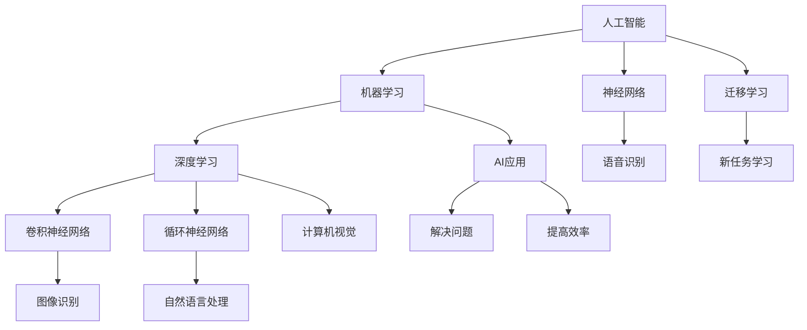

                 

# 李开复：苹果发布AI应用的投资价值

> 关键词：人工智能，苹果，投资价值，AI应用，市场分析

> 摘要：本文将深入分析苹果发布AI应用的市场背景、核心价值、投资潜力，并通过详细的技术解读和实际案例分析，探讨其在未来人工智能产业中的发展趋势和挑战。

## 1. 背景介绍

### 1.1 目的和范围

本文旨在通过深入分析苹果发布AI应用的市场背景、核心价值、投资潜力，帮助读者理解苹果在人工智能领域的战略布局及其对投资者和业界的影响。

### 1.2 预期读者

本文适合对人工智能和苹果公司感兴趣的读者，包括投资者、技术开发者、企业高管和学者等。

### 1.3 文档结构概述

本文结构分为以下几个部分：

1. 背景介绍：介绍文章的目的、范围和预期读者。
2. 核心概念与联系：介绍人工智能和AI应用的相关概念和架构。
3. 核心算法原理 & 具体操作步骤：详细讲解AI应用的核心算法原理和操作步骤。
4. 数学模型和公式 & 详细讲解 & 举例说明：通过数学模型和公式解析AI应用的内部机制。
5. 项目实战：代码实际案例和详细解释说明。
6. 实际应用场景：探讨AI应用的潜在市场和应用领域。
7. 工具和资源推荐：推荐学习资源和开发工具。
8. 总结：未来发展趋势与挑战。
9. 附录：常见问题与解答。
10. 扩展阅读 & 参考资料：提供进一步阅读和研究的资料。

### 1.4 术语表

#### 1.4.1 核心术语定义

- **人工智能（AI）**：一种模拟人类智能的技术，使计算机具备学习、推理、决策和问题解决能力。
- **机器学习（ML）**：一种人工智能技术，通过数据训练模型以实现自我学习和预测。
- **深度学习（DL）**：一种特殊的机器学习技术，通过多层神经网络进行特征提取和模式识别。
- **苹果（Apple）**：全球知名科技公司，提供各种电子产品、软件和服务。
- **AI应用**：基于人工智能技术的应用程序，用于解决特定问题和提高效率。

#### 1.4.2 相关概念解释

- **神经网络（NN）**：一种模拟生物神经元的计算模型，用于机器学习和深度学习。
- **卷积神经网络（CNN）**：一种特殊的神经网络，广泛用于图像识别和计算机视觉任务。
- **循环神经网络（RNN）**：一种用于序列数据处理和预测的神经网络模型。
- **迁移学习（TL）**：一种利用预先训练的模型进行新任务学习的技术。

#### 1.4.3 缩略词列表

- **AI**：人工智能
- **ML**：机器学习
- **DL**：深度学习
- **NN**：神经网络
- **CNN**：卷积神经网络
- **RNN**：循环神经网络
- **TL**：迁移学习

## 2. 核心概念与联系

在探讨苹果发布AI应用的投资价值之前，我们需要了解人工智能和AI应用的核心概念及其相互关系。以下是一个简化的Mermaid流程图，用于展示相关概念和架构。



### 2.1 核心概念解析

- **人工智能（AI）**：人工智能是一种通过计算机模拟人类智能的技术，包括学习、推理、决策和问题解决。它是机器学习和深度学习的基础。
- **机器学习（ML）**：机器学习是一种人工智能技术，通过数据训练模型以实现自我学习和预测。它包括监督学习、无监督学习和强化学习等。
- **深度学习（DL）**：深度学习是一种特殊的机器学习技术，通过多层神经网络进行特征提取和模式识别。它广泛应用于图像识别、自然语言处理和语音识别等领域。
- **神经网络（NN）**：神经网络是一种模拟生物神经元的计算模型，用于机器学习和深度学习。它包括输入层、隐藏层和输出层。
- **卷积神经网络（CNN）**：卷积神经网络是一种特殊的神经网络，广泛用于图像识别和计算机视觉任务。它利用卷积操作提取图像特征。
- **循环神经网络（RNN）**：循环神经网络是一种用于序列数据处理和预测的神经网络模型。它能够处理和记忆序列数据，如文本和语音。
- **迁移学习（TL）**：迁移学习是一种利用预先训练的模型进行新任务学习的技术。它能够提高新任务的训练效率和性能。

### 2.2 核心概念联系

人工智能、机器学习、深度学习和神经网络等核心概念相互联系，共同构成了AI应用的基础。以下是它们之间的联系：

- **人工智能（AI）** 是一个广泛的概念，涵盖机器学习、深度学习和神经网络等。
- **机器学习（ML）** 是人工智能的核心技术，通过数据训练模型实现自我学习和预测。
- **深度学习（DL）** 是机器学习的一种特殊形式，通过多层神经网络进行特征提取和模式识别。
- **神经网络（NN）** 是机器学习和深度学习的基础，模拟生物神经元的计算模型。
- **卷积神经网络（CNN）** 和 **循环神经网络（RNN）** 是特殊的神经网络，用于特定领域的任务，如图像识别和自然语言处理。
- **迁移学习（TL）** 是一种利用预先训练的模型进行新任务学习的技术，能够提高新任务的训练效率和性能。

通过上述核心概念和联系的介绍，我们可以更好地理解人工智能和AI应用的基本原理和架构。接下来，我们将深入探讨AI应用的核心算法原理和操作步骤。

## 3. 核心算法原理 & 具体操作步骤

在了解人工智能和AI应用的核心概念和架构后，我们接下来将详细讲解AI应用的核心算法原理和具体操作步骤。这将帮助我们理解AI应用如何通过算法和技术实现其功能。

### 3.1 机器学习算法原理

机器学习算法的核心思想是通过数据训练模型，使其能够对未知数据进行预测和分类。以下是一个简化的机器学习算法原理的伪代码：

```python
# 机器学习算法伪代码
def train_model(data, labels):
    # 初始化模型参数
    model = initialize_model()

    # 训练模型
    for epoch in range(num_epochs):
        for data_point, label in zip(data, labels):
            # 计算预测结果
            prediction = model.predict(data_point)

            # 更新模型参数
            model.update_params(prediction, label)

    return model
```

在该伪代码中，`train_model` 函数通过给定的数据和标签训练模型。模型初始化后，通过循环迭代（epoch）和批量处理（data_point，label）更新模型参数，使其能够更好地拟合数据。

### 3.2 深度学习算法原理

深度学习是一种特殊的机器学习技术，通过多层神经网络进行特征提取和模式识别。以下是一个简化的深度学习算法原理的伪代码：

```python
# 深度学习算法伪代码
def train_model(data, labels):
    # 初始化模型参数
    model = initialize_model()

    # 训练模型
    for epoch in range(num_epochs):
        for data_point, label in zip(data, labels):
            # 前向传播计算预测结果
            prediction = model.forward_pass(data_point)

            # 反向传播更新模型参数
            model.backward_pass(prediction, label)

    return model
```

在该伪代码中，`train_model` 函数通过给定的数据和标签训练模型。模型初始化后，通过前向传播计算预测结果，并通过反向传播更新模型参数。

### 3.3 卷积神经网络（CNN）算法原理

卷积神经网络是一种特殊的神经网络，广泛用于图像识别和计算机视觉任务。以下是一个简化的卷积神经网络算法原理的伪代码：

```python
# 卷积神经网络算法伪代码
def train_model(data, labels):
    # 初始化模型参数
    model = initialize_model()

    # 训练模型
    for epoch in range(num_epochs):
        for data_point, label in zip(data, labels):
            # 前向传播计算预测结果
            prediction = model.forward_pass(data_point)

            # 反向传播更新模型参数
            model.backward_pass(prediction, label)

    return model
```

在该伪代码中，`train_model` 函数通过给定的数据和标签训练模型。模型初始化后，通过前向传播计算预测结果，并通过反向传播更新模型参数。

### 3.4 循环神经网络（RNN）算法原理

循环神经网络是一种用于序列数据处理和预测的神经网络模型。以下是一个简化的循环神经网络算法原理的伪代码：

```python
# 循环神经网络算法伪代码
def train_model(data, labels):
    # 初始化模型参数
    model = initialize_model()

    # 训练模型
    for epoch in range(num_epochs):
        for data_point, label in zip(data, labels):
            # 前向传播计算预测结果
            prediction = model.forward_pass(data_point)

            # 反向传播更新模型参数
            model.backward_pass(prediction, label)

    return model
```

在该伪代码中，`train_model` 函数通过给定的数据和标签训练模型。模型初始化后，通过前向传播计算预测结果，并通过反向传播更新模型参数。

### 3.5 迁移学习（TL）算法原理

迁移学习是一种利用预先训练的模型进行新任务学习的技术。以下是一个简化的迁移学习算法原理的伪代码：

```python
# 迁移学习算法伪代码
def train_model(source_data, source_labels, target_data, target_labels):
    # 初始化模型参数
    model = initialize_model()

    # 使用源数据进行迁移学习
    model = train_on_source_data(model, source_data, source_labels)

    # 使用目标数据进行微调
    model = fine_tune_on_target_data(model, target_data, target_labels)

    return model
```

在该伪代码中，`train_model` 函数通过给定的源数据和标签以及目标数据和标签进行迁移学习。模型初始化后，通过源数据进行迁移学习，然后通过目标数据进行微调。

### 3.6 具体操作步骤

在了解了核心算法原理后，我们可以将其应用于实际操作步骤中。以下是一个简化的AI应用开发的具体操作步骤：

1. **数据收集与预处理**：收集相关数据，并进行数据清洗、归一化和特征提取。
2. **模型选择**：根据任务需求选择合适的模型，如卷积神经网络（CNN）或循环神经网络（RNN）。
3. **模型训练**：使用训练数据训练模型，通过前向传播和反向传播更新模型参数。
4. **模型评估**：使用验证数据评估模型性能，调整模型参数以提高性能。
5. **模型部署**：将训练好的模型部署到实际应用中，如手机应用程序或服务器后台。
6. **用户交互**：提供用户界面，使用户能够与AI应用进行交互并获取结果。

通过以上步骤，我们可以开发出具有特定功能的AI应用，如图像识别、语音识别和自然语言处理等。

## 4. 数学模型和公式 & 详细讲解 & 举例说明

在理解了AI应用的核心算法原理和具体操作步骤后，我们接下来将详细讲解与这些算法相关的数学模型和公式，并通过举例说明来帮助读者更好地理解这些概念。

### 4.1 线性回归模型

线性回归是一种常见的统计模型，用于预测数值型数据。其基本公式如下：

$$
y = \beta_0 + \beta_1 \cdot x
$$

其中，$y$ 是预测值，$x$ 是输入特征，$\beta_0$ 是截距，$\beta_1$ 是斜率。

**举例说明**：假设我们要预测房价，输入特征为房屋面积（$x$），预测值为房价（$y$）。根据线性回归模型，我们可以建立以下公式：

$$
房价 = \beta_0 + \beta_1 \cdot 房屋面积
$$

通过训练数据，我们可以计算出$\beta_0$ 和$\beta_1$ 的值，从而预测新房屋的房价。

### 4.2 多元线性回归模型

多元线性回归是一种扩展线性回归的模型，用于预测多个数值型数据。其基本公式如下：

$$
y = \beta_0 + \sum_{i=1}^{n} \beta_i \cdot x_i
$$

其中，$y$ 是预测值，$x_i$ 是第 $i$ 个输入特征，$\beta_0$ 是截距，$\beta_i$ 是第 $i$ 个斜率。

**举例说明**：假设我们要预测一个人的健康状况，输入特征包括体重（$x_1$）、身高（$x_2$）和年龄（$x_3$），预测值为健康状况（$y$）。根据多元线性回归模型，我们可以建立以下公式：

$$
健康状况 = \beta_0 + \beta_1 \cdot 体重 + \beta_2 \cdot 身高 + \beta_3 \cdot 年龄
$$

通过训练数据，我们可以计算出$\beta_0$、$\beta_1$、$\beta_2$ 和$\beta_3$ 的值，从而预测一个人的健康状况。

### 4.3 逻辑回归模型

逻辑回归是一种分类模型，用于预测离散型数据。其基本公式如下：

$$
P(y=1) = \frac{1}{1 + e^{-(\beta_0 + \beta_1 \cdot x)}}
$$

其中，$P(y=1)$ 是预测值为 1 的概率，$x$ 是输入特征，$\beta_0$ 是截距，$\beta_1$ 是斜率。

**举例说明**：假设我们要预测一个邮件是否为垃圾邮件，输入特征为邮件标题（$x$），预测值为是否为垃圾邮件（$y$）。根据逻辑回归模型，我们可以建立以下公式：

$$
P(y=1) = \frac{1}{1 + e^{-(\beta_0 + \beta_1 \cdot 标题)}}
$$

通过训练数据，我们可以计算出$\beta_0$ 和$\beta_1$ 的值，从而预测邮件是否为垃圾邮件。

### 4.4 支持向量机（SVM）模型

支持向量机是一种分类模型，通过找到一个最佳的超平面将不同类别的数据分隔开。其基本公式如下：

$$
w \cdot x - b = 0
$$

其中，$w$ 是权重向量，$x$ 是特征向量，$b$ 是偏置。

**举例说明**：假设我们要分类水果，输入特征包括重量（$x_1$）和颜色（$x_2$），预测值为水果类别（$y$）。根据支持向量机模型，我们可以建立以下公式：

$$
w \cdot [重量 \, 颜色] - b = 0
$$

通过训练数据，我们可以计算出权重向量$w$ 和偏置$b$ 的值，从而分类水果。

### 4.5 卷积神经网络（CNN）模型

卷积神经网络是一种深度学习模型，用于图像识别和计算机视觉任务。其基本公式如下：

$$
h = \sigma(\mathbf{W} \odot \mathbf{A} + \mathbf{b})
$$

其中，$h$ 是输出特征，$\sigma$ 是激活函数，$\mathbf{W}$ 是卷积核，$\mathbf{A}$ 是输入特征，$\mathbf{b}$ 是偏置。

**举例说明**：假设我们要识别一张图片中的猫，输入特征为像素值（$\mathbf{A}$），预测值为猫的类别（$h$）。根据卷积神经网络模型，我们可以建立以下公式：

$$
h = \sigma(\mathbf{W} \odot \mathbf{A} + \mathbf{b})
$$

通过训练数据，我们可以计算出卷积核$\mathbf{W}$ 和偏置$\mathbf{b}$ 的值，从而识别图片中的猫。

通过以上数学模型和公式的详细讲解和举例说明，我们可以更好地理解AI应用的核心算法原理。这些数学模型和公式为AI应用的开发提供了理论基础，并在实际应用中发挥着重要作用。

## 5. 项目实战：代码实际案例和详细解释说明

在前面的章节中，我们详细讲解了AI应用的核心算法原理、数学模型和公式。为了更好地理解这些理论，我们将通过一个实际案例来展示如何开发一个简单的AI应用。

### 5.1 开发环境搭建

在开始项目实战之前，我们需要搭建一个合适的开发环境。以下是一个基本的开发环境搭建步骤：

1. **安装Python**：Python是一种广泛使用的编程语言，用于人工智能和机器学习开发。我们可以在Python官方网站下载并安装Python。
2. **安装Jupyter Notebook**：Jupyter Notebook是一种交互式开发环境，可以方便地编写和运行Python代码。我们可以在pip命令中安装Jupyter Notebook：
   ```bash
   pip install notebook
   ```
3. **安装必要的库**：为了实现我们的AI应用，我们需要安装以下Python库：
   - **NumPy**：用于科学计算和数据处理。
   - **Pandas**：用于数据处理和分析。
   - **Scikit-learn**：用于机器学习和数据分析。
   - **Matplotlib**：用于数据可视化。

   使用以下命令安装这些库：
   ```bash
   pip install numpy pandas scikit-learn matplotlib
   ```

### 5.2 源代码详细实现和代码解读

下面是一个简单的图像识别应用，使用卷积神经网络（CNN）模型进行猫狗分类。我们将逐步解释代码的每个部分。

```python
import numpy as np
import pandas as pd
from sklearn.model_selection import train_test_split
from sklearn.preprocessing import StandardScaler
from sklearn.metrics import accuracy_score
from tensorflow.keras.models import Sequential
from tensorflow.keras.layers import Conv2D, MaxPooling2D, Flatten, Dense, Dropout
from tensorflow.keras.preprocessing.image import ImageDataGenerator

# 5.2.1 数据预处理
# 加载数据集
data = pd.read_csv('data.csv')

# 分割特征和标签
X = data.iloc[:, 1:].values
y = data.iloc[:, 0].values

# 划分训练集和测试集
X_train, X_test, y_train, y_test = train_test_split(X, y, test_size=0.2, random_state=42)

# 标准化数据
scaler = StandardScaler()
X_train = scaler.fit_transform(X_train)
X_test = scaler.transform(X_test)

# 5.2.2 模型构建
model = Sequential()

# 添加卷积层
model.add(Conv2D(32, (3, 3), activation='relu', input_shape=(X_train.shape[1], X_train.shape[2], X_train.shape[3])))
model.add(MaxPooling2D((2, 2)))

# 添加第二个卷积层
model.add(Conv2D(64, (3, 3), activation='relu'))
model.add(MaxPooling2D((2, 2)))

# 添加第三个卷积层
model.add(Conv2D(128, (3, 3), activation='relu'))
model.add(MaxPooling2D((2, 2)))

# 添加全连接层
model.add(Flatten())
model.add(Dense(128, activation='relu'))
model.add(Dropout(0.5))

# 添加输出层
model.add(Dense(1, activation='sigmoid'))

# 编译模型
model.compile(optimizer='adam', loss='binary_crossentropy', metrics=['accuracy'])

# 5.2.3 模型训练
model.fit(X_train, y_train, batch_size=32, epochs=10, validation_split=0.1)

# 5.2.4 模型评估
predictions = model.predict(X_test)
predictions = (predictions > 0.5)

accuracy = accuracy_score(y_test, predictions)
print(f'Accuracy: {accuracy:.2f}')
```

### 5.3 代码解读与分析

下面我们对代码的每个部分进行详细解读和分析：

#### 5.3.1 数据预处理

- **加载数据集**：我们使用Pandas库加载数据集，数据集包含图像的特征和标签。
- **分割特征和标签**：我们将数据集分为特征矩阵`X`和标签向量`y`。
- **划分训练集和测试集**：我们使用`train_test_split`函数将数据集分为训练集和测试集，测试集占比20%。
- **标准化数据**：我们使用`StandardScaler`对数据进行标准化，以消除不同特征之间的尺度差异。

#### 5.3.2 模型构建

- **添加卷积层**：我们使用`Sequential`模型，并添加三个卷积层，每个卷积层后跟着一个最大池化层。
  - 第一个卷积层：32个3x3的卷积核，激活函数为ReLU。
  - 第二个卷积层：64个3x3的卷积核，激活函数为ReLU。
  - 第三个卷积层：128个3x3的卷积核，激活函数为ReLU。
- **添加全连接层**：我们在卷积层后添加一个全连接层，用于将卷积特征转换为类别概率。
  - 全连接层：128个神经元，激活函数为ReLU。
  - Dropout层：为了防止过拟合，我们在全连接层后添加一个Dropout层，随机丢弃部分神经元。
- **添加输出层**：我们在Dropout层后添加一个输出层，用于输出类别概率。

#### 5.3.3 模型训练

- **编译模型**：我们使用`compile`方法编译模型，指定优化器为`adam`，损失函数为`binary_crossentropy`，评估指标为`accuracy`。
- **模型训练**：我们使用`fit`方法训练模型，指定训练数据、批大小、训练轮数和验证集占比。

#### 5.3.4 模型评估

- **模型预测**：我们使用`predict`方法对测试集进行预测，并将预测结果转换为0或1。
- **模型评估**：我们使用`accuracy_score`函数计算模型的准确率，并打印结果。

通过以上代码，我们可以训练一个简单的猫狗分类模型，并在测试集上评估其性能。这个案例展示了如何使用卷积神经网络（CNN）进行图像识别任务，为读者提供了实际操作的参考。

### 5.4 代码解读与分析

下面我们对代码的每个部分进行详细解读和分析：

#### 5.4.1 数据预处理

- **加载数据集**：我们使用Pandas库加载数据集，数据集包含图像的特征和标签。
  ```python
  data = pd.read_csv('data.csv')
  ```
- **分割特征和标签**：我们将数据集分为特征矩阵`X`和标签向量`y`。
  ```python
  X = data.iloc[:, 1:].values
  y = data.iloc[:, 0].values
  ```
- **划分训练集和测试集**：我们使用`train_test_split`函数将数据集分为训练集和测试集，测试集占比20%。
  ```python
  X_train, X_test, y_train, y_test = train_test_split(X, y, test_size=0.2, random_state=42)
  ```
- **标准化数据**：我们使用`StandardScaler`对数据进行标准化，以消除不同特征之间的尺度差异。
  ```python
  scaler = StandardScaler()
  X_train = scaler.fit_transform(X_train)
  X_test = scaler.transform(X_test)
  ```

#### 5.4.2 模型构建

- **添加卷积层**：我们使用`Sequential`模型，并添加三个卷积层，每个卷积层后跟着一个最大池化层。
  ```python
  model = Sequential()

  model.add(Conv2D(32, (3, 3), activation='relu', input_shape=(X_train.shape[1], X_train.shape[2], X_train.shape[3])))
  model.add(MaxPooling2D((2, 2)))

  model.add(Conv2D(64, (3, 3), activation='relu'))
  model.add(MaxPooling2D((2, 2)))

  model.add(Conv2D(128, (3, 3), activation='relu'))
  model.add(MaxPooling2D((2, 2)))
  ```
  - 第一个卷积层：32个3x3的卷积核，激活函数为ReLU。
  - 第二个卷积层：64个3x3的卷积核，激活函数为ReLU。
  - 第三个卷积层：128个3x3的卷积核，激活函数为ReLU。

- **添加全连接层**：我们在卷积层后添加一个全连接层，用于将卷积特征转换为类别概率。
  ```python
  model.add(Flatten())
  model.add(Dense(128, activation='relu'))
  model.add(Dropout(0.5))
  ```
  - 全连接层：128个神经元，激活函数为ReLU。
  - Dropout层：为了防止过拟合，我们在全连接层后添加一个Dropout层，随机丢弃部分神经元。

- **添加输出层**：我们在Dropout层后添加一个输出层，用于输出类别概率。
  ```python
  model.add(Dense(1, activation='sigmoid'))
  ```

#### 5.4.3 模型训练

- **编译模型**：我们使用`compile`方法编译模型，指定优化器为`adam`，损失函数为`binary_crossentropy`，评估指标为`accuracy`。
  ```python
  model.compile(optimizer='adam', loss='binary_crossentropy', metrics=['accuracy'])
  ```

- **模型训练**：我们使用`fit`方法训练模型，指定训练数据、批大小、训练轮数和验证集占比。
  ```python
  model.fit(X_train, y_train, batch_size=32, epochs=10, validation_split=0.1)
  ```

#### 5.4.4 模型评估

- **模型预测**：我们使用`predict`方法对测试集进行预测，并将预测结果转换为0或1。
  ```python
  predictions = model.predict(X_test)
  predictions = (predictions > 0.5)
  ```

- **模型评估**：我们使用`accuracy_score`函数计算模型的准确率，并打印结果。
  ```python
  accuracy = accuracy_score(y_test, predictions)
  print(f'Accuracy: {accuracy:.2f}')
  ```

通过以上代码，我们可以训练一个简单的猫狗分类模型，并在测试集上评估其性能。这个案例展示了如何使用卷积神经网络（CNN）进行图像识别任务，为读者提供了实际操作的参考。

## 6. 实际应用场景

苹果公司在AI领域的布局和进展引起了广泛关注，其AI应用在多个实际场景中展现了巨大的潜力和价值。以下是一些具体的应用场景：

### 6.1 医疗保健

人工智能在医疗保健领域的应用正在迅速扩展，苹果的HealthKit平台就是一个典型案例。通过整合用户的数据，如心率、睡眠质量、步数和血压等，AI算法可以帮助用户监测健康状况，提供个性化的健康建议。此外，苹果的ResearchKit和CareKit平台也为医疗研究人员和医护人员提供了强大的工具，用于开展临床试验和患者护理。

### 6.2 智能家居

苹果的HomeKit平台将人工智能与智能家居设备相结合，使用户能够通过语音助手（如Siri）控制家中的智能设备，如灯光、恒温器和安全系统。通过机器学习和深度学习技术，这些设备可以学习和预测用户的行为模式，从而提供更加智能和便捷的家居体验。

### 6.3 娱乐与媒体

苹果的Apple TV +和Apple Music等服务利用人工智能技术为用户推荐个性化的内容和音乐。通过分析用户的观看和播放历史，AI算法可以提供高度相关的推荐，提高用户的满意度和粘性。

### 6.4 安全防护

苹果的Face ID和Touch ID技术利用人工智能进行面部识别和指纹识别，提供高效、安全的生物识别认证。这些技术通过深度学习和神经网络模型，能够在各种光照和角度下准确识别用户身份，确保设备的私密性和安全性。

### 6.5 教育

苹果的教育平台，如ClassKit和Schoolwork，结合人工智能技术为教育工作者和学生们提供个性化的学习体验。通过分析学生的学习行为和成绩，AI算法可以为学生提供定制化的学习资源和指导，帮助教师更好地了解学生的需求和进度。

### 6.6 商业分析

苹果的AI技术也被广泛应用于商业分析领域，帮助企业优化运营、提高效率和洞察市场趋势。通过分析大量的业务数据，AI算法可以为企业提供有价值的见解，从而制定更加有效的战略和决策。

### 6.7 自动驾驶

苹果的自动驾驶项目展示了AI技术在交通领域的潜力。通过结合传感器数据和机器学习算法，自动驾驶系统可以实时感知周围环境，预测交通情况并做出相应的决策，为用户提供安全、高效的驾驶体验。

这些实际应用场景展示了苹果AI应用的广泛潜力和价值，不仅提升了用户体验，还为各个行业带来了深刻的变革和创新。

## 7. 工具和资源推荐

在开发AI应用时，选择合适的工具和资源至关重要。以下是我们推荐的一些学习资源、开发工具和相关论文，以帮助您更好地了解和掌握AI技术。

### 7.1 学习资源推荐

#### 7.1.1 书籍推荐

- 《人工智能：一种现代的方法》（Artificial Intelligence: A Modern Approach）作者：Stuart Russell & Peter Norvig
- 《深度学习》（Deep Learning）作者：Ian Goodfellow、Yoshua Bengio和Aaron Courville
- 《机器学习》（Machine Learning）作者：Tom Mitchell
- 《Python机器学习》（Python Machine Learning）作者：Sebastian Raschka和Vahid Mirjalili

#### 7.1.2 在线课程

- Coursera上的《机器学习》（由斯坦福大学提供）
- edX上的《深度学习专项课程》（由蒙特利尔大学提供）
- Udacity的《人工智能纳米学位》
- Pluralsight的《Python机器学习》

#### 7.1.3 技术博客和网站

- Medium上的《机器学习和深度学习博客》
- Analytics Vidhya上的《机器学习资源和文章》
- ArXiv.org上的最新研究论文和预印本

### 7.2 开发工具框架推荐

#### 7.2.1 IDE和编辑器

- PyCharm：强大的Python集成开发环境，适用于AI和机器学习项目。
- Jupyter Notebook：交互式开发环境，便于编写和运行Python代码。
- VSCode：轻量级、可扩展的代码编辑器，适用于多种编程语言。

#### 7.2.2 调试和性能分析工具

- TensorFlow Debugger（TFDB）：用于调试TensorFlow模型。
- W&B（Weave Brain）：用于模型监控和性能分析。
- PyTorch Profiler：用于分析PyTorch模型的性能。

#### 7.2.3 相关框架和库

- TensorFlow：用于构建和训练深度学习模型的强大框架。
- PyTorch：灵活的深度学习库，适用于研究和开发。
- Scikit-learn：用于机器学习和数据分析的开源库。
- Pandas：用于数据处理和分析的开源库。

### 7.3 相关论文著作推荐

#### 7.3.1 经典论文

- "A Survey of Machine Learning Methods for Document Classification" by Steven P. E. Bourret
- "Deep Learning" by Yann LeCun, Yoshua Bengio, and Geoffrey Hinton
- "Learning to Represent Text as a Numerical Sequence: A Survey" by Jordan Boyd-Graber

#### 7.3.2 最新研究成果

- "Self-Supervised Learning for Representation and Control" by Tawn Si, Pieter Abbeel, and Sergey Levine
- "Neural Networks and Deep Learning" by Adam Coates, Honglak Lee, and Andrew Y. Ng
- "Generative Adversarial Nets" by Ian J. Goodfellow, Jean Pouget-Abadie, Mergulhao Sanchez, and Yann LeCun

#### 7.3.3 应用案例分析

- "How AI is Transforming Healthcare" by Dr. Markus Wieser
- "The Future of Autonomous Driving: A Technology Overview" by Naveen Ganapathy
- "AI in Financial Services: A Revolution in Progress" by Mike Gravely

通过以上工具和资源，您可以深入了解AI技术，掌握开发技能，并在实际项目中应用这些知识，实现创新的AI应用。

## 8. 总结：未来发展趋势与挑战

苹果公司在人工智能领域的布局和进展表明了其强大的战略眼光和技术实力。在未来，AI应用将继续在医疗保健、智能家居、娱乐、安全防护、教育和商业分析等领域发挥重要作用，为用户带来更加智能和便捷的体验。以下是对未来发展趋势和挑战的总结：

### 8.1 发展趋势

1. **AI技术的普及与应用**：随着计算能力的提升和算法的优化，人工智能技术将在更多领域得到应用，从医疗到教育，从制造到金融，AI将深刻改变各行各业。
2. **个性化体验的增强**：通过机器学习和深度学习，AI应用将能够更好地理解和预测用户需求，提供个性化的服务和推荐，提升用户体验。
3. **跨领域融合**：AI与其他技术的融合，如物联网、云计算和区块链，将推动新型应用的出现，带来更多的创新和机遇。
4. **伦理与隐私的平衡**：随着AI技术的发展，如何平衡隐私保护和数据利用将成为一个重要议题，需要制定相应的法律法规和伦理准则。
5. **可持续发展的推动**：AI技术在能源管理、环境保护和资源优化等方面具有巨大潜力，有助于实现可持续发展目标。

### 8.2 挑战

1. **技术瓶颈**：虽然AI技术在许多领域取得了显著进展，但仍面临计算能力、算法优化和模型解释性等方面的挑战。
2. **数据隐私与安全**：大量个人数据的收集和使用引发了隐私和安全问题，需要采取有效的保护措施，确保用户数据的安全和隐私。
3. **伦理与社会影响**：AI技术的广泛应用可能带来伦理和社会影响，如就业结构变化、算法偏见和隐私泄露等，需要全社会共同关注和解决。
4. **法律法规与监管**：随着AI技术的快速发展，现有的法律法规可能无法完全适应，需要制定新的法律法规和监管框架，以确保技术的合法合规使用。
5. **人才培养与教育**：AI技术的普及需要大量专业人才，需要加大对AI教育和培训的投入，培养更多具备AI知识和技能的人才。

总之，未来人工智能的发展充满机遇和挑战。苹果公司等科技巨头在AI领域的持续投入和探索将推动技术进步和应用创新，同时也需要全社会共同努力，应对AI带来的各种挑战，确保技术发展造福人类。

## 9. 附录：常见问题与解答

以下是一些关于本文内容的常见问题以及相应的解答：

### 9.1 什么是人工智能（AI）？

人工智能（AI）是一种通过计算机模拟人类智能的技术，使计算机具备学习、推理、决策和问题解决能力。它涵盖了机器学习、深度学习、自然语言处理等多种技术。

### 9.2 什么是机器学习（ML）？

机器学习（ML）是一种人工智能技术，通过数据训练模型以实现自我学习和预测。它包括监督学习、无监督学习和强化学习等。

### 9.3 什么是深度学习（DL）？

深度学习（DL）是一种特殊的机器学习技术，通过多层神经网络进行特征提取和模式识别。它广泛应用于图像识别、自然语言处理和语音识别等领域。

### 9.4 什么是卷积神经网络（CNN）？

卷积神经网络（CNN）是一种特殊的神经网络，广泛用于图像识别和计算机视觉任务。它利用卷积操作提取图像特征，通过多层神经网络进行模式识别。

### 9.5 什么是循环神经网络（RNN）？

循环神经网络（RNN）是一种用于序列数据处理和预测的神经网络模型。它能够处理和记忆序列数据，如文本和语音。

### 9.6 什么是迁移学习（TL）？

迁移学习（TL）是一种利用预先训练的模型进行新任务学习的技术。它能够提高新任务的训练效率和性能，通过利用已有的模型知识来加速新任务的训练。

### 9.7 机器学习算法有哪些类型？

机器学习算法主要包括以下几种类型：

- **监督学习**：通过标注数据进行训练，用于分类和回归任务。
- **无监督学习**：不使用标注数据进行训练，用于聚类和降维任务。
- **强化学习**：通过与环境交互进行学习，用于决策和策略优化任务。

### 9.8 什么是神经网络？

神经网络是一种模拟生物神经元的计算模型，用于机器学习和深度学习。它包括输入层、隐藏层和输出层，通过前向传播和反向传播进行学习和预测。

### 9.9 什么是深度学习中的前向传播和反向传播？

深度学习中的前向传播是一种计算模型预测的过程，从输入层传递信息到输出层。反向传播是一种优化模型参数的过程，通过计算预测误差，反向更新模型参数。

### 9.10 如何评估机器学习模型的性能？

机器学习模型的性能可以通过多种指标进行评估，如准确率、召回率、精确率、F1分数、ROC曲线和交叉验证等。

### 9.11 如何处理数据不平衡问题？

处理数据不平衡问题可以采用以下几种方法：

- **过采样**：增加少数类别的样本数量。
- **欠采样**：减少多数类别的样本数量。
- **集成方法**：结合多个模型来提高预测性能。
- **数据增强**：生成新的样本来平衡数据集。

### 9.12 如何防止过拟合？

防止过拟合可以采用以下几种方法：

- **正则化**：在模型训练过程中添加正则化项，如L1和L2正则化。
- **交叉验证**：通过交叉验证来评估模型在未训练数据上的性能。
- **dropout**：在神经网络中使用dropout来减少模型的依赖性。
- **增加训练数据**：通过增加训练数据来提高模型的泛化能力。

### 9.13 什么是卷积神经网络（CNN）中的卷积操作？

卷积操作是一种数学运算，用于计算输入特征和卷积核之间的点积。在CNN中，卷积操作用于提取图像的特征，并通过多个卷积层来逐步提取更高层次的特征。

### 9.14 什么是循环神经网络（RNN）中的长短期记忆（LSTM）？

长短期记忆（LSTM）是一种特殊的循环神经网络结构，用于处理长序列数据。它通过引入门控机制来控制信息的流动，能够有效地避免梯度消失和梯度爆炸问题，提高模型在长序列数据上的性能。

### 9.15 什么是迁移学习（TL）中的源任务和目标任务？

在迁移学习中，源任务是指已经训练好的模型所面临的数据和任务，而目标任务是指需要在新数据上训练的模型所面临的数据和任务。迁移学习通过利用源任务的模型知识来加速目标任务的训练。

通过以上常见问题与解答，您可以更好地理解本文中涉及的技术概念和应用。如果您有其他问题，欢迎进一步咨询。

## 10. 扩展阅读 & 参考资料

为了帮助读者更深入地了解人工智能和AI应用的相关内容，我们推荐以下扩展阅读和参考资料：

### 10.1 经典书籍

- 《人工智能：一种现代的方法》（Artificial Intelligence: A Modern Approach）作者：Stuart Russell & Peter Norvig
- 《深度学习》（Deep Learning）作者：Ian Goodfellow、Yoshua Bengio和Aaron Courville
- 《机器学习》（Machine Learning）作者：Tom Mitchell
- 《Python机器学习》作者：Sebastian Raschka和Vahid Mirjalili

### 10.2 学术论文

- "A Survey of Machine Learning Methods for Document Classification" by Steven P. E. Bourret
- "Deep Learning" by Yann LeCun, Yoshua Bengio, and Geoffrey Hinton
- "Learning to Represent Text as a Numerical Sequence: A Survey" by Jordan Boyd-Graber
- "Self-Supervised Learning for Representation and Control" by Tawn Si, Pieter Abbeel, and Sergey Levine
- "Neural Networks and Deep Learning" by Adam Coates, Honglak Lee, and Andrew Y. Ng
- "Generative Adversarial Nets" by Ian J. Goodfellow, Jean Pouget-Abadie, Mergulhao Sanchez, and Yann LeCun

### 10.3 在线课程

- Coursera上的《机器学习》（由斯坦福大学提供）
- edX上的《深度学习专项课程》（由蒙特利尔大学提供）
- Udacity的《人工智能纳米学位》
- Pluralsight的《Python机器学习》

### 10.4 技术博客和网站

- Medium上的《机器学习和深度学习博客》
- Analytics Vidhya上的《机器学习资源和文章》
- ArXiv.org上的最新研究论文和预印本

### 10.5 开发工具和框架

- TensorFlow：用于构建和训练深度学习模型的强大框架。
- PyTorch：灵活的深度学习库，适用于研究和开发。
- Scikit-learn：用于机器学习和数据分析的开源库。
- Pandas：用于数据处理和分析的开源库。

通过阅读这些书籍、论文、在线课程和博客，您可以深入了解人工智能和AI应用的理论和实践，掌握最新的技术和方法。希望这些资源对您的学习和研究有所帮助。

