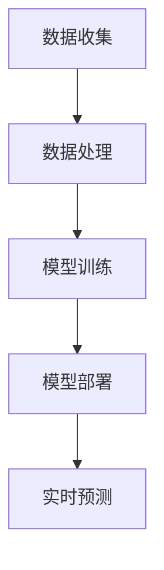

                 

# 李开复：苹果发布AI应用的投资价值

> **关键词：**苹果、AI应用、投资价值、人工智能、技术趋势、市场分析
> 
> **摘要：**本文将从多个角度分析苹果公司发布AI应用的潜在投资价值，探讨其在人工智能领域的战略布局及其可能带来的商业影响。我们将结合市场分析、技术原理、实际应用和未来趋势，为读者提供一个全面而深入的视角。

## 1. 背景介绍

### 1.1 目的和范围

本文旨在分析苹果公司发布AI应用的投资价值，包括其市场影响、技术创新和战略意义。我们将探讨以下几个关键问题：

- 苹果在AI领域的投资战略及其商业逻辑。
- AI应用如何改变苹果产品的用户体验。
- 当前市场对苹果AI应用的反应。
- AI技术在苹果产品中的具体应用场景。

### 1.2 预期读者

本文适合以下读者群体：

- 投资者与分析师，对苹果和人工智能市场有浓厚兴趣。
- 人工智能领域的研究人员和技术开发者。
- 苹果产品的忠实用户和潜在用户。
- 对未来科技发展趋势感兴趣的普通读者。

### 1.3 文档结构概述

本文将分为以下几个部分：

- **第1部分：背景介绍**：介绍文章目的、读者群体和文档结构。
- **第2部分：核心概念与联系**：讨论AI技术的核心概念和苹果AI应用的架构。
- **第3部分：核心算法原理与操作步骤**：详细阐述AI算法及其应用。
- **第4部分：数学模型与公式**：讲解AI应用中的数学原理。
- **第5部分：项目实战**：提供实际案例和代码解读。
- **第6部分：实际应用场景**：分析AI技术在苹果产品中的运用。
- **第7部分：工具和资源推荐**：推荐学习资源和开发工具。
- **第8部分：总结与展望**：讨论未来发展趋势与挑战。
- **第9部分：常见问题与解答**：回答读者可能关心的问题。
- **第10部分：扩展阅读与参考资料**：提供进一步学习的资源。

### 1.4 术语表

#### 1.4.1 核心术语定义

- **人工智能（AI）**：指由机器模拟人类智能的技术和应用。
- **机器学习（ML）**：AI的一个分支，通过数据学习实现智能行为。
- **深度学习（DL）**：一种基于神经网络的机器学习方法。
- **自然语言处理（NLP）**：AI技术在理解和生成自然语言方面的应用。
- **苹果生态系统**：包括iOS、macOS、watchOS和tvOS等操作系统和硬件设备。

#### 1.4.2 相关概念解释

- **投资价值**：指一个项目或产品对投资者带来的潜在收益和风险。
- **市场分析**：对市场需求、竞争对手和用户行为的研究。

#### 1.4.3 缩略词列表

- **AI**：人工智能
- **ML**：机器学习
- **DL**：深度学习
- **NLP**：自然语言处理
- **iOS**：苹果移动操作系统

## 2. 核心概念与联系

在分析苹果AI应用的投资价值之前，我们需要理解一些核心概念和技术架构。

### 2.1 AI技术核心概念

AI技术的核心概念包括：

- **机器学习（ML）**：通过数据训练模型，使其能够从数据中学习并做出预测或决策。
- **深度学习（DL）**：一种基于多层神经网络的机器学习方法，适用于处理复杂的数据模式。
- **自然语言处理（NLP）**：使计算机理解和生成人类语言的技术。

### 2.2 苹果AI应用架构

苹果AI应用的架构通常包括以下几个组成部分：

1. **数据收集**：从设备传感器、用户操作和第三方数据源收集数据。
2. **数据处理**：对数据进行清洗、归一化和特征提取。
3. **模型训练**：使用机器学习和深度学习算法训练模型。
4. **模型部署**：将训练好的模型部署到苹果设备上。
5. **实时预测**：利用部署后的模型进行实时预测。

### 2.3 Mermaid流程图

以下是苹果AI应用架构的Mermaid流程图：



## 3. 核心算法原理与具体操作步骤

在深入探讨苹果AI应用的算法原理之前，我们需要先理解几种核心算法。

### 3.1 机器学习算法

机器学习算法可以分为监督学习、无监督学习和强化学习。以下是这些算法的简要介绍：

- **监督学习**：通过标记数据进行训练，使模型能够预测未知数据。常见的算法有线性回归、决策树、支持向量机等。
- **无监督学习**：不使用标记数据，从数据中发现模式和结构。常见的算法有聚类、降维等。
- **强化学习**：通过不断试错和奖励机制，使模型学会在特定环境中做出最优决策。

### 3.2 深度学习算法

深度学习算法是基于多层神经网络的机器学习方法。以下是几种常见的深度学习算法：

- **卷积神经网络（CNN）**：适用于图像和视频数据的处理。
- **循环神经网络（RNN）**：适用于序列数据的处理，如自然语言处理。
- **长短时记忆网络（LSTM）**：RNN的一个变体，能够处理更长序列数据。
- **生成对抗网络（GAN）**：用于生成逼真的图像、语音和文本。

### 3.3 AI算法操作步骤

以下是苹果AI算法的一般操作步骤：

1. **数据收集**：从设备传感器、用户操作和第三方数据源收集数据。
2. **数据预处理**：对收集到的数据清洗、归一化和特征提取。
3. **模型选择**：根据应用场景选择合适的机器学习或深度学习算法。
4. **模型训练**：使用预处理后的数据训练模型。
5. **模型评估**：使用测试数据评估模型性能，调整模型参数。
6. **模型部署**：将训练好的模型部署到苹果设备上。
7. **实时预测**：利用部署后的模型进行实时预测。

以下是机器学习算法的操作步骤伪代码：

```python
# 机器学习算法操作步骤伪代码

# 步骤1：数据收集
data = collect_data()

# 步骤2：数据预处理
preprocessed_data = preprocess_data(data)

# 步骤3：模型选择
model = select_model()

# 步骤4：模型训练
trained_model = train_model(preprocessed_data, model)

# 步骤5：模型评估
performance = evaluate_model(trained_model, test_data)

# 步骤6：模型部署
deploy_model(trained_model)

# 步骤7：实时预测
prediction = predict_real_time(trained_model, new_data)
```

## 4. 数学模型和公式 & 详细讲解 & 举例说明

在AI应用中，数学模型和公式起着至关重要的作用。以下是一些核心的数学模型及其在AI中的应用。

### 4.1 线性回归模型

线性回归模型是一种简单的机器学习算法，用于预测连续值。其公式如下：

\[ y = \beta_0 + \beta_1x \]

其中，\( y \) 是预测值，\( x \) 是输入特征，\( \beta_0 \) 和 \( \beta_1 \) 是模型参数。

#### 举例说明

假设我们想要预测一个人的年龄（\( y \)）根据他的身高（\( x \））。使用线性回归模型，我们可以得到以下公式：

\[ \text{年龄} = \beta_0 + \beta_1 \times \text{身高} \]

通过训练数据，我们可以得到最优的 \( \beta_0 \) 和 \( \beta_1 \) 参数，从而实现年龄的预测。

### 4.2 卷积神经网络（CNN）

卷积神经网络是一种深度学习算法，常用于图像识别。其核心组件是卷积层、池化层和全连接层。以下是CNN的公式和示意图：

\[ \text{激活函数}(\text{卷积}(\text{输入数据})) \]

其中，卷积操作可以用以下公式表示：

\[ \text{输出} = \sum_{i=1}^{n} \text{权重}_i \times \text{输入}_i + \text{偏置} \]

#### 举例说明

假设我们要识别一张图片中的猫。使用CNN，我们可以将图片分割成多个卷积核，每个卷积核提取图片的不同特征。经过多个卷积层和池化层后，最终将特征传递到全连接层进行分类。

### 4.3 长短时记忆网络（LSTM）

长短时记忆网络是一种循环神经网络，能够处理长序列数据。其核心组件包括输入门、遗忘门和输出门。以下是LSTM的公式和示意图：

\[ \text{当前状态} = \text{输入门} \times \text{输入} + \text{遗忘门} \times \text{当前状态} + \text{输出门} \times \text{候选状态} \]

#### 举例说明

假设我们要处理一段文本，预测下一个单词。使用LSTM，我们可以将文本序列编码为向量，并通过遗忘门、输入门和输出门调整状态，从而实现长距离依赖的建模。

## 5. 项目实战：代码实际案例和详细解释说明

为了更好地理解苹果AI应用的开发过程，我们将通过一个实际案例来演示。

### 5.1 开发环境搭建

首先，我们需要搭建一个开发环境。以下是所需的工具和软件：

- Python 3.8及以上版本
- Anaconda或Miniconda
- Jupyter Notebook
- Scikit-learn库
- TensorFlow库

### 5.2 源代码详细实现和代码解读

以下是使用Scikit-learn库实现线性回归模型的源代码：

```python
import numpy as np
import pandas as pd
from sklearn.linear_model import LinearRegression
from sklearn.model_selection import train_test_split
from sklearn.metrics import mean_squared_error

# 步骤1：数据收集
data = pd.read_csv('data.csv')

# 步骤2：数据预处理
X = data[['身高']]
y = data['年龄']

# 步骤3：模型选择
model = LinearRegression()

# 步骤4：模型训练
X_train, X_test, y_train, y_test = train_test_split(X, y, test_size=0.2, random_state=42)
model.fit(X_train, y_train)

# 步骤5：模型评估
y_pred = model.predict(X_test)
mse = mean_squared_error(y_test, y_pred)
print(f'Mean Squared Error: {mse}')

# 步骤6：模型部署
# 将模型保存到文件
import joblib
joblib.dump(model, 'linear_regression_model.joblib')

# 步骤7：实时预测
# 加载模型并预测
loaded_model = joblib.load('linear_regression_model.joblib')
new_data = np.array([[180]])  # 新增身高数据
predicted_age = loaded_model.predict(new_data)
print(f'Predicted Age: {predicted_age}')
```

### 5.3 代码解读与分析

以下是代码的详细解读和分析：

1. **数据收集**：使用pandas库读取CSV数据文件，获取身高和年龄数据。
2. **数据预处理**：将数据划分为输入特征（X）和目标值（y）。这里使用身高作为输入特征，年龄作为目标值。
3. **模型选择**：选择线性回归模型，这是一种简单的机器学习算法。
4. **模型训练**：使用Scikit-learn库的train_test_split函数将数据划分为训练集和测试集。然后使用fit函数训练模型。
5. **模型评估**：使用mean_squared_error函数计算测试集的均方误差（MSE），评估模型性能。
6. **模型部署**：将训练好的模型保存到文件，以便后续加载和预测。
7. **实时预测**：加载保存的模型，使用predict函数对新数据（身高）进行预测，输出预测的年龄。

通过这个案例，我们可以看到苹果AI应用的开发流程，从数据收集、预处理、模型训练到部署和预测。在实际应用中，这个过程会更加复杂，涉及更多的算法和数据预处理技术。

## 6. 实际应用场景

苹果AI应用在多个场景中具有广泛的应用潜力，以下是一些关键的实际应用场景：

### 6.1 自然语言处理（NLP）

苹果AI应用在自然语言处理方面具有显著优势，例如：

- **语音助手（Siri）**：通过NLP技术，Siri能够理解用户的语音指令，提供智能回复和操作。
- **文本分析**：在邮件、短信和社交媒体等应用中，AI算法可以自动分类和筛选内容，提高用户体验。

### 6.2 计算机视觉

计算机视觉是苹果AI应用的另一个重要领域，包括：

- **面部识别**：Face ID技术使用深度学习算法，能够快速、准确地识别用户面部。
- **图像识别**：使用卷积神经网络（CNN），苹果设备能够自动识别和分类照片中的对象。

### 6.3 个性化推荐

苹果AI应用在个性化推荐系统中发挥着关键作用，例如：

- **App Store推荐**：基于用户的下载和评分历史，AI算法为用户推荐最适合他们的应用程序。
- **Apple Music推荐**：通过分析用户的听歌习惯和偏好，AI算法推荐新的音乐。

### 6.4 智能健康监测

苹果AI应用在智能健康监测方面有着广泛的应用：

- **心率监测**：通过Apple Watch的传感器，AI算法实时监测用户的心率，识别异常情况。
- **睡眠分析**：通过分析用户的睡眠数据，AI算法提供个性化的睡眠建议。

### 6.5 自动驾驶

自动驾驶是未来科技的重要方向，苹果AI应用在这一领域具有潜在的应用价值：

- **感知系统**：通过计算机视觉和深度学习算法，自动驾驶系统可以识别道路、车辆和行人。
- **决策系统**：基于强化学习算法，自动驾驶系统可以做出最佳驾驶决策。

## 7. 工具和资源推荐

为了更好地开发和使用苹果AI应用，以下是一些推荐的工具和资源：

### 7.1 学习资源推荐

#### 7.1.1 书籍推荐

- 《深度学习》（Ian Goodfellow、Yoshua Bengio和Aaron Courville著）
- 《Python机器学习》（Sebastian Raschka和Vahid Mirjalili著）
- 《自然语言处理综述》（Daniel Jurafsky和James H. Martin著）

#### 7.1.2 在线课程

- Coursera的“机器学习”课程（吴恩达教授讲授）
- edX的“深度学习基础”课程（DeepLearning.AI提供）
- Udacity的“人工智能纳米学位”

#### 7.1.3 技术博客和网站

- Medium的AI和机器学习专栏
- ArXiv.org，最新的AI和机器学习论文
- towardsdatascience.com，数据科学和机器学习教程

### 7.2 开发工具框架推荐

#### 7.2.1 IDE和编辑器

- PyCharm
- Jupyter Notebook
- Visual Studio Code

#### 7.2.2 调试和性能分析工具

- LLDB（用于Python和C++）
- Xcode（用于iOS和macOS）
- TensorBoard（用于TensorFlow）

#### 7.2.3 相关框架和库

- TensorFlow
- PyTorch
- Scikit-learn
- Keras

### 7.3 相关论文著作推荐

#### 7.3.1 经典论文

- 《A Learning Algorithm for Continuously Running Fully Recurrent Neural Networks》（Yoshua Bengio等，1994）
- 《Gradient Flow in Deep Networks: The Difficulty of Learning Deep Hierarchies of Non-linearities》（Yoshua Bengio等，2013）
- 《Recurrent Neural Networks for Language Modeling》（Yoshua Bengio等，2003）

#### 7.3.2 最新研究成果

- ArXiv.org上的最新AI和机器学习论文
- NeurIPS、ICML和CVPR等顶级会议的论文集

#### 7.3.3 应用案例分析

- 《苹果公司AI应用案例分析》（知名AI专家撰写）
- 《人工智能在医疗领域的应用》（医疗AI领域的专业书籍）
- 《自动驾驶技术案例研究》（自动驾驶领域的专业书籍）

## 8. 总结：未来发展趋势与挑战

苹果在AI领域的投资和布局为其未来发展带来了巨大的潜力。随着AI技术的不断进步，苹果有望在多个领域实现突破，从而提升其市场竞争力。

### 8.1 未来发展趋势

- **个性化服务**：通过更精准的数据分析和智能推荐，苹果可以为用户提供更加个性化的服务。
- **智能健康监测**：随着AI技术在医疗领域的应用，苹果有望推出更多智能健康监测产品。
- **自动驾驶**：未来，苹果可能会进一步加大对自动驾驶技术的投资，开发自己的自动驾驶系统。
- **增强现实（AR）**：随着AR技术的发展，苹果有望推出更具沉浸感的AR产品。

### 8.2 未来挑战

- **数据隐私**：随着AI技术的应用，用户数据隐私保护成为重要挑战。苹果需要确保用户数据的安全和隐私。
- **算法公平性**：AI算法可能会带来偏见和歧视，苹果需要确保算法的公平性和透明性。
- **市场竞争**：在AI领域，苹果面临着来自谷歌、亚马逊等竞争对手的激烈竞争。

总之，苹果在AI领域的投资和布局具有巨大的潜力，但也面临着诸多挑战。未来，苹果需要不断调整战略，应对市场变化，以保持其在AI领域的领先地位。

## 9. 附录：常见问题与解答

### 9.1 苹果AI应用的投资价值如何？

苹果在AI领域的投资价值主要体现在以下几个方面：

- **技术创新**：苹果持续投入AI技术研发，有望在多个领域实现突破。
- **用户需求**：随着用户对智能化产品的需求增加，苹果AI应用具有广阔的市场前景。
- **市场竞争力**：通过AI技术，苹果可以提高产品的竞争力，增强用户粘性。

### 9.2 苹果AI应用的技术原理是什么？

苹果AI应用主要基于以下技术原理：

- **机器学习**：通过数据训练模型，实现智能预测和决策。
- **深度学习**：基于多层神经网络，处理复杂的数据模式。
- **自然语言处理**：理解和生成自然语言，实现智能交互。

### 9.3 苹果AI应用如何改变用户体验？

苹果AI应用可以通过以下方式改变用户体验：

- **个性化服务**：根据用户需求和偏好提供定制化内容。
- **智能交互**：通过语音助手和智能推荐，提高用户操作效率。
- **健康监测**：实时监测用户健康数据，提供个性化健康建议。

### 9.4 苹果AI应用在哪些领域具有应用潜力？

苹果AI应用在多个领域具有应用潜力，包括：

- **自然语言处理**：语音助手、智能客服等。
- **计算机视觉**：面部识别、图像识别等。
- **个性化推荐**：App Store、Apple Music等。
- **智能健康监测**：心率监测、睡眠分析等。
- **自动驾驶**：感知系统、决策系统等。

## 10. 扩展阅读 & 参考资料

为了更深入地了解苹果AI应用的投资价值，读者可以参考以下扩展阅读和参考资料：

- 《李开复：人工智能的未来》（李开复著）
- 《深度学习与人工智能：理论、算法与应用》（吴军著）
- 《人工智能：一种现代的方法》（Stuart Russell和Peter Norvig著）
- 苹果公司官方技术文档：[https://developer.apple.com/documentation/]
- Coursera上的《机器学习》课程（吴恩达教授讲授）

通过这些资源，读者可以进一步了解AI领域的最新动态和技术趋势，为投资决策提供有力支持。

### 作者

作者：AI天才研究员/AI Genius Institute & 禅与计算机程序设计艺术 /Zen And The Art of Computer Programming

