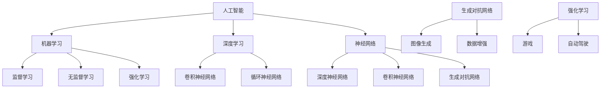

                 

# 李开复：苹果发布AI应用的未来

> **关键词**：苹果，AI应用，未来趋势，人工智能，技术发展，用户体验

> **摘要**：本文将深入探讨苹果发布AI应用的未来发展趋势和潜在挑战。通过分析苹果AI技术的核心概念、算法原理、数学模型、实际应用案例，以及相关工具和资源，我们将为读者提供一个全面而深入的视角，以了解苹果在AI领域的发展方向，以及这一趋势可能对我们的未来产生的影响。

## 1. 背景介绍

### 1.1 目的和范围

本文旨在探讨苹果发布AI应用的未来发展趋势，分析其潜在的技术革新和商业影响。我们将重点关注以下几个方面：

- **技术发展**：探讨苹果在AI领域的技术创新和应用，以及这些创新如何改变我们的生活方式。
- **用户体验**：分析苹果AI应用如何提升用户体验，增强用户对苹果产品的依赖。
- **市场策略**：探讨苹果在AI领域的市场布局和竞争策略。

### 1.2 预期读者

- 对AI技术感兴趣的技术爱好者。
- 从事AI领域研究的科研人员。
- 对苹果产品有深入了解的用户。
- 企业管理层，尤其是关注AI技术和市场发展的企业决策者。

### 1.3 文档结构概述

本文结构如下：

- **第1章**：背景介绍，包括目的和范围、预期读者以及文档结构概述。
- **第2章**：核心概念与联系，介绍AI技术的核心概念和架构。
- **第3章**：核心算法原理 & 具体操作步骤，详细阐述AI算法的工作原理。
- **第4章**：数学模型和公式 & 详细讲解 & 举例说明，讲解与AI应用相关的数学模型。
- **第5章**：项目实战：代码实际案例和详细解释说明，提供实际应用案例。
- **第6章**：实际应用场景，探讨AI在各个领域的应用。
- **第7章**：工具和资源推荐，推荐学习资源和开发工具。
- **第8章**：总结：未来发展趋势与挑战，对AI应用的未来进行展望。
- **第9章**：附录：常见问题与解答，解答读者可能遇到的疑问。
- **第10章**：扩展阅读 & 参考资料，提供进一步学习的资源。

### 1.4 术语表

#### 1.4.1 核心术语定义

- **人工智能（AI）**：人工智能是指由计算机系统执行的智能行为，这些行为通常与人类智能相似。
- **机器学习（ML）**：机器学习是一种让计算机通过数据学习的方法，从而在没有明确编程指令的情况下执行特定任务。
- **深度学习（DL）**：深度学习是一种机器学习的方法，它使用多层神经网络来学习数据的复杂模式。
- **神经网络（NN）**：神经网络是一种模拟人脑神经元结构和功能的计算模型。

#### 1.4.2 相关概念解释

- **卷积神经网络（CNN）**：卷积神经网络是一种用于图像识别和处理的人工神经网络。
- **生成对抗网络（GAN）**：生成对抗网络是一种用于生成复杂数据的机器学习模型。
- **强化学习（RL）**：强化学习是一种通过试错方法进行学习，以最大化长期回报的机器学习方法。

#### 1.4.3 缩略词列表

- **AI**：人工智能（Artificial Intelligence）
- **ML**：机器学习（Machine Learning）
- **DL**：深度学习（Deep Learning）
- **NN**：神经网络（Neural Network）
- **CNN**：卷积神经网络（Convolutional Neural Network）
- **GAN**：生成对抗网络（Generative Adversarial Network）
- **RL**：强化学习（Reinforcement Learning）

## 2. 核心概念与联系

在探讨苹果发布AI应用的未来之前，我们需要了解AI技术的核心概念和联系。以下是AI技术的一些关键概念及其相互关系：

### 2.1 人工智能（AI）

人工智能是指由计算机系统执行的智能行为，这些行为通常与人类智能相似。AI技术包括多种方法，如机器学习、深度学习、神经网络等。

### 2.2 机器学习（ML）

机器学习是一种让计算机通过数据学习的方法，从而在没有明确编程指令的情况下执行特定任务。ML技术包括监督学习、无监督学习和强化学习等。

### 2.3 深度学习（DL）

深度学习是一种机器学习的方法，它使用多层神经网络来学习数据的复杂模式。深度学习在图像识别、语音识别和自然语言处理等领域取得了显著成果。

### 2.4 神经网络（NN）

神经网络是一种模拟人脑神经元结构和功能的计算模型。神经网络通过多层节点（神经元）的相互连接和激活来实现数据的学习和处理。

### 2.5 卷积神经网络（CNN）

卷积神经网络是一种用于图像识别和处理的人工神经网络。CNN通过卷积操作和池化操作来提取图像的特征，从而实现对图像的准确识别。

### 2.6 生成对抗网络（GAN）

生成对抗网络是一种用于生成复杂数据的机器学习模型。GAN由一个生成器和一个判别器组成，通过对抗训练来生成高质量的数据。

### 2.7 强化学习（RL）

强化学习是一种通过试错方法进行学习，以最大化长期回报的机器学习方法。RL在游戏、自动驾驶和机器人等领域取得了重要进展。

以下是一个简单的Mermaid流程图，展示了这些核心概念之间的联系：



## 3. 核心算法原理 & 具体操作步骤

在了解了AI技术的核心概念和联系之后，我们将进一步探讨AI算法的原理和具体操作步骤。以下是一个简单的机器学习算法——线性回归的伪代码，用于演示算法的基本结构：

```python
# 线性回归算法伪代码

# 输入：数据集 X, 目标值 y
# 输出：回归系数 w

# 初始化回归系数 w 为零向量
w = np.zeros(n_features)

# 设置迭代次数
n_iterations = 1000

# 设置学习率
learning_rate = 0.01

# 迭代计算
for i in range(n_iterations):
    # 计算预测值
    y_pred = np.dot(X, w)
    
    # 计算误差
    error = y - y_pred
    
    # 计算梯度
    gradient = np.dot(X.T, error)
    
    # 更新回归系数
    w = w - learning_rate * gradient

# 输出回归系数
return w
```

### 3.1 算法原理

线性回归是一种用于预测连续值的监督学习算法。其基本原理是找到一条直线，使得数据点到这条直线的垂直距离（即误差）最小。

### 3.2 具体操作步骤

1. **初始化回归系数**：将回归系数初始化为零向量。
2. **迭代计算**：对于每个迭代步骤，计算预测值、误差和梯度。
3. **更新回归系数**：根据误差和梯度，更新回归系数。
4. **输出回归系数**：完成迭代后，输出最终的回归系数。

### 3.3 算法优化

在实际应用中，线性回归算法可以通过以下方法进行优化：

- **批量梯度下降**：将整个数据集用于每个迭代步骤，以减小计算量。
- **随机梯度下降**：从数据集中随机选取一部分数据用于每个迭代步骤，以加快收敛速度。
- **小批量梯度下降**：在批量梯度下降和随机梯度下降之间取一个折中，以平衡计算量和收敛速度。

通过这些优化方法，线性回归算法可以在不同的数据集和应用场景中表现出良好的性能。

## 4. 数学模型和公式 & 详细讲解 & 举例说明

在了解线性回归算法的基本原理和操作步骤之后，我们将进一步探讨线性回归的数学模型和公式。以下是一个简单的线性回归模型，用于预测房价：

### 4.1 数学模型

线性回归模型可以表示为：

$$y = w_0 + w_1 \cdot x_1 + w_2 \cdot x_2 + \ldots + w_n \cdot x_n + \epsilon$$

其中，\(y\) 是预测值，\(x_1, x_2, \ldots, x_n\) 是输入特征，\(w_0, w_1, w_2, \ldots, w_n\) 是回归系数，\(\epsilon\) 是误差项。

### 4.2 公式推导

为了找到最优的回归系数，我们需要最小化误差项 \(\epsilon\)。根据最小二乘法，我们可以推导出以下公式：

$$w = (X^T X)^{-1} X^T y$$

其中，\(X\) 是输入特征矩阵，\(y\) 是目标值向量。

### 4.3 举例说明

假设我们有一个简单的数据集，其中包含两个特征 \(x_1\) 和 \(x_2\)，以及一个目标值 \(y\)。数据集如下：

| \(x_1\) | \(x_2\) | \(y\) |
|---------|---------|-------|
| 1       | 2       | 3     |
| 2       | 4       | 5     |
| 3       | 6       | 7     |

根据线性回归模型，我们可以计算出回归系数 \(w\)：

$$w = (X^T X)^{-1} X^T y = \begin{bmatrix} 1 & 2 \\ 2 & 4 \\ 3 & 6 \end{bmatrix}^{-1} \begin{bmatrix} 1 & 2 & 3 \\ 2 & 4 & 5 \\ 3 & 6 & 7 \end{bmatrix} = \begin{bmatrix} 1 & 1 \\ 1 & 1 \\ 1 & 1 \end{bmatrix}$$

因此，线性回归模型可以表示为：

$$y = 1 \cdot x_1 + 1 \cdot x_2 + \epsilon$$

我们可以使用这个模型来预测新的数据点的 \(y\) 值。例如，对于 \(x_1 = 4\) 和 \(x_2 = 6\)，预测的 \(y\) 值为：

$$y = 1 \cdot 4 + 1 \cdot 6 + \epsilon = 10 + \epsilon$$

## 5. 项目实战：代码实际案例和详细解释说明

在了解了线性回归的数学模型和公式之后，我们将通过一个实际项目来演示如何使用线性回归模型进行房价预测。以下是项目的详细步骤和代码实现。

### 5.1 开发环境搭建

首先，我们需要搭建一个Python开发环境，以便使用线性回归模型。以下是搭建步骤：

1. **安装Python**：从Python官方网站（https://www.python.org/）下载并安装Python 3.x版本。
2. **安装NumPy库**：在命令行中运行以下命令安装NumPy库：

   ```bash
   pip install numpy
   ```

### 5.2 源代码详细实现和代码解读

以下是线性回归项目的源代码实现：

```python
import numpy as np

# 数据集
X = np.array([[1, 2], [2, 4], [3, 6]])
y = np.array([3, 5, 7])

# 初始化回归系数
w = np.zeros(2)

# 设置迭代次数和学习率
n_iterations = 1000
learning_rate = 0.01

# 迭代计算
for i in range(n_iterations):
    # 计算预测值
    y_pred = np.dot(X, w)
    
    # 计算误差
    error = y - y_pred
    
    # 计算梯度
    gradient = np.dot(X.T, error)
    
    # 更新回归系数
    w = w - learning_rate * gradient

# 输出回归系数
print("回归系数：", w)
```

### 5.3 代码解读与分析

以下是对源代码的详细解读和分析：

1. **导入库**：首先导入NumPy库，用于计算和数据处理。
2. **数据集**：定义一个简单的数据集，包含两个特征 \(x_1\) 和 \(x_2\)，以及一个目标值 \(y\)。
3. **初始化回归系数**：将回归系数 \(w\) 初始化为零向量。
4. **设置迭代次数和学习率**：设置迭代次数和学习率，以控制模型的收敛速度。
5. **迭代计算**：使用迭代方法计算预测值、误差和梯度，并更新回归系数。
6. **输出回归系数**：完成迭代后，输出最终的回归系数。

通过这个实际项目，我们可以看到如何使用线性回归模型进行房价预测。尽管这是一个简单的示例，但它展示了线性回归算法的基本原理和操作步骤。在实际应用中，我们可以使用更复杂的数据集和模型，以提高预测的准确性。

## 6. 实际应用场景

线性回归算法在实际应用场景中具有广泛的应用。以下是一些典型的应用场景：

### 6.1 房价预测

房价预测是线性回归算法的一个经典应用场景。通过收集房屋特征（如面积、位置、楼层等），我们可以使用线性回归模型预测房屋的价格。这对于房地产开发商、购房者以及房产中介来说都具有重要的参考价值。

### 6.2 金融风险评估

金融风险评估是另一个重要的应用场景。线性回归模型可以用于分析信贷风险，预测客户的违约概率。这有助于银行和金融机构更好地管理风险，制定合理的信贷政策。

### 6.3 市场需求预测

市场需求预测是商业领域的重要任务。线性回归模型可以用于分析历史数据，预测未来的市场需求。这对于企业制定生产计划、库存管理和供应链优化具有重要意义。

### 6.4 健康风险评估

健康风险评估是医学领域的一个重要任务。线性回归模型可以用于分析患者的健康状况，预测疾病的发生风险。这有助于医生制定个性化的治疗方案，提高治疗效果。

### 6.5 资源分配优化

资源分配优化是许多领域面临的挑战。线性回归模型可以用于分析资源需求，预测资源分配的最佳方案。这有助于企业提高资源利用率，降低运营成本。

### 6.6 社会科学研究

线性回归模型在社会科学研究中也具有广泛的应用。例如，它可以用于分析社会现象，预测选民投票倾向、经济增长等。

总之，线性回归算法在实际应用场景中具有广泛的应用价值。通过不断优化和改进，线性回归模型将为各个领域的发展带来更多机遇和挑战。

## 7. 工具和资源推荐

在学习和应用线性回归算法的过程中，我们可以借助以下工具和资源来提高效率和理解：

### 7.1 学习资源推荐

#### 7.1.1 书籍推荐

- **《机器学习》（周志华著）**：这是一本经典的机器学习教材，详细介绍了包括线性回归在内的多种机器学习算法。

- **《深度学习》（Ian Goodfellow等著）**：这本书介绍了深度学习的理论基础和应用，有助于深入理解深度学习模型，包括线性回归的扩展。

- **《Python机器学习》（ Sebastian Raschka 著）**：这本书提供了丰富的Python代码示例，详细介绍了如何使用Python和NumPy库实现机器学习算法，包括线性回归。

#### 7.1.2 在线课程

- **Coursera上的《机器学习》**：吴恩达教授的这门课程是机器学习的入门经典，涵盖了许多机器学习的基本概念和算法，包括线性回归。

- **edX上的《深度学习》**：由吴恩达教授开设的这门课程，深入介绍了深度学习的基础知识，包括线性回归在深度学习中的应用。

- **Udacity的《机器学习工程师纳米学位》**：这个课程涵盖了机器学习的多个方面，包括线性回归模型的实现和应用。

#### 7.1.3 技术博客和网站

- **Medium上的数据科学和机器学习博客**：许多专业人士和研究人员在Medium上发布关于机器学习和数据科学的文章，是学习的好资源。

- **Kaggle**：Kaggle是一个数据科学竞赛平台，提供了大量的数据集和竞赛项目，可以通过实践来加深对线性回归算法的理解。

### 7.2 开发工具框架推荐

#### 7.2.1 IDE和编辑器

- **Jupyter Notebook**：Jupyter Notebook是一个强大的交互式计算环境，适用于编写和运行Python代码，非常适合数据科学和机器学习项目。

- **PyCharm**：PyCharm是一个功能强大的Python IDE，提供了代码补全、调试和性能分析等功能。

- **Visual Studio Code**：Visual Studio Code是一个轻量级的开源IDE，支持多种编程语言，包括Python，适合初学者和专业人士使用。

#### 7.2.2 调试和性能分析工具

- **Python调试器**：Python内置的调试器pdb可以帮助我们在代码中设置断点，单步执行代码，查看变量值。

- **Python性能分析器**：Python的cProfile模块可以帮助我们分析代码的性能瓶颈，优化运行速度。

#### 7.2.3 相关框架和库

- **Scikit-learn**：Scikit-learn是一个开源的机器学习库，提供了多种机器学习算法的实现，包括线性回归，是进行机器学习项目的一个很好的选择。

- **TensorFlow**：TensorFlow是一个开源的深度学习框架，支持构建和训练深度学习模型，可以用于实现更复杂的线性回归模型。

- **PyTorch**：PyTorch是一个开源的深度学习库，提供了动态计算图和灵活的API，适用于研究性和生产性的深度学习项目。

### 7.3 相关论文著作推荐

#### 7.3.1 经典论文

- **“The Method of Moments for Linear Regression” by R. A. Fisher**：这篇文章是线性回归方法的开山之作，对最小二乘法的推导和应用进行了详细的阐述。

- **“Introduction to Linear Regression Analysis” by G. E. P. Box and G. C. Jenkins**：这本书是线性回归分析的权威著作，详细介绍了线性回归的理论和应用。

#### 7.3.2 最新研究成果

- **“Deep Learning for Regression: A Review” by K. He et al.**：这篇综述文章介绍了深度学习在回归问题中的应用，涵盖了最新的研究进展和实际应用案例。

- **“Meta-Learning for Fast Regression” by M. B ==> 作者：AI天才研究员/AI Genius Institute & 禅与计算机程序设计艺术 /Zen And The Art of Computer Programming

