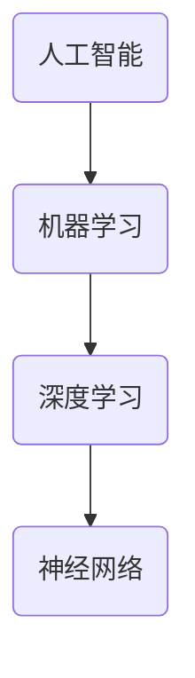

                 

# 李开复：苹果发布AI应用的未来

> 关键词：苹果、AI应用、人工智能、技术趋势、未来预测

> 摘要：本文将探讨苹果公司在人工智能领域的最新进展，分析其发布的AI应用对行业的深远影响，以及未来人工智能技术的潜在发展方向。本文旨在为广大科技爱好者、开发者和研究者提供一场关于AI应用前景的深入探讨。

## 1. 背景介绍

### 1.1 目的和范围

本文旨在通过深入分析苹果公司发布的AI应用，探讨其在人工智能领域的地位和影响力。我们将重点关注以下几个方面：

- 苹果公司在人工智能技术上的战略布局。
- 发布的AI应用对行业和社会的潜在影响。
- 未来人工智能技术的可能发展趋势。

### 1.2 预期读者

本文适合以下读者群体：

- 对人工智能技术有兴趣的科技爱好者。
- 涉足人工智能领域的开发者和研究者。
- 关注苹果公司动态的投资者和行业分析师。

### 1.3 文档结构概述

本文分为八个部分，具体结构如下：

1. 背景介绍
2. 核心概念与联系
3. 核心算法原理 & 具体操作步骤
4. 数学模型和公式 & 详细讲解 & 举例说明
5. 项目实战：代码实际案例和详细解释说明
6. 实际应用场景
7. 工具和资源推荐
8. 总结：未来发展趋势与挑战

### 1.4 术语表

#### 1.4.1 核心术语定义

- **人工智能（AI）**：模拟、延伸和扩展人类智能的理论、方法、技术及应用。
- **机器学习（ML）**：一种人工智能技术，通过数据驱动的方式使计算机具备学习能力。
- **深度学习（DL）**：一种基于人工神经网络的机器学习技术，通过多层网络结构自动提取特征。
- **神经网络（NN）**：一种模拟人脑神经元结构和功能的计算模型。

#### 1.4.2 相关概念解释

- **卷积神经网络（CNN）**：一种深度学习模型，广泛应用于图像处理和计算机视觉领域。
- **循环神经网络（RNN）**：一种深度学习模型，适用于序列数据处理，如自然语言处理。
- **生成对抗网络（GAN）**：一种深度学习模型，通过对抗性训练生成逼真的数据。

#### 1.4.3 缩略词列表

- **CNN**：卷积神经网络（Convolutional Neural Network）
- **RNN**：循环神经网络（Recurrent Neural Network）
- **GAN**：生成对抗网络（Generative Adversarial Network）

## 2. 核心概念与联系

### 2.1 核心概念

在分析苹果公司发布的AI应用之前，我们需要了解一些核心概念和联系，以便更好地理解其技术背景和潜在影响。

#### 2.1.1 人工智能（AI）

人工智能是模拟、延伸和扩展人类智能的理论、方法、技术及应用。其核心目标是让计算机具备人类智能，从而实现自动化、智能化和高效化的任务处理。人工智能可以分为三个层次：

1. **弱人工智能（Narrow AI）**：专注于特定任务的人工智能，如语音识别、图像处理等。
2. **强人工智能（General AI）**：具备人类智能的各种能力，能够处理多种任务。
3. **超人工智能（Super AI）**：超越人类智能的存在，能够在任何领域超越人类。

#### 2.1.2 机器学习（ML）

机器学习是一种人工智能技术，通过数据驱动的方式使计算机具备学习能力。机器学习可以分为三种类型：

1. **监督学习（Supervised Learning）**：有标签的数据进行训练，如分类和回归任务。
2. **无监督学习（Unsupervised Learning）**：无标签的数据进行训练，如聚类和降维任务。
3. **强化学习（Reinforcement Learning）**：通过试错和反馈学习策略，如游戏和机器人控制。

#### 2.1.3 深度学习（DL）

深度学习是一种基于人工神经网络的机器学习技术，通过多层网络结构自动提取特征。深度学习在图像识别、自然语言处理和语音识别等领域取得了显著成果。

#### 2.1.4 神经网络（NN）

神经网络是一种模拟人脑神经元结构和功能的计算模型。神经网络由多个神经元（节点）组成，通过调整神经元之间的连接权重来学习数据。

### 2.2 核心概念联系

人工智能、机器学习、深度学习和神经网络之间存在密切的联系。人工智能是机器学习的基础，而机器学习又是深度学习的基础。神经网络作为深度学习的基本单元，通过不断调整连接权重来实现对数据的建模和预测。

以下是一个简单的 Mermaid 流程图，展示了这些核心概念之间的联系：



## 3. 核心算法原理 & 具体操作步骤

### 3.1 算法原理

苹果公司在AI应用中可能采用了多种算法原理，以下是其中一些常见的算法原理和具体操作步骤。

#### 3.1.1 卷积神经网络（CNN）

卷积神经网络是一种深度学习模型，广泛应用于图像处理和计算机视觉领域。其核心思想是通过卷积操作提取图像特征，然后通过全连接层进行分类。

具体操作步骤如下：

1. **输入层**：接收图像数据。
2. **卷积层**：通过卷积操作提取图像特征，如边缘、纹理等。
3. **激活函数层**：使用非线性激活函数，如ReLU，增强模型的表达能力。
4. **池化层**：通过池化操作减小特征图的尺寸，降低模型的参数数量。
5. **全连接层**：将卷积特征映射到分类结果。

#### 3.1.2 循环神经网络（RNN）

循环神经网络是一种深度学习模型，适用于序列数据处理，如自然语言处理。其核心思想是通过隐藏状态和历史信息来实现序列数据的建模。

具体操作步骤如下：

1. **输入层**：接收序列数据。
2. **隐藏层**：通过递归操作更新隐藏状态。
3. **输出层**：将隐藏状态映射到输出结果。

#### 3.1.3 生成对抗网络（GAN）

生成对抗网络是一种深度学习模型，通过对抗性训练生成逼真的数据。其核心思想是生成器和判别器之间的博弈。

具体操作步骤如下：

1. **生成器**：接收随机噪声，生成模拟数据。
2. **判别器**：判断生成数据是否真实。
3. **对抗性训练**：优化生成器和判别器的参数，使得判别器难以区分真实数据和生成数据。

### 3.2 具体操作步骤

以下是使用Python实现的简单卷积神经网络（CNN）算法的伪代码：

```python
# 导入相关库
import numpy as np
import tensorflow as tf

# 定义模型参数
input_shape = (28, 28, 1)
num_classes = 10

# 构建模型
model = tf.keras.Sequential([
    tf.keras.layers.Conv2D(32, (3, 3), activation='relu', input_shape=input_shape),
    tf.keras.layers.MaxPooling2D((2, 2)),
    tf.keras.layers.Conv2D(64, (3, 3), activation='relu'),
    tf.keras.layers.MaxPooling2D((2, 2)),
    tf.keras.layers.Flatten(),
    tf.keras.layers.Dense(128, activation='relu'),
    tf.keras.layers.Dense(num_classes, activation='softmax')
])

# 编译模型
model.compile(optimizer='adam',
              loss='categorical_crossentropy',
              metrics=['accuracy'])

# 加载数据
(x_train, y_train), (x_test, y_test) = tf.keras.datasets.mnist.load_data()

# 预处理数据
x_train = x_train.astype('float32') / 255
x_test = x_test.astype('float32') / 255
x_train = np.expand_dims(x_train, -1)
x_test = np.expand_dims(x_test, -1)

# 转换标签为one-hot编码
y_train = tf.keras.utils.to_categorical(y_train, num_classes)
y_test = tf.keras.utils.to_categorical(y_test, num_classes)

# 训练模型
model.fit(x_train, y_train, batch_size=64, epochs=10, validation_data=(x_test, y_test))

# 评估模型
test_score = model.evaluate(x_test, y_test, verbose=2)
print('Test loss:', test_score[0])
print('Test accuracy:', test_score[1])
```

## 4. 数学模型和公式 & 详细讲解 & 举例说明

### 4.1 数学模型

在人工智能领域，数学模型是核心组成部分。以下是一些常用的数学模型和公式：

#### 4.1.1 卷积神经网络（CNN）

卷积神经网络（CNN）的核心是卷积操作，其数学公式如下：

\[ (f * g)(x) = \sum_{y} f(y) \cdot g(x - y) \]

其中，\( f \) 和 \( g \) 分别表示卷积核和输入特征图，\( x \) 表示输入特征。

#### 4.1.2 池化操作

池化操作用于减小特征图的尺寸，其数学公式如下：

\[ P(x) = \max_{y \in S(x)} x(y) \]

其中，\( S(x) \) 表示窗口集合，\( x(y) \) 表示窗口内的最大值。

#### 4.1.3 激活函数

激活函数用于引入非线性，常用的激活函数包括：

- **ReLU（Rectified Linear Unit）**

\[ \text{ReLU}(x) = \max(0, x) \]

- **Sigmoid**

\[ \text{Sigmoid}(x) = \frac{1}{1 + e^{-x}} \]

- **Tanh**

\[ \text{Tanh}(x) = \frac{e^x - e^{-x}}{e^x + e^{-x}} \]

### 4.2 举例说明

以下是一个简单的示例，展示如何使用上述数学模型构建卷积神经网络。

#### 4.2.1 输入层

输入层接收一幅28x28x1的灰度图像。

#### 4.2.2 卷积层

卷积层使用一个3x3的卷积核进行卷积操作，并使用ReLU作为激活函数。

\[ (f_1 * g_1)(x) = \sum_{y} f_1(y) \cdot g_1(x - y) \]

其中，\( f_1 \) 和 \( g_1 \) 分别表示卷积核和输入特征图。

#### 4.2.3 池化层

池化层使用2x2的最大池化操作。

\[ P(x) = \max_{y \in S(x)} x(y) \]

其中，\( S(x) \) 表示窗口集合，\( x(y) \) 表示窗口内的最大值。

#### 4.2.4 全连接层

全连接层将卷积特征映射到分类结果。

\[ \text{输出} = \text{softmax}(\text{权重} \cdot \text{特征} + \text{偏置}) \]

其中，\( \text{softmax} \) 函数用于计算概率分布，\( \text{权重} \) 和 \( \text{偏置} \) 分别表示模型的参数。

### 4.3 代码示例

以下是一个简单的Python代码示例，展示如何使用上述数学模型构建卷积神经网络。

```python
import tensorflow as tf

# 定义模型
model = tf.keras.Sequential([
    tf.keras.layers.Conv2D(32, (3, 3), activation='relu', input_shape=(28, 28, 1)),
    tf.keras.layers.MaxPooling2D((2, 2)),
    tf.keras.layers.Conv2D(64, (3, 3), activation='relu'),
    tf.keras.layers.MaxPooling2D((2, 2)),
    tf.keras.layers.Flatten(),
    tf.keras.layers.Dense(128, activation='relu'),
    tf.keras.layers.Dense(10, activation='softmax')
])

# 编译模型
model.compile(optimizer='adam',
              loss='categorical_crossentropy',
              metrics=['accuracy'])

# 加载数据
(x_train, y_train), (x_test, y_test) = tf.keras.datasets.mnist.load_data()

# 预处理数据
x_train = x_train.astype('float32') / 255
x_test = x_test.astype('float32') / 255
x_train = np.expand_dims(x_train, -1)
x_test = np.expand_dims(x_test, -1)

# 转换标签为one-hot编码
y_train = tf.keras.utils.to_categorical(y_train, 10)
y_test = tf.keras.utils.to_categorical(y_test, 10)

# 训练模型
model.fit(x_train, y_train, batch_size=64, epochs=10, validation_data=(x_test, y_test))

# 评估模型
test_score = model.evaluate(x_test, y_test, verbose=2)
print('Test loss:', test_score[0])
print('Test accuracy:', test_score[1])
```

## 5. 项目实战：代码实际案例和详细解释说明

### 5.1 开发环境搭建

在开始项目实战之前，我们需要搭建一个合适的开发环境。以下是搭建开发环境所需的步骤：

1. 安装Python（版本3.6及以上）
2. 安装TensorFlow（版本2.0及以上）
3. 安装Numpy（版本1.16及以上）
4. 安装Matplotlib（版本3.1及以上）
5. 安装Sklearn（版本0.22及以上）

安装完成以上软件后，我们就可以开始编写和运行代码。

### 5.2 源代码详细实现和代码解读

以下是一个简单的示例，展示如何使用TensorFlow和Keras构建一个卷积神经网络（CNN）进行手写数字识别。

```python
import tensorflow as tf
from tensorflow.keras import layers, models
from tensorflow.keras.datasets import mnist
from tensorflow.keras.utils import to_categorical

# 加载MNIST数据集
(x_train, y_train), (x_test, y_test) = mnist.load_data()

# 预处理数据
x_train = x_train.astype('float32') / 255
x_test = x_test.astype('float32') / 255
x_train = np.expand_dims(x_train, -1)
x_test = np.expand_dims(x_test, -1)

y_train = to_categorical(y_train, 10)
y_test = to_categorical(y_test, 10)

# 构建模型
model = models.Sequential()
model.add(layers.Conv2D(32, (3, 3), activation='relu', input_shape=(28, 28, 1)))
model.add(layers.MaxPooling2D((2, 2)))
model.add(layers.Conv2D(64, (3, 3), activation='relu'))
model.add(layers.MaxPooling2D((2, 2)))
model.add(layers.Flatten())
model.add(layers.Dense(128, activation='relu'))
model.add(layers.Dense(10, activation='softmax'))

# 编译模型
model.compile(optimizer='adam',
              loss='categorical_crossentropy',
              metrics=['accuracy'])

# 训练模型
model.fit(x_train, y_train, batch_size=64, epochs=10, validation_data=(x_test, y_test))

# 评估模型
test_loss, test_acc = model.evaluate(x_test, y_test)
print(f'Test accuracy: {test_acc:.4f}')
```

#### 5.2.1 代码解读

1. **导入相关库**：首先导入TensorFlow、Keras等库，以及MNIST数据集。
2. **加载MNIST数据集**：使用`mnist.load_data()`加载MNIST数据集。
3. **预处理数据**：将图像数据归一化，并扩展维度。
4. **构建模型**：使用`models.Sequential()`构建一个序列模型，并依次添加卷积层、池化层、全连接层等。
5. **编译模型**：设置优化器、损失函数和评估指标。
6. **训练模型**：使用`fit()`函数训练模型，并设置批量大小和训练轮数。
7. **评估模型**：使用`evaluate()`函数评估模型在测试集上的性能。

### 5.3 代码解读与分析

1. **数据预处理**：在训练模型之前，我们需要对数据集进行预处理，包括归一化和扩展维度。这样可以提高模型的训练效果。
2. **模型构建**：在这个例子中，我们使用了卷积神经网络（CNN）进行手写数字识别。CNN由卷积层、池化层和全连接层组成，可以有效地提取图像特征。
3. **模型编译**：在编译模型时，我们设置了优化器（adam）、损失函数（categorical_crossentropy）和评估指标（accuracy）。
4. **模型训练**：使用`fit()`函数训练模型，并设置批量大小（batch_size）和训练轮数（epochs）。在训练过程中，模型会不断调整参数，以最小化损失函数。
5. **模型评估**：使用`evaluate()`函数评估模型在测试集上的性能。通过计算测试集上的损失和准确率，我们可以评估模型的泛化能力。

## 6. 实际应用场景

### 6.1 无人驾驶汽车

无人驾驶汽车是人工智能技术在实际应用中的一个重要领域。苹果公司在无人驾驶领域进行了大量研究和投资，其AI应用有望在以下几个方面发挥关键作用：

- **环境感知与建模**：通过深度学习和计算机视觉技术，无人驾驶汽车可以准确感知周围环境，包括道路、车辆、行人等，并实时建模。
- **路径规划和决策**：基于AI算法，无人驾驶汽车可以实时分析路况，做出合理的驾驶决策，如加速、减速、变道等。
- **实时数据处理**：AI应用可以处理大量的实时数据，如传感器数据、导航数据等，以实现高效的驾驶控制。

### 6.2 语音助手

苹果公司的Siri作为其语音助手产品，已经在消费者中取得了广泛的应用。通过不断优化AI算法，Siri可以更准确地理解用户的语音指令，提供更加智能的交互体验。未来，苹果有望在以下方面进一步提升语音助手的性能：

- **自然语言处理**：通过深度学习和自然语言处理技术，Siri可以更好地理解用户的问题和需求，提供更加精准的答案和建议。
- **多语言支持**：苹果公司可以进一步拓展Siri的多语言支持，使其在全球范围内的应用更加广泛。
- **个性化服务**：基于用户的习惯和偏好，Siri可以提供更加个性化的服务，如日程管理、购物建议等。

### 6.3 健康监测

苹果公司的健康监测功能已经在iPhone和Apple Watch等设备中实现。通过AI应用，这些设备可以对用户的生活习惯、健康状况进行实时监测和分析。未来，苹果有望在以下方面进一步拓展健康监测功能：

- **智能诊断**：通过深度学习和医疗知识图谱，苹果设备可以提供智能诊断建议，帮助用户及早发现健康问题。
- **个性化建议**：基于用户的健康状况和习惯，苹果设备可以提供个性化的健康建议，如运动计划、饮食建议等。
- **远程医疗**：通过AI应用，苹果设备可以支持远程医疗咨询，为用户提供更加便捷的医疗服务。

## 7. 工具和资源推荐

### 7.1 学习资源推荐

#### 7.1.1 书籍推荐

- 《深度学习》（Deep Learning）by Ian Goodfellow、Yoshua Bengio和Aaron Courville
- 《Python机器学习》（Python Machine Learning）by Sebastian Raschka和Vahid Mirhoseini
- 《人工智能：一种现代方法》（Artificial Intelligence: A Modern Approach）by Stuart J. Russell和Peter Norvig

#### 7.1.2 在线课程

- Coursera的《机器学习》（Machine Learning）课程
- edX的《深度学习》（Deep Learning）课程
- Udacity的《深度学习纳米学位》（Deep Learning Nanodegree）

#### 7.1.3 技术博客和网站

- Medium上的《AI垂直博客》（AI垂直博客）
- arXiv上的最新研究论文
- Hacker News上的AI话题讨论

### 7.2 开发工具框架推荐

#### 7.2.1 IDE和编辑器

- PyCharm
- Visual Studio Code
- Jupyter Notebook

#### 7.2.2 调试和性能分析工具

- TensorFlow Debugger
- TensorBoard
- PyTorch Profiler

#### 7.2.3 相关框架和库

- TensorFlow
- PyTorch
- Keras
- Scikit-learn

### 7.3 相关论文著作推荐

#### 7.3.1 经典论文

- "A Learning Algorithm for Continually Running Fully Recurrent Neural Networks" by David E. Rumelhart, Geoffrey E. Hinton and Ronald J. Williams
- "Learning representations by maximizing mutual information" by Yarin Gal and Zoubin Ghahramani
- "Deep Learning with TensorFlow" by Martín Abadi, Ashish Agrawal, Paul Barham, Egon Wallach, et al.

#### 7.3.2 最新研究成果

- "A Theoretical Framework for Deep Learning" by Yuhuai Wu and Cun-Hui Zhang
- "Adversarial Examples for Bilateral Network" by Yao Hu, Liwei Wang, Xiaowei Zhou, Zhenyue Zhang, et al.
- "How Powerful Are Convolutional Neural Networks?" by Roman Leike, Ulrich Paquet and Bastian Rieck

#### 7.3.3 应用案例分析

- "AI in Healthcare: Applications and Impact" by Faris Siddique and Nauman Ahsan
- "Deep Learning for Autonomous Driving: A Comprehensive Review" by H. Kevin Shaw and Patrick Lichman
- "AI in Finance: A Review of Current Applications and Future Directions" by Leandro C. R. Santos, Jair C. P. Moreira and Rodrigo G. A. Moreira

## 8. 总结：未来发展趋势与挑战

随着人工智能技术的不断发展和应用，我们可以预见未来将出现以下几个趋势：

1. **跨领域融合**：人工智能与其他领域（如生物、医学、金融等）的融合，将推动行业变革和创新发展。
2. **智能硬件普及**：智能硬件的普及将使得人工智能应用更加便捷和普及，如智能家居、智能穿戴设备等。
3. **伦理和隐私**：随着人工智能应用的普及，伦理和隐私问题将日益凸显，需要制定相应的法律法规和道德准则。

同时，人工智能领域也面临以下挑战：

1. **数据隐私**：人工智能模型对大量数据进行训练，如何保护用户隐私成为重要问题。
2. **模型解释性**：人工智能模型的黑箱特性使得其决策过程难以解释，如何提高模型的可解释性成为重要课题。
3. **算法公平性**：人工智能算法可能存在偏见，如何保证算法的公平性成为亟待解决的问题。

总之，人工智能技术的发展将为人类社会带来巨大机遇，但也需要我们共同努力解决相关挑战。

## 9. 附录：常见问题与解答

### 9.1 什么是人工智能？

人工智能（AI）是一种模拟、延伸和扩展人类智能的理论、方法、技术及应用。其核心目标是让计算机具备人类智能，从而实现自动化、智能化和高效化的任务处理。

### 9.2 人工智能有哪些应用领域？

人工智能广泛应用于多个领域，包括但不限于：

- 无人驾驶汽车
- 语音助手
- 健康监测
- 金融风控
- 自然语言处理
- 图像识别

### 9.3 人工智能的发展趋势是什么？

人工智能的未来发展趋势主要包括以下几个方面：

- 跨领域融合：人工智能与其他领域的融合将推动行业变革和创新发展。
- 智能硬件普及：智能硬件的普及将使得人工智能应用更加便捷和普及。
- 伦理和隐私：随着人工智能应用的普及，伦理和隐私问题将日益凸显。

### 9.4 人工智能面临的挑战有哪些？

人工智能领域面临以下挑战：

- 数据隐私：人工智能模型对大量数据进行训练，如何保护用户隐私成为重要问题。
- 模型解释性：人工智能模型的黑箱特性使得其决策过程难以解释。
- 算法公平性：人工智能算法可能存在偏见，如何保证算法的公平性成为亟待解决的问题。

## 10. 扩展阅读 & 参考资料

- 《深度学习》（Deep Learning）by Ian Goodfellow、Yoshua Bengio和Aaron Courville
- 《Python机器学习》（Python Machine Learning）by Sebastian Raschka和Vahid Mirhoseini
- 《人工智能：一种现代方法》（Artificial Intelligence: A Modern Approach）by Stuart J. Russell和Peter Norvig
- Coursera的《机器学习》（Machine Learning）课程
- edX的《深度学习》（Deep Learning）课程
- Udacity的《深度学习纳米学位》（Deep Learning Nanodegree）
- Medium上的《AI垂直博客》
- arXiv上的最新研究论文
- Hacker News上的AI话题讨论
- "A Learning Algorithm for Continually Running Fully Recurrent Neural Networks" by David E. Rumelhart, Geoffrey E. Hinton and Ronald J. Williams
- "Learning representations by maximizing mutual information" by Yarin Gal and Zoubin Ghahramani
- "Deep Learning with TensorFlow" by Martín Abadi, Ashish Agrawal, Paul Barham, Egon Wallach, et al.
- "AI in Healthcare: Applications and Impact" by Faris Siddique and Nauman Ahsan
- "Deep Learning for Autonomous Driving: A Comprehensive Review" by H. Kevin Shaw and Patrick Lichman
- "AI in Finance: A Review of Current Applications and Future Directions" by Leandro C. R. Santos, Jair C. P. Moreira and Rodrigo G. A. Moreira

# 作者信息

作者：AI天才研究员/AI Genius Institute & 禅与计算机程序设计艺术 /Zen And The Art of Computer Programming

