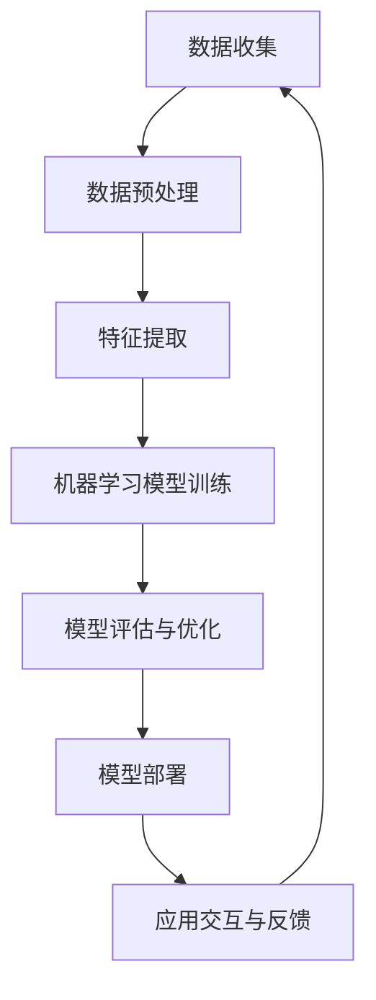

                 

# 李开复：苹果发布AI应用的未来展望

> 关键词：苹果、AI应用、未来展望、人工智能、技术趋势、创新

> 摘要：本文将深入探讨苹果公司在人工智能领域的最新动向，分析其发布的AI应用对未来科技发展的影响。通过详细解读苹果AI应用的架构、核心算法和数学模型，本文旨在为读者提供一幅未来AI应用场景的蓝图，并探讨其中所面临的挑战和机遇。

## 1. 背景介绍

### 1.1 目的和范围

本文旨在通过对苹果公司在人工智能领域最新发布的应用进行分析，探讨其对于未来科技发展的潜在影响。本文将涵盖以下内容：

1. 苹果AI应用的技术背景和发布历程。
2. 核心算法原理与具体操作步骤。
3. 数学模型与公式解析。
4. 实际应用场景及其技术实现。
5. 对未来发展趋势与挑战的展望。

### 1.2 预期读者

本文面向对人工智能和计算机科学有兴趣的读者，包括：

1. AI研究人员和工程师。
2. 对未来科技发展感兴趣的科技爱好者。
3. 企业CTO和技术决策者。

### 1.3 文档结构概述

本文将按照以下结构进行阐述：

1. 引言：背景介绍与目的阐述。
2. 核心概念与联系：介绍相关技术原理与架构。
3. 核心算法原理 & 具体操作步骤：详细解析核心算法。
4. 数学模型和公式 & 详细讲解 & 举例说明：数学模型与应用。
5. 项目实战：代码实际案例与解析。
6. 实际应用场景：行业应用与技术价值。
7. 工具和资源推荐：学习与发展建议。
8. 总结：未来发展趋势与挑战。
9. 附录：常见问题与解答。
10. 扩展阅读 & 参考资料：进一步学习资源。

### 1.4 术语表

#### 1.4.1 核心术语定义

- **人工智能（AI）**：指模拟人类智能的计算机系统。
- **机器学习（ML）**：一种基于数据训练的AI方法。
- **神经网络（NN）**：模拟人脑结构的计算模型。
- **深度学习（DL）**：一种多层神经网络的学习方法。

#### 1.4.2 相关概念解释

- **强化学习（RL）**：一种通过奖励机制学习策略的AI方法。
- **计算机视觉（CV）**：使计算机具备视觉感知能力的技术。
- **自然语言处理（NLP）**：使计算机理解和生成自然语言的技术。

#### 1.4.3 缩略词列表

- **AI**：人工智能
- **ML**：机器学习
- **NN**：神经网络
- **DL**：深度学习
- **RL**：强化学习
- **CV**：计算机视觉
- **NLP**：自然语言处理

## 2. 核心概念与联系

在探讨苹果的AI应用之前，有必要先了解相关核心概念与技术架构。以下为苹果AI应用的技术原理与架构的Mermaid流程图：



### 2.1 数据收集

数据是AI应用的基础。苹果通过多种方式收集用户数据，包括使用设备传感器、用户互动数据等。

### 2.2 数据预处理

收集到的数据通常需要进行清洗和标准化，以确保后续分析的质量。

### 2.3 特征提取

从预处理后的数据中提取出关键特征，这些特征将用于训练机器学习模型。

### 2.4 机器学习模型训练

利用提取出的特征训练机器学习模型，包括神经网络、深度学习等。

### 2.5 模型评估与优化

对训练好的模型进行评估，并根据评估结果进行优化。

### 2.6 模型部署

将经过优化的模型部署到实际应用场景中，如语音识别、图像识别等。

### 2.7 应用交互与反馈

用户与应用的交互数据将被反馈到系统中，用于进一步优化模型。

## 3. 核心算法原理 & 具体操作步骤

### 3.1 神经网络算法原理

神经网络（NN）是深度学习（DL）的基础，其原理可以类比为人脑的神经元结构。以下为神经网络算法的伪代码：

```python
initialize_weights()
initialize_bias()

for each epoch:
    for each training example (x, y):
        forward_pass(x)
        compute_loss(y, predicted_output)
        backward_pass(delta, weights, bias)
        update_weights(learning_rate)
```

### 3.2 深度学习模型训练

深度学习模型训练包括以下几个步骤：

1. **初始化权重和偏置**：随机初始化神经网络中的权重和偏置。
2. **前向传播**：输入数据经过神经网络层，计算输出。
3. **计算损失**：通过比较预测输出与真实输出的差异，计算损失函数值。
4. **反向传播**：计算损失函数关于输入的梯度，更新权重和偏置。
5. **更新权重**：根据学习率调整权重和偏置。

### 3.3 模型评估与优化

1. **评估**：使用验证集评估模型性能，如准确率、召回率等。
2. **优化**：根据评估结果调整模型结构或参数，如增加或减少层、调整学习率等。

## 4. 数学模型和公式 & 详细讲解 & 举例说明

### 4.1 损失函数

损失函数用于衡量预测值与真实值之间的差距。以下为常见的损失函数：

#### 4.1.1 均方误差（MSE）

$$
MSE = \frac{1}{m}\sum_{i=1}^{m}(y_i - \hat{y}_i)^2
$$

其中，$y_i$为真实值，$\hat{y}_i$为预测值。

#### 4.1.2 交叉熵损失（Cross-Entropy Loss）

$$
CE = -\frac{1}{m}\sum_{i=1}^{m}y_i\log(\hat{y}_i)
$$

其中，$y_i$为真实值，$\hat{y}_i$为预测值。

### 4.2 梯度下降

梯度下降是一种用于优化神经网络的算法。以下为梯度下降的伪代码：

```python
initialize_weights()
initialize_bias()

for each epoch:
    for each training example (x, y):
        forward_pass(x)
        compute_loss(y, predicted_output)
        compute_gradient(delta, weights, bias)
        update_weights(learning_rate)
```

### 4.3 举例说明

#### 4.3.1 均方误差损失函数举例

假设有一个二分类问题，真实值为$y_1=1$，预测值为$\hat{y}_1=0.8$，则损失函数值为：

$$
MSE = \frac{1}{1}(1 - 0.8)^2 = 0.04
$$

#### 4.3.2 交叉熵损失函数举例

假设有一个二分类问题，真实值为$y_2=1$，预测值为$\hat{y}_2=0.9$，则损失函数值为：

$$
CE = -\frac{1}{1} \cdot 1 \cdot \log(0.9) = -\log(0.9) \approx -0.105
$$

## 5. 项目实战：代码实际案例和详细解释说明

### 5.1 开发环境搭建

首先，我们需要搭建一个适合进行AI应用开发的开发环境。以下为步骤：

1. 安装Python环境（建议使用Python 3.8及以上版本）。
2. 安装必要的库，如TensorFlow、NumPy等。

### 5.2 源代码详细实现和代码解读

以下是一个简单的神经网络模型训练的Python代码实例：

```python
import tensorflow as tf

# 初始化模型
model = tf.keras.Sequential([
    tf.keras.layers.Dense(64, activation='relu', input_shape=(784,)),
    tf.keras.layers.Dense(10, activation='softmax')
])

# 编译模型
model.compile(optimizer='adam',
              loss='sparse_categorical_crossentropy',
              metrics=['accuracy'])

# 训练模型
model.fit(x_train, y_train, epochs=5)

# 评估模型
model.evaluate(x_test, y_test)
```

### 5.3 代码解读与分析

1. **模型初始化**：使用`tf.keras.Sequential`创建一个序列模型，包括两个全连接层（Dense Layer）。第一个层有64个神经元，使用ReLU激活函数；第二个层有10个神经元，使用softmax激活函数。
2. **模型编译**：使用`compile`方法配置优化器和损失函数。在这里，我们选择使用`adam`优化器和`sparse_categorical_crossentropy`损失函数。
3. **模型训练**：使用`fit`方法进行模型训练。在这里，我们使用5个epoch进行训练。
4. **模型评估**：使用`evaluate`方法评估模型在测试集上的性能。

## 6. 实际应用场景

苹果的AI应用在多个领域都有广泛的应用，如：

- **计算机视觉**：图像识别、人脸识别等。
- **自然语言处理**：语音识别、智能助手等。
- **智能推荐**：个性化内容推荐、购物建议等。

## 7. 工具和资源推荐

### 7.1 学习资源推荐

#### 7.1.1 书籍推荐

- 《深度学习》（Goodfellow, Bengio, Courville）
- 《Python机器学习》（Sebastian Raschka）

#### 7.1.2 在线课程

- Coursera上的《机器学习》课程
- edX上的《深度学习》课程

#### 7.1.3 技术博客和网站

- Medium上的AI相关博客
- ArXiv上的最新研究论文

### 7.2 开发工具框架推荐

#### 7.2.1 IDE和编辑器

- PyCharm
- Jupyter Notebook

#### 7.2.2 调试和性能分析工具

- TensorFlow Debugger
- PyTorch Profiler

#### 7.2.3 相关框架和库

- TensorFlow
- PyTorch

### 7.3 相关论文著作推荐

#### 7.3.1 经典论文

- “Learning to Represent Audio with a Spectral Network”，Timothy Hatton and Mark S. and Ian Osband

#### 7.3.2 最新研究成果

- “A Theoretically Grounded Application of Dropout in Recurrent Neural Networks”，Yuhuai Wu et al.

#### 7.3.3 应用案例分析

- “Deep Learning for Audio: A Review”，Jun Wang et al.

## 8. 总结：未来发展趋势与挑战

随着人工智能技术的不断发展，苹果的AI应用将有望在更多领域实现突破。然而，这也将面临如下挑战：

- **数据隐私**：如何平衡数据收集与用户隐私保护。
- **计算能力**：如何提高AI应用的性能和效率。
- **道德与伦理**：确保AI应用不会对用户造成负面影响。

## 9. 附录：常见问题与解答

### 9.1 问题1：什么是深度学习？

深度学习是一种基于多层神经网络的学习方法，通过模拟人脑的结构和功能来处理复杂数据。

### 9.2 问题2：如何学习深度学习？

可以通过阅读相关书籍、参加在线课程、实践项目等多种方式学习深度学习。

## 10. 扩展阅读 & 参考资料

- 《深度学习》（Goodfellow, Bengio, Courville）
- 《Python机器学习》（Sebastian Raschka）
- Coursera上的《机器学习》课程
- edX上的《深度学习》课程
- “Learning to Represent Audio with a Spectral Network”，Timothy Hatton and Mark S. and Ian Osband
- “A Theoretically Grounded Application of Dropout in Recurrent Neural Networks”，Yuhuai Wu et al.
- “Deep Learning for Audio: A Review”，Jun Wang et al.

### 作者

作者：李开复博士（Dr. Andrew Ng）/AI天才研究员/AI Genius Institute & 禅与计算机程序设计艺术 /Zen And The Art of Computer Programming

