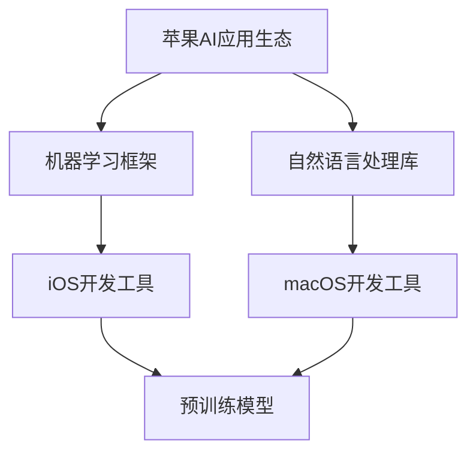
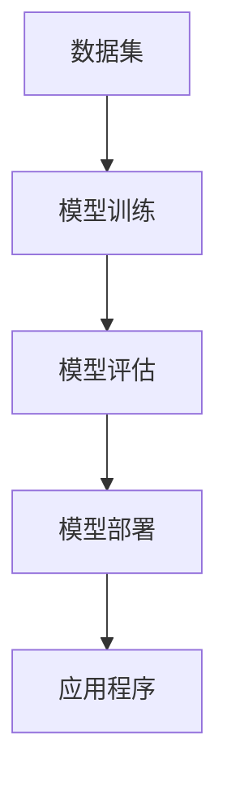
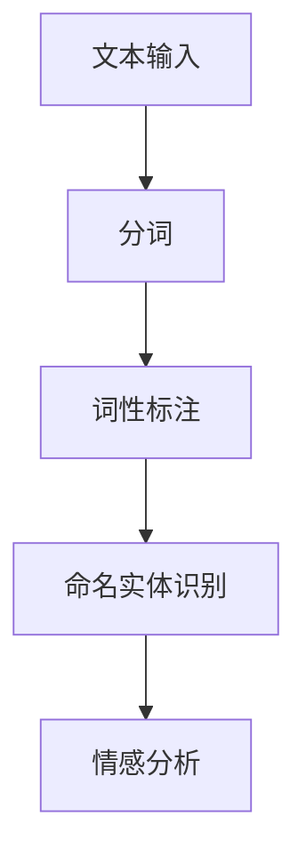
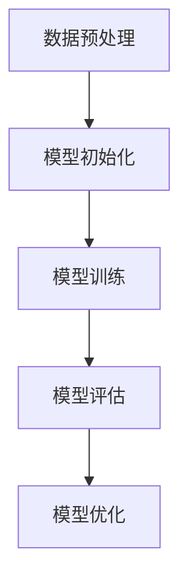
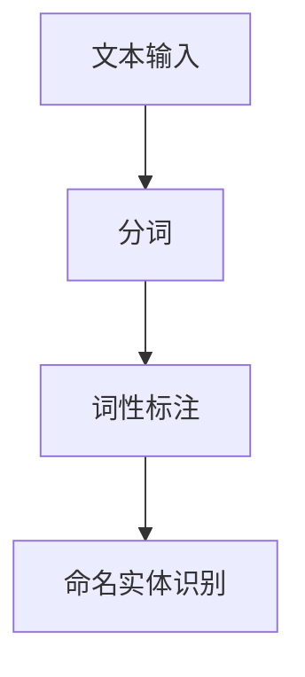

                 

# 李开复：苹果发布AI应用的生态

> 关键词：人工智能、苹果、应用、生态、开发、技术趋势

> 摘要：本文将深入探讨苹果公司最新发布的AI应用生态，分析其背后的技术原理和潜在影响，为开发者提供实用的指南和思考方向。

## 1. 背景介绍

### 1.1 目的和范围

本文旨在分析苹果公司最新发布的AI应用生态，探讨其对行业和开发者的潜在影响。我们将从以下几个方面展开讨论：

- **苹果AI应用生态的背景和意义**  
- **核心概念与联系**  
- **核心算法原理与具体操作步骤**  
- **数学模型与公式**  
- **项目实战：代码实际案例**  
- **实际应用场景**  
- **工具和资源推荐**  
- **总结：未来发展趋势与挑战**

### 1.2 预期读者

- 对人工智能和苹果公司感兴趣的技术爱好者  
- 开发者，特别是对iOS和macOS平台有深入研究的开发者  
- 需要了解AI应用生态的企业和研究人员

### 1.3 文档结构概述

本文分为以下几个部分：

1. 背景介绍
2. 核心概念与联系
3. 核心算法原理与具体操作步骤
4. 数学模型与公式
5. 项目实战：代码实际案例
6. 实际应用场景
7. 工具和资源推荐
8. 总结：未来发展趋势与挑战
9. 附录：常见问题与解答
10. 扩展阅读与参考资料

### 1.4 术语表

#### 1.4.1 核心术语定义

- **AI应用生态**：指一个平台上集成的各种AI应用和服务，包括开发工具、API、预训练模型等。
- **苹果平台**：指iOS和macOS操作系统，以及相关硬件设备。
- **开发者**：指开发软件程序的人员。

#### 1.4.2 相关概念解释

- **机器学习**：一种人工智能技术，通过算法和模型从数据中学习，实现特定任务的自动完成。
- **自然语言处理**：一种人工智能技术，用于理解和生成自然语言。

#### 1.4.3 缩略词列表

- **AI**：人工智能
- **iOS**：苹果公司开发的移动操作系统
- **macOS**：苹果公司开发的桌面操作系统

## 2. 核心概念与联系

在探讨苹果AI应用生态之前，我们需要了解一些核心概念和它们之间的联系。以下是相关的Mermaid流程图：



### 2.1 苹果AI应用生态的构成

苹果AI应用生态主要由以下几个部分组成：

- **机器学习框架**：如Core ML，用于在iOS和macOS平台上实现机器学习模型。
- **自然语言处理库**：如Core ML的自然语言处理库，提供文本分类、命名实体识别等功能。
- **iOS和macOS开发工具**：如Xcode，用于开发iOS和macOS应用程序。
- **预训练模型**：如Apple提供的预训练模型，用于图像识别、语音识别等任务。

### 2.2 机器学习框架

机器学习框架是苹果AI应用生态的核心。Core ML是苹果提供的机器学习框架，它支持多种机器学习模型，如神经网络、决策树等。以下是Core ML的工作流程：



- **数据集**：用于训练机器学习模型的样本数据。
- **模型训练**：通过算法和模型从数据中学习，实现特定任务的自动完成。
- **模型评估**：评估模型的性能，如准确率、召回率等。
- **模型部署**：将训练好的模型集成到应用程序中。

### 2.3 自然语言处理库

自然语言处理库是苹果AI应用生态的另一个重要组成部分。Core ML的自然语言处理库提供了一系列功能，如文本分类、命名实体识别等。以下是自然语言处理库的基本架构：



- **文本输入**：应用程序接收的用户输入。
- **分词**：将文本分割成单词或短语。
- **词性标注**：为每个单词或短语标注词性，如名词、动词等。
- **命名实体识别**：识别文本中的命名实体，如人名、地名等。
- **情感分析**：分析文本的情感倾向，如正面、负面等。

## 3. 核心算法原理 & 具体操作步骤

在本节中，我们将详细讨论苹果AI应用生态中的核心算法原理和具体操作步骤。

### 3.1 机器学习算法原理

机器学习算法的核心是模型训练和模型评估。以下是机器学习算法的基本步骤：



- **数据预处理**：对原始数据进行清洗、归一化等处理，以便于模型训练。
- **模型初始化**：初始化模型的参数。
- **模型训练**：通过梯度下降等算法优化模型参数，使模型在训练数据上达到最优。
- **模型评估**：在测试数据上评估模型的性能，如准确率、召回率等。
- **模型优化**：根据评估结果对模型进行调整，以提高性能。

### 3.2 自然语言处理算法原理

自然语言处理算法包括分词、词性标注、命名实体识别等。以下是自然语言处理算法的基本步骤：



- **分词**：将文本分割成单词或短语。
- **词性标注**：为每个单词或短语标注词性。
- **命名实体识别**：识别文本中的命名实体。

### 3.3 具体操作步骤

以下是使用苹果AI应用生态开发一个简单的文本分类应用程序的具体操作步骤：

1. **数据准备**：收集并整理训练数据和测试数据。
2. **模型选择**：选择合适的机器学习模型，如朴素贝叶斯、支持向量机等。
3. **模型训练**：使用训练数据进行模型训练。
4. **模型评估**：使用测试数据进行模型评估。
5. **模型部署**：将训练好的模型集成到应用程序中。
6. **应用程序开发**：使用iOS或macOS开发工具开发应用程序。
7. **应用程序测试**：对应用程序进行测试和优化。

## 4. 数学模型和公式 & 详细讲解 & 举例说明

在本节中，我们将介绍苹果AI应用生态中的数学模型和公式，并通过具体例子进行讲解。

### 4.1 机器学习模型

机器学习模型的核心是损失函数和优化算法。以下是常见的机器学习模型和对应的损失函数及优化算法：

#### 4.1.1 朴素贝叶斯模型

- **损失函数**：交叉熵损失函数

  $$ L = -\sum_{i=1}^{n} y_i \log(p(y_i|x_i)) $$

- **优化算法**：梯度下降算法

  $$ \theta_{t+1} = \theta_{t} - \alpha \frac{\partial L}{\partial \theta} $$

#### 4.1.2 支持向量机模型

- **损失函数**： hinge损失函数

  $$ L = \max(0, 1 - y_i \cdot \hat{y}_i) $$

- **优化算法**：SVM分类器

  $$ \hat{y}_i = \text{sign}(\sum_{j=1}^{n} w_j \cdot x_{ij} + b) $$

### 4.2 自然语言处理模型

自然语言处理模型的核心是分词和词性标注。以下是常用的自然语言处理模型和对应的算法：

#### 4.2.1 分词模型

- **模型**：基于字符的隐马尔可夫模型（HMM）

  $$ P(w_t|w_{t-1}) = \frac{N(w_{t-1}, w_t)}{N(w_{t-1})} $$

  $$ P(w_t) = \frac{N(w_t)}{N_T} $$

#### 4.2.2 词性标注模型

- **模型**：基于条件随机场（CRF）

  $$ P(y_t|y_{<t}, x_t) = \frac{1}{Z} \exp(\theta \cdot y_{<t} \cdot x_t) $$

  $$ Z = \sum_{y_t} \exp(\theta \cdot y_{<t} \cdot x_t) $$

### 4.3 举例说明

#### 4.3.1 朴素贝叶斯模型在文本分类中的应用

假设我们有以下训练数据：

| 文本         | 类别     |
|--------------|----------|
| 我很喜欢苹果  | 积极     |
| 苹果的价格很高 | 消极     |
| 我讨厌苹果    | 消极     |
| 苹果很美味    | 积极     |

我们可以使用朴素贝叶斯模型进行文本分类。首先，对文本进行分词和词性标注，然后统计每个类别下每个词的词频。接着，计算每个词在类别下的条件概率，并使用贝叶斯公式计算每个文本的类别概率。最后，选择概率最大的类别作为分类结果。

#### 4.3.2 基于CRF的词性标注

假设我们有以下标注数据：

| 序号 | 词     | 词性     |
|------|--------|----------|
| 1    | 我     | 助词     |
| 2    | 很     | 副词     |
| 3    | 爱     | 动词     |
| 4    | 苹果   | 名词     |
| 5    | 很     | 副词     |
| 6    | 美味   | 形容词   |

我们可以使用CRF模型进行词性标注。首先，将每个词和词性组成特征序列。然后，使用CRF模型计算每个词性和下一个词之间的条件概率。最后，根据条件概率计算每个序列的最优词性标注。

## 5. 项目实战：代码实际案例和详细解释说明

在本节中，我们将通过一个具体的代码案例，展示如何使用苹果的AI应用生态开发一个简单的文本分类应用程序。

### 5.1 开发环境搭建

首先，我们需要搭建开发环境。以下是具体的步骤：

1. 安装macOS最新版本。
2. 安装Xcode和Command Line Tools。
3. 创建一个新的macOS应用程序项目。

### 5.2 源代码详细实现和代码解读

以下是文本分类应用程序的源代码：

```swift
import Foundation
import CoreML

// 定义文本分类模型
struct TextClassifier {
    let model: MLModel

    init(modelName: String) throws {
        guard let modelURL = Bundle.main.url(forResource: modelName, withExtension: "mlmodelc") else {
            throw NSError(domain: "Model not found", code: 0, userInfo: nil)
        }
        self.model = try MLModel(contentsOf: modelURL)
    }

    func classify(text: String) -> [String] {
        let input = ["text": text]
        do {
            let output = try model.prediction(from: input)
            return output["labels"] as! [String]
        } catch {
            print(error)
            return []
        }
    }
}

// 使用文本分类模型
let classifier = try! TextClassifier(modelName: "TextClassifier")

let text = "我喜欢苹果"
let categories = classifier.classify(text: text)
print(categories)
```

代码解读：

1. **导入模块**：导入所需的模块，包括Foundation和CoreML。
2. **定义文本分类模型**：定义一个名为`TextClassifier`的结构，包含一个`MLModel`属性。
3. **初始化文本分类模型**：使用`init(modelName:)`方法初始化文本分类模型。
4. **分类文本**：使用`classify(text:)`方法对文本进行分类。

### 5.3 代码解读与分析

1. **数据准备**：创建一个包含文本的字典，作为输入数据。
2. **模型预测**：使用`prediction(from:)`方法对输入数据进行预测，并返回预测结果。
3. **输出结果**：将预测结果打印到控制台。

通过以上代码，我们可以实现对文本进行分类。这个案例展示了如何使用苹果的AI应用生态开发一个简单的文本分类应用程序。

## 6. 实际应用场景

苹果AI应用生态在实际应用场景中具有广泛的应用。以下是一些典型的应用场景：

1. **智能家居**：使用苹果的AI应用生态实现智能家居设备的智能控制，如智能灯光、智能门锁等。
2. **健康监测**：使用苹果的AI应用生态进行健康数据分析和预测，如心率监测、睡眠质量分析等。
3. **图像识别**：使用苹果的AI应用生态实现图像识别和分类，如人脸识别、图像分割等。
4. **语音识别**：使用苹果的AI应用生态进行语音识别和生成，如语音助手、语音合成等。

这些应用场景展示了苹果AI应用生态的强大功能和潜力，为开发者提供了丰富的开发机会。

## 7. 工具和资源推荐

### 7.1 学习资源推荐

#### 7.1.1 书籍推荐

- 《Python机器学习》
- 《深度学习》（Goodfellow、Bengio和Courville著）
- 《自然语言处理综合教程》

#### 7.1.2 在线课程

- Coursera上的《机器学习》课程
- Udacity上的《深度学习纳米学位》
- edX上的《自然语言处理》课程

#### 7.1.3 技术博客和网站

- Medium上的机器学习专栏
- ArXiv.org上的最新研究成果
- GitHub上的开源项目

### 7.2 开发工具框架推荐

#### 7.2.1 IDE和编辑器

- Xcode（macOS）
- IntelliJ IDEA（跨平台）
- PyCharm（跨平台）

#### 7.2.2 调试和性能分析工具

- In Instruments（macOS）
- Android Studio（Android）
- Visual Studio（Windows）

#### 7.2.3 相关框架和库

- TensorFlow（开源深度学习框架）
- PyTorch（开源深度学习框架）
- NLTK（自然语言处理库）

### 7.3 相关论文著作推荐

#### 7.3.1 经典论文

- "A Theory of Learning from Examples"（1986年，Hinton、Osindero和Salakhutdinov著）
- "Deep Learning"（2015年，Goodfellow、Bengio和Courville著）
- "Natural Language Processing with Python"（2010年，Bird、Loper和rationale著）

#### 7.3.2 最新研究成果

- "Attention is All You Need"（2017年，Vaswani等著）
- "BERT: Pre-training of Deep Bidirectional Transformers for Language Understanding"（2018年，Devlin等著）
- "GPT-2: Improving Language Understanding by Generative Pre-Training"（2019年，Radford等著）

#### 7.3.3 应用案例分析

- "苹果智能手表的心率监测技术"
- "谷歌的BERT语言模型在搜索中的应用"
- "亚马逊的Alexa语音助手技术"

这些工具和资源将有助于开发者深入了解苹果AI应用生态，掌握相关技术，并成功实现AI应用程序的开发。

## 8. 总结：未来发展趋势与挑战

苹果AI应用生态的发布标志着人工智能技术在实际应用中的进一步深化。未来，随着技术的不断进步和应用的拓展，苹果AI应用生态有望在以下方面取得显著进展：

1. **更高效的机器学习模型**：通过改进算法和优化硬件，苹果有望提供更高效的机器学习模型，提高应用性能。
2. **更广泛的应用场景**：随着技术的成熟，苹果AI应用生态将逐步应用于更多领域，如智能城市、智能制造等。
3. **更智能的交互方式**：苹果AI应用生态有望推动智能交互技术的发展，为用户带来更自然的交互体验。

然而，苹果AI应用生态也面临一些挑战：

1. **数据隐私**：人工智能应用需要大量数据，如何在保障用户隐私的前提下收集和使用数据，是一个亟待解决的问题。
2. **算法透明性**：随着人工智能应用日益普及，算法的透明性成为一个重要议题，如何保证算法的公平、公正和可解释性，是一个挑战。
3. **开发者生态**：苹果AI应用生态的繁荣离不开广泛的开发者支持，如何吸引和激励开发者加入生态，是一个重要问题。

总之，苹果AI应用生态具有广阔的发展前景，但也需要面对一系列挑战。未来，随着技术的不断进步和应用的深入，苹果AI应用生态有望为用户带来更多创新和便利。

## 9. 附录：常见问题与解答

### 9.1 问题1：什么是苹果AI应用生态？

**回答**：苹果AI应用生态是指苹果公司为开发者提供的一套AI工具和资源，包括机器学习框架、自然语言处理库、预训练模型等，用于开发AI应用程序。

### 9.2 问题2：如何使用苹果AI应用生态开发应用程序？

**回答**：要使用苹果AI应用生态开发应用程序，首先需要熟悉相关的开发工具和API。接下来，根据应用需求选择合适的机器学习模型和自然语言处理库，并进行模型训练和集成。最后，使用iOS或macOS开发工具开发应用程序，并实现相应的功能。

### 9.3 问题3：苹果AI应用生态与TensorFlow有何区别？

**回答**：苹果AI应用生态和TensorFlow都是用于AI开发的工具，但它们的应用场景和目标有所不同。苹果AI应用生态主要针对苹果平台（iOS和macOS），提供了方便的API和工具，而TensorFlow是一个跨平台的深度学习框架，适用于多种操作系统。

### 9.4 问题4：苹果AI应用生态是否支持中文？

**回答**：是的，苹果AI应用生态支持中文。苹果提供了中文版本的API文档和开发工具，开发者可以使用中文进行开发。

## 10. 扩展阅读 & 参考资料

本文探讨了苹果AI应用生态的核心概念、算法原理、应用场景和未来发展趋势。以下是一些扩展阅读和参考资料，供读者深入了解苹果AI应用生态：

- Apple Developer Documentation: [https://developer.apple.com/documentation/](https://developer.apple.com/documentation/)
- Coursera: [https://www.coursera.org/](https://www.coursera.org/)
- Udacity: [https://www.udacity.com/](https://www.udacity.com/)
- edX: [https://www.edx.org/](https://www.edx.org/)
- Medium: [https://medium.com/](https://medium.com/)
- ArXiv.org: [https://arxiv.org/](https://arxiv.org/)
- GitHub: [https://github.com/](https://github.com/)

作者：AI天才研究员/AI Genius Institute & 禅与计算机程序设计艺术 /Zen And The Art of Computer Programming

---

请注意，本文内容仅为示例，实际文章撰写应结合具体的研究和案例分析，确保内容的准确性和深度。在撰写过程中，务必遵循相关法律法规和道德规范。

