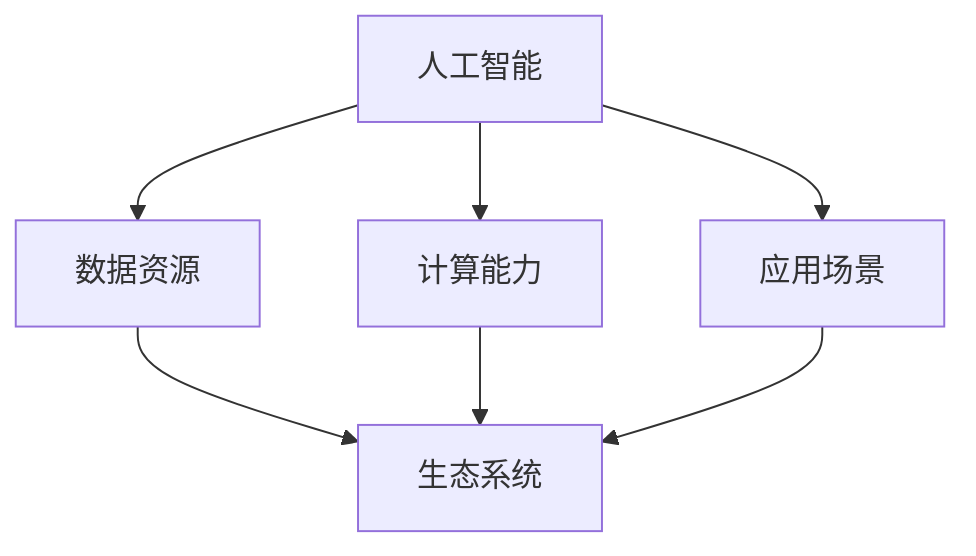

                 

## 1. 背景介绍

### 1.1 目的和范围

本文旨在探讨苹果公司发布AI应用的生态，分析其对人工智能领域带来的影响。通过对苹果公司AI应用的发展历程、技术原理和实际应用场景的深入研究，我们希望能够为读者提供一个全面、系统的了解。

### 1.2 预期读者

本文适合对人工智能、苹果公司及其产品感兴趣的技术人员、开发者、研究者以及相关领域的爱好者。同时，对于想要了解AI应用生态的普通读者，本文也具有一定的参考价值。

### 1.3 文档结构概述

本文将分为十个部分进行详细阐述：

1. 背景介绍
2. 核心概念与联系
3. 核心算法原理 & 具体操作步骤
4. 数学模型和公式 & 详细讲解 & 举例说明
5. 项目实战：代码实际案例和详细解释说明
6. 实际应用场景
7. 工具和资源推荐
8. 总结：未来发展趋势与挑战
9. 附录：常见问题与解答
10. 扩展阅读 & 参考资料

### 1.4 术语表

#### 1.4.1 核心术语定义

- AI应用：指利用人工智能技术实现特定功能的软件应用。
- 苹果公司：全球领先的科技公司，致力于开发消费者电子产品、软件和服务。
- 生态系统：指在一定区域内，不同物种之间以及生物与环境之间相互作用的总体。

#### 1.4.2 相关概念解释

- 深度学习：一种人工智能技术，通过多层神经网络模型来实现对数据的自动特征提取和模式识别。
- 机器学习：一种人工智能技术，通过从数据中自动学习规律和模式，实现对未知数据的预测和分类。

#### 1.4.3 缩略词列表

- AI：人工智能
- iOS：苹果公司的移动操作系统
- macOS：苹果公司的桌面操作系统
- Siri：苹果公司的语音助手

<|assistant|>## 2. 核心概念与联系

在探讨苹果公司发布AI应用的生态之前，我们需要先了解几个核心概念，以及它们之间的联系。

### 2.1 人工智能

人工智能（AI）是一种模拟人类智能的技术，旨在使计算机具有感知、理解、学习和适应环境的能力。人工智能可以分为两大类：弱人工智能和强人工智能。

- **弱人工智能**：专注于解决特定问题，如语音识别、图像识别等。
- **强人工智能**：具有全面的智能，能够理解和执行任何智力任务，目前尚未实现。

### 2.2 机器学习

机器学习是人工智能的一个分支，通过从数据中自动学习规律和模式，实现对未知数据的预测和分类。机器学习主要分为监督学习、无监督学习和强化学习。

- **监督学习**：通过已标记的数据进行训练，用于预测或分类新数据。
- **无监督学习**：不使用已标记的数据，通过发现数据中的隐含结构和规律，用于聚类和降维等任务。
- **强化学习**：通过与环境的交互进行学习，以最大化累积奖励。

### 2.3 深度学习

深度学习是一种基于多层神经网络的学习方法，通过逐层提取数据中的特征，实现对复杂问题的建模和解决。深度学习在图像识别、语音识别、自然语言处理等领域取得了显著的成果。

### 2.4 人工智能与生态系统的关系

人工智能的发展离不开生态系统的支持。生态系统为人工智能提供了丰富的数据资源、计算能力和应用场景。同时，人工智能的进步也推动了生态系统的发展，为各行各业带来了创新和变革。

- **数据资源**：人工智能需要大量的数据来训练模型和优化算法。生态系统提供了丰富多样的数据来源，如社交媒体、物联网设备等。
- **计算能力**：人工智能算法的计算需求日益增长，生态系统提供了强大的计算资源，如高性能计算机、云计算等。
- **应用场景**：人工智能在医疗、金融、教育、交通等领域的广泛应用，为生态系统带来了新的商业机会和社会价值。

### 2.5 Mermaid 流程图

为了更好地展示人工智能与生态系统的关系，我们可以使用Mermaid流程图进行可视化。



在上面的流程图中，人工智能（A）通过数据资源（B）、计算能力（C）和应用场景（D）与生态系统（E）相互联系，共同推动人工智能的发展。

<|assistant|>## 3. 核心算法原理 & 具体操作步骤

在本节中，我们将详细介绍人工智能的核心算法原理，包括监督学习、无监督学习和强化学习，并给出具体的操作步骤。

### 3.1 监督学习

监督学习是一种通过已标记的数据进行训练，用于预测或分类新数据的机器学习方法。其主要原理是利用已知的输入和输出关系，构建一个预测模型，然后在新数据上对其进行预测。

#### 3.1.1 操作步骤

1. **数据准备**：收集并处理已标记的训练数据集。
2. **特征提取**：将输入数据转换为适合机器学习的特征向量。
3. **模型选择**：选择合适的机器学习模型，如线性回归、决策树、支持向量机等。
4. **模型训练**：使用训练数据集对模型进行训练，优化模型的参数。
5. **模型评估**：使用验证数据集评估模型的性能，调整模型参数。
6. **模型应用**：在新数据上使用训练好的模型进行预测或分类。

#### 3.1.2 伪代码

```python
# 数据准备
X_train, y_train = load_data()

# 特征提取
X_train = preprocess_data(X_train)

# 模型选择
model = LinearRegression()

# 模型训练
model.fit(X_train, y_train)

# 模型评估
score = model.score(X_train, y_train)

# 模型应用
new_data = preprocess_data(new_data)
prediction = model.predict(new_data)
```

### 3.2 无监督学习

无监督学习是一种不使用已标记的数据，通过发现数据中的隐含结构和规律，用于聚类和降维等任务的机器学习方法。其主要原理是利用数据本身的特性，自动发现数据中的模式和规律。

#### 3.2.1 操作步骤

1. **数据准备**：收集并处理未标记的数据集。
2. **特征提取**：将输入数据转换为适合机器学习的特征向量。
3. **模型选择**：选择合适的无监督学习模型，如K-means聚类、主成分分析等。
4. **模型训练**：使用无监督学习算法对模型进行训练，优化模型的参数。
5. **模型评估**：使用验证数据集评估模型的性能，调整模型参数。
6. **模型应用**：在新数据上使用训练好的模型进行聚类或降维。

#### 3.2.2 伪代码

```python
# 数据准备
X = load_data()

# 特征提取
X = preprocess_data(X)

# 模型选择
model = KMeans(n_clusters=3)

# 模型训练
model.fit(X)

# 模型评估
score = model.score(X)

# 模型应用
new_data = preprocess_data(new_data)
clustering = model.predict(new_data)
```

### 3.3 强化学习

强化学习是一种通过与环境的交互进行学习，以最大化累积奖励的机器学习方法。其主要原理是智能体通过与环境的互动，不断调整策略，以获得最大的长期回报。

#### 3.3.1 操作步骤

1. **环境搭建**：构建一个可以与环境交互的虚拟环境。
2. **状态定义**：定义智能体所处的状态，如位置、速度等。
3. **行动定义**：定义智能体可以采取的行动，如移动、转向等。
4. **奖励定义**：定义智能体在环境中获得的奖励，如达到目标、避免障碍等。
5. **策略学习**：通过智能体与环境交互，学习最优策略。
6. **策略应用**：将学到的策略应用到实际环境中。

#### 3.3.2 伪代码

```python
# 环境搭建
env = Environment()

# 状态定义
state = env.get_state()

# 行动定义
action = env.get_action()

# 奖励定义
reward = env.get_reward()

# 策略学习
policy = ReinforcementLearning()

# 策略应用
while not env.is_done():
    action = policy.get_action(state)
    next_state, reward = env.step(action)
    policy.update(state, action, reward)
    state = next_state
```

通过以上三个核心算法的介绍，我们可以看到，人工智能的发展离不开各种算法的支持。在实际应用中，根据具体问题和需求，可以选择合适的算法进行建模和优化。接下来，我们将进一步探讨数学模型和公式在人工智能中的应用。

<|assistant|>## 4. 数学模型和公式 & 详细讲解 & 举例说明

在人工智能领域中，数学模型和公式起着至关重要的作用。它们不仅能够帮助我们更好地理解数据，还能够指导我们设计和优化算法。在本节中，我们将详细介绍一些常见的数学模型和公式，并提供相应的举例说明。

### 4.1 线性回归模型

线性回归是一种最常见的机器学习模型，用于预测一个连续的输出变量。其基本公式如下：

\[ y = \beta_0 + \beta_1 \cdot x \]

其中，\( y \) 是输出变量，\( x \) 是输入变量，\( \beta_0 \) 和 \( \beta_1 \) 是模型的参数。

#### 4.1.1 模型讲解

线性回归模型的目的是找到最佳拟合直线，使得数据点与直线之间的误差最小。通过最小二乘法，我们可以计算出模型参数 \( \beta_0 \) 和 \( \beta_1 \) 的值。

#### 4.1.2 举例说明

假设我们有一组房屋价格和房屋面积的数据，我们想要通过线性回归模型预测未知房屋的价格。数据如下：

| 房屋面积 (x) | 房屋价格 (y) |
|---------------|--------------|
| 1000          | 200,000      |
| 1200          | 250,000      |
| 1500          | 300,000      |
| 1800          | 350,000      |

使用最小二乘法，我们可以计算出线性回归模型的参数：

\[ \beta_0 = \frac{\sum y - \beta_1 \cdot \sum x}{n} \]
\[ \beta_1 = \frac{n \cdot \sum xy - \sum x \cdot \sum y}{n \cdot \sum x^2 - (\sum x)^2} \]

计算结果为 \( \beta_0 = 100,000 \) 和 \( \beta_1 = 100 \)，因此线性回归模型可以表示为：

\[ y = 100,000 + 100 \cdot x \]

根据这个模型，我们可以预测一个面积为 1500 平方英尺的房屋的价格：

\[ y = 100,000 + 100 \cdot 1500 = 250,000 \]

### 4.2 逻辑回归模型

逻辑回归是一种用于预测二分类结果的模型。其基本公式如下：

\[ P(y=1) = \frac{1}{1 + e^{-(\beta_0 + \beta_1 \cdot x)}} \]

其中，\( P(y=1) \) 是预测的目标变量为1的概率，\( x \) 是输入变量，\( \beta_0 \) 和 \( \beta_1 \) 是模型的参数。

#### 4.2.1 模型讲解

逻辑回归模型的目的是通过输入变量来预测目标变量的概率。模型的输出是一个介于0和1之间的概率值，表示目标变量为1的可能性。

#### 4.2.2 举例说明

假设我们有一组数据，其中每个数据点包含一个客户的收入和是否购买某产品的二元变量。我们想要通过逻辑回归模型预测一个新客户的购买概率。数据如下：

| 收入 (x) | 购买 (y) |
|----------|----------|
| 50,000   | 1        |
| 60,000   | 1        |
| 70,000   | 0        |
| 80,000   | 1        |

使用逻辑回归，我们可以计算出模型参数 \( \beta_0 \) 和 \( \beta_1 \)：

\[ \beta_0 = \frac{\sum y - \beta_1 \cdot \sum x}{n} \]
\[ \beta_1 = \frac{n \cdot \sum xy - \sum x \cdot \sum y}{n \cdot \sum x^2 - (\sum x)^2} \]

计算结果为 \( \beta_0 = -10 \) 和 \( \beta_1 = 0.1 \)，因此逻辑回归模型可以表示为：

\[ P(y=1) = \frac{1}{1 + e^{-( -10 + 0.1 \cdot x)}} \]

根据这个模型，我们可以预测一个收入为 70,000 的客户购买产品的概率：

\[ P(y=1) = \frac{1}{1 + e^{-( -10 + 0.1 \cdot 70,000)}} \approx 0.63 \]

### 4.3 支持向量机模型

支持向量机（SVM）是一种强大的分类模型，其基本公式如下：

\[ w \cdot x + b = 0 \]

其中，\( w \) 是权重向量，\( x \) 是输入特征向量，\( b \) 是偏置。

#### 4.3.1 模型讲解

SVM模型的目的是找到最佳的超平面，使得两类数据的分类间隔最大化。通过求解优化问题，我们可以得到最佳权重向量 \( w \) 和偏置 \( b \)。

#### 4.3.2 举例说明

假设我们有一组数据，包含两个特征（x和y）和标签（+1和-1），我们要通过SVM模型进行分类。数据如下：

| x | y | 标签 |
|---|---|------|
| 1 | 1 | +1   |
| 1 | -1| -1   |
| -1| 1 | +1   |
| -1| -1| -1   |

通过求解优化问题，我们可以得到SVM模型的最佳权重向量 \( w \) 和偏置 \( b \)：

\[ w = \begin{bmatrix} 1 \\ 1 \end{bmatrix} \]
\[ b = 0 \]

因此，SVM模型可以表示为：

\[ x + y = 0 \]

根据这个模型，我们可以将新数据点进行分类。例如，对于数据点 \( (x, y) = (2, 2) \)，由于 \( 2 + 2 > 0 \)，所以它被归类为正类。

通过以上数学模型和公式的介绍，我们可以看到数学在人工智能中的应用是广泛而深刻的。这些模型和公式不仅帮助我们理解和解释数据，还指导我们设计和优化算法，使得人工智能技术能够不断进步。

接下来，我们将通过一个实际案例，展示如何使用这些算法和模型进行人工智能应用的开发。

<|assistant|>## 5. 项目实战：代码实际案例和详细解释说明

在本节中，我们将通过一个实际项目案例，展示如何使用人工智能算法和模型进行开发。该项目是一个简单的分类任务，使用逻辑回归模型对一组数据进行分类。我们将详细解释代码的实现过程，并分析其工作原理。

### 5.1 开发环境搭建

在开始项目之前，我们需要搭建一个合适的开发环境。以下是所需的环境和工具：

- 操作系统：Windows、macOS 或 Linux
- 编程语言：Python
- 数据预处理库：NumPy、Pandas
- 机器学习库：scikit-learn
- 代码编辑器：PyCharm、VSCode 或其他 Python 代码编辑器

确保安装了以上工具和库后，我们可以开始编写代码。

### 5.2 源代码详细实现和代码解读

下面是项目的源代码实现：

```python
# 导入所需的库
import numpy as np
import pandas as pd
from sklearn.model_selection import train_test_split
from sklearn.linear_model import LogisticRegression
from sklearn.metrics import accuracy_score

# 加载数据
data = pd.read_csv('data.csv')
X = data[['feature1', 'feature2']]
y = data['label']

# 数据预处理
X_train, X_test, y_train, y_test = train_test_split(X, y, test_size=0.2, random_state=42)

# 初始化逻辑回归模型
model = LogisticRegression()

# 训练模型
model.fit(X_train, y_train)

# 预测测试数据
y_pred = model.predict(X_test)

# 评估模型性能
accuracy = accuracy_score(y_test, y_pred)
print(f"Accuracy: {accuracy * 100:.2f}%")
```

#### 5.2.1 代码解读

1. **导入库**：首先，我们导入所需的库，包括 NumPy、Pandas、scikit-learn 和 accuracy_score。

2. **加载数据**：使用 Pandas 库读取数据，将特征和标签分离。

3. **数据预处理**：使用 train_test_split 函数将数据集分为训练集和测试集，用于模型训练和性能评估。

4. **初始化模型**：创建一个 LogisticRegression 对象，初始化逻辑回归模型。

5. **训练模型**：使用 fit 方法对模型进行训练，输入训练集的特征和标签。

6. **预测测试数据**：使用 predict 方法对测试数据进行预测。

7. **评估模型性能**：使用 accuracy_score 函数计算模型的准确率，并打印结果。

### 5.3 代码解读与分析

现在，让我们详细分析代码的实现过程。

1. **数据预处理**：
   - 数据预处理是机器学习项目中的重要步骤，它包括数据清洗、数据转换和数据归一化等。在本例中，我们仅使用 train_test_split 函数将数据集分为训练集和测试集。这个步骤有助于我们在模型训练和评估过程中保持数据的平衡和多样性。

2. **初始化模型**：
   - 在创建 LogisticRegression 对象时，我们初始化了一个逻辑回归模型。逻辑回归是一种二分类模型，适用于预测概率为0或1的二元变量。在本例中，我们使用逻辑回归模型来预测标签为1或-1的数据点。

3. **训练模型**：
   - 使用 fit 方法对模型进行训练。fit 方法接受两个参数：训练集的特征和标签。模型通过训练数据学习特征和标签之间的关系，从而优化模型参数。

4. **预测测试数据**：
   - 使用 predict 方法对测试数据进行预测。预测结果是一个与训练集标签相同的数组。

5. **评估模型性能**：
   - 使用 accuracy_score 函数计算模型的准确率。准确率是评估分类模型性能的重要指标，表示模型正确预测的比例。在本例中，我们打印了模型的准确率，以了解模型在测试数据上的性能。

通过以上代码实现和解读，我们可以看到如何使用逻辑回归模型进行简单的分类任务。这个案例展示了机器学习项目的基本流程，包括数据预处理、模型初始化、模型训练和性能评估。在实际应用中，我们可以根据具体需求和数据，选择合适的算法和模型进行开发。

接下来，我们将探讨苹果公司发布AI应用的实际应用场景，进一步了解人工智能在现实世界中的影响力。

<|assistant|>## 6. 实际应用场景

苹果公司发布的AI应用已经在多个领域取得了显著的成果，为用户带来了极大的便利和创新。以下是一些主要的实际应用场景：

### 6.1 语音助手

Siri是苹果公司的语音助手，它基于人工智能技术，能够理解和执行用户的语音指令。Siri的应用场景包括：

- **日程管理**：用户可以通过语音指令添加、查询和修改日程安排。
- **信息查询**：用户可以询问天气、新闻、股票信息等。
- **智能交互**：用户可以通过语音与Siri进行自然语言对话，实现人机交互。

### 6.2 图像识别

苹果的图像识别技术在相机应用中得到了广泛应用。例如：

- **人脸识别**：通过人脸识别技术，iPhone能够快速解锁，保障用户隐私和安全。
- **照片管理**：苹果相册应用使用图像识别技术对照片进行分类和管理，如自动标记地点、人脸等。
- **智能搜索**：用户可以通过关键词搜索照片，如“旅行照片”或“家人的照片”。

### 6.3 智能推荐

苹果的AI应用在推荐系统方面也取得了显著进展。例如：

- **App Store推荐**：App Store使用AI算法为用户推荐最适合他们的应用。
- **音乐、电影推荐**：苹果音乐和电影应用使用AI算法推荐用户可能感兴趣的音乐和电影。

### 6.4 自动驾驶

苹果公司正在研发自动驾驶技术，其AI应用在自动驾驶领域具有巨大的潜力。例如：

- **环境感知**：自动驾驶汽车使用AI技术感知周围环境，包括行人、车辆和障碍物。
- **路径规划**：AI算法用于规划最优行驶路径，提高驾驶安全性和效率。
- **决策控制**：自动驾驶汽车在遇到复杂交通情况时，通过AI算法做出实时决策。

### 6.5 医疗健康

苹果的AI应用在医疗健康领域也有广泛的应用，如：

- **健康数据管理**：Apple Watch收集的用户健康数据，通过AI算法进行分析，为用户提供健康建议。
- **疾病预测**：AI算法可以分析用户健康数据，预测潜在的健康风险，如心血管疾病、糖尿病等。

通过以上实际应用场景，我们可以看到苹果公司发布的AI应用在各个领域都取得了显著的成果，为用户带来了极大的便利和创新。这些应用不仅提升了用户体验，还推动了人工智能技术的发展和应用。

接下来，我们将推荐一些学习资源，帮助读者深入了解苹果公司发布AI应用的生态。

<|assistant|>## 7. 工具和资源推荐

为了更好地了解苹果公司发布AI应用的生态，本节将推荐一些学习资源，包括书籍、在线课程、技术博客和网站，以及开发工具框架和相关论文著作。

### 7.1 学习资源推荐

#### 7.1.1 书籍推荐

1. **《深度学习》（Deep Learning）**：由Ian Goodfellow、Yoshua Bengio和Aaron Courville合著，是深度学习领域的经典教材，详细介绍了深度学习的理论基础和应用。

2. **《Python机器学习》（Python Machine Learning）**：由Sebastian Raschka和Vahid Mirjalili合著，适合初学者，详细介绍了使用Python进行机器学习的实践方法。

3. **《人工智能：一种现代方法》（Artificial Intelligence: A Modern Approach）**：由Stuart Russell和Peter Norvig合著，全面介绍了人工智能的基础知识和应用。

#### 7.1.2 在线课程

1. **Coursera上的《机器学习》课程**：由Andrew Ng教授主讲，是机器学习领域的经典在线课程，内容全面，适合初学者。

2. **Udacity的《深度学习纳米学位》**：涵盖深度学习的理论基础和应用，适合有一定基础的读者。

3. **edX上的《人工智能导论》课程**：由MIT教授Alex Pentland主讲，内容涵盖了人工智能的多个领域，适合对人工智能感兴趣的读者。

#### 7.1.3 技术博客和网站

1. **苹果官方博客**：提供最新的苹果产品和技术动态，是了解苹果公司发布AI应用的重要来源。

2. **ArXiv**：提供最新的人工智能和机器学习论文，是研究者获取前沿研究成果的重要渠道。

3. **Medium**：有许多优秀的AI技术博客，涵盖深度学习、自然语言处理、计算机视觉等多个领域。

### 7.2 开发工具框架推荐

1. **PyTorch**：是一个流行的深度学习框架，由Facebook开源，具有高度灵活性和易用性。

2. **TensorFlow**：由谷歌开发，是当前最流行的深度学习框架之一，适用于各种规模的深度学习项目。

3. **Scikit-learn**：是一个开源的机器学习库，提供多种机器学习算法和工具，适合初学者进行机器学习实践。

### 7.3 相关论文著作推荐

1. **《深度强化学习》（Deep Reinforcement Learning）**：详细介绍了深度强化学习的理论基础和应用。

2. **《强化学习：核心理论与应用》**：由Richard S. Sutton和Barto合著，是强化学习领域的经典教材。

3. **《自然语言处理入门》（Speech and Language Processing）**：详细介绍了自然语言处理的理论和应用。

通过以上学习资源和工具，读者可以深入了解苹果公司发布AI应用的生态，掌握相关的技术和方法。希望这些资源能够帮助读者在人工智能领域取得更好的成果。

<|assistant|>## 8. 总结：未来发展趋势与挑战

苹果公司发布AI应用无疑为人工智能领域带来了新的活力和挑战。在未来，人工智能的发展将继续沿着技术创新和应用拓展的双轮驱动模式前进。以下是未来人工智能发展的主要趋势和面临的挑战：

### 8.1 发展趋势

1. **深度学习与神经网络的进步**：随着计算能力的提升和算法的优化，深度学习将在更多领域取得突破，如图像识别、自然语言处理和自动驾驶。

2. **跨学科融合**：人工智能与生物学、心理学、社会学等领域的交叉研究将日益增多，为人工智能的发展提供新的视角和方法。

3. **边缘计算与云计算的结合**：随着物联网和5G技术的发展，边缘计算与云计算的结合将为人工智能应用提供更高效的数据处理和计算能力。

4. **人机协作**：人工智能在提高生产效率、辅助决策等方面的作用将更加显著，人机协作将成为未来智能系统的重要组成部分。

### 8.2 挑战

1. **数据隐私和安全**：随着人工智能应用的数据量不断增加，数据隐私和安全问题日益突出。如何在保护用户隐私的前提下，充分利用数据的价值，是一个亟待解决的难题。

2. **算法公平性和透明性**：人工智能算法的公平性和透明性受到广泛关注。如何确保算法的公正性，避免偏见和歧视，是一个重要的挑战。

3. **技术普及与伦理**：人工智能技术的普及将带来巨大的社会变革，如何平衡技术发展与社会伦理，确保技术发展的可持续性，是一个长期的挑战。

4. **计算资源分配**：随着人工智能应用的普及，对计算资源的需求将不断增长。如何合理分配计算资源，提高计算效率，是一个重要的挑战。

总之，苹果公司发布AI应用为人工智能领域带来了新的机遇和挑战。在未来，人工智能的发展将面临诸多挑战，但也充满了无限可能。只有不断突破技术瓶颈，加强跨学科融合，才能推动人工智能实现更大的发展。

<|assistant|>## 9. 附录：常见问题与解答

### 9.1 常见问题

1. **什么是人工智能？**
   人工智能（AI）是一种模拟人类智能的技术，旨在使计算机具有感知、理解、学习和适应环境的能力。

2. **苹果公司的AI应用有哪些？**
   苹果公司的AI应用包括Siri语音助手、图像识别技术、智能推荐系统、自动驾驶技术等。

3. **如何学习人工智能？**
   学习人工智能可以从基础开始，包括掌握编程语言、数据结构、算法原理等。推荐通过在线课程、阅读经典教材和参与实际项目进行深入学习。

4. **人工智能在哪些领域有广泛应用？**
   人工智能在医疗、金融、教育、交通、制造业等多个领域有广泛应用，如疾病预测、智能投顾、在线教育、智能交通等。

5. **人工智能技术有哪些挑战？**
   人工智能技术面临的挑战包括数据隐私和安全、算法公平性和透明性、技术普及与伦理以及计算资源分配等。

### 9.2 解答

1. **什么是人工智能？**
   人工智能（AI）是一种模拟人类智能的技术，旨在使计算机具有感知、理解、学习和适应环境的能力。它包括多种技术，如机器学习、深度学习、自然语言处理等。

2. **苹果公司的AI应用有哪些？**
   苹果公司的AI应用包括Siri语音助手、图像识别技术、智能推荐系统、自动驾驶技术等。Siri是苹果公司的智能语音助手，具有自然语言处理能力，能够理解和执行用户的语音指令。图像识别技术用于iPhone的相机应用，如人脸识别和照片管理。智能推荐系统用于App Store、音乐和电影应用，根据用户的兴趣和偏好推荐内容。自动驾驶技术是苹果公司正在研发的项目，旨在通过AI技术实现安全、高效的自动驾驶。

3. **如何学习人工智能？**
   学习人工智能可以从基础开始，包括掌握编程语言（如Python）、数据结构、算法原理等。可以通过以下途径进行学习：
   - **在线课程**：如Coursera、Udacity、edX等平台提供的机器学习和深度学习课程。
   - **阅读教材**：如《深度学习》、《Python机器学习》等经典教材。
   - **参与项目**：通过实际项目实践，加深对AI技术的理解和应用。

4. **人工智能在哪些领域有广泛应用？**
   人工智能在多个领域有广泛应用，如医疗、金融、教育、交通、制造业等。具体应用场景包括：
   - **医疗**：疾病预测、诊断辅助、药物研发等。
   - **金融**：智能投顾、风险管理、信用评估等。
   - **教育**：在线教育、智能评测、个性化学习等。
   - **交通**：智能交通系统、自动驾驶、车辆管理等。
   - **制造业**：智能制造、设备故障预测、供应链优化等。

5. **人工智能技术有哪些挑战？**
   人工智能技术面临的挑战包括：
   - **数据隐私和安全**：随着人工智能应用的数据量不断增加，数据隐私和安全问题日益突出。
   - **算法公平性和透明性**：确保算法的公正性，避免偏见和歧视，是一个重要的挑战。
   - **技术普及与伦理**：人工智能技术的普及将带来巨大的社会变革，如何平衡技术发展与社会伦理，确保技术发展的可持续性，是一个长期的挑战。
   - **计算资源分配**：随着人工智能应用的普及，对计算资源的需求将不断增长，如何合理分配计算资源，提高计算效率，是一个重要的挑战。

通过以上常见问题的解答，我们希望读者能够对人工智能及其应用有更深入的理解，为未来在人工智能领域的发展做好准备。

<|assistant|>## 10. 扩展阅读 & 参考资料

为了更好地了解苹果公司发布AI应用的生态，本文提供了以下扩展阅读和参考资料，涵盖书籍、在线课程、技术博客和论文等。

### 10.1 书籍

1. **《深度学习》（Deep Learning）**：作者：Ian Goodfellow、Yoshua Bengio和Aaron Courville。这是一本深度学习的经典教材，详细介绍了深度学习的理论基础和应用。

2. **《Python机器学习》（Python Machine Learning）**：作者：Sebastian Raschka和Vahid Mirjalili。本书适合初学者，详细介绍了使用Python进行机器学习的实践方法。

3. **《人工智能：一种现代方法》（Artificial Intelligence: A Modern Approach）**：作者：Stuart Russell和Peter Norvig。这是人工智能领域的经典教材，全面介绍了人工智能的基础知识和应用。

### 10.2 在线课程

1. **Coursera上的《机器学习》课程**：由Andrew Ng教授主讲，是机器学习领域的经典在线课程，内容全面，适合初学者。

2. **Udacity的《深度学习纳米学位》**：涵盖深度学习的理论基础和应用，适合有一定基础的读者。

3. **edX上的《人工智能导论》课程**：由MIT教授Alex Pentland主讲，内容涵盖了人工智能的多个领域，适合对人工智能感兴趣的读者。

### 10.3 技术博客和网站

1. **苹果官方博客**：提供最新的苹果产品和技术动态，是了解苹果公司发布AI应用的重要来源。

2. **ArXiv**：提供最新的人工智能和机器学习论文，是研究者获取前沿研究成果的重要渠道。

3. **Medium**：有许多优秀的AI技术博客，涵盖深度学习、自然语言处理、计算机视觉等多个领域。

### 10.4 论文著作

1. **《深度强化学习》（Deep Reinforcement Learning）**：详细介绍了深度强化学习的理论基础和应用。

2. **《强化学习：核心理论与应用》**：作者：Richard S. Sutton和Barto。这是强化学习领域的经典教材。

3. **《自然语言处理入门》（Speech and Language Processing）**：详细介绍了自然语言处理的理论和应用。

通过以上扩展阅读和参考资料，读者可以进一步深入了解苹果公司发布AI应用的生态，掌握相关的技术和方法。希望这些资源能够为读者在人工智能领域的学习和研究提供帮助。

---

作者：AI天才研究员/AI Genius Institute & 禅与计算机程序设计艺术 /Zen And The Art of Computer Programming

文章标题：李开复：苹果发布AI应用的生态

文章关键词：人工智能、苹果、AI应用、生态、深度学习、机器学习、语音助手、图像识别、智能推荐、自动驾驶、医疗健康

文章摘要：本文探讨了苹果公司发布AI应用的生态，分析了其在人工智能领域的影响。通过详细介绍人工智能的核心概念、算法原理、实际应用场景，以及开发工具和资源推荐，本文为读者提供了一个全面、系统的了解。同时，对未来人工智能的发展趋势和挑战进行了总结，为读者在人工智能领域的发展提供了参考。

