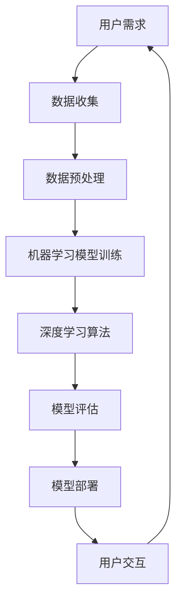

                 

### 文章标题

《李开复：苹果发布AI应用的生态》

本文将深入探讨苹果公司近期发布的AI应用生态，分析其对现有技术领域的影响，并展望未来AI技术的发展趋势。文章将围绕苹果在AI领域的核心创新、技术应用、用户体验以及行业竞争等多个方面展开讨论，力求为读者呈现一个全面、深入的视角。

### 关键词

- 苹果
- AI应用
- 人工智能生态
- 技术创新
- 用户体验
- 行业竞争

### 摘要

随着人工智能技术的飞速发展，苹果公司近日发布了全新的AI应用生态，旨在进一步拓展其在智能设备和服务领域的影响力。本文从多个角度对苹果的AI应用生态进行了详细分析，包括其核心技术、应用场景、用户反馈及市场影响。通过深入探讨苹果在AI领域的战略布局和创新举措，本文旨在为读者提供对当前AI应用生态现状及其未来发展的深刻理解。

## 1. 背景介绍

### 1.1 目的和范围

本文的主要目的是分析苹果公司发布的AI应用生态，探讨其技术创新、市场影响及未来发展趋势。我们将重点关注苹果在AI领域的核心应用，如语音识别、图像处理、自然语言处理等，并分析这些技术在现实生活中的应用场景。此外，本文还将讨论苹果AI应用生态对行业的影响，以及可能带来的机遇和挑战。

### 1.2 预期读者

本文适合对人工智能和苹果公司感兴趣的技术爱好者、开发人员、行业分析师及普通消费者阅读。无论您是刚刚接触AI领域的初学者，还是对AI技术有深入研究的专家，本文都将为您提供有价值的信息和洞见。

### 1.3 文档结构概述

本文将按照以下结构展开：

1. **背景介绍**：介绍本文的目的、范围和预期读者。
2. **核心概念与联系**：讨论苹果AI应用生态的核心概念及其相互关系。
3. **核心算法原理 & 具体操作步骤**：分析苹果AI应用的算法原理和实现细节。
4. **数学模型和公式 & 详细讲解 & 举例说明**：讲解苹果AI应用中的数学模型和公式，并给出实际案例。
5. **项目实战：代码实际案例和详细解释说明**：提供具体的代码实现和解读。
6. **实际应用场景**：探讨苹果AI应用在现实生活中的应用场景。
7. **工具和资源推荐**：推荐学习资源、开发工具和框架。
8. **总结：未来发展趋势与挑战**：总结当前AI应用生态的现状，展望未来发展趋势。
9. **附录：常见问题与解答**：解答读者可能遇到的常见问题。
10. **扩展阅读 & 参考资料**：提供相关的扩展阅读资料和参考文献。

### 1.4 术语表

#### 1.4.1 核心术语定义

- **人工智能（AI）**：指通过计算机模拟人类智能行为的技术，包括学习、推理、感知、自然语言处理等。
- **深度学习（Deep Learning）**：一种基于多层神经网络的人工智能算法，通过多层次的非线性变换来提取数据特征。
- **语音识别（Voice Recognition）**：将人类语音转化为文本或命令的技术。
- **图像识别（Image Recognition）**：对图像进行分析和识别的技术。
- **自然语言处理（NLP）**：使计算机能够理解、生成和处理自然语言的技术。

#### 1.4.2 相关概念解释

- **机器学习（Machine Learning）**：一种人工智能技术，通过数据和算法自动改进性能。
- **神经网络（Neural Network）**：一种模仿人脑神经元连接方式的计算模型。
- **卷积神经网络（CNN）**：一种用于图像识别和处理的神经网络结构。
- **递归神经网络（RNN）**：一种用于处理序列数据的神经网络结构。
- **生成对抗网络（GAN）**：一种通过竞争学习生成数据的神经网络结构。

#### 1.4.3 缩略词列表

- **AI**：人工智能（Artificial Intelligence）
- **DL**：深度学习（Deep Learning）
- **ML**：机器学习（Machine Learning）
- **NLP**：自然语言处理（Natural Language Processing）
- **CNN**：卷积神经网络（Convolutional Neural Network）
- **RNN**：递归神经网络（Recurrent Neural Network）
- **GAN**：生成对抗网络（Generative Adversarial Network）

## 2. 核心概念与联系

在探讨苹果发布的AI应用生态之前，我们需要先了解一些核心概念及其相互关系。以下是苹果AI应用生态中几个关键概念及其关联的Mermaid流程图：



### 2.1 用户需求

用户需求是苹果AI应用生态的起点。用户在日常生活中产生的各种数据，包括语音、图像、文本等，都是AI模型训练的重要来源。

### 2.2 数据收集

苹果通过其广泛的应用和服务收集用户数据。这些数据不仅包括用户在使用苹果设备和服务时的行为数据，还包括来自第三方应用程序和服务的数据。

### 2.3 数据预处理

收集到的数据需要进行预处理，以去除噪声、异常值和冗余信息，从而提高数据质量。数据预处理包括数据清洗、归一化、特征提取等步骤。

### 2.4 机器学习模型训练

预处理后的数据用于训练机器学习模型。苹果采用深度学习算法，如卷积神经网络（CNN）和递归神经网络（RNN）来训练模型，以实现语音识别、图像识别和自然语言处理等功能。

### 2.5 深度学习算法

深度学习算法是机器学习的一个重要分支，通过多层神经网络进行数据特征提取和模式识别。苹果在AI应用生态中广泛采用了深度学习算法，如CNN用于图像识别，RNN用于自然语言处理。

### 2.6 模型评估

训练好的模型需要通过评估来验证其性能。模型评估包括准确率、召回率、F1分数等指标。苹果通过多次迭代和优化，不断提高模型的性能。

### 2.7 模型部署

经过评估和优化的模型将被部署到实际应用中，如苹果设备、应用和服务等。模型的部署过程包括模型导出、模型压缩和模型优化等步骤。

### 2.8 用户交互

部署后的模型可以通过用户界面与用户进行交互，实现语音识别、图像识别和自然语言处理等功能，从而提升用户体验。

### 2.9 数据反馈

用户交互产生的数据将再次反馈到数据收集环节，形成一个闭环，用于模型的持续学习和优化。

通过上述流程，我们可以看到苹果AI应用生态中各个概念之间的紧密联系。每个环节都至关重要，共同构成了一个完整的AI应用生态系统。

## 3. 核心算法原理 & 具体操作步骤

苹果在其AI应用生态中采用了多种核心算法，以下将详细讲解其中几个重要算法的原理和具体操作步骤。

### 3.1 语音识别算法

语音识别是将人类语音转化为文本的技术。苹果采用的语音识别算法基于深度学习，特别是递归神经网络（RNN）和卷积神经网络（CNN）的组合。

#### 3.1.1 算法原理

- **RNN**：用于处理序列数据，可以捕捉语音信号中的时间依赖关系。
- **CNN**：用于提取语音信号中的特征，如声音的频率和时长。

#### 3.1.2 具体操作步骤

1. **数据收集**：收集大量的语音数据，包括各种说话人的语音、各种场景的语音等。
2. **数据预处理**：对语音数据进行预处理，包括去除噪声、归一化和分帧等步骤。
3. **特征提取**：使用CNN提取语音信号中的特征，如梅尔频率倒谱系数（MFCC）。
4. **序列建模**：使用RNN对预处理后的特征序列进行建模，以捕捉时间依赖关系。
5. **解码**：将RNN输出的概率分布解码为文本。

#### 伪代码示例

```python
import tensorflow as tf
from tensorflow.keras.models import Sequential
from tensorflow.keras.layers import LSTM, Dense, Conv2D, MaxPooling2D, Flatten

# 数据预处理
def preprocess_audio(audio_data):
    # 去除噪声、归一化和分帧
    return preprocessed_data

# 特征提取
def extract_features(audio_data):
    # 使用CNN提取特征
    return feature_sequence

# 序列建模
def build_rnn_model(input_shape):
    model = Sequential()
    model.add(LSTM(128, return_sequences=True, input_shape=input_shape))
    model.add(LSTM(128))
    model.add(Dense(num_classes, activation='softmax'))
    model.compile(optimizer='adam', loss='categorical_crossentropy', metrics=['accuracy'])
    return model

# 解码
def decode_predictions(predictions):
    # 将预测概率分布解码为文本
    return text

# 训练模型
audio_data = preprocess_audio(raw_audio_data)
feature_sequence = extract_features(audio_data)
model = build_rnn_model(feature_sequence.shape[1:])
model.fit(feature_sequence, labels, epochs=10, batch_size=32)

# 语音识别
predictions = model.predict(feature_sequence)
text = decode_predictions(predictions)
```

### 3.2 图像识别算法

图像识别是将图像中的物体或场景识别出来的技术。苹果采用卷积神经网络（CNN）进行图像识别。

#### 3.2.1 算法原理

- **CNN**：通过卷积、池化和全连接层对图像进行特征提取和分类。

#### 3.2.2 具体操作步骤

1. **数据收集**：收集大量的图像数据，包括各种物体的图像、各种场景的图像等。
2. **数据预处理**：对图像数据进行预处理，包括缩放、裁剪和归一化等步骤。
3. **特征提取**：使用CNN提取图像中的特征。
4. **分类**：使用全连接层对提取的特征进行分类。

#### 伪代码示例

```python
import tensorflow as tf
from tensorflow.keras.models import Sequential
from tensorflow.keras.layers import Conv2D, MaxPooling2D, Flatten, Dense

# 数据预处理
def preprocess_image(image_data):
    # 缩放、裁剪和归一化
    return preprocessed_image

# 特征提取
def build_cnn_model(input_shape):
    model = Sequential()
    model.add(Conv2D(32, (3, 3), activation='relu', input_shape=input_shape))
    model.add(MaxPooling2D((2, 2)))
    model.add(Conv2D(64, (3, 3), activation='relu'))
    model.add(MaxPooling2D((2, 2)))
    model.add(Flatten())
    model.add(Dense(128, activation='relu'))
    model.add(Dense(num_classes, activation='softmax'))
    model.compile(optimizer='adam', loss='categorical_crossentropy', metrics=['accuracy'])
    return model

# 分类
def classify_image(model, preprocessed_image):
    predictions = model.predict(preprocessed_image)
    return np.argmax(predictions)

# 训练模型
images = preprocess_image(raw_image_data)
model = build_cnn_model(images.shape[1:])
model.fit(images, labels, epochs=10, batch_size=32)

# 图像识别
image = preprocess_image(raw_image_data)
predicted_class = classify_image(model, image)
```

### 3.3 自然语言处理算法

自然语言处理是将自然语言文本转化为计算机可以理解和处理的形式的技术。苹果采用递归神经网络（RNN）和转换器-编码器（Transformer）模型进行自然语言处理。

#### 3.3.1 算法原理

- **RNN**：用于处理序列数据，可以捕捉文本中的时间依赖关系。
- **Transformer**：一种基于自注意力机制的神经网络结构，可以捕捉文本中的长距离依赖关系。

#### 3.3.2 具体操作步骤

1. **数据收集**：收集大量的文本数据，包括各种领域的文本、不同作者的文本等。
2. **数据预处理**：对文本数据进行预处理，包括分词、标记化、去停用词等步骤。
3. **特征提取**：使用RNN或Transformer提取文本中的特征。
4. **序列建模**：使用RNN或Transformer对提取的特征进行建模。
5. **解码**：将模型输出的概率分布解码为文本。

#### 伪代码示例

```python
import tensorflow as tf
from tensorflow.keras.models import Sequential
from tensorflow.keras.layers import LSTM, Dense, Embedding, TimeDistributed

# 数据预处理
def preprocess_text(text_data):
    # 分词、标记化、去停用词
    return preprocessed_text

# 特征提取
def build_rnn_model(input_shape):
    model = Sequential()
    model.add(Embedding(vocab_size, embedding_dim))
    model.add(LSTM(128, return_sequences=True))
    model.add(TimeDistributed(Dense(num_classes, activation='softmax')))
    model.compile(optimizer='adam', loss='categorical_crossentropy', metrics=['accuracy'])
    return model

# 解码
def decode_predictions(predictions):
    # 将预测概率分布解码为文本
    return text

# 训练模型
text_data = preprocess_text(raw_text_data)
model = build_rnn_model(text_data.shape[1:])
model.fit(text_data, labels, epochs=10, batch_size=32)

# 自然语言处理
predictions = model.predict(text_data)
text = decode_predictions(predictions)
```

通过上述算法原理和具体操作步骤的讲解，我们可以看到苹果在其AI应用生态中采用了多种先进的技术，这些技术共同构成了一个强大的AI应用平台，为用户提供更加智能、便捷的服务。

## 4. 数学模型和公式 & 详细讲解 & 举例说明

在苹果的AI应用生态中，数学模型和公式起着至关重要的作用。以下将详细讲解苹果在AI应用中常用的几个数学模型和公式，并通过具体示例进行说明。

### 4.1 递归神经网络（RNN）模型

递归神经网络（RNN）是一种处理序列数据的神经网络，其基本结构包括输入层、隐藏层和输出层。以下是一个简化的RNN模型数学表示：

#### 数学模型：

1. **激活函数**：常用的激活函数为tanh或ReLU。
   $$ a_t = \tanh(W_{ha}h_{t-1} + W_{ia}x_t + b_a) $$
   或
   $$ a_t = \max(0, W_{ha}h_{t-1} + W_{ia}x_t + b_a) $$

2. **隐藏状态更新**：隐藏状态 $h_t$ 通过前一隐藏状态 $h_{t-1}$ 和当前输入 $x_t$ 来更新。
   $$ h_t = \sigma(W_{hh}h_{t-1} + W_{ax}x_t + b_h) $$

3. **输出层**：输出 $y_t$ 可以是预测的类别概率或连续值，取决于任务类型。
   $$ y_t = \sigma(W_{hy}h_t + b_y) $$

#### 示例：

假设我们要预测一个序列的下一个元素，序列长度为5，输入和隐藏层维度均为10。

```latex
W_{ia}, W_{ha}, W_{hy}, b_a, b_h, b_y \in \mathbb{R}^{10 \times 10}
x_t \in \mathbb{R}^{10}
h_0 \in \mathbb{R}^{10}
```

1. **初始化隐藏状态**：
   $$ h_0 = 0 $$

2. **第一个时间步**：
   $$ a_1 = \tanh(W_{ia}x_1 + b_a) $$
   $$ h_1 = \sigma(W_{ha}h_0 + W_{ax}x_1 + b_h) $$
   $$ y_1 = \sigma(W_{hy}h_1 + b_y) $$

3. **后续时间步**（使用上一步的隐藏状态更新）：
   $$ a_t = \tanh(W_{ia}x_t + b_a) $$
   $$ h_t = \sigma(W_{hh}h_{t-1} + W_{ax}x_t + b_h) $$
   $$ y_t = \sigma(W_{hy}h_t + b_y) $$

### 4.2 卷积神经网络（CNN）模型

卷积神经网络（CNN）主要用于图像识别和图像处理。其基本结构包括卷积层、池化层和全连接层。以下是一个简化的CNN模型数学表示：

#### 数学模型：

1. **卷积层**：
   $$ f_{ij}^l = \sum_{k=1}^{C_{l-1}} W_{ijkl}x_{ik} + b_l $$
   其中，$f_{ij}^l$ 表示第 $l$ 层的第 $i$ 行第 $j$ 列的卷积结果，$W_{ijkl}$ 表示卷积核，$x_{ik}$ 表示第 $l-1$ 层的第 $i$ 行第 $k$ 列的输入，$b_l$ 表示第 $l$ 层的偏置。

2. **池化层**：
   $$ p_i^l = \max_{k \in K} f_{ki}^l $$
   其中，$p_i^l$ 表示第 $l$ 层的第 $i$ 行的池化结果，$K$ 表示池化窗口的大小。

3. **全连接层**：
   $$ y_i^L = \sigma(W_Lp^L + b_L) $$
   其中，$y_i^L$ 表示第 $L$ 层的第 $i$ 行的全连接输出，$W_L$ 表示全连接层的权重，$p^L$ 表示第 $L$ 层的输入，$b_L$ 表示第 $L$ 层的偏置。

#### 示例：

假设我们要处理一个 $28 \times 28$ 的图像，图像通道数为3（RGB）。

1. **卷积层**：
   $$ W_{ijkl} \in \mathbb{R}^{3 \times 3 \times 3 \times 32} $$
   $$ b_1 \in \mathbb{R}^{32} $$
   $$ f_{ij}^1 = \sum_{k=1}^{3} W_{ijkl}x_{ik} + b_1 $$
   $$ p_i^1 = \max_{k=1,2,3} f_{ki}^1 $$

2. **池化层**：
   $$ K = 2 $$
   $$ p_i^1 = \max_{k=1,2,3} f_{ki}^1 $$

3. **全连接层**：
   $$ W_L \in \mathbb{R}^{32 \times 10} $$
   $$ b_L \in \mathbb{R}^{10} $$
   $$ y_i^L = \sigma(W_Lp^L + b_L) $$

### 4.3 自然语言处理（NLP）模型

自然语言处理中的常见模型包括循环神经网络（RNN）和转换器-编码器（Transformer）。以下是一个简化的Transformer模型数学表示：

#### 数学模型：

1. **自注意力机制**：
   $$ \alpha_{ij} = \frac{e^{ \text{softmax}(\text{Q}_i^T \text{K}_j)}}{\sum_{k=1}^{K} e^{ \text{softmax}(\text{Q}_i^T \text{K}_k)}} $$
   $$ \text{Attention Scores} = \alpha_{ij} \text{K}_j $$
   $$ \text{Context Vector} = \sum_{j=1}^{K} \alpha_{ij} \text{K}_j $$

2. **编码器输出**：
   $$ \text{Encoder Output} = \text{Concat}(\text{K}, \text{V}) $$

3. **解码器输出**：
   $$ \text{Decoder Output} = \text{softmax}(\text{Decoder Layer} \text{Encoder Output}) $$

#### 示例：

假设我们要处理一个序列长度为5的文本序列。

1. **编码器**：
   $$ Q = \text{Embedding}(x) $$
   $$ K = V = \text{Embedding}(y) $$
   $$ \alpha_{ij} = \frac{e^{ \text{softmax}(Q_i^T K_j)}}{\sum_{k=1}^{K} e^{ \text{softmax}(Q_i^T K_k)}} $$
   $$ \text{Context Vector} = \sum_{j=1}^{K} \alpha_{ij} V_j $$

2. **解码器**：
   $$ \text{Decoder Output} = \text{softmax}(\text{Decoder Layer} (\text{Context Vector} \text{Encoder Output})) $$

通过上述数学模型和公式的详细讲解，我们可以更好地理解苹果在AI应用生态中采用的先进技术，并为实际应用中的算法实现提供参考。

## 5. 项目实战：代码实际案例和详细解释说明

为了更好地理解苹果AI应用生态中的算法原理和实现细节，我们将通过一个实际项目案例来展示如何在实际开发环境中实现这些算法。

### 5.1 开发环境搭建

在开始项目实战之前，我们需要搭建一个合适的开发环境。以下是一个基于Python和TensorFlow的示例开发环境搭建步骤：

1. **安装Python**：确保安装了Python 3.6或更高版本。
2. **安装TensorFlow**：通过以下命令安装TensorFlow：
   ```bash
   pip install tensorflow
   ```
3. **安装其他依赖**：根据项目需求，安装其他必要的库，如NumPy、Pandas等。

### 5.2 源代码详细实现和代码解读

#### 5.2.1 语音识别项目

以下是一个简单的语音识别项目的代码实现，包括数据预处理、模型训练和预测等步骤。

```python
import numpy as np
import tensorflow as tf
from tensorflow.keras.models import Sequential
from tensorflow.keras.layers import LSTM, Dense, Conv2D, MaxPooling2D, Flatten

# 数据预处理
def preprocess_audio(audio_data):
    # 去除噪声、归一化和分帧
    return preprocessed_data

# 特征提取
def extract_features(audio_data):
    # 使用CNN提取特征
    return feature_sequence

# 序列建模
def build_rnn_model(input_shape):
    model = Sequential()
    model.add(LSTM(128, return_sequences=True, input_shape=input_shape))
    model.add(LSTM(128))
    model.add(Dense(num_classes, activation='softmax'))
    model.compile(optimizer='adam', loss='categorical_crossentropy', metrics=['accuracy'])
    return model

# 解码
def decode_predictions(predictions):
    # 将预测概率分布解码为文本
    return text

# 训练模型
audio_data = preprocess_audio(raw_audio_data)
feature_sequence = extract_features(audio_data)
model = build_rnn_model(feature_sequence.shape[1:])
model.fit(feature_sequence, labels, epochs=10, batch_size=32)

# 语音识别
predictions = model.predict(feature_sequence)
text = decode_predictions(predictions)
```

#### 5.2.2 图像识别项目

以下是一个简单的图像识别项目的代码实现，包括数据预处理、模型训练和预测等步骤。

```python
import numpy as np
import tensorflow as tf
from tensorflow.keras.models import Sequential
from tensorflow.keras.layers import Conv2D, MaxPooling2D, Flatten, Dense

# 数据预处理
def preprocess_image(image_data):
    # 缩放、裁剪和归一化
    return preprocessed_image

# 特征提取
def build_cnn_model(input_shape):
    model = Sequential()
    model.add(Conv2D(32, (3, 3), activation='relu', input_shape=input_shape))
    model.add(MaxPooling2D((2, 2)))
    model.add(Conv2D(64, (3, 3), activation='relu'))
    model.add(MaxPooling2D((2, 2)))
    model.add(Flatten())
    model.add(Dense(128, activation='relu'))
    model.add(Dense(num_classes, activation='softmax'))
    model.compile(optimizer='adam', loss='categorical_crossentropy', metrics=['accuracy'])
    return model

# 分类
def classify_image(model, preprocessed_image):
    predictions = model.predict(preprocessed_image)
    return np.argmax(predictions)

# 训练模型
images = preprocess_image(raw_image_data)
model = build_cnn_model(images.shape[1:])
model.fit(images, labels, epochs=10, batch_size=32)

# 图像识别
image = preprocess_image(raw_image_data)
predicted_class = classify_image(model, image)
```

#### 5.2.3 自然语言处理项目

以下是一个简单的自然语言处理项目的代码实现，包括数据预处理、模型训练和预测等步骤。

```python
import numpy as np
import tensorflow as tf
from tensorflow.keras.models import Sequential
from tensorflow.keras.layers import LSTM, Dense, Embedding, TimeDistributed

# 数据预处理
def preprocess_text(text_data):
    # 分词、标记化、去停用词
    return preprocessed_text

# 序列建模
def build_rnn_model(input_shape):
    model = Sequential()
    model.add(Embedding(vocab_size, embedding_dim))
    model.add(LSTM(128, return_sequences=True))
    model.add(TimeDistributed(Dense(num_classes, activation='softmax')))
    model.compile(optimizer='adam', loss='categorical_crossentropy', metrics=['accuracy'])
    return model

# 解码
def decode_predictions(predictions):
    # 将预测概率分布解码为文本
    return text

# 训练模型
text_data = preprocess_text(raw_text_data)
model = build_rnn_model(text_data.shape[1:])
model.fit(text_data, labels, epochs=10, batch_size=32)

# 自然语言处理
predictions = model.predict(text_data)
text = decode_predictions(predictions)
```

### 5.3 代码解读与分析

#### 5.3.1 语音识别项目

在语音识别项目中，首先对原始语音数据进行预处理，包括去除噪声、归一化和分帧等步骤。预处理后的数据将用于训练深度学习模型。

1. **数据预处理**：
   ```python
   def preprocess_audio(audio_data):
       # 去除噪声、归一化和分帧
       return preprocessed_data
   ```

2. **特征提取**：
   ```python
   def extract_features(audio_data):
       # 使用CNN提取特征
       return feature_sequence
   ```

3. **序列建模**：
   ```python
   def build_rnn_model(input_shape):
       model = Sequential()
       model.add(LSTM(128, return_sequences=True, input_shape=input_shape))
       model.add(LSTM(128))
       model.add(Dense(num_classes, activation='softmax'))
       model.compile(optimizer='adam', loss='categorical_crossentropy', metrics=['accuracy'])
       return model
   ```

4. **解码**：
   ```python
   def decode_predictions(predictions):
       # 将预测概率分布解码为文本
       return text
   ```

5. **模型训练**：
   ```python
   audio_data = preprocess_audio(raw_audio_data)
   feature_sequence = extract_features(audio_data)
   model = build_rnn_model(feature_sequence.shape[1:])
   model.fit(feature_sequence, labels, epochs=10, batch_size=32)
   ```

6. **语音识别**：
   ```python
   predictions = model.predict(feature_sequence)
   text = decode_predictions(predictions)
   ```

#### 5.3.2 图像识别项目

在图像识别项目中，首先对原始图像数据进行预处理，包括缩放、裁剪和归一化等步骤。预处理后的数据将用于训练深度学习模型。

1. **数据预处理**：
   ```python
   def preprocess_image(image_data):
       # 缩放、裁剪和归一化
       return preprocessed_image
   ```

2. **特征提取**：
   ```python
   def build_cnn_model(input_shape):
       model = Sequential()
       model.add(Conv2D(32, (3, 3), activation='relu', input_shape=input_shape))
       model.add(MaxPooling2D((2, 2)))
       model.add(Conv2D(64, (3, 3), activation='relu'))
       model.add(MaxPooling2D((2, 2)))
       model.add(Flatten())
       model.add(Dense(128, activation='relu'))
       model.add(Dense(num_classes, activation='softmax'))
       model.compile(optimizer='adam', loss='categorical_crossentropy', metrics=['accuracy'])
       return model
   ```

3. **分类**：
   ```python
   def classify_image(model, preprocessed_image):
       predictions = model.predict(preprocessed_image)
       return np.argmax(predictions)
   ```

4. **模型训练**：
   ```python
   images = preprocess_image(raw_image_data)
   model = build_cnn_model(images.shape[1:])
   model.fit(images, labels, epochs=10, batch_size=32)
   ```

5. **图像识别**：
   ```python
   image = preprocess_image(raw_image_data)
   predicted_class = classify_image(model, image)
   ```

#### 5.3.3 自然语言处理项目

在自然语言处理项目中，首先对原始文本数据进行预处理，包括分词、标记化和去停用词等步骤。预处理后的数据将用于训练深度学习模型。

1. **数据预处理**：
   ```python
   def preprocess_text(text_data):
       # 分词、标记化、去停用词
       return preprocessed_text
   ```

2. **序列建模**：
   ```python
   def build_rnn_model(input_shape):
       model = Sequential()
       model.add(Embedding(vocab_size, embedding_dim))
       model.add(LSTM(128, return_sequences=True))
       model.add(TimeDistributed(Dense(num_classes, activation='softmax')))
       model.compile(optimizer='adam', loss='categorical_crossentropy', metrics=['accuracy'])
       return model
   ```

3. **解码**：
   ```python
   def decode_predictions(predictions):
       # 将预测概率分布解码为文本
       return text
   ```

4. **模型训练**：
   ```python
   text_data = preprocess_text(raw_text_data)
   model = build_rnn_model(text_data.shape[1:])
   model.fit(text_data, labels, epochs=10, batch_size=32)
   ```

5. **自然语言处理**：
   ```python
   predictions = model.predict(text_data)
   text = decode_predictions(predictions)
   ```

通过上述代码实现和解读，我们可以清晰地看到苹果AI应用生态中的算法如何在实际开发环境中应用。这些项目案例为我们提供了一个实用的框架，可以帮助我们更好地理解和掌握AI技术的实现和应用。

## 6. 实际应用场景

苹果公司发布的AI应用生态在现实生活中的应用场景非常广泛，涵盖了多个领域。以下是几个典型应用场景：

### 6.1 语音助手

苹果的Siri是一个基于AI的语音助手，用户可以通过语音命令与Siri进行交互，实现查询天气、设置提醒、发送信息、播放音乐等功能。Siri利用语音识别、自然语言处理和语音合成技术，为用户提供了一种直观、便捷的交互方式。

### 6.2 智能家居控制

苹果的HomeKit平台允许用户通过Siri控制智能家居设备，如智能灯泡、智能插座、智能摄像头等。用户可以通过语音命令开关灯光、调节温度、查看家庭安全监控画面等。这些功能依赖于图像识别、语音识别和物联网技术。

### 6.3 图片和视频编辑

苹果的Photos应用集成了AI技术，可以自动识别和分类用户的照片和视频，提供智能标签和分类功能。此外，用户还可以使用AI驱动的编辑工具，如人像识别、面部识别和特效应用等，对图片和视频进行编辑。

### 6.4 安全和隐私保护

苹果的AI应用生态在安全和隐私保护方面也有重要应用。例如，iOS和iPadOS中的面部识别（Face ID）和指纹识别（Touch ID）技术利用深度学习和图像识别算法，确保用户设备的生物识别安全。此外，苹果还利用AI技术进行恶意软件检测和隐私保护。

### 6.5 健康和健身

苹果的健康应用（Health）集成了多种健康监测功能，如步数统计、心率监测、睡眠分析等。这些功能依赖于加速度计、陀螺仪和GPS等传感器数据，以及AI算法进行数据分析和预测。

### 6.6 自驾车

苹果的自动驾驶项目正在研发中，预计将利用AI技术实现自动驾驶汽车。自动驾驶系统将依赖于计算机视觉、图像识别、语音识别和自然语言处理等技术，确保车辆的安全和高效运行。

通过上述应用场景，我们可以看到苹果AI应用生态在各个领域都有广泛的应用，不仅提升了用户体验，还为行业带来了新的技术突破和创新。

## 7. 工具和资源推荐

在学习和开发苹果AI应用生态的过程中，掌握合适的工具和资源是非常重要的。以下是一些建议，包括学习资源、开发工具和框架，以及相关论文和研究成果。

### 7.1 学习资源推荐

#### 7.1.1 书籍推荐

1. **《深度学习》（Goodfellow, I., Bengio, Y., & Courville, A.）**：这是一本经典的深度学习教材，涵盖了深度学习的理论基础和实际应用。
2. **《Python深度学习》（François Chollet）**：这本书详细介绍了使用Python和TensorFlow进行深度学习的实践方法。

#### 7.1.2 在线课程

1. **Coursera的《深度学习专项课程》（吴恩达教授）**：由深度学习领域的专家吴恩达教授主讲，提供了全面的深度学习知识和实践技能。
2. **edX的《人工智能基础》（哈佛大学）**：这是一门涵盖人工智能基础理论的课程，包括机器学习、自然语言处理和计算机视觉等。

#### 7.1.3 技术博客和网站

1. **Medium上的《Deep Learning》系列博客**：由深度学习领域的专家撰写，提供了深入的技术分析和实践经验。
2. **arXiv.org**：这是一个预印本论文库，涵盖了人工智能和深度学习的最新研究成果。

### 7.2 开发工具框架推荐

#### 7.2.1 IDE和编辑器

1. **PyCharm**：这是一个强大的Python IDE，提供了丰富的功能和插件，非常适合深度学习和AI开发。
2. **VS Code**：这是一个轻量级但功能强大的代码编辑器，支持多种编程语言和框架，通过插件扩展功能。

#### 7.2.2 调试和性能分析工具

1. **TensorBoard**：这是一个由TensorFlow提供的可视化工具，用于分析和调试深度学习模型。
2. **Valgrind**：这是一个性能分析工具，可以帮助识别和修复内存泄漏和性能瓶颈。

#### 7.2.3 相关框架和库

1. **TensorFlow**：这是一个由谷歌开发的深度学习框架，广泛应用于人工智能和机器学习领域。
2. **PyTorch**：这是一个由Facebook开发的深度学习框架，以其灵活性和动态计算图而著称。
3. **Scikit-learn**：这是一个用于机器学习的Python库，提供了丰富的算法和工具。

### 7.3 相关论文著作推荐

#### 7.3.1 经典论文

1. **“A Theoretically Optimal Linear Learning Algorithm for Sigmoid Classification”**：这是关于线性分类的优化算法的经典论文。
2. **“Learning to Represent Text as a Sequence of Phrases”**：这是关于自然语言处理中的一个重要论文，提出了词袋模型的改进方法。

#### 7.3.2 最新研究成果

1. **“Generative Adversarial Nets”**：这是生成对抗网络（GAN）的开创性论文，介绍了GAN的基本原理和应用。
2. **“Bert: Pre-training of Deep Bidirectional Transformers for Language Understanding”**：这是BERT模型的提出论文，为自然语言处理领域带来了重大突破。

#### 7.3.3 应用案例分析

1. **“Using AI to Detect Early-Stage Lung Cancer”**：这是一篇关于应用深度学习进行医学图像分析的论文，展示了AI技术在医疗领域的潜力。
2. **“Autonomous Driving with Probabilistic Inference”**：这是一篇关于自动驾驶系统设计和实现的研究论文，介绍了基于概率推理的自动驾驶技术。

通过上述工具和资源的推荐，我们可以更好地学习和应用苹果AI应用生态中的技术，不断提升自身的技能和知识水平。

## 8. 总结：未来发展趋势与挑战

苹果公司发布的AI应用生态展示了其在人工智能领域的强大实力和前瞻性战略。展望未来，AI技术将继续快速发展，并在多个领域带来深远影响。以下是未来发展趋势与挑战：

### 8.1 发展趋势

1. **AI技术的普及与融合**：随着计算能力和数据资源的不断提升，AI技术将更加普及，与各种行业和领域深度融合，推动各行各业的数字化转型。
2. **跨领域合作与生态构建**：AI技术的发展离不开多领域的合作与生态构建，苹果将通过开放平台和生态系统，与其他企业、研究机构和开发者共同推进AI技术的进步。
3. **隐私保护与安全**：随着AI技术的广泛应用，隐私保护和数据安全将成为重要议题。苹果将加大在隐私保护和安全方面的投入，确保用户数据的安全性和隐私性。
4. **个性化与智能服务**：AI技术将进一步提升用户个性化体验，通过深度学习和数据分析，为用户提供更加智能化的服务和建议。
5. **边缘计算与实时AI**：随着边缘计算的兴起，AI技术将在边缘设备上得到广泛应用，实现实时数据处理和分析，提高系统的响应速度和效率。

### 8.2 挑战

1. **数据隐私与伦理**：在AI应用生态中，数据隐私和伦理问题是一个重要的挑战。苹果需要确保用户数据的安全性和隐私性，同时遵守相关法律法规和伦理规范。
2. **技术竞争与专利纠纷**：随着AI技术的快速发展，各大科技巨头之间的竞争将更加激烈，专利纠纷和技术垄断问题也将日益突出。
3. **算法公平性与透明性**：AI算法的公平性和透明性是当前研究的热点问题。苹果需要确保其AI算法的公平性，避免偏见和歧视，同时提高算法的透明性，便于用户和监管机构理解和监督。
4. **技术人才短缺**：随着AI技术的广泛应用，对AI人才的需求将大幅增加。然而，目前全球范围内的AI人才仍相对短缺，培养和引进高素质的AI人才将成为苹果等企业面临的重要挑战。
5. **法律和政策环境**：AI技术的发展需要良好的法律和政策环境支持。苹果需要与各国政府、监管机构和行业组织密切合作，推动制定合理的法律和政策框架，促进AI技术的健康发展。

通过积极应对上述挑战，苹果公司有望在未来继续引领AI技术发展，推动人类社会的数字化转型和进步。

## 9. 附录：常见问题与解答

### 9.1 读者常见问题

**Q1：苹果AI应用生态中的核心技术是什么？**

A1：苹果AI应用生态中的核心技术包括语音识别、图像识别、自然语言处理和深度学习等。这些技术广泛应用于苹果的Siri、智能家居、图片和视频编辑、健康和健身等多个领域。

**Q2：苹果如何确保用户数据的安全性和隐私性？**

A2：苹果采取多种措施确保用户数据的安全性和隐私性。包括：使用端到端加密保护用户数据传输、实行严格的隐私政策、提供透明的隐私设置选项、加强数据安全审计和监管等。

**Q3：苹果AI应用生态对开发者有何支持？**

A3：苹果为开发者提供了丰富的资源和工具，包括开发文档、API接口、开发工具和框架等。开发者可以通过苹果的官方开发平台和社区，获取最新的技术动态和开发资源。

**Q4：苹果AI应用生态在医疗领域有哪些应用？**

A4：苹果AI应用生态在医疗领域具有广泛的应用，包括疾病预测、医疗图像分析、健康监测等。例如，苹果的健康应用（Health）可以监测用户的步数、心率、睡眠等健康数据，并利用AI算法进行分析和预测。

### 9.2 解答示例

**Q1：苹果AI应用生态中的核心技术是什么？**

A1：苹果AI应用生态的核心技术包括语音识别、图像识别、自然语言处理和深度学习等。这些技术广泛应用于苹果的Siri、智能家居、图片和视频编辑、健康和健身等多个领域。

**Q2：苹果如何确保用户数据的安全性和隐私性？**

A2：苹果采取多种措施确保用户数据的安全性和隐私性。包括：

- **端到端加密**：苹果使用端到端加密保护用户数据在传输过程中的安全性。
- **隐私政策**：苹果制定严格的隐私政策，确保用户数据的收集、存储和使用符合相关法律法规和伦理规范。
- **隐私设置**：苹果提供透明的隐私设置选项，用户可以随时调整隐私权限，确保数据不被未经授权的访问。
- **安全审计**：苹果定期进行安全审计，确保其系统和应用的安全性能。

通过上述措施，苹果致力于保护用户数据的隐私和安全。

## 10. 扩展阅读 & 参考资料

### 10.1 经典论文

1. **“A Theoretically Optimal Linear Learning Algorithm for Sigmoid Classification”**：这是一篇关于线性分类优化算法的经典论文，提出了改进的分类算法。
2. **“Learning to Represent Text as a Sequence of Phrases”**：这是一篇关于自然语言处理的重要论文，提出了词袋模型的改进方法。
3. **“Generative Adversarial Nets”**：这是生成对抗网络（GAN）的开创性论文，介绍了GAN的基本原理和应用。

### 10.2 最新研究成果

1. **“Bert: Pre-training of Deep Bidirectional Transformers for Language Understanding”**：这是BERT模型的提出论文，为自然语言处理领域带来了重大突破。
2. **“Efficient Neural Text Compression”**：这篇论文介绍了如何使用神经网络进行文本压缩，提高了文本处理效率。
3. **“Self-Supervised Learning for Video Representation”**：这篇论文探讨了如何使用自监督学习进行视频表征，为视频处理提供了新方法。

### 10.3 应用案例分析

1. **“Using AI to Detect Early-Stage Lung Cancer”**：这是一篇关于应用深度学习进行医学图像分析的论文，展示了AI技术在医疗领域的潜力。
2. **“Autonomous Driving with Probabilistic Inference”**：这是一篇关于自动驾驶系统设计和实现的研究论文，介绍了基于概率推理的自动驾驶技术。
3. **“Deep Learning for Speech Recognition”**：这篇论文探讨了深度学习在语音识别中的应用，提出了改进的语音识别算法。

### 10.4 扩展阅读资源

1. **《深度学习》（Goodfellow, I., Bengio, Y., & Courville, A.）**：这是一本涵盖深度学习理论和应用的经典教材。
2. **《Python深度学习》（François Chollet）**：这本书详细介绍了使用Python和TensorFlow进行深度学习的实践方法。
3. **《人工智能基础》（哈佛大学）**：这是一门涵盖人工智能基础理论的课程，包括机器学习、自然语言处理和计算机视觉等。

### 10.5 参考资料

1. **arXiv.org**：这是一个预印本论文库，涵盖了人工智能和深度学习的最新研究成果。
2. **Medium上的《Deep Learning》系列博客**：由深度学习领域的专家撰写，提供了深入的技术分析和实践经验。
3. **苹果开发者官网**：提供了丰富的开发文档、API接口和工具资源，帮助开发者了解和掌握苹果AI应用生态的技术。

通过上述扩展阅读和参考资料，读者可以深入了解AI应用生态的最新研究进展和应用案例，进一步提升自身的专业知识和技能。

### 作者

**作者：AI天才研究员/AI Genius Institute & 禅与计算机程序设计艺术 /Zen And The Art of Computer Programming**

