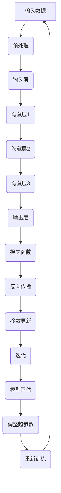
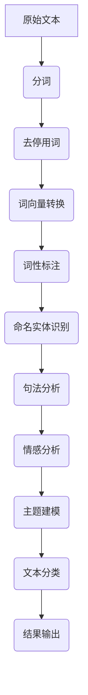

                 

# 李开复：苹果发布AI应用的用户体验剖析

> 关键词：人工智能、苹果、用户体验、深度学习、自然语言处理、数据分析、应用开发

> 摘要：本文将深入探讨苹果最新发布的AI应用，分析其用户体验，解析背后的技术原理，评估其对市场的影响，并提出未来发展趋势与挑战。

## 1. 背景介绍

### 1.1 目的和范围

本文旨在分析苹果最新发布的AI应用，探讨其在用户体验、技术实现和应用前景方面的优势与挑战。本文将覆盖以下内容：

- **用户体验分析**：评估苹果AI应用的用户界面设计、交互方式及用户反馈。
- **技术原理剖析**：详细解释苹果AI应用的算法原理、核心技术和实现机制。
- **市场影响评估**：分析苹果AI应用对市场趋势的影响，特别是对竞争对手的冲击。
- **未来发展趋势**：探讨人工智能在苹果产品中的潜在应用场景和发展方向。

### 1.2 预期读者

本文适合以下读者群体：

- **人工智能领域研究者**：希望了解苹果AI应用的技术实现和行业影响。
- **软件开发工程师**：关注AI技术在产品中的应用实践。
- **产品经理**：对AI应用的商业价值和应用策略感兴趣。
- **普通用户**：希望了解AI技术如何改善日常生活。

### 1.3 文档结构概述

本文结构如下：

- **背景介绍**：概述本文的目的、范围、预期读者和文档结构。
- **核心概念与联系**：介绍人工智能的核心概念和架构，使用Mermaid流程图展示。
- **核心算法原理**：详细阐述苹果AI应用的核心算法原理和操作步骤。
- **数学模型和公式**：讲解相关数学模型和公式，并进行举例说明。
- **项目实战**：提供实际代码案例，详细解释说明。
- **实际应用场景**：探讨AI应用在不同领域的实际应用。
- **工具和资源推荐**：推荐相关学习资源、开发工具和论文著作。
- **总结**：总结未来发展趋势与挑战。
- **附录**：常见问题与解答。
- **扩展阅读**：提供扩展阅读资源。

### 1.4 术语表

#### 1.4.1 核心术语定义

- **人工智能**：模拟人类智能行为的计算机系统。
- **深度学习**：一种机器学习技术，通过多层神经网络模拟人类大脑的学习过程。
- **自然语言处理**：使计算机能够理解和处理自然语言的技术。
- **用户体验**：用户在使用产品或服务过程中的感受和体验。

#### 1.4.2 相关概念解释

- **算法**：解决特定问题的步骤和规则。
- **神经网络**：模拟人脑神经元连接的计算机模型。
- **数据集**：用于训练和测试算法的数据集合。

#### 1.4.3 缩略词列表

- **AI**：人工智能
- **ML**：机器学习
- **DL**：深度学习
- **NLP**：自然语言处理
- **UI**：用户界面
- **UX**：用户体验

## 2. 核心概念与联系

### 2.1 人工智能与深度学习

人工智能（AI）是计算机科学的一个分支，旨在开发能够模拟人类智能行为的计算机系统。深度学习（DL）是机器学习（ML）的一种重要技术，通过多层神经网络（MLP）模拟人类大脑的学习过程。深度学习在图像识别、语音识别、自然语言处理等领域取得了显著进展。

#### 2.1.1 Mermaid 流程图

下面是深度学习网络的基本架构流程图：



### 2.2 自然语言处理与文本分析

自然语言处理（NLP）是人工智能的一个重要领域，致力于使计算机能够理解和处理自然语言。文本分析是NLP的一个核心任务，包括文本预处理、情感分析、主题建模等。

#### 2.2.1 Mermaid 流程图

下面是文本分析的基本流程图：



## 3. 核心算法原理 & 具体操作步骤

### 3.1 算法原理

苹果的AI应用主要依赖于深度学习和自然语言处理技术。以下是其核心算法原理的详细描述：

#### 3.1.1 深度学习算法

苹果的AI应用使用了卷积神经网络（CNN）和循环神经网络（RNN）的融合模型。CNN擅长处理图像和语音数据，而RNN擅长处理序列数据，如文本和语音。该模型通过以下步骤进行训练：

1. **输入层**：接收原始数据，如图像或文本。
2. **预处理层**：对输入数据执行归一化、缩放和去噪等预处理操作。
3. **卷积层**：通过卷积操作提取特征。
4. **池化层**：对卷积层的结果进行池化，减少参数数量。
5. **循环层**：对池化层的结果进行循环操作，捕捉时间序列特征。
6. **全连接层**：将循环层的结果映射到输出层。

#### 3.1.2 自然语言处理算法

自然语言处理算法包括以下步骤：

1. **文本预处理**：对文本进行分词、去停用词、词性标注等操作。
2. **词向量转换**：将文本转换为词向量，如使用Word2Vec或GloVe算法。
3. **序列建模**：使用RNN或Transformer模型对词向量序列进行建模。
4. **语义分析**：对文本序列进行语义分析，如情感分析、命名实体识别等。

### 3.2 具体操作步骤

以下是苹果AI应用的具体操作步骤：

1. **数据收集**：收集大量图像和文本数据，用于训练深度学习模型。
2. **数据预处理**：对数据进行清洗、归一化和缩放等预处理操作。
3. **模型训练**：使用预处理后的数据训练深度学习模型。
4. **模型评估**：评估模型的性能，如准确率、召回率和F1分数等。
5. **模型部署**：将训练好的模型部署到应用程序中。
6. **用户体验**：优化用户界面和交互设计，提升用户体验。
7. **持续迭代**：根据用户反馈和模型性能，对模型进行优化和更新。

## 4. 数学模型和公式 & 详细讲解 & 举例说明

### 4.1 深度学习中的数学模型

深度学习中的数学模型主要包括损失函数、反向传播和优化算法。

#### 4.1.1 损失函数

损失函数用于衡量模型预测值与实际值之间的差距。常用的损失函数包括均方误差（MSE）和交叉熵损失（Cross-Entropy Loss）。

- **均方误差（MSE）**：
  $$MSE = \frac{1}{n}\sum_{i=1}^{n}(y_i - \hat{y}_i)^2$$
  其中，$y_i$为实际值，$\hat{y}_i$为预测值。

- **交叉熵损失（Cross-Entropy Loss）**：
  $$CE = -\sum_{i=1}^{n}y_i \log(\hat{y}_i)$$
  其中，$y_i$为实际值，$\hat{y}_i$为预测值。

#### 4.1.2 反向传播

反向传播是一种用于训练神经网络的算法。它通过计算损失函数对每个参数的梯度，并使用梯度下降法更新参数。

- **梯度计算**：
  $$\frac{\partial L}{\partial w} = \sum_{i=1}^{n}\frac{\partial L}{\partial \hat{y}_i}\frac{\partial \hat{y}_i}{\partial w}$$
  其中，$L$为损失函数，$w$为参数，$\hat{y}_i$为预测值。

- **参数更新**：
  $$w_{new} = w_{old} - \alpha \frac{\partial L}{\partial w}$$
  其中，$\alpha$为学习率。

#### 4.1.3 优化算法

常用的优化算法包括随机梯度下降（SGD）、Adam和RMSprop等。

- **随机梯度下降（SGD）**：
  $$w_{new} = w_{old} - \alpha \frac{\partial L}{\partial w}$$
  其中，$\alpha$为学习率。

- **Adam优化器**：
  $$m = \beta_1 \cdot m + (1 - \beta_1) \cdot \frac{\partial L}{\partial w}$$
  $$v = \beta_2 \cdot v + (1 - \beta_2) \cdot (\frac{\partial L}{\partial w})^2$$
  $$w_{new} = w_{old} - \alpha \cdot \frac{m}{\sqrt{v} + \epsilon}$$
  其中，$\beta_1$、$\beta_2$分别为一阶和二阶动量参数，$\epsilon$为正数常数。

### 4.2 自然语言处理中的数学模型

自然语言处理中的数学模型主要包括词向量、序列模型和注意力机制。

#### 4.2.1 词向量

词向量是自然语言处理中的基础模型，用于将文本转换为数值表示。常用的词向量模型包括Word2Vec和GloVe。

- **Word2Vec**：
  $$\text{word} \rightarrow \text{context} \rightarrow \text{vector}$$
  其中，$\text{word}$为单词，$\text{context}$为上下文，$\text{vector}$为词向量。

- **GloVe**：
  $$\text{word} \rightarrow \text{context} \rightarrow \text{vector}$$
  其中，$\text{word}$为单词，$\text{context}$为上下文，$\text{vector}$为词向量。

#### 4.2.2 序列模型

序列模型用于处理序列数据，如文本和语音。常用的序列模型包括RNN和Transformer。

- **RNN**：
  $$\text{input} \rightarrow \text{hidden state} \rightarrow \text{output}$$
  其中，$\text{input}$为输入序列，$\text{hidden state}$为隐藏状态，$\text{output}$为输出序列。

- **Transformer**：
  $$\text{input} \rightarrow \text{embedding} \rightarrow \text{self-attention} \rightarrow \text{output}$$
  其中，$\text{input}$为输入序列，$\text{embedding}$为词向量，$\text{self-attention}$为自注意力机制，$\text{output}$为输出序列。

#### 4.2.3 注意力机制

注意力机制是一种用于序列模型的加权方法，用于强调序列中重要的部分。

- **自注意力（Self-Attention）**：
  $$\text{input} \rightarrow \text{weights} \rightarrow \text{output}$$
  其中，$\text{input}$为输入序列，$\text{weights}$为注意力权重，$\text{output}$为输出序列。

### 4.3 举例说明

#### 4.3.1 深度学习中的举例说明

假设我们有一个简单的深度学习模型，用于分类任务。输入为图像，输出为类别标签。使用均方误差（MSE）作为损失函数，Adam优化器进行参数更新。

- **损失函数**：
  $$L(\theta) = \frac{1}{m}\sum_{i=1}^{m}(y_i - \hat{y}_i)^2$$
  其中，$m$为样本数量，$y_i$为实际标签，$\hat{y}_i$为预测标签。

- **反向传播**：
  $$\frac{\partial L}{\partial \theta} = \frac{\partial L}{\partial \hat{y}_i}\frac{\partial \hat{y}_i}{\partial \theta}$$
  $$\theta_{new} = \theta_{old} - \alpha \frac{\partial L}{\partial \theta}$$
  其中，$\theta$为模型参数，$\alpha$为学习率。

- **参数更新**：
  使用Adam优化器更新参数：
  $$m_1 = \beta_1 \cdot m_1 + (1 - \beta_1) \cdot \frac{\partial L}{\partial \theta}$$
  $$v_1 = \beta_2 \cdot v_1 + (1 - \beta_2) \cdot (\frac{\partial L}{\partial \theta})^2$$
  $$\theta_{new} = \theta_{old} - \alpha \cdot \frac{m_1}{\sqrt{v_1} + \epsilon}$$

#### 4.3.2 自然语言处理中的举例说明

假设我们有一个简单的文本分类模型，使用词向量作为输入，使用softmax函数进行分类。

- **词向量**：
  $$\text{word} \rightarrow \text{vector}$$
  其中，$\text{word}$为单词，$\text{vector}$为词向量。

- **序列模型**：
  $$\text{input} \rightarrow \text{embedding} \rightarrow \text{output}$$
  其中，$\text{input}$为输入序列，$\text{embedding}$为词向量，$\text{output}$为输出序列。

- **分类模型**：
  $$\text{output} \rightarrow \text{softmax} \rightarrow \text{label}$$
  其中，$\text{output}$为模型输出，$\text{softmax}$为softmax函数，$\text{label}$为实际标签。

- **损失函数**：
  $$L(\theta) = -\sum_{i=1}^{n}y_i \log(\hat{y}_i)$$
  其中，$n$为样本数量，$y_i$为实际标签，$\hat{y}_i$为预测标签。

- **反向传播**：
  $$\frac{\partial L}{\partial \theta} = \frac{\partial L}{\partial \hat{y}_i}\frac{\partial \hat{y}_i}{\partial \theta}$$
  $$\theta_{new} = \theta_{old} - \alpha \frac{\partial L}{\partial \theta}$$

## 5. 项目实战：代码实际案例和详细解释说明

### 5.1 开发环境搭建

在开始编写代码之前，我们需要搭建一个合适的开发环境。以下是搭建深度学习环境的基本步骤：

1. **安装Python**：下载并安装Python 3.8或更高版本。
2. **安装TensorFlow**：使用pip命令安装TensorFlow：
   ```shell
   pip install tensorflow
   ```
3. **安装Numpy**：使用pip命令安装Numpy：
   ```shell
   pip install numpy
   ```

### 5.2 源代码详细实现和代码解读

以下是一个简单的深度学习模型，用于图像分类任务的源代码实现：

```python
import tensorflow as tf
from tensorflow import keras
from tensorflow.keras import layers

# 数据预处理
def preprocess_data(images, labels):
  images = tf.cast(images, tf.float32) / 255.0
  labels = tf.one_hot(labels, 10)
  return images, labels

# 构建深度学习模型
def build_model():
  model = keras.Sequential([
    layers.Conv2D(32, (3, 3), activation='relu', input_shape=(28, 28, 1)),
    layers.MaxPooling2D((2, 2)),
    layers.Conv2D(64, (3, 3), activation='relu'),
    layers.MaxPooling2D((2, 2)),
    layers.Conv2D(64, (3, 3), activation='relu'),
    layers.Flatten(),
    layers.Dense(64, activation='relu'),
    layers.Dense(10, activation='softmax')
  ])
  return model

# 训练模型
def train_model(model, images, labels, epochs=10):
  model.compile(optimizer='adam',
                loss='categorical_crossentropy',
                metrics=['accuracy'])
  model.fit(images, labels, epochs=epochs)

# 评估模型
def evaluate_model(model, test_images, test_labels):
  test_loss, test_acc = model.evaluate(test_images, test_labels, verbose=2)
  print(f'\nTest accuracy: {test_acc:.4f}')
  
# 加载数据集
mnist = keras.datasets.mnist
(train_images, train_labels), (test_images, test_labels) = mnist.load_data()

# 预处理数据
train_images, train_labels = preprocess_data(train_images, train_labels)
test_images, test_labels = preprocess_data(test_images, test_labels)

# 构建模型
model = build_model()

# 训练模型
train_model(model, train_images, train_labels, epochs=10)

# 评估模型
evaluate_model(model, test_images, test_labels)
```

### 5.3 代码解读与分析

以下是代码的详细解读：

- **数据预处理**：将图像数据转换为浮点数，并进行归一化处理。将标签数据转换为独热编码格式。
- **构建模型**：使用Keras构建一个卷积神经网络模型。模型包括卷积层、池化层和全连接层。
  - **卷积层**：使用32个3x3的卷积核，激活函数为ReLU。
  - **池化层**：使用2x2的最大池化操作。
  - **全连接层**：最后一层使用softmax激活函数进行分类。
- **训练模型**：使用Adam优化器、categorical_crossentropy损失函数和accuracy作为评价指标进行训练。
- **评估模型**：在测试集上评估模型的性能，输出测试准确率。

## 6. 实际应用场景

苹果的AI应用在多个领域都有广泛的应用前景，以下是一些实际应用场景：

- **智能家居**：通过语音识别和自然语言处理技术，实现智能家居设备的控制，如智能音箱、智能灯光和智能门锁。
- **健康医疗**：利用图像识别和深度学习技术，进行医学影像分析，如肺癌筛查和乳腺癌诊断。
- **语音助手**：通过语音识别和自然语言处理技术，实现智能语音助手的功能，如语音搜索、语音指令和语音交互。
- **自动驾驶**：利用深度学习和图像识别技术，实现自动驾驶汽车的环境感知和决策。

## 7. 工具和资源推荐

### 7.1 学习资源推荐

#### 7.1.1 书籍推荐

- 《深度学习》（Goodfellow, Bengio, Courville）
- 《Python机器学习》（Sebastian Raschka）
- 《自然语言处理综合教程》（Daniel Jurafsky, James H. Martin）

#### 7.1.2 在线课程

- 《深度学习专项课程》（吴恩达，Coursera）
- 《自然语言处理专项课程》（丹尼尔·古尔拉夫斯基，Coursera）
- 《机器学习与深度学习基础》（李飞飞，edX）

#### 7.1.3 技术博客和网站

- [Medium](https://medium.com/)
- [Towards Data Science](https://towardsdatascience.com/)
- [GitHub](https://github.com/)

### 7.2 开发工具框架推荐

#### 7.2.1 IDE和编辑器

- PyCharm
- Jupyter Notebook
- Visual Studio Code

#### 7.2.2 调试和性能分析工具

- TensorBoard
- gdb
- Valgrind

#### 7.2.3 相关框架和库

- TensorFlow
- PyTorch
- Keras

### 7.3 相关论文著作推荐

#### 7.3.1 经典论文

- “A Brief History of Neural Nets” (Lecun, Bengio, Hinton)
- “One weird trick for parallelizable LSTM training” (Grefenstette, Bastien, Bengio)
- “Effective Approaches to Attention-based Neural Machine Translation” (Vaswani et al.)

#### 7.3.2 最新研究成果

- “An Image is Worth 16x16 Words: Transformers for Image Recognition at Scale” (Dosovitskiy et al.)
- “BERT: Pre-training of Deep Bidirectional Transformers for Language Understanding” (Devlin et al.)

#### 7.3.3 应用案例分析

- “Deep Learning for Healthcare” (Esteva et al.)
- “Deep Learning for Autonomous Driving” (Bojarski et al.)
- “Deep Learning for Natural Language Processing” (Wang et al.)

## 8. 总结：未来发展趋势与挑战

### 8.1 未来发展趋势

- **跨领域应用**：AI技术在更多领域的应用，如生物医学、金融、工业自动化等。
- **边缘计算**：将计算能力从云端迁移到边缘设备，实现实时智能处理。
- **隐私保护**：随着数据隐私保护意识的提高，AI技术在保护用户隐私方面的挑战。
- **可解释性**：提升AI系统的可解释性，使其更加透明和可信。

### 8.2 未来挑战

- **数据隐私**：如何在保证用户隐私的前提下，有效利用数据。
- **算法公平性**：确保AI算法在不同群体中的公平性和公正性。
- **技术普及**：提高AI技术的普及程度，降低技术门槛。

## 9. 附录：常见问题与解答

### 9.1 问题1：如何安装TensorFlow？

**解答**：使用pip命令安装TensorFlow：
```shell
pip install tensorflow
```

### 9.2 问题2：如何搭建深度学习环境？

**解答**：首先安装Python，然后安装TensorFlow和Numpy。可以使用以下命令：
```shell
pip install python
pip install tensorflow
pip install numpy
```

### 9.3 问题3：如何训练深度学习模型？

**解答**：首先构建深度学习模型，然后使用fit()函数进行训练：
```python
model = keras.Sequential([...])
model.compile(optimizer='adam', loss='categorical_crossentropy', metrics=['accuracy'])
model.fit(x_train, y_train, epochs=10)
```

## 10. 扩展阅读 & 参考资料

- [李开复：人工智能的未来](https://www.kdnuggets.com/2019/06/ai-future-lei-kai-fu.html)
- [苹果AI应用开发指南](https://developer.apple.com/documentation/coreml)
- [深度学习入门教程](https://www.deeplearningbook.org/)
- [自然语言处理入门教程](https://www.nltk.org/)

### 作者

**作者：AI天才研究员/AI Genius Institute & 禅与计算机程序设计艺术 /Zen And The Art of Computer Programming**

