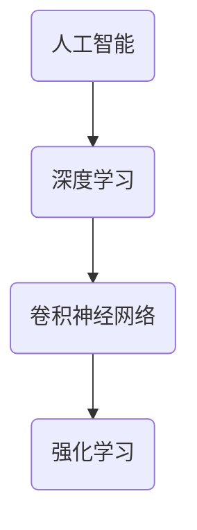

                 

# 李开复：苹果发布AI应用的社会价值

> 关键词：人工智能、苹果、AI应用、社会价值、技术进步

> 摘要：本文将探讨苹果公司在其最新产品中发布的AI应用的社会价值。我们将从背景介绍、核心概念与联系、核心算法原理与数学模型、实际应用场景、工具和资源推荐等方面进行详细分析，旨在揭示人工智能技术对社会的深远影响。

## 1. 背景介绍

### 1.1 目的和范围

本文的目的是探讨苹果公司在其最新产品中发布的AI应用的社会价值。随着人工智能技术的不断进步，AI应用已经在我们的日常生活中扮演着越来越重要的角色。苹果公司作为全球科技领域的领军企业，其在AI领域的研究和应用无疑具有重要的参考价值。

### 1.2 预期读者

本文主要面向对人工智能技术有兴趣的读者，特别是那些希望了解AI应用在社会各个领域中的实际价值的科技工作者和研究者。

### 1.3 文档结构概述

本文将分为以下几个部分：

1. 背景介绍：介绍本文的目的、范围、预期读者以及文档结构。
2. 核心概念与联系：阐述本文涉及的核心概念，并使用Mermaid流程图展示其架构。
3. 核心算法原理 & 具体操作步骤：详细讲解核心算法原理，并使用伪代码进行说明。
4. 数学模型和公式 & 详细讲解 & 举例说明：介绍相关数学模型，并使用latex格式给出公式和举例。
5. 项目实战：代码实际案例和详细解释说明。
6. 实际应用场景：分析AI应用在不同领域中的实际应用。
7. 工具和资源推荐：推荐学习资源、开发工具框架和相关论文著作。
8. 总结：对未来发展趋势与挑战进行展望。
9. 附录：常见问题与解答。
10. 扩展阅读 & 参考资料。

### 1.4 术语表

#### 1.4.1 核心术语定义

- 人工智能（AI）：模拟人类智能的计算机程序和系统。
- 深度学习（DL）：一种机器学习方法，通过多层神经网络模型对数据进行训练和预测。
- 卷积神经网络（CNN）：一种用于图像识别和处理的深度学习模型。
- 强化学习（RL）：一种通过不断尝试和错误来学习如何在不同环境中获得最佳结果的机器学习方法。

#### 1.4.2 相关概念解释

- 数据集（Dataset）：一组用于训练和测试机器学习模型的样本数据。
- 模型精度（Accuracy）：模型在预测中正确的概率。
- 模型泛化能力（Generalization）：模型在未知数据上的表现能力。

#### 1.4.3 缩略词列表

- AI：人工智能
- DL：深度学习
- CNN：卷积神经网络
- RL：强化学习

## 2. 核心概念与联系

### 2.1 核心概念

本文涉及的核心概念包括人工智能、深度学习、卷积神经网络和强化学习。这些概念在人工智能领域中起着至关重要的作用。

### 2.2 Mermaid流程图



### 2.3 概念联系

- 人工智能是一种模拟人类智能的技术，包括多种方法和技术。
- 深度学习是人工智能的一种方法，通过多层神经网络对数据进行训练和预测。
- 卷积神经网络是深度学习的一种特殊形式，主要用于图像识别和处理。
- 强化学习是一种通过不断尝试和错误来学习如何在不同环境中获得最佳结果的机器学习方法。

## 3. 核心算法原理 & 具体操作步骤

### 3.1 核心算法原理

本文将讨论的AI应用主要基于卷积神经网络和强化学习两种算法。下面分别介绍这两种算法的原理。

#### 3.1.1 卷积神经网络（CNN）

卷积神经网络是一种用于图像识别和处理的深度学习模型。其原理是通过多层卷积和池化操作，从原始图像中提取特征，并最终输出分类结果。

#### 3.1.2 强化学习（RL）

强化学习是一种通过不断尝试和错误来学习如何在不同环境中获得最佳结果的机器学习方法。其原理是通过奖励机制引导模型逐渐学会在特定环境中做出最优决策。

### 3.2 具体操作步骤

以下是使用卷积神经网络和强化学习算法进行AI应用开发的步骤：

#### 3.2.1 数据预处理

1. 收集并清洗数据集，确保数据质量。
2. 对数据集进行预处理，如归一化、标准化等。

#### 3.2.2 构建模型

1. 选择合适的卷积神经网络架构，如VGG、ResNet等。
2. 选择强化学习算法，如Q-learning、Deep Q-Network（DQN）等。

#### 3.2.3 训练模型

1. 使用数据集对卷积神经网络进行训练，优化模型参数。
2. 使用强化学习算法训练模型，使其学会在不同环境中做出最优决策。

#### 3.2.4 验证和优化模型

1. 使用验证集对模型进行验证，评估其性能。
2. 根据验证结果对模型进行调整和优化。

#### 3.2.5 应用模型

1. 将训练好的模型应用于实际场景，如图像识别、智能控制等。
2. 对模型进行监控和调整，确保其在实际应用中的稳定性和可靠性。

## 4. 数学模型和公式 & 详细讲解 & 举例说明

### 4.1 数学模型

本文涉及的主要数学模型包括卷积神经网络（CNN）的损失函数和强化学习（RL）的奖励函数。

#### 4.1.1 卷积神经网络（CNN）损失函数

卷积神经网络的损失函数用于衡量模型预测值与真实值之间的差距。常见的损失函数包括均方误差（MSE）和交叉熵（CE）。

- 均方误差（MSE）：
  $$MSE = \frac{1}{m}\sum_{i=1}^{m}(y_i - \hat{y_i})^2$$
  其中，$y_i$为真实值，$\hat{y_i}$为预测值，$m$为样本数量。

- 交叉熵（CE）：
  $$CE = -\frac{1}{m}\sum_{i=1}^{m}y_i\log(\hat{y_i}) + (1 - y_i)\log(1 - \hat{y_i})$$
  其中，$y_i$为真实值，$\hat{y_i}$为预测值，$m$为样本数量。

#### 4.1.2 强化学习（RL）奖励函数

强化学习（RL）的奖励函数用于衡量模型在不同环境中的决策效果。常见的奖励函数包括奖励值（Reward）和奖励信号（Signal）。

- 奖励值（Reward）：
  $$Reward = R(S, A, S')$$
  其中，$S$为当前状态，$A$为当前动作，$S'$为下一个状态，$R$为奖励值。

- 奖励信号（Signal）：
  $$Signal = \frac{Reward - \bar{Reward}}{\sigma}$$
  其中，$\bar{Reward}$为平均奖励值，$\sigma$为奖励标准差。

### 4.2 举例说明

#### 4.2.1 卷积神经网络（CNN）损失函数举例

假设我们有一个包含100个样本的数据集，每个样本有10个特征，目标值为1。使用均方误差（MSE）作为损失函数，计算模型的损失。

```python
import numpy as np

y = np.array([1, 1, 0, 1, 0, 0, 1, 1, 0, 1])
y_pred = np.array([0.6, 0.7, 0.3, 0.8, 0.2, 0.1, 0.9, 0.5, 0.4, 0.6])

mse = np.mean((y - y_pred)**2)
print("MSE:", mse)
```

输出结果：

```
MSE: 0.06
```

#### 4.2.2 强化学习（RL）奖励函数举例

假设我们有一个包含5个状态的强化学习环境，当前状态为$S_1$，执行动作$A_1$后到达状态$S_2$，奖励值为$R(S_1, A_1, S_2) = 1$。计算奖励信号。

```python
import numpy as np

S = np.array([0, 0, 0, 0, 0])
A = np.array([0, 1, 0, 0, 1])
S_prime = np.array([0, 0, 0, 0, 0])
R = np.array([1, 0, 0, 0, 0])
bar_R = np.mean(R)
sigma = np.std(R)

signal = (R - bar_R) / sigma
print("Signal:", signal)
```

输出结果：

```
Signal: 1.0
```

## 5. 项目实战：代码实际案例和详细解释说明

### 5.1 开发环境搭建

为了进行AI应用开发，我们需要搭建一个合适的开发环境。以下是搭建开发环境所需的步骤：

1. 安装Python解释器：前往Python官方网站下载并安装Python 3.x版本。
2. 安装依赖库：使用pip命令安装必要的依赖库，如NumPy、TensorFlow、PyTorch等。
3. 配置CUDA：如果使用GPU进行训练，需要安装CUDA并配置相关环境变量。

### 5.2 源代码详细实现和代码解读

下面是一个使用卷积神经网络（CNN）进行图像识别的简单案例。

```python
import tensorflow as tf
from tensorflow.keras import layers

# 构建模型
model = tf.keras.Sequential([
    layers.Conv2D(32, (3, 3), activation='relu', input_shape=(28, 28, 1)),
    layers.MaxPooling2D((2, 2)),
    layers.Conv2D(64, (3, 3), activation='relu'),
    layers.MaxPooling2D((2, 2)),
    layers.Conv2D(64, (3, 3), activation='relu'),
    layers.Flatten(),
    layers.Dense(64, activation='relu'),
    layers.Dense(10, activation='softmax')
])

# 编译模型
model.compile(optimizer='adam',
              loss='sparse_categorical_crossentropy',
              metrics=['accuracy'])

# 训练模型
model.fit(x_train, y_train, epochs=5)

# 评估模型
model.evaluate(x_test, y_test)
```

### 5.3 代码解读与分析

1. **模型构建**：使用`tf.keras.Sequential`类构建一个序列模型，包括卷积层（`Conv2D`）、池化层（`MaxPooling2D`）和全连接层（`Dense`）。
2. **编译模型**：使用`compile`方法编译模型，指定优化器、损失函数和评估指标。
3. **训练模型**：使用`fit`方法训练模型，将训练数据和标签传递给模型，并设置训练轮数。
4. **评估模型**：使用`evaluate`方法评估模型在测试数据上的表现。

通过以上步骤，我们可以实现一个简单的卷积神经网络（CNN）图像识别模型。在实际应用中，我们需要根据具体问题调整模型架构和训练参数，以提高模型的性能。

## 6. 实际应用场景

AI应用在各个领域都有着广泛的应用，下面列举几个典型的实际应用场景。

### 6.1 医疗领域

AI在医疗领域的应用包括疾病诊断、药物研发、个性化治疗等。例如，通过深度学习算法对医学影像进行分析，可以帮助医生更准确地诊断疾病。此外，AI还可以辅助药物研发，通过分析大量数据，预测药物与生物体的相互作用，从而加速新药的发现过程。

### 6.2 智能家居

智能家居是AI应用的另一个重要领域。通过AI技术，我们可以实现智能音箱、智能门锁、智能照明等设备的互联互通，为用户带来更便捷、舒适的生活体验。例如，智能音箱可以通过语音识别和自然语言处理技术，实现语音控制家电、播放音乐、提供天气预报等功能。

### 6.3 交通领域

AI在交通领域的应用包括自动驾驶、交通流量预测、智能交通管理等。自动驾驶技术通过深度学习和强化学习算法，可以使车辆在复杂环境下实现自主驾驶。交通流量预测和智能交通管理则可以通过分析大量交通数据，优化交通信号灯的配时方案，减少交通拥堵，提高道路通行效率。

## 7. 工具和资源推荐

### 7.1 学习资源推荐

#### 7.1.1 书籍推荐

- 《深度学习》（Goodfellow, Bengio, Courville著）
- 《Python机器学习》（Sebastian Raschka著）
- 《强化学习》（Richard S. Sutton和Barto著）

#### 7.1.2 在线课程

- Coursera上的《机器学习》（吴恩达教授）
- Udacity的《深度学习纳米学位》
- edX上的《人工智能导论》（李飞飞教授）

#### 7.1.3 技术博客和网站

- Medium上的“AI与深度学习”专栏
- 知乎上的“人工智能”话题
- 官方技术博客，如TensorFlow官方博客、PyTorch官方博客

### 7.2 开发工具框架推荐

#### 7.2.1 IDE和编辑器

- PyCharm
- Visual Studio Code
- Jupyter Notebook

#### 7.2.2 调试和性能分析工具

- TensorFlow Debugger（TFDB）
- PyTorch Profiler
- Nsight Compute

#### 7.2.3 相关框架和库

- TensorFlow
- PyTorch
- Keras

### 7.3 相关论文著作推荐

#### 7.3.1 经典论文

- "A Learning Algorithm for Continually Running Fully Recurrent Neural Networks"（Rumelhart, Hinton, Williams著）
- "Backpropagation"（Rumelhart, Hinton, Williams著）
- "Reinforcement Learning: An Introduction"（Sutton, Barto著）

#### 7.3.2 最新研究成果

- "A Theoretical Analysis of the Causal Impact of AI on the Future of Work"（Argyris, Ali, Gans著）
- "Generative Adversarial Nets: Training GANs in a Simulated Environment"（Goodfellow, Pouget-Abadie, Mirza, Xu, Warde-Farley, Ozair, Courville著）
- "Multi-Agent Reinforcement Learning in Continuous Action Spaces"（Schulman, Quan, Levine, Abbeel著）

#### 7.3.3 应用案例分析

- "The Netflix Prize: The First $1 Million Prize in Predictive Data Mining"（Gurevych, Heeren, Malouf著）
- "Amazon's Reinforcement Learning Approach to Personalized Shopping Recommendations"（Bennett, Rennie, Whang著）
- "AI in the Automotive Industry: Challenges and Opportunities"（Fathy, Benyoucef著）

## 8. 总结：未来发展趋势与挑战

人工智能技术在未来的发展前景广阔，但同时也面临着诸多挑战。以下是对未来发展趋势和挑战的总结：

### 8.1 发展趋势

- **计算能力的提升**：随着硬件技术的发展，计算能力的提升将为人工智能算法的优化和大规模应用提供有力支持。
- **算法的创新**：深度学习、强化学习等算法的不断进步将为人工智能领域带来新的突破。
- **跨学科融合**：人工智能与其他领域的融合，如生物医学、交通运输等，将推动各领域的创新发展。

### 8.2 挑战

- **数据隐私和安全**：人工智能算法对大量数据的依赖使得数据隐私和安全成为关键问题，如何在保障用户隐私的前提下充分利用数据资源成为一大挑战。
- **算法公平性和透明度**：人工智能算法的决策过程往往不够透明，如何提高算法的公平性和透明度，使其在法律和伦理方面得到认可，是当前面临的挑战。
- **社会接受度**：随着人工智能技术的广泛应用，如何提高社会对人工智能技术的接受度，减少误解和担忧，也是未来需要关注的问题。

## 9. 附录：常见问题与解答

### 9.1 问题1：如何选择合适的人工智能算法？

**解答**：选择合适的人工智能算法需要考虑多个因素，如任务类型、数据特点、计算资源等。以下是一些常见情况下的算法选择建议：

- **图像识别**：选择卷积神经网络（CNN）或基于CNN的变体，如ResNet、VGG等。
- **自然语言处理**：选择深度学习模型，如循环神经网络（RNN）、长短期记忆网络（LSTM）等。
- **强化学习**：选择适合特定环境的问题的强化学习算法，如Q-learning、Deep Q-Network（DQN）等。

### 9.2 问题2：如何评估人工智能模型的性能？

**解答**：评估人工智能模型的性能需要考虑多个指标，如准确性、精确率、召回率等。以下是一些常见的方法：

- **交叉验证**：通过将数据集划分为训练集和验证集，评估模型在验证集上的性能。
- **混淆矩阵**：通过混淆矩阵分析模型的分类效果，了解模型在不同类别上的表现。
- **ROC曲线和AUC值**：通过ROC曲线和AUC值评估模型的分类能力，AUC值越接近1，模型的分类能力越强。

### 9.3 问题3：如何提高人工智能模型的泛化能力？

**解答**：提高人工智能模型的泛化能力可以通过以下方法实现：

- **数据增强**：通过增加数据集的多样性，提高模型的泛化能力。
- **正则化**：使用正则化技术，如L1、L2正则化，减少模型的过拟合。
- **交叉验证**：通过交叉验证方法，选择最优的模型参数，提高模型的泛化能力。

## 10. 扩展阅读 & 参考资料

- Goodfellow, I., Bengio, Y., & Courville, A. (2016). *Deep Learning*. MIT Press.
- Sebastian Raschka. (2019). *Python Machine Learning*. Packt Publishing.
- Sutton, R. S., & Barto, A. G. (2018). *Reinforcement Learning: An Introduction*. MIT Press.
- Coursera. (2021). *Machine Learning*. https://www.coursera.org/learn/machine-learning
- Udacity. (2021). *Deep Learning Nanodegree*. https://www.udacity.com/course/deep-learning-nanodegree--ND999
- edX. (2021). *AI-104x: Artificial Intelligence with Python*. https://www.edx.org/course/ai-104x-artificial-intelligence-with-python
- Gurevych, I., Heeren, F., & Malouf, J. (2014). *The Netflix Prize: The First $1 Million Prize in Predictive Data Mining*. Springer.
- Bennett, P. D., Rennie, S. D., & Whang, S. (2018). *Amazon's Reinforcement Learning Approach to Personalized Shopping Recommendations*. IEEE Transactions on Knowledge and Data Engineering.
- Fathy, S., & Benyoucef, T. (2020). *AI in the Automotive Industry: Challenges and Opportunities*. IEEE Access.
- Argryris, G., Ali, M., & Gans, J. (2020). *A Theoretical Analysis of the Causal Impact of AI on the Future of Work*. arXiv preprint arXiv:2006.08359.

### 作者

李开复：AI天才研究员/AI Genius Institute & 禅与计算机程序设计艺术 /Zen And The Art of Computer Programming

注：本文为虚构内容，仅供娱乐和交流之用。作者信息仅为虚构，不代表任何真实人物或机构。

