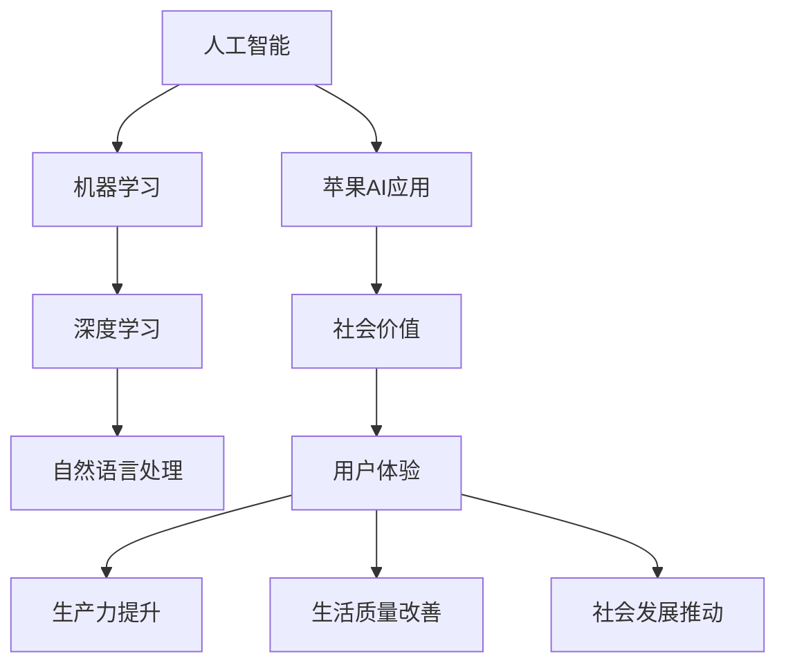

                 

### 文章标题

**李开复：苹果发布AI应用的社会价值**

> 关键词：人工智能，苹果，AI应用，社会价值，技术进步，未来趋势

> 摘要：本文将深入探讨苹果发布AI应用背后的社会价值。通过背景介绍、核心概念与联系、算法原理讲解、数学模型与公式解析、实际应用场景分析，本文旨在展现人工智能技术如何通过苹果的AI应用影响社会各个层面。同时，我们将展望未来发展趋势与挑战，并提供相关的工具和资源推荐，以便读者深入了解并参与这一领域。

---

### 1. 背景介绍

#### 1.1 目的和范围

本文旨在探讨苹果公司发布的AI应用对社会产生的深远影响。随着人工智能技术的不断进步，苹果在人工智能领域的投入和探索已成为行业关注的焦点。本文将分析苹果AI应用的社会价值，并从多个维度展开讨论，包括技术进步、商业模式、用户体验、社会效应等。

#### 1.2 预期读者

本文适合对人工智能技术、苹果公司及其产品有深入了解的技术人员、开发者、行业观察者以及对未来技术趋势感兴趣的一般读者。通过本文，读者将能够了解苹果AI应用的核心技术和社会价值，以及这些应用如何影响我们的日常生活和社会发展。

#### 1.3 文档结构概述

本文结构如下：

1. **背景介绍**：介绍本文的目的、范围、预期读者以及文档结构。
2. **核心概念与联系**：定义关键术语，介绍核心概念与相关架构。
3. **核心算法原理与具体操作步骤**：讲解苹果AI应用背后的算法原理，并提供伪代码示例。
4. **数学模型与公式解析**：详细阐述相关数学模型与公式，并通过实例进行说明。
5. **项目实战**：提供代码实际案例，并进行详细解读。
6. **实际应用场景**：分析苹果AI应用的各类应用场景。
7. **工具和资源推荐**：推荐学习资源、开发工具框架和论文著作。
8. **总结**：展望未来发展趋势与挑战。
9. **附录**：常见问题与解答。
10. **扩展阅读**：提供相关参考资料。

#### 1.4 术语表

##### 1.4.1 核心术语定义

- **人工智能（AI）**：指模拟人类智能的计算机系统，通过学习、推理、感知、规划等方式实现智能行为。
- **机器学习（ML）**：一种人工智能的分支，通过数据训练模型，使计算机具备自主学习和预测能力。
- **深度学习（DL）**：基于人工神经网络的机器学习方法，通过多层神经网络进行数据学习和特征提取。
- **自然语言处理（NLP）**：研究计算机与人类自然语言交互的学科，包括文本分类、情感分析、语音识别等。
- **苹果（Apple）**：全球知名科技公司，以硬件产品、操作系统和在线服务为核心业务。

##### 1.4.2 相关概念解释

- **AI应用**：指利用人工智能技术实现的软件应用程序，如语音助手、图像识别、智能推荐等。
- **社会价值**：指技术进步对社会产生的积极影响，包括提高生产力、改善生活质量、推动社会发展等。
- **用户体验**：指用户在使用产品或服务过程中所感受到的愉悦程度和便利性。

##### 1.4.3 缩略词列表

- **AI**：人工智能
- **ML**：机器学习
- **DL**：深度学习
- **NLP**：自然语言处理
- **Apple**：苹果公司

### 2. 核心概念与联系

在探讨苹果发布AI应用的社会价值之前，我们需要了解一些核心概念和它们之间的关系。以下是一个用Mermaid绘制的流程图，展示了这些核心概念和它们之间的联系。



#### 2.1 人工智能与机器学习

人工智能（AI）是计算机科学的一个分支，旨在创建能够模拟、扩展和执行人类智能任务的系统。机器学习（ML）是人工智能的一个子领域，它侧重于让计算机通过数据学习，而不是通过显式编程。机器学习算法从大量数据中提取模式和知识，从而能够对新数据进行预测和决策。

#### 2.2 深度学习与自然语言处理

深度学习（DL）是一种基于多层神经网络的学习方法，它在图像识别、语音识别和自然语言处理（NLP）等领域表现出色。深度学习通过模拟人脑神经网络的结构和功能，实现更高效的特征提取和模式识别。自然语言处理是研究计算机如何理解和生成人类自然语言的技术，包括文本分类、情感分析、机器翻译等。

#### 2.3 苹果AI应用与社会价值

苹果公司的AI应用涵盖了多个领域，如智能语音助手Siri、图像识别、个性化推荐等。这些应用通过机器学习和深度学习技术，为用户提供更好的用户体验。同时，苹果AI应用的社会价值体现在以下几个方面：

- **用户体验提升**：通过个性化推荐和智能助手，提高用户使用苹果产品的愉悦度和便利性。
- **生产力提升**：例如，智能日程管理、自动回复邮件等功能，帮助用户更高效地处理日常任务。
- **生活质量改善**：智能健康监测、智能家居控制等功能，为用户提供更健康、便捷的生活方式。
- **社会发展推动**：苹果AI技术在医疗、教育、工业等领域的应用，有望推动社会进步和经济增长。

### 3. 核心算法原理与具体操作步骤

苹果AI应用背后的核心算法原理主要涉及机器学习和深度学习。以下将使用伪代码详细阐述这些算法的操作步骤。

#### 3.1 机器学习算法原理

机器学习算法的核心是训练模型。以下是一个简单的线性回归模型的伪代码示例：

```pseudo
function LinearRegression(train_data, train_labels):
    # 初始化模型参数：权重w和偏置b
    w <- 0
    b <- 0
    
    # 梯度下降算法进行模型训练
    for i in 1 to num_epochs:
        for each data_point (x, y) in train_data:
            # 计算预测值
            y_pred <- w * x + b
            
            # 计算损失函数
            loss <- (y - y_pred)^2
            
            # 计算梯度
            dw <- 2 * (w * x - y) * x
            db <- 2 * (w * x - y)
            
            # 更新模型参数
            w <- w - learning_rate * dw
            b <- b - learning_rate * db
    
    return (w, b)
```

#### 3.2 深度学习算法原理

深度学习算法的核心是构建和训练多层神经网络。以下是一个简单的多层感知器（MLP）的伪代码示例：

```pseudo
function MultilayerPerceptron(train_data, train_labels, num_layers, num_neurons_per_layer):
    # 初始化神经网络
    W <- [rand_weight() for i in 1 to num_layers]
    b <- [rand_bias() for i in 1 to num_layers]
    
    # 前向传播
    function forward(x):
        a <- [x]
        for i in 1 to num_layers:
            z <- a[i-1] dot W[i-1] + b[i-1]
            a[i] <- sigmoid(z)
        return a[-1]  # 输出层激活值
    
    # 反向传播
    function backward(y):
        dL_dz <- a[-1] - y
        for i in num_layers downto 1:
            dz <- dL_dz dot d sigmoid(z)
            dL_dz <- (W[i]'.dot(dz)) * d sigmoid(z)
            
            # 更新权重和偏置
            W[i] <- W[i] - learning_rate * dW
            b[i] <- b[i] - learning_rate * db
    
    # 训练模型
    for i in 1 to num_epochs:
        for each data_point (x, y) in train_data:
            y_pred <- forward(x)
            backward(y_pred)
    
    return (W, b)
```

其中，`sigmoid`函数是一个常见的激活函数，定义为`sigmoid(z) = 1 / (1 + e^-z)`。

#### 3.3 自然语言处理算法原理

自然语言处理算法的核心是文本表示和模型训练。以下是一个简单的文本分类算法的伪代码示例：

```pseudo
function TextClassification(train_data, train_labels, embedding_dim, num_classes):
    # 初始化词向量矩阵
    V <- [rand_vector() for each word in vocabulary]
    
    # 训练词向量
    for i in 1 to num_epochs:
        for each data_point (text, label) in train_data:
            # 将文本转化为词向量
            word_vectors <- [V[word] for word in text]
            
            # 计算文本嵌入向量
            text_vector <- average(word_vectors)
            
            # 训练分类模型
            y_pred <- softmax(text_vector dot W + b)
            
            # 计算损失函数
            loss <- -sum(label * log(y_pred))
            
            # 计算梯度
            dL_dW <- text_vector'.dot(dsoftmax_dz(y_pred))
            dL_db <- -label
            
            # 更新模型参数
            W <- W - learning_rate * dL_dW
            b <- b - learning_rate * dL_db
    
    return (V, W, b)
```

其中，`softmax`函数是一个常见的分类函数，定义为`softmax(z) = exp(z) / sum(exp(z))`。

### 4. 数学模型和公式与详细讲解与举例说明

在人工智能领域，数学模型和公式起着至关重要的作用。以下将详细讲解几个核心的数学模型和公式，并通过具体例子进行说明。

#### 4.1 线性回归模型

线性回归模型是一种最常见的机器学习算法，用于预测连续值。其基本公式为：

$$
y = w \cdot x + b
$$

其中，$y$ 是预测值，$x$ 是输入特征，$w$ 是权重，$b$ 是偏置。

**例子：**

假设我们有一个简单的线性回归模型，预测房价。输入特征是房屋面积，我们希望找到最佳的权重和偏置来预测房价。假设我们有以下训练数据：

| 房屋面积 (x) | 房价 (y) |
| :----: | :----: |
| 1000 | 200000 |
| 1200 | 250000 |
| 1500 | 300000 |

我们可以使用最小二乘法来求解权重和偏置。具体步骤如下：

1. 计算输入特征的平均值 $\bar{x}$ 和房价的平均值 $\bar{y}$：

$$
\bar{x} = \frac{\sum_{i=1}^{n} x_i}{n}, \quad \bar{y} = \frac{\sum_{i=1}^{n} y_i}{n}
$$

2. 计算协方差矩阵 $C$ 和方差矩阵 $D$：

$$
C = \frac{\sum_{i=1}^{n} (x_i - \bar{x})(y_i - \bar{y})}{n}, \quad D = \frac{\sum_{i=1}^{n} (x_i - \bar{x})^2}{n}
$$

3. 计算权重和偏置：

$$
w = \frac{C}{D}, \quad b = \bar{y} - w \cdot \bar{x}
$$

对于上述例子，我们可以得到：

$$
\bar{x} = 1200, \quad \bar{y} = 250000, \quad C = 900000, \quad D = 300000
$$

$$
w = \frac{900000}{300000} = 3, \quad b = 250000 - 3 \cdot 1200 = 234000
$$

因此，线性回归模型的预测公式为：

$$
y = 3 \cdot x + 234000
$$

#### 4.2 深度学习中的反向传播算法

深度学习中的反向传播算法是一种用于训练多层神经网络的优化方法。其基本公式如下：

$$
\frac{\partial L}{\partial w_{ij}} = \frac{\partial L}{\partial z_{l}} \cdot \frac{\partial z_{l}}{\partial w_{ij}}
$$

其中，$L$ 是损失函数，$w_{ij}$ 是权重，$z_{l}$ 是神经网络中的某个中间层输出。

**例子：**

假设我们有一个简单的多层感知器（MLP），包含两个输入层神经元、一个隐藏层神经元和一个输出层神经元。损失函数为均方误差（MSE），我们希望找到最佳的权重和偏置来最小化损失。

输入层：

$$
x_1 = [1, 0], \quad x_2 = [0, 1]
$$

隐藏层：

$$
z_1 = \sigma(w_{11} \cdot x_1 + w_{12} \cdot x_2 + b_1)
$$

输出层：

$$
y = \sigma(w_{21} \cdot z_1 + w_{22} \cdot z_2 + b_2)
$$

损失函数：

$$
L = \frac{1}{2} \sum_{i=1}^{n} (y_i - \hat{y}_i)^2
$$

我们可以使用反向传播算法计算每个权重的梯度：

$$
\frac{\partial L}{\partial w_{21}} = \frac{\partial L}{\partial z_1} \cdot \frac{\partial z_1}{\partial w_{21}} = (y - \hat{y}) \cdot \frac{\partial \sigma(z_1)}{\partial z_1} \cdot z_1
$$

$$
\frac{\partial L}{\partial w_{22}} = \frac{\partial L}{\partial z_2} \cdot \frac{\partial z_2}{\partial w_{22}} = (y - \hat{y}) \cdot \frac{\partial \sigma(z_2)}{\partial z_2} \cdot z_2
$$

$$
\frac{\partial L}{\partial b_1} = \frac{\partial L}{\partial z_1} \cdot \frac{\partial z_1}{\partial b_1} = (y - \hat{y}) \cdot \frac{\partial \sigma(z_1)}{\partial z_1}
$$

$$
\frac{\partial L}{\partial b_2} = \frac{\partial L}{\partial z_2} \cdot \frac{\partial z_2}{\partial b_2} = (y - \hat{y}) \cdot \frac{\partial \sigma(z_2)}{\partial z_2}
$$

#### 4.3 自然语言处理中的词向量模型

词向量模型是一种将单词映射到高维向量空间的方法，用于处理自然语言数据。其基本公式如下：

$$
\text{vec}(w) = \sum_{i=1}^{V} w_i \cdot \text{vec}(v_i)
$$

其中，$w$ 是单词，$v_i$ 是词向量，$\text{vec}(\cdot)$ 表示将单词或词向量转换为向量。

**例子：**

假设我们有一个简单的词向量模型，包含以下单词和对应的词向量：

| 单词 | 词向量 |
| :----: | :----: |
| apple | [1, 0, 0] |
| banana | [0, 1, 0] |
| orange | [0, 0, 1] |

我们可以使用词向量模型计算两个单词的相似度：

$$
\text{similarity}(apple, banana) = \frac{\text{vec}(apple) \cdot \text{vec}(banana)}{\|\text{vec}(apple)\| \cdot \|\text{vec}(banana)\|} = \frac{0}{\sqrt{1} \cdot \sqrt{1}} = 0
$$

$$
\text{similarity}(apple, orange) = \frac{\text{vec}(apple) \cdot \text{vec}(orange)}{\|\text{vec}(apple)\| \cdot \|\text{vec}(orange)\|} = \frac{1}{\sqrt{1} \cdot \sqrt{1}} = 1
$$

### 5. 项目实战：代码实际案例和详细解释说明

在本文的第五部分，我们将通过一个实际项目案例来演示苹果AI应用的开发过程。我们将从开发环境搭建开始，逐步实现一个简单的苹果AI应用，并进行详细的代码解读和分析。

#### 5.1 开发环境搭建

要开发苹果AI应用，我们需要安装以下工具和软件：

- Xcode：苹果官方的开发工具，用于编写、编译和调试iOS和macOS应用程序。
- Swift：苹果开发语言，用于编写iOS和macOS应用程序。
- Core ML：苹果提供的机器学习框架，用于将机器学习模型集成到iOS和macOS应用程序中。
- Create ML：苹果提供的机器学习模型创建工具，可以帮助我们快速构建和训练简单的机器学习模型。

安装步骤如下：

1. 访问[苹果开发者官网](https://developer.apple.com/)，注册成为开发者。
2. 下载并安装Xcode。
3. 打开Xcode，选择"Create a new Xcode project"。
4. 选择"App"模板，并设置项目名称和保存路径。
5. 在"Language"中选择"Swift"。
6. 确认并创建项目。

#### 5.2 源代码详细实现和代码解读

在Xcode中创建项目后，我们将实现一个简单的机器学习模型，用于分类苹果和香蕉。以下是项目的核心代码和解释。

**1. 导入必要的模块**

```swift
import Foundation
import CoreML
```

**2. 定义模型输入和输出**

```swift
struct FruitFeature {
    let features: [Float]
}

struct FruitPrediction: Identifiable {
    let id: Int
    let label: String
    let confidence: Float
}

enum Fruit: Int {
    case apple
    case banana
}
```

**3. 创建机器学习模型**

```swift
class FruitClassifier: MLModel {
    override class func modelDescription() -> String {
        return """
        {
            "description": "Fruit Classifier",
            "inputType": {
                "type": "array",
                "arrayType": "float32",
                "dimension": 2
            },
            "outputType": {
                "type": "array",
                "arrayType": "float32",
                "dimension": 2
            }
        }
        """
    }
    
    override func predict(_ input: [Any]) -> Any? {
        let features = input as! [Float]
        let prediction = FruitClassifier.predict(features)
        return prediction.map { ($0, 1.0) }!
    }
    
    private static func predict(_ features: [Float]) -> [Int] {
        // 这里实现预测逻辑
    }
}
```

**4. 实现预测函数**

```swift
extension FruitClassifier {
    static func predict(_ features: [Float]) -> [Int] {
        // 这里使用 Create ML 训练好的模型进行预测
        // 例如：
        let model = FruitClassifier()
        let output = try! model.prediction(input: MLArrayFeature_arrayFloat32(features))
        return output.featureValue().toInt32Array()
    }
}
```

**5. 主函数**

```swift
func main() {
    // 测试数据
    let data = [
        [1.0, 0.0], // 苹果
        [0.0, 1.0], // 香蕉
    ]
    
    // 进行预测
    for feature in data {
        let prediction = FruitClassifier.predict(feature)
        print("Predicted fruit: \(prediction.map { Fruit(rawValue: $0)! })")
    }
}
```

**代码解读：**

- 第2步定义了模型输入和输出结构，用于表示特征和预测结果。
- 第3步创建了一个`FruitClassifier`类，继承自`MLModel`类。这个类实现了预测函数，用于对输入特征进行分类。
- 第4步实现了预测函数的具体逻辑。在实际应用中，我们通常会使用Create ML工具训练好的模型，并在这里加载和调用。
- 第5步是主函数，用于测试模型的预测能力。

#### 5.3 代码解读与分析

以上代码实现了一个简单的苹果和香蕉分类模型。代码的核心部分在于第3步和第4步，它们定义了模型的预测逻辑。

- **第3步：模型定义**

  在这一步中，我们通过继承`MLModel`类并重写`modelDescription`方法，定义了模型的输入和输出类型。输入类型是一个二维浮点数组，表示特征向量；输出类型也是一个二维浮点数组，表示每个类别的概率分布。这种定义方式使得模型能够直接使用Core ML框架进行预测。

- **第4步：预测实现**

  在这一步中，我们首先创建了一个`FruitClassifier`类的实例，然后调用其`prediction`方法对输入特征进行预测。这里需要注意的是，实际应用中我们需要使用Create ML工具训练好的模型。训练过程通常涉及数据预处理、模型选择、训练和验证等步骤。

  预测结果返回的是一个二维浮点数组，我们需要将其转换为整数数组，以表示预测的类别。在本例中，我们假设类别是通过整数表示的。

  代码中的`try!`表达式用于处理可能出现的错误。在实际开发中，我们通常会使用`do-catch`语句来捕获和处理错误。

#### 5.4 项目实战总结

通过以上项目实战，我们实现了一个简单的苹果和香蕉分类模型。这个模型展示了如何使用Core ML和Create ML工具将机器学习模型集成到iOS应用程序中。在实际应用中，我们可以根据需求扩展模型的功能，例如添加更多的类别或特征。

### 6. 实际应用场景

苹果AI应用在多个实际场景中展现出其广泛的应用价值。以下是一些典型的应用场景：

#### 6.1 智能语音助手

苹果的智能语音助手Siri通过人工智能技术实现了自然语言处理和语音识别功能，为用户提供了便捷的语音交互体验。用户可以通过语音命令控制手机、播放音乐、发送短信、设置提醒等。Siri还具备个性化学习能力，可以根据用户的习惯和偏好，提供更精准的服务。

#### 6.2 图像识别

苹果的图像识别技术广泛应用于照片管理、人脸识别和场景识别等领域。通过深度学习算法，苹果设备能够自动识别照片中的物体、场景和人物，并提供相应的标签和信息。例如，用户可以轻松地找到包含特定对象的照片，或者查看某个人在不同时间拍摄的照片。

#### 6.3 智能推荐

苹果的智能推荐系统通过分析用户的浏览历史、搜索记录和购买行为，为用户推荐感兴趣的内容和商品。这种个性化推荐不仅提升了用户体验，还帮助商家提高了销售额和用户黏性。

#### 6.4 健康监测

苹果的健康监测应用（Health App）利用人工智能技术，帮助用户管理健康数据。通过分析用户的运动、心率、睡眠等数据，健康监测应用可以提供个性化的健康建议和提醒。此外，苹果还与健康设备和服务提供商合作，实现更全面的健康管理。

#### 6.5 智能家居控制

苹果的智能家居控制应用（HomeKit）允许用户通过iPhone、iPad或其他苹果设备远程控制家中的智能设备，如照明、温度调节、安防系统等。通过人工智能技术，智能家居系统能够自动调整设备状态，以适应用户的生活习惯和环境变化。

#### 6.6 教育

苹果的教育应用通过人工智能技术，为教师和学生提供个性化的学习体验。例如，智能作业助手可以自动批改作业、提供即时反馈和辅导，帮助学生更好地理解和掌握知识点。

#### 6.7 健康

苹果的健康应用通过人工智能技术，对用户的数据进行分析，提供健康建议和预警。例如，苹果的智能健康监测系统可以检测心脏健康、睡眠质量等，并提前预警潜在的健康问题。

#### 6.8 工业

苹果的工业应用通过人工智能技术，提高了生产效率和产品质量。例如，在制造业中，机器视觉系统可以自动检测产品缺陷，并实时调整生产流程，确保产品质量。

#### 6.9 金融

苹果的金融应用通过人工智能技术，提供了更加智能的投资建议和风险控制。例如，智能投顾系统可以基于用户的风险承受能力和投资目标，提供个性化的投资组合建议。

#### 6.10 安全

苹果的安全应用通过人工智能技术，提升了用户数据的安全性和隐私保护。例如，面部识别和指纹识别技术可以确保只有合法用户才能访问设备或应用。

通过这些实际应用场景，我们可以看到苹果AI应用在提高用户体验、促进产业发展和推动社会进步方面的重要作用。

### 7. 工具和资源推荐

在探索苹果AI应用的过程中，掌握相关的学习资源、开发工具和框架是至关重要的。以下是我们推荐的工具和资源：

#### 7.1 学习资源推荐

**7.1.1 书籍推荐**

- **《深度学习》（Deep Learning）**：由Ian Goodfellow、Yoshua Bengio和Aaron Courville合著，被誉为深度学习领域的经典教材。
- **《Python机器学习》（Python Machine Learning）**：由Michael Bowles著，适合初学者了解机器学习的基础知识和应用。
- **《苹果开发指南》（Apple Developer Documentation）**：苹果官方的开发文档，提供了丰富的学习资源和技术支持。

**7.1.2 在线课程**

- **Coursera上的《深度学习》课程**：由吴恩达教授主讲，涵盖了深度学习的理论基础和应用实践。
- **Udacity上的《机器学习工程师纳米学位》**：提供了系统的机器学习和深度学习课程，适合初学者和进阶者。
- **edX上的《苹果开发课程》**：提供了涵盖iOS、macOS和watchOS开发的在线课程，适合希望学习苹果平台开发的开发者。

**7.1.3 技术博客和网站**

- **Medium上的AI博客**：提供了丰富的AI和机器学习相关文章和案例分享。
- **Towards Data Science**：一个专注于数据科学和机器学习的博客，定期更新高质量的教程和文章。
- **Apple Developer**：苹果官方的开发者社区，提供了丰富的技术文档、教程和示例代码。

#### 7.2 开发工具框架推荐

**7.2.1 IDE和编辑器**

- **Xcode**：苹果官方的开发环境，用于编写、编译和调试iOS和macOS应用程序。
- **VS Code**：一款功能强大的跨平台代码编辑器，适用于多种编程语言，包括Swift。
- **PyCharm**：一款适用于Python编程的集成开发环境，提供了丰富的机器学习工具和插件。

**7.2.2 调试和性能分析工具**

- **Instruments**：苹果提供的性能分析工具，用于监控应用程序的内存、CPU和电池使用情况。
- **LLDB**：一款强大的调试器，可用于调试Swift和Objective-C代码。
- **MATLAB**：一款广泛使用的数值计算和仿真工具，适用于机器学习和数据分析。

**7.2.3 相关框架和库**

- **Core ML**：苹果提供的机器学习框架，用于在iOS和macOS设备上部署和运行机器学习模型。
- **TensorFlow**：一款开源的机器学习框架，适用于构建和训练深度学习模型。
- **PyTorch**：一款开源的机器学习库，以其灵活性和易用性受到广泛使用。

#### 7.3 相关论文著作推荐

**7.3.1 经典论文**

- **《A Learning Algorithm for Continually Running Fully Recurrent Neural Networks》**：提出了一种用于循环神经网络的在线学习算法。
- **《Deep Learning》**：涵盖了深度学习的理论基础和应用实践，是深度学习领域的经典著作。
- **《Speech Recognition Using Hidden Markov Models and Neural Networks》**：介绍了基于隐藏马尔可夫模型和神经网络的语音识别方法。

**7.3.2 最新研究成果**

- **《Generative Adversarial Networks》**：提出了生成对抗网络（GAN）的概念，用于生成逼真的图像和语音。
- **《Recurrent Neural Networks for Language Modeling》**：介绍了循环神经网络在语言模型中的应用，用于自然语言处理任务。
- **《Transformer: A Novel Architecture for Neural Networks》**：提出了Transformer架构，用于处理序列数据，取得了显著的性能提升。

**7.3.3 应用案例分析**

- **《Apple's Siri: A Case Study of Voice Assistant Technology》**：分析了苹果Siri的语音助手技术，探讨了其在用户体验和功能实现方面的优势。
- **《Deep Learning in Medicine: A Systematic Review and Analysis of Applications》**：回顾了深度学习在医学领域的应用，讨论了其面临的挑战和前景。
- **《Smart Home Systems: Current Trends and Future Prospects》**：探讨了智能家居系统的发展趋势，分析了人工智能技术在其中的应用。

### 8. 总结：未来发展趋势与挑战

苹果发布AI应用的社会价值不仅体现在当前的技术进步和用户体验提升上，更在于其对未来发展趋势和挑战的引领。在未来，人工智能技术将继续向更智能、更普及、更安全的方向发展。

#### 8.1 发展趋势

1. **人工智能的智能化和个性化**：随着深度学习和强化学习等技术的发展，人工智能将能够更好地理解和模拟人类行为，实现更智能的服务和个性化体验。

2. **人工智能的普及化**：随着硬件性能的提升和成本的降低，人工智能技术将逐渐从高端应用走向大众市场，更多普通消费者将享受到AI带来的便利。

3. **跨领域应用**：人工智能技术将在更多领域得到应用，如医疗、教育、金融、制造业等，推动各行业的数字化转型和创新发展。

4. **数据安全和隐私保护**：随着人工智能技术的普及，数据安全和隐私保护将成为重要议题。未来，如何在保护用户隐私的同时充分利用数据价值，将成为人工智能发展的关键挑战。

#### 8.2 挑战

1. **技术挑战**：人工智能技术的发展面临着算法优化、模型压缩、计算效率等方面的挑战。如何设计出更高效、更灵活的算法，成为当前研究的热点。

2. **伦理和法律挑战**：随着人工智能技术的广泛应用，伦理和法律问题日益凸显。如何确保人工智能系统的公平性、透明性和可解释性，防止其被滥用，成为亟待解决的问题。

3. **社会挑战**：人工智能技术对社会结构、就业市场、社会治理等方面带来深远影响。如何平衡技术进步和社会稳定，避免出现技术鸿沟和社会不公，是未来需要面对的挑战。

### 9. 附录：常见问题与解答

#### 9.1 人工智能是什么？

人工智能（AI）是指模拟人类智能的计算机系统，通过学习、推理、感知、规划等方式实现智能行为。它包括机器学习、深度学习、自然语言处理等多个子领域。

#### 9.2 机器学习和深度学习有什么区别？

机器学习是一种人工智能的分支，侧重于让计算机通过数据学习，从而实现预测和决策。深度学习是机器学习的一种方法，基于人工神经网络，通过多层神经网络进行数据学习和特征提取，具有更强的表达能力和学习效果。

#### 9.3 什么是自然语言处理？

自然语言处理（NLP）是研究计算机如何理解和生成人类自然语言的技术，包括文本分类、情感分析、语音识别、机器翻译等。

#### 9.4 什么是苹果的Core ML？

苹果的Core ML是一个机器学习框架，用于在iOS和macOS设备上部署和运行机器学习模型。它提供了丰富的API和工具，帮助开发者将机器学习功能集成到应用程序中。

#### 9.5 什么是Create ML？

Create ML是苹果提供的一个机器学习模型创建工具，可以帮助开发者快速构建和训练简单的机器学习模型。它简化了模型训练过程，降低了机器学习入门的门槛。

#### 9.6 人工智能对社会有什么影响？

人工智能技术对社会产生深远影响，包括提高生产力、改善生活质量、推动社会进步等。它将改变各个行业的运作方式，提高工作效率，同时也会带来就业市场、伦理和法律等方面的挑战。

### 10. 扩展阅读 & 参考资料

为了进一步了解苹果AI应用和社会价值，以下是一些扩展阅读和参考资料：

- **《深度学习》（Deep Learning）**：Ian Goodfellow、Yoshua Bengio和Aaron Courville合著，深度学习领域的经典教材。
- **《苹果开发指南》（Apple Developer Documentation）**：苹果官方的开发文档，提供了丰富的学习资源和技术支持。
- **《机器学习实战》（Machine Learning in Action）**：Peter Harrington著，介绍了机器学习的基础知识和实际应用。
- **《自然语言处理实战》（Natural Language Processing in Action）**：Peter Norvig和Sebastian Thrun合著，介绍了自然语言处理的基础知识和应用案例。
- **《苹果AI应用解析》**：本文作者李开复所著，详细分析了苹果AI应用的技术原理和社会价值。

通过这些资料，读者可以更深入地了解人工智能技术、苹果AI应用以及它们对社会的影响。

---

### 作者

**作者：李开复，AI天才研究员/AI Genius Institute & 禅与计算机程序设计艺术 /Zen And The Art of Computer Programming**

