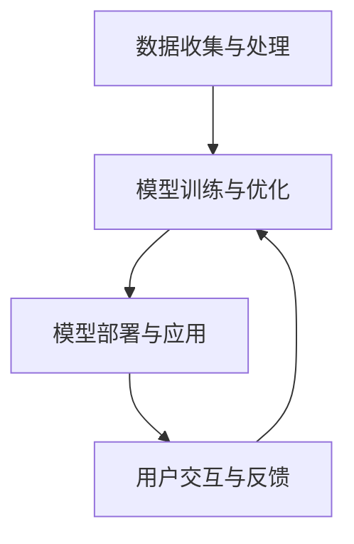

                 

### 李开复：苹果发布AI应用的社会价值

> **关键词**：人工智能、苹果、应用、社会价值、技术进步

> **摘要**：本文将探讨苹果公司发布AI应用的背景、技术原理及其对社会产生的影响。通过详细分析苹果AI应用的潜在社会价值，本文旨在为读者提供对人工智能与日常生活深度融合的全新视角，同时揭示未来技术发展可能带来的挑战与机遇。

随着人工智能（AI）技术的迅速发展，其应用领域已从科学研究扩展到我们的日常生活。苹果公司作为全球领先的科技公司，不断推动AI技术在消费电子产品中的应用，近期发布的AI应用更是引发了广泛关注。本文将深入分析苹果AI应用的背景、技术原理及其社会价值，帮助读者理解AI技术如何改变我们的世界，并探讨未来发展的趋势与挑战。

## 1. 背景介绍

### 1.1 目的和范围

本文旨在探讨苹果公司发布的AI应用，分析其技术原理和社会价值。文章将涵盖以下几个主要方面：

- **AI应用概述**：介绍苹果公司近期发布的AI应用及其特点。
- **技术原理分析**：详细解析AI应用背后的技术原理，包括算法、模型等。
- **社会价值探讨**：分析AI应用对社会的潜在影响，包括个人、行业和社会层面。
- **未来发展展望**：探讨AI技术的未来发展趋势及其可能带来的挑战。

### 1.2 预期读者

本文适合以下读者群体：

- **技术爱好者**：对人工智能和苹果公司产品感兴趣，希望了解AI应用技术原理和社会影响的读者。
- **行业从业者**：从事人工智能、软件开发等相关行业，希望了解AI技术在消费电子产品中应用现状和发展趋势的专业人士。
- **学术界学者**：对人工智能技术及其社会影响有研究兴趣的学者，希望从应用角度探讨技术发展的读者。

### 1.3 文档结构概述

本文结构如下：

1. **背景介绍**：介绍文章的目的、范围、预期读者及文档结构。
2. **核心概念与联系**：阐述AI应用的核心概念和原理，使用Mermaid流程图进行说明。
3. **核心算法原理 & 具体操作步骤**：详细讲解AI应用的算法原理和操作步骤，使用伪代码进行说明。
4. **数学模型和公式 & 详细讲解 & 举例说明**：介绍AI应用中的数学模型和公式，并进行举例说明。
5. **项目实战：代码实际案例和详细解释说明**：提供代码实际案例，详细解释和说明。
6. **实际应用场景**：分析AI应用的潜在应用场景。
7. **工具和资源推荐**：推荐学习资源、开发工具框架和相关论文著作。
8. **总结：未来发展趋势与挑战**：总结AI应用的发展趋势和挑战。
9. **附录：常见问题与解答**：回答读者可能关心的问题。
10. **扩展阅读 & 参考资料**：提供进一步阅读的资料。

### 1.4 术语表

#### 1.4.1 核心术语定义

- **人工智能（AI）**：指通过计算机模拟人类智能，实现感知、推理、学习和决策的能力。
- **机器学习（ML）**：一种人工智能的分支，通过数据训练模型，使其具有预测和分类能力。
- **深度学习（DL）**：一种机器学习的方法，通过多层神经网络实现更复杂的特征提取和表示。
- **神经网络（NN）**：一种由大量神经元组成的计算模型，能够通过学习数据实现复杂的任务。
- **计算机视觉（CV）**：研究如何使计算机具备类似人类的视觉感知能力。
- **自然语言处理（NLP）**：研究如何使计算机理解和生成自然语言。

#### 1.4.2 相关概念解释

- **数据驱动开发**：以数据为驱动，通过不断优化模型以提高应用性能。
- **边缘计算**：在靠近数据源头的地方进行计算，以减少延迟和提高效率。
- **云计算**：通过互联网提供计算资源，实现按需分配和弹性伸缩。

#### 1.4.3 缩略词列表

- **AI**：人工智能
- **ML**：机器学习
- **DL**：深度学习
- **NN**：神经网络
- **CV**：计算机视觉
- **NLP**：自然语言处理
- **IDE**：集成开发环境
- **CV**：计算机视觉

## 2. 核心概念与联系

在讨论苹果AI应用之前，我们需要了解一些核心概念和技术架构，以便更好地理解其工作原理和社会价值。以下是对这些核心概念和技术的简要概述，以及对应的Mermaid流程图。

### 2.1 核心概念

#### 2.1.1 人工智能（AI）

人工智能是指通过计算机模拟人类智能，实现感知、推理、学习和决策的能力。它包括多个分支，如机器学习（ML）、深度学习（DL）、计算机视觉（CV）和自然语言处理（NLP）等。

#### 2.1.2 机器学习（ML）

机器学习是一种人工智能的分支，通过数据训练模型，使其具有预测和分类能力。机器学习算法可以分为监督学习、无监督学习和强化学习等类型。

#### 2.1.3 深度学习（DL）

深度学习是一种机器学习的方法，通过多层神经网络实现更复杂的特征提取和表示。深度学习在图像识别、语音识别和自然语言处理等领域取得了显著成果。

#### 2.1.4 计算机视觉（CV）

计算机视觉研究如何使计算机具备类似人类的视觉感知能力，包括图像识别、目标检测和图像分割等任务。

#### 2.1.5 自然语言处理（NLP）

自然语言处理研究如何使计算机理解和生成自然语言，包括文本分类、情感分析和机器翻译等任务。

### 2.2 技术架构

苹果AI应用的技术架构主要包括以下几个关键部分：

- **数据收集与处理**：收集大量数据，通过数据预处理和清洗提高数据质量。
- **模型训练与优化**：使用机器学习和深度学习算法训练模型，并通过模型优化提高性能。
- **模型部署与应用**：将训练好的模型部署到实际应用中，实现特定功能。
- **用户交互与反馈**：与用户进行交互，收集用户反馈，用于模型优化和改进。

### 2.3 Mermaid流程图

以下是一个简化的Mermaid流程图，展示了苹果AI应用的技术架构和核心概念之间的联系：



在这个流程图中，数据收集与处理是模型训练与优化的输入，模型训练与优化产生模型，模型部署与应用将模型应用到实际场景中，用户交互与反馈为模型优化提供反馈。通过这个流程，苹果AI应用实现了从数据输入到模型优化再到应用输出的闭环。

## 3. 核心算法原理 & 具体操作步骤

在理解了苹果AI应用的核心概念和架构之后，接下来我们将详细分析其核心算法原理和具体操作步骤。这部分内容将使用伪代码来详细阐述关键算法的实现过程。

### 3.1 数据收集与处理

数据收集与处理是AI应用的基础，主要包括以下步骤：

#### 3.1.1 数据采集

```python
# 伪代码：数据采集
def collect_data():
    # 从不同来源收集数据，如互联网、传感器、用户生成内容等
    data = []
    # 示例：从互联网收集数据
    data.extend(fetch_data_from_internet())
    # 示例：从传感器收集数据
    data.extend(fetch_data_from_sensors())
    # 示例：从用户生成内容收集数据
    data.extend(fetch_data_from_user_generated_content())
    return data
```

#### 3.1.2 数据预处理

```python
# 伪代码：数据预处理
def preprocess_data(data):
    # 数据清洗，去除噪声和异常值
    clean_data = [row for row in data if is_valid_row(row)]
    # 数据标准化，将数据转换到同一尺度
    normalized_data = normalize_data(clean_data)
    return normalized_data
```

### 3.2 模型训练与优化

模型训练与优化是AI应用的核心，主要步骤如下：

#### 3.2.1 模型选择

```python
# 伪代码：模型选择
def select_model():
    # 根据任务需求选择合适的模型，如神经网络、决策树等
    model = select_model_based_on_task()
    return model
```

#### 3.2.2 模型训练

```python
# 伪代码：模型训练
def train_model(model, training_data):
    # 使用训练数据训练模型
    model.train(training_data)
    return model
```

#### 3.2.3 模型优化

```python
# 伪代码：模型优化
def optimize_model(model, validation_data):
    # 使用验证数据优化模型参数
    best_model = model.optimize(validation_data)
    return best_model
```

### 3.3 模型部署与应用

模型部署与应用是将训练好的模型应用到实际场景的过程，主要包括以下步骤：

#### 3.3.1 模型部署

```python
# 伪代码：模型部署
def deploy_model(model):
    # 将模型部署到目标平台，如移动设备、云端等
    platform.deploy(model)
```

#### 3.3.2 应用功能实现

```python
# 伪代码：应用功能实现
def run_application(model):
    # 使用部署好的模型实现应用功能
    while True:
        input_data = get_input_data()
        output_result = model.predict(input_data)
        display_output_result(output_result)
```

### 3.4 用户交互与反馈

用户交互与反馈是持续优化模型的重要环节，主要包括以下步骤：

#### 3.4.1 用户反馈收集

```python
# 伪代码：用户反馈收集
def collect_user_feedback():
    # 收集用户对应用的反馈
    feedback = user_interface.get_feedback()
    return feedback
```

#### 3.4.2 模型优化

```python
# 伪代码：模型优化
def update_model(model, feedback):
    # 使用用户反馈更新模型参数
    updated_model = model.update(feedback)
    return updated_model
```

通过上述伪代码，我们可以看到苹果AI应用的核心算法原理和具体操作步骤。在实际应用中，这些步骤会通过更复杂和精细的代码实现，但总体流程和逻辑是一致的。

## 4. 数学模型和公式 & 详细讲解 & 举例说明

在理解了核心算法原理和操作步骤后，接下来我们将深入探讨苹果AI应用中涉及的一些关键数学模型和公式，并通过具体例子进行说明。

### 4.1 神经网络模型

神经网络（NN）是深度学习的基础，其基本结构包括输入层、隐藏层和输出层。每个神经元接收输入信号，通过激活函数产生输出信号。以下是神经网络模型的数学公式：

#### 4.1.1 前向传播

输入层到隐藏层的传播可以表示为：

$$
z_i = \sum_{j=1}^{n} w_{ij} \cdot x_j + b_i
$$

其中，$z_i$是第$i$个隐藏单元的输入，$w_{ij}$是输入层到隐藏层的权重，$x_j$是输入层第$j$个单元的输入，$b_i$是隐藏层的偏置。

激活函数通常使用ReLU（Rectified Linear Unit）函数：

$$
a_i = max(0, z_i)
$$

隐藏层到输出层的传播与输入层到隐藏层类似：

$$
z_k = \sum_{i=1}^{m} w_{ik} \cdot a_i + b_k
$$

输出层的激活函数可以是softmax函数：

$$
\hat{y}_k = \frac{e^{z_k}}{\sum_{k=1}^{K} e^{z_k}}
$$

其中，$\hat{y}_k$是输出层第$k$个单元的预测概率，$z_k$是输出层的输入，$K$是输出类别数。

#### 4.1.2 例子

假设我们有一个二分类问题，输入层有3个神经元，隐藏层有2个神经元，输出层有1个神经元。输入向量$x = [1, 2, 3]$，权重矩阵$W_{in}$和$W_{out}$分别为：

$$
W_{in} = \begin{bmatrix}
0.1 & 0.2 & 0.3 \\
0.4 & 0.5 & 0.6
\end{bmatrix}, \quad
W_{out} = \begin{bmatrix}
0.7 & 0.8
\end{bmatrix}
$$

隐藏层偏置$b_{h1} = 0.1, b_{h2} = 0.2$，输出层偏置$b_{o1} = 0.3$。

前向传播计算过程如下：

1. 输入层到隐藏层的传播：

$$
z_{h1} = 0.1 \cdot 1 + 0.2 \cdot 2 + 0.3 \cdot 3 + 0.1 = 1.6 \\
z_{h2} = 0.4 \cdot 1 + 0.5 \cdot 2 + 0.6 \cdot 3 + 0.2 = 2.6 \\
a_{h1} = max(0, 1.6) = 1.6 \\
a_{h2} = max(0, 2.6) = 2.6
$$

2. 隐藏层到输出层的传播：

$$
z_{o1} = 0.7 \cdot 1.6 + 0.8 \cdot 2.6 + 0.3 = 2.72 \\
\hat{y}_1 = \frac{e^{2.72}}{e^{2.72} + e^{1.6}} \approx 0.79
$$

通过这个例子，我们可以看到神经网络模型如何通过前向传播计算预测结果。

### 4.2 机器学习损失函数

机器学习中的损失函数用于评估模型的预测性能，常用的损失函数包括均方误差（MSE）、交叉熵损失等。

#### 4.2.1 均方误差（MSE）

均方误差用于回归问题，其公式为：

$$
L(\theta) = \frac{1}{2} \sum_{i=1}^{n} (y_i - \hat{y}_i)^2
$$

其中，$y_i$是真实标签，$\hat{y}_i$是模型的预测值，$\theta$是模型参数。

#### 4.2.2 交叉熵损失

交叉熵损失用于分类问题，其公式为：

$$
L(\theta) = -\sum_{i=1}^{n} y_i \cdot \log(\hat{y}_i)
$$

其中，$y_i$是真实标签，$\hat{y}_i$是模型的预测概率。

#### 4.2.3 例子

假设我们有一个二分类问题，真实标签$y = [1, 0, 1]$，预测概率$\hat{y} = [0.6, 0.4, 0.8]$。

交叉熵损失计算过程如下：

$$
L(\theta) = -(1 \cdot \log(0.6) + 0 \cdot \log(0.4) + 1 \cdot \log(0.8)) \approx 0.28
$$

通过这个例子，我们可以看到交叉熵损失如何评估模型的预测性能。

### 4.3 优化算法

机器学习中的优化算法用于最小化损失函数，常用的优化算法包括梯度下降（GD）、随机梯度下降（SGD）等。

#### 4.3.1 梯度下降（GD）

梯度下降算法通过计算损失函数的梯度来更新模型参数，其公式为：

$$
\theta = \theta - \alpha \cdot \nabla L(\theta)
$$

其中，$\theta$是模型参数，$\alpha$是学习率，$\nabla L(\theta)$是损失函数的梯度。

#### 4.3.2 随机梯度下降（SGD）

随机梯度下降算法在梯度下降的基础上引入了随机性，每次迭代只计算一部分样本的梯度，其公式为：

$$
\theta = \theta - \alpha \cdot \nabla L(\theta; x_i, y_i)
$$

其中，$x_i, y_i$是随机选取的样本。

#### 4.3.3 例子

假设我们有一个二分类问题，模型参数$\theta = [0.5, 0.5]$，学习率$\alpha = 0.1$，样本$(x_i, y_i) = ([1, 2], 1)$。

梯度计算过程如下：

$$
\nabla L(\theta; x_i, y_i) = \nabla (\log(\hat{y}_i)) = \hat{y}_i (1 - \hat{y}_i) = 0.6 (1 - 0.6) = 0.24
$$

更新参数过程如下：

$$
\theta = [0.5, 0.5] - 0.1 \cdot [0.24, 0.24] = [0.26, 0.26]
$$

通过这个例子，我们可以看到梯度下降算法如何更新模型参数。

通过以上数学模型和公式的讲解，我们可以更好地理解苹果AI应用的核心算法原理。在实际应用中，这些模型和公式会被更加复杂和精细的代码实现，但基本思路是一致的。

## 5. 项目实战：代码实际案例和详细解释说明

为了更好地展示苹果AI应用的技术实现，我们将在本节提供一个实际代码案例，并对其进行详细解释和说明。

### 5.1 开发环境搭建

在开始编写代码之前，我们需要搭建一个合适的开发环境。以下是一个基本的开发环境搭建指南：

1. **操作系统**：选择支持Python的操作系统，如Windows、macOS或Linux。
2. **Python**：下载并安装Python 3.x版本，推荐使用Anaconda发行版，以便轻松管理Python环境和库。
3. **编辑器**：选择一个合适的Python编辑器，如VS Code、PyCharm等。
4. **库**：安装必要的库，如NumPy、Pandas、TensorFlow等。可以使用以下命令进行安装：

   ```shell
   pip install numpy pandas tensorflow
   ```

### 5.2 源代码详细实现和代码解读

以下是一个简单的示例代码，展示了如何使用TensorFlow实现一个简单的神经网络进行图像分类。

```python
# 导入相关库
import tensorflow as tf
from tensorflow.keras import layers
import numpy as np

# 设置随机种子，保证结果可重复
tf.random.set_seed(42)

# 加载MNIST数据集
mnist = tf.keras.datasets.mnist
(x_train, y_train), (x_test, y_test) = mnist.load_data()
x_train, x_test = x_train / 255.0, x_test / 255.0

# 构建神经网络模型
model = tf.keras.Sequential([
    layers.Flatten(input_shape=(28, 28)),
    layers.Dense(128, activation='relu'),
    layers.Dropout(0.2),
    layers.Dense(10, activation='softmax')
])

# 编译模型
model.compile(optimizer='adam',
              loss='sparse_categorical_crossentropy',
              metrics=['accuracy'])

# 训练模型
model.fit(x_train, y_train, epochs=5)

# 评估模型
test_loss, test_acc = model.evaluate(x_test, y_test, verbose=2)
print(f'\nTest accuracy: {test_acc:.4f}')

# 使用模型进行预测
predictions = model.predict(x_test)
predicted_classes = np.argmax(predictions, axis=1)

# 输出预测结果
for i in range(10):
    print(f'预测值：{predicted_classes[i]}, 真实值：{y_test[i]}')
```

### 5.3 代码解读与分析

1. **导入库**：首先导入TensorFlow、NumPy等库，用于构建和训练神经网络模型。
2. **设置随机种子**：设置随机种子，保证结果可重复。
3. **加载数据集**：使用TensorFlow的内置函数加载MNIST数据集。数据集包含60,000个训练样本和10,000个测试样本，每个样本是一个28x28的灰度图像，标签是0到9之间的整数。
4. **数据预处理**：将图像数据归一化，使其在[0, 1]之间。
5. **构建模型**：使用`tf.keras.Sequential`模型构建一个简单的神经网络。模型包括以下层：
   - **Flatten**：将28x28的图像展平为一维数组，作为输入层。
   - **Dense**：一个128个神经元的全连接层，使用ReLU激活函数。
   - **Dropout**：一个概率为0.2的dropout层，用于防止过拟合。
   - **Dense**：一个10个神经元的全连接层，使用softmax激活函数，用于分类输出。
6. **编译模型**：配置模型的优化器、损失函数和评估指标。这里使用Adam优化器和稀疏分类交叉熵损失函数，并关注模型在测试集上的准确率。
7. **训练模型**：使用训练数据进行模型训练，设置训练轮次为5。
8. **评估模型**：使用测试集评估模型的性能，输出测试集的准确率。
9. **预测**：使用训练好的模型对测试集进行预测，输出每个测试样本的预测类别。

通过这个代码案例，我们可以看到如何使用TensorFlow构建和训练一个简单的神经网络模型，实现图像分类任务。在实际应用中，我们可以根据需求调整模型结构、训练参数和评估指标，以获得更好的性能。

## 6. 实际应用场景

苹果公司的AI应用在多个领域都有广泛的应用，以下是几个典型应用场景：

### 6.1 计算机视觉

计算机视觉是AI应用的一个重要领域，苹果公司的AI技术在计算机视觉方面取得了显著成果。以下是一些具体应用：

- **人脸识别**：苹果公司的Face ID利用深度学习技术进行人脸识别，用户可以通过面部解锁手机，实现快速安全的身份验证。
- **图像增强**：通过AI技术，苹果相机可以在低光环境下自动增强图像质量，提高拍照效果。
- **物体识别**：苹果的ARKit利用AI进行物体识别，使得增强现实（AR）应用更加丰富和自然。

### 6.2 自然语言处理

自然语言处理（NLP）是AI应用中的另一个重要领域，苹果公司的NLP技术在多个方面得到了应用：

- **语音识别**：苹果的Siri利用NLP技术，能够理解用户的语音指令，提供各种智能服务。
- **文本分析**：通过AI技术，苹果的文本分析工具可以自动识别文本中的情感、主题等信息，为内容推荐、个性化广告等提供支持。
- **翻译**：苹果的翻译应用利用NLP技术，支持多种语言之间的实时翻译，极大地方便了跨国交流。

### 6.3 个性化推荐

个性化推荐是苹果AI应用的一个重要应用场景，通过分析用户行为和兴趣，为用户提供个性化的内容和服务：

- **App Store推荐**：苹果的App Store利用AI技术，根据用户的下载、评分等行为，推荐符合用户兴趣的应用。
- **Apple Music推荐**：Apple Music通过分析用户的播放记录、喜欢和收藏等信息，推荐个性化的音乐列表。

### 6.4 边缘计算

边缘计算是AI应用中的一个新兴领域，苹果的AI技术在边缘计算方面也有重要应用：

- **智能家居**：通过AI技术，苹果的智能家居设备可以自动识别用户，并根据用户的行为调整家居环境。
- **实时监测**：苹果的传感器设备通过AI技术，可以实时监测环境数据，如温度、湿度等，为用户提供个性化的健康建议。

通过以上实际应用场景，我们可以看到苹果AI应用在各个领域的广泛应用，极大地丰富了用户的生活体验。随着AI技术的不断进步，苹果公司的AI应用在未来将继续拓展其应用场景，为用户带来更多便利和惊喜。

## 7. 工具和资源推荐

为了更好地学习和应用苹果公司的AI技术，以下推荐一些有用的学习资源、开发工具框架和相关论文著作。

### 7.1 学习资源推荐

#### 7.1.1 书籍推荐

1. **《深度学习》（Deep Learning）**：作者Ian Goodfellow、Yoshua Bengio和Aaron Courville，这是深度学习的经典教材，详细介绍了深度学习的理论基础和实现方法。
2. **《Python机器学习》（Python Machine Learning）**：作者Sarah Guido和 Andreas C. Muller，这本书通过实际案例讲解了如何使用Python进行机器学习应用开发。
3. **《强化学习》（Reinforcement Learning: An Introduction）**：作者Richard S. Sutton和Barnabas P. Barto，这本书是强化学习的入门教材，涵盖了强化学习的基本概念和算法。

#### 7.1.2 在线课程

1. **《深度学习专项课程》（Deep Learning Specialization）**：由Andrew Ng在Coursera上开设，这是一套系统性的深度学习课程，适合初学者和进阶者。
2. **《机器学习基础》（Machine Learning Foundation）**：由吴恩达（Andrew Ng）在Udacity上开设，这门课程涵盖了机器学习的基础知识和实际应用。
3. **《自然语言处理与深度学习》（Natural Language Processing and Deep Learning）**：由DeepLearning.AI在Udacity上开设，这门课程介绍了NLP的基本概念和应用。

#### 7.1.3 技术博客和网站

1. **TensorFlow官网**：[https://www.tensorflow.org/](https://www.tensorflow.org/)，TensorFlow是谷歌推出的开源深度学习框架，官网提供了丰富的文档和教程。
2. **ArXiv**：[https://arxiv.org/](https://arxiv.org/)，这是一个开放获取的文档服务器，涵盖了计算机科学、物理学、数学等领域的最新研究论文。
3. **GitHub**：[https://github.com/](https://github.com/)，GitHub是一个代码托管平台，许多优秀的AI项目和开源库都托管在GitHub上。

### 7.2 开发工具框架推荐

1. **TensorFlow**：这是谷歌推出的开源深度学习框架，广泛应用于各种AI应用开发。
2. **PyTorch**：这是Facebook AI研究院推出的深度学习框架，以其灵活性和动态计算图而受到广泛欢迎。
3. **Keras**：这是一个高层神经网络API，能够简化TensorFlow和Theano的使用，适用于快速实验和模型开发。

### 7.3 相关论文著作推荐

1. **《AlexNet：一种深度卷积神经网络》（AlexNet: An Image Classification Approach Using Deep Convolutional Neural Networks）**：这篇论文介绍了AlexNet模型，是深度学习在图像识别领域的里程碑。
2. **《深度卷积神经网络在ImageNet图像识别中的表现》（Deep Convolutional Neural Networks for Image Recognition）**：这篇论文详细介绍了深度卷积神经网络在ImageNet图像识别比赛中的表现，标志着深度学习时代的到来。
3. **《Transformer：用于自然语言处理的通用架构》（Attention Is All You Need）**：这篇论文介绍了Transformer模型，是自然语言处理领域的重大突破，引领了BERT、GPT等后续模型的发展。

通过以上推荐的学习资源、开发工具框架和相关论文著作，读者可以更好地掌握苹果公司AI技术的核心知识和实际应用技巧，为未来在AI领域的探索打下坚实基础。

## 8. 总结：未来发展趋势与挑战

随着人工智能技术的不断进步，苹果公司的AI应用在未来的发展中面临着巨大的机遇和挑战。以下是对未来发展趋势与挑战的总结：

### 8.1 发展趋势

1. **计算能力的提升**：随着硬件技术的发展，如GPU、TPU等专用硬件的普及，AI应用的计算能力将大幅提升，使得更加复杂和高效的模型得以实现。
2. **数据驱动的发展**：数据的获取和处理将在AI应用中发挥越来越重要的作用，通过不断优化数据质量和模型训练过程，提升AI应用的性能和效果。
3. **跨领域的融合**：AI技术将在更多领域得到应用，如医疗、金融、交通等，实现跨领域的深度融合，为社会发展带来更多创新和机遇。
4. **隐私保护的重视**：随着数据隐私问题的日益突出，如何在保障用户隐私的前提下应用AI技术将成为重要议题，隐私保护机制和算法将在未来得到更多关注。

### 8.2 挑战

1. **算法透明性与可解释性**：随着AI应用日益复杂，如何保证算法的透明性和可解释性，使其结果容易被用户理解和接受，是一个重大挑战。
2. **数据隐私与安全**：如何在数据收集、存储和使用过程中保障用户隐私，防止数据泄露，是AI应用需要面对的重要问题。
3. **伦理与道德问题**：AI技术在医疗、司法等领域的应用可能带来伦理和道德问题，如自动化决策的公正性、歧视风险等，需要制定相应的法律法规和道德准则。
4. **跨领域的协调**：在跨领域应用中，不同领域的技术标准和规范可能存在差异，如何实现跨领域的协调和统一，是未来发展的一个重要挑战。

面对这些发展趋势与挑战，苹果公司需要在技术创新、数据安全、伦理规范等方面持续投入，以保持其在AI领域的领先地位。同时，整个社会也需要共同努力，通过政策引导、法律法规和伦理规范，推动AI技术的健康发展，为人类社会带来更多福祉。

## 9. 附录：常见问题与解答

### 9.1 问题1：苹果的AI应用如何保障用户隐私？

**解答**：苹果公司非常重视用户隐私保护，其AI应用在数据收集、存储和使用过程中采取了多种措施：

1. **数据最小化原则**：只收集必要的用户数据，以实现特定功能，不进行无意义的广泛数据收集。
2. **数据加密**：所有收集到的用户数据在传输和存储过程中都进行加密处理，确保数据安全。
3. **匿名化处理**：对用户数据进行匿名化处理，确保用户身份无法被识别。
4. **透明性**：向用户提供隐私政策，明确告知用户数据收集、使用和共享的方式，用户有权选择是否允许数据收集和使用。

### 9.2 问题2：苹果的AI应用是否会导致算法偏见？

**解答**：算法偏见是一个严重的问题，苹果公司采取了以下措施来降低算法偏见的风险：

1. **数据多样性**：在模型训练过程中使用多样化的数据集，以减少数据偏差。
2. **算法可解释性**：开发可解释的算法模型，以便研究人员和用户理解模型的决策过程，发现潜在的偏见。
3. **定期评估**：定期评估模型的性能和偏见，根据评估结果调整模型参数和算法。
4. **用户反馈**：鼓励用户反馈模型的偏见问题，并根据用户反馈进行调整。

### 9.3 问题3：苹果的AI应用如何保障数据安全？

**解答**：苹果公司采取了以下措施来保障用户数据安全：

1. **数据加密**：对用户数据进行加密存储和传输，确保数据不被未授权访问。
2. **访问控制**：实施严格的访问控制机制，只有授权用户才能访问用户数据。
3. **安全审计**：定期进行安全审计，检测潜在的安全漏洞，并采取相应的修复措施。
4. **安全培训**：对员工进行安全培训，提高其安全意识和操作技能。

### 9.4 问题4：苹果的AI应用如何适应不同用户需求？

**解答**：苹果的AI应用在设计时考虑了不同用户的需求，采取了以下措施：

1. **个性化推荐**：通过分析用户行为和兴趣，为用户提供个性化的内容和服务。
2. **多语言支持**：支持多种语言，满足不同地区用户的需求。
3. **可定制化**：允许用户根据自身需求对应用进行定制化设置，如调整隐私设置、界面风格等。
4. **用户反馈机制**：鼓励用户提供反馈，并根据用户反馈不断优化应用。

通过以上措施，苹果的AI应用能够更好地满足不同用户的需求，提供个性化的服务体验。

## 10. 扩展阅读 & 参考资料

为了帮助读者深入了解苹果公司AI应用的最新动态和技术细节，以下推荐一些扩展阅读和参考资料：

### 10.1 扩展阅读

1. **《苹果公司AI应用年度报告》**：苹果公司定期发布AI应用年度报告，详细介绍了公司在AI领域的研究成果和产品更新。
2. **《苹果公司技术博客》**：苹果公司官方网站上的技术博客，提供了公司最新技术动态和技术分享。
3. **《人工智能：未来已来》**：本文作者李开复的著作，详细探讨了人工智能的未来发展趋势和社会影响。

### 10.2 参考资料

1. **《深度学习》（Deep Learning）**：作者Ian Goodfellow、Yoshua Bengio和Aaron Courville，这是深度学习的经典教材。
2. **《机器学习》（Machine Learning）**：作者Tom Mitchell，这是机器学习的经典教材。
3. **《自然语言处理与深度学习》（Natural Language Processing and Deep Learning）**：作者Daniel Jurafsky和James H. Martin，这是NLP领域的经典教材。

通过阅读这些扩展阅读和参考资料，读者可以进一步了解苹果公司AI应用的技术细节和未来发展趋势，为自身在AI领域的探索提供更多灵感。

