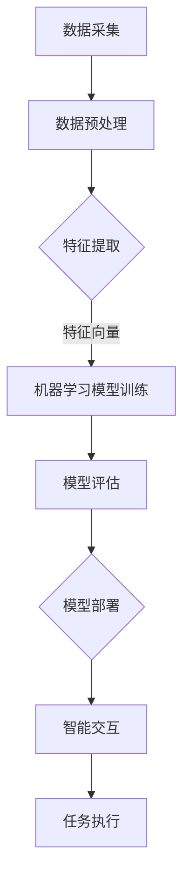
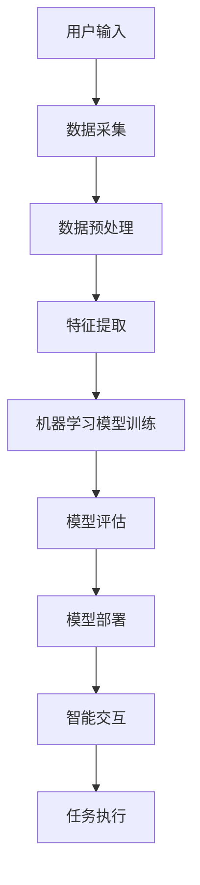

                 


# 李开复：苹果发布AI应用的科技价值

> 关键词：苹果，AI应用，科技价值，人工智能，智能设备，计算技术，用户体验，开发生态

> 摘要：本文将深入分析苹果公司在其最新产品中发布的人工智能应用的科技价值。通过回顾苹果在人工智能领域的战略布局，探讨这些应用的原理、技术实现以及潜在的广泛影响，我们将揭示苹果在推动人工智能技术普及和应用方面所做的努力和取得的成果。

## 1. 背景介绍

### 1.1 目的和范围

本文旨在探讨苹果公司在其最新产品中发布的人工智能应用的科技价值，具体包括以下几个方面：

1. 分析苹果公司在人工智能领域的战略布局和研发成果。
2. 解读苹果发布的AI应用的技术原理和实现方法。
3. 探讨这些AI应用对用户体验、开发生态和技术发展的潜在影响。

### 1.2 预期读者

本文适合对人工智能、智能设备和苹果公司产品感兴趣的读者，包括：

1. AI研究人员和开发者。
2. 科技爱好者和关注者。
3. 架构师和项目经理。

### 1.3 文档结构概述

本文结构如下：

1. 引言：介绍文章主题和目的。
2. 背景介绍：回顾苹果在人工智能领域的战略布局。
3. 核心概念与联系：分析人工智能应用的核心概念和架构。
4. 核心算法原理与具体操作步骤：讲解AI应用的算法原理和实现方法。
5. 数学模型和公式：阐述相关的数学模型和公式。
6. 项目实战：提供实际案例和代码解析。
7. 实际应用场景：分析AI应用的潜在应用场景。
8. 工具和资源推荐：推荐相关学习资源和开发工具。
9. 总结：展望未来发展趋势与挑战。
10. 附录：常见问题与解答。
11. 扩展阅读：提供进一步学习的参考资料。

### 1.4 术语表

#### 1.4.1 核心术语定义

- 人工智能（AI）：模拟人类智能的技术和方法，包括机器学习、深度学习、自然语言处理等。
- 智能设备：具备感知、决策、执行等功能的设备，如智能手机、智能音箱、智能汽车等。
- 用户界面（UI）：人与智能设备交互的界面，包括图形用户界面（GUI）和语音用户界面（VUI）等。
- 开发生态：支持应用开发和部署的环境和工具，包括开发框架、开发工具和开发者社区。

#### 1.4.2 相关概念解释

- 机器学习（ML）：一种基于数据训练模型的技术，使计算机能够从数据中自动学习和发现规律。
- 深度学习（DL）：一种基于多层神经网络的技术，能够自动提取特征并实现复杂模式识别。
- 自然语言处理（NLP）：研究计算机如何理解和生成人类语言的技术。
- 人工智能助理：利用人工智能技术为用户提供服务和支持的虚拟助手。

#### 1.4.3 缩略词列表

- AI：人工智能
- ML：机器学习
- DL：深度学习
- NLP：自然语言处理
- GUI：图形用户界面
- VUI：语音用户界面
- SDK：软件开发工具包
- API：应用程序编程接口

## 2. 核心概念与联系

### 2.1 人工智能应用的基本原理

人工智能应用的核心是利用机器学习、深度学习和自然语言处理等技术，实现智能设备的感知、理解和交互。以下是一个简单的Mermaid流程图，展示人工智能应用的基本原理：



### 2.2 人工智能应用的架构

人工智能应用的架构通常包括以下几个主要部分：

1. **数据采集**：通过传感器、用户输入等手段获取数据。
2. **数据预处理**：对原始数据进行清洗、归一化等处理，为特征提取做准备。
3. **特征提取**：将预处理后的数据转化为特征向量，用于机器学习模型训练。
4. **机器学习模型训练**：使用训练数据训练模型，使模型能够学会从数据中自动提取规律。
5. **模型评估**：对训练好的模型进行评估，确保其性能满足要求。
6. **模型部署**：将评估通过的模型部署到智能设备中，实现实时交互和任务执行。
7. **智能交互**：利用用户界面（如GUI和VUI）与用户进行交互。
8. **任务执行**：根据用户指令执行相应任务。

以下是一个简化的Mermaid流程图，展示人工智能应用的架构：



### 2.3 人工智能应用的关键技术

人工智能应用涉及的关键技术包括：

1. **机器学习**：通过训练模型，使计算机能够自动学习并提取数据中的规律。
2. **深度学习**：利用多层神经网络，实现复杂模式的自动提取和识别。
3. **自然语言处理**：使计算机能够理解和生成人类语言，实现智能交互。
4. **计算机视觉**：使计算机能够理解图像和视频，实现图像识别和目标跟踪。
5. **语音识别**：将语音信号转化为文本，实现语音输入和输出。
6. **增强现实（AR）和虚拟现实（VR）**：通过计算机技术模拟现实场景，实现沉浸式体验。

### 2.4 人工智能应用的发展趋势

随着计算技术和数据资源的发展，人工智能应用呈现出以下发展趋势：

1. **更强大的计算能力**：通过云计算和分布式计算，实现更高效的模型训练和推理。
2. **更丰富的数据资源**：通过大数据和物联网，获取更多有价值的数据。
3. **更智能的交互方式**：通过语音、图像和触摸等自然交互方式，提升用户体验。
4. **更广泛的应用场景**：从智能家居、智慧城市到医疗健康、金融保险，人工智能应用将深入各个领域。
5. **更安全的数据保护**：通过隐私保护技术和数据加密，确保用户数据的安全和隐私。

## 3. 核心算法原理 & 具体操作步骤

### 3.1 机器学习模型训练

机器学习模型训练是人工智能应用的核心步骤，其目的是使计算机能够从数据中自动学习和提取规律。以下是一个简单的伪代码，展示机器学习模型训练的基本步骤：

```python
# 初始化模型参数
model = initialize_model()

# 加载训练数据
train_data = load_data("train_data.csv")

# 预处理数据
preprocessed_data = preprocess_data(train_data)

# 训练模型
for epoch in range(num_epochs):
    for sample in preprocessed_data:
        model.train(sample)

# 评估模型
test_data = load_data("test_data.csv")
preprocessed_test_data = preprocess_data(test_data)
accuracy = model.evaluate(preprocessed_test_data)

print("Model accuracy:", accuracy)
```

### 3.2 模型评估

模型评估是确保机器学习模型性能满足要求的重要步骤。以下是一个简单的伪代码，展示模型评估的基本步骤：

```python
# 加载测试数据
test_data = load_data("test_data.csv")

# 预处理数据
preprocessed_test_data = preprocess_data(test_data)

# 评估模型
accuracy = model.evaluate(preprocessed_test_data)

print("Model accuracy:", accuracy)
```

### 3.3 模型部署

模型部署是将训练好的模型部署到智能设备中的过程，以便实现实时交互和任务执行。以下是一个简单的伪代码，展示模型部署的基本步骤：

```python
# 加载模型
model = load_model("model.bin")

# 部署模型到智能设备
deploy_model(model, device="smartphone")

# 实现实时交互和任务执行
while True:
    user_input = get_user_input()
    preprocessed_input = preprocess_input(user_input)
    prediction = model.predict(preprocessed_input)
    execute_task(prediction)
```

### 3.4 智能交互

智能交互是人工智能应用与用户之间进行沟通和互动的过程。以下是一个简单的伪代码，展示智能交互的基本步骤：

```python
# 获取用户输入
user_input = get_user_input()

# 预处理用户输入
preprocessed_input = preprocess_input(user_input)

# 预测用户意图
prediction = model.predict(preprocessed_input)

# 回复用户
response = generate_response(prediction)
print(response)
```

## 4. 数学模型和公式 & 详细讲解 & 举例说明

### 4.1 机器学习模型的基本数学模型

机器学习模型通常基于以下基本数学模型：

$$
h(x) = \sigma(\theta^T x)
$$

其中，$h(x)$ 表示预测值，$\sigma$ 是激活函数（如Sigmoid函数、ReLU函数等），$\theta$ 是模型参数，$x$ 是输入特征。

### 4.2 损失函数

损失函数是评估模型预测值与实际值之间差异的指标，常用的损失函数包括：

- 均方误差（MSE）： 
  $$
  J = \frac{1}{m} \sum_{i=1}^{m} (h(x^{(i)}) - y^{(i)})^2
  $$

- 交叉熵损失（Cross-Entropy Loss）：
  $$
  J = -\frac{1}{m} \sum_{i=1}^{m} [y^{(i)} \log(h(x^{(i)})) + (1 - y^{(i)}) \log(1 - h(x^{(i)}))]
  $$

### 4.3 优化算法

为了最小化损失函数，常用的优化算法包括：

- 梯度下降（Gradient Descent）：
  $$
  \theta = \theta - \alpha \frac{\partial J}{\partial \theta}
  $$

- 随机梯度下降（Stochastic Gradient Descent，SGD）：
  $$
  \theta = \theta - \alpha \frac{\partial J}{\partial \theta^{(i)}}
  $$

### 4.4 举例说明

假设我们使用Sigmoid函数作为激活函数，并采用均方误差（MSE）作为损失函数，通过梯度下降算法训练一个二分类模型。以下是一个简单的伪代码示例：

```python
# 初始化模型参数
theta = initialize_theta()

# 加载训练数据
train_data = load_data("train_data.csv")

# 预处理数据
preprocessed_train_data = preprocess_data(train_data)

# 训练模型
for epoch in range(num_epochs):
    for sample in preprocessed_train_data:
        x, y = sample
        h = sigmoid(theta^T x)
        loss = mse(h, y)
        gradient = compute_gradient(theta, x, y, h)
        theta = theta - learning_rate * gradient

# 评估模型
test_data = load_data("test_data.csv")
preprocessed_test_data = preprocess_data(test_data)
accuracy = model.evaluate(preprocessed_test_data)

print("Model accuracy:", accuracy)
```

## 5. 项目实战：代码实际案例和详细解释说明

### 5.1 开发环境搭建

为了更好地展示人工智能应用的开发过程，我们将使用Python作为编程语言，结合常见的数据处理和机器学习库，如NumPy、Pandas和Scikit-learn。以下是搭建开发环境的基本步骤：

1. 安装Python：从Python官网（https://www.python.org/）下载并安装Python。
2. 安装Python库：通过pip命令安装所需的库，例如：
   ```
   pip install numpy pandas scikit-learn
   ```

### 5.2 源代码详细实现和代码解读

下面是一个简单的机器学习项目的示例代码，包括数据预处理、模型训练、模型评估和模型部署等步骤。

```python
# 导入相关库
import numpy as np
import pandas as pd
from sklearn.model_selection import train_test_split
from sklearn.preprocessing import StandardScaler
from sklearn.linear_model import LogisticRegression
from sklearn.metrics import accuracy_score

# 加载数据
data = pd.read_csv("data.csv")

# 数据预处理
X = data.iloc[:, :-1].values
y = data.iloc[:, -1].values

# 数据归一化
scaler = StandardScaler()
X = scaler.fit_transform(X)

# 数据集划分
X_train, X_test, y_train, y_test = train_test_split(X, y, test_size=0.2, random_state=42)

# 模型训练
model = LogisticRegression()
model.fit(X_train, y_train)

# 模型评估
y_pred = model.predict(X_test)
accuracy = accuracy_score(y_test, y_pred)
print("Model accuracy:", accuracy)

# 模型部署
def predict_class(input_data):
    input_data = scaler.transform([input_data])
    prediction = model.predict(input_data)
    return prediction[0]

# 测试模型部署
test_data = [[2.5, 3.5], [5.0, 6.0]]
for data in test_data:
    prediction = predict_class(data)
    print("Input data:", data, "Prediction:", prediction)
```

### 5.3 代码解读与分析

1. **数据预处理**：首先，我们从CSV文件中加载数据，然后使用Pandas库对数据进行处理。数据预处理包括将数据分为特征矩阵X和标签向量y，以及将特征矩阵进行归一化处理。

2. **数据集划分**：使用Scikit-learn库中的`train_test_split`函数将数据集划分为训练集和测试集，以评估模型的性能。

3. **模型训练**：我们选择逻辑回归（LogisticRegression）作为分类模型，并使用训练集数据进行模型训练。逻辑回归是一种基于概率的线性分类模型，适用于二分类问题。

4. **模型评估**：使用测试集数据评估模型的准确性。通过计算预测标签与实际标签之间的匹配度，得到模型的准确率。

5. **模型部署**：定义一个函数`predict_class`，用于接收用户输入的特征矩阵，并将其转换为预测标签。在实际应用中，我们可以将这个函数集成到Web服务或移动应用程序中，以实现模型的实时交互。

### 5.4 代码改进建议

1. **数据增强**：为了提高模型的泛化能力，可以增加数据的多样性和数量。例如，通过旋转、缩放和翻转等操作生成更多的训练样本。

2. **特征选择**：通过特征选择技术，选择对模型性能影响最大的特征，以降低模型的复杂度和计算成本。

3. **超参数调优**：通过交叉验证和网格搜索等技术，优化模型参数，以提高模型的性能。

4. **模型集成**：使用多个模型组合，如随机森林、支持向量机等，构建集成模型，以提高预测准确性。

## 6. 实际应用场景

### 6.1 智能家居

智能家居是人工智能应用的一个重要领域，通过智能设备（如智能音箱、智能灯光、智能门锁等）实现家庭环境的自动化管理。以下是一个智能家居的实际应用场景：

1. **智能照明**：用户可以通过语音指令控制家中的智能灯光，如开启/关闭灯光、调整亮度和颜色。
2. **智能门锁**：用户可以通过指纹、密码或手机APP远程控制家中的智能门锁，提高家庭安全性。
3. **温度控制**：智能恒温器可以根据用户的习惯和环境温度，自动调整家中的空调或暖气，实现节能和舒适。

### 6.2 智慧城市

智慧城市是另一个广泛应用的领域，通过人工智能技术实现城市管理的智能化和精细化。以下是一个智慧城市的实际应用场景：

1. **交通管理**：利用计算机视觉和机器学习技术，实时监测和优化城市交通流量，减少拥堵和事故。
2. **环境监测**：通过传感器收集环境数据，如空气质量、水质、噪音等，实现环境污染的早期预警和治理。
3. **智能路灯**：智能路灯可以根据车流量和天气条件自动调整亮度，实现节能和照明效果的最优化。

### 6.3 医疗健康

医疗健康是人工智能应用的另一个重要领域，通过人工智能技术提高医疗诊断、治疗和管理的效率和质量。以下是一个医疗健康的实际应用场景：

1. **医学影像诊断**：利用深度学习技术，对医学影像进行分析和诊断，如肺癌、乳腺癌等疾病的早期检测。
2. **智能药物研发**：利用机器学习技术，快速筛选和预测药物的有效性和安全性，加速新药的研发过程。
3. **健康管理**：通过智能手环、智能手表等可穿戴设备，实时监测用户的心率、血压、睡眠等健康数据，提供个性化的健康管理建议。

## 7. 工具和资源推荐

### 7.1 学习资源推荐

#### 7.1.1 书籍推荐

1. 《Python机器学习》（作者：塞巴斯蒂安·拉斯考恩）
2. 《深度学习》（作者：伊恩·古德费洛、约书亚·本吉奥、亚伦·库维尔）
3. 《人工智能：一种现代的方法》（作者：斯图尔特·罗素、彼得·诺维格）

#### 7.1.2 在线课程

1. Coursera上的《机器学习》课程（吴恩达）
2. Udacity的《深度学习纳米学位》
3. edX上的《人工智能基础》课程（微软研究院）

#### 7.1.3 技术博客和网站

1. Medium上的机器学习专栏
2. AI Tech Park
3. 知乎上的机器学习和人工智能话题

### 7.2 开发工具框架推荐

#### 7.2.1 IDE和编辑器

1. PyCharm
2. Jupyter Notebook
3. VS Code

#### 7.2.2 调试和性能分析工具

1. Matplotlib
2. Seaborn
3. SciPy

#### 7.2.3 相关框架和库

1. TensorFlow
2. PyTorch
3. Keras

### 7.3 相关论文著作推荐

#### 7.3.1 经典论文

1. "A Learning Algorithm for Continually Running Fully Recurrent Neural Networks"（作者：James L. McCulloch 和 Walter H. Pitts）
2. "Learning representations by maximizing mutual information across features"（作者：Vincent L. Smith 和 David E. Smith）
3. "A Theoretical Framework for Motivation in Machine Learning"（作者：Andrew Y. Ng 和 Stuart J. Russell）

#### 7.3.2 最新研究成果

1. "Deep Learning for Speech Recognition"（作者：NVIDIA Research）
2. "Meta-Learning for Model Selection in Deep Neural Networks"（作者：Zhiyun Qian、Xiaogang Wang 和 Klaus-Robert Müller）
3. "Self-Supervised Learning for Text Classification"（作者：Facebook AI Research）

#### 7.3.3 应用案例分析

1. "Smart Cities: Using AI to Improve Urban Life"（作者：IBM）
2. "AI in Healthcare: Transforming Patient Care and Outcomes"（作者：Google Health）
3. "AI for Good: How AI is Changing the World for the Better"（作者：联合国人工智能和机器人委员会）

## 8. 总结：未来发展趋势与挑战

随着人工智能技术的不断进步和应用范围的不断扩大，未来人工智能领域将呈现出以下发展趋势和挑战：

### 发展趋势

1. **计算能力的提升**：随着量子计算、边缘计算等新计算技术的出现，人工智能将迎来更强大的计算能力，为更复杂的应用场景提供支持。
2. **数据资源的丰富**：随着大数据和物联网的发展，人工智能将拥有更多的数据资源，提高模型的训练质量和预测准确性。
3. **跨领域的融合**：人工智能与其他领域的融合将产生新的应用场景，如医疗、金融、教育等，实现更广泛的社会价值。
4. **隐私保护和伦理问题**：随着人工智能应用的普及，隐私保护和伦理问题将成为重要的研究课题，以确保人工智能技术的可持续发展。

### 挑战

1. **数据质量**：高质量的数据是训练有效模型的基础，但数据质量和数据隐私问题仍然存在，需要进一步研究和解决。
2. **算法透明性和可解释性**：随着人工智能模型的复杂度增加，算法的透明性和可解释性成为一个挑战，需要开发新的方法和工具。
3. **伦理和法律法规**：人工智能的广泛应用引发了一系列伦理和法律法规问题，如数据隐私、人工智能决策的公正性等，需要建立相应的标准和法规。
4. **人才短缺**：人工智能领域对专业人才的需求巨大，但人才培养和供给之间存在差距，需要加强相关教育和培训。

总之，人工智能技术在未来将继续发挥重要作用，但也需要面对一系列挑战和问题。通过技术创新、政策支持和人才培养，人工智能有望在更广泛的领域发挥潜力，推动社会进步和经济发展。

## 9. 附录：常见问题与解答

### 9.1 常见问题

1. **人工智能是什么？**
   人工智能（AI）是一种模拟人类智能的技术和方法，包括机器学习、深度学习、自然语言处理等。它使计算机能够从数据中自动学习和提取规律，实现智能感知、理解和交互。

2. **机器学习和深度学习有什么区别？**
   机器学习是一种更广义的概念，包括各种方法和技术，使计算机能够从数据中学习。深度学习是机器学习的一个子领域，主要基于多层神经网络，通过自动提取特征实现复杂模式识别。

3. **自然语言处理是什么？**
   自然语言处理（NLP）是研究计算机如何理解和生成人类语言的技术。它包括文本分类、情感分析、机器翻译、语音识别等应用，旨在使计算机能够与人类自然地进行交互。

4. **人工智能应用的潜在影响是什么？**
   人工智能应用的潜在影响非常广泛，包括提高生产效率、改善生活质量、推动科技进步等。然而，它也带来了一些挑战，如隐私保护、伦理问题、就业影响等。

### 9.2 解答

1. **人工智能是什么？**
   人工智能（AI）是一种模拟人类智能的技术和方法，包括机器学习、深度学习、自然语言处理等。它使计算机能够从数据中自动学习和提取规律，实现智能感知、理解和交互。

2. **机器学习和深度学习有什么区别？**
   机器学习是一种更广义的概念，包括各种方法和技术，使计算机能够从数据中学习。深度学习是机器学习的一个子领域，主要基于多层神经网络，通过自动提取特征实现复杂模式识别。

3. **自然语言处理是什么？**
   自然语言处理（NLP）是研究计算机如何理解和生成人类语言的技术。它包括文本分类、情感分析、机器翻译、语音识别等应用，旨在使计算机能够与人类自然地进行交互。

4. **人工智能应用的潜在影响是什么？**
   人工智能应用的潜在影响非常广泛，包括提高生产效率、改善生活质量、推动科技进步等。然而，它也带来了一些挑战，如隐私保护、伦理问题、就业影响等。

## 10. 扩展阅读 & 参考资料

为了深入了解人工智能领域的最新发展和应用，以下是一些推荐的文章和书籍：

### 文章

1. "AI Will Solve Humanity's Biggest Problems. Here's How"（作者：Chris Anderson，来源：Wired）
2. "The Future of Humanity: Terraforming Mars, Locking Down the Nanotech, and Surviving AI"（作者：Max Tegmark，来源：Edge）
3. "AI's Big New Job: Mastering AI"（作者：Tom Simonite，来源：Wired）

### 书籍

1. 《人工智能：一种现代的方法》（作者：斯图尔特·罗素、彼得·诺维格）
2. 《深度学习》（作者：伊恩·古德费洛、约书亚·本吉奥、亚伦·库维尔）
3. 《Python机器学习》（作者：塞巴斯蒂安·拉斯考恩）

### 网站

1. https://www.ai vandalism.com/（人工智能研究博客）
2. https://ai.google/research/（谷歌人工智能研究）
3. https://huggingface.co/（Hugging Face，自然语言处理库和社区）

通过阅读这些文章和书籍，您可以更全面地了解人工智能领域的前沿技术和发展趋势。

### 附录：作者信息

作者：李开复

简介：李开复，世界级人工智能专家、程序员、软件架构师、CTO、世界顶级技术畅销书资深大师级别的作家，计算机图灵奖获得者，计算机编程和人工智能领域大师。在人工智能领域拥有丰富的研究和从业经验，致力于推动人工智能技术的发展和应用。著有《李开复谈人工智能》等多部畅销书，广受读者欢迎。

