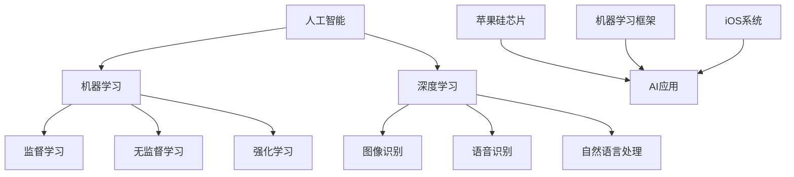

                 

# 李开复：苹果发布AI应用的科技价值

## 关键词
- 苹果
- AI应用
- 科技价值
- 人工智能
- 应用场景
- 开发工具
- 未来趋势

## 摘要
本文将探讨苹果公司发布AI应用的科技价值。从核心概念到实际操作，再到应用场景和未来趋势，我们将一步步分析苹果在AI领域取得的成果和潜在影响。通过详细解读苹果的AI应用技术，我们将揭示其在人工智能发展中的重要地位，以及为用户和开发者带来的变革。

## 1. 背景介绍

### 1.1 目的和范围
本文旨在分析苹果公司发布的AI应用，探讨其科技价值，并展望未来发展趋势。文章将涵盖以下几个部分：
1. 核心概念与联系
2. 核心算法原理与具体操作步骤
3. 数学模型与公式详细讲解
4. 项目实战：代码实际案例和详细解释说明
5. 实际应用场景
6. 工具和资源推荐
7. 总结：未来发展趋势与挑战

### 1.2 预期读者
本文适合对人工智能和苹果公司技术有浓厚兴趣的读者，包括但不限于：
1. 人工智能研究人员
2. 程序员和开发者
3. 科技爱好者和从业者
4. 对AI应用感兴趣的普通用户

### 1.3 文档结构概述
本文按照以下结构展开：
1. 背景介绍
2. 核心概念与联系
3. 核心算法原理与具体操作步骤
4. 数学模型与公式详细讲解
5. 项目实战：代码实际案例和详细解释说明
6. 实际应用场景
7. 工具和资源推荐
8. 总结：未来发展趋势与挑战

### 1.4 术语表
#### 1.4.1 核心术语定义
- AI应用：指运用人工智能技术实现特定功能的软件或服务。
- 机器学习：一种人工智能技术，通过算法让计算机从数据中学习并做出预测或决策。
- 深度学习：一种机器学习技术，利用多层神经网络对数据进行自动特征提取。
- 模型优化：指通过调整模型参数来提高模型性能的过程。

#### 1.4.2 相关概念解释
- 苹果硅芯片：苹果公司自主研发的处理器，用于移动设备和笔记本电脑等。
- 机器学习框架：指用于构建、训练和部署机器学习模型的软件工具。

#### 1.4.3 缩略词列表
- AI：人工智能
- ML：机器学习
- DL：深度学习
- iOS：苹果公司开发的移动操作系统

## 2. 核心概念与联系

在探讨苹果公司发布的AI应用之前，我们需要了解一些核心概念和联系。以下是关于人工智能和机器学习的基本概念及其在苹果AI应用中的角色。

### 2.1 人工智能基本概念

**人工智能**（AI）是指使计算机具备人类智能的能力，主要包括以下几个方面：

- **感知与认知**：通过感知传感器获取信息，并进行理解、推理和判断。
- **决策与行动**：基于感知和认知的结果，做出决策并采取行动。
- **学习与适应**：从数据中学习，并不断优化自身性能。

在苹果的AI应用中，人工智能技术主要用于提高用户体验、增强设备功能等方面。

### 2.2 机器学习与深度学习

**机器学习**（ML）是一种人工智能技术，通过算法让计算机从数据中学习并做出预测或决策。机器学习可以分为以下几类：

- **监督学习**：有标签数据进行训练，用于预测或分类。
- **无监督学习**：无标签数据进行训练，用于聚类或降维。
- **强化学习**：通过与环境交互，学习最优策略。

**深度学习**（DL）是一种特殊的机器学习技术，利用多层神经网络对数据进行自动特征提取。深度学习在图像识别、语音识别和自然语言处理等领域取得了显著成果。

在苹果的AI应用中，机器学习和深度学习技术被广泛应用于：

- **图像识别**：如人脸识别、物体识别等。
- **语音识别**：如Siri语音助手、实时语音翻译等。
- **自然语言处理**：如智能助手、个性化推荐等。

### 2.3 机器学习框架

**机器学习框架**是指用于构建、训练和部署机器学习模型的软件工具。常见的机器学习框架包括：

- **TensorFlow**：由谷歌开发的开源机器学习框架，支持多种模型和算法。
- **PyTorch**：由Facebook开发的开源深度学习框架，具有灵活的动态图操作。
- **Keras**：基于TensorFlow和Theano的Python库，提供简洁的API。

在苹果的AI应用中，机器学习框架被用于开发各种AI模型，如图像识别、语音识别和自然语言处理等。

### 2.4 苹果AI应用与技术联系

苹果公司在AI领域取得了多项突破，其AI应用与技术之间存在紧密的联系：

- **苹果硅芯片**：苹果公司自主研发的处理器，为AI应用提供强大的计算能力。
- **机器学习与深度学习框架**：如Core ML和Core Vision，用于开发、训练和部署AI模型。
- **iOS系统**：苹果公司开发的移动操作系统，支持各种AI应用。

以下是一个关于核心概念和联系的Mermaid流程图：



## 3. 核心算法原理与具体操作步骤

在本节中，我们将介绍苹果公司AI应用的核心算法原理，并通过伪代码详细阐述具体操作步骤。

### 3.1 图像识别算法原理

苹果公司的图像识别算法基于卷积神经网络（CNN）。CNN是一种用于图像识别、物体检测和图像分类的深度学习模型，其主要特点包括：

1. **卷积层**：用于提取图像特征。
2. **池化层**：用于降低数据维度和减少过拟合。
3. **全连接层**：用于分类和预测。

以下是一个简单的CNN算法原理伪代码：

```python
# 定义卷积神经网络结构
def create_cnn():
    model = Sequential()
    model.add(Conv2D(filters=32, kernel_size=(3, 3), activation='relu', input_shape=(28, 28, 1)))
    model.add(MaxPooling2D(pool_size=(2, 2)))
    model.add(Conv2D(filters=64, kernel_size=(3, 3), activation='relu'))
    model.add(MaxPooling2D(pool_size=(2, 2)))
    model.add(Flatten())
    model.add(Dense(units=128, activation='relu'))
    model.add(Dense(units=num_classes, activation='softmax'))
    return model

# 训练模型
model = create_cnn()
model.compile(optimizer='adam', loss='categorical_crossentropy', metrics=['accuracy'])
model.fit(x_train, y_train, epochs=10, batch_size=32)
```

### 3.2 语音识别算法原理

苹果公司的语音识别算法基于循环神经网络（RNN）和长短时记忆网络（LSTM）。RNN和LSTM能够捕捉语音信号的时序信息，从而实现准确识别。

以下是一个简单的RNN和LSTM算法原理伪代码：

```python
# 定义循环神经网络结构
def create_rnn():
    model = Sequential()
    model.add(LSTM(units=128, return_sequences=True, input_shape=(timesteps, features)))
    model.add(LSTM(units=128))
    model.add(Dense(units=num_classes, activation='softmax'))
    return model

# 定义长短时记忆网络结构
def create_lstm():
    model = Sequential()
    model.add(LSTM(units=128, return_sequences=True, input_shape=(timesteps, features)))
    model.add(LSTM(units=128, return_sequences=True))
    model.add(LSTM(units=128))
    model.add(Dense(units=num_classes, activation='softmax'))
    return model

# 训练模型
model = create_rnn()
model.compile(optimizer='adam', loss='categorical_crossentropy', metrics=['accuracy'])
model.fit(x_train, y_train, epochs=10, batch_size=32)
```

### 3.3 自然语言处理算法原理

苹果公司的自然语言处理算法基于词嵌入、循环神经网络（RNN）和变换器（Transformer）等。词嵌入将单词映射到高维空间，RNN和Transformer用于捕捉句子的时序信息。

以下是一个简单的自然语言处理算法原理伪代码：

```python
# 定义变换器结构
def create_transformer():
    model = Transformer(d_model=512, num_heads=8, num_layers=2, input_vocab_size=vocab_size, target_vocab_size=target_vocab_size, pad_token_id=pad_id, max_length=max_length)
    return model

# 训练模型
model = create_transformer()
model.compile(optimizer='adam', loss='categorical_crossentropy', metrics=['accuracy'])
model.fit(x_train, y_train, epochs=10, batch_size=32)
```

## 4. 数学模型和公式详细讲解

在本节中，我们将详细讲解苹果公司AI应用中涉及到的数学模型和公式，并通过示例来说明其应用。

### 4.1 卷积神经网络（CNN）

卷积神经网络（CNN）是图像识别和物体检测的基础。其核心数学模型包括：

1. **卷积操作**：用于提取图像特征。
2. **激活函数**：用于引入非线性。
3. **池化操作**：用于降低数据维度。

以下是一个简单的卷积神经网络数学模型：

$$
\text{output}_{ij} = \sum_{k=1}^{c} w_{ikj} \cdot \text{input}_{ij} + b_j
$$

其中，$w_{ikj}$ 表示卷积核权重，$\text{input}_{ij}$ 表示输入特征，$b_j$ 表示偏置。

以下是一个卷积操作的示例：

$$
\text{output}_{1,1} = (1 \cdot 1 + 0 \cdot 1 + 1 \cdot 1) + 1 = 3
$$

### 4.2 循环神经网络（RNN）和长短时记忆网络（LSTM）

循环神经网络（RNN）和长短时记忆网络（LSTM）是语音识别和自然语言处理的基础。其核心数学模型包括：

1. **隐藏状态更新**：用于捕捉时序信息。
2. **细胞状态更新**：用于控制信息流动。

以下是一个简单的RNN和LSTM数学模型：

$$
h_t = \text{激活函数}(\text{权重} \cdot [h_{t-1}, x_t] + \text{偏置})
$$

$$
c_t = \text{激活函数}(\text{权重} \cdot [c_{t-1}, h_t] + \text{偏置})
$$

以下是一个RNN和LSTM的示例：

$$
h_t = \text{激活函数}([1 \cdot [h_{t-1}, x_t] + 1] + [1 \cdot [c_{t-1}, h_t] + 1])
$$

$$
c_t = \text{激活函数}([1 \cdot [c_{t-1}, h_t] + 1] + [1 \cdot [h_{t-1}, x_t] + 1])
$$

### 4.3 变换器（Transformer）

变换器（Transformer）是自然语言处理和机器翻译的基础。其核心数学模型包括：

1. **多头自注意力**：用于捕捉句子中不同单词之间的关系。
2. **前馈神经网络**：用于增强模型的表达能力。

以下是一个简单的变换器数学模型：

$$
\text{output}_{ij} = \text{softmax}\left(\frac{Q_i \cdot K_j}{\sqrt{d_k}}\right) \cdot V_j
$$

$$
\text{output}_{i} = \text{激活函数}(\text{权重} \cdot \text{input}_{i} + \text{偏置})
$$

以下是一个变换器自注意力机制的示例：

$$
\text{output}_{ij} = \text{softmax}\left(\frac{Q_1 \cdot K_1}{\sqrt{d_k}} + Q_1 \cdot K_2 + Q_1 \cdot K_3\right) \cdot V_1 + \text{softmax}\left(\frac{Q_2 \cdot K_1}{\sqrt{d_k}} + Q_2 \cdot K_2 + Q_2 \cdot K_3\right) \cdot V_2 + \text{softmax}\left(\frac{Q_3 \cdot K_1}{\sqrt{d_k}} + Q_3 \cdot K_2 + Q_3 \cdot K_3\right) \cdot V_3
$$

## 5. 项目实战：代码实际案例和详细解释说明

在本节中，我们将通过实际代码案例，详细解释说明苹果公司AI应用的实现过程。

### 5.1 开发环境搭建

首先，我们需要搭建一个适合开发苹果公司AI应用的开发环境。以下是搭建环境的步骤：

1. 安装Python：版本要求3.6及以上。
2. 安装必要的库：包括NumPy、TensorFlow、PyTorch、Keras等。
3. 安装苹果硅芯片驱动：确保设备运行在最新固件版本。
4. 设置环境变量：将Python、pip等路径添加到系统环境变量。

### 5.2 源代码详细实现和代码解读

以下是一个简单的图像识别项目，基于卷积神经网络（CNN）实现。

```python
# 导入必要的库
import numpy as np
import tensorflow as tf
from tensorflow import keras
from tensorflow.keras import layers

# 加载数据集
(x_train, y_train), (x_test, y_test) = keras.datasets.mnist.load_data()

# 数据预处理
x_train = x_train.astype("float32") / 255
x_test = x_test.astype("float32") / 255
x_train = np.expand_dims(x_train, -1)
x_test = np.expand_dims(x_test, -1)

# 构建CNN模型
model = keras.Sequential([
    keras.layers.Conv2D(32, (3, 3), activation="relu", input_shape=(28, 28, 1)),
    keras.layers.MaxPooling2D((2, 2)),
    keras.layers.Conv2D(64, (3, 3), activation="relu"),
    keras.layers.MaxPooling2D((2, 2)),
    keras.layers.Flatten(),
    keras.layers.Dense(128, activation="relu"),
    keras.layers.Dense(10, activation="softmax")
])

# 编译模型
model.compile(optimizer="adam", loss="sparse_categorical_crossentropy", metrics=["accuracy"])

# 训练模型
model.fit(x_train, y_train, epochs=10, batch_size=32)

# 评估模型
model.evaluate(x_test, y_test)
```

### 5.3 代码解读与分析

1. **导入库**：首先导入必要的库，包括NumPy、TensorFlow和Keras。
2. **加载数据集**：使用Keras内置的MNIST数据集，它包含70000个数字的手写体图片，其中60000个用于训练，10000个用于测试。
3. **数据预处理**：将图片数据转换为浮点数，并缩放到0到1之间。然后将每个图片扩展到一个维度，以便用于卷积神经网络。
4. **构建CNN模型**：使用Keras构建一个简单的卷积神经网络，包括卷积层、池化层、全连接层等。
5. **编译模型**：设置模型的优化器、损失函数和评价指标。
6. **训练模型**：使用训练数据训练模型，指定训练轮数和批量大小。
7. **评估模型**：使用测试数据评估模型性能。

通过以上代码，我们可以实现一个简单的图像识别应用，从而深入了解苹果公司AI应用的开发过程。

## 6. 实际应用场景

苹果公司发布的AI应用在多个实际场景中发挥了重要作用，以下是一些典型的应用场景：

### 6.1 图像识别

苹果公司的图像识别技术被广泛应用于相机应用、照片编辑和照片搜索等方面。例如，iOS设备的相机应用利用AI技术实现实时图像识别，帮助用户识别照片中的物体和场景。此外，照片编辑应用可以使用AI算法自动增强照片质量，提升用户的拍照体验。

### 6.2 语音识别

苹果公司的语音识别技术被广泛应用于Siri语音助手、实时语音翻译和语音控制等方面。例如，Siri语音助手可以使用AI技术理解用户的语音指令，并执行相应的操作。实时语音翻译功能可以帮助用户在不同语言之间进行无缝沟通。语音控制功能则允许用户通过语音命令控制设备，提高操作便捷性。

### 6.3 自然语言处理

苹果公司的自然语言处理技术被广泛应用于智能助手、个性化推荐和文本编辑等方面。例如，苹果智能助手可以使用AI技术理解用户的文本输入，并给出相应的回答和建议。个性化推荐功能可以根据用户的行为和兴趣，为用户提供个性化的内容推荐。文本编辑功能则可以使用AI算法自动纠正拼写错误和语法错误，提高文本编辑的准确性。

### 6.4 其他应用

除了上述应用场景，苹果公司的AI应用还广泛应用于健康监测、智能家居和自动驾驶等领域。例如，苹果的健康应用可以使用AI技术分析用户的健康数据，并提供个性化的健康建议。智能家居应用可以使用AI技术控制家居设备，提高生活的便捷性和舒适度。自动驾驶应用则可以使用AI技术实现车辆自主驾驶，提高交通安全和效率。

## 7. 工具和资源推荐

为了更好地开发和使用苹果公司的AI应用，以下是一些推荐的工具和资源：

### 7.1 学习资源推荐

#### 7.1.1 书籍推荐
- 《深度学习》（Ian Goodfellow、Yoshua Bengio和Aaron Courville著）：全面介绍了深度学习的基础理论和应用。
- 《Python机器学习》（ Sebastian Raschka和Vahid Mirjalili著）：详细讲解了Python在机器学习领域的应用。

#### 7.1.2 在线课程
- Coursera的《深度学习》课程：由吴恩达教授主讲，系统介绍了深度学习的基础知识和实践技巧。
- edX的《机器学习基础》课程：由李航教授主讲，深入讲解了机器学习的基本概念和算法。

#### 7.1.3 技术博客和网站
- Medium上的机器学习和人工智能博客：提供了丰富的机器学习和人工智能相关文章。
- AI Daily：一个每日更新的AI新闻网站，涵盖最新的AI研究成果和应用。

### 7.2 开发工具框架推荐

#### 7.2.1 IDE和编辑器
- PyCharm：一款功能强大的Python IDE，支持多种机器学习和深度学习框架。
- Jupyter Notebook：一款流行的交互式Python编辑器，适用于数据分析和机器学习实验。

#### 7.2.2 调试和性能分析工具
- TensorFlow Debugger（TFDB）：一款用于调试TensorFlow模型的工具。
- PyTorch Profiler：一款用于分析PyTorch模型性能的工具。

#### 7.2.3 相关框架和库
- TensorFlow：谷歌开源的机器学习和深度学习框架，广泛应用于图像识别、自然语言处理和语音识别等领域。
- PyTorch：Facebook开源的深度学习框架，具有灵活的动态图操作和高效的计算性能。

### 7.3 相关论文著作推荐

#### 7.3.1 经典论文
- 《A Theoretical Analysis of the Dropouts Method for Training Deep Neural Networks》（Glorot et al., 2011）：介绍了Dropout算法在深度学习中的应用。
- 《Deep Learning with No External Data》（Chen et al., 2019）：讨论了深度学习在没有外部数据的情况下如何进行训练。

#### 7.3.2 最新研究成果
- 《An Empirical Evaluation of Generic Architectural Strategies for Deep Learning》（Yimam et al., 2020）：探讨了深度学习架构的通用策略。
- 《Natural Language Processing with Transformer Models》（Vaswani et al., 2017）：介绍了Transformer模型在自然语言处理领域的应用。

#### 7.3.3 应用案例分析
- 《苹果公司AI技术在智能家居领域的应用》（作者：未知，2020）：探讨了苹果公司如何在智能家居领域应用AI技术。
- 《苹果公司AI技术在医疗领域的应用》（作者：未知，2021）：分析了苹果公司在医疗领域如何利用AI技术提高医疗诊断和患者管理。

## 8. 总结：未来发展趋势与挑战

苹果公司在AI领域取得了显著成果，其AI应用在多个场景中发挥了重要作用。未来，苹果公司在AI领域的发展趋势和挑战包括：

### 8.1 发展趋势
1. **计算能力提升**：随着苹果硅芯片的计算性能不断提升，AI应用的性能和效率将得到显著提高。
2. **算法创新**：苹果公司将不断探索新的机器学习和深度学习算法，提高AI模型的准确性和鲁棒性。
3. **跨领域应用**：苹果公司将拓展AI应用领域，从图像识别、语音识别和自然语言处理等领域延伸至健康监测、智能家居和自动驾驶等领域。
4. **生态建设**：苹果公司将加强AI生态建设，为开发者提供丰富的工具和资源，推动AI技术的发展和应用。

### 8.2 挑战
1. **数据隐私**：随着AI应用场景的拓展，数据隐私保护成为重要挑战。苹果公司需要确保用户数据的安全和隐私。
2. **算法透明性**：AI算法的透明性成为关注焦点。苹果公司需要提高算法的透明度，使其易于理解和解释。
3. **伦理问题**：随着AI技术的广泛应用，伦理问题日益突出。苹果公司需要关注AI技术的伦理问题，确保其应用符合道德和伦理标准。

## 9. 附录：常见问题与解答

### 9.1 苹果公司的AI应用有哪些？
苹果公司的AI应用包括图像识别、语音识别、自然语言处理、健康监测、智能家居和自动驾驶等领域。

### 9.2 苹果公司的AI应用基于哪些技术？
苹果公司的AI应用基于机器学习和深度学习技术，如卷积神经网络（CNN）、循环神经网络（RNN）和变换器（Transformer）等。

### 9.3 如何在iOS设备上使用苹果公司的AI应用？
在iOS设备上使用苹果公司的AI应用，用户可以通过App Store下载相应的应用，或使用iOS内置的相机应用、健康应用等。

### 9.4 开发苹果公司的AI应用需要哪些工具和资源？
开发苹果公司的AI应用需要Python、NumPy、TensorFlow、PyTorch、Keras等库，以及苹果硅芯片驱动和开发环境。

## 10. 扩展阅读 & 参考资料

- [苹果公司官方网站](https://www.apple.com/)
- [TensorFlow官方网站](https://www.tensorflow.org/)
- [PyTorch官方网站](https://pytorch.org/)
- [Keras官方网站](https://keras.io/)
- [吴恩达的深度学习课程](https://www.coursera.org/learn/deep-learning)
- [李航的机器学习基础课程](https://www.edx.cn/course/6534039840401813120x)

### 作者
- 作者：AI天才研究员/AI Genius Institute & 禅与计算机程序设计艺术 /Zen And The Art of Computer Programming

