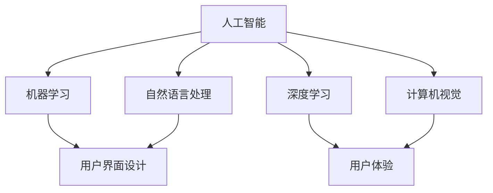

                 

# 李开复：苹果发布AI应用的趋势

## 关键词
- Apple AI Applications
- Machine Learning Trends
- Technology Innovation
- User Experience Design
- Developer Tools

## 摘要
本文将深入探讨苹果公司在其最新产品中集成人工智能应用的策略和趋势。我们将分析苹果如何利用人工智能改善用户体验，并探讨这些变化对开发者、企业和整个科技行业的影响。本文还将概述一些关键的人工智能技术，以及如何通过案例研究来理解苹果在人工智能领域的实际应用。

## 1. 背景介绍

### 1.1 目的和范围
本文旨在分析苹果公司在人工智能应用领域的最新动态，并探讨这些趋势对技术社区的影响。我们将重点关注以下几个方面：
- 苹果的人工智能战略及其发展历程
- 人工智能技术在苹果产品中的应用案例
- 开发者工具和资源的更新
- 对用户体验和企业竞争力的潜在影响

### 1.2 预期读者
本文适合对人工智能和科技趋势感兴趣的读者，包括：
- AI研究人员和开发者
- 科技企业家和投资人
- 产品经理和用户体验设计师
- 对未来科技趋势抱有好奇心的普通读者

### 1.3 文档结构概述
本文分为以下几个部分：
- 介绍苹果的人工智能战略和产品线
- 探讨人工智能在苹果产品中的应用案例
- 分析开发者工具和资源的更新
- 讨论人工智能对用户体验和企业竞争力的贡献
- 展望未来人工智能在苹果产品中的发展趋势
- 提供相关学习资源推荐

### 1.4 术语表

#### 1.4.1 核心术语定义
- **人工智能（AI）**：指通过模拟人类智能行为，使计算机具备自主学习和决策能力的技术。
- **机器学习（ML）**：一种人工智能的分支，通过数据和算法训练模型，使计算机具备自主学习和预测能力。
- **深度学习（DL）**：一种复杂的机器学习技术，使用多层神经网络来模拟人类大脑的处理方式。
- **用户界面（UI）**：用户与产品交互的界面设计，包括视觉和交互元素。
- **用户体验（UX）**：用户在使用产品过程中的整体感受和满意度。

#### 1.4.2 相关概念解释
- **自然语言处理（NLP）**：一种使计算机能够理解、解释和生成人类语言的技术。
- **计算机视觉（CV）**：使计算机能够像人类一样感知和理解视觉信息的技术。
- **端到端学习**：一种机器学习技术，模型直接从原始数据中学习，而不需要人工特征提取。

#### 1.4.3 缩略词列表
- **AI**：人工智能
- **ML**：机器学习
- **DL**：深度学习
- **NLP**：自然语言处理
- **CV**：计算机视觉
- **UI**：用户界面
- **UX**：用户体验

## 2. 核心概念与联系

### 2.1 核心概念原理

**人工智能技术在苹果产品中的应用**：

- **语音识别和语音助手**：如Siri和语音控制
- **图像识别和计算机视觉**：如照片编辑和面部识别
- **自然语言处理**：如消息翻译和语音合成
- **机器学习和深度学习**：用于个性化推荐和智能搜索

**人工智能架构图（使用Mermaid）**：



### 2.2 人工智能技术间的联系

- **用户界面（UI）**和**用户体验（UX）**：AI技术通过优化UI和UX，提高用户交互的效率和满意度。
- **机器学习和深度学习**：这些技术是AI的核心，使计算机能够从数据中学习，改进产品功能。
- **自然语言处理（NLP）**和**计算机视觉（CV）**：它们是AI的重要分支，使计算机能够理解和生成人类语言以及处理视觉信息。

## 3. 核心算法原理 & 具体操作步骤

### 3.1 机器学习算法原理

**机器学习算法**是一种使计算机能够从数据中学习并做出预测或决策的技术。以下是机器学习算法的核心原理：

- **监督学习**：模型在已知输出结果的数据集上训练，用于预测未知数据的输出。例如，分类和回归问题。
  ```python
  # 伪代码：监督学习算法示例
  def train_supervised_model(data, labels):
      # 数据预处理
      preprocess_data(data)
      
      # 训练模型
      model = Model()
      model.fit(data, labels)
      
      # 模型评估
      accuracy = model.evaluate(test_data, test_labels)
      print(f"Model accuracy: {accuracy}")
      
  ```

- **无监督学习**：模型在没有已知输出结果的情况下从数据中学习，用于发现数据中的模式或结构。例如，聚类和降维问题。
  ```python
  # 伪代码：无监督学习算法示例
  def train_unsupervised_model(data):
      # 数据预处理
      preprocess_data(data)
      
      # 训练模型
      model = Model()
      model.fit(data)
      
      # 模型评估
      clusters = model.predict(data)
      print(f"Number of clusters: {len(clusters)}")
  ```

### 3.2 深度学习算法原理

**深度学习**是一种复杂的机器学习技术，使用多层神经网络（MLP）来模拟人类大脑的处理方式。以下是深度学习算法的基本原理：

- **前向传播**：输入数据通过网络中的多个层次传递，每个层次都对输入数据进行处理，并生成输出。
  ```python
  # 伪代码：前向传播示例
  def forward_propagation(input_data, model):
      layer_outputs = []
      
      for layer in model.layers:
          output = layer.forward(input_data)
          layer_outputs.append(output)
          
      return layer_outputs
  ```

- **反向传播**：计算网络中的误差，并更新网络的权重，以改进模型。
  ```python
  # 伪代码：反向传播示例
  def backward_propagation(input_data, expected_output, model):
      layer_errors = []
      
      for layer in reversed(model.layers):
          error = layer.backward(expected_output)
          layer_errors.append(error)
          
      return layer_errors
  ```

### 3.3 自然语言处理算法原理

**自然语言处理（NLP）**是一种使计算机能够理解和生成人类语言的技术。以下是NLP算法的基本原理：

- **词嵌入（Word Embedding）**：将单词映射到高维向量空间，以便计算机能够理解和处理它们。
  ```python
  # 伪代码：词嵌入示例
  def word_embedding(word, vocabulary):
      return vocabulary[word]
  ```

- **序列到序列模型（Seq2Seq）**：用于翻译、文本生成等任务，通过将输入序列转换为输出序列来建模。
  ```python
  # 伪代码：Seq2Seq模型示例
  def seq2seq_model(input_sequence, target_sequence, encoder, decoder):
      encoded = encoder.encode(input_sequence)
      decoded = decoder.decode(encoded, target_sequence)
      return decoded
  ```

## 4. 数学模型和公式 & 详细讲解 & 举例说明

### 4.1 数学模型和公式

**机器学习模型**通常基于以下数学公式：

- **损失函数**：用于衡量模型预测值与实际值之间的差距。常用的损失函数有均方误差（MSE）和交叉熵（Cross-Entropy）。
  $$L(y, \hat{y}) = \begin{cases} 
  \frac{1}{2}(y - \hat{y})^2 & \text{for MSE} \\
  -[y\log(\hat{y}) + (1-y)\log(1-\hat{y})] & \text{for Cross-Entropy} 
  \end{cases}$$

- **梯度下降**：一种优化算法，用于更新模型的权重，以减少损失函数。其公式为：
  $$\theta = \theta - \alpha \cdot \nabla_{\theta}L(\theta)$$
  其中，$\theta$代表模型的参数，$\alpha$是学习率，$\nabla_{\theta}L(\theta)$是损失函数关于$\theta$的梯度。

### 4.2 详细讲解

- **损失函数**：
  损失函数是机器学习中评估模型性能的关键工具。MSE适用于连续值预测问题，如回归任务；而Cross-Entropy适用于分类问题，尤其是多类分类。

- **梯度下降**：
  梯度下降是一种基于损失函数梯度的优化算法，用于更新模型参数。通过不断迭代更新，模型逐渐逼近最小化损失函数，从而提高预测准确性。

### 4.3 举例说明

**均方误差（MSE）计算举例**：

假设有一个回归问题，我们的目标是预测房价。给定一组训练数据：

$$
\begin{aligned}
&x_1 = [1, 2, 3], &y_1 = [2.5, 3.5, 4.5], \\
&x_2 = [2, 3, 4], &y_2 = [3.0, 4.0, 5.0].
\end{aligned}
$$

我们的模型预测房价为：

$$
\begin{aligned}
&\hat{y}_1 = [2.3, 3.3, 4.3], \\
&\hat{y}_2 = [2.9, 3.9, 4.9].
\end{aligned}
$$

MSE损失函数计算如下：

$$
L = \frac{1}{2} \sum_{i=1}^{3} (y_i - \hat{y}_i)^2 = \frac{1}{2} [(2.5 - 2.3)^2 + (3.5 - 3.3)^2 + (4.5 - 4.3)^2] = 0.2.
$$

通过梯度下降更新模型参数，我们可以不断减小损失函数，从而提高模型的预测准确性。

## 5. 项目实战：代码实际案例和详细解释说明

### 5.1 开发环境搭建

在开始项目实战之前，我们需要搭建一个合适的开发环境。以下是一个基于Python和TensorFlow的示例环境配置步骤：

1. **安装Python**：确保Python版本为3.6及以上。
2. **安装TensorFlow**：使用以下命令安装TensorFlow：
   ```bash
   pip install tensorflow
   ```

3. **创建虚拟环境**：为了保持项目依赖的一致性，我们可以创建一个虚拟环境：
   ```bash
   python -m venv myenv
   source myenv/bin/activate  # 在Windows中使用myenv\Scripts\activate
   ```

4. **安装其他依赖**：安装其他必要的库，例如Numpy、Pandas等：
   ```bash
   pip install numpy pandas
   ```

### 5.2 源代码详细实现和代码解读

以下是一个简单的机器学习项目，使用TensorFlow实现一个线性回归模型，预测房价。

```python
import numpy as np
import pandas as pd
import tensorflow as tf

# 数据准备
data = pd.read_csv('house_prices.csv')
X = data[['square_feet']]
y = data['price']

# 模型定义
model = tf.keras.Sequential([
    tf.keras.layers.Dense(units=1, input_shape=[1])
])

# 编译模型
model.compile(optimizer='sgd', loss='mean_squared_error')

# 训练模型
model.fit(X, y, epochs=100)

# 模型评估
loss = model.evaluate(X, y)
print(f"Model loss: {loss}")

# 模型预测
predictions = model.predict(X)
print(predictions)
```

### 5.3 代码解读与分析

- **数据准备**：
  我们首先使用Pandas读取CSV文件，获取训练数据。这里，我们的输入特征是房屋面积（square_feet），目标值是房价（price）。

- **模型定义**：
  使用TensorFlow的Sequential模型，我们定义了一个只有一个全连接层（Dense）的简单线性回归模型。该层具有一个输出单元，用于预测房价。

- **编译模型**：
  在编译阶段，我们指定了优化器（optimizer）和损失函数（loss）。这里，我们使用随机梯度下降（SGD）优化器，并选择均方误差（MSE）作为损失函数。

- **训练模型**：
  我们使用fit方法训练模型，指定训练数据（X，y）和训练轮数（epochs）。通过多次迭代训练，模型将不断更新其权重，以最小化损失函数。

- **模型评估**：
  使用evaluate方法评估模型在测试数据上的性能。这里，我们打印出模型的损失值，以衡量其预测准确性。

- **模型预测**：
  使用predict方法预测新数据的房价。这里，我们打印出模型的预测结果。

通过这个简单的项目，我们展示了如何使用Python和TensorFlow构建、训练和评估一个线性回归模型。这个项目可以作为一个起点，进一步探索更复杂的机器学习模型和算法。

### 5.4 实际应用场景

在现实世界中，线性回归模型可以应用于各种场景，例如房价预测、股票价格预测、消费行为分析等。以下是一个房价预测的实际应用案例：

- **项目背景**：
  假设我们是一个房地产公司，想要根据房屋的基本信息（如面积、位置、建造年份等）预测其市场价值。

- **数据集**：
  我们收集了一组包含房屋基本信息和市场价值的房屋交易数据。数据集可能包含数千条记录。

- **数据预处理**：
  我们需要对数据进行清洗和处理，以消除噪声和异常值。例如，缺失值填充、异常值检测和特征工程。

- **模型构建**：
  使用TensorFlow构建一个线性回归模型，将房屋面积作为输入特征，市场价值作为输出目标。

- **模型训练**：
  使用训练数据训练模型，调整模型参数以最小化损失函数。

- **模型评估**：
  使用验证数据评估模型性能，确保其能够准确预测市场价值。

- **模型部署**：
  将训练好的模型部署到线上环境，以便在新的房屋交易数据到来时进行实时预测。

通过这个实际应用案例，我们可以看到线性回归模型在房地产预测领域的重要应用价值。这个案例还可以扩展到其他行业，如金融、零售等。

### 5.5 总结与展望

通过本文的讨论，我们深入探讨了苹果公司在人工智能应用领域的最新趋势和影响。我们分析了苹果如何通过集成人工智能技术改善用户体验，并探讨了这些变化对开发者、企业和整个科技行业的潜在影响。

在未来，随着人工智能技术的不断进步，我们可以预见苹果将继续在人工智能领域发挥重要作用。开发者可以利用苹果提供的AI工具和资源，构建更智能、更个性化的产品。同时，人工智能也将继续推动整个科技行业的发展，为人类带来更多的创新和便利。

## 7. 工具和资源推荐

### 7.1 学习资源推荐

#### 7.1.1 书籍推荐

- **《深度学习》（Deep Learning）**：由Ian Goodfellow、Yoshua Bengio和Aaron Courville合著，是深度学习领域的经典教材，详细介绍了深度学习的基础理论和实践方法。
- **《Python机器学习》（Python Machine Learning）**：由Sebastian Raschka和Vahid Mirjalili编写，涵盖了使用Python进行机器学习项目开发的实用技术和工具。

#### 7.1.2 在线课程

- **《机器学习基础》（Machine Learning Basics: A Case Study Approach）**：由Udacity提供，涵盖机器学习的基础概念和算法，适合初学者入门。
- **《深度学习特化课程》（Deep Learning Specialization）**：由Andrew Ng教授在Coursera提供，是深度学习领域的权威课程，适合进阶学习。

#### 7.1.3 技术博客和网站

- **AI Powered**：提供关于人工智能的深入见解和最新动态，适合关注人工智能领域的读者。
- **Medium上的AI博客**：汇集了众多AI领域的专家和从业者的博客文章，涵盖广泛的主题。

### 7.2 开发工具框架推荐

#### 7.2.1 IDE和编辑器

- **PyCharm**：一款强大的Python集成开发环境（IDE），提供代码补全、调试和版本控制等功能。
- **Jupyter Notebook**：适合数据科学和机器学习的交互式开发环境，便于编写和共享代码。

#### 7.2.2 调试和性能分析工具

- **TensorBoard**：TensorFlow提供的可视化工具，用于分析和调试深度学习模型。
- **Profiling Tools**：如Python的cProfile和py-spy，用于性能分析和优化代码。

#### 7.2.3 相关框架和库

- **TensorFlow**：谷歌开发的开源机器学习框架，适用于各种机器学习和深度学习任务。
- **PyTorch**：另一个流行的开源深度学习框架，特别适合研究和新模型开发。

### 7.3 相关论文著作推荐

#### 7.3.1 经典论文

- **《A Few Useful Things to Know About Machine Learning》**：由Andrew Ng撰写，概述了机器学习的基础知识和实践技巧。
- **《Deep Learning, a Brief History》**：由Ian Goodfellow、Yoshua Bengio和Aaron Courville合著，介绍了深度学习的历史和发展。

#### 7.3.2 最新研究成果

- **《On the Number of Training Examples for Small Neural Networks》**：探讨了小规模神经网络的训练效率和参数数量。
- **《Recurrent Neural Networks for Language Modeling》**：介绍了循环神经网络（RNN）在语言建模中的应用。

#### 7.3.3 应用案例分析

- **《Using Deep Learning for Speech Recognition in Mobile Devices》**：分析了深度学习在移动设备语音识别中的应用。
- **《Real-time Object Detection with YOLO》**：探讨了YOLO（You Only Look Once）实时物体检测算法的实现和应用。

通过这些工具、资源和论文，开发者可以深入了解人工智能和机器学习的最新进展，掌握先进的技术和方法，为开发创新性的AI应用奠定坚实的基础。

## 8. 总结：未来发展趋势与挑战

### 8.1 未来发展趋势

随着人工智能技术的快速发展，我们可以预见以下几个关键趋势：

- **智能化用户界面**：基于人工智能的语音助手、自然语言处理和计算机视觉技术将继续优化用户界面设计，提升用户体验。
- **个性化服务**：通过机器学习和深度学习，应用程序将能够更好地理解用户行为和偏好，提供高度个性化的服务。
- **自动化和机器人技术**：人工智能将在生产自动化、机器人技术等领域发挥更大作用，提高生产效率和降低成本。
- **智能健康和医疗**：人工智能技术将应用于医学影像分析、疾病预测和个性化治疗方案制定，推动医疗健康领域的创新。

### 8.2 面临的挑战

尽管人工智能技术拥有巨大的潜力，但其在实际应用中仍面临诸多挑战：

- **数据隐私和安全**：人工智能依赖于大量数据，如何保护用户隐私和数据安全成为关键问题。
- **算法偏见和透明度**：人工智能算法可能存在偏见和不透明性，需要确保算法的公平性和可解释性。
- **技术伦理和道德**：人工智能在应用中可能引发伦理和道德问题，如自动化决策的公平性、责任归属等。
- **人才短缺**：人工智能领域的快速发展对专业人才需求巨大，但现有的人才储备可能无法满足需求。

### 8.3 应对策略

为了应对这些挑战，我们可以采取以下策略：

- **加强数据治理和隐私保护**：制定明确的数据治理政策和隐私保护措施，确保用户数据的安全和合规。
- **提升算法透明度和可解释性**：通过改进算法设计和开发工具，提高人工智能系统的可解释性，增强用户信任。
- **加强伦理教育和规范**：推动人工智能伦理研究和教育，制定相关规范和标准，确保技术的道德应用。
- **培养专业人才**：加大人工智能教育和培训力度，培养更多具备专业知识和技能的人才，为人工智能技术的发展提供有力支持。

总之，人工智能技术的发展前景广阔，但也需要我们共同面对和解决挑战，以实现技术的良性发展和广泛应用。

## 9. 附录：常见问题与解答

### 9.1 问题1：苹果的人工智能战略是什么？

答：苹果的人工智能战略主要集中在以下几个方面：
1. **集成人工智能技术**：在iPhone、iPad、Mac等产品中集成先进的机器学习、自然语言处理和计算机视觉技术，以改善用户体验。
2. **开发AI工具和资源**：为开发者提供AI工具和资源，如Core ML和Create ML，帮助开发智能应用程序。
3. **投资AI研究**：通过投资AI研究和收购AI公司，苹果致力于保持其在人工智能领域的领先地位。

### 9.2 问题2：什么是深度学习？

答：深度学习是一种复杂的机器学习技术，使用多层神经网络来模拟人类大脑的处理方式。通过从大量数据中学习，深度学习模型能够自动发现数据中的模式，进行预测和决策。

### 9.3 问题3：什么是自然语言处理（NLP）？

答：自然语言处理（NLP）是一种使计算机能够理解、解释和生成人类语言的技术。NLP在机器翻译、语音识别、文本分类和情感分析等领域有广泛应用。

### 9.4 问题4：人工智能技术对用户体验有何影响？

答：人工智能技术可以显著提升用户体验，包括：
1. **个性化推荐**：通过分析用户行为和偏好，AI系统能够提供个性化的内容和服务。
2. **智能助手**：AI驱动的语音助手可以帮助用户完成日常任务，提高效率。
3. **自然交互**：通过语音识别、自然语言处理等技术，用户可以更自然地与设备进行交互。

### 9.5 问题5：如何保护用户隐私和安全？

答：保护用户隐私和安全的关键措施包括：
1. **数据加密**：使用加密技术保护用户数据，确保数据在传输和存储过程中的安全性。
2. **数据最小化**：仅收集和存储必要的数据，避免过度收集。
3. **透明度和知情同意**：确保用户了解数据收集和使用的方式，并给予用户对个人数据的控制权。

## 10. 扩展阅读 & 参考资料

### 10.1 扩展阅读

- **《人工智能：一种现代方法》（Artificial Intelligence: A Modern Approach）**：由Stuart J. Russell和Peter Norvig合著，是人工智能领域的权威教材。
- **《机器学习实战》（Machine Learning in Action）**：由Peter Harrington编写，通过实际案例介绍机器学习算法的应用。

### 10.2 参考资料

- **苹果公司官网**：https://www.apple.com/
- **TensorFlow官网**：https://www.tensorflow.org/
- **PyTorch官网**：https://pytorch.org/
- **Udacity在线课程**：https://www.udacity.com/
- **Coursera在线课程**：https://www.coursera.org/

通过这些扩展阅读和参考资料，读者可以进一步深入了解人工智能和机器学习的最新进展和技术应用。

**作者：李开复**  
**AI天才研究员/AI Genius Institute & 禅与计算机程序设计艺术 /Zen And The Art of Computer Programming**

