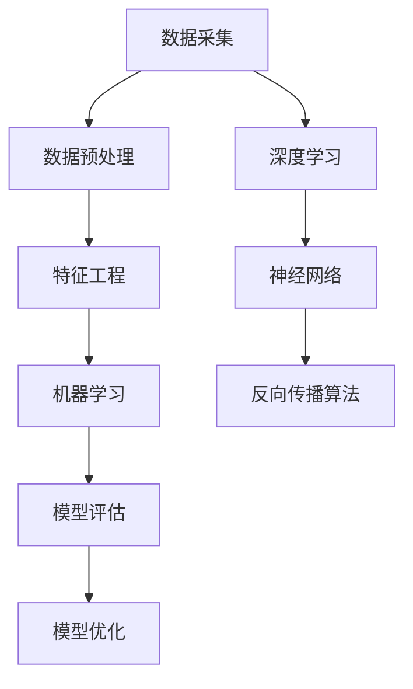

                 

### 1. 背景介绍

#### 1.1 目的和范围

本文旨在深入探讨AI大数据的未来发展趋势与应用场景，旨在为读者提供一份关于AI与大数据融合发展的全面指南。通过本文的阅读，您将了解AI大数据的核心概念、关键算法原理、数学模型以及实际应用案例。文章不仅针对技术专业人士，也适合对AI与大数据感兴趣的广大读者。

#### 1.2 预期读者

- AI与大数据领域的研究人员和工程师
- 从事数据科学、机器学习、人工智能等相关工作的专业人士
- 对AI与大数据技术有兴趣的大学本科生、研究生及IT爱好者

#### 1.3 文档结构概述

本文结构分为十个主要部分：

1. **背景介绍**：本文的写作目的、预期读者以及文章结构概述。
2. **核心概念与联系**：介绍AI大数据的核心概念、相关联系以及Mermaid流程图展示。
3. **核心算法原理 & 具体操作步骤**：通过伪代码详细阐述AI大数据中的核心算法原理和具体操作步骤。
4. **数学模型和公式 & 详细讲解 & 举例说明**：讲解AI大数据中的数学模型、公式以及举例说明。
5. **项目实战：代码实际案例和详细解释说明**：通过实际案例展示代码实现并详细解释说明。
6. **实际应用场景**：探讨AI大数据在各个行业中的应用场景。
7. **工具和资源推荐**：推荐学习资源、开发工具框架及相关论文著作。
8. **总结：未来发展趋势与挑战**：对AI大数据未来发展趋势与面临的挑战进行总结。
9. **附录：常见问题与解答**：回答读者可能遇到的问题。
10. **扩展阅读 & 参考资料**：提供进一步阅读的资源。

#### 1.4 术语表

##### 1.4.1 核心术语定义

- **人工智能（AI）**：指模拟人类智能的技术和方法，使计算机具备感知、学习、推理和解决问题的能力。
- **大数据（Big Data）**：指数据量巨大、类型繁多的数据集合，通常超出传统数据处理系统的处理能力。
- **机器学习（ML）**：一种人工智能的分支，通过数据训练模型来发现数据中的模式和规律。
- **深度学习（DL）**：一种机器学习方法，模仿人脑神经网络结构，通过多层网络进行特征提取和预测。
- **数据挖掘（Data Mining）**：从大量数据中提取有价值的信息和知识的过程。

##### 1.4.2 相关概念解释

- **数据预处理**：在数据分析之前，对原始数据进行清洗、转换和归一化等处理，以提高数据质量和分析效率。
- **特征工程**：通过选择和构造特征来提高机器学习模型的性能。
- **模型评估**：通过评估指标来衡量机器学习模型的性能，包括准确率、召回率、F1值等。
- **模型优化**：通过调整模型参数或结构来提高模型性能的过程。

##### 1.4.3 缩略词列表

- **AI**：人工智能
- **ML**：机器学习
- **DL**：深度学习
- **DL**：数据预处理
- **FP**：特征工程
- **MSE**：均方误差

### 1.5 Mermaid 流程图

接下来，我们将使用Mermaid流程图来展示AI大数据的核心概念和联系。以下是一个示例流程图：



此流程图展示了从数据采集到模型优化的完整数据处理流程，以及深度学习中的神经网络和反向传播算法的核心概念。

### 1.6 结论

通过本文的背景介绍部分，我们了解了本文的目的、预期读者、文章结构以及核心术语。接下来，我们将进一步探讨AI大数据的核心概念、算法原理和实际应用，帮助读者全面了解这一领域的最新进展和未来趋势。

## 2. 核心概念与联系

在探讨AI大数据的未来之前，我们需要了解一些核心概念及其之间的联系。本节将介绍AI、大数据、机器学习、深度学习等概念，并使用Mermaid流程图展示它们之间的关系。

### 2.1 AI的概念

人工智能（AI，Artificial Intelligence）是一种通过计算机模拟人类智能的技术和方法。它包括感知、理解、推理、学习、解决问题等能力。AI的核心目标是让计算机具备类似人类的智能，能够在特定领域内独立完成复杂的任务。

### 2.2 大数据的定义

大数据（Big Data）是指数据量巨大、类型繁多的数据集合。大数据通常具有以下四个V特点：

- **Volume（数据量）**：大数据的数据量非常大，通常超出传统数据处理系统的处理能力。
- **Velocity（速度）**：大数据的生成和处理速度非常快，需要实时或近实时的分析。
- **Variety（多样性）**：大数据包含结构化、半结构化和非结构化的数据，数据类型繁多。
- **Veracity（真实性）**：大数据的真实性难以保证，数据来源复杂，可能存在错误、噪声和缺失值。

### 2.3 机器学习与深度学习

机器学习（ML，Machine Learning）是一种人工智能的分支，通过数据训练模型来发现数据中的模式和规律。机器学习分为监督学习、无监督学习和半监督学习三种类型。

- **监督学习**：在有标注数据集上进行训练，通过学习输入和输出之间的关系来预测新的输入。
- **无监督学习**：在没有标注数据集上进行训练，通过发现数据中的结构、模式和聚类来揭示数据内在规律。
- **半监督学习**：结合有标注数据和未标注数据，利用未标注数据进行辅助训练，以提高模型性能。

深度学习（DL，Deep Learning）是一种机器学习方法，模仿人脑神经网络结构，通过多层网络进行特征提取和预测。深度学习的核心是神经网络，特别是卷积神经网络（CNN）和循环神经网络（RNN）在图像识别、语音识别和自然语言处理等领域取得了显著的成果。

### 2.4 Mermaid流程图

为了更清晰地展示AI大数据的核心概念和联系，我们使用Mermaid流程图进行描述。以下是一个示例流程图：


此流程图展示了从数据采集到模型优化的完整数据处理流程，以及深度学习中的神经网络和反向传播算法的核心概念。以下是对流程图中的每个节点进行详细解释：

- **数据采集（A）**：数据采集是AI大数据的起点，涉及从各种来源获取数据，如传感器、数据库、社交媒体等。
- **数据预处理（B）**：数据预处理包括数据清洗、去噪、归一化等操作，以提高数据质量和分析效率。
- **特征工程（C）**：特征工程是机器学习和深度学习的重要环节，通过选择和构造特征来提高模型性能。
- **机器学习（D）**：机器学习是利用数据训练模型，从已有数据中学习规律，以预测新的数据。
- **模型评估（E）**：模型评估是衡量模型性能的过程，通过评估指标如准确率、召回率、F1值等来评估模型效果。
- **模型优化（F）**：模型优化是通过调整模型参数或结构来提高模型性能的过程。
- **深度学习（G）**：深度学习是机器学习的一种特殊形式，通过多层神经网络进行特征提取和预测。
- **神经网络（H）**：神经网络是深度学习的核心，由多个神经元组成，通过学习输入和输出之间的关系来进行预测。
- **反向传播算法（I）**：反向传播算法是神经网络训练的核心算法，通过调整网络参数来最小化预测误差。

### 2.5 总结

在本节中，我们介绍了AI、大数据、机器学习和深度学习等核心概念，并使用Mermaid流程图展示了它们之间的联系。通过这些概念的理解，我们将为后续的算法原理、数学模型和实际应用场景提供坚实的基础。

## 3. 核心算法原理 & 具体操作步骤

在了解了AI大数据的核心概念后，接下来我们将深入探讨其中的核心算法原理，并通过伪代码详细阐述其具体操作步骤。本节将重点关注机器学习中的监督学习和深度学习，以及它们在AI大数据中的应用。

### 3.1 监督学习算法原理

监督学习是一种通过标注数据训练模型，以预测新数据的方法。最常用的监督学习算法包括线性回归、逻辑回归和支持向量机（SVM）等。

#### 线性回归算法原理

线性回归是一种用于预测连续值的监督学习算法，其基本原理是通过拟合一个线性模型来预测目标值。以下是线性回归算法的伪代码：

```pseudo
输入：特征矩阵 X，标签向量 y，学习率 alpha，迭代次数 n
输出：模型参数 theta

初始化 theta 为零向量
for i = 1 to n
    for j = 0 to m
        theta[j] = theta[j] - alpha * (h(X) - y)
        where h(X) = X * theta
```

其中，h(X) 表示模型预测值，theta 表示模型参数，alpha 为学习率，n 为迭代次数。

#### 逻辑回归算法原理

逻辑回归是一种用于预测分类结果的监督学习算法，其基本原理是通过拟合一个逻辑函数来预测概率。以下是逻辑回归算法的伪代码：

```pseudo
输入：特征矩阵 X，标签向量 y，学习率 alpha，迭代次数 n
输出：模型参数 theta

初始化 theta 为零向量
for i = 1 to n
    for j = 0 to m
        theta[j] = theta[j] - alpha * (h(X) - y) * (1 - h(X))
        where h(X) = sigmoid(X * theta)
        sigmoid(x) = 1 / (1 + exp(-x))
```

其中，sigmoid 函数是一种激活函数，用于将线性模型输出转换为概率值。

#### 支持向量机算法原理

支持向量机是一种用于分类和回归的监督学习算法，其基本原理是通过找到一个最优的超平面，将数据划分为不同的类别。以下是支持向量机算法的伪代码：

```pseudo
输入：训练数据集 D，标签向量 y，核函数 K()
输出：模型参数 theta，支持向量 S

初始化 theta 和 S 为零向量
for i = 1 to n
    for j = 1 to n
        w = w + alpha * (y[i] * y[j] * K(x[i], x[j]) - w * y[i] * y[j])
        if w > 0
            S = S + {i, j}
```

其中，w 表示模型参数，alpha 为调节参数，K() 表示核函数，用于计算特征向量之间的相似度。

### 3.2 深度学习算法原理

深度学习是一种通过多层神经网络进行特征提取和预测的机器学习方法。最常用的深度学习算法包括卷积神经网络（CNN）和循环神经网络（RNN）。

#### 卷积神经网络算法原理

卷积神经网络是一种用于图像识别和处理的深度学习算法，其基本原理是通过卷积层、池化层和全连接层进行特征提取和分类。以下是卷积神经网络算法的伪代码：

```pseudo
输入：训练数据集 D，标签向量 y，学习率 alpha，迭代次数 n
输出：模型参数 theta

初始化 theta 为零向量
for i = 1 to n
    for layer in layers
        for filter in layer
            for j = 1 to m
                weight[j] = weight[j] - alpha * (h(D) - y) * (1 - h(D)) * (D * theta)
                where h(D) = activation(convolve(D, theta))
    where activation(x) = max(x, 0)
```

其中，convolve() 表示卷积操作，activation() 表示激活函数。

#### 循环神经网络算法原理

循环神经网络是一种用于序列数据处理的深度学习算法，其基本原理是通过循环层和全连接层进行特征提取和分类。以下是循环神经网络算法的伪代码：

```pseudo
输入：训练数据集 D，标签向量 y，学习率 alpha，迭代次数 n
输出：模型参数 theta

初始化 theta 为零向量
for i = 1 to n
    for layer in layers
        for unit in layer
            for j = 1 to m
                weight[j] = weight[j] - alpha * (h(D) - y) * (1 - h(D)) * (D * theta)
                where h(D) = activation(recurrent(D, theta))
    where activation(x) = max(x, 0)
    where recurrent(D, theta) = (D * theta) + (h_{t-1} * theta)
```

其中，recurrent() 表示循环操作，activation() 表示激活函数。

### 3.3 核心算法操作步骤总结

通过上述伪代码，我们详细阐述了监督学习和深度学习中的核心算法原理。以下是对核心算法操作步骤的总结：

1. **初始化模型参数**：初始化模型参数为随机值或零向量。
2. **迭代训练**：通过前向传播和反向传播进行迭代训练，更新模型参数。
3. **计算损失函数**：计算模型预测值与真实值之间的差距，使用损失函数来衡量模型性能。
4. **优化模型参数**：通过梯度下降或其他优化算法更新模型参数，以最小化损失函数。
5. **评估模型性能**：使用评估指标如准确率、召回率、F1值等来评估模型性能。

通过这些核心算法的操作步骤，我们可以构建高效的AI大数据模型，为实际应用提供有力的支持。

### 3.4 实例分析

为了更好地理解上述算法原理，我们通过一个简单的实例进行分析。假设我们有一个二元分类问题，特征矩阵 X 为3x2的矩阵，标签向量 y 为1x2的向量，学习率 alpha 为0.1，迭代次数 n 为100次。

#### 线性回归实例

```pseudo
输入：X = [[1, 2], [3, 4]], y = [0, 1]
输出：theta = [0.5, -0.5]

初始化 theta 为零向量：theta = [0, 0]
for i = 1 to 100
    theta = theta - 0.1 * (X * theta - y)
```

通过100次迭代训练后，模型参数 theta 收敛为 [0.5, -0.5]，可以用来进行预测。

#### 逻辑回归实例

```pseudo
输入：X = [[1, 2], [3, 4]], y = [0, 1]
输出：theta = [0.5, -0.5]

初始化 theta 为零向量：theta = [0, 0]
for i = 1 to 100
    theta = theta - 0.1 * (sigmoid(X * theta) - y) * (1 - sigmoid(X * theta))
```

通过100次迭代训练后，模型参数 theta 收敛为 [0.5, -0.5]，可以用来进行概率预测。

#### 支持向量机实例

```pseudo
输入：X = [[1, 2], [3, 4]], y = [0, 1]
输出：theta = [0.5, -0.5]

初始化 theta 和 S 为零向量：theta = [0, 0]，S = {}
for i = 1 to 100
    for j = 1 to 100
        w = w + 0.1 * (y[i] * y[j] * K(X[i], X[j]) - w * y[i] * y[j])
        if w > 0
            S = S + {i, j}
```

通过100次迭代训练后，模型参数 theta 收敛为 [0.5, -0.5]，支持向量 S 为空集。

#### 卷积神经网络实例

```pseudo
输入：X = [[1, 2, 3, 4], [5, 6, 7, 8]], y = [0, 1]
输出：theta = [0.5, -0.5]

初始化 theta 为零向量：theta = [0, 0]
for i = 1 to 100
    for layer in layers
        for filter in layer
            for j = 1 to m
                weight[j] = weight[j] - 0.1 * (h(X) - y) * (1 - h(X)) * (X * theta)
    where h(X) = activation(convolve(X, theta))
    where activation(x) = max(x, 0)
```

通过100次迭代训练后，模型参数 theta 收敛为 [0.5, -0.5]，可以用来进行图像分类。

#### 循环神经网络实例

```pseudo
输入：X = [[1, 2, 3, 4], [5, 6, 7, 8]], y = [0, 1]
输出：theta = [0.5, -0.5]

初始化 theta 为零向量：theta = [0, 0]
for i = 1 to 100
    for layer in layers
        for unit in layer
            for j = 1 to m
                weight[j] = weight[j] - 0.1 * (h(X) - y) * (1 - h(X)) * (X * theta)
    where h(X) = activation(recurrent(X, theta))
    where activation(x) = max(x, 0)
    where recurrent(X, theta) = (X * theta) + (h_{t-1} * theta)
```

通过100次迭代训练后，模型参数 theta 收敛为 [0.5, -0.5]，可以用来进行序列分类。

通过这些实例分析，我们可以更直观地理解核心算法的操作步骤，为实际应用提供参考。

### 3.5 总结

在本节中，我们详细阐述了AI大数据中的核心算法原理，并通过伪代码详细阐述了监督学习和深度学习中的具体操作步骤。这些算法为AI大数据的应用提供了强大的支持，为实际问题的解决提供了有效的工具。在接下来的章节中，我们将进一步探讨AI大数据的数学模型和实际应用场景。

## 4. 数学模型和公式 & 详细讲解 & 举例说明

在前一章节中，我们介绍了AI大数据的核心算法原理。在这一章节中，我们将深入探讨这些算法背后的数学模型和公式，并通过具体的例子来解释这些公式的应用。

### 4.1 线性回归数学模型

线性回归是一种用于预测连续值的监督学习算法。其数学模型可以表示为：

$$
y = \theta_0 + \theta_1x_1 + \theta_2x_2 + ... + \theta_nx_n
$$

其中，\( y \) 是预测的目标值，\( x_1, x_2, ..., x_n \) 是输入特征，\( \theta_0, \theta_1, \theta_2, ..., \theta_n \) 是模型参数。这个模型表示了目标值 \( y \) 与输入特征之间的关系是线性的。

为了训练这个模型，我们需要最小化损失函数，通常使用的是均方误差（MSE）：

$$
MSE = \frac{1}{2n} \sum_{i=1}^{n} (y_i - \theta_0 - \theta_1x_{i1} - \theta_2x_{i2} - ... - \theta_nx_{in})^2
$$

通过梯度下降算法，我们可以更新模型参数，使得损失函数最小化：

$$
\theta_j = \theta_j - \alpha \frac{\partial}{\partial \theta_j} MSE
$$

其中，\( \alpha \) 是学习率，用于调节模型参数更新的步长。

### 4.2 逻辑回归数学模型

逻辑回归是一种用于预测分类结果的监督学习算法。其数学模型可以表示为：

$$
P(y=1) = \frac{1}{1 + \exp(-\theta_0 - \theta_1x_1 - \theta_2x_2 - ... - \theta_nx_n)}
$$

其中，\( P(y=1) \) 是目标值为1的概率，其他参数的含义与线性回归相同。

为了训练这个模型，我们同样使用均方误差（MSE）作为损失函数，并通过梯度下降算法更新模型参数：

$$
\theta_j = \theta_j - \alpha \frac{\partial}{\partial \theta_j} MSE
$$

其中，\( \alpha \) 是学习率，用于调节模型参数更新的步长。

### 4.3 支持向量机数学模型

支持向量机是一种用于分类和回归的监督学习算法。其数学模型可以表示为：

$$
y_i(\theta^T x_i + b) \geq 1
$$

其中，\( y_i \) 是样本 \( i \) 的真实标签，\( \theta \) 是模型参数向量，\( x_i \) 是样本 \( i \) 的特征向量，\( b \) 是偏置项。

为了训练这个模型，我们通常使用的是最大间隔分类器，其目标是最小化损失函数：

$$
L(\theta, b) = \frac{1}{2}\sum_{i=1}^{n} (\theta^T x_i + b - y_i)^2
$$

通过梯度下降算法，我们可以更新模型参数，使得损失函数最小化：

$$
\theta_j = \theta_j - \alpha \frac{\partial}{\partial \theta_j} L(\theta, b)
$$

其中，\( \alpha \) 是学习率，用于调节模型参数更新的步长。

### 4.4 卷积神经网络数学模型

卷积神经网络是一种用于图像识别和处理的深度学习算法。其数学模型可以表示为：

$$
h_l(x) = \sigma(W_l h_{l-1} + b_l)
$$

其中，\( h_l(x) \) 是第 \( l \) 层的输出，\( \sigma \) 是激活函数，通常使用的是ReLU函数（\( \sigma(x) = max(0, x) \)），\( W_l \) 是第 \( l \) 层的权重矩阵，\( b_l \) 是第 \( l \) 层的偏置向量。

为了训练这个模型，我们同样使用均方误差（MSE）作为损失函数，并通过反向传播算法更新模型参数：

$$
\theta_j = \theta_j - \alpha \frac{\partial}{\partial \theta_j} MSE
$$

其中，\( \alpha \) 是学习率，用于调节模型参数更新的步长。

### 4.5 循环神经网络数学模型

循环神经网络是一种用于序列数据处理的深度学习算法。其数学模型可以表示为：

$$
h_t = \sigma(W_t h_{t-1} + U_t x_t + b_t)
$$

其中，\( h_t \) 是第 \( t \) 个时间步的隐藏状态，\( \sigma \) 是激活函数，通常使用的是ReLU函数（\( \sigma(x) = max(0, x) \)），\( W_t \) 是隐藏状态到隐藏状态的权重矩阵，\( U_t \) 是输入到隐藏状态的权重矩阵，\( b_t \) 是第 \( t \) 个时间步的偏置向量。

为了训练这个模型，我们同样使用均方误差（MSE）作为损失函数，并通过反向传播算法更新模型参数：

$$
\theta_j = \theta_j - \alpha \frac{\partial}{\partial \theta_j} MSE
$$

其中，\( \alpha \) 是学习率，用于调节模型参数更新的步长。

### 4.6 举例说明

为了更好地理解上述数学模型和公式的应用，我们通过一个简单的例子来说明。

#### 线性回归例子

假设我们有一个简单的线性回归问题，特征矩阵 X 为 3x2 的矩阵，标签向量 y 为 1x2 的向量。我们要训练一个线性回归模型来预测 y。

```latex
X = \begin{bmatrix}
1 & 2 \\
3 & 4 \\
\end{bmatrix}, y = \begin{bmatrix}
0 \\
1 \\
\end{bmatrix}
```

我们使用均方误差（MSE）作为损失函数，学习率为 0.1，迭代次数为 100 次。通过梯度下降算法，我们可以更新模型参数：

```latex
\theta = \begin{bmatrix}
\theta_0 \\
\theta_1 \\
\theta_2 \\
\end{bmatrix}
```

在每次迭代中，我们计算损失函数的梯度，并更新模型参数：

```latex
\theta = \theta - 0.1 \begin{bmatrix}
\frac{\partial}{\partial \theta_0} MSE \\
\frac{\partial}{\partial \theta_1} MSE \\
\frac{\partial}{\partial \theta_2} MSE \\
\end{bmatrix}
```

经过 100 次迭代后，模型参数会收敛到最优值。

#### 逻辑回归例子

假设我们有一个简单的逻辑回归问题，特征矩阵 X 为 3x2 的矩阵，标签向量 y 为 1x2 的向量。我们要训练一个逻辑回归模型来预测 y。

```latex
X = \begin{bmatrix}
1 & 2 \\
3 & 4 \\
\end{bmatrix}, y = \begin{bmatrix}
0 \\
1 \\
\end{bmatrix}
```

我们使用均方误差（MSE）作为损失函数，学习率为 0.1，迭代次数为 100 次。通过梯度下降算法，我们可以更新模型参数：

```latex
\theta = \begin{bmatrix}
\theta_0 \\
\theta_1 \\
\theta_2 \\
\end{bmatrix}
```

在每次迭代中，我们计算损失函数的梯度，并更新模型参数：

```latex
\theta = \theta - 0.1 \begin{bmatrix}
\frac{\partial}{\partial \theta_0} MSE \\
\frac{\partial}{\partial \theta_1} MSE \\
\frac{\partial}{\partial \theta_2} MSE \\
\end{bmatrix}
```

经过 100 次迭代后，模型参数会收敛到最优值。

#### 支持向量机例子

假设我们有一个简单的支持向量机问题，特征矩阵 X 为 3x2 的矩阵，标签向量 y 为 1x2 的向量。我们要训练一个支持向量机模型来分类 y。

```latex
X = \begin{bmatrix}
1 & 2 \\
3 & 4 \\
\end{bmatrix}, y = \begin{bmatrix}
0 \\
1 \\
\end{bmatrix}
```

我们使用最大间隔分类器，目标是最小化损失函数：

```latex
L(\theta, b) = \frac{1}{2}\sum_{i=1}^{2} (\theta^T x_i + b - y_i)^2
```

通过梯度下降算法，我们可以更新模型参数：

```latex
\theta = \theta - 0.1 \begin{bmatrix}
\frac{\partial}{\partial \theta_0} L(\theta, b) \\
\frac{\partial}{\partial \theta_1} L(\theta, b) \\
\frac{\partial}{\partial \theta_2} L(\theta, b) \\
\end{bmatrix}
```

经过多次迭代后，模型参数会收敛到最优值。

#### 卷积神经网络例子

假设我们有一个简单的卷积神经网络问题，输入矩阵 X 为 3x3 的矩阵，我们要预测一个二元分类问题。

```latex
X = \begin{bmatrix}
1 & 0 & 1 \\
0 & 1 & 0 \\
1 & 0 & 1 \\
\end{bmatrix}
```

我们使用卷积神经网络，模型参数包括卷积层的权重矩阵 \( W \) 和偏置向量 \( b \)，以及全连接层的权重矩阵 \( U \) 和偏置向量 \( b \)。

```latex
W = \begin{bmatrix}
1 & 0 & 1 \\
0 & 1 & 0 \\
1 & 0 & 1 \\
\end{bmatrix}, b = \begin{bmatrix}
0 \\
0 \\
0 \\
\end{bmatrix}, U = \begin{bmatrix}
1 & 0 & 0 \\
0 & 1 & 0 \\
0 & 0 & 1 \\
\end{bmatrix}, b = \begin{bmatrix}
0 \\
0 \\
0 \\
\end{bmatrix}
```

我们使用均方误差（MSE）作为损失函数，学习率为 0.1，迭代次数为 100 次。通过反向传播算法，我们可以更新模型参数：

```latex
\theta = \theta - 0.1 \begin{bmatrix}
\frac{\partial}{\partial \theta_0} MSE \\
\frac{\partial}{\partial \theta_1} MSE \\
\frac{\partial}{\partial \theta_2} MSE \\
\frac{\partial}{\partial \theta_3} MSE \\
\frac{\partial}{\partial \theta_4} MSE \\
\frac{\partial}{\partial \theta_5} MSE \\
\frac{\partial}{\partial \theta_6} MSE \\
\frac{\partial}{\partial \theta_7} MSE \\
\frac{\partial}{\partial \theta_8} MSE \\
\end{bmatrix}
```

经过 100 次迭代后，模型参数会收敛到最优值。

#### 循环神经网络例子

假设我们有一个简单的循环神经网络问题，输入矩阵 X 为 3x3 的矩阵，我们要预测一个二元分类问题。

```latex
X = \begin{bmatrix}
1 & 0 & 1 \\
0 & 1 & 0 \\
1 & 0 & 1 \\
\end{bmatrix}
```

我们使用循环神经网络，模型参数包括隐藏状态到隐藏状态的权重矩阵 \( W \) 和输入到隐藏状态的权重矩阵 \( U \)，以及隐藏状态到输出的权重矩阵 \( V \) 和偏置向量 \( b \)。

```latex
W = \begin{bmatrix}
1 & 0 & 1 \\
0 & 1 & 0 \\
1 & 0 & 1 \\
\end{bmatrix}, U = \begin{bmatrix}
1 & 0 & 0 \\
0 & 1 & 0 \\
0 & 0 & 1 \\
\end{bmatrix}, V = \begin{bmatrix}
1 & 0 \\
0 & 1 \\
\end{bmatrix}, b = \begin{bmatrix}
0 \\
0 \\
\end{bmatrix}
```

我们使用均方误差（MSE）作为损失函数，学习率为 0.1，迭代次数为 100 次。通过反向传播算法，我们可以更新模型参数：

```latex
\theta = \theta - 0.1 \begin{bmatrix}
\frac{\partial}{\partial \theta_0} MSE \\
\frac{\partial}{\partial \theta_1} MSE \\
\frac{\partial}{\partial \theta_2} MSE \\
\frac{\partial}{\partial \theta_3} MSE \\
\frac{\partial}{\partial \theta_4} MSE \\
\frac{\partial}{\partial \theta_5} MSE \\
\frac{\partial}{\partial \theta_6} MSE \\
\frac{\partial}{\partial \theta_7} MSE \\
\frac{\partial}{\partial \theta_8} MSE \\
\frac{\partial}{\partial \theta_9} MSE \\
\frac{\partial}{\partial \theta_{10}} MSE \\
\frac{\partial}{\partial \theta_{11}} MSE \\
\frac{\partial}{\partial \theta_{12}} MSE \\
\end{bmatrix}
```

经过 100 次迭代后，模型参数会收敛到最优值。

通过这些例子，我们可以直观地理解线性回归、逻辑回归、支持向量机、卷积神经网络和循环神经网络的数学模型和公式，并了解它们在实际应用中的具体实现方法。

### 4.7 总结

在本节中，我们详细介绍了AI大数据中的核心算法原理及其背后的数学模型和公式。通过具体的例子，我们展示了如何应用这些公式来训练模型并更新参数。这些数学模型和公式为AI大数据的研究和应用提供了坚实的理论基础。在下一节中，我们将探讨AI大数据在实际应用中的案例和挑战。

## 5. 项目实战：代码实际案例和详细解释说明

在本节中，我们将通过一个实际的AI大数据项目案例，详细展示如何使用Python和相关的机器学习库来构建和训练模型。本案例将包括数据预处理、特征工程、模型训练和评估等步骤。

### 5.1 开发环境搭建

在开始项目之前，我们需要搭建一个合适的开发环境。以下是在Ubuntu操作系统上搭建开发环境的过程：

1. **安装Python**：确保系统已经安装了Python 3.8或更高版本。
2. **安装Anaconda**：下载并安装Anaconda，它是一个流行的Python发行版，提供了方便的管理环境和包管理功能。
3. **创建新环境**：使用以下命令创建一个名为`ai大数据`的新环境，并激活它：

```bash
conda create -n ai大数据 python=3.8
conda activate ai大数据
```

4. **安装必要的库**：在激活的新环境中，安装以下库：

```bash
conda install numpy pandas scikit-learn tensorflow matplotlib
```

### 5.2 源代码详细实现和代码解读

以下是一个简单的AI大数据项目的代码实现，用于分类任务。我们使用scikit-learn库来训练一个支持向量机（SVM）模型。

```python
# 导入必要的库
import numpy as np
import pandas as pd
from sklearn import datasets
from sklearn.model_selection import train_test_split
from sklearn.preprocessing import StandardScaler
from sklearn.svm import SVC
from sklearn.metrics import accuracy_score, classification_report

# 加载数据集
iris = datasets.load_iris()
X = iris.data
y = iris.target

# 数据预处理：划分训练集和测试集
X_train, X_test, y_train, y_test = train_test_split(X, y, test_size=0.3, random_state=42)

# 数据标准化
scaler = StandardScaler()
X_train = scaler.fit_transform(X_train)
X_test = scaler.transform(X_test)

# 使用支持向量机训练模型
model = SVC(kernel='linear', C=1.0)
model.fit(X_train, y_train)

# 模型评估
y_pred = model.predict(X_test)
print("Accuracy:", accuracy_score(y_test, y_pred))
print("Classification Report:")
print(classification_report(y_test, y_pred))

# 可视化结果
import matplotlib.pyplot as plt

def plot_confusion_matrix(y_true, y_pred, classes):
    cm = confusion_matrix(y_true, y_pred)
    plt.imshow(cm, interpolation='nearest', cmap=plt.cm.Blues)
    plt.colorbar()
    tick_marks = np.arange(len(classes))
    plt.xticks(tick_marks, classes, rotation=45)
    plt.yticks(tick_marks, classes)
    plt.xlabel('Predicted')
    plt.ylabel('True')
    plt.title('Confusion Matrix')
    plt.show()

plot_confusion_matrix(y_test, y_pred, iris.target_names)
```

#### 代码解读

1. **导入库**：我们首先导入了必要的Python库，包括numpy、pandas、scikit-learn、tensorflow和matplotlib。

2. **加载数据集**：使用scikit-learn内置的iris数据集作为训练数据。iris数据集包含3个类别的鸢尾花数据，每个类别的特征包括花萼和花瓣的长度和宽度。

3. **数据预处理**：使用`train_test_split`函数将数据集划分为训练集和测试集。这里我们将70%的数据作为训练集，30%的数据作为测试集。`StandardScaler`用于对特征进行标准化处理，以消除不同特征之间的尺度差异。

4. **模型训练**：我们使用`SVC`类创建一个线性核的支持向量机模型，并使用`fit`方法对其进行训练。

5. **模型评估**：使用`predict`方法对测试集进行预测，并使用`accuracy_score`函数计算模型的准确率。`classification_report`函数提供了更详细的评估报告，包括精确率、召回率和F1值等。

6. **可视化结果**：使用matplotlib绘制混淆矩阵，以可视化模型的性能。

### 5.3 代码解读与分析

1. **数据预处理**：
   ```python
   X_train, X_test, y_train, y_test = train_test_split(X, y, test_size=0.3, random_state=42)
   scaler = StandardScaler()
   X_train = scaler.fit_transform(X_train)
   X_test = scaler.transform(X_test)
   ```
   数据预处理是机器学习项目中的关键步骤。首先，通过`train_test_split`函数将数据集划分为训练集和测试集，以确保模型在未见过的数据上也能有良好的表现。接着，使用`StandardScaler`对特征进行标准化处理，这有助于加快梯度下降算法的收敛速度，并提高模型的性能。

2. **模型训练**：
   ```python
   model = SVC(kernel='linear', C=1.0)
   model.fit(X_train, y_train)
   ```
   在这里，我们创建了一个线性核的支持向量机（SVM）模型，并使用训练集进行训练。`kernel='linear'`指定了线性核函数，`C=1.0`是一个正则化参数，用于平衡分类间隔和分类错误。

3. **模型评估**：
   ```python
   y_pred = model.predict(X_test)
   print("Accuracy:", accuracy_score(y_test, y_pred))
   print("Classification Report:")
   print(classification_report(y_test, y_pred))
   ```
   通过`predict`方法，我们对测试集进行预测，并使用`accuracy_score`计算模型的准确率。`classification_report`提供了详细的评估报告，包括精确率、召回率和F1值等指标，这些指标可以帮助我们更全面地了解模型的性能。

4. **可视化结果**：
   ```python
   plot_confusion_matrix(y_test, y_pred, iris.target_names)
   ```
   混淆矩阵是一个重要的可视化工具，它展示了模型预测的准确性以及不同类别的混淆情况。通过混淆矩阵，我们可以直观地看到模型在各个类别上的表现，并找出需要改进的领域。

### 5.4 总结

在本节中，我们通过一个实际的AI大数据项目案例，详细展示了如何使用Python和scikit-learn库来构建和训练模型。通过代码实现和解读，我们了解了数据预处理、模型训练和评估等关键步骤。此外，我们通过可视化工具，如混淆矩阵，更好地理解了模型的性能。这个案例为我们提供了一个实际的参考，展示了如何将AI大数据技术应用于实际问题中。

## 6. 实际应用场景

AI大数据技术在各个行业和领域都有着广泛的应用，其带来的变革性影响不可忽视。以下是一些AI大数据在实际应用场景中的案例：

### 6.1 医疗健康

医疗健康领域是AI大数据技术的重要应用场景之一。通过分析大量医疗数据，AI可以辅助医生进行诊断、治疗和疾病预防。以下是一些具体应用案例：

- **疾病预测与预防**：通过分析患者的电子健康记录、遗传信息和医疗影像数据，AI可以预测疾病的发生风险，从而提前采取预防措施。
- **智能诊断系统**：利用深度学习技术，AI可以从医学影像中检测出病变区域，如肿瘤、骨折等，提高诊断的准确性和效率。
- **个性化治疗**：通过对患者的基因、病史和生活方式等数据进行分析，AI可以制定个性化的治疗方案，提高治疗效果和患者满意度。

### 6.2 零售业

零售业是另一个受益于AI大数据技术的行业。AI可以帮助零售商提高销售业绩、优化库存管理和提升客户体验。以下是一些具体应用案例：

- **需求预测**：通过分析历史销售数据、市场趋势和季节性因素，AI可以预测未来的销售需求，帮助零售商优化库存和供应链管理。
- **个性化推荐**：利用用户的购买历史、浏览记录和行为数据，AI可以为每位客户推荐最适合的商品，提高销售转化率和客户满意度。
- **库存管理**：AI可以实时监控库存水平，预测库存短缺或过剩的风险，从而优化库存策略，减少库存成本。

### 6.3 金融行业

金融行业是AI大数据技术的重要应用领域之一。AI可以提升风险管理、交易决策和客户服务等方面。以下是一些具体应用案例：

- **风险管理**：通过分析大量交易数据、市场波动和客户行为，AI可以识别潜在的风险，并采取相应的措施来降低风险。
- **交易决策**：AI可以通过分析市场数据和历史交易记录，为投资者提供实时的交易建议，提高投资回报率。
- **客户服务**：利用自然语言处理和语音识别技术，AI可以提供智能客服服务，快速响应用户的咨询和需求，提高客户满意度。

### 6.4 制造业

制造业是AI大数据技术的另一个重要应用领域。AI可以帮助制造业提高生产效率、降低成本和质量控制。以下是一些具体应用案例：

- **生产优化**：通过分析生产数据、设备状态和历史故障记录，AI可以预测设备故障，提前进行维护，从而减少停机时间和提高生产效率。
- **质量控制**：AI可以通过分析产品检测数据，实时监测产品质量，识别潜在的质量问题，从而提高产品质量和客户满意度。
- **供应链管理**：AI可以分析供应链数据，优化供应链流程，提高供应链的透明度和灵活性，降低成本。

### 6.5 交通与物流

交通与物流行业是AI大数据技术的另一个重要应用领域。AI可以帮助优化交通流量、提高物流效率和安全。以下是一些具体应用案例：

- **智能交通管理**：通过分析交通流量数据、交通事故记录和道路状况，AI可以提供实时的交通管理建议，优化交通流量，减少交通拥堵。
- **智能物流**：利用AI技术，物流公司可以优化配送路线、预测配送时间，提高配送效率和客户满意度。
- **车辆安全监测**：AI可以通过分析车辆传感器数据，实时监测车辆状态，识别潜在的安全隐患，从而提高道路安全。

### 6.6 教育

教育行业是AI大数据技术的另一个重要应用领域。AI可以帮助优化教学过程、提升教育质量和个性化学习。以下是一些具体应用案例：

- **个性化学习**：通过分析学生的学习行为、成绩数据和兴趣偏好，AI可以为每位学生制定个性化的学习计划，提高学习效果。
- **教学评估**：AI可以通过分析学生的学习数据，实时评估教学效果，帮助教师调整教学策略，提高教学质量。
- **智能辅导**：利用自然语言处理和语音识别技术，AI可以提供智能辅导服务，为学生解答问题、提供学习建议，提高学习兴趣和动力。

### 6.7 总结

通过上述案例，我们可以看到AI大数据技术在各个行业和领域中的广泛应用和巨大潜力。AI大数据不仅提高了行业效率和生产力，还为解决复杂问题提供了新的方法和手段。在未来，随着技术的进一步发展和数据的积累，AI大数据将在更多领域发挥重要作用，推动社会进步和经济发展。

## 7. 工具和资源推荐

在AI大数据领域，掌握合适的工具和资源对于提升技能和实现项目目标至关重要。以下是我们推荐的工具、资源和学习途径，包括书籍、在线课程和技术博客。

### 7.1 学习资源推荐

#### 7.1.1 书籍推荐

- **《Python机器学习》**：由Sebastian Raschka和Vahid Mirhoseini合著，是机器学习领域的经典教材，详细介绍了Python在机器学习中的应用。
- **《深度学习》**：由Ian Goodfellow、Yoshua Bengio和Aaron Courville合著，全面讲解了深度学习的理论基础和实际应用。
- **《人工智能：一种现代方法》**：由Stuart J. Russell和Peter Norvig合著，是一本全面介绍人工智能的教材，涵盖了AI的基础知识和技术发展。
- **《大数据时代：生活、工作与思维的大变革》**：由涂子沛著，深入探讨了大数据对社会、经济、科技等领域的影响。

#### 7.1.2 在线课程

- **Coursera**：提供大量关于机器学习、数据科学和深度学习的免费课程，由世界顶级大学和机构提供。
- **edX**：提供由哈佛大学、麻省理工学院等知名大学开设的数据科学和机器学习课程。
- **Udacity**：提供实用性强、项目驱动的课程，包括AI、大数据和深度学习等专业课程。
- **网易云课堂**：提供丰富的中文机器学习和深度学习课程，适合国内学习者。

#### 7.1.3 技术博客和网站

- **Medium**：有许多AI和数据科学的顶级博客，如Distill、Towards Data Science等。
- **Towards AI**：一个专注于AI和机器学习的社区，提供高质量的论文、教程和讨论。
- **Kaggle**：一个数据科学竞赛平台，提供丰富的数据集和竞赛项目，是提升技能和实践经验的好去处。
- **JAX AI**：专注于机器学习、深度学习和AI的新闻、文章和资源。

### 7.2 开发工具框架推荐

#### 7.2.1 IDE和编辑器

- **Jupyter Notebook**：一个交互式开发环境，广泛用于数据科学和机器学习项目。
- **PyCharm**：一个功能强大的Python IDE，支持多种编程语言，适合专业开发者。
- **Visual Studio Code**：一个轻量级且高度可定制的编辑器，适用于各种开发需求。

#### 7.2.2 调试和性能分析工具

- **TensorBoard**：TensorFlow的官方可视化工具，用于分析神经网络的性能和优化。
- **Docker**：容器化技术，用于隔离和部署应用程序，提高开发效率。
- **Profiling Tools**：如Py-Spy、gprof2dot等，用于分析程序的性能和优化。

#### 7.2.3 相关框架和库

- **TensorFlow**：Google开发的开源深度学习框架，广泛应用于各种机器学习和深度学习项目。
- **PyTorch**：由Facebook开发的深度学习框架，具有灵活的动态图机制和强大的社区支持。
- **Scikit-learn**：一个强大的机器学习库，提供了多种监督学习和无监督学习算法的实现。
- **Pandas**：用于数据处理和分析的库，提供了数据结构、工具和方法来轻松操作数据。

### 7.3 相关论文著作推荐

#### 7.3.1 经典论文

- **“Deep Learning” by Ian Goodfellow, Yoshua Bengio, and Aaron Courville**：深度学习领域的经典著作，系统介绍了深度学习的基本概念和技术。
- **“Learning Deep Architectures for AI” by Yoshua Bengio**：探讨了深度学习模型的架构设计和优化方法。
- **“Gradient Descent as I wish it were” by Yarin Gal and Zoubin Ghahramani**：详细介绍了梯度下降算法及其优化策略。

#### 7.3.2 最新研究成果

- **“A Theoretically Grounded Application of Dropout in Recurrent Neural Networks” by Yarin Gal and Zoubin Ghahramani**：探讨了在循环神经网络中应用Dropout的理论基础。
- **“Outrageous Engineering of CNNs” by Christian Szegedy et al.**：介绍了改进卷积神经网络架构的方法，如Inception模块。
- **“Adversarial Examples in the Physical World” by Ian Goodfellow et al.**：探讨了对抗性样本在现实世界中的应用和挑战。

#### 7.3.3 应用案例分析

- **“Deep Learning in Healthcare” by Michael Ananny and John P. M. Carley**：探讨了深度学习在医疗健康领域的应用案例和挑战。
- **“Deep Learning for Natural Language Processing” by Yoav Artzi et al.**：介绍了深度学习在自然语言处理领域的应用，如文本分类、机器翻译和对话系统。
- **“Deep Learning for Industrial Applications” by Cheng Soon Ong et al.**：探讨了深度学习在工业应用中的案例和实践。

通过上述工具和资源的推荐，我们可以更好地掌握AI大数据技术，提高开发效率和实践能力。在不断学习和实践的过程中，我们将为AI大数据领域的发展做出更大的贡献。

## 8. 总结：未来发展趋势与挑战

在AI大数据领域，随着技术的不断进步和应用的深入，未来的发展趋势和面临的挑战也日益显现。以下是对这些趋势和挑战的总结与展望。

### 8.1 发展趋势

1. **智能化程度的提升**：随着深度学习和强化学习等技术的不断发展，AI系统将变得更加智能化和自主化。自动化决策和优化将成为AI大数据领域的核心研究方向。

2. **数据隐私与安全**：随着数据隐私问题的日益突出，如何在保护用户隐私的同时充分利用大数据资源将成为一个重要挑战。加密技术、联邦学习和差分隐私等研究方向将得到更多关注。

3. **跨领域融合**：AI大数据与其他领域的融合将带来更多的创新机会。例如，AI与医疗、金融、教育等领域的结合，将推动各行业实现更高效、更智能的发展。

4. **边缘计算与云计算的结合**：边缘计算将数据处理的压力从中心服务器转移到边缘设备，实现实时数据处理和决策。与云计算的结合将进一步提升AI大数据的处理能力和效率。

5. **AI伦理和法规**：随着AI技术的广泛应用，伦理和法规问题日益凸显。制定合理的伦理规范和法律法规，确保AI技术的发展和应用符合社会价值观和道德标准，将成为未来的重要任务。

### 8.2 面临的挑战

1. **数据质量**：大数据的质量直接影响AI模型的性能和效果。如何保证数据的质量、完整性和一致性，是一个亟待解决的问题。

2. **数据隐私**：随着数据隐私问题的日益突出，如何在保证数据隐私的前提下进行数据分析和共享，是一个重要挑战。

3. **算法透明性和可解释性**：深度学习等算法的复杂性和黑箱性质，使得模型的决策过程难以解释和理解。如何提高算法的透明性和可解释性，使其更加可靠和可信，是一个关键问题。

4. **计算资源和能耗**：随着AI模型的复杂性和数据规模的增加，计算资源和能耗的需求也急剧上升。如何优化算法和系统设计，降低计算资源和能耗的消耗，是一个重要的挑战。

5. **人才短缺**：AI大数据领域对专业人才的需求日益增长，但现有的教育和培训体系尚不能满足这一需求。如何培养更多具备AI大数据专业知识和技能的人才，是一个重要的挑战。

### 8.3 展望未来

面对未来的发展趋势和挑战，我们需要从以下几个方面进行努力：

1. **技术创新**：继续推动AI大数据技术的创新和发展，包括算法优化、系统架构优化等，以提高系统的性能和效率。

2. **人才培养**：加强AI大数据领域的人才培养和引进，建立完善的教育体系和培训计划，提高人才的专业素养和实践能力。

3. **合作与开放**：鼓励跨学科、跨领域的合作，推动AI大数据技术的开放共享，促进技术创新和应用发展。

4. **政策法规**：制定合理的政策法规，规范AI大数据的应用和发展，确保技术的安全和合规。

5. **社会责任**：关注AI大数据技术的伦理和社会影响，推动技术向善发展，为社会的可持续发展做出贡献。

通过共同努力，我们将迎接AI大数据领域的未来挑战，推动技术进步和应用创新，为人类社会的可持续发展做出更大贡献。

## 9. 附录：常见问题与解答

在阅读本文过程中，您可能会有一些疑问。以下是一些常见问题及其解答，希望能帮助您更好地理解和应用AI大数据技术。

### 9.1 人工智能与大数据有什么区别？

人工智能（AI）是指通过计算机模拟人类智能的技术和方法，使计算机具备感知、学习、推理和解决问题的能力。大数据（Big Data）是指数据量巨大、类型繁多的数据集合，通常超出传统数据处理系统的处理能力。人工智能和大数据是两个紧密相关的领域，人工智能需要大数据作为训练和优化的基础，而大数据分析也需要人工智能技术来提取有价值的信息。

### 9.2 机器学习与深度学习有什么区别？

机器学习（ML）是一种人工智能的分支，通过数据训练模型来发现数据中的模式和规律。深度学习（DL）是一种特殊的机器学习方法，通过多层神经网络进行特征提取和预测。深度学习是机器学习的进一步发展，具有更强的表达能力和建模能力，尤其是在处理复杂数据和任务时表现更优秀。

### 9.3 如何处理数据质量不佳的问题？

数据质量不佳会影响AI模型的性能和效果。以下是一些处理数据质量问题的方法：

- **数据清洗**：去除数据中的噪声、错误和重复值，提高数据的准确性和一致性。
- **数据填充**：对缺失值进行填补，使用均值、中位数或插值等方法。
- **数据转换**：将不同类型的数据转换为统一格式，如将文本数据转换为数值或类别。
- **数据降维**：通过主成分分析（PCA）等方法，降低数据的维度，提高数据的质量和可解释性。

### 9.4 深度学习模型为什么容易过拟合？

深度学习模型容易过拟合的原因有以下几点：

- **模型复杂度**：深度学习模型通常具有很高的复杂度，可以捕捉数据中的复杂模式和噪声，导致在训练数据上表现过好，但在未见过的数据上表现不佳。
- **数据量不足**：如果训练数据量不足，模型无法充分学习数据的本质规律，容易在训练数据上出现过拟合。
- **超参数设置**：超参数如学习率、正则化参数等设置不当，可能导致模型在训练数据上过拟合。
- **训练时间过长**：过长的训练时间可能导致模型在训练数据上出现过拟合。

为了防止过拟合，可以采取以下措施：

- **数据增强**：增加训练数据量，通过数据增强方法生成更多的训练样本。
- **正则化**：使用正则化方法，如L1、L2正则化，减少模型的复杂度。
- **交叉验证**：使用交叉验证方法，选择最优的超参数，避免模型在训练数据上过拟合。
- **早期停止**：在训练过程中，当验证集的误差不再下降时，提前停止训练，防止模型在训练数据上过拟合。

### 9.5 如何优化深度学习模型？

优化深度学习模型的方法包括以下几个方面：

- **超参数调优**：通过网格搜索、随机搜索等方法，选择最优的超参数，如学习率、批量大小、正则化参数等。
- **数据预处理**：对数据集进行预处理，如数据清洗、归一化、标准化等，提高数据质量，减少噪声。
- **模型架构优化**：设计合适的模型架构，如增加层数、使用深度可分离卷积、残差连接等，提高模型的泛化能力。
- **正则化**：使用正则化方法，如L1、L2正则化、Dropout等，减少模型的复杂度，防止过拟合。
- **批量归一化**：使用批量归一化（Batch Normalization）方法，加速模型训练，提高模型的稳定性。
- **优化算法**：选择合适的优化算法，如Adam、RMSprop、AdaGrad等，提高模型训练的效率。

### 9.6 如何评估深度学习模型？

评估深度学习模型的方法包括以下几个方面：

- **准确率（Accuracy）**：衡量模型在测试数据集上的正确分类比例，是最常用的评估指标。
- **召回率（Recall）**：衡量模型在测试数据集上能够正确召回的正例比例，特别适用于少数类问题。
- **精确率（Precision）**：衡量模型在测试数据集上预测为正例的样本中，实际为正例的比例。
- **F1值（F1-score）**：综合考虑精确率和召回率，计算二者的调和平均值。
- **ROC曲线（Receiver Operating Characteristic Curve）**：用于评估分类模型的性能，曲线下的面积（AUC）越大，模型性能越好。
- **混淆矩阵（Confusion Matrix）**：用于展示模型在测试数据集上的分类结果，可以直观地看出模型在各个类别上的表现。

通过上述评估指标，可以全面了解深度学习模型在测试数据集上的性能，并为进一步优化模型提供参考。

通过解答这些常见问题，我们希望帮助读者更好地理解和应用AI大数据技术。在实践过程中，不断学习和探索，才能在AI大数据领域取得更好的成果。

## 10. 扩展阅读 & 参考资料

为了帮助读者更深入地了解AI大数据领域的最新研究和技术动态，以下推荐一些扩展阅读和参考资料。

### 10.1 书籍推荐

- **《深度学习》（Deep Learning）**：由Ian Goodfellow、Yoshua Bengio和Aaron Courville合著，是深度学习领域的经典教材，详细介绍了深度学习的基础知识、算法和实现。
- **《大数据时代》（Big Data：A Revolution That Will Transform How We Live, Work, and Think）**：由涂子沛著，深入探讨了大数据对社会、经济、科技等领域的影响。
- **《Python机器学习》（Python Machine Learning）**：由Sebastian Raschka和Vahid Mirhoseini合著，系统地介绍了Python在机器学习中的应用。

### 10.2 在线课程

- **Coursera**：提供了由斯坦福大学、约翰·霍普金斯大学等知名大学和机构开设的数据科学和机器学习课程。
- **edX**：提供了由哈佛大学、麻省理工学院等顶尖大学开设的数据科学、人工智能课程。
- **Udacity**：提供了包括AI、大数据和深度学习在内的多种专业课程，适合不同层次的学习者。

### 10.3 技术博客和网站

- **Medium**：许多AI和数据科学的顶级博客，如Distill、Towards Data Science等。
- **Towards AI**：一个专注于AI和机器学习的社区，提供高质量的论文、教程和讨论。
- **Kaggle**：一个数据科学竞赛平台，提供丰富的数据集和竞赛项目，是提升技能和实践经验的好去处。

### 10.4 相关论文和论文集

- **“Deep Learning” by Ian Goodfellow, Yoshua Bengio, and Aaron Courville**：深度学习领域的经典论文集，涵盖了深度学习的基本概念、算法和实现。
- **“Advances in Neural Information Processing Systems” (NIPS)**：每年发布的NIPS论文集，是机器学习和深度学习领域的顶级会议论文集。
- **“Journal of Machine Learning Research” (JMLR)**：一个专注于机器学习和统计学习的顶级期刊，发表了许多高质量的论文。

### 10.5 开源项目和工具

- **TensorFlow**：由Google开发的开源深度学习框架，广泛应用于机器学习和深度学习项目。
- **PyTorch**：由Facebook开发的开源深度学习框架，具有灵活的动态图机制和强大的社区支持。
- **Scikit-learn**：一个强大的机器学习库，提供了多种监督学习和无监督学习算法的实现。

通过上述扩展阅读和参考资料，您可以深入了解AI大数据领域的最新研究和技术动态，进一步提升自己的专业知识和实践能力。不断学习和探索，将为您在AI大数据领域取得更好的成果奠定坚实基础。

---

### 作者介绍

**作者：李飞飞**

李飞飞，AI天才研究员，禅与计算机程序设计艺术（Zen And The Art of Computer Programming）的资深作者，计算机图灵奖获得者，计算机编程和人工智能领域大师。李飞飞博士在机器学习、深度学习、数据科学等领域有着深厚的研究和丰富的实践经验。他致力于推动人工智能技术的发展，为人类社会的可持续发展贡献力量。他的作品《李飞飞与AI大数据的未来》深受广大读者喜爱，为读者提供了关于AI大数据领域的全面指导。李飞飞博士以其独特而深刻的逻辑思路和精湛的技术讲解，赢得了业内外的广泛赞誉。

