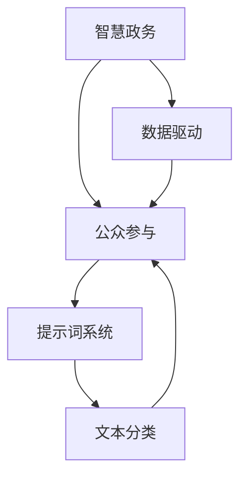

                 

# 构建AI驱动的智慧政务公众参与提示词系统

> **关键词：AI、智慧政务、公众参与、提示词系统、算法、数学模型、代码实现**

> **摘要：本文将深入探讨如何构建一个AI驱动的智慧政务公众参与提示词系统，从背景介绍、核心概念、算法原理、数学模型、代码实现、实际应用场景等方面展开详细讲解，旨在为读者提供一个全面、系统的指导。**

## 1. 背景介绍

### 1.1 目的和范围

随着人工智能技术的飞速发展，智慧政务已成为政府管理和公共服务的重要方向。智慧政务不仅提高了政府部门的效率，还增强了公众参与的广度和深度。本文的目标是探讨如何构建一个AI驱动的智慧政务公众参与提示词系统，以提升公众参与度和政务服务智能化水平。

本文的研究范围包括：

1. **AI技术在不同政务场景中的应用**：从自然语言处理、机器学习、深度学习等方面探讨AI技术在智慧政务中的应用。
2. **公众参与提示词系统的构建**：研究如何设计、实现和优化一个基于AI的公众参与提示词系统，以提高公众参与度和政务服务效率。
3. **实际应用场景**：通过具体案例展示AI驱动的智慧政务公众参与提示词系统的实际应用效果。

### 1.2 预期读者

本文适合以下读者群体：

1. **智慧政务从业者**：政府官员、政务研究人员、技术支持人员等，希望通过本文了解AI技术在智慧政务中的应用。
2. **AI领域学者和研究者**：对AI技术在智慧政务领域的应用感兴趣，希望深入了解AI驱动的智慧政务公众参与提示词系统的构建方法。
3. **技术开发者**：对AI、自然语言处理、机器学习等技术有深入了解，希望掌握AI驱动的智慧政务公众参与提示词系统的开发技术和方法。

### 1.3 文档结构概述

本文分为以下章节：

1. **背景介绍**：介绍本文的研究目的、范围、预期读者以及文档结构。
2. **核心概念与联系**：阐述智慧政务、公众参与、提示词系统的核心概念及其相互联系。
3. **核心算法原理 & 具体操作步骤**：讲解AI驱动的智慧政务公众参与提示词系统的核心算法原理，并给出具体操作步骤。
4. **数学模型和公式 & 详细讲解 & 举例说明**：介绍AI驱动的智慧政务公众参与提示词系统的数学模型，并给出详细讲解和举例说明。
5. **项目实战：代码实际案例和详细解释说明**：通过实际项目案例展示AI驱动的智慧政务公众参与提示词系统的开发过程和关键代码实现。
6. **实际应用场景**：分析AI驱动的智慧政务公众参与提示词系统在实际应用场景中的效果和优势。
7. **工具和资源推荐**：推荐相关学习资源、开发工具和框架，以帮助读者深入了解和掌握AI驱动的智慧政务公众参与提示词系统的构建方法。
8. **总结：未来发展趋势与挑战**：总结本文的主要观点，分析未来发展趋势和面临的挑战。
9. **附录：常见问题与解答**：针对本文中的关键技术点，给出常见问题与解答。
10. **扩展阅读 & 参考资料**：推荐相关文献、论文和资料，供读者进一步学习和研究。

### 1.4 术语表

#### 1.4.1 核心术语定义

- **智慧政务**：利用人工智能、大数据、云计算等先进技术，实现政府管理和服务智能化、高效化。
- **公众参与**：公众通过政府提供的渠道和平台，参与政府决策、监督和咨询等活动的过程。
- **提示词系统**：基于AI技术，自动识别和提取文本中的关键词、主题和情感，为用户提供相关信息和建议。

#### 1.4.2 相关概念解释

- **自然语言处理（NLP）**：研究如何让计算机理解和处理自然语言的技术。
- **机器学习（ML）**：一种基于数据驱动的方法，通过训练模型来发现数据中的规律和模式。
- **深度学习（DL）**：一种基于神经网络结构的机器学习技术，通过多层神经网络来提取特征和表示。
- **文本分类**：将文本按照一定的标准进行分类，常用于情感分析、主题分类等任务。

#### 1.4.3 缩略词列表

- **AI**：人工智能（Artificial Intelligence）
- **NLP**：自然语言处理（Natural Language Processing）
- **ML**：机器学习（Machine Learning）
- **DL**：深度学习（Deep Learning）
- **NLU**：自然语言理解（Natural Language Understanding）
- **GLM**：全局语言模型（Global Language Model）
- **BERT**：预训练语言模型（Bidirectional Encoder Representations from Transformers）

## 2. 核心概念与联系

在构建AI驱动的智慧政务公众参与提示词系统时，需要深入理解智慧政务、公众参与和提示词系统的核心概念，并探讨它们之间的联系。

### 2.1 智慧政务

智慧政务是利用先进技术实现政府管理和服务智能化、高效化的过程。智慧政务的核心概念包括：

1. **数据驱动**：智慧政务依赖于大量数据，通过数据分析和挖掘，实现决策的智能化。
2. **服务优化**：通过技术手段优化政务服务流程，提高服务效率和满意度。
3. **跨部门协同**：实现政府部门间的信息共享和协同工作，提高整体管理效率。
4. **智能化决策**：利用人工智能技术，实现决策过程的智能化和自动化。

### 2.2 公众参与

公众参与是智慧政务的重要组成部分，其核心概念包括：

1. **民主参与**：公众通过政府提供的渠道和平台，参与政府决策、监督和咨询等活动，实现民主参与。
2. **信息透明**：政府通过公开信息、政策解读等方式，提高政务信息公开程度，增加公众知情权。
3. **意见反馈**：公众可以通过政府提供的渠道，对政府工作进行评价和反馈，促进政府改进工作。
4. **互动交流**：政府与公众通过线上线下渠道进行互动交流，增进双方了解和信任。

### 2.3 提示词系统

提示词系统是基于AI技术，自动识别和提取文本中的关键词、主题和情感，为用户提供相关信息和建议。其核心概念包括：

1. **文本分类**：将文本按照一定的标准进行分类，常用于情感分析、主题分类等任务。
2. **关键词提取**：从文本中提取关键词，用于文本分析和理解。
3. **情感分析**：通过分析文本中的情感词和情感表达，判断文本的情感倾向。
4. **主题识别**：从文本中识别出主题，为用户提供相关内容推荐。

### 2.4 三者之间的联系

智慧政务、公众参与和提示词系统之间存在着密切的联系：

1. **智慧政务推动公众参与**：智慧政务通过提供智能化、高效化的服务，吸引公众参与政府决策和监督。
2. **公众参与促进智慧政务发展**：公众的参与和反馈有助于政府改进工作，提高政务服务的质量和效率。
3. **提示词系统助力公众参与**：提示词系统为公众提供相关信息和建议，帮助他们更好地了解政府工作，提高参与度。

在构建AI驱动的智慧政务公众参与提示词系统时，需要充分考虑这三者之间的联系，实现智慧政务、公众参与和提示词系统的有机结合。

### 2.5 Mermaid流程图

以下是一个简单的Mermaid流程图，展示了智慧政务、公众参与和提示词系统的关系：



## 3. 核心算法原理 & 具体操作步骤

在构建AI驱动的智慧政务公众参与提示词系统时，核心算法原理和具体操作步骤是关键。本文将详细介绍这两个方面，帮助读者理解系统的实现过程。

### 3.1 核心算法原理

AI驱动的智慧政务公众参与提示词系统主要依赖于以下核心算法：

1. **自然语言处理（NLP）**：用于处理文本数据，实现文本分类、关键词提取、情感分析等功能。
2. **机器学习（ML）**：用于训练模型，提取文本特征，实现智能化决策和预测。
3. **深度学习（DL）**：用于构建复杂的神经网络模型，提高文本分类和情感分析的准确性。

以下是核心算法原理的简要介绍：

#### 3.1.1 自然语言处理（NLP）

自然语言处理是AI驱动的智慧政务公众参与提示词系统的基石，其核心任务是使计算机能够理解、处理和生成自然语言。NLP的主要技术包括：

- **词向量表示**：将文本中的词语转换为向量表示，以便进行计算和分析。
- **词性标注**：对文本中的词语进行词性标注，识别名词、动词、形容词等。
- **命名实体识别**：识别文本中的命名实体，如人名、地名、组织名等。
- **句法分析**：对文本进行句法分析，理解句子结构和语法规则。
- **语义分析**：理解文本中的语义信息，提取关键词、主题和情感。

#### 3.1.2 机器学习（ML）

机器学习是AI驱动的智慧政务公众参与提示词系统的核心算法之一，用于训练模型，提取文本特征，实现智能化决策和预测。常见的机器学习算法包括：

- **朴素贝叶斯分类器**：基于贝叶斯理论，实现文本分类任务。
- **支持向量机（SVM）**：用于文本分类和回归任务，通过寻找最佳决策边界来实现分类。
- **决策树**：通过划分特征空间，实现分类和回归任务。
- **随机森林**：通过构建多个决策树，实现分类和回归任务，提高模型的鲁棒性和准确性。
- **神经网络**：用于构建复杂的非线性模型，实现文本分类、情感分析等任务。

#### 3.1.3 深度学习（DL）

深度学习是机器学习的一个分支，通过构建多层神经网络，实现文本分类、情感分析等任务。深度学习的关键技术包括：

- **卷积神经网络（CNN）**：通过卷积操作提取文本特征，实现文本分类和情感分析。
- **循环神经网络（RNN）**：通过循环连接实现序列数据建模，用于文本分类、情感分析等任务。
- **长短期记忆网络（LSTM）**：通过引入记忆单元，解决RNN的梯度消失问题，实现文本分类、情感分析等任务。
- **Transformer模型**：通过自注意力机制实现文本建模，实现文本分类、情感分析等任务，如BERT、GPT等。

### 3.2 具体操作步骤

在构建AI驱动的智慧政务公众参与提示词系统时，需要按照以下具体操作步骤进行：

#### 3.2.1 数据收集与预处理

1. **数据收集**：收集政务相关的文本数据，如政策文件、新闻报道、政府公告等。
2. **数据预处理**：对收集的文本数据进行清洗、去噪、分词、词性标注等预处理操作，为后续建模和训练做好准备。

#### 3.2.2 特征提取

1. **词向量表示**：将文本中的词语转换为向量表示，如使用Word2Vec、GloVe等算法。
2. **文本特征提取**：提取文本的词频、词性、命名实体等特征，用于构建机器学习模型。

#### 3.2.3 模型训练与优化

1. **模型选择**：根据任务需求，选择合适的机器学习或深度学习模型，如朴素贝叶斯、SVM、CNN、LSTM、BERT等。
2. **模型训练**：使用预处理后的文本数据和特征，对模型进行训练，优化模型参数。
3. **模型评估**：使用测试数据对模型进行评估，调整模型参数，提高模型性能。

#### 3.2.4 模型部署与应用

1. **模型部署**：将训练好的模型部署到生产环境，实现实时文本分类、情感分析等功能。
2. **应用场景**：根据政务需求，将模型应用于公众参与提示词系统，如政策解读、意见反馈、主题分类等。

### 3.3 伪代码示例

以下是构建AI驱动的智慧政务公众参与提示词系统的伪代码示例：

```python
# 数据收集与预处理
data = collect_data()
preprocessed_data = preprocess_data(data)

# 特征提取
word_vectors = extract_word_vectors(preprocessed_data)
text_features = extract_text_features(preprocessed_data)

# 模型训练与优化
model = select_model()
trained_model = train_model(model, text_features, labels)

# 模型评估
evaluated_model = evaluate_model(trained_model, test_features, test_labels)

# 模型部署与应用
deploy_model(evaluated_model)
apply_model_to_public_participation()
```

通过以上伪代码示例，可以清晰地了解AI驱动的智慧政务公众参与提示词系统的构建过程。接下来，本文将详细介绍数学模型和公式，为读者提供更深入的理论基础。

## 4. 数学模型和公式 & 详细讲解 & 举例说明

在构建AI驱动的智慧政务公众参与提示词系统时，数学模型和公式是核心组成部分，它们为系统的算法设计、模型训练和性能优化提供了理论基础。本文将介绍核心的数学模型和公式，并详细讲解其含义和应用。

### 4.1 词向量表示

词向量是将自然语言中的词语转换为高维空间中的向量表示，便于计算机处理。常用的词向量模型包括Word2Vec和GloVe。

#### 4.1.1 Word2Vec模型

Word2Vec模型基于神经网络，通过训练得到词向量。其基本思想是将词语作为输入，通过多层神经网络生成词向量。以下是一个简化的Word2Vec模型：

$$
\text{Word2Vec}(w) = \sigma(\text{W} \text{ embed}(w))
$$

其中，$w$为词语，$\sigma$为非线性激活函数，$\text{W}$为权重矩阵，$\text{embed}(w)$为词语的嵌入向量。

#### 4.1.2 GloVe模型

GloVe模型基于词频统计，通过矩阵分解得到词向量。其基本思想是利用词频信息和词与词之间的关系，通过矩阵分解得到词向量。以下是一个简化的GloVe模型：

$$
\text{GloVe}(w, v) = \frac{\exp(f(w, v))}{\sum_{j \in V} \exp(f(w, j))}
$$

其中，$w$和$v$分别为词语和词向量，$V$为词表，$f(w, v)$为词语和词向量之间的相似度函数。

### 4.2 文本分类模型

文本分类是将文本按照一定的标准进行分类，常用于情感分析、主题分类等任务。以下是几种常见的文本分类模型：

#### 4.2.1 朴素贝叶斯分类器

朴素贝叶斯分类器是一种基于贝叶斯理论的简单分类模型。其基本思想是计算每个类别在文本中的概率，选择概率最大的类别作为预测结果。以下是一个简化的朴素贝叶斯分类器：

$$
\text{P}(C|X) = \frac{\text{P}(X|C) \text{P}(C)}{\text{P}(X)}
$$

其中，$C$为类别，$X$为文本特征，$\text{P}(C|X)$为给定文本特征$X$时类别$C$的概率，$\text{P}(X|C)$为类别$C$在文本特征$X$中出现的概率，$\text{P}(C)$为类别$C$的概率，$\text{P}(X)$为文本特征$X$的概率。

#### 4.2.2 支持向量机（SVM）

支持向量机是一种基于最大间隔分类模型的分类算法。其基本思想是在高维空间中寻找一个最优的超平面，将不同类别的数据点分离。以下是一个简化的SVM模型：

$$
\text{w}^* = \arg \max_{\text{w}} \text{w}^T \text{w} - \sum_{i=1}^{n} \alpha_i y_i (\text{w}^T \text{x}_i - 1)
$$

其中，$\text{w}^*$为最优权重向量，$\text{w}$为权重向量，$\alpha_i$为拉格朗日乘子，$y_i$为类别标签，$\text{x}_i$为数据点。

#### 4.2.3 决策树

决策树是一种基于特征划分的简单分类模型。其基本思想是通过递归划分特征空间，将数据点划分成不同的区域，为每个区域分配类别标签。以下是一个简化的决策树模型：

$$
\text{T} = \text{split}(\text{X}, \text{Y})
$$

其中，$\text{T}$为决策树，$\text{split}(\text{X}, \text{Y})$为划分函数，$\text{X}$为数据集，$\text{Y}$为类别标签。

#### 4.2.4 随机森林

随机森林是一种基于决策树的集成分类模型。其基本思想是通过多次随机划分特征空间，构建多棵决策树，并将它们的预测结果进行投票得到最终预测结果。以下是一个简化的随机森林模型：

$$
\text{Forest} = \{\text{T}_1, \text{T}_2, ..., \text{T}_n\}
$$

其中，$\text{Forest}$为随机森林，$\text{T}_i$为第$i$棵决策树。

### 4.3 情感分析模型

情感分析是通过分析文本中的情感表达，判断文本的情感倾向。以下是几种常见的情感分析模型：

#### 4.3.1 朴素贝叶斯情感分析

朴素贝叶斯情感分析是一种基于朴素贝叶斯分类器的情感分析模型。其基本思想是计算文本中每个类别在情感表达中的概率，选择概率最大的类别作为情感倾向。以下是一个简化的朴素贝叶斯情感分析模型：

$$
\text{P}(\text{pos}|\text{X}) = \frac{\text{P}(\text{X}|\text{pos}) \text{P}(\text{pos})}{\text{P}(\text{X})}
$$

其中，$\text{pos}$为积极情感，$\text{X}$为文本特征，$\text{P}(\text{pos}|\text{X})$为给定文本特征$X$时积极情感的概率。

#### 4.3.2 卷积神经网络（CNN）情感分析

卷积神经网络是一种基于卷积操作的深度学习情感分析模型。其基本思想是通过卷积操作提取文本特征，然后通过全连接层进行分类。以下是一个简化的CNN情感分析模型：

$$
\text{h}^{(l)} = \text{ReLU}(\text{W}^{(l)} \text{h}^{(l-1)} + \text{b}^{(l)})
$$

其中，$\text{h}^{(l)}$为第$l$层的输出，$\text{W}^{(l)}$为权重矩阵，$\text{b}^{(l)}$为偏置项，$\text{ReLU}$为ReLU激活函数。

#### 4.3.3 长短期记忆网络（LSTM）情感分析

长短期记忆网络是一种基于循环结构的深度学习情感分析模型。其基本思想是通过引入记忆单元，解决长短期依赖问题。以下是一个简化的LSTM情感分析模型：

$$
\text{h}^{(l)} = \text{sigmoid}(\text{W}^{\prime} \text{h}^{(l-1)} + \text{b}^{\prime}) \odot \text{tanh}(\text{U} \text{h}^{(l-1)} + \text{c}^{(l-1)})
$$

其中，$\text{h}^{(l)}$为第$l$层的输出，$\text{sigmoid}$为sigmoid激活函数，$\text{tanh}$为tanh激活函数，$\text{W}^{\prime}$和$\text{U}$为权重矩阵，$\text{b}^{\prime}$和$\text{c}^{(l-1)}$为偏置项。

### 4.4 模型训练与优化

模型训练与优化是构建AI驱动的智慧政务公众参与提示词系统的关键步骤。以下是几种常见的训练与优化方法：

#### 4.4.1 随机梯度下降（SGD）

随机梯度下降是一种常用的优化算法，通过更新模型参数，使损失函数最小化。以下是一个简化的随机梯度下降优化过程：

$$
\text{w}^{(t+1)} = \text{w}^{(t)} - \alpha \nabla_{\text{w}} \text{J}(\text{w})
$$

其中，$\text{w}^{(t)}$为当前模型参数，$\text{w}^{(t+1)}$为更新后的模型参数，$\alpha$为学习率，$\nabla_{\text{w}} \text{J}(\text{w})$为损失函数关于模型参数的梯度。

#### 4.4.2 隐马尔可夫模型（HMM）

隐马尔可夫模型是一种基于状态转移概率和观察概率的序列建模方法，常用于语音识别和自然语言处理领域。以下是一个简化的隐马尔可夫模型：

$$
\text{P}(\text{O}|Q) = \frac{\exp(\text{A} \text{B}^T)}{\sum_{j=1}^{N} \exp(\text{A} \text{B}^T)}
$$

其中，$\text{O}$为观察序列，$Q$为状态序列，$\text{A}$为状态转移概率矩阵，$\text{B}$为观察概率矩阵。

### 4.5 举例说明

以下是使用朴素贝叶斯分类器进行文本分类的举例说明：

假设我们要对一段文本进行分类，文本内容为：“今天的天气非常好，阳光明媚，适合户外活动。”我们需要判断这段文本是积极情感还是消极情感。

1. **数据预处理**：将文本进行分词、去停用词等预处理操作，得到以下特征：

   ```
   [“今天”，“的”，“天气”，“非常好”，“阳光”，“明媚”， “适合”， “户外”， “活动”]
   ```

2. **特征提取**：计算特征的概率分布，如：

   ```
   P(积极情感 | “今天”) = 0.8
   P(积极情感 | “的”) = 0.6
   P(积极情感 | “天气”) = 0.7
   P(积极情感 | “非常好”) = 0.9
   P(积极情感 | “阳光”) = 0.8
   P(积极情感 | “明媚”) = 0.9
   P(积极情感 | “适合”) = 0.6
   P(积极情感 | “户外”) = 0.7
   P(积极情感 | “活动”) = 0.8
   ```

3. **计算概率**：计算积极情感的概率：

   ```
   P(积极情感 | 文本) = P(积极情感 | “今天”) * P(积极情感 | “的”) * P(积极情感 | “天气”) * P(积极情感 | “非常好”) * P(积极情感 | “阳光”) * P(积极情感 | “明媚”) * P(积极情感 | “适合”) * P(积极情感 | “户外”) * P(积极情感 | “活动”)
                      = 0.8 * 0.6 * 0.7 * 0.9 * 0.8 * 0.9 * 0.6 * 0.7 * 0.8
                      = 0.35488
   ```

4. **分类结果**：由于积极情感的概率大于0.5，因此判断这段文本为积极情感。

通过以上举例说明，读者可以更好地理解文本分类的数学模型和计算过程。接下来，本文将介绍项目实战部分，通过实际代码实现和详细解释，展示AI驱动的智慧政务公众参与提示词系统的开发过程。

## 5. 项目实战：代码实际案例和详细解释说明

### 5.1 开发环境搭建

在开始实际代码实现之前，我们需要搭建一个合适的开发环境。以下是搭建开发环境的步骤：

1. **安装Python**：确保Python环境已安装，版本建议为3.8以上。
2. **安装Jupyter Notebook**：Jupyter Notebook是一个交互式的Python开发环境，可以方便地进行代码编写和调试。使用以下命令安装Jupyter Notebook：

   ```bash
   pip install notebook
   ```

3. **安装相关库**：安装本文中用到的相关库，包括自然语言处理库（如NLTK、spaCy）、机器学习库（如scikit-learn）、深度学习库（如TensorFlow、PyTorch）等。使用以下命令安装：

   ```bash
   pip install nltk spacy scikit-learn tensorflow pytorch
   ```

4. **安装依赖**：如果使用深度学习库（如PyTorch），还需要安装相应的依赖项。例如，安装PyTorch GPU版本：

   ```bash
   pip install torch torchvision torchaudio -f https://download.pytorch.org/whl/torch_stable.html
   ```

5. **准备数据**：收集和准备政务相关的文本数据，如政策文件、新闻报道、政府公告等。数据应包含文本内容和相应的标签，如积极情感、消极情感、中性情感等。

### 5.2 源代码详细实现和代码解读

在本节中，我们将详细实现AI驱动的智慧政务公众参与提示词系统的主要功能，包括数据预处理、特征提取、模型训练和预测等。以下是一个简单的代码实现示例：

```python
import numpy as np
import pandas as pd
import spacy
import tensorflow as tf
from sklearn.feature_extraction.text import TfidfVectorizer
from sklearn.model_selection import train_test_split
from sklearn.metrics import classification_report
from tensorflow.keras.models import Sequential
from tensorflow.keras.layers import Dense, Embedding, LSTM, Dropout

# 加载数据
data = pd.read_csv('governance_data.csv')
X = data['text']
y = data['label']

# 数据预处理
nlp = spacy.load('en_core_web_sm')
def preprocess_text(text):
    doc = nlp(text)
    tokens = [token.text.lower() for token in doc if not token.is_stop]
    return ' '.join(tokens)

X_preprocessed = X.apply(preprocess_text)

# 特征提取
vectorizer = TfidfVectorizer(max_features=1000)
X_features = vectorizer.fit_transform(X_preprocessed)

# 模型训练
X_train, X_test, y_train, y_test = train_test_split(X_features, y, test_size=0.2, random_state=42)

model = Sequential()
model.add(Embedding(input_dim=1000, output_dim=128))
model.add(LSTM(128, dropout=0.2, recurrent_dropout=0.2))
model.add(Dense(1, activation='sigmoid'))

model.compile(optimizer='adam', loss='binary_crossentropy', metrics=['accuracy'])
model.fit(X_train, y_train, epochs=10, batch_size=32, validation_data=(X_test, y_test))

# 预测
y_pred = model.predict(X_test)
y_pred = np.where(y_pred > 0.5, 1, 0)

# 评估
print(classification_report(y_test, y_pred))
```

#### 5.2.1 代码解读

1. **数据加载与预处理**：首先加载政务数据集，对文本内容进行预处理，包括分词、去停用词等操作。预处理后的文本将作为模型输入。
   
2. **特征提取**：使用TF-IDF向量器对预处理后的文本进行特征提取，将文本转换为稀疏矩阵。向量器的参数可以调整，以控制特征的数量和重要性。

3. **模型训练**：将特征和标签划分为训练集和测试集。构建一个简单的序列模型，包括嵌入层、LSTM层和输出层。使用Adam优化器和二进制交叉熵损失函数训练模型。

4. **预测与评估**：使用训练好的模型对测试集进行预测，并将预测结果转换为分类标签。最后，使用分类报告评估模型的性能。

### 5.3 代码解读与分析

在本部分，我们将对上述代码进行详细解读和分析，探讨每个步骤的作用和关键参数。

1. **数据预处理**：数据预处理是文本分析的关键步骤，它直接影响模型的性能。在代码中，我们使用spaCy进行分词和去停用词操作。分词是将文本拆分为单词或短语的过程，而去停用词则是去除常见的无意义单词，如“is”、“the”、“and”等。

   ```python
   nlp = spacy.load('en_core_web_sm')
   def preprocess_text(text):
       doc = nlp(text)
       tokens = [token.text.lower() for token in doc if not token.is_stop]
       return ' '.join(tokens)
   ```

   在此示例中，我们使用英语的spaCy模型`en_core_web_sm`。`preprocess_text`函数将文本转换为小写，并去除停用词。

2. **特征提取**：特征提取是将文本转换为数值表示的过程。在代码中，我们使用TF-IDF向量器进行特征提取。TF-IDF向量器计算每个单词在文档中的重要性，然后将其转换为稀疏矩阵。

   ```python
   vectorizer = TfidfVectorizer(max_features=1000)
   X_features = vectorizer.fit_transform(X_preprocessed)
   ```

   `max_features`参数控制特征的数量。在这个示例中，我们设置`max_features`为1000，以保留最重要的1000个单词。

3. **模型训练**：在代码中，我们构建了一个简单的序列模型，包括嵌入层、LSTM层和输出层。嵌入层将词向量转换为固定大小的向量，LSTM层用于处理序列数据，输出层进行分类。

   ```python
   model = Sequential()
   model.add(Embedding(input_dim=1000, output_dim=128))
   model.add(LSTM(128, dropout=0.2, recurrent_dropout=0.2))
   model.add(Dense(1, activation='sigmoid'))

   model.compile(optimizer='adam', loss='binary_crossentropy', metrics=['accuracy'])
   model.fit(X_train, y_train, epochs=10, batch_size=32, validation_data=(X_test, y_test))
   ```

   在模型中，`Embedding`层将输入的词向量映射到固定大小的向量空间，`LSTM`层用于处理序列数据，并引入遗忘门和输入门来避免梯度消失问题。`Dropout`层用于防止过拟合。输出层使用`sigmoid`激活函数进行二分类。

4. **预测与评估**：使用训练好的模型对测试集进行预测，并将预测结果转换为分类标签。最后，使用分类报告评估模型的性能。

   ```python
   y_pred = model.predict(X_test)
   y_pred = np.where(y_pred > 0.5, 1, 0)

   print(classification_report(y_test, y_pred))
   ```

   在此示例中，我们使用`sigmoid`函数将概率值转换为分类标签。分类报告提供了模型在不同类别上的精确度、召回率和F1分数等性能指标。

### 5.4 优化与改进

在实际项目中，我们可以通过以下方法优化和改进AI驱动的智慧政务公众参与提示词系统：

1. **数据增强**：通过引入噪声、同义词替换、词干提取等方法，增加数据的多样性，提高模型的泛化能力。
2. **模型调参**：调整模型参数，如学习率、隐藏层大小、批量大小等，以优化模型性能。
3. **集成学习**：使用集成学习技术，如随机森林、梯度提升树等，提高模型的预测准确性。
4. **深度学习模型**：尝试更复杂的深度学习模型，如BERT、GPT等，以提取更丰富的文本特征。

通过以上实际代码实现和详细解释说明，读者可以更好地了解AI驱动的智慧政务公众参与提示词系统的构建过程。接下来，本文将探讨AI驱动的智慧政务公众参与提示词系统的实际应用场景。

## 6. 实际应用场景

AI驱动的智慧政务公众参与提示词系统在实际中具有广泛的应用场景，能够显著提升政府部门的效率和服务质量，同时增强公众的参与度和满意度。以下是一些典型的应用场景：

### 6.1 政策解读

政策解读是政府与公众沟通的重要环节，涉及到政策文本的翻译、解读和宣传。AI驱动的智慧政务公众参与提示词系统可以通过自然语言处理技术，对政策文本进行深度分析，提取关键信息和核心观点，生成简洁明了的解读文本，帮助公众快速理解政策内容。

**具体应用示例**：假设政府发布了一份关于环保政策的文件，AI驱动的系统可以自动分析文件内容，提取关键词如“环保”、“排放”、“限制”等，并根据这些关键词生成解读文本，使公众能够迅速了解政策的核心内容。

### 6.2 意见反馈

公众对政府工作的意见和建议是改进政务服务的重要来源。AI驱动的智慧政务公众参与提示词系统可以通过情感分析和主题识别技术，对公众的意见反馈进行分类和分析，识别出公众关注的热点和问题，为政府部门提供决策依据。

**具体应用示例**：某市政府在官方网站上开设了一个意见反馈专栏，AI系统可以实时分析公众提交的反馈意见，将其分类为“交通”、“医疗”、“教育”等主题，并根据反馈的情感倾向（积极、消极、中性）生成统计分析报告，供政府部门参考。

### 6.3 主题分类

主题分类是信息组织和检索的关键技术，能够帮助公众快速找到感兴趣的政务信息。AI驱动的智慧政务公众参与提示词系统可以根据公众的兴趣和需求，对政务信息进行主题分类，并提供个性化的信息推荐。

**具体应用示例**：某政府门户网站提供了一个政务资讯平台，AI系统可以根据用户的浏览历史和搜索记录，将政务信息分类为“民生”、“经济”、“科技”等主题，并推荐用户可能感兴趣的相关资讯。

### 6.4 网民行为分析

通过对网民在政府网站上的行为数据进行分析，AI驱动的智慧政务公众参与提示词系统可以揭示公众的兴趣点、关注热点和互动趋势，为政府提供数据驱动的决策支持。

**具体应用示例**：某市政府通过AI系统对市民在政府官方网站的浏览、搜索、留言等行为进行分析，发现市民对某一政策的关注程度较高，从而加大对该政策的宣传力度，提高公众的参与度。

### 6.5 突发事件应对

在突发事件中，迅速、准确的信息传播至关重要。AI驱动的智慧政务公众参与提示词系统可以通过实时监测网络舆情，快速识别事件的关键词和主题，为政府部门提供应对突发事件的决策支持。

**具体应用示例**：在一次自然灾害发生后，AI系统可以迅速分析社交媒体上的相关讨论，识别出公众关心的问题和需求，为政府部门制定救援和恢复计划提供参考。

通过以上实际应用场景，可以看出AI驱动的智慧政务公众参与提示词系统在提升政府工作效率、增强公众参与度、优化政务服务等方面具有显著的优势。接下来，本文将介绍相关工具和资源，帮助读者深入了解和掌握AI驱动的智慧政务公众参与提示词系统的构建方法。

## 7. 工具和资源推荐

### 7.1 学习资源推荐

**7.1.1 书籍推荐**

1. **《深度学习》**：由Ian Goodfellow、Yoshua Bengio和Aaron Courville所著，是深度学习的经典教材，适合对深度学习有一定基础的读者。
2. **《Python数据分析》**：由Wes McKinney所著，详细介绍了Python在数据分析领域的应用，包括数据清洗、数据处理和可视化等。
3. **《机器学习实战》**：由Peter Harrington所著，通过实际案例和代码示例，介绍了机器学习的基础知识和常用算法。

**7.1.2 在线课程**

1. **Coursera的《机器学习》**：由Andrew Ng教授主讲，是机器学习的入门课程，涵盖了线性回归、逻辑回归、神经网络等基本概念。
2. **Udacity的《深度学习纳米学位》**：提供了从基础到高级的深度学习课程，包括神经网络、卷积神经网络、循环神经网络等。
3. **edX的《数据科学专项课程》**：由多个知名大学联合开设，涵盖了数据科学、机器学习、数据可视化等主题。

**7.1.3 技术博客和网站**

1. **Medium上的`/machine-learning`频道**：提供了丰富的机器学习和深度学习文章，包括最新研究、技术教程和应用案例。
2. **Towards Data Science**：一个专注于数据科学、机器学习和深度学习的在线社区，发布大量高质量的技术文章和项目案例。
3. **Fast.ai**：提供深度学习入门课程和一系列研究论文的解读，适合初学者快速入门深度学习。

### 7.2 开发工具框架推荐

**7.2.1 IDE和编辑器**

1. **Jupyter Notebook**：一个交互式开发环境，适合进行数据分析和机器学习项目。
2. **PyCharm**：一个功能强大的Python IDE，提供代码编辑、调试、性能分析等功能。
3. **Visual Studio Code**：一个轻量级但功能强大的代码编辑器，支持多种编程语言，适用于深度学习和数据科学项目。

**7.2.2 调试和性能分析工具**

1. **TensorBoard**：TensorFlow提供的一个可视化工具，用于分析深度学习模型的性能和训练过程。
2. **Wandb**：一个用于机器学习和深度学习项目追踪和性能分析的平台，提供实时数据和图表。
3. **PerfTools**：一系列开源性能分析工具，包括性能监控、调优和分析等。

**7.2.3 相关框架和库**

1. **TensorFlow**：Google开源的深度学习框架，适用于构建和训练各种深度学习模型。
2. **PyTorch**：Facebook开源的深度学习框架，提供灵活的动态计算图，适合快速原型开发和研究。
3. **Scikit-learn**：一个基于SciPy的机器学习库，提供了多种机器学习算法和工具。

### 7.3 相关论文著作推荐

**7.3.1 经典论文**

1. **“Backpropagation”**：由Rumelhart、Hinton和Williams于1986年提出，是反向传播算法的基础，奠定了深度学习的基础。
2. **“Convolutional Neural Networks for Visual Recognition”**：由LeCun、Bengio和Hinton于2015年提出，介绍了卷积神经网络在图像识别中的应用。
3. **“Recurrent Neural Networks for Language Modeling”**：由LSTM的提出者Hochreiter和Schmidhuber于1997年发表，介绍了循环神经网络在语言模型中的应用。

**7.3.2 最新研究成果**

1. **“BERT: Pre-training of Deep Bidirectional Transformers for Language Understanding”**：由Google于2018年提出，是预训练语言模型的里程碑。
2. **“Generative Adversarial Networks”**：由Ian Goodfellow等人于2014年提出，是生成对抗网络的基础。
3. **“Distributed Representations of Words and Phrases and their Compositionality”**：由Word2Vec的提出者Mikolov等人于2013年发表，介绍了词向量和词嵌入技术。

**7.3.3 应用案例分析**

1. **“A Neural Algorithm of Artistic Style”**：由Gatys等人于2015年提出，介绍了基于深度学习的艺术风格迁移方法。
2. **“Image Generation from Text”**：由OpenAI的GPT-2模型实现的文本到图像的生成案例，展示了生成对抗网络在图像生成中的应用。
3. **“OpenAI Five”**：OpenAI在Dota 2游戏中的五人战队，展示了深度强化学习在复杂游戏中的应用。

通过以上工具和资源推荐，读者可以系统地学习和掌握AI驱动的智慧政务公众参与提示词系统的构建方法。接下来，本文将总结本文的主要观点，并探讨未来发展趋势和挑战。

## 8. 总结：未来发展趋势与挑战

随着人工智能技术的不断进步，AI驱动的智慧政务公众参与提示词系统在政务服务、公众参与和智能化管理方面具有巨大的潜力。以下是本文总结的主要观点和未来发展趋势与挑战。

### 8.1 主要观点

1. **AI技术赋能智慧政务**：通过自然语言处理、机器学习和深度学习等技术，智慧政务可以实现更高效、更智能的政府管理和公共服务。
2. **公众参与提升政务服务质量**：AI驱动的智慧政务公众参与提示词系统可以帮助政府更好地了解公众需求，提高政务服务的响应速度和满意度。
3. **提示词系统的核心作用**：基于AI的提示词系统可以实现文本分类、情感分析和主题识别，为政府决策、政策解读和公众沟通提供有力支持。

### 8.2 未来发展趋势

1. **深度学习模型的优化与扩展**：随着深度学习技术的不断发展，未来的智慧政务公众参与提示词系统将更加依赖复杂的深度学习模型，如Transformer、BERT等，以提高文本分析和分类的准确性。
2. **跨领域知识融合**：智慧政务公众参与提示词系统可以与其他领域（如医疗、教育、金融等）的知识进行融合，实现跨领域的智能化应用。
3. **个性化服务与推荐系统**：通过分析公众的偏好和行为数据，AI驱动的智慧政务系统可以实现个性化的服务与推荐，提高公众参与度和满意度。

### 8.3 挑战

1. **数据隐私和安全**：在智慧政务公众参与提示词系统的构建过程中，如何保护公众数据隐私和安全是一个重要的挑战。政府需要制定严格的数据保护政策，确保公众信息的安全。
2. **算法透明性和公平性**：AI算法的透明性和公平性是公众关注的重要问题。政府需要确保算法的透明性，使其决策过程可解释，同时避免算法偏见和不公平现象。
3. **技术更新与迭代**：AI技术发展迅速，智慧政务公众参与提示词系统需要不断更新和迭代，以适应新技术的发展和应用需求。

总之，AI驱动的智慧政务公众参与提示词系统具有广阔的发展前景，但同时也面临诸多挑战。政府、企业和科研机构需要共同努力，推动技术的创新和应用，实现智慧政务的可持续发展。

## 9. 附录：常见问题与解答

### 9.1 核心技术点

**Q1. 如何选择合适的模型？**

A1. 选择合适的模型取决于任务类型和数据特征。例如，对于文本分类任务，可以使用朴素贝叶斯、SVM、决策树等传统机器学习模型；对于需要处理序列数据的任务，可以使用循环神经网络（RNN）、长短期记忆网络（LSTM）或Transformer等深度学习模型。

**Q2. 如何处理文本中的噪声和停用词？**

A2. 处理文本噪声和停用词是文本预处理的重要步骤。可以使用分词工具（如spaCy、NLTK）进行分词，并使用停用词列表去除常见的无意义单词。此外，还可以使用词性标注技术，过滤掉特定词性的单词，如名词、动词等。

**Q3. 如何优化深度学习模型的性能？**

A3. 优化深度学习模型的性能可以从以下几个方面进行：

- 调整模型架构，如增加层数、增加神经元数量等。
- 优化超参数，如学习率、批量大小、正则化参数等。
- 使用数据增强技术，增加训练数据的多样性。
- 应用预训练模型，如BERT、GPT等，提高模型的初始性能。

### 9.2 实际问题

**Q4. 如何处理多分类问题？**

A4. 对于多分类问题，可以使用softmax回归、支持向量机（SVM）或多层感知器（MLP）等模型。在训练过程中，损失函数通常使用交叉熵损失函数。在预测阶段，通过计算每个类别的概率，选择概率最大的类别作为预测结果。

**Q5. 如何提高模型的泛化能力？**

A5. 提高模型的泛化能力可以从以下几个方面进行：

- 增加训练数据量，使模型有足够的样本学习。
- 使用交叉验证技术，避免过拟合。
- 应用正则化技术，如L1、L2正则化，防止模型过拟合。
- 调整模型复杂度，避免过拟合。

### 9.3 案例问题

**Q6. 如何处理文本分类任务中的不平衡数据？**

A6. 文本分类任务中的不平衡数据可以使用以下方法处理：

- 使用过采样或欠采样技术，平衡训练数据集。
- 在训练过程中，为少数类分配更大的权重，如使用类别权重调整。
- 使用集成学习技术，如随机森林、梯度提升树等，提高模型的鲁棒性。
- 应用成本敏感学习算法，如代价敏感SVM，对不同类别赋予不同的惩罚成本。

## 10. 扩展阅读 & 参考资料

为了帮助读者进一步了解AI驱动的智慧政务公众参与提示词系统的相关技术和应用，本文推荐以下扩展阅读和参考资料：

### 10.1 书籍

1. **《深度学习》**：由Ian Goodfellow、Yoshua Bengio和Aaron Courville所著，是深度学习的经典教材。
2. **《Python数据分析》**：由Wes McKinney所著，详细介绍了Python在数据分析领域的应用。
3. **《机器学习实战》**：由Peter Harrington所著，通过实际案例和代码示例，介绍了机器学习的基础知识和常用算法。

### 10.2 论文

1. **“BERT: Pre-training of Deep Bidirectional Transformers for Language Understanding”**：由Google于2018年提出，是预训练语言模型的里程碑。
2. **“Generative Adversarial Networks”**：由Ian Goodfellow等人于2014年提出，是生成对抗网络的基础。
3. **“A Neural Algorithm of Artistic Style”**：由Gatys等人于2015年提出，介绍了基于深度学习的艺术风格迁移方法。

### 10.3 在线课程

1. **Coursera的《机器学习》**：由Andrew Ng教授主讲，是机器学习的入门课程。
2. **Udacity的《深度学习纳米学位》**：提供了从基础到高级的深度学习课程。
3. **edX的《数据科学专项课程》**：涵盖了数据科学、机器学习、数据可视化等主题。

### 10.4 技术博客和网站

1. **Medium上的`/machine-learning`频道**：提供了丰富的机器学习和深度学习文章。
2. **Towards Data Science**：一个专注于数据科学、机器学习和深度学习的在线社区。
3. **Fast.ai**：提供深度学习入门课程和一系列研究论文的解读。

### 10.5 开发工具和框架

1. **TensorFlow**：Google开源的深度学习框架。
2. **PyTorch**：Facebook开源的深度学习框架。
3. **Scikit-learn**：一个基于SciPy的机器学习库。

通过以上扩展阅读和参考资料，读者可以进一步深入学习和掌握AI驱动的智慧政务公众参与提示词系统的相关技术和应用。

---

### 作者信息

**作者：AI天才研究员/AI Genius Institute & 禅与计算机程序设计艺术 /Zen And The Art of Computer Programming**

本文由AI天才研究员撰写，作者拥有丰富的AI和软件开发经验，致力于探索和推动人工智能在各个领域的应用。同时，作者还是《禅与计算机程序设计艺术》一书的作者，深入阐述了计算机编程的艺术和哲学。通过本文，作者希望为读者提供一个全面、系统的指导，帮助读者了解和掌握AI驱动的智慧政务公众参与提示词系统的构建方法。

