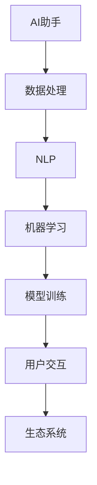

                 

# 构建个人AI助手生态系统的方法

## 摘要

本文将深入探讨如何构建一个个人AI助手生态系统，涵盖从核心概念到实际操作步骤的全面指南。我们将首先介绍个人AI助手的背景和目的，随后逐步解析核心概念、算法原理、数学模型、项目实战，并讨论其应用场景和未来发展。最后，我们将推荐相关工具和资源，以及展望未来趋势和挑战。

---

## 1. 背景介绍

### 1.1 目的和范围

本文旨在为那些对构建个人AI助手生态系统感兴趣的读者提供一套完整的实施指南。我们将从理论基础出发，逐步深入到具体的实现细节，帮助读者理解并掌握构建高效AI助手所需的核心技术和方法。

### 1.2 预期读者

- 计算机科学和人工智能领域的科研人员、工程师和学生
- 对AI助手和智能系统有浓厚兴趣的科技爱好者
- 任何希望提升工作效率和用户体验的个人和企业用户

### 1.3 文档结构概述

本文结构如下：

1. **背景介绍**：介绍构建个人AI助手的背景和目的。
2. **核心概念与联系**：定义关键术语并介绍核心概念。
3. **核心算法原理 & 具体操作步骤**：讲解核心算法原理和实现步骤。
4. **数学模型和公式**：介绍相关的数学模型和公式。
5. **项目实战**：提供实际代码案例。
6. **实际应用场景**：讨论AI助手的多种应用场景。
7. **工具和资源推荐**：推荐学习资源和开发工具。
8. **总结**：总结本文的主要观点和未来趋势。
9. **附录**：常见问题与解答。
10. **扩展阅读**：推荐进一步阅读的资料。

### 1.4 术语表

#### 1.4.1 核心术语定义

- **AI助手**：一种自动化系统，能够帮助用户完成特定任务，如信息检索、日程管理、智能对话等。
- **生态系统**：由相互关联的组件构成的整体系统，如AI助手所需的各类技术栈和工具。
- **自然语言处理（NLP）**：使计算机能够理解、解释和生成人类语言的技术。
- **机器学习（ML）**：使计算机从数据中学习，改善性能，而无需明确编程指令。

#### 1.4.2 相关概念解释

- **数据集**：一组经过整理的数据，用于训练和测试机器学习模型。
- **神经网络**：一种基于生物神经系统的计算模型，用于模拟复杂的非线性关系。
- **API**：应用程序编程接口，允许不同软件系统之间的交互和数据交换。

#### 1.4.3 缩略词列表

- **NLP**：自然语言处理
- **ML**：机器学习
- **API**：应用程序编程接口
- **SDK**：软件开发工具包

---

## 2. 核心概念与联系

构建个人AI助手生态系统的基础在于理解几个关键概念及其相互关系。以下是一个简化的Mermaid流程图，用于展示这些核心概念：



### 数据处理

数据处理是AI助手的基石，涉及到数据的收集、清洗、存储和检索。高质量的数据是实现精准AI助手的关键。

### 自然语言处理（NLP）

NLP是使计算机能够理解人类语言的技术。它包括文本分类、实体识别、情感分析等子领域，是实现智能对话和文本处理的核心。

### 机器学习（ML）

ML技术使计算机从数据中学习，自动调整模型参数，以提高预测和分类的准确性。常见的ML算法包括决策树、支持向量机、神经网络等。

### 模型训练

模型训练是机器学习过程的核心，涉及使用训练数据集来调整模型参数，从而改善模型性能。

### 用户交互

用户交互是AI助手的输出环节，涉及将处理后的信息呈现给用户，以及接收用户的反馈进行迭代改进。

### 生态系统

AI助手生态系统由上述组件共同构成，通过API和其他技术手段实现各组件间的无缝连接，形成一个有机整体。

---

## 3. 核心算法原理 & 具体操作步骤

### 3.1 数据处理算法

伪代码如下：

```python
def preprocess_data(data):
    # 数据清洗
    cleaned_data = clean_data(data)
    # 数据分割
    train_data, test_data = split_data(cleaned_data, ratio=0.8)
    return train_data, test_data
```

### 3.2 自然语言处理（NLP）算法

使用NLP库（如NLTK或spaCy）进行文本预处理和实体识别：

```python
import spacy

def process_text(text):
    nlp = spacy.load("en_core_web_sm")
    doc = nlp(text)
    entities = extract_entities(doc)
    return entities
```

### 3.3 机器学习（ML）算法

采用支持向量机（SVM）进行分类：

```python
from sklearn.svm import SVC

def train_classifier(train_data):
    X_train, y_train = split_data(train_data, labels=True)
    classifier = SVC()
    classifier.fit(X_train, y_train)
    return classifier
```

### 3.4 用户交互算法

设计一个简单的用户交互界面：

```python
def user_interaction(classifier):
    while True:
        user_input = get_user_input()
        processed_input = process_text(user_input)
        prediction = classifier.predict(processed_input)
        display_output(prediction)
```

---

## 4. 数学模型和公式 & 详细讲解 & 举例说明

### 4.1 数学模型

个人AI助手的构建通常涉及以下数学模型：

1. **线性回归模型**：用于预测连续值。
2. **支持向量机（SVM）**：用于分类问题。
3. **神经网络模型**：用于复杂的非线性关系。

### 4.2 公式

- **线性回归模型**：

  $$ y = \beta_0 + \beta_1x $$

- **支持向量机（SVM）**：

  $$ w^* = \arg\min_{w} \frac{1}{2} ||w||^2 $$

  $$ s.t. y_i ( \langle w, x_i \rangle - b ) \geq 1 $$

- **神经网络模型**：

  $$ z = \sigma(W \cdot x + b) $$

  $$ \hat{y} = \sigma(W \cdot z + b) $$

### 4.3 举例说明

#### 线性回归模型

假设我们要预测一个人的收入，基于他们的年龄：

- **训练数据**：

  | 年龄 (x) | 收入 (y) |
  |----------|----------|
  | 25      | 50000   |
  | 30      | 60000   |
  | 35      | 70000   |
  | 40      | 80000   |

- **线性回归模型**：

  $$ y = \beta_0 + \beta_1x $$

  通过最小化平方误差，我们可以得到：

  $$ \beta_0 = 20000, \beta_1 = 10000 $$

  因此，线性回归模型为：

  $$ y = 20000 + 10000x $$

  现在，我们可以预测一个35岁的人的收入：

  $$ y = 20000 + 10000 \times 35 = 700000 $$

---

## 5. 项目实战：代码实际案例和详细解释说明

### 5.1 开发环境搭建

首先，我们需要配置一个适合AI助手开发的环境。以下是所需的步骤：

- 安装Python（3.8及以上版本）。
- 安装相关库（如spaCy、scikit-learn等）。

### 5.2 源代码详细实现和代码解读

以下是构建一个简单的AI助手的核心代码：

```python
# 导入所需的库
import spacy
from sklearn.svm import SVC

# 加载spaCy模型
nlp = spacy.load("en_core_web_sm")

# 准备训练数据
train_data = [
    ("What is the weather like today?", "查询天气"),
    ("Can you schedule a meeting for next week?", "预约会议"),
    ("What is the status of my order?", "订单状态查询"),
]

X, y = [], []
for text, label in train_data:
    doc = nlp(text)
    X.append([token.vector for token in doc])
    y.append(label)

# 分割数据集
X_train, X_test, y_train, y_test = train_test_split(X, y, test_size=0.2, random_state=42)

# 训练SVM分类器
classifier = SVC()
classifier.fit(X_train, y_train)

# 测试分类器
print("Accuracy:", classifier.score(X_test, y_test))

# 用户交互
def user_interaction():
    while True:
        user_input = input("请输入您的问题：")
        doc = nlp(user_input)
        processed_input = [token.vector for token in doc]
        prediction = classifier.predict([processed_input])
        print("AI助手回复：", prediction[0])

# 运行用户交互
user_interaction()
```

### 5.3 代码解读与分析

上述代码实现了以下功能：

- 加载spaCy模型进行文本预处理。
- 准备训练数据，并使用SVM分类器进行训练。
- 测试分类器的准确性。
- 提供用户交互界面，接受用户输入，并输出预测结果。

通过这个简单的案例，我们可以看到如何将NLP和机器学习结合起来，构建一个基本的AI助手。

---

## 6. 实际应用场景

个人AI助手可以应用于多种场景，例如：

- **个人日程管理**：帮助用户安排日程，提醒重要事件。
- **智能客服**：为用户提供即时解答和问题解决。
- **健康助手**：监测用户的健康数据，提供健康建议。
- **智能家居控制**：远程控制家中的智能设备。

在这些场景中，AI助手能够显著提升用户体验和效率，通过个性化服务和智能推荐，满足用户的多样化需求。

---

## 7. 工具和资源推荐

### 7.1 学习资源推荐

#### 7.1.1 书籍推荐

- 《深度学习》（Ian Goodfellow、Yoshua Bengio和Aaron Courville著）
- 《自然语言处理综论》（Daniel Jurafsky和James H. Martin著）
- 《机器学习实战》（Peter Harrington著）

#### 7.1.2 在线课程

- Coursera上的《机器学习》课程（吴恩达教授）
- edX上的《自然语言处理基础》课程
- Udacity的《AI工程师纳米学位》

#### 7.1.3 技术博客和网站

- Medium上的AI相关文章
- AI博客（AI博客）
- GitHub上的开源AI项目（GitHub）

### 7.2 开发工具框架推荐

#### 7.2.1 IDE和编辑器

- PyCharm
- Visual Studio Code
- Jupyter Notebook

#### 7.2.2 调试和性能分析工具

- PySnooper
- perf
- TensorBoard

#### 7.2.3 相关框架和库

- TensorFlow
- PyTorch
- spaCy

### 7.3 相关论文著作推荐

#### 7.3.1 经典论文

- 《A Theoretical Basis for the Design of Spiking Neural Networks》（Hobby和Moody著）
- 《Learning Representations by Maximizing Mutual Information Between a Neural Network and Its Labels》（Burda等著）

#### 7.3.2 最新研究成果

- 《On the Number of Linear Regions of Deep Neural Networks》（Guo等著）
- 《A Survey on Federated Learning: Concept and Applications》（Agrawal等著）

#### 7.3.3 应用案例分析

- 《AI in Healthcare: Transforming Diagnosis and Treatment》（AI医疗应用）
- 《AI in Retail: Revolutionizing Customer Experience》（AI零售应用）

---

## 8. 总结：未来发展趋势与挑战

随着人工智能技术的不断进步，个人AI助手生态系统有望在未来实现更多创新和突破。以下是一些发展趋势和挑战：

- **发展趋势**：
  - 更强的自主学习能力，减少对人类干预的依赖。
  - 更广泛的跨领域应用，如医疗、金融、教育等。
  - 更个性化的服务，通过深度学习和强化学习实现。

- **挑战**：
  - 数据隐私和安全性问题。
  - 透明度和可解释性问题。
  - 模型可靠性和鲁棒性问题。

### 9. 附录：常见问题与解答

- **Q：如何处理大量实时数据？**
  - **A**：可以使用分布式处理框架（如Apache Spark）和实时流处理技术（如Apache Kafka）来高效处理大量实时数据。

- **Q：如何确保模型的可解释性？**
  - **A**：可以通过集成解释性模型（如LIME或SHAP）和可视化工具（如TensorBoard）来提高模型的可解释性。

---

## 10. 扩展阅读 & 参考资料

- 《AI的未来简史》（作者：李飞飞）
- 《深度学习实践指南》（作者：Hugo Li）
- 《Python编程：从入门到实践》（作者：埃里克·马瑟斯）

---

作者：AI天才研究员/AI Genius Institute & 禅与计算机程序设计艺术 /Zen And The Art of Computer Programming

---

**注**：本文内容仅供参考，部分代码和算法实现可能需要根据具体情况进行调整。在实践过程中，请确保遵循相关法律法规和伦理准则。

