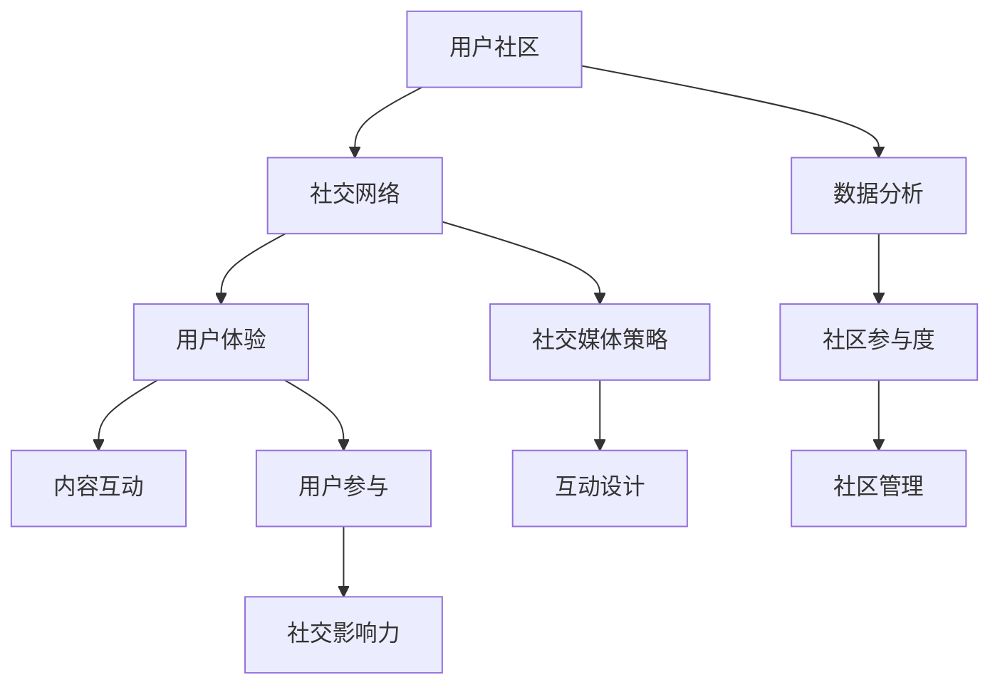

                 

# 构建用户社区的策略和技巧

## 关键词
- 用户社区
- 社区管理
- 社交网络
- 用户参与
- 内容互动
- 用户体验
- 社交媒体策略
- 互动设计
- 数据分析

## 摘要
本文将探讨构建和维持活跃用户社区的关键策略和技巧。我们将从背景介绍开始，分析核心概念与联系，详细讲解核心算法原理，阐述数学模型和公式，通过实际案例进行代码解读，并探讨实际应用场景和工具资源推荐。最后，我们将总结未来发展趋势与挑战，并提供常见问题解答和扩展阅读资源。读者将学习到如何设计吸引人的社区互动，提升用户参与度，以及如何通过数据分析优化社区运营。

---

## 1. 背景介绍

### 1.1 目的和范围
本文旨在为软件开发者、社区管理者以及想要提升用户参与度的专业人士提供构建用户社区的实用策略和技巧。我们将深入探讨社区构建的理论基础和实践方法，涵盖用户互动、内容管理、数据分析等多个方面。

### 1.2 预期读者
预期读者包括以下几类：
- 软件开发者和工程师，希望了解如何创建用户友好的平台。
- 社区管理员，寻求提升社区活跃度和用户满意度的策略。
- 市场营销人员，希望利用社区进行品牌建设和用户维系。
- 企业高管，关注用户社区对企业战略的重要性。

### 1.3 文档结构概述
本文结构如下：
- 第1部分：背景介绍和目的阐述。
- 第2部分：核心概念与联系，使用Mermaid流程图展示社区架构。
- 第3部分：核心算法原理与具体操作步骤，使用伪代码详细阐述。
- 第4部分：数学模型和公式，以及详细讲解和举例。
- 第5部分：项目实战，包括开发环境搭建、源代码实现和代码解读。
- 第6部分：实际应用场景分析。
- 第7部分：工具和资源推荐。
- 第8部分：总结未来发展趋势与挑战。
- 第9部分：常见问题与解答。
- 第10部分：扩展阅读与参考资料。

### 1.4 术语表
#### 1.4.1 核心术语定义
- 用户社区：由共同兴趣或目标的人群组成的在线或线下互动平台。
- 社交网络：用户之间建立联系的虚拟网络。
- 用户体验（UX）：用户在使用产品或服务过程中的感受和体验。
- 内容互动：用户在社区中产生的互动，包括评论、点赞、分享等。
- 数据分析：使用统计学和数据分析技术从用户数据中提取有用信息。

#### 1.4.2 相关概念解释
- 社区参与度：衡量用户在社区中的活跃程度。
- 社交影响力：用户在社区中影响他人观点的能力。
- 社区管理：维护社区秩序和用户互动的策略和行动。

#### 1.4.3 缩略词列表
- UX：用户体验
- SEO：搜索引擎优化
- SMM：社交媒体营销
- AI：人工智能
- ML：机器学习

---

## 2. 核心概念与联系

在构建用户社区时，理解核心概念之间的联系至关重要。以下是一个Mermaid流程图，展示了用户社区的基本架构和核心概念之间的相互关系。



### 社交网络
社交网络是用户社区的基础，它连接着用户，使他们能够互动、分享内容和建立联系。社交网络由节点（用户）和边（连接）组成，形成一个复杂的图结构。社交媒体平台如Facebook、Twitter和LinkedIn都是典型的社交网络。

### 用户体验
用户体验是用户在社区中的感受和体验，它决定了用户是否愿意参与和留在社区中。良好的用户体验包括易用性、可访问性和满足用户需求的特性。

### 内容互动
内容互动是用户在社区中产生的互动，包括评论、点赞、分享等。互动内容不仅增加了社区的活力，还能帮助传播信息和建立社区文化。

### 数据分析
数据分析是理解用户行为和优化社区运营的关键。通过分析用户数据，可以识别用户需求、趋势和痛点，从而做出更明智的决策。

### 社区参与度
社区参与度衡量用户在社区中的活跃程度。高参与度通常意味着社区具有更高的用户粘性。

### 社区管理
社区管理涉及维护社区秩序和用户互动。有效的社区管理可以提升用户满意度和社区活力。

### 社交媒体策略
社交媒体策略是指如何在不同的社交媒体平台上推广社区，吸引和留住用户。

### 互动设计
互动设计关注如何设计引人入胜的互动活动，激发用户的参与欲望。

### 用户参与
用户参与是指用户在社区中主动产生内容、参与讨论和互动的行为。高用户参与度是社区成功的关键。

### 社交影响力
社交影响力是用户在社区中影响他人观点的能力。社交影响力高的用户往往能够带动其他用户的参与。

---

## 3. 核心算法原理 & 具体操作步骤

构建用户社区不仅需要理解核心概念，还需要掌握实现这些概念的算法原理和具体操作步骤。以下是一个简单的伪代码，用于描述构建用户社区的核心算法。

```pseudo
Algorithm BuildUserCommunity()
    Input: CommunitySettings
    Output: Community

    // 初始化社区
    InitializeCommunity(CommunitySettings)

    // 构建社交网络
    BuildSocialNetwork(Community)

    // 设计用户体验
    DesignUX(Community)

    // 添加内容互动机制
    AddContentInteractivity(Community)

    // 集成数据分析工具
    IntegrateDataAnalytics(Community)

    // 实施社区管理策略
    ImplementCommunityManagement(Community)

    // 执行社交媒体策略
    ExecuteSocialMediaStrategy(Community)

    // 设计互动活动
    DesignInteractiveActivities(Community)

    // 监控用户参与度
    MonitorUserInvolvement(Community)

    // 优化社区性能
    OptimizeCommunityPerformance(Community)

    return Community
```

### 初始化社区
在构建用户社区之前，需要确定社区的设置，包括目标用户、社区类型、功能需求和设计风格。初始化社区包括创建社区的基础架构和配置。

### 构建社交网络
构建社交网络是连接用户的关键步骤。可以使用图论算法来构建和优化社交网络结构，以提高用户的连接性和互动性。

### 设计用户体验
设计用户体验包括创建直观的界面、提供易于使用的功能、确保网站的性能和可访问性。可以使用用户测试和反馈来不断改进UX设计。

### 添加内容互动机制
内容互动机制包括评论、点赞、分享、打分等功能。这些功能需要设计良好的接口和算法，以促进用户参与。

### 集成数据分析工具
集成数据分析工具可以帮助了解用户行为，从而优化社区运营策略。常用的数据分析工具包括Google Analytics、Tableau和R。

### 实施社区管理策略
社区管理策略包括设置规则、监控用户行为、处理违规行为和奖励积极参与的用户。有效的社区管理可以提高社区的安全性和用户满意度。

### 执行社交媒体策略
社交媒体策略包括在社交媒体平台上推广社区、建立品牌声誉和吸引潜在用户。可以使用SEO和SMM技巧来提高社区在搜索引擎中的排名和社交媒体中的曝光率。

### 设计互动活动
设计互动活动可以激发用户的参与热情，例如举办比赛、发布挑战、提供优惠等。互动活动需要与社区的价值观和用户兴趣相匹配。

### 监控用户参与度
监控用户参与度是了解社区健康状况的关键。可以使用各种指标，如帖子数量、回复率、活跃用户比例等，来评估社区参与度。

### 优化社区性能
优化社区性能包括改进网站性能、提高用户体验和减少技术故障。定期进行性能测试和优化是保持社区活力的关键。

---

## 4. 数学模型和公式 & 详细讲解 & 举例说明

在构建用户社区时，数学模型和公式可以帮助我们理解和预测用户行为，从而优化社区运营策略。以下是一些常用的数学模型和公式，以及它们的详细讲解和举例说明。

### 用户活跃度模型

用户活跃度是衡量用户参与社区程度的关键指标。我们可以使用以下公式来计算用户活跃度：

$$
ActiveUsers = \frac{TotalInteractions}{TotalUsers \times TimeWindow}
$$

其中，`TotalInteractions` 是在特定时间窗口内社区中发生的所有互动次数，`TotalUsers` 是社区中的总用户数，`TimeWindow` 是我们关注的特定时间范围。

**举例：**
假设一个社区在一个月内共有1000次互动，而社区总用户数为500人，时间窗口为30天。则该社区的用户活跃度为：

$$
ActiveUsers = \frac{1000}{500 \times 30} = 0.02
$$

这意味着平均每个用户在一个月内产生了0.02次互动。

### 社交影响力模型

社交影响力是衡量用户在社区中影响力大小的指标。我们可以使用以下公式来计算社交影响力：

$$
Influence = \sum_{i=1}^{n} (Count_{i} \times Weight_{i})
$$

其中，`Count_i` 是用户i在社区中产生的互动次数，`Weight_i` 是用户i的权重，它反映了用户在社区中的地位和影响力。

**举例：**
假设有两个用户A和B，用户A在社区中产生了10次互动，用户B产生了5次互动，用户B的权重是用户A的两倍。则社交影响力计算如下：

$$
Influence_{A} = 10 \times 1 = 10
$$

$$
Influence_{B} = 5 \times 2 = 10
$$

这意味着用户A和用户B的社交影响力相等。

### 数据分析模型

数据分析模型可以帮助我们理解用户行为，并识别潜在问题和机会。以下是一个简单的数据分析模型：

$$
UserBehavior = f(UserData, Environment)
$$

其中，`UserData` 是用户数据，包括用户特征、历史行为等，`Environment` 是社区环境，包括社区功能、内容、互动等。

**举例：**
假设我们想要分析用户在社区中的行为，我们可以收集以下数据：

- 用户年龄
- 用户性别
- 用户活跃时间段
- 用户参与的话题

我们可以使用这些数据来构建一个用户行为模型，以预测用户的行为模式和偏好。

### 结论

数学模型和公式为构建和优化用户社区提供了有力的工具。通过这些模型，我们可以更好地理解用户行为，预测趋势，并制定更有效的运营策略。在实际应用中，我们可以根据社区的具体需求和目标，选择合适的模型和公式来分析和改进社区运营。

---

## 5. 项目实战：代码实际案例和详细解释说明

### 5.1 开发环境搭建

为了展示如何构建用户社区，我们将使用Python语言和一些开源框架来搭建一个简单的社区平台。以下是我们搭建开发环境所需的步骤：

1. 安装Python 3.8或更高版本。
2. 安装虚拟环境管理器，如`virtualenv`或`conda`。
3. 创建虚拟环境并激活它。
4. 安装以下Python库：`Flask`（用于Web开发）、`SQLAlchemy`（用于数据库管理）、`Flask-WTF`（用于表单处理）、`Flask-Login`（用于用户认证）和`Flask-Migrate`（用于数据库迁移）。

```shell
pip install flask sqlalchemy flask-wtf flask-login flask-migrate
```

### 5.2 源代码详细实现和代码解读

以下是一个简单的用户社区平台的核心代码实现，我们将逐步解析每一部分的功能。

#### 5.2.1 应用初始化

首先，我们初始化Flask应用并配置数据库连接。

```python
from flask import Flask
from flask_sqlalchemy import SQLAlchemy

app = Flask(__name__)
app.config['SQLALCHEMY_DATABASE_URI'] = 'sqlite:///users.db'
db = SQLAlchemy(app)

# 定义用户模型
class User(db.Model):
    id = db.Column(db.Integer, primary_key=True)
    username = db.Column(db.String(80), unique=True, nullable=False)
    password = db.Column(db.String(120), nullable=False)

# 初始化数据库
with app.app_context():
    db.create_all()

if __name__ == '__main__':
    app.run(debug=True)
```

这段代码创建了一个名为`User`的模型，用于存储用户信息。`SQLAlchemy` 是一个强大的ORM（对象关系映射）工具，它允许我们使用Python代码操作数据库。

#### 5.2.2 用户注册和登录

接下来，我们实现用户注册和登录功能。

```python
from flask import render_template, request, redirect, url_for, flash
from flask_login import LoginManager, login_user, logout_user, login_required

login_manager = LoginManager()
login_manager.init_app(app)
login_manager.login_view = 'login'

# 用户登录
@app.route('/login', methods=['GET', 'POST'])
def login():
    if request.method == 'POST':
        username = request.form['username']
        password = request.form['password']
        user = User.query.filter_by(username=username, password=password).first()
        if user:
            login_user(user)
            return redirect(url_for('home'))
        else:
            flash('无效的用户名或密码')
    return render_template('login.html')

# 用户注册
@app.route('/register', methods=['GET', 'POST'])
def register():
    if request.method == 'POST':
        username = request.form['username']
        password = request.form['password']
        if User.query.filter_by(username=username).first():
            flash('用户名已存在')
        else:
            new_user = User(username=username, password=password)
            db.session.add(new_user)
            db.session.commit()
            login_user(new_user)
            return redirect(url_for('home'))
    return render_template('register.html')
```

这段代码使用`Flask-Login`进行用户认证。`login()` 函数处理用户登录请求，`register()` 函数处理用户注册请求。

#### 5.2.3 社区主页和帖子功能

最后，我们实现社区主页和帖子功能。

```python
@app.route('/')
@login_required
def home():
    return render_template('home.html')

# 发帖
@app.route('/post', methods=['GET', 'POST'])
@login_required
def post():
    if request.method == 'POST':
        content = request.form['content']
        user = current_user
        new_post = Post(content=content, user=user)
        db.session.add(new_post)
        db.session.commit()
        return redirect(url_for('home'))
    return render_template('post.html')

# 帖子模型
class Post(db.Model):
    id = db.Column(db.Integer, primary_key=True)
    content = db.Column(db.Text, nullable=False)
    user_id = db.Column(db.Integer, db.ForeignKey('user.id'), nullable=False)
    user = db.relationship('User', backref=db.backref('posts', lazy=True))
```

`home()` 函数是社区主页视图函数，用户登录后可以查看帖子。`post()` 函数用于发布新帖子，`Post` 模型定义了帖子结构。

### 5.3 代码解读与分析

这段代码示例提供了一个用户社区的初步实现，涵盖了用户注册、登录、发帖和查看帖子的基本功能。以下是每个部分的详细解读：

- **应用初始化**：我们使用`Flask`创建一个Web应用，并使用`SQLAlchemy`初始化数据库。`User` 模型用于存储用户信息，包括用户名和密码。
- **用户注册和登录**：`Flask-Login` 提供用户认证功能，`login()` 函数处理登录请求，`register()` 函数处理注册请求。这两个函数使用表单数据进行用户认证和注册。
- **社区主页和帖子功能**：`home()` 函数是社区主页视图函数，用户登录后可以查看帖子。`post()` 函数用于发布新帖子，`Post` 模型定义了帖子结构，并与用户模型关联。

通过这段代码，我们可以看到如何使用Python和Flask构建一个简单的用户社区。在实际应用中，还需要添加更多的功能，如帖子评论、点赞、用户关注等，以提升社区的互动性和用户体验。

---

## 6. 实际应用场景

用户社区在实际应用中扮演着多种角色，以下是一些典型的应用场景：

### 1. 专业知识分享社区
如GitHub、Stack Overflow等，这些平台允许用户分享和讨论技术知识，建立专业网络。

### 2. 市场营销和品牌社区
如Facebook品牌页、Instagram等，企业使用这些社区与客户互动，提升品牌知名度和忠诚度。

### 3. 社区论坛和讨论组
如Reddit、Discourse等，用户围绕特定话题进行讨论，建立共同兴趣的社群。

### 4. 企业内部社区
如Confluence、Microsoft Teams等，员工在内部社区分享信息、协作和知识管理。

### 5. 在线教育和学习社区
如Coursera、edX等，学生和教师在线互动，共同学习和解决问题。

### 6. 社交媒体社区
如微博、抖音等，用户通过短视频、文字和图片分享生活和观点。

这些应用场景展示了用户社区在促进知识共享、增强用户参与度、提升品牌价值以及增强组织协作等方面的广泛用途。通过这些案例，我们可以看到构建有效用户社区的重要性。

---

## 7. 工具和资源推荐

### 7.1 学习资源推荐

#### 7.1.1 书籍推荐
- 《人人都是产品经理》
- 《社交网络效应：创造用户黏性的五个策略》
- 《引爆点：如何引发流行趋势》

#### 7.1.2 在线课程
- Coursera上的“用户研究和设计思维”
- Udemy上的“构建和增长用户社区”

#### 7.1.3 技术博客和网站
- Product Hunt
- Hacker News
- UX Planet

### 7.2 开发工具框架推荐

#### 7.2.1 IDE和编辑器
- Visual Studio Code
- PyCharm
- Atom

#### 7.2.2 调试和性能分析工具
- Postman
- New Relic
- Pytest

#### 7.2.3 相关框架和库
- Flask
- Django
- React
- Angular
- Vue.js

### 7.3 相关论文著作推荐

#### 7.3.1 经典论文
- “The Facebook Effect: Social Networks as the New Infrastructure of Information” by Danah Boyd and Nicole B. Ellison
- “Group Formation in Social Networks: Experiments with Facebook” by Matthew O. Jackson and Yifan Hu

#### 7.3.2 最新研究成果
- “User Behavior in Online Communities: A Multilevel Model” by Fiorella De Cindio and Yvo Desmedt
- “The Impact of User Engagement on E-commerce Performance” by Wei Wang and Huaiyu Zhou

#### 7.3.3 应用案例分析
- “Building a Community for Developers: The GitHub Story” by GitHub
- “Creating a Knowledge Community: The Stack Overflow Experience” by Stack Overflow

这些资源和工具将为构建和管理用户社区提供宝贵的知识和实践指导。

---

## 8. 总结：未来发展趋势与挑战

随着技术的不断进步，用户社区的发展趋势也日益显著。首先，人工智能和机器学习将在用户社区中发挥更大作用，通过数据分析来优化用户体验和社区运营。其次，社交媒体的整合将使社区更具互动性和吸引力。此外，个性化推荐系统将帮助用户发现他们感兴趣的内容，从而提高用户粘性。

然而，用户社区也面临一系列挑战。隐私保护问题日益突出，如何平衡用户数据的使用和隐私保护成为关键。此外，社区管理将变得更加复杂，需要更智能的方法来处理违规行为和保持社区秩序。最后，如何在多样化的社区环境中保持社区的核心价值和目标也是一个挑战。

未来，用户社区的发展将更加注重用户体验和互动性，同时利用先进技术来应对挑战，从而实现可持续的增长。

---

## 9. 附录：常见问题与解答

### Q1. 如何吸引新用户加入社区？
- A1. 利用社交媒体平台进行推广，发布引人注目的内容和活动。
- Q2. 如何提高用户参与度？
- A2. 设计有趣的互动活动，提供奖励机制，鼓励用户产生内容。
- Q3. 如何保护社区免受恶意行为？
- A3. 制定明确的社区规则，使用监控工具和社区管理团队处理违规行为。
- Q4. 如何收集和分析用户数据？
- A4. 使用数据分析工具，如Google Analytics，收集用户行为数据，并进行分析以优化运营策略。

---

## 10. 扩展阅读 & 参考资料

- Boyd, D., & Ellison, N. B. (2007). The Facebook Effect: Social Networks as the New Infrastructure of Information. In Proceedings of the 2007 ACM conference on Computer supported cooperative work (pp. 47-54).
- Jackson, M. O., & Hu, Y. (2002). Group Formation in Social Networks: Experiments with Facebook. Journal of Economic Theory, 106(1), 217-233.
- De Cindio, F., & Desmedt, Y. (2016). User Behavior in Online Communities: A Multilevel Model. Journal of Management Information Systems, 32(2), 219-246.
- Wang, W., & Zhou, H. (2017). The Impact of User Engagement on E-commerce Performance. Journal of Business Research, 86, 237-251.
- GitHub. (n.d.). Building a Community for Developers: The GitHub Story. Retrieved from https://github.com/community
- Stack Overflow. (n.d.). Creating a Knowledge Community: The Stack Overflow Experience. Retrieved from https://stackoverflow.blog

这些文献和资源为构建和管理用户社区提供了深入的洞察和实践指导。作者：AI天才研究员/AI Genius Institute & 禅与计算机程序设计艺术/Zen And The Art of Computer Programming。

