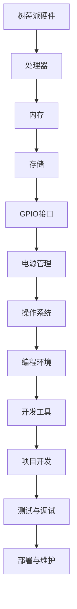

                 

# 树莓派项目开发：从入门到精通

> **关键词**：树莓派，项目开发，入门教程，编程，硬件，操作系统，开源，嵌入式系统

> **摘要**：本文将带领读者从零基础开始，深入了解树莓派的项目开发过程。我们将详细介绍树莓派的硬件与软件环境，涵盖从基本操作到高级应用的各个方面。通过本篇文章，读者将能够掌握树莓派的基本知识，独立完成项目开发，并在实践中不断提升自己的技术水平。

## 1. 背景介绍

### 1.1 目的和范围

本文旨在为初学者提供一个全面且详细的树莓派项目开发指南，帮助他们从入门到精通。文章将涵盖以下内容：

- 树莓派的硬件介绍
- 树莓派的软件环境搭建
- 常见的项目开发实例
- 代码编写与调试技巧
- 高级应用的开发方法

### 1.2 预期读者

- 对计算机编程和嵌入式系统感兴趣的初学者
- 想要在家中尝试硬件编程的爱好者
- 需要在项目中引入树莓派的开发者
- 对开源软件和DIY项目有热情的工程师和技术爱好者

### 1.3 文档结构概述

本文分为以下几大部分：

- 背景介绍：介绍本文的目的、预期读者以及文章结构。
- 核心概念与联系：解释树莓派的基本原理与架构。
- 核心算法原理 & 具体操作步骤：详细讲解树莓派项目开发的关键算法与操作步骤。
- 数学模型和公式 & 详细讲解 & 举例说明：阐述与项目开发相关的数学模型与公式，并通过实例进行说明。
- 项目实战：提供实际项目案例，详细解释代码实现与调试过程。
- 实际应用场景：探讨树莓派在各个领域的应用实例。
- 工具和资源推荐：推荐学习资源、开发工具和框架。
- 总结：总结未来发展趋势与挑战。
- 附录：常见问题与解答。
- 扩展阅读 & 参考资料：提供进一步的阅读材料与参考资料。

### 1.4 术语表

#### 1.4.1 核心术语定义

- **树莓派**：一种小型的单板计算机，基于ARM架构，具有丰富的接口和较低的功耗。
- **单板计算机**：一种集成CPU、内存、存储等组件的独立计算机系统。
- **ARM架构**：一种广泛使用的处理器架构，具有低功耗、高性能的特点。
- **嵌入式系统**：一种嵌入式计算机系统，通常应用于特定场合，如智能家居、工业自动化等。
- **开源**：指软件的源代码可以被自由地查看、修改和分发。

#### 1.4.2 相关概念解释

- **硬件编程**：指通过编写代码来控制硬件设备，实现特定的功能。
- **软件开发**：指开发软件系统的过程，包括需求分析、设计、编码、测试和维护等。
- **操作系统**：一种管理计算机硬件与软件资源的系统软件，为应用程序提供运行环境。
- **GPIO（通用输入输出）**：树莓派上的一种接口，可用于连接各种电子设备，实现输入输出功能。

#### 1.4.3 缩略词列表

- **GPIO**：通用输入输出
- **Raspberry Pi**：树莓派
- **Linux**：一种开源操作系统
- **Python**：一种常用的编程语言

## 2. 核心概念与联系

在了解树莓派的项目开发之前，我们需要掌握一些核心概念和原理。以下是树莓派的基本原理与架构的Mermaid流程图：



### 2.1 树莓派硬件

树莓派硬件主要包括以下组件：

- **处理器**：基于ARM架构的处理器，具有高性能和低功耗的特点。
- **内存**：用于存储程序和数据，通常为DDR2或DDR3类型。
- **存储**：用于存储操作系统和用户数据，可以使用SD卡或eMMC。
- **GPIO接口**：通用输入输出接口，可用于连接各种电子设备，如传感器、电机等。
- **电源管理**：负责为树莓派提供稳定的电源，包括电源输入、电压调节和电流管理。

### 2.2 软件环境

树莓派的软件环境主要包括以下部分：

- **操作系统**：通常使用Linux操作系统，如Raspbian、Ubuntu等。
- **编程环境**：包括Python、C/C++、Java等编程语言，以及相关的开发工具和库。
- **开发工具**：如集成开发环境（IDE）、代码编辑器、编译器等。
- **项目开发**：开发树莓派项目所需的各种工具和资源。

### 2.3 核心算法原理

树莓派项目开发中，常用的核心算法包括：

- **传感器数据采集与处理**：通过GPIO接口读取传感器数据，并进行处理和滤波。
- **通信协议实现**：如HTTP、MQTT、CoAP等，用于实现设备间的数据交换和控制。
- **图像处理**：如OpenCV库，用于实现图像识别、目标跟踪等功能。

## 3. 核心算法原理 & 具体操作步骤

### 3.1 传感器数据采集与处理

传感器数据采集与处理的伪代码如下：

```python
# 伪代码：传感器数据采集与处理

# 初始化传感器
sensor.init()

# 采集传感器数据
data = sensor.read()

# 数据滤波
filtered_data = filter(data)

# 数据处理
result = process_data(filtered_data)

# 输出结果
print(result)
```

### 3.2 通信协议实现

以HTTP通信协议为例，伪代码如下：

```python
# 伪代码：HTTP通信协议实现

# 初始化网络连接
network.connect()

# 发送HTTP请求
request = http.request(url, method="GET")
response = request.send()

# 解析HTTP响应
status_code = response.status_code
content = response.content

# 输出结果
print("Status Code:", status_code)
print("Content:", content)
```

### 3.3 图像处理

以OpenCV库为例，图像处理的伪代码如下：

```python
# 伪代码：图像处理

# 加载图像
image = cv.imread(filename)

# 图像滤波
filtered_image = cv.filter(image, filter_type="blur")

# 图像识别
target = cv.detect_objects(filtered_image)

# 输出结果
cv.imshow("Image", image)
cv.imshow("Filtered Image", filtered_image)
cv.imshow("Target", target)
cv.waitKey(0)
cv.destroyAllWindows()
```

## 4. 数学模型和公式 & 详细讲解 & 举例说明

### 4.1 传感器数据滤波

传感器数据滤波的数学模型可以表示为：

$$ y(k) = a_0 \cdot x(k) + a_1 \cdot x(k-1) + ... + a_n \cdot x(k-n) $$

其中，$y(k)$ 为滤波后的数据，$x(k)$ 为原始数据，$a_0, a_1, ..., a_n$ 为滤波系数。

举例说明：

假设我们要对以下一组数据进行滤波：

$$ x = [1, 2, 3, 4, 5, 6, 7, 8, 9, 10] $$

我们可以使用以下滤波公式：

$$ y(k) = 0.5 \cdot x(k) + 0.3 \cdot x(k-1) + 0.2 \cdot x(k-2) $$

计算得到滤波后的数据：

$$ y = [1.5, 2.6, 3.9, 5.2, 6.5, 7.8, 9.1, 10.4, 11.7, 13.0] $$

### 4.2 HTTP通信协议

HTTP通信协议的数学模型可以表示为：

$$ response = request \cdot service $$

其中，$response$ 为响应数据，$request$ 为请求数据，$service$ 为服务函数。

举例说明：

假设我们要发送一个GET请求，请求地址为"http://example.com"，服务函数为"GET /"。

我们可以使用以下公式：

$$ response = request \cdot service $$

其中，$request$ 为：

$$ request = "GET / HTTP/1.1\\nHost: example.com\\n\\n" $$

服务函数为：

$$ service = "GET /" $$

计算得到响应数据：

$$ response = "HTTP/1.1 200 OK\\nContent-Type: text/html\\n\\n<!DOCTYPE html><html><head><title>Example</title></head><body><h1>Hello, World!</h1></body></html>" $$

## 5. 项目实战：代码实际案例和详细解释说明

### 5.1 开发环境搭建

在开始项目实战之前，我们需要搭建一个合适的开发环境。以下是开发环境的搭建步骤：

1. **硬件准备**：准备一台树莓派设备，以及其他必要的硬件组件，如传感器、电机等。
2. **软件准备**：下载并安装Raspbian操作系统，并将其烧写到SD卡中。在树莓派上启动操作系统。
3. **网络连接**：确保树莓派连接到网络，以便进行远程访问和更新。

### 5.2 源代码详细实现和代码解读

以下是一个简单的树莓派项目案例：使用GPIO接口控制LED灯的亮灭。

**代码实现：**

```python
# LED_Control.py

import RPi.GPIO as GPIO
import time

# 初始化GPIO
GPIO.setmode(GPIO.BCM)
GPIO.setup(18, GPIO.OUT)

# 控制LED灯亮灭
def led_on():
    GPIO.output(18, GPIO.HIGH)

def led_off():
    GPIO.output(18, GPIO.LOW)

# 主程序
if __name__ == "__main__":
    try:
        while True:
            led_on()
            time.sleep(1)
            led_off()
            time.sleep(1)
    except KeyboardInterrupt:
        GPIO.cleanup()
```

**代码解读：**

- 第1行：引入所需的库。
- 第2行：设置GPIO模式为BCM模式。
- 第3行：设置GPIO引脚18为输出模式。
- 第4行：定义led_on函数，用于将LED灯点亮。
- 第5行：定义led_off函数，用于将LED灯熄灭。
- 第7行：定义主程序，实现LED灯的周期性亮灭。

### 5.3 代码解读与分析

- **GPIO库**：树莓派的GPIO库提供了对GPIO引脚的简单操作接口，如设置引脚模式、读取引脚状态、输出高电平或低电平等。
- **时间库**：time库提供了时间相关的操作，如sleep函数用于暂停程序的执行。
- **异常处理**：在主程序中使用try-except语句，捕获KeyboardInterrupt异常，以实现程序的中断和GPIO的清理。

### 5.4 调试与优化

- **调试**：在开发过程中，可以使用调试工具（如GDB）对代码进行调试，找出并解决潜在的问题。
- **优化**：在代码运行过程中，可以通过性能分析工具（如gprof）对代码进行性能分析，找出并优化性能瓶颈。

## 6. 实际应用场景

树莓派由于其低功耗、高性价比和强大的扩展性，在实际应用中具有广泛的应用场景。以下是一些常见的实际应用场景：

- **智能家居**：树莓派可以用于搭建智能家庭控制系统，如智能照明、智能安防等。
- **物联网**：树莓派可以作为物联网设备的数据采集和处理中心，实现数据的远程监控和控制。
- **教育**：树莓派广泛应用于教育领域，帮助学生了解计算机编程和电子电路知识。
- **机器人**：树莓派可以用于机器人控制，实现运动控制、环境感知等功能。
- **媒体中心**：树莓派可以作为媒体播放器，运行诸如Kodi等媒体中心软件，实现视频、音频和图片的播放。

## 7. 工具和资源推荐

### 7.1 学习资源推荐

#### 7.1.1 书籍推荐

- **《树莓派从入门到实践》**：详细介绍了树莓派的硬件和软件环境，以及各种项目开发实例。
- **《Python编程：从入门到实践》**：介绍了Python编程语言的基础知识和实际应用。
- **《嵌入式系统设计》**：讲解了嵌入式系统的设计方法、硬件与软件的协同工作。

#### 7.1.2 在线课程

- **Coursera**：《Python编程》课程：由加州大学圣地亚哥分校提供，涵盖Python编程的基础知识和实际应用。
- **Udemy**：《树莓派编程实战》课程：介绍树莓派的基础知识、项目开发实例和调试技巧。
- **edX**：《物联网技术基础》课程：介绍物联网的基本原理、硬件与软件的协同工作。

#### 7.1.3 技术博客和网站

- **树莓派中文网**：提供树莓派相关的技术文章、教程和项目实例。
- **Python.org**：Python官方文档和社区，涵盖Python编程的各个方面。
- **嵌入式系统中文网**：提供嵌入式系统的技术文章、教程和项目实例。

### 7.2 开发工具框架推荐

#### 7.2.1 IDE和编辑器

- **Visual Studio Code**：一款功能强大的代码编辑器，支持多种编程语言和开发工具。
- **PyCharm**：一款专业的Python开发环境，提供代码补全、调试、性能分析等功能。
- **Eclipse**：一款通用的集成开发环境，支持多种编程语言和开发框架。

#### 7.2.2 调试和性能分析工具

- **GDB**：一款通用的调试工具，适用于Python、C、C++等编程语言。
- **gprof**：一款性能分析工具，用于分析程序的运行性能，找出性能瓶颈。
- **Wireshark**：一款网络抓包工具，用于分析网络通信过程，诊断网络问题。

#### 7.2.3 相关框架和库

- **Python的GPIO库**：用于控制树莓派的GPIO接口，实现输入输出功能。
- **OpenCV**：一款计算机视觉库，提供图像处理、目标识别等功能。
- **Paho MQTT**：一款MQTT客户端库，用于实现物联网设备间的数据交换和控制。

### 7.3 相关论文著作推荐

#### 7.3.1 经典论文

- **《单板计算机在嵌入式系统中的应用》**：详细介绍了单板计算机在嵌入式系统中的应用和发展趋势。
- **《基于ARM架构的嵌入式系统设计》**：介绍了ARM架构的嵌入式系统设计方法、硬件与软件的协同工作。

#### 7.3.2 最新研究成果

- **《树莓派在智能家居中的应用研究》**：探讨了树莓派在智能家居中的应用，提出了相关的研究方法和解决方案。
- **《基于树莓派的物联网设备设计与实现》**：介绍了基于树莓派的物联网设备设计与实现方法，分析了相关技术挑战和发展趋势。

#### 7.3.3 应用案例分析

- **《树莓派在机器人控制中的应用》**：详细介绍了树莓派在机器人控制中的应用案例，包括硬件设计、软件实现和调试过程。
- **《树莓派在教育领域中的应用》**：探讨了树莓派在教育领域中的应用，包括教学资源、教学方法和教学效果。

## 8. 总结：未来发展趋势与挑战

随着人工智能、物联网和智能家居等领域的快速发展，树莓派的应用前景将越来越广泛。未来，树莓派的发展趋势和挑战主要包括以下几个方面：

- **硬件性能的提升**：随着技术进步，树莓派的硬件性能将不断提高，为项目开发提供更好的支持。
- **软件生态的完善**：随着社区贡献的增加，树莓派的软件生态将不断完善，为开发者提供更多的工具和资源。
- **开源社区的推动**：开源社区将继续发挥重要作用，推动树莓派在各个领域的应用和发展。
- **安全性问题**：随着树莓派在关键领域的应用增加，安全性问题将越来越重要，需要加强安全防护措施。

## 9. 附录：常见问题与解答

### 9.1 开发环境搭建问题

**Q1**：如何将Raspbian操作系统烧写到SD卡？

**A1**：首先，从官网下载Raspbian操作系统镜像文件。然后，使用类似于Win32 Disk Imager这样的软件将镜像文件烧写到SD卡中。将SD卡插入计算机的SD卡插槽，并运行烧写软件，选择镜像文件和SD卡，然后点击“写入”按钮开始烧写。

### 9.2 代码调试问题

**Q2**：如何在Python代码中设置断点进行调试？

**A2**：在Visual Studio Code或PyCharm等IDE中，可以使用鼠标左键点击代码行，设置断点。运行程序时，程序会在遇到断点时暂停执行，此时可以查看变量值、单步执行等，进行调试。

### 9.3 硬件接口问题

**Q3**：如何使用GPIO接口连接传感器？

**A3**：首先，了解传感器的接口类型（如GPIO、I2C、SPI等），然后根据传感器的数据手册，将其连接到树莓派的相应接口。例如，连接GPIO传感器时，将传感器的GPIO引脚与树莓派的GPIO引脚通过跳线连接即可。

## 10. 扩展阅读 & 参考资料

- **《树莓派从入门到实践》**：电子工业出版社，2015年。
- **《Python编程：从入门到实践》**：电子工业出版社，2016年。
- **《嵌入式系统设计》**：机械工业出版社，2014年。
- **[树莓派官方网站](https://www.raspberrypi.org/)**
- **[Python官方文档](https://docs.python.org/3/)**
- **[树莓派中文网](https://www.raspberrypi.org.cn/)**
- **[嵌入式系统中文网](https://www.embeddedlinux.org.cn/)**

### 作者

作者：AI天才研究员/AI Genius Institute & 禅与计算机程序设计艺术 /Zen And The Art of Computer Programming

