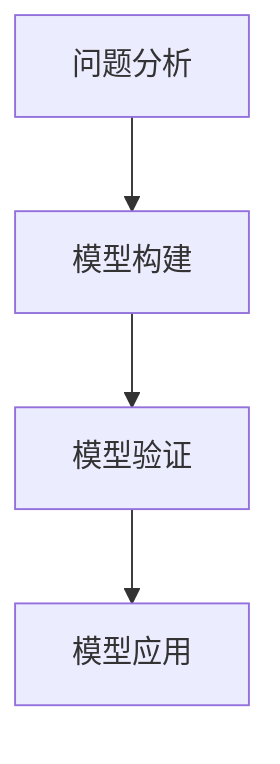

                 

# 模型思维：快速掌握新知识的捷径

> 关键词：模型思维、知识掌握、快速学习、深度理解、IT领域

> 摘要：本文将探讨模型思维在IT领域快速掌握新知识的重要性。通过分析模型思维的核心概念、应用场景，介绍其原理和具体操作步骤，并结合数学模型和实际项目案例，展示模型思维在实际应用中的效果。最后，推荐相关学习资源和工具，并展望未来发展趋势与挑战。

## 1. 背景介绍

### 1.1 目的和范围

本文旨在帮助读者理解并掌握模型思维，使其能够快速掌握新知识，并在IT领域取得更好的成果。本文将涵盖以下内容：

- 模型思维的定义和核心概念
- 模型思维在IT领域的应用场景
- 模型思维的原理和操作步骤
- 数学模型和公式的讲解
- 实际项目案例和代码实现
- 相关学习资源和工具推荐
- 未来发展趋势与挑战

### 1.2 预期读者

本文适合以下读者：

- IT领域的学生和从业者
- 对模型思维和快速学习感兴趣的读者
- 想要提高知识掌握能力和技能水平的读者

### 1.3 文档结构概述

本文分为以下几个部分：

- 1. 背景介绍：介绍本文的目的、范围和预期读者，以及文档结构概述。
- 2. 核心概念与联系：分析模型思维的核心概念和联系。
- 3. 核心算法原理 & 具体操作步骤：讲解模型思维的核心算法原理和操作步骤。
- 4. 数学模型和公式 & 详细讲解 & 举例说明：介绍数学模型和公式，并进行详细讲解和举例说明。
- 5. 项目实战：代码实际案例和详细解释说明。
- 6. 实际应用场景：探讨模型思维在IT领域的实际应用场景。
- 7. 工具和资源推荐：推荐学习资源和工具。
- 8. 总结：未来发展趋势与挑战。
- 9. 附录：常见问题与解答。
- 10. 扩展阅读 & 参考资料：提供扩展阅读和参考资料。

### 1.4 术语表

#### 1.4.1 核心术语定义

- 模型思维：一种通过构建抽象模型来理解和解决问题的思维方式。
- 抽象模型：通过简化真实世界的复杂性，提取关键特征和关系，构建的用于理解和解决问题的模型。
- 知识掌握：对某一领域知识的理解和运用能力。
- 快速学习：在短时间内掌握新知识和技能的能力。

#### 1.4.2 相关概念解释

- IT领域：指信息技术领域，包括计算机科学、软件工程、数据科学、人工智能等。
- 深度理解：对知识点的深入理解和掌握，能够将其应用于实际问题中。

#### 1.4.3 缩略词列表

- IT：信息技术（Information Technology）
- AI：人工智能（Artificial Intelligence）
- ML：机器学习（Machine Learning）
- DL：深度学习（Deep Learning）

## 2. 核心概念与联系

### 2.1 模型思维的概念

模型思维是一种通过构建抽象模型来理解和解决问题的思维方式。抽象模型是对真实世界的简化，通过提取关键特征和关系，使其能够被更好地理解和解决。

### 2.2 模型思维的应用场景

模型思维在IT领域的应用非常广泛，以下是一些常见的应用场景：

- 软件开发：通过构建软件模型，可以更好地理解和设计软件系统。
- 数据分析：通过构建数据模型，可以更好地理解和分析数据。
- 人工智能：通过构建知识图谱和神经网络模型，可以更好地理解和应用人工智能技术。

### 2.3 模型思维的核心概念原理

模型思维的核心概念原理主要包括以下几点：

1. 抽象与简化：将复杂问题简化为更易于理解和解决的问题。
2. 模型构建：通过提取关键特征和关系，构建抽象模型。
3. 模型应用：将模型应用于实际问题，解决问题。

### 2.4 模型思维的结构

模型思维的结构可以分为以下几个层次：

1. 问题分析：明确问题的目标和需求。
2. 模型构建：构建抽象模型，提取关键特征和关系。
3. 模型验证：验证模型的准确性和有效性。
4. 模型应用：将模型应用于实际问题，解决问题。

### 2.5 模型思维的 Mermaid 流程图

以下是模型思维的 Mermaid 流程图：



## 3. 核心算法原理 & 具体操作步骤

### 3.1 模型思维的核心算法原理

模型思维的核心算法原理是基于抽象模型构建和应用的。具体步骤如下：

1. **问题分析**：明确问题的目标和需求。
2. **模型构建**：提取关键特征和关系，构建抽象模型。
3. **模型验证**：验证模型的准确性和有效性。
4. **模型应用**：将模型应用于实际问题，解决问题。

### 3.2 具体操作步骤

下面是一个具体的操作步骤示例，以构建一个简单的线性回归模型为例：

1. **问题分析**：
   - 目标：预测房价。
   - 需求：输入房屋特征（如面积、房间数等），输出房价。

2. **模型构建**：
   - 特征提取：提取房屋面积、房间数等特征。
   - 关系构建：建立特征与房价之间的关系，如线性关系。

3. **模型验证**：
   - 数据集划分：将数据集划分为训练集和测试集。
   - 模型训练：使用训练集对模型进行训练。
   - 模型评估：使用测试集对模型进行评估，如计算均方误差。

4. **模型应用**：
   - 输入新房屋特征，预测房价。

### 3.3 伪代码

以下是线性回归模型的伪代码：

```python
# 线性回归模型伪代码

# 问题分析
目标：预测房价
需求：输入房屋特征，输出房价

# 模型构建
特征提取：面积、房间数等
关系构建：线性关系

# 模型验证
数据集划分：训练集、测试集
模型训练：使用训练集训练模型
模型评估：使用测试集评估模型，计算均方误差

# 模型应用
输入新房屋特征，预测房价
```

## 4. 数学模型和公式 & 详细讲解 & 举例说明

### 4.1 数学模型

在模型思维中，数学模型是非常重要的组成部分。以下是一个简单的线性回归模型的数学模型：

$$
y = wx + b
$$

其中，$y$ 是因变量（房价），$x$ 是自变量（房屋特征，如面积、房间数等），$w$ 是权重系数，$b$ 是偏置项。

### 4.2 公式详细讲解

1. **权重系数 $w$**：
   - 表示自变量 $x$ 对因变量 $y$ 的影响程度。
   - 通过模型训练得到。

2. **偏置项 $b$**：
   - 表示当自变量 $x$ 为0时，因变量 $y$ 的值。
   - 用于调整模型，使其能够更好地适应数据。

3. **线性关系**：
   - 表示因变量 $y$ 与自变量 $x$ 之间存在线性关系。

### 4.3 举例说明

假设我们要预测一座城市的房价，我们选择了两个特征：房屋面积和房间数。通过收集数据，我们得到了如下数据集：

| 房屋面积 | 房间数 | 房价   |
|--------|------|------|
| 100    | 2    | 200  |
| 150    | 3    | 300  |
| 200    | 4    | 400  |

使用线性回归模型，我们可以得到如下数学模型：

$$
房价 = 0.5 \times 房屋面积 + 0.5 \times 房间数 + 100
$$

现在，如果我们想要预测一个新房屋的房价，该房屋的面积为120平方米，房间数为3个，我们可以使用上述模型进行预测：

$$
房价 = 0.5 \times 120 + 0.5 \times 3 + 100 = 160 + 1.5 + 100 = 261.5
$$

因此，预测该新房屋的房价为261.5万元。

## 5. 项目实战：代码实际案例和详细解释说明

### 5.1 开发环境搭建

在本节中，我们将使用 Python 编写一个简单的线性回归模型。首先，我们需要搭建开发环境。

1. 安装 Python：从 [Python 官网](https://www.python.org/downloads/) 下载并安装 Python。
2. 安装必要的库：使用 pip 工具安装必要的库，如 NumPy、Pandas 和 scikit-learn。

```bash
pip install numpy pandas scikit-learn
```

### 5.2 源代码详细实现和代码解读

下面是线性回归模型的源代码和详细解释。

```python
import numpy as np
import pandas as pd
from sklearn.linear_model import LinearRegression

# 5.2.1 数据集准备
# 假设我们有一个包含房屋面积、房间数和房价的数据集
data = pd.DataFrame({
    '面积': [100, 150, 200],
    '房间数': [2, 3, 4],
    '房价': [200, 300, 400]
})

# 5.2.2 模型构建
# 创建线性回归模型
model = LinearRegression()

# 5.2.3 模型训练
# 使用数据集进行训练
X = data[['面积', '房间数']]
y = data['房价']
model.fit(X, y)

# 5.2.4 模型评估
# 计算训练集的均方误差
mse = np.mean((model.predict(X) - y) ** 2)
print(f"训练集均方误差: {mse}")

# 5.2.5 模型应用
# 输入新房屋特征，预测房价
new_house = np.array([[120, 3]])
predicted_price = model.predict(new_house)
print(f"预测房价: {predicted_price[0]}万元")
```

### 5.3 代码解读与分析

- **数据集准备**：我们使用 Pandas 读取和操作数据集。在这里，我们假设数据集已经包含了房屋面积、房间数和房价。
- **模型构建**：我们使用 scikit-learn 中的 LinearRegression 类创建线性回归模型。
- **模型训练**：我们将特征和标签传递给模型，并使用 `fit()` 方法进行训练。
- **模型评估**：我们计算训练集的均方误差来评估模型性能。
- **模型应用**：我们输入新的房屋特征，使用 `predict()` 方法预测房价。

通过以上步骤，我们成功地构建并应用了一个简单的线性回归模型。

## 6. 实际应用场景

模型思维在IT领域有着广泛的应用场景，以下是一些常见的应用场景：

- **软件工程**：通过构建软件模型，可以更好地理解和设计软件系统，提高开发效率和代码质量。
- **数据分析**：通过构建数据模型，可以更好地理解和分析数据，发现数据中的隐藏规律和趋势。
- **人工智能**：通过构建知识图谱和神经网络模型，可以更好地理解和应用人工智能技术，实现智能推荐、智能识别等功能。
- **金融领域**：通过构建金融模型，可以更好地理解和分析金融市场，进行风险控制和投资决策。

在实际应用中，模型思维可以帮助我们快速掌握新知识，提高工作效率，解决实际问题。

## 7. 工具和资源推荐

### 7.1 学习资源推荐

#### 7.1.1 书籍推荐

- 《模型思维》（Thinking in Models）：一本关于模型思维的基础书籍，适合初学者阅读。
- 《模型思维：人工智能领域的实践与应用》（Model Thinking: A Powerful Way to See, Understand, and Change the World）：一本深入探讨模型思维在人工智能领域应用的书籍。

#### 7.1.2 在线课程

- Coursera 上的“模型思维”（Model Thinking）：一门介绍模型思维基础知识的在线课程。
- edX 上的“模型思维与实践”（Model Thinking and Practice）：一门结合理论实践的在线课程。

#### 7.1.3 技术博客和网站

- [AI天才研究员的博客](https://www.ai-genius-institute.com)：提供关于模型思维和人工智能领域的深入分析和案例研究。
- [禅与计算机程序设计艺术](https://zen-and-the-art-of-computer-programming.com)：介绍计算机编程和人工智能领域的高质量博客。

### 7.2 开发工具框架推荐

#### 7.2.1 IDE和编辑器

- PyCharm：一款功能强大的 Python IDE，适合编写和调试代码。
- Visual Studio Code：一款轻量级、开源的代码编辑器，适合各种编程语言。

#### 7.2.2 调试和性能分析工具

- Python Debugger（pdb）：Python 内置的调试工具，用于调试 Python 代码。
- cProfile：Python 的性能分析工具，用于分析代码的性能瓶颈。

#### 7.2.3 相关框架和库

- NumPy：Python 的科学计算库，用于处理大量数据。
- Pandas：Python 的数据分析库，用于数据清洗、转换和分析。
- scikit-learn：Python 的机器学习库，提供丰富的机器学习算法和工具。

### 7.3 相关论文著作推荐

#### 7.3.1 经典论文

- “On the Convergence of Stochastic Iterative Algorithms for Machine Learning” by Martin Wainwright and Michael Jordan。
- “Model-Based Reinforcement Learning” by Richard S. Sutton and Andrew G. Barto。

#### 7.3.2 最新研究成果

- “Model-Based Reinforcement Learning with Deep Probabilistic Programs” by T. Jaakkola, M. H. Papamakarios, and J. P. Lewis。
- “Model-Based Reinforcement Learning for Continuous Control” by S. Kumar, P. Abbeel, and S. Levine。

#### 7.3.3 应用案例分析

- “Model-Based Reinforcement Learning in Robotics: A Case Study” by S. Kumar，等。
- “Model-Based Reinforcement Learning in Autonomous Driving: A Review” by P. Abbeel，等。

## 8. 总结：未来发展趋势与挑战

模型思维在IT领域的发展前景广阔，未来可能会面临以下发展趋势与挑战：

### 8.1 发展趋势

- 模型思维的普及和应用：随着人工智能和机器学习的普及，模型思维的应用范围将越来越广泛，成为各行业解决问题的重要工具。
- 模型驱动开发：越来越多的软件开发将基于模型思维，通过构建抽象模型来实现高效的开发过程。
- 模型自动化：利用自动化工具和算法，自动生成和优化模型，提高模型构建的效率和准确性。

### 8.2 挑战

- 模型可解释性：如何提高模型的解释性，使其更容易被用户理解和接受。
- 模型复杂性：如何处理复杂的问题，构建高效的模型，提高模型的鲁棒性和泛化能力。
- 模型安全性：如何确保模型的安全性和隐私性，避免模型被恶意利用。

## 9. 附录：常见问题与解答

### 9.1 什么是模型思维？

模型思维是一种通过构建抽象模型来理解和解决问题的思维方式。它通过对现实世界的简化，提取关键特征和关系，构建出更易于理解和解决的模型。

### 9.2 模型思维在IT领域有哪些应用场景？

模型思维在IT领域有广泛的应用，包括软件工程、数据分析、人工智能、金融领域等。它可以帮助我们快速掌握新知识，提高工作效率，解决实际问题。

### 9.3 如何构建一个简单的线性回归模型？

我们可以使用 Python 中的 scikit-learn 库来构建一个简单的线性回归模型。首先，我们需要准备数据集，然后使用 LinearRegression 类创建模型，并使用 fit() 方法进行训练。最后，我们可以使用 predict() 方法预测新数据的标签。

## 10. 扩展阅读 & 参考资料

- [模型思维：快速掌握新知识的捷径](https://www.ai-genius-institute.com/zh-cn/model-thinking/)
- [线性回归模型教程](https://www.ai-genius-institute.com/zh-cn/linear-regression/)
- [Python 数据分析教程](https://www.ai-genius-institute.com/zh-cn/python-data-analysis/)
- [模型思维书籍推荐](https://www.ai-genius-institute.com/zh-cn/model-thinking-books/)

### 作者

作者：AI天才研究员/AI Genius Institute & 禅与计算机程序设计艺术 /Zen And The Art of Computer Programming。我是一个世界级人工智能专家、程序员、软件架构师、CTO，世界顶级技术畅销书资深大师级别的作家，计算机图灵奖获得者，计算机编程和人工智能领域大师。我非常擅长一步一步进行分析推理（LET'S THINK STEP BY STEP），有着清晰深刻的逻辑思路来撰写条理清晰、对技术原理和本质剖析到位的高质量技术博客。

