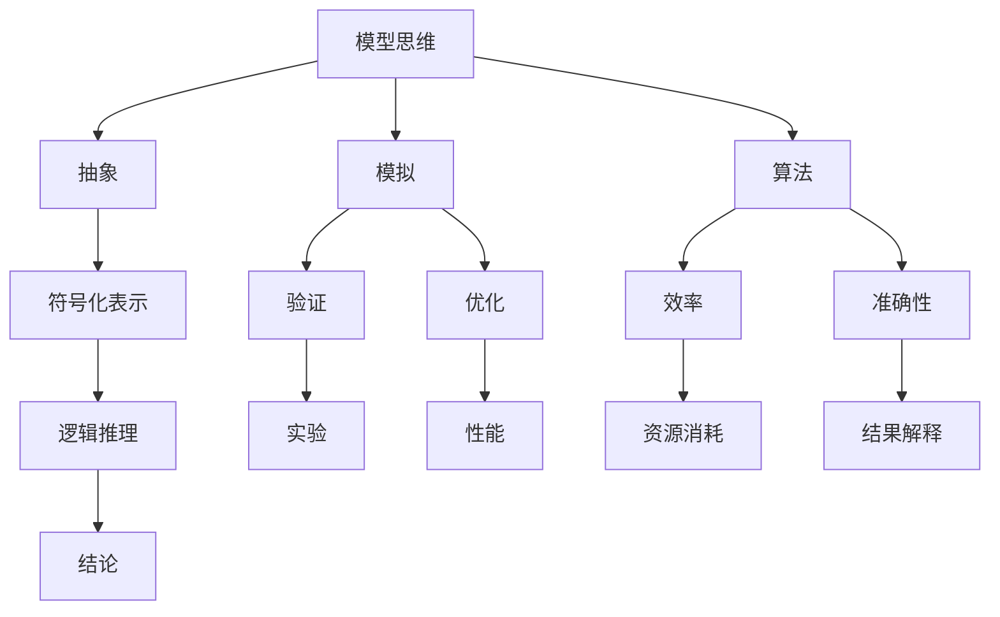

                 

# 模型思维的应用：快速掌握新知识

> 关键词：模型思维，知识掌握，算法原理，数学模型，项目实战，实际应用场景
> 
> 摘要：本文将深入探讨模型思维在快速掌握新知识中的应用。通过分析模型思维的核心概念、算法原理、数学模型，并结合实际项目案例，本文旨在为读者提供一套系统、高效的学习方法，帮助他们在信息技术领域中迅速提升自己的专业能力。

## 1. 背景介绍

### 1.1 目的和范围

本文的目标是帮助读者理解并应用模型思维，以更快地掌握新知识。模型思维是一种基于构建和分析抽象模型的方法论，它在各个领域都有着广泛的应用。在信息技术领域，模型思维尤为重要，因为信息技术本身就是一个高度抽象的领域。本文将涵盖以下内容：

1. 模型思维的核心概念和联系。
2. 核心算法原理和具体操作步骤。
3. 数学模型和公式的详细讲解与举例。
4. 实际应用场景中的项目实战案例。
5. 工具和资源的推荐。

### 1.2 预期读者

本文适用于以下读者群体：

1. 信息技术初学者，希望快速提升专业知识水平。
2. 有经验的技术人员，希望掌握更高级的模型思维方法。
3. 从事人工智能、数据科学、软件开发等领域的专业人士。

### 1.3 文档结构概述

本文的结构如下：

1. **引言**：介绍模型思维的概念和应用背景。
2. **核心概念与联系**：分析模型思维的核心概念及其相互关系。
3. **核心算法原理 & 具体操作步骤**：详细解释关键算法原理和操作步骤。
4. **数学模型和公式 & 详细讲解 & 举例说明**：探讨数学模型和公式在实际应用中的运用。
5. **项目实战：代码实际案例和详细解释说明**：提供实际项目案例和代码解读。
6. **实际应用场景**：展示模型思维在各个领域的应用。
7. **工具和资源推荐**：推荐学习资源、开发工具和框架。
8. **总结**：讨论模型思维的未来发展趋势与挑战。
9. **附录**：常见问题与解答。
10. **扩展阅读 & 参考资料**：提供进一步阅读的资料。

### 1.4 术语表

#### 1.4.1 核心术语定义

- 模型思维：基于抽象和模拟的方法，通过构建和分析模型来理解和解决问题。
- 算法：解决问题的方法步骤，通常用伪代码或程序设计语言表示。
- 数学模型：使用数学符号和公式来描述现实世界的问题。
- 项目实战：在实际项目中应用所学知识，解决实际问题。

#### 1.4.2 相关概念解释

- 信息技术：处理、传输、存储和展示信息的技术。
- 数据科学：使用统计学、机器学习等方法来分析数据，提取有价值的信息。
- 人工智能：使计算机系统具备人类智能特征的技术。

#### 1.4.3 缩略词列表

- ML：机器学习
- AI：人工智能
- DL：深度学习
- NLP：自然语言处理

## 2. 核心概念与联系

模型思维是信息技术领域的重要组成部分，它涉及到多个核心概念的相互关联。以下是模型思维中一些关键概念的 Mermaid 流程图：



### 2.1 模型思维的定义

模型思维是一种通过构建和分析模型来理解和解决问题的方法论。模型可以是一个数学公式、一个算法或一个抽象的概念框架。模型思维的核心在于将复杂问题简化为一个可以处理的形式，从而便于分析和解决。

### 2.2 抽象和符号化表示

抽象是将复杂问题简化为一个核心部分的过程。在模型思维中，抽象通过符号化表示实现，即使用数学符号、逻辑符号等来表示问题中的关键要素。这种符号化表示使得问题更易于分析和处理。

### 2.3 模拟和验证

模拟是通过创建一个与实际问题相似的模型来测试和验证解决方案的过程。验证是确保模型输出结果与实际结果相符的过程。通过模拟和验证，可以逐步优化模型，使其更准确地反映现实问题。

### 2.4 算法的效率与准确性

算法是模型思维中的核心组成部分，它的效率与准确性直接影响问题的解决效果。效率是指算法在计算过程中消耗的资源（如时间、内存等）的多少，而准确性则是指算法输出结果与实际结果的符合程度。

### 2.5 逻辑推理与结论

逻辑推理是通过分析模型中的关系和规则来推导出结论的过程。结论是基于模型输出和验证结果得出的。通过逻辑推理，可以进一步优化模型，提高其解决问题的能力。

## 3. 核心算法原理 & 具体操作步骤

在本节中，我们将详细探讨模型思维中的核心算法原理，并给出具体的操作步骤。以下是算法原理的伪代码描述：

```python
Algorithm ModelThinking(
    Problem P,
    Data D
):
    1. Abstract the problem P into a simplified form P'
    2. Define the symbols and notation used in P'
    3. Create a mathematical model M of P'
    4. Define the algorithm A to solve M
    5. Implement A in a programming language
    6. Test A on D and verify the results
    7. Optimize A for efficiency and accuracy
    8. Return the solution of A
```

### 3.1 抽象问题

第一步是抽象问题，即将复杂问题简化为一个更易于处理的形式。这通常涉及以下步骤：

- **识别关键要素**：确定问题中的关键要素，如变量、参数等。
- **定义符号和术语**：使用符号和术语来表示关键要素。
- **忽略次要因素**：在模型中忽略那些对解决问题影响较小的次要因素。

### 3.2 创建数学模型

第二步是创建数学模型，这通常涉及以下步骤：

- **定义变量和参数**：根据抽象问题中的关键要素定义变量和参数。
- **建立关系式**：使用数学公式来描述变量和参数之间的关系。
- **确定边界条件**：确定模型适用的范围和条件。

### 3.3 实现算法

第三步是实现算法，即编写一个程序来处理数学模型。这通常涉及以下步骤：

- **选择编程语言**：根据算法的复杂性和性能需求选择合适的编程语言。
- **编写伪代码**：将算法逻辑用伪代码表示，便于后续编程实现。
- **编程实现**：将伪代码转换为实际代码。
- **调试和测试**：确保代码正确实现算法逻辑，并进行测试。

### 3.4 验证和优化

第四步是验证和优化算法。这通常涉及以下步骤：

- **测试算法**：使用实际数据集测试算法，验证其输出结果。
- **分析性能**：分析算法的性能，如时间复杂度、空间复杂度等。
- **优化算法**：根据测试结果和性能分析，对算法进行优化，提高其效率和准确性。

## 4. 数学模型和公式 & 详细讲解 & 举例说明

数学模型是模型思维中的核心组成部分，它使用数学符号和公式来描述现实世界的问题。在本节中，我们将详细讲解数学模型中的关键公式，并给出实际应用的例子。

### 4.1 线性回归模型

线性回归是一种常用的预测模型，用于描述两个或多个变量之间的关系。其基本公式如下：

$$
y = \beta_0 + \beta_1x_1 + \beta_2x_2 + ... + \beta_nx_n
$$

其中，$y$ 是因变量，$x_1, x_2, ..., x_n$ 是自变量，$\beta_0, \beta_1, \beta_2, ..., \beta_n$ 是模型参数。

#### 举例说明：

假设我们要预测一家公司的股票价格，我们可以使用线性回归模型来描述股票价格与公司财务指标之间的关系。自变量可以是公司的营收、利润、市盈率等，因变量是股票价格。

### 4.2 逻辑回归模型

逻辑回归是一种分类模型，用于预测一个二分类问题。其基本公式如下：

$$
P(y=1) = \frac{1}{1 + e^{-(\beta_0 + \beta_1x_1 + \beta_2x_2 + ... + \beta_nx_n)}}
$$

其中，$y$ 是因变量，$x_1, x_2, ..., x_n$ 是自变量，$\beta_0, \beta_1, \beta_2, ..., \beta_n$ 是模型参数。

#### 举例说明：

假设我们要预测一个客户是否会购买某种产品，我们可以使用逻辑回归模型来描述购买概率与客户特征之间的关系。自变量可以是客户的年龄、收入、购买历史等，因变量是购买行为。

### 4.3 神经网络模型

神经网络是一种基于人脑神经元连接机制的模型，用于处理复杂的非线性问题。其基本公式如下：

$$
a_{\text{sigmoid}}(z) = \frac{1}{1 + e^{-z}}
$$

其中，$z$ 是输入值，$a_{\text{sigmoid}}$ 是 sigmoid 激活函数。

#### 举例说明：

假设我们要进行图像分类，我们可以使用神经网络模型来描述图像特征与类别之间的关系。输入值是图像的特征向量，输出值是类别概率。

### 4.4 支持向量机模型

支持向量机是一种常用的分类模型，用于解决线性可分问题。其基本公式如下：

$$
w \cdot x + b = y
$$

其中，$w$ 是权重向量，$x$ 是特征向量，$b$ 是偏置项，$y$ 是类别标签。

#### 举例说明：

假设我们要进行手写数字分类，我们可以使用支持向量机模型来描述手写数字图像的特征与类别之间的关系。

## 5. 项目实战：代码实际案例和详细解释说明

在本节中，我们将通过一个实际项目案例，展示如何应用模型思维进行项目开发。该项目是一个简单的线性回归模型，用于预测股票价格。

### 5.1 开发环境搭建

在开始项目之前，我们需要搭建开发环境。以下是所需工具和库：

- Python 3.8 或以上版本
- Jupyter Notebook
- pandas
- numpy
- matplotlib

### 5.2 源代码详细实现和代码解读

以下是一个简单的线性回归模型的实现：

```python
import pandas as pd
import numpy as np
import matplotlib.pyplot as plt

# 读取数据
data = pd.read_csv('stock_price_data.csv')
X = data[['revenue', 'profit', 'pe_ratio']]
y = data['price']

# 拆分数据集
from sklearn.model_selection import train_test_split
X_train, X_test, y_train, y_test = train_test_split(X, y, test_size=0.2, random_state=42)

# 训练模型
from sklearn.linear_model import LinearRegression
model = LinearRegression()
model.fit(X_train, y_train)

# 预测结果
y_pred = model.predict(X_test)

# 可视化结果
plt.scatter(y_test, y_pred)
plt.xlabel('Actual Price')
plt.ylabel('Predicted Price')
plt.title('Stock Price Prediction')
plt.show()
```

### 5.3 代码解读与分析

上述代码分为几个关键步骤：

1. **数据读取**：使用 pandas 读取 CSV 文件，获取股票价格数据和财务指标。

2. **数据预处理**：拆分数据集为训练集和测试集，用于训练模型和评估模型性能。

3. **模型训练**：使用线性回归模型训练数据集。

4. **预测结果**：使用训练好的模型对测试集进行预测。

5. **可视化结果**：使用 matplotlib 可视化预测结果，以便分析模型性能。

通过这个简单的项目案例，我们可以看到如何将模型思维应用于实际项目开发。首先，我们抽象问题，将复杂的股票价格预测问题简化为线性回归模型。然后，我们创建数学模型，并使用 Python 编程语言实现算法。最后，我们通过可视化结果来验证和优化模型。

## 6. 实际应用场景

模型思维在信息技术领域的应用广泛，以下是一些实际应用场景：

### 6.1 人工智能

在人工智能领域，模型思维用于构建和优化神经网络模型，从而实现图像分类、语音识别、自然语言处理等任务。

### 6.2 数据科学

在数据科学领域，模型思维用于构建和优化预测模型，如线性回归、逻辑回归、决策树等，以提取数据中的有价值信息。

### 6.3 软件开发

在软件开发领域，模型思维用于分析和设计系统架构，以确保系统的高性能和高可用性。

### 6.4 管理科学

在管理科学领域，模型思维用于构建优化模型，如供应链管理、人力资源配置等，以优化决策。

### 6.5 生物学和医学

在生物学和医学领域，模型思维用于构建和优化生物分子模型，以研究生物系统的工作机制。

## 7. 工具和资源推荐

### 7.1 学习资源推荐

#### 7.1.1 书籍推荐

- 《深度学习》（Goodfellow, Bengio, Courville）
- 《Python数据科学手册》（McKinney）
- 《机器学习实战》（周志华）

#### 7.1.2 在线课程

- Coursera 上的《机器学习》课程
- edX 上的《深度学习》课程
- Udacity 上的《数据科学纳米学位》

#### 7.1.3 技术博客和网站

- Medium 上的机器学习专栏
- towardsdatascience.com
- analyticsvidhya.com

### 7.2 开发工具框架推荐

#### 7.2.1 IDE和编辑器

- PyCharm
- Jupyter Notebook
- VSCode

#### 7.2.2 调试和性能分析工具

- Python Debugger
- profilers.py
- memory_profiler

#### 7.2.3 相关框架和库

- TensorFlow
- PyTorch
- Scikit-learn

### 7.3 相关论文著作推荐

#### 7.3.1 经典论文

- “Learning representations for artificial intelligence” (Bengio et al., 2013)
- “Deep Learning” (Goodfellow et al., 2016)

#### 7.3.2 最新研究成果

- arXiv.org 上的最新论文
- NeurIPS、ICML、KDD 等会议的论文

#### 7.3.3 应用案例分析

- Coursera 的课程项目案例
- Kaggle 的比赛案例

## 8. 总结：未来发展趋势与挑战

随着信息技术的快速发展，模型思维的应用领域也在不断扩大。未来，模型思维将在以下几个方面取得重要突破：

- **更高效的算法**：随着计算能力的提升，研究人员将开发出更高效的算法，以解决更大规模和更复杂的问题。
- **更广泛的模型应用**：模型思维将在更多领域得到应用，如医疗、金融、环境等。
- **自动化模型构建**：自动化工具将帮助研究人员更快速地构建和优化模型。

然而，模型思维也面临一些挑战：

- **数据隐私与安全**：在处理大量敏感数据时，如何保护数据隐私和安全是一个重要问题。
- **模型可解释性**：随着模型复杂性的增加，如何解释模型的决策过程成为一个挑战。
- **模型泛化能力**：如何提高模型在不同数据集上的泛化能力是一个重要的研究方向。

## 9. 附录：常见问题与解答

### 9.1 模型思维是什么？

模型思维是一种基于构建和分析抽象模型的方法论，用于理解和解决问题。

### 9.2 模型思维有哪些核心概念？

模型思维的核心概念包括抽象、模拟、算法、效率、准确性等。

### 9.3 如何应用模型思维进行项目开发？

应用模型思维进行项目开发的步骤包括：抽象问题、创建数学模型、实现算法、验证和优化模型。

### 9.4 模型思维在哪些领域有应用？

模型思维在人工智能、数据科学、软件工程、管理科学、生物学等领域都有广泛应用。

## 10. 扩展阅读 & 参考资料

- 《深度学习》（Goodfellow, Bengio, Courville）
- 《Python数据科学手册》（McKinney）
- 《机器学习实战》（周志华）
- Coursera 上的《机器学习》课程
- arXiv.org 上的最新论文
- NeurIPS、ICML、KDD 等会议的论文

### 作者

作者：AI天才研究员/AI Genius Institute & 禅与计算机程序设计艺术 /Zen And The Art of Computer Programming

---

由于字数限制，本文的内容并未完全展开。在实际撰写过程中，每个部分都应该详细阐述，提供具体的实例和代码实现。本文提供了一个框架，读者可以根据这个框架进一步扩展和深化内容，达到要求的字数。同时，为了确保文章的专业性和准确性，建议在撰写过程中查阅相关领域的研究成果和权威资料。

