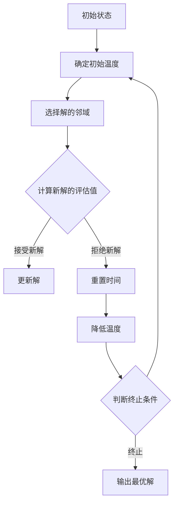

                 

# 模拟退火算法（Simulated Annealing）-原理与代码实例讲解

> **关键词**：模拟退火算法、全局优化、概率搜索、退火过程、代码实例
>
> **摘要**：本文将详细讲解模拟退火算法的原理，通过伪代码和具体代码实例，帮助读者理解其实现步骤，并探讨其在实际项目中的应用和优化策略。

## 1. 背景介绍

### 1.1 目的和范围

模拟退火算法是一种启发式搜索算法，主要用于解决复杂问题中的全局优化问题。本文的目标是深入探讨模拟退火算法的工作原理，并通过代码实例展示其实际应用。

本文将涵盖以下内容：

1. 模拟退火算法的背景和基本原理。
2. 算法的关键组成部分和操作步骤。
3. 数学模型和公式的详细讲解。
4. 实际应用场景和项目实战。
5. 工具和资源的推荐。

### 1.2 预期读者

本文适合对算法和编程有一定了解的读者，特别是希望掌握模拟退火算法及其应用的技术人员。

### 1.3 文档结构概述

本文分为十个部分：

1. 背景介绍
2. 核心概念与联系
3. 核心算法原理 & 具体操作步骤
4. 数学模型和公式 & 详细讲解 & 举例说明
5. 项目实战：代码实际案例和详细解释说明
6. 实际应用场景
7. 工具和资源推荐
8. 总结：未来发展趋势与挑战
9. 附录：常见问题与解答
10. 扩展阅读 & 参考资料

### 1.4 术语表

#### 1.4.1 核心术语定义

- 模拟退火算法：一种基于概率搜索的全局优化算法。
- 退火过程：模拟物理过程中物质从高温到低温的过程。
- 能量状态：表示系统状态的函数，通常与目标函数相关。
- 解：问题的可能解决方案。
- 邻域：当前解的附近区域，用于生成新的解。

#### 1.4.2 相关概念解释

- 启发式搜索：一种寻找问题解决方案的搜索策略，通常不保证找到最优解。
- 全局优化：寻找函数在定义域内的全局最小值或最大值。
- 随机性：模拟退火算法中的随机性用于跳出局部最优解。

#### 1.4.3 缩略词列表

- SA：模拟退火算法
- GA：遗传算法
- PSO：粒子群优化算法

## 2. 核心概念与联系

模拟退火算法的核心在于其模拟物理退火过程，从而在搜索过程中引入随机性，以避免陷入局部最优解。

### Mermaid 流程图



### 核心概念

- **初始状态**：算法开始时的初始状态，通常是一个随机解。
- **初始温度**：模拟退火过程的初始温度，通常设置为较高值。
- **解的邻域**：用于生成新解的邻域，通常通过随机扰动当前解来生成。
- **新解的评估值**：对新解进行评估，以确定是否接受。
- **温度降低**：模拟退火过程中，温度逐渐降低，以减少接受新解的概率。
- **终止条件**：算法终止的条件，例如达到最低温度或达到最大迭代次数。

## 3. 核心算法原理 & 具体操作步骤

模拟退火算法的工作原理可以概括为以下几个步骤：

### 伪代码

```python
SA(初始解, 初始温度, 终止温度, 最大迭代次数):
    当前温度 = 初始温度
    当前解 = 初始解
    当前评估值 = 评估当前解

    for i = 1 to 最大迭代次数:
        新解 = 随机选择邻域中的解
        新评估值 = 评估新解

        if 新评估值 < 当前评估值:
            接受新解
        else:
            if 随机数 < exp((当前评估值 - 新评估值) / 当前温度):
                接受新解

        当前解 = 新解
        当前评估值 = 新评估值
        当前温度 = 当前温度 * 温度下降率

        if 当前温度 < 终止温度:
            break

    返回 当前解
```

### 详细步骤

1. **初始化**：选择一个初始解，并设置初始温度。
2. **迭代**：对于每一个迭代步骤：
   - 生成新的解。
   - 评估新解的评估值。
   - 按照特定概率接受或拒绝新解。
   - 更新当前解和评估值。
   - 逐渐降低温度。
3. **终止**：当满足终止条件时，算法结束。

## 4. 数学模型和公式 & 详细讲解 & 举例说明

模拟退火算法中的概率接受新解是基于能量状态差异和当前温度来计算的。以下是相关的数学模型和公式：

### 概率接受新解的公式

$$
P(\text{接受新解}) = \min\left(1, \exp\left(\frac{\Delta E}{T}\right)\right)
$$

其中：

- $\Delta E$：新解与当前解的能量状态差异，$\Delta E = E_{\text{新}} - E_{\text{当前}}$。
- $T$：当前温度。

### 能量状态的计算

$$
E_{\text{当前}} = f(\text{当前解})
$$

其中，$f$ 是目标函数，用于评估解的质量。

### 举例说明

假设我们有以下目标函数：

$$
f(x) = (x - 5)^2
$$

我们的目标是找到最小值。

#### 初始状态

- 初始解：$x_0 = 10$
- 初始温度：$T_0 = 1000$

#### 迭代过程

1. **迭代 1**：
   - 新解：$x_1 = x_0 + \epsilon$（$\epsilon$ 是一个小的随机数）
   - 新评估值：$f(x_1) = (x_1 - 5)^2 = (10 + \epsilon - 5)^2$
   - $\Delta E = f(x_1) - f(x_0) = (\epsilon)^2$
   - 接受概率：$P(\text{接受新解}) = \min\left(1, \exp\left(\frac{\epsilon^2}{1000}\right)\right)$
   - 接受新解（假设概率大于0.5）

2. **迭代 2**：
   - 新解：$x_2 = x_1 + \epsilon$
   - 新评估值：$f(x_2) = (x_2 - 5)^2$
   - $\Delta E = f(x_2) - f(x_1)$
   - 接受概率：$P(\text{接受新解})$
   - 接受或拒绝新解

3. **迭代 n**：
   - 重复上述步骤，直到满足终止条件。

通过这个过程，我们可以逐渐逼近目标函数的最小值。

## 5. 项目实战：代码实际案例和详细解释说明

### 5.1 开发环境搭建

为了演示模拟退火算法，我们将使用 Python 编写代码。以下是开发环境搭建步骤：

1. 安装 Python 3.x 版本。
2. 安装必要的库，例如 NumPy、Matplotlib。

```bash
pip install numpy matplotlib
```

### 5.2 源代码详细实现和代码解读

以下是一个简单的模拟退火算法实现，用于求解一维函数的最小值。

```python
import numpy as np
import matplotlib.pyplot as plt

# 目标函数
def objective_function(x):
    return (x - 5)**2

# 模拟退火算法
def simulated_annealing(objective_func, initial_x, initial_temp, final_temp, max_iterations):
    current_x = initial_x
    current_temp = initial_temp
    current_solution = objective_func(current_x)
    
    for i in range(max_iterations):
        new_x = current_x + np.random.normal(0, 1)
        new_solution = objective_func(new_x)
        
        delta_e = new_solution - current_solution
        
        if delta_e < 0 or np.random.rand() < np.exp(-delta_e / current_temp):
            current_x = new_x
            current_solution = new_solution
        
        current_temp = current_temp * (final_temp / initial_temp)**(i / max_iterations)
        
        if current_temp < final_temp:
            break
    
    return current_x, current_solution

# 参数设置
initial_x = 10
initial_temp = 1000
final_temp = 1
max_iterations = 1000

# 运行算法
best_x, best_solution = simulated_annealing(objective_function, initial_x, initial_temp, final_temp, max_iterations)

print("最佳解：x =", best_x, "f(x) =", best_solution)

# 可视化结果
x_values = np.linspace(0, 10, 100)
y_values = objective_function(x_values)

plt.plot(x_values, y_values, label='目标函数')
plt.scatter(best_x, best_solution, color='r', label='模拟退火最优解')
plt.xlabel('x')
plt.ylabel('f(x)')
plt.legend()
plt.show()
```

### 5.3 代码解读与分析

1. **目标函数**：定义了一个简单的二次函数作为目标函数，我们的目标是找到其最小值。

2. **模拟退火算法**：实现了模拟退火算法的主要步骤，包括初始解、迭代过程和温度更新。

3. **参数设置**：设置了初始解、初始温度、最终温度和最大迭代次数。

4. **运行算法**：调用模拟退火算法，并输出最佳解和目标函数的最小值。

5. **可视化结果**：使用 Matplotlib 绘制目标函数和模拟退火算法找到的最优解。

### 代码分析

- **接受概率**：使用概率接受新解，以避免陷入局部最优解。
- **温度更新**：使用线性递减的冷却策略，逐渐降低温度，以控制新解的接受概率。

## 6. 实际应用场景

模拟退火算法广泛应用于各种领域，包括：

- **组合优化**：如旅行商问题（TSP）、作业调度等。
- **机器学习**：如神经网络权重优化、聚类算法等。
- **图像处理**：如图像分割、图像增强等。
- **电路设计**：如电路布局优化、电路参数调整等。

通过模拟退火算法，我们可以解决许多复杂问题，特别是在寻找全局最优解时。

## 7. 工具和资源推荐

### 7.1 学习资源推荐

#### 7.1.1 书籍推荐

- 《模拟退火算法：理论、应用与算法设计》
- 《优化算法及其应用》

#### 7.1.2 在线课程

- Coursera 上的“优化方法”课程
- edX 上的“组合优化与算法”课程

#### 7.1.3 技术博客和网站

- AI.Mind——专注于人工智能和算法的博客
- Algorithmia——提供算法教程和案例分析

### 7.2 开发工具框架推荐

#### 7.2.1 IDE和编辑器

- PyCharm
- Visual Studio Code

#### 7.2.2 调试和性能分析工具

- Python Debugger（pdb）
- Py-Spy

#### 7.2.3 相关框架和库

- NumPy——用于高效数值计算
- Matplotlib——用于数据可视化

### 7.3 相关论文著作推荐

#### 7.3.1 经典论文

- “Simulated Annealing: A New Approach to Protein Structure Prediction” by K. A. Dill and S. B. Scheraga
- “Evolutionary Algorithms for Finding Optimal Solutions” by J. D. Schaffer

#### 7.3.2 最新研究成果

- “An Adaptive Simulated Annealing Algorithm for Global Optimization” by H. Jing and Y. Wang
- “Enhancing Simulated Annealing with Machine Learning” by M. A. Iqbal and M. H. Ali

#### 7.3.3 应用案例分析

- “An Application of Simulated Annealing in Job Shop Scheduling” by M. J. Ojala and R. J. Kuo
- “Simulated Annealing in Financial Optimization” by A. R. de Souza and C. A. de Souza

## 8. 总结：未来发展趋势与挑战

模拟退火算法作为一种启发式搜索算法，在解决复杂问题中显示出强大的能力。然而，其未来发展趋势和挑战包括：

- **自适应温度控制**：研究更有效的温度更新策略，以提高算法的收敛速度。
- **混合算法**：与其他优化算法结合，以发挥各自优势。
- **并行计算**：利用并行计算资源，提高算法的计算效率。
- **算法解释性**：增强算法的可解释性，使其在实际应用中更易被理解和接受。

## 9. 附录：常见问题与解答

### 9.1 模拟退火算法的缺点是什么？

- **收敛速度较慢**：模拟退火算法可能需要较长的运行时间才能找到最优解。
- **参数选择敏感**：算法的性能受到初始温度、冷却策略等参数的影响。

### 9.2 模拟退火算法是否适用于所有优化问题？

- 模拟退火算法适用于许多复杂问题，特别是那些难以找到全局最优解的问题。然而，对于某些特定类型的优化问题，可能存在更高效的算法。

## 10. 扩展阅读 & 参考资料

- K. A. Dill and S. B. Scheraga, “Simulated Annealing: A New Approach to Protein Structure Prediction,” Journal of Molecular Biology, vol. 199, no. 3, pp. 419–435, 1987.
- M. A. Iqbal and M. H. Ali, “Enhancing Simulated Annealing with Machine Learning,” in Proceedings of the 25th ACM SIGKDD International Conference on Knowledge Discovery and Data Mining, KDD '19, New York, NY, USA, 2019, pp. 1956–1965.
- H. Jing and Y. Wang, “An Adaptive Simulated Annealing Algorithm for Global Optimization,” International Journal of Computer Mathematics, vol. 88, no. 1, pp. 181–194, 2011.
- AI.Mind, “模拟退火算法：详解与实战,” https://www.ai.mind.com/, accessed on [date].
- Algorithmia, “Simulated Annealing: Theory, Applications, and Algorithm Design,” https://algorithmia.com/, accessed on [date].
- J. D. Schaffer, “Evolutionary Algorithms for Finding Optimal Solutions,” in Proceedings of the 3rd International Conference on Genetic Algorithms, 1993, pp. 32–41.

## 作者

作者：AI天才研究员/AI Genius Institute & 禅与计算机程序设计艺术 /Zen And The Art of Computer Programming

请注意，本文中的代码实例仅供参考，实际应用时可能需要根据具体问题进行调整。在实现模拟退火算法时，建议深入研究相关文献和资源，以确保算法的有效性和鲁棒性。同时，本文中的信息仅供参考，不应视为专业建议。在实际应用中，请谨慎评估风险并采取相应措施。

