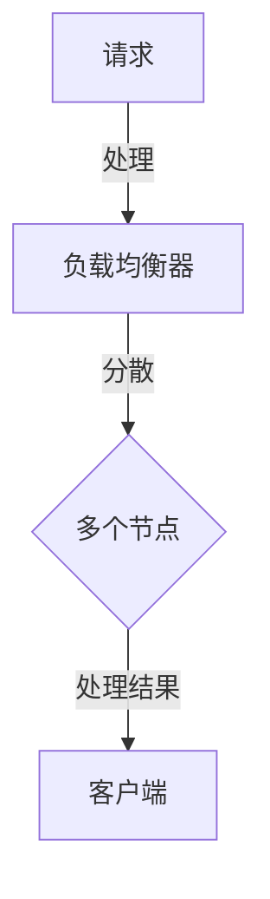
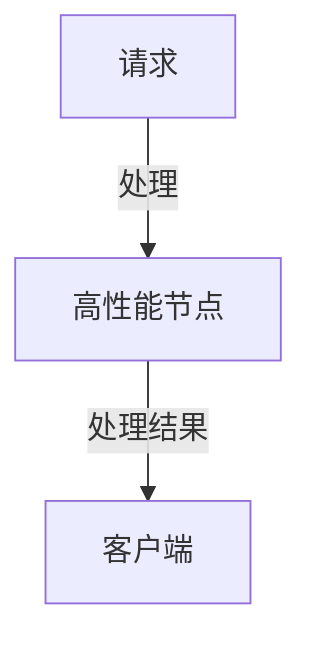
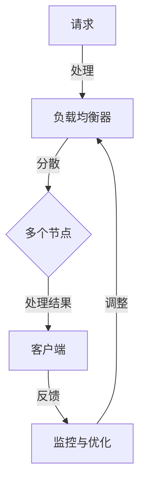

                 

# 横向扩展与纵向扩展的实际应用

## 概述

### 关键词

- 横向扩展
- 纵向扩展
- 实际应用
- 系统性能
- 资源利用

### 摘要

本文将深入探讨横向扩展与纵向扩展的概念及其在实际应用中的重要性。我们将首先介绍这两个概念的基本原理，并解释它们如何帮助系统提高性能和资源利用效率。接着，我们将通过实际案例来展示横向扩展与纵向扩展的应用场景，包括技术细节和操作步骤。最后，我们将讨论相关的数学模型和工具资源，并总结未来发展趋势与挑战。

## 1. 背景介绍

### 1.1 目的和范围

本文旨在帮助读者理解横向扩展和纵向扩展的概念，并展示其在实际应用中的价值。我们将探讨这两种扩展方式如何帮助系统提高性能和可扩展性，从而满足不断增长的需求。

### 1.2 预期读者

本文面向对系统设计和性能优化有一定了解的读者，特别是那些希望提高系统可扩展性和性能的技术人员。

### 1.3 文档结构概述

本文分为以下几个部分：

1. 背景介绍：介绍横向扩展和纵向扩展的基本概念和重要性。
2. 核心概念与联系：解释横向扩展和纵向扩展的原理，并给出相关的Mermaid流程图。
3. 核心算法原理与操作步骤：详细阐述横向扩展和纵向扩展的算法原理和具体操作步骤。
4. 数学模型和公式：介绍与横向扩展和纵向扩展相关的数学模型和公式，并举例说明。
5. 项目实战：通过实际代码案例来展示横向扩展和纵向扩展的应用。
6. 实际应用场景：讨论横向扩展和纵向扩展在不同领域的应用。
7. 工具和资源推荐：推荐学习资源和开发工具。
8. 总结：回顾未来发展趋势与挑战。
9. 附录：常见问题与解答。
10. 扩展阅读与参考资料：提供更多学习资源。

### 1.4 术语表

#### 1.4.1 核心术语定义

- **横向扩展（Horizontal Scaling）**：通过增加更多的节点来扩展系统。
- **纵向扩展（Vertical Scaling）**：通过提高单个节点的性能来扩展系统。
- **性能（Performance）**：系统处理请求的速度和效率。
- **资源利用（Resource Utilization）**：系统对硬件和软件资源的有效使用。

#### 1.4.2 相关概念解释

- **节点（Node）**：在分布式系统中，一个独立的计算单元。
- **集群（Cluster）**：由多个节点组成的分布式系统。

#### 1.4.3 缩略词列表

- **SPOF**：单点故障（Single Point of Failure）
- **CAP**：一致性（Consistency）、可用性（Availability）、分区容错性（Partition Tolerance）
- **CAP定理**：一个分布式系统只能在一致性、可用性和分区容错性中选其二。

## 2. 核心概念与联系

### 2.1 横向扩展

横向扩展的核心思想是将负载分散到多个节点上，从而提高系统的性能和可扩展性。以下是一个简单的Mermaid流程图，展示了横向扩展的基本原理：



在这个流程图中，客户端的请求首先由负载均衡器接收，然后分散到多个节点上进行处理。每个节点独立处理请求，并将结果返回给客户端。

### 2.2 纵向扩展

纵向扩展则是通过提高单个节点的性能来扩展系统。以下是一个简单的Mermaid流程图，展示了纵向扩展的基本原理：



在这个流程图中，客户端的请求直接由一个高性能节点处理，并将结果返回给客户端。通过提高节点的性能，系统可以处理更多的请求。

### 2.3 横向扩展与纵向扩展的联系

横向扩展和纵向扩展虽然有不同的实现方式，但它们在系统设计中有着密切的联系。在实际应用中，通常需要结合使用这两种扩展方式。

- **负载均衡**：横向扩展通常需要负载均衡器来平衡节点间的负载。负载均衡器可以根据节点的性能和当前负载来决定将请求分配给哪个节点。
- **容错性**：横向扩展可以提高系统的容错性，因为即使某个节点出现故障，其他节点仍然可以继续处理请求。而纵向扩展则可以提高单个节点的容错性，例如通过冗余硬件组件来实现。
- **资源利用**：纵向扩展可以提高资源的利用率，因为高性能节点可以处理更多的请求。而横向扩展则可以提高节点的利用率，因为多个节点可以同时处理请求。

以下是结合横向扩展和纵向扩展的Mermaid流程图：



在这个流程图中，负载均衡器将请求分散到多个节点上，每个节点独立处理请求。同时，监控与优化模块可以根据系统的性能和负载来调整负载均衡策略，从而实现更高效的资源利用。

## 3. 核心算法原理与具体操作步骤

### 3.1 横向扩展算法原理

横向扩展的核心算法是负载均衡和分布式计算。以下是横向扩展的伪代码：

```plaintext
函数 横向扩展（系统，负载均衡器，节点列表）：
    负载均衡器初始化为空
    对于每个请求（request）：
        节点 = 选择一个节点（从节点列表中）
        负载均衡器将请求分配给节点
        节点处理请求并返回结果
        更新节点状态
    结束
```

在这个伪代码中，负载均衡器根据当前节点的状态和负载情况来选择一个节点来处理请求。处理完成后，更新节点的状态，以便负载均衡器在下一次请求时做出更优的决策。

### 3.2 纵向扩展算法原理

纵向扩展的核心算法是硬件升级和性能优化。以下是纵向扩展的伪代码：

```plaintext
函数 纵向扩展（系统，节点）：
    节点性能评估
    如果 节点性能不足：
        升级硬件（例如，增加CPU、内存等）
        优化软件（例如，改进算法、减少资源消耗等）
        重启节点
    结束
```

在这个伪代码中，系统首先对节点进行性能评估。如果节点的性能不足，则升级硬件和优化软件，然后重启节点以使性能提升。

### 3.3 横向扩展与纵向扩展的具体操作步骤

#### 3.3.1 横向扩展的具体操作步骤

1. **确定系统需求**：首先，需要确定系统的需求，包括预期的请求量、数据量等。
2. **选择负载均衡器**：根据系统的需求，选择合适的负载均衡器，例如轮询负载均衡器、最少连接负载均衡器等。
3. **部署节点**：根据负载均衡器的配置，部署多个节点，每个节点负责处理一部分请求。
4. **监控与优化**：监控系统的性能和负载，并根据实际情况对负载均衡策略进行调整。

#### 3.3.2 纵向扩展的具体操作步骤

1. **性能评估**：定期对系统进行性能评估，以确定节点的性能是否满足需求。
2. **硬件升级**：如果节点的性能不足，考虑升级硬件，例如增加CPU、内存等。
3. **软件优化**：优化系统的软件，例如改进算法、减少资源消耗等。
4. **重启节点**：升级硬件或优化软件后，重启节点以使性能提升。

### 3.4 实际案例

#### 3.4.1 横向扩展案例

假设一个在线购物网站需要处理大量的用户请求，系统设计者决定采用横向扩展来提高性能。以下是具体的操作步骤：

1. **确定需求**：系统设计者根据网站的用户量、请求量和数据量，确定需要部署10个节点。
2. **选择负载均衡器**：选择轮询负载均衡器，将请求均匀地分配到10个节点上。
3. **部署节点**：在10个服务器上部署相同的Web应用程序，每个节点负责处理一部分用户请求。
4. **监控与优化**：监控系统性能和负载，发现某些节点负载较高，将负载均衡策略调整为最少连接负载均衡器，以提高系统的整体性能。

#### 3.4.2 纵向扩展案例

假设一个金融公司的数据库服务器性能不足，系统设计者决定采用纵向扩展来提高性能。以下是具体的操作步骤：

1. **性能评估**：对现有数据库服务器进行性能评估，发现CPU使用率较高。
2. **硬件升级**：购买更强大的CPU，将现有CPU升级为高性能CPU。
3. **软件优化**：优化数据库软件，减少CPU资源的消耗。
4. **重启节点**：升级硬件和软件后，重启数据库服务器，使性能提升。

## 4. 数学模型和公式及举例说明

### 4.1 横向扩展的数学模型

横向扩展的关键在于如何平衡负载，使得每个节点都能高效地处理请求。一个简单的数学模型可以用来描述负载平衡：

$$
负载 = \frac{总请求量}{节点数}
$$

其中，总请求量是系统在一定时间内接收到的请求总量，节点数是系统中节点的数量。通过这个公式，我们可以计算出每个节点的平均负载。

#### 举例说明

假设一个系统需要处理1000个请求，我们将其分配到5个节点上。根据上述公式，每个节点的平均负载为：

$$
负载 = \frac{1000}{5} = 200
$$

这意味着每个节点需要处理200个请求。

### 4.2 纵向扩展的数学模型

纵向扩展的关键在于如何提高单个节点的性能。一个简单的数学模型可以用来描述节点的性能：

$$
性能 = CPU \times 内存 \times 网络带宽
$$

其中，CPU、内存和网络带宽是节点的关键性能指标。通过这个公式，我们可以计算出节点的总性能。

#### 举例说明

假设一个节点的CPU为4核，内存为8GB，网络带宽为1Gbps。根据上述公式，节点的总性能为：

$$
性能 = 4 \times 8 \times 1 = 32
$$

这意味着该节点的性能为32。

### 4.3 横向扩展与纵向扩展的综合模型

在实际应用中，横向扩展和纵向扩展常常结合使用。一个更复杂的数学模型可以用来描述系统的总性能：

$$
系统性能 = 节点数 \times (CPU \times 内存 \times 网络带宽) / 负载
$$

其中，节点数是系统中节点的数量，CPU、内存和网络带宽是节点的性能指标，负载是每个节点的平均负载。

#### 举例说明

假设一个系统有5个节点，每个节点的性能为32，总请求量为1000个。根据上述公式，系统的总性能为：

$$
系统性能 = 5 \times (4 \times 8 \times 1) / 200 = 5
$$

这意味着系统的总性能为5。

## 5. 项目实战：代码实际案例和详细解释说明

### 5.1 开发环境搭建

在本项目中，我们将使用Python和Flask框架来搭建一个简单的Web应用程序。以下是搭建开发环境的步骤：

1. **安装Python**：确保Python 3.x版本已安装。
2. **安装Flask**：在终端中运行`pip install flask`来安装Flask框架。
3. **创建项目文件夹**：在终端中运行`mkdir my_flask_app`来创建项目文件夹。
4. **创建Flask应用程序**：在项目文件夹中创建一个名为`app.py`的文件，并在其中编写Flask应用程序。

### 5.2 源代码详细实现和代码解读

以下是`app.py`文件的源代码：

```python
from flask import Flask, request, jsonify
from werkzeug.middleware.proxy import ProxyFix

app = Flask(__name__)
app.wsgi_app = ProxyFix(app.wsgi_app)

@app.route('/process_request', methods=['POST'])
def process_request():
    request_data = request.get_json()
    process_time = process_request_data(request_data)
    response = {
        'status': 'success',
        'process_time': process_time
    }
    return jsonify(response)

def process_request_data(request_data):
    # 模拟处理请求的耗时操作
    import time
    start_time = time.time()
    time.sleep(1)  # 模拟处理耗时
    process_time = time.time() - start_time
    return process_time

if __name__ == '__main__':
    app.run(host='0.0.0.0', port=8080)
```

这个简单的Flask应用程序包含一个处理请求的路由，我们将在后续步骤中对其进行横向扩展和纵向扩展。

#### 5.2.1 横向扩展

为了横向扩展这个应用程序，我们需要将请求分散到多个节点上。以下是横向扩展的实现步骤：

1. **部署多个节点**：在5个服务器上部署相同的Flask应用程序。
2. **配置负载均衡器**：使用Nginx作为负载均衡器，将请求分配到5个节点上。

以下是Nginx的配置文件示例：

```nginx
http {
    upstream my_flask_app {
        server app1:8080;
        server app2:8080;
        server app3:8080;
        server app4:8080;
        server app5:8080;
    }

    server {
        listen 80;

        location /process_request {
            proxy_pass http://my_flask_app;
        }
    }
}
```

在这个配置文件中，我们使用Nginx的upstream模块将请求分配到5个Flask应用程序的节点上。

#### 5.2.2 纵向扩展

为了纵向扩展这个应用程序，我们需要提高单个节点的性能。以下是纵向扩展的实现步骤：

1. **性能评估**：使用性能分析工具（如Python的`timeit`模块）对应用程序的性能进行评估。
2. **硬件升级**：购买更强大的CPU、内存和网络带宽。
3. **优化应用程序**：改进算法、减少资源消耗等。

以下是使用Python的`timeit`模块评估性能的示例代码：

```python
import timeit

def measure_performance():
    request_data = {'key': 'value'}
    process_time = timeit.timeit(
        stmt='process_request_data(request_data)',
        setup='from __main__ import process_request_data',
        number=100
    )
    return process_time

average_process_time = measure_performance()
print(f'Average process time: {average_process_time}')
```

在这个示例中，我们使用`timeit`模块来测量处理请求的平均时间。根据测量结果，我们可以确定是否需要硬件升级或优化应用程序。

### 5.3 代码解读与分析

在这个项目中，我们使用了Flask框架来构建一个简单的Web应用程序，并对其进行了横向扩展和纵向扩展。以下是代码的解读和分析：

- **Flask应用程序**：`app.py`文件是一个简单的Flask应用程序，包含一个处理请求的路由。`process_request`函数接收请求，调用`process_request_data`函数来处理请求，并将结果返回给客户端。
- **负载均衡器**：Nginx作为负载均衡器，将请求分配到多个节点上，从而实现横向扩展。通过配置Nginx的upstream模块，我们可以轻松地将请求分散到多个节点上。
- **性能评估**：使用Python的`timeit`模块来测量应用程序的性能。通过测量处理请求的平均时间，我们可以确定系统的性能瓶颈，并进行相应的优化。

## 6. 实际应用场景

### 6.1 在线购物网站

在线购物网站是一个典型的需要横向扩展的场景。随着用户数量的增加，网站需要处理大量的请求，如商品查询、订单处理等。通过横向扩展，网站可以将请求分散到多个节点上，从而提高系统的性能和可扩展性。

### 6.2 云计算平台

云计算平台是一个典型的需要纵向扩展的场景。随着用户数量的增加，云计算平台需要提供更多的计算资源，如虚拟机、存储等。通过纵向扩展，云计算平台可以提高单个节点的性能，从而满足用户的需求。

### 6.3 金融系统

金融系统需要同时考虑横向扩展和纵向扩展。随着交易量的增加，金融系统需要处理大量的请求，如账户查询、转账等。通过横向扩展，金融系统可以将请求分散到多个节点上，从而提高系统的性能和可扩展性。同时，通过纵向扩展，金融系统可以提高单个节点的性能，确保系统的高可用性和可靠性。

## 7. 工具和资源推荐

### 7.1 学习资源推荐

#### 7.1.1 书籍推荐

- 《分布式系统原理与范型》
- 《高性能MySQL》
- 《微服务设计》

#### 7.1.2 在线课程

- Coursera上的《分布式系统设计与实践》
- edX上的《云计算基础》

#### 7.1.3 技术博客和网站

- http://www.infoq.com
- https://cloud.google.com
- https://www.aws.amazon.com

### 7.2 开发工具框架推荐

#### 7.2.1 IDE和编辑器

- Visual Studio Code
- PyCharm
- IntelliJ IDEA

#### 7.2.2 调试和性能分析工具

- Py-Spy
- GDB
- Wireshark

#### 7.2.3 相关框架和库

- Flask
- Django
- Spring Boot

### 7.3 相关论文著作推荐

#### 7.3.1 经典论文

- "Google File System"
- "Bigtable: A Distributed Storage System for Structured Data"
- "The Chubby Lock Service: Reliable Locking for Large-Scale Distributed Systems"

#### 7.3.2 最新研究成果

- "Resilient Distributed Databases: A Survey"
- "Principles of Distributed Systems"
- "The Case for Hierarchical Storage Management"

#### 7.3.3 应用案例分析

- "Building Scalable Systems: Lessons from Amazon, Google, and Facebook"
- "Microservices: A Comprehensive Introduction to Service-Based Architecture"
- "The Design of Google's File System"

## 8. 总结：未来发展趋势与挑战

### 8.1 发展趋势

- **云计算与边缘计算**：随着云计算和边缘计算的发展，横向扩展和纵向扩展将更加普及。
- **自动化与智能化**：自动化和智能化工具将帮助系统管理员更高效地进行横向扩展和纵向扩展。
- **分布式存储与数据库**：分布式存储和数据库技术将进一步提升系统的性能和可扩展性。

### 8.2 挑战

- **资源分配**：如何优化资源分配，确保系统在横向扩展和纵向扩展时的性能最优。
- **容错性**：如何在横向扩展和纵向扩展的过程中确保系统的容错性。
- **安全性**：如何确保横向扩展和纵向扩展过程中的数据安全。

## 9. 附录：常见问题与解答

### 9.1 横向扩展和纵向扩展的区别是什么？

横向扩展是通过增加更多的节点来扩展系统，从而提高系统的性能和可扩展性。纵向扩展则是通过提高单个节点的性能来扩展系统，从而提高系统的性能和可扩展性。

### 9.2 如何选择横向扩展或纵向扩展？

选择横向扩展或纵向扩展取决于系统的需求和性能瓶颈。如果系统的瓶颈在于处理能力，可以选择横向扩展。如果系统的瓶颈在于单个节点的性能，可以选择纵向扩展。

### 9.3 如何实现横向扩展和纵向扩展？

实现横向扩展通常需要负载均衡器和分布式计算框架，如Nginx、Kubernetes等。实现纵向扩展通常需要硬件升级和性能优化，如增加CPU、内存等。

## 10. 扩展阅读与参考资料

- "Distributed Systems: Concepts and Design" by George Coulouris, Jean Dollimore, Tim Kindberg, and Gordon Blair
- "Designing Data-Intensive Applications: The Big Ideas Behind Reliable, Scalable, and Maintainable Systems" by Martin Kleppmann
- "Building Microservices: Designing Fine-Grained Systems" by Sam Newman

## 作者

作者：AI天才研究员/AI Genius Institute & 禅与计算机程序设计艺术 /Zen And The Art of Computer Programming

