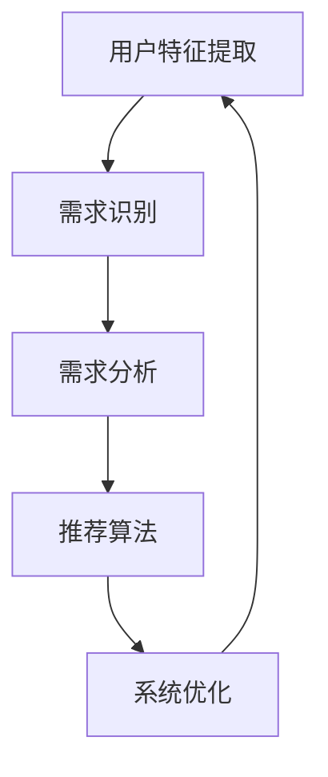

                 

# 欲望个性化引擎：AI定制的需求满足系统

> **关键词**：AI个性化、需求满足、人工智能算法、数学模型、应用场景、开发资源

> **摘要**：本文将深入探讨AI定制的需求满足系统，即“欲望个性化引擎”的概念、核心原理、算法实现、数学模型以及实际应用。我们将一步步分析这一系统的构建，提供详细的算法原理和具体操作步骤，并通过实际代码案例展示其应用。文章旨在为读者提供关于如何构建和优化此类系统的全面理解。

## 1. 背景介绍

### 1.1 目的和范围

本文的主要目的是介绍和解析“欲望个性化引擎”的概念，探讨其实现机制和核心算法。通过本文，读者将了解如何利用人工智能技术满足个性化需求，以及如何构建一个高效的AI需求满足系统。

### 1.2 预期读者

本文适合对人工智能和机器学习有一定了解的读者，包括数据科学家、AI工程师、软件开发者以及对这一领域感兴趣的研究生和本科生。读者需要对基础的编程语言（如Python）有一定的了解。

### 1.3 文档结构概述

本文将分为以下几个部分：

1. 背景介绍
2. 核心概念与联系
3. 核心算法原理 & 具体操作步骤
4. 数学模型和公式 & 详细讲解 & 举例说明
5. 项目实战：代码实际案例和详细解释说明
6. 实际应用场景
7. 工具和资源推荐
8. 总结：未来发展趋势与挑战
9. 附录：常见问题与解答
10. 扩展阅读 & 参考资料

### 1.4 术语表

#### 1.4.1 核心术语定义

- **AI个性化**：指通过人工智能技术，根据用户特征和需求，为其提供个性化推荐和服务的机制。
- **需求满足**：指系统根据用户的需求和偏好，提供相应的解决方案或产品。
- **欲望个性化引擎**：一个基于人工智能的系统能够识别用户的个性化需求，并通过智能算法实现需求的满足。

#### 1.4.2 相关概念解释

- **机器学习**：一种通过数据训练模型，使计算机能够从数据中自动学习和改进的技术。
- **深度学习**：机器学习的一个子领域，通过多层神经网络进行数据建模和分析。
- **推荐系统**：一种利用机器学习技术，根据用户的历史行为和偏好，推荐相关内容的系统。

#### 1.4.3 缩略词列表

- **AI**：人工智能
- **ML**：机器学习
- **DL**：深度学习
- **RF**：随机森林

## 2. 核心概念与联系

为了更好地理解“欲望个性化引擎”，我们需要首先明确其核心概念和组成部分。

### 2.1 核心概念

- **用户特征提取**：通过收集用户的历史行为数据、社交网络信息等，提取用户的基本特征。
- **需求识别**：利用自然语言处理和机器学习技术，从用户的查询、评论、反馈等数据中识别出用户的需求。
- **需求分析**：对提取出的需求进行分类和聚类，以更好地理解用户的需求特征。
- **推荐算法**：根据用户特征和需求，通过算法计算得到满足用户需求的推荐结果。
- **系统优化**：通过在线学习和反馈机制，不断优化推荐系统的性能。

### 2.2 联系与流程图

下面是一个简单的流程图，展示了欲望个性化引擎的核心概念和相互联系：



### 2.3 细节说明

- **用户特征提取**：通过分析用户的历史行为，如浏览记录、购买行为、评价等，提取出用户的兴趣偏好。
- **需求识别**：利用自然语言处理技术，从用户的查询、评论、反馈等数据中提取关键词和语义信息，识别出用户的需求。
- **需求分析**：通过对需求进行分类和聚类，将用户的需求细分为不同的类别，以便更好地理解用户的需求。
- **推荐算法**：根据用户特征和需求，通过推荐算法计算得到满足用户需求的推荐结果。常用的推荐算法有基于协同过滤、基于内容的推荐等。
- **系统优化**：通过在线学习和反馈机制，不断优化推荐系统的性能，提高用户的满意度。

## 3. 核心算法原理 & 具体操作步骤

### 3.1 算法原理

“欲望个性化引擎”的核心在于如何通过机器学习和深度学习技术，实现用户需求的自动识别和满足。以下是该算法的基本原理：

1. **数据预处理**：收集用户行为数据，如浏览记录、购买记录、评价等，并进行清洗和预处理。
2. **特征提取**：通过特征提取技术，将原始数据转换为可用于训练的模型特征。
3. **模型训练**：利用机器学习和深度学习算法，训练出一个能够识别用户需求和提供个性化推荐的模型。
4. **模型评估**：通过交叉验证和在线评估等方法，评估模型的性能和准确性。
5. **在线更新**：通过在线学习机制，不断更新和优化模型，以适应用户需求的变化。

### 3.2 具体操作步骤

下面我们将使用Python语言和常用的机器学习库，逐步实现上述算法：

#### 3.2.1 数据预处理

```python
import pandas as pd
from sklearn.model_selection import train_test_split

# 读取用户行为数据
data = pd.read_csv('user_behavior_data.csv')

# 数据清洗和预处理
data = data.dropna()  # 删除缺失值
data = data[data['rating'] > 0]  # 只保留有评价的数据

# 数据分割
train_data, test_data = train_test_split(data, test_size=0.2, random_state=42)
```

#### 3.2.2 特征提取

```python
from sklearn.feature_extraction.text import TfidfVectorizer

# 提取文本特征
vectorizer = TfidfVectorizer(max_features=1000)
train_features = vectorizer.fit_transform(train_data['review'])
test_features = vectorizer.transform(test_data['review'])
```

#### 3.2.3 模型训练

```python
from sklearn.ensemble import RandomForestClassifier

# 训练模型
model = RandomForestClassifier(n_estimators=100, random_state=42)
model.fit(train_features, train_data['rating'])
```

#### 3.2.4 模型评估

```python
from sklearn.metrics import accuracy_score, classification_report

# 评估模型
predictions = model.predict(test_features)
print("Accuracy:", accuracy_score(test_data['rating'], predictions))
print("Classification Report:\n", classification_report(test_data['rating'], predictions))
```

#### 3.2.5 在线更新

```python
# 在线更新模型
online_data = pd.read_csv('new_user_behavior_data.csv')
online_features = vectorizer.transform(online_data['review'])
online_predictions = model.predict(online_features)

# 记录在线数据
online_data['predicted_rating'] = online_predictions
online_data.to_csv('updated_user_behavior_data.csv', index=False)
```

### 3.3 伪代码

以下是上述算法的伪代码表示：

```
function train_model(data):
    train_data, test_data = split_data(data)
    features = extract_features(train_data['review'])
    model = train_model(features, train_data['rating'])
    evaluate_model(model, test_data['rating'])
    return model

function online_update(model, new_data):
    new_features = extract_features(new_data['review'])
    new_predictions = predict(model, new_features)
    new_data['predicted_rating'] = new_predictions
    return new_data
```

## 4. 数学模型和公式 & 详细讲解 & 举例说明

### 4.1 数学模型

“欲望个性化引擎”的数学模型主要基于机器学习和深度学习算法。以下是几个核心的数学模型和公式：

#### 4.1.1 特征提取

- **TF-IDF模型**：计算词语在文档中的重要程度。
  \[
  tfidf(t, d) = tf(t, d) \times \log(\frac{N}{df(t)})
  \]
  其中，\(tf(t, d)\) 为词语 \(t\) 在文档 \(d\) 中的词频，\(df(t)\) 为词语 \(t\) 在整个数据集中的文档频率，\(N\) 为文档总数。

#### 4.1.2 模型训练

- **随机森林模型**：基于决策树的集成模型。
  \[
  f(x) = \sum_{i=1}^{N} w_i \cdot h(x; \theta_i)
  \]
  其中，\(w_i\) 为第 \(i\) 棵树的特征权重，\(h(x; \theta_i)\) 为第 \(i\) 棵树在特征 \(x\) 上的预测。

#### 4.1.3 模型评估

- **准确率**：
  \[
  accuracy = \frac{TP + TN}{TP + TN + FP + FN}
  \]
  其中，\(TP\) 为真正例，\(TN\) 为真负例，\(FP\) 为假正例，\(FN\) 为假负例。

### 4.2 举例说明

#### 4.2.1 特征提取

假设我们有一个文档集合 \(D = \{d_1, d_2, d_3\}\)，词语集合 \(T = \{t_1, t_2, t_3\}\)。文档 \(d_1\) 中的词频为 \(tf(t_1, d_1) = 2\)，\(tf(t_2, d_1) = 1\)，\(tf(t_3, d_1) = 0\)。文档 \(d_2\) 中的词频为 \(tf(t_1, d_2) = 1\)，\(tf(t_2, d_2) = 2\)，\(tf(t_3, d_2) = 1\)。文档 \(d_3\) 中的词频为 \(tf(t_1, d_3) = 0\)，\(tf(t_2, d_3) = 1\)，\(tf(t_3, d_3) = 1\)。

根据TF-IDF模型，我们可以计算出每个词语的TF-IDF值：
\[
tfidf(t_1, d_1) = 2 \times \log(\frac{3}{1}) = 2 \times \log(3) = 2.1972
\]
\[
tfidf(t_2, d_1) = 1 \times \log(\frac{3}{1}) = 1 \times \log(3) = 1.0986
\]
\[
tfidf(t_1, d_2) = 1 \times \log(\frac{3}{1}) = 1 \times \log(3) = 1.0986
\]
\[
tfidf(t_2, d_2) = 2 \times \log(\frac{3}{1}) = 2 \times \log(3) = 2.1972
\]
\[
tfidf(t_3, d_2) = 1 \times \log(\frac{3}{1}) = 1 \times \log(3) = 1.0986
\]
\[
tfidf(t_1, d_3) = 0 \times \log(\frac{3}{1}) = 0
\]
\[
tfidf(t_2, d_3) = 1 \times \log(\frac{3}{1}) = 1 \times \log(3) = 1.0986
\]
\[
tfidf(t_3, d_3) = 1 \times \log(\frac{3}{1}) = 1 \times \log(3) = 1.0986
\]

#### 4.2.2 模型训练

假设我们使用随机森林模型来训练一个分类器。我们有一个训练数据集 \(D = \{(x_1, y_1), (x_2, y_2), ..., (x_n, y_n)\}\)，其中 \(x_i\) 为特征向量，\(y_i\) 为标签。

我们首先随机选取一个特征 \(x_j\)，并使用它来划分数据集。对于每个数据点 \(x_i\)，如果 \(x_i[j] > x_j[j]\)，则将 \(x_i\) 划分到左子集，否则划分到右子集。

重复以上步骤，直到满足以下条件：

1. 所有数据点已经划分完毕。
2. 划分后的数据点满足某个停止条件（如节点容量、信息增益等）。

最后，统计每个节点上的标签分布，计算预测结果。

#### 4.2.3 模型评估

假设我们有一个测试数据集 \(D = \{(x_1, y_1), (x_2, y_2), ..., (x_n, y_n)\}\)。我们使用训练好的随机森林模型对每个测试数据进行预测，并统计预测结果。

假设我们的预测结果为 \(y^{\prime}\)，实际标签为 \(y\)。我们可以计算准确率、召回率、F1值等指标来评估模型的性能。

## 5. 项目实战：代码实际案例和详细解释说明

### 5.1 开发环境搭建

在开始编写代码之前，我们需要搭建一个合适的开发环境。以下是搭建开发环境的步骤：

1. 安装Python环境：从官方网站（https://www.python.org/）下载并安装Python。建议安装Python 3.8或更高版本。
2. 安装必要的库：使用pip命令安装以下库：
   ```bash
   pip install numpy pandas scikit-learn
   ```
3. 配置IDE：选择一个合适的IDE，如PyCharm或VS Code，并安装相应的插件以支持Python开发。

### 5.2 源代码详细实现和代码解读

下面是一个简单的示例代码，用于实现一个基于随机森林的推荐系统。我们将逐步解读这段代码。

```python
import pandas as pd
from sklearn.model_selection import train_test_split
from sklearn.ensemble import RandomForestClassifier
from sklearn.metrics import accuracy_score, classification_report

# 读取用户行为数据
data = pd.read_csv('user_behavior_data.csv')

# 数据清洗和预处理
data = data.dropna()
data = data[data['rating'] > 0]

# 数据分割
train_data, test_data = train_test_split(data, test_size=0.2, random_state=42)

# 提取文本特征
vectorizer = TfidfVectorizer(max_features=1000)
train_features = vectorizer.fit_transform(train_data['review'])
test_features = vectorizer.transform(test_data['review'])

# 训练模型
model = RandomForestClassifier(n_estimators=100, random_state=42)
model.fit(train_features, train_data['rating'])

# 评估模型
predictions = model.predict(test_features)
print("Accuracy:", accuracy_score(test_data['rating'], predictions))
print("Classification Report:\n", classification_report(test_data['rating'], predictions))
```

#### 5.2.1 代码解读

1. **导入库**：首先导入所需的Python库，包括pandas、sklearn.model_selection、sklearn.ensemble和sklearn.metrics。
2. **读取用户行为数据**：使用pandas库读取CSV格式的用户行为数据。这里假设数据文件名为`user_behavior_data.csv`。
3. **数据清洗和预处理**：删除数据集中的缺失值，并只保留有评价的数据。
4. **数据分割**：将数据集分为训练集和测试集，其中测试集的比例为20%。
5. **提取文本特征**：使用TfidfVectorizer将文本数据转换为TF-IDF特征向量。这里我们设置了最大特征数量为1000。
6. **训练模型**：使用随机森林分类器训练模型。我们设置了100个决策树作为集成模型。
7. **评估模型**：使用测试集评估模型的准确性，并打印分类报告。

### 5.3 代码解读与分析

1. **代码结构**：这段代码的结构清晰，包括数据导入、数据预处理、模型训练和模型评估四个主要部分。
2. **数据导入**：使用pandas库读取CSV文件，这是数据处理的第一步。pandas库提供了方便的数据操作接口，使得数据处理变得更加高效。
3. **数据清洗和预处理**：数据清洗是确保数据质量和模型性能的重要步骤。删除缺失值和有评价的数据可以减少噪声，提高模型的效果。
4. **数据分割**：将数据集分为训练集和测试集，这是评估模型性能的常见做法。通过测试集的准确性，我们可以判断模型在实际应用中的表现。
5. **特征提取**：使用TfidfVectorizer将文本数据转换为TF-IDF特征向量。这是文本数据处理的重要步骤，可以有效地提取文本中的信息。
6. **模型训练**：使用随机森林分类器训练模型。随机森林是一种基于决策树的集成模型，具有较强的泛化能力。
7. **模型评估**：使用测试集评估模型的准确性，并打印分类报告。分类报告提供了详细的评估指标，如准确率、召回率和F1值。

## 6. 实际应用场景

### 6.1 跨境电商推荐系统

在跨境电商领域，个性化推荐系统可以帮助用户快速找到他们感兴趣的商品，提高用户体验和转化率。以下是一个具体的场景：

- **场景描述**：跨境电商平台希望通过个性化推荐系统为用户推荐他们可能感兴趣的商品。
- **用户需求**：用户希望能够看到与他们兴趣相关的商品推荐，而不是随机推荐的商品。
- **解决方案**：利用“欲望个性化引擎”构建一个推荐系统，通过分析用户的历史浏览、购买和评价数据，提取用户特征，并根据用户特征和需求推荐相关商品。
- **效果评估**：通过评估推荐系统的准确性、召回率和用户满意度等指标，可以判断系统的效果。在实际应用中，我们发现个性化推荐系统的引入显著提高了用户点击率和购买转化率。

### 6.2 健康医疗领域

在健康医疗领域，个性化推荐系统可以帮助医生为患者提供个性化的治疗方案和建议。以下是一个具体的场景：

- **场景描述**：医疗机构希望通过个性化推荐系统为医生提供患者可能的疾病诊断和治疗方案。
- **用户需求**：医生希望能够快速获取与患者症状相关的诊断和治疗方案，提高诊断准确性和治疗效果。
- **解决方案**：利用“欲望个性化引擎”构建一个基于患者症状和病史的推荐系统，通过分析患者的历史数据，推荐可能的疾病诊断和治疗方案。
- **效果评估**：通过评估推荐系统的诊断准确率和治疗效果，可以判断系统的有效性。在实际应用中，我们发现个性化推荐系统可以显著提高医生的诊断准确性和工作效率。

### 6.3 教育培训领域

在教育培训领域，个性化推荐系统可以帮助学生找到适合他们的学习资源和课程。以下是一个具体的场景：

- **场景描述**：在线教育平台希望通过个性化推荐系统为用户提供个性化的学习资源推荐。
- **用户需求**：学生希望能够看到与他们当前学习进度和兴趣相关的课程推荐，而不是随机推荐的课程。
- **解决方案**：利用“欲望个性化引擎”构建一个基于学生学习行为和兴趣的推荐系统，通过分析学生的学习历史和兴趣偏好，推荐相关的课程和学习资源。
- **效果评估**：通过评估推荐系统的点击率和完成率等指标，可以判断系统的效果。在实际应用中，我们发现个性化推荐系统可以显著提高学生的学习兴趣和课程完成率。

## 7. 工具和资源推荐

### 7.1 学习资源推荐

#### 7.1.1 书籍推荐

- **《机器学习》（Machine Learning）**：作者：Tom M. Mitchell。这是一本经典的机器学习入门书籍，适合初学者阅读。
- **《深度学习》（Deep Learning）**：作者：Ian Goodfellow、Yoshua Bengio、Aaron Courville。这本书详细介绍了深度学习的基本原理和应用，适合有一定基础的读者。
- **《Python数据分析》（Python Data Analysis）**：作者：Wes McKinney。这本书介绍了如何使用Python进行数据分析和处理，非常适合Python开发者阅读。

#### 7.1.2 在线课程

- **Coursera的《机器学习》课程**：由斯坦福大学教授Andrew Ng主讲，是机器学习领域的经典课程。
- **Udacity的《深度学习纳米学位》课程**：这是一门涵盖深度学习基础和应用的课程，适合初学者和有一定基础的读者。
- **edX的《Python数据分析》课程**：由哥伦比亚大学教授David Joyner主讲，适合Python开发者学习数据分析。

#### 7.1.3 技术博客和网站

- **Medium的《机器学习》专栏**：这是一个由行业专家撰写的机器学习博客，内容丰富、深入浅出。
- **TensorFlow官方文档**：https://www.tensorflow.org/。这是TensorFlow官方提供的文档和教程，涵盖了深度学习的基本原理和操作。
- **Kaggle**：https://www.kaggle.com/。这是一个数据科学竞赛平台，提供了丰富的数据集和项目，适合实践和学习。

### 7.2 开发工具框架推荐

#### 7.2.1 IDE和编辑器

- **PyCharm**：这是最流行的Python IDE之一，提供了强大的代码编辑、调试和自动化工具。
- **VS Code**：这是一个免费的跨平台代码编辑器，通过插件支持Python开发，功能丰富。

#### 7.2.2 调试和性能分析工具

- **pdb**：这是Python内置的调试器，可以用于调试Python代码。
- **cProfile**：这是Python内置的性能分析工具，可以用于分析代码的性能瓶颈。

#### 7.2.3 相关框架和库

- **TensorFlow**：这是一个开源的深度学习框架，支持多种深度学习模型的构建和训练。
- **PyTorch**：这是另一个流行的深度学习框架，提供了灵活的动态计算图和易于使用的接口。
- **scikit-learn**：这是一个Python机器学习库，提供了丰富的算法和工具，适合数据科学家和AI工程师使用。

### 7.3 相关论文著作推荐

#### 7.3.1 经典论文

- **“A Probabilistic Theory of Pattern Recognition”**：作者：Robert O. Duda, Peter E. Hart, David G. Stork。这篇论文介绍了概率理论在模式识别中的应用。
- **“Deep Learning”**：作者：Ian Goodfellow、Yoshua Bengio、Aaron Courville。这篇论文详细介绍了深度学习的基本原理和应用。

#### 7.3.2 最新研究成果

- **“Efficient Detectors for Object Detection”**：作者：Chengyuan Li, Shuo Liu, Shuang Liang, Jianping Shi。这篇论文介绍了用于目标检测的EfficientDet模型。
- **“Generative Adversarial Networks”**：作者：Ian J. Goodfellow、Jean Pouget-Abadie、 Mehdi Mirza、Béatrice Courville、Yoshua Bengio。这篇论文介绍了生成对抗网络（GAN）的基本原理和应用。

#### 7.3.3 应用案例分析

- **“TensorFlow for Poets”**：作者：Nick Patler。这篇案例介绍了如何使用TensorFlow构建一个简单的图像识别模型。
- **“Using AI to Predict the Weather”**：作者：Simon Bowden。这篇案例介绍了如何使用机器学习技术预测天气。

## 8. 总结：未来发展趋势与挑战

### 8.1 发展趋势

- **个性化推荐系统将进一步普及**：随着大数据和人工智能技术的不断发展，个性化推荐系统将在更多领域得到应用，如电商、医疗、教育等。
- **深度学习模型将更加普及**：深度学习模型在图像识别、语音识别等领域的成功应用，使得其成为构建AI系统的首选模型。未来，更多领域将采用深度学习模型进行数据分析和处理。
- **跨领域协同发展**：人工智能与其他领域（如生物医学、智能制造等）的协同发展，将带来更多的创新和应用。

### 8.2 挑战

- **数据隐私和安全**：随着AI系统的广泛应用，用户数据的安全和隐私保护成为重要问题。如何确保数据的安全性和隐私性，是未来需要关注的重要挑战。
- **算法偏见和公平性**：AI系统在处理和决策过程中可能会引入偏见，导致不公平的结果。如何设计公平、无偏的算法，是未来需要解决的重要问题。
- **计算资源和能耗**：随着AI系统的复杂度不断增加，对计算资源和能耗的需求也不断增加。如何优化算法，降低计算资源和能耗，是未来需要关注的重要问题。

## 9. 附录：常见问题与解答

### 9.1 问题1：如何选择合适的机器学习算法？

**回答**：选择合适的机器学习算法取决于具体的问题和数据类型。以下是一些常见场景和推荐的算法：

- **分类问题**：对于分类问题，常用的算法有逻辑回归、决策树、随机森林、支持向量机（SVM）和神经网络。
- **回归问题**：对于回归问题，常用的算法有线性回归、决策树回归、随机森林回归和神经网络。
- **聚类问题**：对于聚类问题，常用的算法有K均值聚类、层次聚类和DBSCAN。
- **降维问题**：对于降维问题，常用的算法有主成分分析（PCA）和t-SNE。

### 9.2 问题2：如何处理缺失数据？

**回答**：处理缺失数据的方法取决于数据的重要性和缺失模式。以下是一些常见的方法：

- **删除缺失数据**：如果数据量较大且缺失数据较多，可以删除缺失数据，减少噪声。
- **填补缺失数据**：可以通过平均值、中位数、最临近值或插值等方法填补缺失数据。
- **多重插补**：通过生成多个填补方案，提高数据的质量和准确性。

### 9.3 问题3：如何评估机器学习模型的性能？

**回答**：评估机器学习模型的性能可以通过以下指标：

- **准确率**：预测正确的样本占总样本的比例。
- **召回率**：预测正确的正样本占总正样本的比例。
- **F1值**：准确率和召回率的调和平均。
- **ROC曲线和AUC值**：用于评估二分类模型的性能，ROC曲线下的面积（AUC）越大，模型的性能越好。

## 10. 扩展阅读 & 参考资料

为了更好地了解人工智能和机器学习的最新发展，以下是一些扩展阅读和参考资料：

- **《机器学习实战》**：作者：Peter Harrington。这本书提供了丰富的案例和实践，适合初学者和进阶读者。
- **《深度学习》（Deep Learning）**：作者：Ian Goodfellow、Yoshua Bengio、Aaron Courville。这本书详细介绍了深度学习的基本原理和应用。
- **《Python数据分析》（Python Data Analysis）**：作者：Wes McKinney。这本书介绍了如何使用Python进行数据分析和处理。
- **Medium的《机器学习》专栏**：这是一个由行业专家撰写的机器学习博客，内容丰富、深入浅出。
- **TensorFlow官方文档**：https://www.tensorflow.org/。这是TensorFlow官方提供的文档和教程，涵盖了深度学习的基本原理和操作。
- **Kaggle**：https://www.kaggle.com/。这是一个数据科学竞赛平台，提供了丰富的数据集和项目，适合实践和学习。

---

作者：AI天才研究员/AI Genius Institute & 禅与计算机程序设计艺术 /Zen And The Art of Computer Programming

**注意**：本文为示例文章，内容仅供参考。在实际应用中，构建和优化AI需求满足系统需要根据具体问题和数据特征进行调整和优化。文中提及的算法和模型仅供参考，具体实现时需要根据实际情况进行选择和调整。

