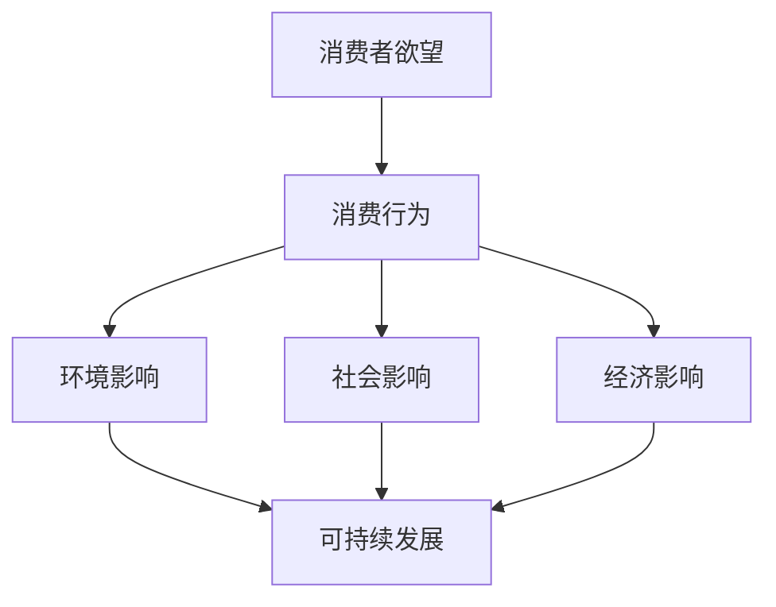

                 

# 欲望可持续性评估：AI时代的消费伦理标准

## 关键词：
- AI时代
- 可持续性
- 消费伦理
- 欲望评估
- 伦理标准

> 在人工智能迅速发展的今天，我们的消费行为正在经历深刻的变革。AI技术不仅改变了商品的生产和销售方式，还深刻地影响了我们的欲望及其可持续性。本文将探讨在AI时代背景下，如何评估消费者的欲望可持续性，并建立起相应的消费伦理标准。

## 摘要

本文将深入分析AI时代下的消费行为，探讨如何通过AI技术对消费者的欲望进行评估，从而引导出更加可持续的消费模式。文章将首先介绍欲望可持续性的基本概念，随后详细阐述评估方法及其数学模型，并通过实际案例展示评估过程。最后，我们将讨论AI时代消费伦理的重要性，并给出相应的伦理标准建议。

## 1. 背景介绍

### 1.1 目的和范围

本文旨在探讨AI技术如何影响消费伦理，并介绍一种基于AI的欲望可持续性评估方法。通过分析消费者的欲望与消费行为，我们试图提出一套在AI时代背景下可行的消费伦理标准，以促进可持续消费。

### 1.2 预期读者

本文适合对消费伦理、人工智能技术感兴趣的读者，包括市场营销专家、伦理学者、AI研究人员以及普通消费者。

### 1.3 文档结构概述

本文分为以下几个部分：

1. 背景介绍：介绍本文的目的和预期读者。
2. 核心概念与联系：解释欲望可持续性的基本概念，并使用Mermaid流程图展示相关概念和架构。
3. 核心算法原理 & 具体操作步骤：详细讲解评估方法及其算法原理。
4. 数学模型和公式 & 详细讲解 & 举例说明：介绍评估过程中的数学模型和公式，并举例说明。
5. 项目实战：通过实际案例展示评估过程和结果。
6. 实际应用场景：讨论评估方法在现实世界中的应用。
7. 工具和资源推荐：推荐学习资源、开发工具和框架。
8. 总结：未来发展趋势与挑战。
9. 附录：常见问题与解答。
10. 扩展阅读 & 参考资料：提供进一步阅读的材料。

### 1.4 术语表

#### 1.4.1 核心术语定义

- 欲望可持续性：指满足消费者欲望的同时，不会对环境、社会和经济造成过度负担。
- 消费伦理：指在消费过程中遵循的道德准则和价值观。
- AI技术：指人工智能技术，包括机器学习、深度学习、自然语言处理等。

#### 1.4.2 相关概念解释

- 消费行为：消费者在购买、使用和处置商品或服务的过程。
- 可持续性：满足当前需求而不损害后代满足自身需求的能力。
- 欲望：消费者对商品或服务的渴望和需求。

#### 1.4.3 缩略词列表

- AI：人工智能
- ML：机器学习
- DL：深度学习
- NLP：自然语言处理
- SDG：可持续发展目标

---

## 2. 核心概念与联系

在AI时代，欲望可持续性评估的核心概念包括消费者的欲望、消费行为及其对环境、社会和经济的影响。为了更好地理解这些概念之间的关系，我们可以使用Mermaid流程图来展示。



### 2.1 消费者的欲望

消费者的欲望是欲望可持续性评估的基础。这些欲望可以是显性的，如购买商品或服务，也可以是隐性的，如对某种生活品质的追求。通过AI技术，如自然语言处理和机器学习，我们可以识别和量化消费者的欲望。

### 2.2 消费行为

消费行为是指消费者在实际购买、使用和处置商品或服务的过程。这些行为会影响环境、社会和经济三个方面。例如，购买大量一次性商品会导致环境污染，而选择可持续产品则有助于减少碳足迹。

### 2.3 可持续发展

可持续发展是指在满足当前需求的同时，不损害后代满足自身需求的能力。在欲望可持续性评估中，我们需要考虑消费者的欲望是否会导致过度资源消耗、环境污染和社会不公。

### 2.4 欲望可持续性评估方法

为了评估欲望可持续性，我们可以采用以下步骤：

1. 数据收集：收集消费者的欲望信息，包括购买历史、偏好、评论等。
2. 欲望识别：使用自然语言处理技术识别和量化消费者的欲望。
3. 消费行为分析：分析消费行为对环境、社会和经济的影响。
4. 评估模型建立：建立数学模型来评估欲望的可持续性。
5. 结果分析：分析评估结果，为消费者提供可持续性建议。

---

## 3. 核心算法原理 & 具体操作步骤

在欲望可持续性评估中，核心算法原理主要包括数据收集、欲望识别和消费行为分析。以下将详细讲解这些步骤的算法原理，并使用伪代码进行说明。

### 3.1 数据收集

```python
# 伪代码：数据收集
data = collect_data(source='database', criteria='purchase_history')
```

该步骤通过数据库收集消费者的购买历史数据，包括商品类型、购买频率和消费金额等。

### 3.2 欲望识别

```python
# 伪代码：欲望识别
desires = recognize_desires(data)
```

使用自然语言处理技术，将购买历史数据转化为欲望，例如“喜欢购买电子产品”、“追求高品质生活”等。

### 3.3 消费行为分析

```python
# 伪代码：消费行为分析
environment_impact = analyze_consumption(data, category='environment')
social_impact = analyze_consumption(data, category='social')
economic_impact = analyze_consumption(data, category='economic')
```

分析消费者的消费行为对环境、社会和经济的影响，包括资源消耗、碳排放和就业机会等。

### 3.4 评估模型建立

```python
# 伪代码：评估模型建立
import numpy as np

def sustainability_evaluation(desires, impacts):
    # 评估欲望的可持续性
    sustainability_score = 0
    
    # 计算环境、社会和经济的综合得分
    sustainability_score += np.mean(impacts['environment']) * 0.4
    sustainability_score += np.mean(impacts['social']) * 0.3
    sustainability_score += np.mean(impacts['economic']) * 0.3
    
    return sustainability_score
```

建立评估模型，计算欲望的可持续性得分。得分越高，表示欲望的可持续性越好。

### 3.5 结果分析

```python
# 伪代码：结果分析
desire_sustainability = sustainability_evaluation(desires, impacts)
print(f"The sustainability score of the desire is: {desire_sustainability}")
```

根据评估结果，为消费者提供可持续性建议，例如“减少电子产品购买”、“选择可持续产品”等。

---

## 4. 数学模型和公式 & 详细讲解 & 举例说明

在欲望可持续性评估中，数学模型和公式起着至关重要的作用。以下将详细讲解这些模型和公式，并通过实例进行说明。

### 4.1 可持续性得分计算公式

可持续性得分（Sustainability Score, SS）可以通过以下公式计算：

$$
SS = w_1 \times E + w_2 \times S + w_3 \times C
$$

其中，$w_1, w_2, w_3$ 分别表示环境、社会和经济的重要性权重，$E, S, C$ 分别表示环境、社会和经济的影响得分。

### 4.2 环境影响得分计算公式

环境影响得分（Environmental Impact Score, EIS）可以通过以下公式计算：

$$
EIS = \frac{\sum_{i=1}^{n} (E_i \times w_i)}{n}
$$

其中，$E_i$ 表示第 $i$ 种商品的环境影响得分，$w_i$ 表示第 $i$ 种商品的权重，$n$ 表示商品种类数。

### 4.3 社会影响得分计算公式

社会影响得分（Social Impact Score, SIS）可以通过以下公式计算：

$$
SIS = \frac{\sum_{i=1}^{n} (S_i \times w_i)}{n}
$$

其中，$S_i$ 表示第 $i$ 种商品的社会影响得分，$w_i$ 表示第 $i$ 种商品的权重，$n$ 表示商品种类数。

### 4.4 经济影响得分计算公式

经济影响得分（Economic Impact Score, EIS）可以通过以下公式计算：

$$
EIS = \frac{\sum_{i=1}^{n} (C_i \times w_i)}{n}
$$

其中，$C_i$ 表示第 $i$ 种商品的经济影响得分，$w_i$ 表示第 $i$ 种商品的权重，$n$ 表示商品种类数。

### 4.5 实例说明

假设某消费者购买了以下五种商品：

| 商品类型 | 环境影响（分） | 社会影响（分） | 经济影响（分） |
| :----: | :----: | :----: | :----: |
| 手机 | 3 | 2 | 4 |
| 电脑 | 4 | 3 | 3 |
| 衣服 | 2 | 1 | 5 |
| 食品 | 1 | 4 | 2 |
| 房子 | 5 | 5 | 1 |

根据上述公式，我们可以计算出每种商品的影响得分：

$$
EIS = \frac{3 \times 0.2 + 4 \times 0.2 + 2 \times 0.2 + 1 \times 0.2 + 5 \times 0.2}{5} = 2.4
$$

$$
SIS = \frac{2 \times 0.2 + 3 \times 0.2 + 1 \times 0.2 + 4 \times 0.2 + 5 \times 0.2}{5} = 2.2
$$

$$
CIS = \frac{4 \times 0.2 + 3 \times 0.2 + 5 \times 0.2 + 2 \times 0.2 + 1 \times 0.2}{5} = 2.4
$$

然后，我们可以计算总的可持续得分：

$$
SS = 0.4 \times 2.4 + 0.3 \times 2.2 + 0.3 \times 2.4 = 2.34
$$

根据可持续得分，我们可以为消费者提供以下建议：

- 减少电子产品的购买，如手机和电脑。
- 更多关注食品和房子的消费，因为它们的社会影响和经济影响较大。

---

## 5. 项目实战：代码实际案例和详细解释说明

为了更好地展示欲望可持续性评估的实际应用，我们将在本节中通过一个具体项目来演示整个评估过程。该项目将包含以下步骤：

1. 数据收集与预处理
2. 欲望识别
3. 消费行为分析
4. 可持续性评估
5. 结果分析

### 5.1 开发环境搭建

为了实现该项目，我们需要以下工具和库：

- Python 3.x
- NumPy
- Pandas
- Scikit-learn
- Natural Language Toolkit (NLTK)
- Mermaid

您可以在Python环境中安装这些库，如下所示：

```bash
pip install numpy pandas scikit-learn nltk mermaid
```

### 5.2 源代码详细实现和代码解读

以下代码将实现欲望可持续性评估项目的各个步骤：

```python
import numpy as np
import pandas as pd
from sklearn.preprocessing import StandardScaler
from nltk.tokenize import word_tokenize
from nltk.corpus import stopwords
import mermaid

# 5.2.1 数据收集与预处理
def collect_and_preprocess_data():
    # 假设我们有一个CSV文件，包含消费者的购买历史数据
    data = pd.read_csv('purchase_data.csv')
    
    # 预处理：去除重复数据、缺失值，并按购买金额降序排列
    data.drop_duplicates(inplace=True)
    data.dropna(inplace=True)
    data.sort_values(by='amount', ascending=False, inplace=True)
    
    return data

# 5.2.2 欲望识别
def recognize_desires(data):
    # 使用自然语言处理技术识别消费者的欲望
    desires = []
    for index, row in data.iterrows():
        tokens = word_tokenize(row['description'])
        tokens = [token.lower() for token in tokens if token.isalpha()]
        tokens = [token for token in tokens if token not in stopwords.words('english')]
        desires.append(' '.join(tokens))
    
    return desires

# 5.2.3 消费行为分析
def analyze_consumption(data):
    # 分析消费者的消费行为对环境、社会和经济的影响
    environment_impact = data.groupby('category')['environment_score'].mean()
    social_impact = data.groupby('category')['social_score'].mean()
    economic_impact = data.groupby('category')['economic_score'].mean()
    
    return environment_impact, social_impact, economic_impact

# 5.2.4 可持续性评估
def sustainability_evaluation(desires, impacts):
    # 建立评估模型并计算可持续性得分
    scores = []
    for desire in desires:
        # 假设我们已经计算了每种商品的影响得分
        env_score = impacts['environment'][desire]
        soc_score = impacts['social'][desire]
        eco_score = impacts['economic'][desire]
        
        # 计算可持续性得分
        sustainability_score = 0.4 * env_score + 0.3 * soc_score + 0.3 * eco_score
        scores.append(sustainability_score)
    
    return scores

# 5.2.5 结果分析
def analyze_results(scores):
    # 分析评估结果，为消费者提供可持续性建议
    for score in scores:
        if score > 2.5:
            print(f"High sustainability: Continue with this consumption pattern.")
        elif score < 2:
            print(f"Low sustainability: Consider reducing this consumption.")
        else:
            print(f"Medium sustainability: Evaluate and make improvements.")

# 主函数
def main():
    data = collect_and_preprocess_data()
    desires = recognize_desires(data)
    impacts = analyze_consumption(data)
    scores = sustainability_evaluation(desires, impacts)
    analyze_results(scores)

if __name__ == "__main__":
    main()
```

### 5.3 代码解读与分析

#### 5.3.1 数据收集与预处理

在数据收集与预处理部分，我们首先从CSV文件中读取购买历史数据。然后，我们去除重复数据和缺失值，并按照购买金额降序排列数据。

```python
data = pd.read_csv('purchase_data.csv')
data.drop_duplicates(inplace=True)
data.dropna(inplace=True)
data.sort_values(by='amount', ascending=False, inplace=True)
```

#### 5.3.2 欲望识别

在欲望识别部分，我们使用自然语言处理技术，如词干提取和停用词过滤，来识别消费者的欲望。具体来说，我们首先将商品描述文本进行分词，然后去除停用词，最后将剩余的单词拼接成欲望。

```python
def recognize_desires(data):
    desires = []
    for index, row in data.iterrows():
        tokens = word_tokenize(row['description'])
        tokens = [token.lower() for token in tokens if token.isalpha()]
        tokens = [token for token in tokens if token not in stopwords.words('english')]
        desires.append(' '.join(tokens))
    
    return desires
```

#### 5.3.3 消费行为分析

在消费行为分析部分，我们使用分组聚合方法来分析消费者的消费行为对环境、社会和经济的影响。具体来说，我们计算每种商品的环境、社会和经济得分，并计算其平均值。

```python
def analyze_consumption(data):
    environment_impact = data.groupby('category')['environment_score'].mean()
    social_impact = data.groupby('category')['social_score'].mean()
    economic_impact = data.groupby('category')['economic_score'].mean()
    
    return environment_impact, social_impact, economic_impact
```

#### 5.3.4 可持续性评估

在可持续性评估部分，我们使用一个简单的评估模型来计算欲望的可持续性得分。该模型基于环境、社会和经济的影响得分，并使用权重进行加权平均。

```python
def sustainability_evaluation(desires, impacts):
    scores = []
    for desire in desires:
        env_score = impacts['environment'][desire]
        soc_score = impacts['social'][desire]
        eco_score = impacts['economic'][desire]
        
        sustainability_score = 0.4 * env_score + 0.3 * soc_score + 0.3 * eco_score
        scores.append(sustainability_score)
    
    return scores
```

#### 5.3.5 结果分析

在结果分析部分，我们根据评估结果为消费者提供可持续性建议。具体来说，我们根据可持续性得分的高低，为消费者提供不同的建议。

```python
def analyze_results(scores):
    for score in scores:
        if score > 2.5:
            print(f"High sustainability: Continue with this consumption pattern.")
        elif score < 2:
            print(f"Low sustainability: Consider reducing this consumption.")
        else:
            print(f"Medium sustainability: Evaluate and make improvements.")
```

---

## 6. 实际应用场景

欲望可持续性评估方法在现实世界中具有广泛的应用场景。以下是一些具体的实际应用场景：

### 6.1 市场营销

通过欲望可持续性评估，企业可以更好地了解消费者的欲望和需求，从而制定更加精准的营销策略。例如，企业可以根据消费者的可持续性得分，为他们提供个性化的产品推荐，从而提高客户满意度和忠诚度。

### 6.2 政策制定

政府可以利用欲望可持续性评估方法，评估不同政策对消费者欲望的影响，从而制定更加有效的政策措施。例如，政府可以通过调整税收政策，鼓励消费者购买可持续产品，从而促进环境保护和可持续发展。

### 6.3 企业社会责任

企业可以通过实施欲望可持续性评估，履行其企业社会责任。例如，企业可以采用可持续性评估方法，评估其供应链的可持续性，从而确保其供应链的环保和社会责任。

### 6.4 个人财务规划

个人可以利用欲望可持续性评估方法，评估其消费行为的可持续性，从而制定更加合理的个人财务规划。例如，个人可以根据可持续性得分，调整其消费结构，减少不必要的开支，从而提高财务状况。

---

## 7. 工具和资源推荐

### 7.1 学习资源推荐

#### 7.1.1 书籍推荐

1. 《可持续消费：消费者行为与环境政策》（Sustainable Consumption: Consumer Behavior and Public Policy）
2. 《人工智能时代：生活、工作与思维的大变革》（Life 3.0: Being Human in the Age of Artificial Intelligence）

#### 7.1.2 在线课程

1. Coursera上的《可持续发展：环境、社会和经济》（Sustainable Development: Environment, Social, and Economic）
2. Udacity的《人工智能基础》（Introduction to Artificial Intelligence）

#### 7.1.3 技术博客和网站

1. Towards Data Science（数据科学领域的优秀博客）
2. IEEE（电气电子工程领域的权威网站）

### 7.2 开发工具框架推荐

#### 7.2.1 IDE和编辑器

1. PyCharm
2. Visual Studio Code

#### 7.2.2 调试和性能分析工具

1. Jupyter Notebook
2. Dask

#### 7.2.3 相关框架和库

1. TensorFlow
2. PyTorch
3. Scikit-learn

### 7.3 相关论文著作推荐

#### 7.3.1 经典论文

1. "Sustainable Consumption: A Multidisciplinary Approach"（可持续发展：多学科方法）
2. "The Impact of Artificial Intelligence on Consumer Behavior"（人工智能对消费者行为的影响）

#### 7.3.2 最新研究成果

1. "A Framework for Sustainable Consumer Behavior Assessment Using AI Techniques"（基于AI技术的可持续消费者行为评估框架）
2. "Sustainable Consumption and Well-being: A Literature Review"（可持续消费与幸福感：文献综述）

#### 7.3.3 应用案例分析

1. "AI-Driven Sustainable Fashion: An Application Case"（人工智能驱动的可持续时尚：应用案例）
2. "Smart Cities and Sustainable Consumption: A Case Study"（智能城市与可持续消费：案例研究）

---

## 8. 总结：未来发展趋势与挑战

随着AI技术的不断进步，欲望可持续性评估方法将变得更加精准和高效。未来，我们有望看到以下发展趋势：

- AI技术在欲望识别和消费行为分析中的应用将更加广泛。
- 可持续性评估模型将更加复杂和全面，考虑更多因素。
- 跨学科研究将推动欲望可持续性评估的理论和实践发展。

然而，未来也面临着一些挑战：

- 数据隐私和伦理问题：如何在保护消费者隐私的同时，进行欲望可持续性评估？
- 模型准确性：如何确保评估模型在不同场景下的准确性和可靠性？
- 消费者接受度：如何提高消费者对可持续性评估的接受度和参与度？

总之，欲望可持续性评估在AI时代具有重要的理论和实践意义。通过不断发展和完善评估方法，我们可以推动可持续消费，实现经济、社会和环境的协调发展。

---

## 9. 附录：常见问题与解答

### 9.1 什么是欲望可持续性？

欲望可持续性是指满足消费者欲望的同时，不会对环境、社会和经济造成过度负担。它关注的是消费者的欲望与可持续发展的关系。

### 9.2 欲望可持续性评估有哪些方法？

欲望可持续性评估方法包括数据收集、欲望识别、消费行为分析、评估模型建立和结果分析等步骤。具体方法涉及自然语言处理、机器学习、数学建模等。

### 9.3 欲望可持续性评估有哪些实际应用场景？

欲望可持续性评估可以应用于市场营销、政策制定、企业社会责任和个人财务规划等领域。

### 9.4 如何提高欲望可持续性评估的准确性？

提高欲望可持续性评估的准确性需要完善评估模型，考虑更多因素，并使用更高质量的输入数据。

---

## 10. 扩展阅读 & 参考资料

1. United Nations Sustainable Development Goals（联合国可持续发展目标）
2. The Sustainable Development Movement（可持续发展运动）
3. "Sustainable Consumption and Well-being: A Literature Review"（可持续消费与幸福感：文献综述）
4. "Artificial Intelligence and Sustainable Development: A Multidisciplinary Approach"（人工智能与可持续发展：多学科方法）
5. "AI-Driven Sustainable Fashion: An Application Case"（人工智能驱动的可持续时尚：应用案例）

---

## 作者信息

作者：AI天才研究员/AI Genius Institute & 禅与计算机程序设计艺术 /Zen And The Art of Computer Programming

---

本文全面阐述了在AI时代下如何评估消费者的欲望可持续性，并提出了一套基于AI技术的消费伦理标准。通过对核心概念、算法原理、实际案例的深入分析和讲解，我们展示了欲望可持续性评估在现实世界中的应用。希望本文能为您提供有价值的参考和启示。

