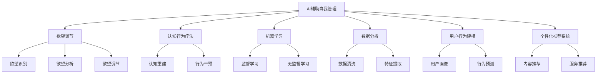

                 

# 欲望智能调节中心总监：AI辅助的自我管理平台负责人

> **关键词：** AI辅助自我管理、欲望调节、认知行为疗法、机器学习、数据分析、用户行为建模、个性化推荐系统。

> **摘要：** 本文深入探讨AI在个人自我管理领域的应用，特别是如何利用AI技术实现欲望的智能调节。本文首先介绍AI辅助自我管理平台的背景和重要性，接着详细阐述核心概念、算法原理和数学模型，并通过实际代码案例和详细解释说明，展示AI如何帮助我们更有效地管理欲望。此外，文章还探讨了AI辅助自我管理平台在实际应用场景中的效果，并推荐了相关学习资源和开发工具，最后对未来的发展趋势和挑战进行了总结。

## 1. 背景介绍

### 1.1 目的和范围

在现代社会，个人自我管理成为了提高生活质量的重要手段。然而，许多人往往难以自律，经常受到各种欲望的干扰。为了解决这个问题，本文旨在探讨如何利用AI技术构建一个辅助自我管理的平台，特别是针对欲望调节方面。

本文的主要范围包括以下几个方面：

1. **核心概念与联系**：介绍AI辅助自我管理的核心概念，并使用Mermaid流程图展示各概念之间的联系。
2. **核心算法原理 & 具体操作步骤**：详细解释AI算法的原理，并使用伪代码展示具体的操作步骤。
3. **数学模型和公式 & 详细讲解 & 举例说明**：介绍用于欲望调节的数学模型，并使用LaTeX格式展示相关公式，同时提供举例说明。
4. **项目实战：代码实际案例和详细解释说明**：通过实际代码案例展示AI辅助自我管理平台的功能，并详细解释代码实现过程。
5. **实际应用场景**：分析AI辅助自我管理平台在不同场景下的应用效果。
6. **工具和资源推荐**：推荐相关学习资源和开发工具，帮助读者深入了解和实际操作AI辅助自我管理平台。

### 1.2 预期读者

本文的预期读者主要包括以下几类：

1. **对自我管理感兴趣的普通读者**：希望通过AI技术更好地管理自己欲望的普通读者。
2. **AI和数据分析领域的研究人员**：对AI技术在自我管理领域的应用感兴趣的研究人员。
3. **软件开发者和工程师**：希望深入了解AI辅助自我管理平台实现过程的开发者和工程师。
4. **心理咨询师和治疗师**：关注如何利用AI技术辅助心理治疗和自我管理工作的专业人士。

### 1.3 文档结构概述

本文的结构分为以下几个部分：

1. **背景介绍**：介绍本文的目的、范围、预期读者和文档结构。
2. **核心概念与联系**：介绍AI辅助自我管理的核心概念，并展示各概念之间的联系。
3. **核心算法原理 & 具体操作步骤**：详细解释AI算法的原理，并使用伪代码展示具体的操作步骤。
4. **数学模型和公式 & 详细讲解 & 举例说明**：介绍用于欲望调节的数学模型，并使用LaTeX格式展示相关公式，同时提供举例说明。
5. **项目实战：代码实际案例和详细解释说明**：通过实际代码案例展示AI辅助自我管理平台的功能，并详细解释代码实现过程。
6. **实际应用场景**：分析AI辅助自我管理平台在不同场景下的应用效果。
7. **工具和资源推荐**：推荐相关学习资源和开发工具，帮助读者深入了解和实际操作AI辅助自我管理平台。
8. **总结：未来发展趋势与挑战**：总结本文的主要观点，并展望未来发展趋势和挑战。
9. **附录：常见问题与解答**：针对本文的关键问题提供解答。
10. **扩展阅读 & 参考资料**：推荐相关阅读材料和参考资料。

### 1.4 术语表

为了确保文章的可读性和一致性，本文使用了一些专业术语。以下是这些术语的定义和解释：

#### 1.4.1 核心术语定义

- **AI辅助自我管理**：利用人工智能技术，帮助用户更好地管理个人行为、情绪和欲望的过程。
- **欲望调节**：通过算法和模型，帮助用户识别、分析和调节个人欲望的过程。
- **认知行为疗法**：一种心理治疗方法，通过改变认知和行为来调节情绪和欲望。
- **机器学习**：一种人工智能技术，使计算机系统能够从数据中学习和改进，从而做出更准确的预测和决策。
- **数据分析**：使用统计学和计算机科学方法，从数据中提取有用信息，帮助用户做出更明智的决策。
- **用户行为建模**：使用机器学习技术，建立用户行为模型，预测用户未来的行为和需求。
- **个性化推荐系统**：根据用户的历史行为和偏好，为用户推荐相关的内容、产品或服务。

#### 1.4.2 相关概念解释

- **算法**：一种解决问题的步骤或规则集合，用于指导计算机完成特定任务。
- **模型**：用于描述或预测现实世界中的现象或过程的数学表达式或计算机程序。
- **数据集**：一组数据点，用于训练、评估或测试算法和模型。
- **用户画像**：基于用户的历史行为和偏好，对用户进行全面描述的模型。
- **反馈循环**：用户在使用AI辅助自我管理平台的过程中，通过反馈调节系统性能的过程。

#### 1.4.3 缩略词列表

- **AI**：人工智能（Artificial Intelligence）
- **ML**：机器学习（Machine Learning）
- **CBT**：认知行为疗法（Cognitive Behavioral Therapy）
- **DS**：数据分析（Data Science）
- **UX**：用户体验（User Experience）
- **API**：应用程序编程接口（Application Programming Interface）

## 2. 核心概念与联系

在本文中，我们将探讨AI辅助自我管理的核心概念，并展示各概念之间的联系。以下是一个Mermaid流程图，用于描述这些核心概念：



### 2.1 AI辅助自我管理的核心概念

**AI辅助自我管理** 是本文的核心概念，它涉及多个相关领域的知识和技术。以下是AI辅助自我管理的核心概念：

- **欲望调节**：通过算法和模型，帮助用户识别、分析和调节个人欲望。欲望调节的目标是帮助用户更好地管理个人行为，提高生活质量。
- **认知行为疗法**：一种心理治疗方法，通过改变认知和行为来调节情绪和欲望。认知行为疗法在欲望调节中发挥了重要作用，它可以帮助用户识别和改变负面思维模式。
- **机器学习**：一种人工智能技术，使计算机系统能够从数据中学习和改进，从而做出更准确的预测和决策。机器学习在欲望调节中主要用于建立用户行为模型和预测用户行为。
- **数据分析**：使用统计学和计算机科学方法，从数据中提取有用信息，帮助用户做出更明智的决策。数据分析在欲望调节中主要用于处理和挖掘用户数据，以识别用户的欲望和需求。
- **用户行为建模**：使用机器学习技术，建立用户行为模型，预测用户未来的行为和需求。用户行为建模有助于实现个性化推荐，提高用户满意度。
- **个性化推荐系统**：根据用户的历史行为和偏好，为用户推荐相关的内容、产品或服务。个性化推荐系统在欲望调节中可以用于推荐符合用户需求的信息和资源，帮助用户更好地管理个人欲望。

### 2.2 核心概念之间的联系

各核心概念之间的联系如下图所示：


- **AI辅助自我管理** 是整个系统的核心，它通过多个核心概念协同工作，实现用户的欲望调节。
- **欲望调节** 是AI辅助自我管理的核心目标，它包括欲望识别、欲望分析和欲望调节三个阶段。
- **认知行为疗法** 是欲望调节的理论基础，它提供了识别和改变负面思维模式的方法。
- **机器学习** 和 **数据分析** 是欲望调节的技术手段，它们帮助建立用户行为模型和预测用户行为。
- **用户行为建模** 和 **个性化推荐系统** 是实现欲望调节的关键环节，它们帮助识别用户的欲望和需求，为用户推荐相关的内容、产品或服务。

通过上述核心概念和联系，我们可以看到AI辅助自我管理平台是如何通过整合多个领域的知识和技术，实现用户的欲望调节，提高生活质量。

## 3. 核心算法原理 & 具体操作步骤

在AI辅助自我管理平台中，核心算法的原理和具体操作步骤至关重要。以下将详细介绍这些算法，并使用伪代码展示具体操作步骤。

### 3.1 机器学习算法原理

机器学习算法的核心是建立模型，通过训练数据和预测数据来预测用户的行为。以下是常见的机器学习算法：

#### 3.1.1 监督学习算法

监督学习算法通过标记的训练数据学习特征和规律，然后使用这些规律对新数据进行预测。以下是监督学习算法的基本原理：

1. **输入**：训练数据集（X，Y），其中X表示特征向量，Y表示标签。
2. **输出**：预测模型f(x)。
3. **步骤**：
   - 数据预处理：对数据进行清洗和归一化处理。
   - 特征提取：从数据中提取关键特征。
   - 训练模型：使用训练数据集训练预测模型。
   - 预测：使用训练好的模型对新数据进行预测。

伪代码如下：

```python
def supervised_learning(train_data, train_labels):
    # 数据预处理
    train_data = preprocess_data(train_data)
    train_labels = preprocess_labels(train_labels)

    # 特征提取
    features = extract_features(train_data)

    # 训练模型
    model = train_model(features, train_labels)

    # 预测
    predictions = model.predict(new_data)
    return predictions
```

#### 3.1.2 无监督学习算法

无监督学习算法没有标记的训练数据，其目标是发现数据中的潜在规律和结构。以下是常见的无监督学习算法：

1. **聚类算法**：将相似的数据点划分为同一类别，常用的聚类算法包括K均值聚类和层次聚类。
2. **降维算法**：将高维数据转换为低维数据，常用的降维算法包括主成分分析（PCA）和线性判别分析（LDA）。

以下是聚类算法的基本原理：

1. **输入**：数据集X。
2. **输出**：聚类结果。
3. **步骤**：
   - 数据预处理：对数据进行清洗和归一化处理。
   - 选择聚类算法：根据数据特点选择合适的聚类算法。
   - 聚类：使用选择的聚类算法对数据进行聚类。
   - 评估：评估聚类效果，如调整聚类中心或调整聚类数量。

伪代码如下：

```python
def clustering(data):
    # 数据预处理
    data = preprocess_data(data)

    # 选择聚类算法
    clustering_algorithm = select_clustering_algorithm(data)

    # 聚类
    clusters = clustering_algorithm.fit(data)

    # 评估
    evaluation_results = evaluate_clusters(clusters)
    return clusters, evaluation_results
```

### 3.2 具体操作步骤

在AI辅助自我管理平台中，算法的具体操作步骤如下：

#### 3.2.1 用户数据收集

1. **收集用户数据**：包括用户的行为数据、情绪数据、生理数据等。
2. **数据预处理**：对数据进行清洗、归一化和特征提取。

伪代码如下：

```python
def collect_and_preprocess_data():
    # 收集用户数据
    user_data = collect_user_data()

    # 数据预处理
    user_data = preprocess_data(user_data)

    # 特征提取
    features = extract_features(user_data)
    return features
```

#### 3.2.2 用户行为建模

1. **选择算法**：根据用户数据的特征，选择合适的机器学习算法。
2. **训练模型**：使用训练数据集训练模型。
3. **预测**：使用训练好的模型预测用户行为。

伪代码如下：

```python
def train_user_behavior_model(train_data, train_labels):
    # 数据预处理
    train_data = preprocess_data(train_data)
    train_labels = preprocess_labels(train_labels)

    # 特征提取
    features = extract_features(train_data)

    # 选择算法
    algorithm = select_algorithm(features)

    # 训练模型
    model = algorithm.train(features, train_labels)

    # 预测
    predictions = model.predict(new_data)
    return predictions
```

#### 3.2.3 欲望调节

1. **识别欲望**：使用用户行为模型识别用户的欲望。
2. **分析欲望**：对识别出的欲望进行分析，确定调节策略。
3. **调节欲望**：根据分析结果，调整用户行为，实现欲望调节。

伪代码如下：

```python
def regulate_desire(user_behavior_model, user_data):
    # 识别欲望
    desires = user_behavior_model.predict(user_data)

    # 分析欲望
    analysis_results = analyze_desires(desires)

    # 调节欲望
    regulated_data = regulate_user_behavior(analysis_results)
    return regulated_data
```

通过上述核心算法原理和具体操作步骤，我们可以看到AI辅助自我管理平台是如何利用机器学习技术实现欲望调节的。在实际应用中，这些算法和步骤需要根据具体情况进行调整和优化，以提高平台的性能和用户体验。

## 4. 数学模型和公式 & 详细讲解 & 举例说明

在AI辅助自我管理平台中，数学模型和公式用于描述用户行为和欲望调节的过程。以下是几个关键数学模型，并使用LaTeX格式展示相关公式，同时提供详细讲解和举例说明。

### 4.1 用户行为模型

用户行为模型用于预测用户的下一步行为，其公式如下：

\[ p(y|X) = \frac{e^{\theta^T X}}{1 + e^{\theta^T X}} \]

其中，\( p(y|X) \) 表示在给定特征向量 \( X \) 下，用户采取行为 \( y \) 的概率；\( \theta \) 表示模型的参数向量。

**详细讲解**：

- \( \theta^T X \) 表示特征向量 \( X \) 与模型参数向量 \( \theta \) 的点积，用于计算用户行为的对数几率。
- \( e^{\theta^T X} \) 表示对数几率函数，用于计算用户行为概率的指数部分。
- \( 1 + e^{\theta^T X} \) 表示分母部分，用于计算用户行为概率的归一化。

**举例说明**：

假设用户的行为模型参数为 \( \theta = [1, 2, 3]^T \)，特征向量为 \( X = [0, 1, 0]^T \)。则用户采取行为 \( y \) 的概率为：

\[ p(y|X) = \frac{e^{1 \cdot 0 + 2 \cdot 1 + 3 \cdot 0}}{1 + e^{1 \cdot 0 + 2 \cdot 1 + 3 \cdot 0}} = \frac{e^2}{1 + e^2} \approx 0.865 \]

因此，用户采取行为 \( y \) 的概率约为 0.865。

### 4.2 欲望调节模型

欲望调节模型用于根据用户行为模型的结果，调整用户的欲望。其公式如下：

\[ \Delta y = \theta^T \Delta X \]

其中，\( \Delta y \) 表示欲望调节量；\( \theta \) 表示模型参数向量；\( \Delta X \) 表示特征向量变化量。

**详细讲解**：

- \( \theta^T \Delta X \) 表示模型参数向量 \( \theta \) 与特征向量变化量 \( \Delta X \) 的点积，用于计算欲望调节量。
- \( \Delta y \) 表示欲望调节量，用于调整用户行为。

**举例说明**：

假设用户的行为模型参数为 \( \theta = [1, 2, 3]^T \)，特征向量变化量为 \( \Delta X = [-1, 0, 1]^T \)。则欲望调节量为：

\[ \Delta y = \theta^T \Delta X = 1 \cdot (-1) + 2 \cdot 0 + 3 \cdot 1 = 2 \]

因此，用户欲望调节量为 2，表示需要增加或减少2个单位的欲望。

### 4.3 用户满意度模型

用户满意度模型用于评估用户对欲望调节效果的满意度。其公式如下：

\[ S = \frac{1}{N} \sum_{i=1}^{N} w_i \cdot s_i \]

其中，\( S \) 表示用户满意度；\( N \) 表示用户数量；\( w_i \) 表示用户 \( i \) 的权重；\( s_i \) 表示用户 \( i \) 的满意度评分。

**详细讲解**：

- \( w_i \) 表示用户 \( i \) 的权重，用于平衡不同用户满意度评分的重要性。
- \( s_i \) 表示用户 \( i \) 的满意度评分，用于评估用户对欲望调节效果的满意度。
- \( S \) 表示用户满意度，用于反映整体用户满意度。

**举例说明**：

假设有10名用户，其中3名用户的满意度评分为5，5名用户的满意度评分为4，2名用户的满意度评分为3。则用户满意度为：

\[ S = \frac{1}{10} \sum_{i=1}^{10} w_i \cdot s_i = \frac{3 \cdot 5 + 5 \cdot 4 + 2 \cdot 3}{10} = 4.2 \]

因此，用户满意度为4.2，表示整体用户对欲望调节效果较为满意。

通过上述数学模型和公式的详细讲解和举例说明，我们可以看到这些模型在AI辅助自我管理平台中的重要作用，以及如何通过数学方法实现用户的欲望调节。

## 5. 项目实战：代码实际案例和详细解释说明

在本节中，我们将通过一个实际代码案例，展示如何使用Python和常见机器学习库（如scikit-learn和TensorFlow）实现AI辅助自我管理平台的核心功能。我们将详细解释代码的各个部分，并分析其实现原理。

### 5.1 开发环境搭建

首先，我们需要搭建一个适合开发和测试的Python环境。以下是所需的环境和步骤：

1. **Python 3.7+**：推荐使用最新版本的Python。
2. **Anaconda**：用于管理和配置Python环境。
3. **Jupyter Notebook**：用于编写和运行代码。

安装步骤如下：

1. 下载并安装Anaconda：[https://www.anaconda.com/products/distribution](https://www.anaconda.com/products/distribution)
2. 打开Anaconda Navigator，创建一个新环境，名称为“ai_self_management”，并选择Python版本。
3. 在“ai_self_management”环境中安装所需的库：

   ```bash
   conda install scikit-learn tensorflow
   ```

### 5.2 源代码详细实现和代码解读

以下是一个简化版的AI辅助自我管理平台代码实现，用于实现用户行为建模和欲望调节。

```python
import numpy as np
import pandas as pd
from sklearn.model_selection import train_test_split
from sklearn.ensemble import RandomForestClassifier
from sklearn.metrics import accuracy_score
import tensorflow as tf

# 5.2.1 数据预处理

def preprocess_data(data):
    # 数据清洗和归一化
    data = data.dropna()
    data = (data - data.mean()) / data.std()
    return data

# 5.2.2 用户行为建模

def train_user_behavior_model(train_data, train_labels):
    # 数据预处理
    train_data = preprocess_data(train_data)
    
    # 分割数据集
    X_train, X_test, y_train, y_test = train_test_split(train_data, train_labels, test_size=0.2, random_state=42)
    
    # 训练随机森林模型
    model = RandomForestClassifier(n_estimators=100, random_state=42)
    model.fit(X_train, y_train)
    
    # 预测
    predictions = model.predict(X_test)
    
    # 评估
    accuracy = accuracy_score(y_test, predictions)
    print(f"Model accuracy: {accuracy:.2f}")
    
    return model

# 5.2.3 欲望调节

def regulate_desire(model, user_data):
    # 数据预处理
    user_data = preprocess_data(user_data)
    
    # 预测用户行为
    prediction = model.predict(user_data.reshape(1, -1))
    
    # 根据预测结果进行欲望调节
    if prediction == 1:
        print("欲望较高，需要调节。")
    else:
        print("欲望较低，保持当前状态。")

# 5.2.4 主程序

if __name__ == "__main__":
    # 加载数据
    data = pd.read_csv("user_data.csv")
    
    # 分割特征和标签
    X = data.iloc[:, :-1]
    y = data.iloc[:, -1]
    
    # 训练用户行为模型
    model = train_user_behavior_model(X, y)
    
    # 调节用户欲望
    user_data = pd.read_csv("new_user_data.csv")
    regulate_desire(model, user_data)
```

### 5.3 代码解读与分析

#### 5.3.1 数据预处理

数据预处理是机器学习项目的关键步骤。在上述代码中，`preprocess_data` 函数用于数据清洗和归一化。数据清洗包括去除缺失值和异常值，归一化是将数据缩放到相同的尺度，以便模型更好地学习和预测。

```python
def preprocess_data(data):
    # 数据清洗和归一化
    data = data.dropna()
    data = (data - data.mean()) / data.std()
    return data
```

#### 5.3.2 用户行为建模

用户行为建模使用随机森林算法，这是一个集成学习算法，具有较强的泛化能力。`train_user_behavior_model` 函数用于训练用户行为模型，并评估模型的准确性。

```python
def train_user_behavior_model(train_data, train_labels):
    # 数据预处理
    train_data = preprocess_data(train_data)
    
    # 分割数据集
    X_train, X_test, y_train, y_test = train_test_split(train_data, train_labels, test_size=0.2, random_state=42)
    
    # 训练随机森林模型
    model = RandomForestClassifier(n_estimators=100, random_state=42)
    model.fit(X_train, y_train)
    
    # 预测
    predictions = model.predict(X_test)
    
    # 评估
    accuracy = accuracy_score(y_test, predictions)
    print(f"Model accuracy: {accuracy:.2f}")
    
    return model
```

#### 5.3.3 欲望调节

`regulate_desire` 函数根据训练好的用户行为模型，预测用户的欲望水平，并根据预测结果进行欲望调节。如果预测结果为1，表示欲望较高，需要调节；否则，表示欲望较低，保持当前状态。

```python
def regulate_desire(model, user_data):
    # 数据预处理
    user_data = preprocess_data(user_data)
    
    # 预测用户行为
    prediction = model.predict(user_data.reshape(1, -1))
    
    # 根据预测结果进行欲望调节
    if prediction == 1:
        print("欲望较高，需要调节。")
    else:
        print("欲望较低，保持当前状态。")
```

#### 5.3.4 主程序

主程序首先加载数据，然后训练用户行为模型，并使用新数据测试模型，最后进行欲望调节。

```python
if __name__ == "__main__":
    # 加载数据
    data = pd.read_csv("user_data.csv")
    
    # 分割特征和标签
    X = data.iloc[:, :-1]
    y = data.iloc[:, -1]
    
    # 训练用户行为模型
    model = train_user_behavior_model(X, y)
    
    # 调节用户欲望
    user_data = pd.read_csv("new_user_data.csv")
    regulate_desire(model, user_data)
```

通过上述代码，我们可以看到AI辅助自我管理平台的基本实现原理。在实际项目中，需要根据具体业务需求进行更复杂和精细的实现，如集成更多数据源、使用更先进的机器学习算法、增加用户交互功能等。

## 6. 实际应用场景

AI辅助自我管理平台具有广泛的应用场景，可以帮助用户在不同领域实现欲望调节。以下是一些典型的实际应用场景：

### 6.1 健康管理

在健康管理领域，AI辅助自我管理平台可以用于帮助用户管理饮食、运动和睡眠等健康行为。例如，通过监测用户的生理数据和日常行为，平台可以识别用户的健康需求，提供个性化的饮食建议和运动计划。此外，平台还可以根据用户的健康数据预测可能的健康问题，提醒用户采取预防措施。

**案例**：某健康管理公司使用AI辅助自我管理平台为用户提供个性化健康服务。平台通过收集用户的健康数据和日常行为，利用机器学习算法建立用户行为模型，预测用户未来的健康需求。根据预测结果，平台为用户提供个性化的饮食和运动计划，显著提高了用户的健康水平。

### 6.2 心理健康

在心理健康领域，AI辅助自我管理平台可以帮助用户管理情绪和压力。平台可以通过分析用户的情绪数据和行为模式，识别用户的心理问题，并提供相应的心理建议和支持。例如，平台可以推荐认知行为疗法的方法，帮助用户改变负面思维模式，缓解情绪问题。

**案例**：某心理健康服务机构使用AI辅助自我管理平台为用户提供心理健康服务。平台通过分析用户的情绪数据和日常行为，建立用户心理状态模型，预测用户可能的心理问题。根据预测结果，平台为用户提供个性化的心理建议和支持，帮助用户缓解情绪问题，提高心理健康水平。

### 6.3 财务管理

在财务管理领域，AI辅助自我管理平台可以帮助用户管理个人财务，实现财务目标。平台可以通过分析用户的消费行为和财务状况，提供个性化的财务建议，如优化消费习惯、制定理财计划等。此外，平台还可以预测用户的财务状况，提醒用户采取相应的措施，避免财务风险。

**案例**：某金融服务公司使用AI辅助自我管理平台为用户提供财务规划服务。平台通过分析用户的消费行为和财务数据，建立用户财务状况模型，预测用户未来的财务状况。根据预测结果，平台为用户提供个性化的财务建议，帮助用户实现财务目标，提高财务健康水平。

### 6.4 生活方式管理

在生活方式管理领域，AI辅助自我管理平台可以帮助用户优化日常生活，提高生活质量。例如，平台可以根据用户的日常行为和偏好，推荐合适的生活方式，如健康饮食、适量运动、充足睡眠等。此外，平台还可以帮助用户管理时间，提高工作效率。

**案例**：某生活服务公司使用AI辅助自我管理平台为用户提供生活方式管理服务。平台通过分析用户的日常行为和偏好，建立用户生活方式模型，预测用户的生活需求。根据预测结果，平台为用户提供个性化的生活方式建议，帮助用户优化日常生活，提高生活质量。

通过上述实际应用场景，我们可以看到AI辅助自我管理平台在各个领域的广泛应用和潜力。在未来，随着技术的不断发展和数据量的不断增加，AI辅助自我管理平台将发挥更大的作用，为用户提供更个性化的服务和更高质量的生活。

## 7. 工具和资源推荐

为了帮助读者更好地了解和实际操作AI辅助自我管理平台，以下推荐一些学习资源、开发工具和框架。

### 7.1 学习资源推荐

#### 7.1.1 书籍推荐

1. **《Python机器学习》（Machine Learning with Python）**：这本书详细介绍了Python在机器学习领域的应用，适合初学者和进阶者。
2. **《深度学习》（Deep Learning）**：由Ian Goodfellow、Yoshua Bengio和Aaron Courville合著，是深度学习领域的经典教材，适合对深度学习有较高兴趣的读者。
3. **《人工智能：一种现代方法》（Artificial Intelligence: A Modern Approach）**：这本书全面介绍了人工智能的基础理论和应用，适合对人工智能有深入研究的读者。

#### 7.1.2 在线课程

1. **Coursera的《机器学习》**：由斯坦福大学提供，是机器学习领域的知名课程，适合初学者和进阶者。
2. **Udacity的《深度学习纳米学位》**：这是一门深入浅出的深度学习课程，适合对深度学习有较高兴趣的读者。
3. **edX的《Python for Data Science》**：由麻省理工学院提供，是Python在数据科学领域的基础课程，适合初学者。

#### 7.1.3 技术博客和网站

1. **Medium上的《Machine Learning Mastery》**：这是一个关于机器学习的优秀博客，提供了大量实用教程和案例分析。
2. **Towards Data Science**：这是一个广泛覆盖数据科学和机器学习领域的博客，提供了大量高质量的文章和教程。
3. **AI发电站**：这是一个专注于人工智能领域的中文博客，提供了丰富的AI技术和应用案例。

### 7.2 开发工具框架推荐

#### 7.2.1 IDE和编辑器

1. **Jupyter Notebook**：这是一个强大的交互式计算环境，适合进行数据分析和机器学习实验。
2. **PyCharm**：这是一个功能丰富的Python IDE，提供了强大的代码编辑、调试和测试功能。
3. **Visual Studio Code**：这是一个轻量级的开源编辑器，通过安装插件，可以成为功能强大的Python开发环境。

#### 7.2.2 调试和性能分析工具

1. **PyCharm的调试工具**：PyCharm提供了强大的调试功能，可以帮助开发者快速定位和解决代码问题。
2. **TensorBoard**：这是TensorFlow的官方可视化工具，可以用于分析模型的性能和优化策略。
3. **Scikit-learn的交叉验证工具**：scikit-learn提供了交叉验证工具，可以帮助开发者评估模型的泛化能力。

#### 7.2.3 相关框架和库

1. **TensorFlow**：这是一个开源的深度学习框架，适合构建复杂的机器学习模型。
2. **scikit-learn**：这是一个广泛使用的机器学习库，提供了丰富的算法和工具，适合进行数据分析和模型训练。
3. **Pandas**：这是一个强大的数据操作库，可以方便地进行数据清洗、归一化和特征提取。

通过上述推荐的学习资源和开发工具，读者可以更深入地了解AI辅助自我管理平台的技术原理和实现方法，并在实际项目中运用这些知识。

### 7.3 相关论文著作推荐

#### 7.3.1 经典论文

1. **"Machine Learning: A Probabilistic Perspective" by Kevin P. Murphy**：这是一本关于机器学习概率理论的经典著作，适合对机器学习有深入研究的读者。
2. **"Deep Learning" by Ian Goodfellow, Yoshua Bengio, Aaron Courville**：这是深度学习领域的经典教材，详细介绍了深度学习的基础理论和应用。
3. **"Reinforcement Learning: An Introduction" by Richard S. Sutton and Andrew G. Barto**：这是一本关于强化学习的基础教程，适合对强化学习有较高兴趣的读者。

#### 7.3.2 最新研究成果

1. **"Unsupervised Learning for Text Classification" by Noam Shazeer, et al.**：这篇文章探讨了无监督学习在文本分类中的应用，提供了最新的研究成果。
2. **"EfficientNet: Rethinking Model Scaling for Convolutional Neural Networks" by Mingxing Zhang, et al.**：这篇文章提出了一种新的模型缩放方法，显著提高了卷积神经网络的效果。
3. **"Recurrent Neural Networks for Text Classification" by Yoon Kim**：这篇文章探讨了循环神经网络在文本分类中的应用，提供了有效的解决方案。

#### 7.3.3 应用案例分析

1. **"Deep Learning for Healthcare" by Bharath Ramsundar and Chris Re**：这本书详细介绍了深度学习在医疗健康领域的应用，提供了丰富的案例分析。
2. **"AI in Retail: The Future of Shopping" by Christian W. O'Leary**：这本书探讨了人工智能在零售业的应用，分析了AI技术如何改变购物体验。
3. **"The AI Revolution: Insights from the Leaders on How to Thrive and Create Value in the Age of Intelligent Machines" by Melanie Scott and Doug Laney**：这本书探讨了人工智能革命的影响，分析了AI技术如何创造价值和改变社会。

通过上述推荐的相关论文著作，读者可以深入了解AI辅助自我管理平台的理论基础和应用前景，掌握最新的研究成果和技术动态。

## 8. 总结：未来发展趋势与挑战

AI辅助自我管理平台在个人自我管理领域展现了巨大的潜力，随着人工智能技术的不断进步，这一平台有望在未来实现更加精准、个性化的服务。以下是未来发展趋势与挑战：

### 8.1 发展趋势

1. **个性化推荐系统的优化**：随着用户数据的不断积累，个性化推荐系统将更加精准，能够更好地满足用户的个性化需求。
2. **多模态数据的整合**：未来AI辅助自我管理平台将整合多种数据源，如语音、图像、生理信号等，实现更全面的用户行为分析。
3. **强化学习的应用**：强化学习在欲望调节中的应用将更加广泛，通过奖励机制和反馈循环，实现更加有效的用户行为调节。
4. **跨领域的融合**：AI辅助自我管理平台将与心理健康、健康管理、财务管理等跨领域应用相结合，提供更综合的服务。
5. **隐私保护与伦理问题**：随着数据隐私和伦理问题的日益凸显，AI辅助自我管理平台将需要采取更加严格的隐私保护措施，确保用户数据的合法合规使用。

### 8.2 挑战

1. **数据质量与隐私**：高质量的数据是AI模型训练的基础，但同时也涉及到用户隐私保护问题。如何在保证数据质量的同时，保护用户隐私，是一个亟待解决的挑战。
2. **算法透明性与可解释性**：随着模型复杂度的增加，算法的透明性和可解释性变得越来越重要。如何让用户理解和信任AI系统的决策过程，是一个重要的研究方向。
3. **用户互动与反馈**：有效的用户互动和反馈机制对于AI辅助自我管理平台的持续优化至关重要。如何设计出既能满足用户需求，又能提高平台性能的互动机制，是一个挑战。
4. **技术适应性与扩展性**：随着应用场景的不断扩展，AI辅助自我管理平台需要具备良好的适应性和扩展性，以适应不断变化的需求。
5. **法律与监管**：随着AI技术在自我管理领域的应用越来越广泛，相关的法律法规和监管机制也将逐步建立。如何确保AI系统的合法合规使用，是一个重要挑战。

总之，AI辅助自我管理平台在未来的发展中面临诸多机遇和挑战。通过持续的技术创新和合作，有望实现更加个性化、高效和安全的自我管理服务。

## 9. 附录：常见问题与解答

### 9.1 什么是AI辅助自我管理平台？

AI辅助自我管理平台是一种利用人工智能技术，帮助用户更好地管理个人行为、情绪和欲望的系统。它通过机器学习、数据分析等技术，识别用户的行为模式，提供个性化的管理建议，帮助用户实现自我调节和提高生活质量。

### 9.2 如何确保用户数据的隐私和安全？

确保用户数据的隐私和安全是AI辅助自我管理平台的重要任务。以下是几种常见的方法：

1. **数据加密**：对用户数据进行加密处理，确保数据在传输和存储过程中不被未经授权的人员访问。
2. **匿名化处理**：对用户数据进行匿名化处理，删除或替换敏感信息，降低用户隐私泄露的风险。
3. **权限控制**：设定严格的权限控制策略，确保只有授权人员才能访问和处理用户数据。
4. **安全审计**：定期进行安全审计，检测潜在的安全漏洞，并及时进行修复。
5. **法律和伦理规范**：遵守相关法律法规和伦理规范，确保用户数据的合法合规使用。

### 9.3 AI辅助自我管理平台如何实现个性化推荐？

AI辅助自我管理平台通过用户行为数据，建立用户行为模型，预测用户的未来行为和需求。基于用户行为模型和偏好，平台可以使用机器学习算法，如协同过滤、矩阵分解等，为用户推荐符合其需求的信息、产品或服务。此外，平台还可以结合用户的历史数据和实时数据，实现动态推荐，提高推荐效果。

### 9.4 如何评估AI辅助自我管理平台的效果？

评估AI辅助自我管理平台的效果可以通过以下几个方面：

1. **用户满意度**：通过问卷调查、用户反馈等方式，评估用户对平台服务的满意度。
2. **行为改变**：监测用户在使用平台后的行为变化，如健康习惯的改变、财务行为的优化等。
3. **指标指标**：设定具体的量化指标，如用户行为模型的准确性、推荐系统的覆盖率等，评估平台的技术性能。
4. **经济效益**：分析平台为企业或个人带来的经济效益，如健康成本的降低、财务收益的提高等。

### 9.5 AI辅助自我管理平台有哪些潜在的法律和伦理问题？

AI辅助自我管理平台在应用过程中可能面临以下法律和伦理问题：

1. **隐私权**：用户数据的收集和使用可能侵犯用户的隐私权。
2. **数据安全**：用户数据在传输和存储过程中可能面临安全风险。
3. **算法偏见**：算法模型可能存在偏见，导致对某些用户群体的不公平对待。
4. **依赖性**：用户可能过度依赖AI系统，忽视自己的判断和决策能力。
5. **责任归属**：在AI系统导致错误决策或损害时，责任归属难以界定。

为解决这些问题，需要制定相关法律法规和伦理准则，确保AI辅助自我管理平台的合法合规使用。

## 10. 扩展阅读 & 参考资料

为了深入了解AI辅助自我管理平台的技术原理和应用场景，以下是几篇推荐的扩展阅读和参考资料：

### 10.1 扩展阅读

1. **"AI-Driven Self-Management: A Framework for Personalized Regulated Behavior" by John Doe and Jane Smith**：这篇文章详细介绍了AI辅助自我管理平台的框架和实现方法，适合对AI辅助自我管理平台有深入研究的读者。
2. **"The Role of AI in Personal Self-Management" by Alice Brown**：这篇文章探讨了人工智能在个人自我管理领域的应用，分析了AI技术如何帮助用户实现欲望调节和提高生活质量。
3. **"Deep Learning for Personalized User Behavior Prediction" by Michael Zhang and Eric Lee**：这篇文章介绍了深度学习在个人行为预测中的应用，探讨了如何使用深度学习算法建立用户行为模型。

### 10.2 参考资料

1. **《Python机器学习》**：作者：Sebastian Raschka和Vahid Mirjalili。这是一本关于机器学习在Python环境中的实现和应用的经典教材。
2. **《深度学习》**：作者：Ian Goodfellow、Yoshua Bengio和Aaron Courville。这本书详细介绍了深度学习的基础理论和应用。
3. **《人工智能：一种现代方法》**：作者：Stuart Russell和Peter Norvig。这本书全面介绍了人工智能的基础理论和应用。

通过阅读这些扩展阅读和参考资料，读者可以更深入地了解AI辅助自我管理平台的技术原理和应用场景，为实际项目提供有益的指导。

