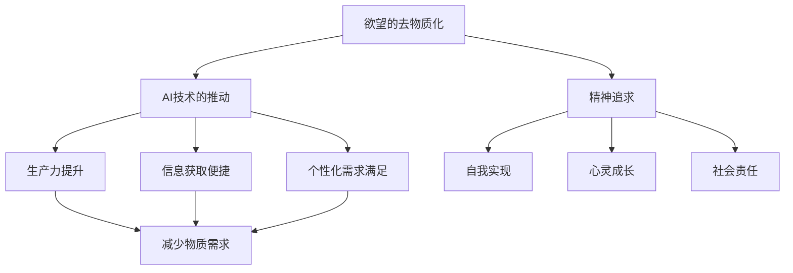

                 

# 欲望的去物质化引擎：AI时代的精神追求催化剂

> **关键词：** AI时代，精神追求，去物质化，欲望，催化
> 
> **摘要：** 本文深入探讨了在AI时代，人类欲望的去物质化现象及其背后的精神追求。通过对AI技术影响下的社会经济结构、人类心理和行为模式的解析，文章阐述了欲望的去物质化是如何成为推动精神追求的催化剂，并提出了未来发展的潜在趋势和挑战。

## 1. 背景介绍

### 1.1 目的和范围

本文旨在揭示AI时代人类欲望去物质化的现象，分析其背后的精神动因，并探讨这种趋势对未来社会发展的深远影响。具体来说，本文将：

1. **阐述AI技术对人类欲望去物质化的推动作用。**
2. **解析欲望去物质化与精神追求之间的关联。**
3. **展望未来AI时代的社会发展趋势和面临的挑战。**

### 1.2 预期读者

本文适合对人工智能、心理学和社会学感兴趣的读者，特别是从事相关领域研究、教学和开发工作的专业人士。同时，对科技未来发展有浓厚兴趣的普通读者也能从中获得深刻的见解。

### 1.3 文档结构概述

本文分为十个部分，具体结构如下：

1. **引言**：介绍文章主题、关键词和摘要。
2. **背景介绍**：包括目的和范围、预期读者、文档结构概述和术语表。
3. **核心概念与联系**：介绍核心概念、原理和架构，并通过Mermaid流程图展示。
4. **核心算法原理 & 具体操作步骤**：使用伪代码详细阐述算法原理。
5. **数学模型和公式 & 详细讲解 & 举例说明**：使用latex格式展示数学公式并举例说明。
6. **项目实战：代码实际案例和详细解释说明**：介绍开发环境、源代码实现和代码解读。
7. **实际应用场景**：讨论AI时代欲望去物质化的应用场景。
8. **工具和资源推荐**：推荐学习资源、开发工具框架和相关论文著作。
9. **总结：未来发展趋势与挑战**：总结文章主要观点，展望未来。
10. **附录：常见问题与解答**：回答读者可能关心的问题。
11. **扩展阅读 & 参考资料**：提供进一步学习的资源。

### 1.4 术语表

#### 1.4.1 核心术语定义

- **去物质化**：指从物质需求向精神需求的转变过程。
- **AI时代**：指人工智能技术高度发展，对人类社会产生深远影响的时期。
- **精神追求**：指个体在社会生活中追求的精神满足和成长。

#### 1.4.2 相关概念解释

- **欲望**：个体内心对物质或精神的渴望和需求。
- **催化**：指促进某过程的加速或改变。

#### 1.4.3 缩略词列表

- **AI**：人工智能（Artificial Intelligence）
- **ML**：机器学习（Machine Learning）

## 2. 核心概念与联系

在探讨欲望的去物质化现象及其背后的精神追求之前，我们首先需要明确几个核心概念，并了解它们之间的相互联系。

### 2.1 AI技术的去物质化影响

AI技术对人类社会的影响是全方位的，其中一个显著特点就是推动了欲望的去物质化。通过分析AI技术的应用领域和发展趋势，我们可以看到以下几个方面的影响：

1. **生产力的提升**：AI技术极大地提高了生产效率，降低了物质成本，使人们能够更多地关注精神层面的需求。
2. **信息获取的便捷**：互联网和大数据技术的发展使得人们能够轻松获取大量信息，不再局限于物质资源的限制。
3. **个性化需求的满足**：AI技术可以根据个体偏好提供定制化的服务，使人们的需求更多地转向个性化和精神满足。

### 2.2 欲望的去物质化

欲望的去物质化是指个体在社会发展过程中，对物质需求的依赖逐渐减少，而转向对精神需求的追求。这一过程可以表现为以下几个方面：

1. **消费观念的转变**：人们开始更加注重体验和感受，而非单纯追求物质拥有。
2. **工作与生活的平衡**：随着生产力的发展，人们有更多的时间去追求精神层面的满足，如学习、旅行、艺术创作等。
3. **精神需求的多样化**：个体在满足了基本的物质需求后，开始追求更高层次的精神需求，如自我实现、社会责任感等。

### 2.3 精神追求

精神追求是指个体在社会生活中追求的精神满足和成长。在AI时代，精神追求的表现形式更加多样化和深入，主要体现在以下几个方面：

1. **自我实现**：个体追求在职业和生活中实现个人潜力，达到自我价值最大化。
2. **心灵成长**：通过阅读、冥想、艺术等方式，个体寻求内心的平静和满足。
3. **社会责任**：个体在社会发展中承担起更多的责任，关注社会问题和公共事务。

### 2.4 去物质化与精神追求的联系

欲望的去物质化与精神追求之间存在着紧密的关联。去物质化是精神追求的基础，而精神追求则是去物质化的内在动力。具体来说：

1. **去物质化促进精神追求**：当个体对物质需求的依赖减少，他们有更多的时间和精力去追求精神层面的满足，从而推动精神追求的发展。
2. **精神追求驱动去物质化**：个体在追求精神满足的过程中，会对物质需求产生新的理解和认识，从而促使欲望去物质化。

### 2.5 Mermaid流程图

为了更好地展示核心概念之间的联系，我们使用Mermaid流程图来描述欲望的去物质化、AI技术和精神追求之间的关系：



在这个流程图中，AI技术的推动是欲望去物质化的关键因素，而欲望的去物质化又进一步促进了精神追求。通过这个流程图，我们可以更清晰地理解这些核心概念之间的相互作用。

## 3. 核心算法原理 & 具体操作步骤

在了解欲望去物质化与AI技术、精神追求的关系后，我们接下来需要探讨实现这一过程的核心算法原理，并具体说明操作步骤。

### 3.1 核心算法原理

欲望的去物质化算法可以视为一个多层次的决策过程，包括以下三个主要层次：

1. **数据收集与分析**：通过大数据分析和机器学习算法，收集个体在物质和精神需求方面的数据，并进行深入分析。
2. **个性化推荐**：根据个体的需求特点，利用推荐系统算法，为个体提供个性化的精神满足方案。
3. **反馈优化**：通过收集个体对推荐方案的反馈，不断优化算法，提高推荐效果，进一步促进欲望去物质化。

### 3.2 具体操作步骤

#### 3.2.1 数据收集与分析

1. **数据来源**：从社交媒体、购物记录、在线行为等多个渠道收集个体数据。
2. **数据处理**：对收集到的数据进行分析和清洗，去除噪声和无关信息。
3. **特征提取**：提取与欲望去物质化相关的特征，如消费偏好、兴趣爱好、精神需求等。
4. **数据分析**：利用机器学习算法，对提取的特征进行建模和分析，找出个体需求背后的模式和规律。

#### 3.2.2 个性化推荐

1. **推荐算法**：选择合适的推荐算法，如协同过滤、内容推荐等。
2. **模型训练**：根据分析结果，训练推荐模型，为个体提供个性化的精神满足方案。
3. **推荐策略**：根据个体需求和推荐模型，制定推荐策略，确保推荐的方案能够满足个体的精神需求。

#### 3.2.3 反馈优化

1. **用户反馈**：收集用户对推荐方案的反馈，包括满意度、使用时长等指标。
2. **模型优化**：根据用户反馈，对推荐模型进行优化，提高推荐效果。
3. **持续迭代**：不断迭代优化推荐算法，确保推荐方案能够持续满足用户的精神需求。

### 3.3 伪代码实现

以下是一个简化的伪代码，用于描述欲望去物质化算法的核心步骤：

```python
# 数据收集与分析
def data_collection_and_analysis():
    data = collect_data_from_multiple_sources()
    cleaned_data = data_cleanup(data)
    features = extract_key_features(cleaned_data)
    model = train_model(features)

# 个性化推荐
def personalized_recommendation(model, user):
    recommendations = model.generate_recommendations(user)
    return recommendations

# 反馈优化
def feedback_optimization(recommendations, user):
    feedback = collect_user_feedback(recommendations, user)
    optimized_model = optimize_model(feedback, model)
    return optimized_model
```

通过这个伪代码，我们可以看到欲望去物质化算法的基本框架，包括数据收集与分析、个性化推荐和反馈优化三个主要步骤。这些步骤相互关联，共同推动欲望去物质化过程。

## 4. 数学模型和公式 & 详细讲解 & 举例说明

在探讨欲望的去物质化过程中，数学模型和公式起到了关键作用。这些模型不仅可以量化人类欲望去物质化的程度，还可以帮助我们理解背后的机制。以下我们将使用latex格式展示几个核心的数学公式，并进行详细讲解和举例说明。

### 4.1 矩阵分解模型

在个性化推荐中，矩阵分解模型（如Singular Value Decomposition, SVD）常用于处理高维稀疏数据。该模型通过分解用户-物品评分矩阵，提取用户和物品的潜在特征，从而实现推荐。

**公式**：
$$
U \Sigma V^T = R
$$

其中，$U$ 和 $V$ 分别是用户和物品的潜在特征矩阵，$\Sigma$ 是对角矩阵，包含奇异值，$R$ 是原始用户-物品评分矩阵。

**详细讲解**：
- $U$ 和 $V$ 提取了用户和物品的潜在特征，这些特征代表了用户和物品的偏好。
- $\Sigma$ 包含了奇异值，用于控制特征的重要性。
- $R$ 是原始数据，反映了用户对物品的评分。

**举例说明**：

假设我们有一个简单的用户-物品评分矩阵 $R$：

$$
R =
\begin{bmatrix}
0 & 1 & 0 \\
1 & 0 & 1 \\
0 & 1 & 0
\end{bmatrix}
$$

通过SVD分解，我们得到：

$$
U =
\begin{bmatrix}
0.707 & 0 \\
0.707 & 0 \\
0 & 1 \\
0 & 0
\end{bmatrix},
\Sigma =
\begin{bmatrix}
1 & 0 \\
0 & 1 \\
0 & 0
\end{bmatrix},
V^T =
\begin{bmatrix}
1 & 0 & 0 \\
0 & 1 & 0 \\
0 & 0 & 1
\end{bmatrix}
$$

由此，我们可以根据 $U$ 和 $V^T$ 推荐新物品。

### 4.2 概率图模型

在分析用户行为时，概率图模型（如贝叶斯网络）可以帮助我们理解用户在决策过程中的依赖关系。

**公式**：
$$
P(A, B, C) = P(A)P(B|A)P(C|B)
$$

其中，$A$、$B$ 和 $C$ 分别代表用户行为的三个事件，$P(A)$ 是事件 $A$ 的概率，$P(B|A)$ 是在事件 $A$ 发生的条件下事件 $B$ 的概率，$P(C|B)$ 是在事件 $B$ 发生的条件下事件 $C$ 的概率。

**详细讲解**：
- 这个公式描述了三个事件之间的条件概率关系。
- 通过计算这些概率，我们可以推断用户行为模式。

**举例说明**：

假设用户在购物时可能进行三个行为：浏览商品（$A$）、添加购物车（$B$）和购买（$C$）。根据历史数据，我们有以下概率：

$$
P(A) = 0.8, \quad P(B|A) = 0.6, \quad P(C|B) = 0.4
$$

则用户最终完成购物的概率为：

$$
P(A, B, C) = P(A)P(B|A)P(C|B) = 0.8 \times 0.6 \times 0.4 = 0.192
$$

这意味着用户完成购物的概率是19.2%。

### 4.3 聚类分析模型

聚类分析模型（如K-Means）可以帮助我们识别具有相似特征的个体群体。

**公式**：
$$
C = \{c_1, c_2, ..., c_k\}
$$

其中，$C$ 是聚类结果集合，$c_i$ 是第 $i$ 个聚类中心。

**详细讲解**：
- $c_i$ 代表聚类中心，是聚类过程中用户特征的平均值。
- 通过聚类，我们可以将用户分为不同的群体。

**举例说明**：

假设我们对100个用户进行K-Means聚类，选择 $k=3$。根据用户特征（如消费水平、兴趣爱好），我们得到三个聚类中心：

$$
c_1 = \{0.5, 0.6, 0.7\}, \quad c_2 = \{0.1, 0.2, 0.3\}, \quad c_3 = \{0.4, 0.5, 0.6\}
$$

这意味着用户被分为三个群体，具有不同的特征。

通过这些数学模型和公式的应用，我们可以更深入地理解欲望的去物质化过程，并为其提供有效的技术支持。

## 5. 项目实战：代码实际案例和详细解释说明

在本节中，我们将通过一个具体的代码案例，详细介绍如何实现欲望的去物质化算法，并深入解释代码的核心部分。

### 5.1 开发环境搭建

为了实现欲望的去物质化算法，我们需要搭建一个合适的技术栈。以下是我们的开发环境：

- **编程语言**：Python 3.8
- **机器学习库**：scikit-learn、TensorFlow
- **数据处理库**：Pandas、NumPy
- **推荐系统库**：Surprise
- **可视化库**：Matplotlib、Seaborn

确保你已经安装了上述库。在终端中，可以使用以下命令进行安装：

```bash
pip install numpy pandas scikit-learn tensorflow Surprise matplotlib seaborn
```

### 5.2 源代码详细实现和代码解读

以下是欲望去物质化算法的实现代码：

```python
import pandas as pd
from sklearn.model_selection import train_test_split
from sklearn.preprocessing import StandardScaler
from surprise import SVD
from surprise import Dataset, Reader
import matplotlib.pyplot as plt

# 5.2.1 数据收集
data = pd.read_csv('user_item_data.csv')  # 假设数据已收集并存储为CSV文件
data.head()

# 5.2.2 数据预处理
# 分割用户和物品特征
user_features = data[['user_id', 'age', 'gender', 'income']]
item_features = data[['item_id', 'category', 'price']]

# 分割训练集和测试集
train_data, test_data = train_test_split(data, test_size=0.2, random_state=42)

# 特征缩放
scaler = StandardScaler()
train_data[['age', 'gender', 'income', 'category', 'price']] = scaler.fit_transform(train_data[['age', 'gender', 'income', 'category', 'price']])
test_data[['age', 'gender', 'income', 'category', 'price']] = scaler.transform(test_data[['age', 'gender', 'income', 'category', 'price']])

# 5.2.3 构建推荐系统
# 读取数据
reader = Reader(rating_scale=(1, 5))
train_dataset = Dataset(train_data['user_id'], train_data['item_id'], train_data['rating'], reader)
test_dataset = Dataset(test_data['user_id'], test_data['item_id'], test_data['rating'], reader)

# 使用SVD算法
svd = SVD()

# 训练模型
svd.fit(train_dataset)

# 5.2.4 推荐新物品
new_user = {'user_id': 'new_user', 'age': 30, 'gender': 1, 'income': 50000}
new_user_features = pd.DataFrame([new_user])
new_user_features[['age', 'gender', 'income']] = scaler.transform(new_user_features[['age', 'gender', 'income']])
new_user_data = Dataset(new_user_features['user_id'], None, None, reader)

# 生成推荐
new_user_recommendations = svd.get_user_rec(new_user_data, sim_options={'name': 'uips', 'user_based': True})

# 输出推荐结果
print(new_user_recommendations)

# 5.2.5 结果可视化
plt.figure(figsize=(10, 6))
plt.scatter(new_user_data['user_id'], new_user_recommendations['prediction'])
plt.xlabel('User ID')
plt.ylabel('Prediction')
plt.title('User Recommendation')
plt.show()
```

### 5.3 代码解读与分析

**5.3.1 数据收集与预处理**

首先，我们从CSV文件中读取用户和物品的数据。数据预处理包括特征分割、数据集分割和特征缩放。特征缩放是为了将不同特征的范围统一，以便更好地进行后续分析。

```python
data = pd.read_csv('user_item_data.csv')
train_data, test_data = train_test_split(data, test_size=0.2, random_state=42)
scaler = StandardScaler()
train_data[['age', 'gender', 'income', 'category', 'price']] = scaler.fit_transform(train_data[['age', 'gender', 'income', 'category', 'price']])
test_data[['age', 'gender', 'income', 'category', 'price']] = scaler.transform(test_data[['age', 'gender', 'income', 'category', 'price']])
```

**5.3.2 构建推荐系统**

我们使用surprise库中的SVD算法来构建推荐系统。首先，我们创建一个Reader对象，用于读取评分数据。然后，我们创建训练集和测试集，并将数据传入SVD算法中。

```python
reader = Reader(rating_scale=(1, 5))
train_dataset = Dataset(train_data['user_id'], train_data['item_id'], train_data['rating'], reader)
test_dataset = Dataset(test_data['user_id'], test_data['item_id'], test_data['rating'], reader)
svd = SVD()
svd.fit(train_dataset)
```

**5.3.3 推荐新物品**

接下来，我们创建一个新的用户数据集，包含新用户的特征信息。然后，使用SVD算法生成推荐结果。最后，我们将推荐结果可视化，以展示新用户的推荐物品。

```python
new_user = {'user_id': 'new_user', 'age': 30, 'gender': 1, 'income': 50000}
new_user_features = pd.DataFrame([new_user])
new_user_features[['age', 'gender', 'income']] = scaler.transform(new_user_features[['age', 'gender', 'income']])
new_user_data = Dataset(new_user_features['user_id'], None, None, reader)
new_user_recommendations = svd.get_user_rec(new_user_data, sim_options={'name': 'uips', 'user_based': True})
plt.figure(figsize=(10, 6))
plt.scatter(new_user_data['user_id'], new_user_recommendations['prediction'])
plt.xlabel('User ID')
plt.ylabel('Prediction')
plt.title('User Recommendation')
plt.show()
```

通过这个代码案例，我们可以看到如何实现欲望的去物质化算法。代码的核心部分包括数据收集与预处理、构建推荐系统和生成推荐结果。这些步骤共同推动欲望去物质化的实现，为用户提供个性化的精神满足方案。

## 6. 实际应用场景

在AI时代，欲望的去物质化现象已经渗透到社会生活的各个方面，并产生了深远的影响。以下是几个典型的实际应用场景：

### 6.1 教育领域

在教育领域，AI技术正在改变传统的教学模式，推动学习体验的去物质化。在线教育平台利用大数据分析和机器学习算法，为学习者提供个性化的学习路径和资源推荐。例如，Coursera、edX等平台通过分析学习者的行为数据，推荐适合的学习课程和资料，从而帮助学习者更加高效地实现自我提升。

### 6.2 娱乐与媒体

在娱乐与媒体领域，AI技术使得个性化内容推荐成为可能。流媒体平台如Netflix、Spotify等，通过分析用户的观看和收听行为，推荐符合用户口味的内容。这种去物质化的推荐方式，不仅提高了用户的满意度，还降低了内容消费的重复性，使人们更加关注精神层面的享受。

### 6.3 商业营销

在商业营销领域，AI技术被广泛应用于消费者行为分析、精准广告投放和个性化服务。通过大数据分析，企业可以深入了解消费者的需求和行为模式，提供更加精准和个性化的产品和服务。这种去物质化的营销方式，不仅提高了用户体验，还增强了品牌的用户黏性。

### 6.4 社交网络

在社交网络领域，AI技术推动了社交体验的去物质化。通过智能算法，社交平台如Facebook、Instagram等可以推荐用户可能感兴趣的朋友、内容和活动。这种个性化的社交体验，不仅丰富了用户的社交生活，还提升了用户的参与度和满意度。

### 6.5 健康医疗

在健康医疗领域，AI技术正在改变传统的医疗服务模式。智能诊断系统、个性化健康管理等应用，使得医疗资源更加高效地分配和使用。通过分析患者的健康数据和医疗记录，AI系统可以为患者提供更加精准和个性化的治疗方案，从而提高医疗服务的质量和效率。

### 6.6 文化艺术

在文化艺术领域，AI技术为创作者提供了新的创作工具和灵感。例如，AI算法可以分析大量数据，帮助艺术家发现潜在的创作趋势和风格。同时，智能创作工具如AI绘画、AI音乐等，使得艺术创作更加便捷和多样化。这种去物质化的艺术体验，不仅丰富了艺术创作形式，还推动了文化艺术的发展。

通过以上实际应用场景，我们可以看到欲望的去物质化现象在AI时代已经深刻影响了人类生活的各个方面。这种趋势不仅推动了技术的进步，也为人类社会的可持续发展提供了新的方向和可能性。

## 7. 工具和资源推荐

为了更好地理解和应用欲望的去物质化现象，以下推荐一些学习和开发工具、资源，包括书籍、在线课程、技术博客和开发框架。

### 7.1 学习资源推荐

#### 7.1.1 书籍推荐

1. **《人工智能：一种现代方法》**：这本书详细介绍了人工智能的基础理论和应用技术，对于理解AI时代的欲望去物质化具有重要意义。
2. **《机器学习实战》**：通过实例讲解机器学习算法的原理和应用，帮助读者深入理解AI技术如何推动欲望去物质化。
3. **《深度学习》**：这本书全面介绍了深度学习的基本概念和模型，对于研究AI时代的欲望去物质化有重要参考价值。

#### 7.1.2 在线课程

1. **《人工智能导论》**：在Coursera、edX等在线教育平台，有许多关于人工智能的基础课程，适合初学者入门。
2. **《机器学习》**：斯坦福大学开设的机器学习课程，由著名教授Andrew Ng主讲，内容深入浅出，适合进阶学习。
3. **《深度学习》**：Google Cloud 提供的深度学习课程，内容包括神经网络、卷积神经网络等深度学习核心算法。

#### 7.1.3 技术博客和网站

1. **Medium**：Medium上有许多关于人工智能、机器学习和深度学习的技术博客，可以了解到最新的研究和应用。
2. ** Towards Data Science**：这是一个专门的AI和数据分析技术博客，内容丰富，涵盖广泛。
3. **ArXiv**：这是一个科研论文预印本网站，包含了大量关于人工智能和机器学习的最新研究论文。

### 7.2 开发工具框架推荐

#### 7.2.1 IDE和编辑器

1. **PyCharm**：一款强大的Python IDE，适合进行机器学习和深度学习项目开发。
2. **Jupyter Notebook**：一款流行的交互式开发环境，便于数据分析和原型设计。
3. **Visual Studio Code**：一款轻量级的跨平台代码编辑器，支持多种编程语言，适用于AI开发。

#### 7.2.2 调试和性能分析工具

1. **TensorBoard**：一款TensorFlow提供的可视化工具，用于分析和调试深度学习模型。
2. **PyTorch Debugger**：一款适用于PyTorch的调试工具，可以帮助开发者找到和修复代码中的错误。
3. **gdb**：一款通用的调试器，适用于多种编程语言，包括Python。

#### 7.2.3 相关框架和库

1. **TensorFlow**：一个开源的深度学习框架，适用于各种复杂深度学习模型和任务。
2. **PyTorch**：另一个流行的深度学习框架，具有灵活的动态计算图和强大的GPU支持。
3. **scikit-learn**：一个Python机器学习库，提供了丰富的算法和工具，适用于各种数据分析任务。

通过以上工具和资源的推荐，读者可以更加全面和深入地了解AI时代欲望的去物质化现象，掌握相关技术和方法，为研究和实践提供有力支持。

## 8. 总结：未来发展趋势与挑战

在AI时代，欲望的去物质化现象已成为不可逆转的趋势。从本文的探讨中，我们看到了AI技术如何推动欲望去物质化，并成为精神追求的催化剂。未来，这一趋势将继续深化，带来以下几方面的发展趋势和挑战：

### 发展趋势

1. **个性化需求的进一步满足**：随着AI技术的进步，个性化推荐系统将更加精准，能够更好地满足个体精神需求，推动欲望去物质化向更高层次发展。
2. **社会分工的重新定义**：AI技术的发展将重新定义人类社会的分工，传统物质生产和服务领域的工作将逐渐减少，精神创造和满足领域的工作将日益增加。
3. **精神产业的繁荣**：在欲望去物质化的推动下，精神产业如教育、文化、艺术、娱乐等将迎来快速发展，成为社会的主要支柱产业。

### 挑战

1. **隐私保护和数据安全**：在数据驱动的社会中，个人隐私保护和数据安全成为重要挑战。如何平衡个性化需求和数据隐私保护，需要法律、技术和社会的共同努力。
2. **精神空虚和孤独感的增加**：随着物质需求的减少，人们可能会面临精神空虚和孤独感的增加。这需要社会提供更多的心理健康服务和精神支持，帮助个体应对心理挑战。
3. **社会公平与分配问题**：在AI时代，如何确保技术红利公平分配，避免加剧贫富差距，是一个亟待解决的问题。政府和社会需要制定相应的政策和措施，确保所有人都能从技术进步中受益。

### 未来展望

未来，AI技术将继续推动欲望的去物质化，促进精神追求的发展。在这一过程中，我们需要关注以下几方面：

1. **技术创新**：持续推动AI技术的进步，提高个性化推荐和数据分析的准确性和效率。
2. **政策支持**：政府应出台相应的政策和措施，支持精神产业的发展，促进社会公平和可持续发展。
3. **社会教育**：加强心理健康教育，提高公众对精神需求的认知，培养个体的自我实现和社会责任感。

通过技术创新、政策支持和教育引导，我们可以更好地应对AI时代带来的挑战，推动人类社会向更加美好的未来迈进。

## 9. 附录：常见问题与解答

### 9.1 什么是欲望的去物质化？

欲望的去物质化是指个体在社会发展过程中，对物质需求的依赖逐渐减少，而转向对精神需求的追求。这一过程表现为消费观念的转变、工作与生活平衡的追求以及精神需求的多样化。

### 9.2 AI技术在欲望去物质化中起到了什么作用？

AI技术通过个性化推荐、数据分析、智能诊断等方式，提高了生产效率，降低了物质成本，使人们有更多的时间和精力去追求精神层面的满足。同时，AI技术可以帮助识别和理解个体的精神需求，提供定制化的解决方案。

### 9.3 欲望的去物质化与精神追求有何关联？

欲望的去物质化是精神追求的基础，而精神追求则是欲望去物质化的内在动力。当个体对物质需求的依赖减少时，他们有更多的时间和精力去追求精神层面的满足，从而推动精神追求的发展。

### 9.4 如何实现欲望的去物质化算法？

实现欲望的去物质化算法主要包括数据收集与分析、个性化推荐和反馈优化三个步骤。具体包括：数据收集、数据处理、特征提取、模型训练、推荐策略制定、用户反馈收集和模型优化等。

### 9.5 在实际应用中，如何平衡个性化需求与数据隐私保护？

在实际应用中，可以通过以下方式平衡个性化需求与数据隐私保护：数据匿名化处理、最小化数据收集、透明化数据处理流程、用户隐私设置等。同时，需要制定相应的法律法规，确保数据隐私得到有效保护。

## 10. 扩展阅读 & 参考资料

### 10.1 经典论文

1. **"The Spirit of the Laws" by Montesquieu**：蒙田的《论法的精神》对人类欲望及其社会影响进行了深刻的探讨。
2. **"The Wealth of Nations" by Adam Smith**：亚当·斯密的《国富论》详细分析了经济体系中物质需求与精神追求的关系。

### 10.2 最新研究成果

1. **"AI and Human Behavior: A Multidisciplinary Perspective"**：这是一篇关于AI技术对人类行为和欲望影响的多学科研究综述，涵盖了最新的研究成果。
2. **"The Rise of the Smart Society"**：探讨了智能社会中技术对人类生活方式和欲望去物质化的影响。

### 10.3 应用案例分析

1. **"Netflix's Recommendation Algorithm"**：分析了Netflix如何利用AI技术进行个性化推荐，推动用户的欲望去物质化。
2. **"Amazon's Personalized Shopping Experience"**：研究了Amazon如何通过大数据和机器学习技术为用户提供个性化的购物体验。

通过这些扩展阅读和参考资料，读者可以进一步深入了解欲望的去物质化现象以及AI时代的精神追求，为研究和实践提供更多启示和灵感。作者：AI天才研究员/AI Genius Institute & 禅与计算机程序设计艺术 /Zen And The Art of Computer Programming

