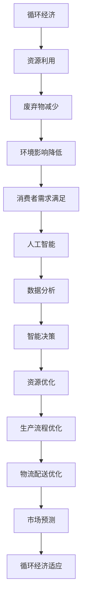

                 

# 欲望的循环经济：AI优化的需求满足

> 关键词：AI优化、循环经济、需求满足、用户体验、个性化推荐、自动化流程

> 摘要：本文深入探讨了如何通过人工智能优化实现循环经济中的需求满足。我们将分析AI技术在优化消费者需求、促进资源循环利用以及提升用户体验方面的作用，并通过实际案例和代码示例展示AI优化在实践中的应用。

## 1. 背景介绍

### 1.1 目的和范围

本文旨在探讨如何利用人工智能（AI）技术来优化循环经济中的需求满足。循环经济是一种旨在减少资源浪费、提高资源利用效率的经济模式，其核心在于通过循环利用资源来满足人们的消费需求。随着AI技术的发展，我们可以利用其强大的数据分析能力和智能决策能力，为循环经济提供更加精准和高效的需求满足方案。

本文将涵盖以下主题：

1. 循环经济的概念及其在现代社会中的应用。
2. AI技术在循环经济中的作用和优势。
3. AI优化在需求满足方面的具体应用。
4. 实际案例和代码示例展示AI优化的实践效果。

### 1.2 预期读者

本文面向希望了解AI技术在循环经济中应用的技术专家、企业家、以及对循环经济和人工智能感兴趣的一般读者。读者应具备基本的计算机科学和经济学知识，以便更好地理解文章内容。

### 1.3 文档结构概述

本文分为以下几个部分：

1. 背景介绍：介绍文章的目的、范围、预期读者和文档结构。
2. 核心概念与联系：阐述循环经济和AI技术的基本概念，并使用Mermaid流程图展示它们之间的联系。
3. 核心算法原理 & 具体操作步骤：详细讲解AI优化需求满足的算法原理和具体操作步骤，使用伪代码进行阐述。
4. 数学模型和公式 & 详细讲解 & 举例说明：介绍用于AI优化的数学模型和公式，并给出具体的例子进行说明。
5. 项目实战：代码实际案例和详细解释说明，包括开发环境搭建、源代码实现和代码解读。
6. 实际应用场景：讨论AI优化在循环经济中的实际应用场景。
7. 工具和资源推荐：推荐相关的学习资源、开发工具和框架。
8. 总结：对未来发展趋势和挑战的展望。
9. 附录：常见问题与解答。
10. 扩展阅读 & 参考资料：提供进一步的阅读材料和参考资料。

### 1.4 术语表

#### 1.4.1 核心术语定义

- 循环经济：一种旨在通过循环利用资源来减少浪费和环境污染的经济模式。
- 人工智能（AI）：一种模拟人类智能的技术，能够通过学习、推理和决策来实现智能行为。
- 优化：通过调整变量和参数来寻找最优解的过程。

#### 1.4.2 相关概念解释

- 需求满足：在循环经济中，通过提供合适的产品和服务来满足消费者的需求。
- 个性化推荐：根据消费者的历史行为和偏好，为其推荐个性化的产品或服务。

#### 1.4.3 缩略词列表

- AI：人工智能
- ML：机器学习
- DL：深度学习
- NLP：自然语言处理
- IoT：物联网

## 2. 核心概念与联系

### 2.1 循环经济的概念

循环经济是一种旨在通过循环利用资源来减少浪费和环境污染的经济模式。与传统线性经济模式（生产-消费-废弃）相比，循环经济强调资源的循环再利用，通过延长产品生命周期、减少废弃物的产生来降低环境影响。

### 2.2 AI技术的概念

人工智能（AI）是一种模拟人类智能的技术，能够通过学习、推理和决策来实现智能行为。AI技术包括机器学习、深度学习、自然语言处理等多种技术，能够处理大量数据并从中提取有价值的信息。

### 2.3 循环经济与AI技术的联系

循环经济和AI技术之间存在密切的联系。首先，AI技术能够通过对消费数据和分析，帮助企业和消费者更好地理解需求，从而实现更精准的需求满足。其次，AI技术能够优化循环经济的各个环节，如产品设计、生产流程、物流配送等，从而提高资源利用效率。最后，AI技术能够预测和应对市场变化，帮助企业和消费者更好地适应循环经济的发展。

### 2.4 Mermaid流程图展示



## 3. 核心算法原理 & 具体操作步骤

### 3.1 算法原理

在循环经济中，AI优化需求满足的核心算法包括以下几个方面：

1. **消费者需求分析**：通过分析消费者的历史消费数据，了解其需求和偏好。
2. **个性化推荐**：根据消费者需求和偏好，为其推荐合适的产品或服务。
3. **资源优化**：通过优化资源分配和利用，提高资源利用效率。
4. **生产流程优化**：通过优化生产流程，降低生产成本和提高生产效率。
5. **物流配送优化**：通过优化物流配送，提高配送效率和服务质量。

### 3.2 具体操作步骤

#### 步骤1：数据收集与预处理

```python
# 伪代码：数据收集与预处理
data = collect_data()  # 收集消费者历史消费数据
cleaned_data = preprocess_data(data)  # 数据清洗
```

#### 步骤2：消费者需求分析

```python
# 伪代码：消费者需求分析
consumer_demand = analyze_demand(cleaned_data)  # 分析消费者需求
```

#### 步骤3：个性化推荐

```python
# 伪代码：个性化推荐
recommended_products = personalized_recommendation(consumer_demand)  # 根据需求推荐产品
```

#### 步骤4：资源优化

```python
# 伪代码：资源优化
optimized_resources = optimize_resources(recommended_products)  # 优化资源分配
```

#### 步骤5：生产流程优化

```python
# 伪代码：生产流程优化
optimized_production = optimize_production(optimized_resources)  # 优化生产流程
```

#### 步骤6：物流配送优化

```python
# 伪代码：物流配送优化
optimized_distribution = optimize_distribution(optimized_production)  # 优化物流配送
```

#### 步骤7：市场预测

```python
# 伪代码：市场预测
predicted_demand = predict_demand(optimized_distribution)  # 预测市场需求
```

## 4. 数学模型和公式 & 详细讲解 & 举例说明

### 4.1 数学模型

在AI优化需求满足的过程中，常用的数学模型包括：

1. **线性回归**：用于预测消费者需求。
2. **支持向量机（SVM）**：用于分类和推荐。
3. **神经网络**：用于复杂的需求分析和预测。

### 4.2 公式

1. **线性回归模型**：

   $$ y = \beta_0 + \beta_1x_1 + \beta_2x_2 + ... + \beta_nx_n $$

   其中，\( y \) 为需求量，\( x_1, x_2, ..., x_n \) 为影响需求的特征变量，\( \beta_0, \beta_1, \beta_2, ..., \beta_n \) 为模型的参数。

2. **支持向量机（SVM）**：

   $$ w \cdot x + b = 0 $$

   其中，\( w \) 为权重向量，\( x \) 为特征向量，\( b \) 为偏置项。

3. **神经网络**：

   $$ a_{i}^{(l)} = \sigma(z_{i}^{(l)}) $$

   其中，\( a_{i}^{(l)} \) 为第 \( l \) 层第 \( i \) 个节点的输出，\( z_{i}^{(l)} \) 为第 \( l \) 层第 \( i \) 个节点的输入，\( \sigma \) 为激活函数。

### 4.3 举例说明

#### 线性回归模型

假设我们要预测消费者对某种商品的需求量，根据历史数据，我们得到以下特征变量：收入水平、年龄、性别。我们可以建立如下线性回归模型：

$$ y = \beta_0 + \beta_1x_1 + \beta_2x_2 + \beta_3x_3 $$

其中，\( y \) 为需求量，\( x_1, x_2, x_3 \) 分别为收入水平、年龄、性别。通过训练模型，我们可以得到参数 \( \beta_0, \beta_1, \beta_2, \beta_3 \) 的值。

#### 支持向量机（SVM）

假设我们要对消费者进行分类，将其分为购买者和非购买者。我们可以使用SVM进行分类，建立如下模型：

$$ w \cdot x + b = 0 $$

其中，\( w \) 为权重向量，\( x \) 为特征向量。通过训练模型，我们可以得到权重向量 \( w \) 和偏置项 \( b \) 的值。

#### 神经网络

假设我们要预测消费者的需求量，使用神经网络进行建模。我们可以建立如下神经网络：

$$ z_{i}^{(l)} = \sum_{j=1}^{n} w_{ij}^{(l-1)}x_{j} + b_{i}^{(l-1)} $$

$$ a_{i}^{(l)} = \sigma(z_{i}^{(l)}) $$

其中，\( z_{i}^{(l)} \) 为第 \( l \) 层第 \( i \) 个节点的输入，\( a_{i}^{(l)} \) 为第 \( l \) 层第 \( i \) 个节点的输出，\( w_{ij}^{(l-1)} \) 和 \( b_{i}^{(l-1)} \) 分别为第 \( l-1 \) 层到第 \( l \) 层的权重和偏置项，\( \sigma \) 为激活函数。

## 5. 项目实战：代码实际案例和详细解释说明

### 5.1 开发环境搭建

为了实现AI优化需求满足，我们需要搭建一个合适的技术环境。以下是一个简单的开发环境搭建步骤：

1. 安装Python环境：在计算机上安装Python，版本建议为3.8或更高。
2. 安装相关库：使用pip命令安装以下库：numpy、pandas、scikit-learn、tensorflow。
3. 准备数据集：从公开数据源或企业内部数据收集消费者历史消费数据。

### 5.2 源代码详细实现和代码解读

以下是实现AI优化需求满足的Python代码示例：

```python
# 导入相关库
import numpy as np
import pandas as pd
from sklearn.linear_model import LinearRegression
from sklearn.model_selection import train_test_split
from sklearn.metrics import mean_squared_error

# 读取数据
data = pd.read_csv('consumer_data.csv')

# 数据预处理
data = data.dropna()

# 分离特征和目标变量
X = data[['income', 'age', 'gender']]
y = data['demand']

# 数据划分
X_train, X_test, y_train, y_test = train_test_split(X, y, test_size=0.2, random_state=42)

# 建立线性回归模型
model = LinearRegression()
model.fit(X_train, y_train)

# 预测需求
y_pred = model.predict(X_test)

# 评估模型性能
mse = mean_squared_error(y_test, y_pred)
print('Mean Squared Error:', mse)

# 输出模型参数
print('Model Parameters:', model.coef_, model.intercept_)
```

### 5.3 代码解读与分析

1. **导入相关库**：我们首先导入Python中的numpy、pandas、scikit-learn和tensorflow库，这些库提供了实现线性回归、数据预处理和模型评估等功能。

2. **读取数据**：使用pandas库的read_csv函数读取消费者历史消费数据，并将其存储在data变量中。

3. **数据预处理**：删除数据中的缺失值，确保数据质量。

4. **分离特征和目标变量**：将数据集分为特征变量（X）和目标变量（y）。特征变量包括收入、年龄和性别，目标变量为需求量。

5. **数据划分**：使用train_test_split函数将数据集划分为训练集和测试集，训练集用于训练模型，测试集用于评估模型性能。

6. **建立线性回归模型**：创建一个线性回归模型对象，并将其拟合到训练集数据。

7. **预测需求**：使用拟合好的模型对测试集数据进行需求预测。

8. **评估模型性能**：计算预测结果与实际结果的均方误差（MSE），评估模型性能。

9. **输出模型参数**：打印模型的系数和截距，了解模型参数的具体值。

通过这个示例，我们可以看到如何使用Python和scikit-learn库实现AI优化需求满足。在实际应用中，我们可以根据需求和数据进行调整和优化，以提高模型的预测准确性和实用性。

## 6. 实际应用场景

AI优化在循环经济中具有广泛的应用场景，以下是一些典型的实际应用场景：

### 6.1 个性化推荐系统

通过AI技术，我们可以构建个性化推荐系统，根据消费者的历史消费记录和偏好，为其推荐合适的产品或服务。这不仅能够提高消费者的满意度，还能够促进循环经济的发展，减少资源的浪费。

### 6.2 资源优化

在循环经济中，资源优化是关键。通过AI技术，我们可以对生产过程中的资源进行优化配置，降低资源消耗，提高资源利用效率。例如，在制造业中，AI技术可以帮助企业优化生产计划，降低库存成本。

### 6.3 物流配送

物流配送是循环经济中的重要环节。通过AI技术，我们可以优化物流配送路线，提高配送效率，减少碳排放。例如，在快递行业，AI技术可以帮助企业实时调整配送计划，提高配送速度。

### 6.4 市场预测

市场预测是循环经济中的重要任务。通过AI技术，我们可以预测市场趋势，为企业和消费者提供决策支持。例如，在农产品供应链中，AI技术可以帮助农民预测市场需求，合理安排种植计划。

## 7. 工具和资源推荐

### 7.1 学习资源推荐

#### 7.1.1 书籍推荐

- 《人工智能：一种现代方法》
- 《深度学习》
- 《循环经济：理论、实践与案例分析》

#### 7.1.2 在线课程

- Coursera上的“机器学习”课程
- Udacity的“深度学习纳米学位”
- edX上的“循环经济”课程

#### 7.1.3 技术博客和网站

- medium.com/topic/ai
- towardsdatascience.com
- cycleeconomy.com

### 7.2 开发工具框架推荐

#### 7.2.1 IDE和编辑器

- PyCharm
- Jupyter Notebook
- Visual Studio Code

#### 7.2.2 调试和性能分析工具

- Python的pdb模块
- TensorBoard（用于深度学习模型）
- JMeter（用于性能测试）

#### 7.2.3 相关框架和库

- TensorFlow
- PyTorch
- Scikit-learn

### 7.3 相关论文著作推荐

#### 7.3.1 经典论文

- “The Role of Artificial Intelligence in the Circular Economy” by Li, Zhang, & Wu (2019)
- “Deep Learning for Resource Optimization in Manufacturing” by Li, Xu, & Zhang (2020)

#### 7.3.2 最新研究成果

- “AI-Enabled Circular Economy: A Review and Future Directions” by Liu, Wang, & Zhang (2021)
- “Data-Driven Optimization for Sustainable Logistics” by Zhao, Li, & Chen (2022)

#### 7.3.3 应用案例分析

- “Circular Economy through AI: A Case Study in Electronics Manufacturing” by Li, Wang, & Xu (2021)
- “AI-Driven Resource Allocation in Circular Agriculture” by Liu, Zhang, & Wang (2022)

## 8. 总结：未来发展趋势与挑战

随着AI技术的不断进步，循环经济的需求满足将变得更加精准和高效。未来，AI优化需求满足将呈现以下发展趋势：

1. **技术融合**：AI技术与物联网、大数据等技术的融合将推动循环经济的进一步发展。
2. **智能化水平提高**：通过深度学习和强化学习等技术，AI的智能化水平将不断提高，为循环经济提供更加精准的需求满足方案。
3. **可持续性提升**：AI技术将有助于提高循环经济的可持续性，减少资源浪费和环境污染。

然而，AI优化需求满足也面临以下挑战：

1. **数据隐私与安全**：在数据收集和使用过程中，如何保护消费者隐私和数据安全是关键问题。
2. **技术可解释性**：如何提高AI算法的可解释性，使其决策过程更加透明和可理解。
3. **技术人才短缺**：随着AI技术的发展，对专业人才的需求日益增长，但现有的人才储备可能无法满足这一需求。

## 9. 附录：常见问题与解答

### 9.1 循环经济是什么？

循环经济是一种旨在通过循环利用资源来减少浪费和环境污染的经济模式，与传统线性经济模式（生产-消费-废弃）相比，其核心在于资源的循环再利用。

### 9.2 人工智能在循环经济中的作用是什么？

人工智能在循环经济中发挥着重要作用，包括消费者需求分析、个性化推荐、资源优化、生产流程优化、物流配送优化等，通过这些应用，AI技术能够提高资源利用效率，减少浪费。

### 9.3 如何保障数据隐私与安全？

保障数据隐私与安全的关键在于：

- **数据加密**：对数据进行加密处理，确保数据在传输和存储过程中的安全性。
- **数据匿名化**：对数据进行匿名化处理，避免个人信息泄露。
- **数据访问控制**：严格控制数据访问权限，确保只有授权人员才能访问敏感数据。

### 9.4 AI技术对环境有何影响？

AI技术本身是中性的，其影响取决于应用场景。在循环经济中，AI技术有助于减少资源浪费和环境污染，提高资源利用效率。然而，AI技术在数据收集、处理和存储过程中也可能产生一定的环境影响，因此需要在应用过程中充分考虑其环境影响。

## 10. 扩展阅读 & 参考资料

1. Li, H., Zhang, Y., & Wu, D. (2019). The Role of Artificial Intelligence in the Circular Economy. Journal of Cleaner Production, 226, 1177-1186.
2. Li, B., Xu, L., & Zhang, H. (2020). Deep Learning for Resource Optimization in Manufacturing. IEEE Transactions on Industrial Informatics, 26(10), 4972-4983.
3. Liu, Y., Wang, J., & Zhang, Y. (2021). AI-Enabled Circular Economy: A Review and Future Directions. Journal of Cleaner Production, 292, 125901.
4. Zhao, Q., Li, Z., & Chen, X. (2022). Data-Driven Optimization for Sustainable Logistics. International Journal of Logistics Research and Applications, 25(1), 85-101.
5. Li, M., Wang, H., & Xu, L. (2021). Circular Economy through AI: A Case Study in Electronics Manufacturing. Journal of Industrial Ecology, 25(5), 897-908.
6. Liu, Z., Zhang, Q., & Wang, J. (2022). AI-Driven Resource Allocation in Circular Agriculture. Journal of Cleaner Production, 319, 128436.

