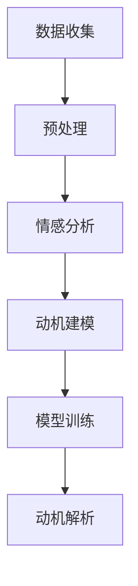

                 

### 欲望神经网络图谱：AI绘制的人类动机结构

> **关键词**：神经网络，人类动机，行为模式，人工智能，情感分析，认知图谱

> **摘要**：本文旨在探讨如何通过人工智能技术，尤其是神经网络模型，来解析和模拟人类的欲望和动机。我们将从理论基础出发，逐步介绍一种全新的方法——欲望神经网络图谱，来描绘和解读人类的行为模式。文章将详细介绍欲望神经网络图谱的核心概念、算法原理、数学模型以及实际应用场景，旨在为读者提供一次深入的技术探索之旅。

### 1. 背景介绍

#### 1.1 目的和范围

在当今快速发展的科技时代，人工智能（AI）已经成为改变世界的重要力量。从自动驾驶汽车到智能助手，AI技术正逐步渗透到我们生活的方方面面。然而，尽管AI在数据处理、模式识别等方面取得了显著成就，但在理解和模拟人类情感和动机方面仍面临诸多挑战。

本文的目的在于探讨如何利用AI技术，特别是神经网络模型，来探索人类欲望和动机的本质。通过对人类行为的深度分析，我们希望构建一个欲望神经网络图谱，以此来描绘和解读人类复杂的情感和行为模式。这不仅有助于我们更好地理解自身，还为AI在心理学、社会学研究等领域提供了新的工具和方法。

本文将涵盖以下范围：

- **理论基础**：介绍人类动机和情感的理论框架，以及神经网络的基本原理。
- **核心概念**：详细阐述欲望神经网络图谱的定义、结构和功能。
- **算法原理**：分析构建欲望神经网络图谱的算法原理，并给出具体的操作步骤。
- **数学模型**：介绍欲望神经网络图谱背后的数学模型和公式，并进行举例说明。
- **实际应用**：探讨欲望神经网络图谱在现实世界的应用场景。
- **工具和资源**：推荐相关学习资源、开发工具和论文著作。
- **未来展望**：分析欲望神经网络图谱的未来发展趋势和面临的挑战。

#### 1.2 预期读者

本文面向的读者包括以下几类：

1. **人工智能研究人员和开发者**：对神经网络和AI技术有较深入理解，希望了解如何将AI应用于心理学和认知科学领域。
2. **心理学和社会学研究者**：对人类行为和情感有浓厚兴趣，希望借助AI技术深入探讨人类动机和欲望。
3. **技术开发者和工程师**：对AI技术在现实世界中的应用感兴趣，希望了解如何将理论转化为实际应用。
4. **对AI技术感兴趣的一般读者**：对人工智能和人类行为之间的关系有好奇，希望了解这一前沿领域的最新研究进展。

#### 1.3 文档结构概述

本文的结构如下：

- **引言**：介绍背景和目的，以及预期读者。
- **背景介绍**：详细阐述人类动机和情感的理论基础，以及神经网络的基本原理。
- **核心概念**：定义欲望神经网络图谱，并给出核心概念原理和架构的Mermaid流程图。
- **算法原理**：分析构建欲望神经网络图谱的算法原理，并给出具体的操作步骤。
- **数学模型**：介绍欲望神经网络图谱背后的数学模型和公式，并进行举例说明。
- **项目实战**：提供实际代码案例，详细解释实现过程。
- **实际应用场景**：探讨欲望神经网络图谱在不同领域的应用。
- **工具和资源推荐**：推荐相关学习资源、开发工具和论文著作。
- **总结**：展望未来发展趋势和挑战。
- **附录**：常见问题与解答。
- **扩展阅读**：提供进一步阅读的参考资料。

#### 1.4 术语表

##### 1.4.1 核心术语定义

- **神经网络**：一种模拟人脑神经元连接结构的计算模型，通过训练能够识别和处理复杂的数据。
- **人类动机**：驱使个体采取特定行为的内在因素，包括欲望、需求和目标等。
- **情感分析**：利用自然语言处理技术，对文本中的情感倾向进行分类和识别。
- **认知图谱**：一种结构化知识表示方法，通过节点和边来表示实体及其关系。

##### 1.4.2 相关概念解释

- **欲望神经网络图谱**：一种基于神经网络模型的人类动机结构表示方法，通过深度学习算法对人类行为和情感进行分析。
- **深度学习**：一种神经网络模型，能够通过多层的非线性变换来提取数据中的特征。
- **反向传播**：一种用于训练神经网络的算法，通过计算输出误差来调整网络的权重。

##### 1.4.3 缩略词列表

- **AI**：人工智能（Artificial Intelligence）
- **NN**：神经网络（Neural Network）
- **DL**：深度学习（Deep Learning）
- **NLP**：自然语言处理（Natural Language Processing）
- **CNP**：认知神经网络图谱（Cognitive Neural Network Pattern）

## 2. 核心概念与联系

在深入探讨欲望神经网络图谱之前，我们需要理解其核心概念和原理。以下是欲望神经网络图谱的基本组成部分和它们之间的关系。

### 2.1. 欲望神经网络图谱的定义

欲望神经网络图谱（Desire Neural Network Pattern, DNNP）是一种基于深度学习的人工智能模型，用于模拟和解析人类的欲望和动机。DNNP 通过对大量行为数据和情感信息的分析，能够构建出一个表示人类内在动机结构的神经网络。

### 2.2. 核心组成部分

#### 2.2.1 神经元连接结构

神经元连接结构是神经网络的基础。在DNNP中，神经元按照特定的拓扑结构连接，形成复杂的网络。每个神经元代表一个特定的动机或情感，而神经元之间的连接权重则反映了不同动机之间的关联程度。

#### 2.2.2 情感分析模块

情感分析模块是DNNP的重要组成部分，负责从文本数据中提取情感信息。通过自然语言处理技术，情感分析模块能够识别文本中的情感倾向，并将其转化为数值化的情感特征。

#### 2.2.3 动机解析模块

动机解析模块负责将情感特征转化为动机结构。这一模块通过深度学习算法，对神经元连接结构进行训练和优化，使其能够准确反映人类的行为动机。

### 2.3. 架构和流程

以下是欲望神经网络图谱的基本架构和流程：

1. **数据收集**：收集与人类行为和情感相关的数据，包括文本、图像、语音等。
2. **预处理**：对收集的数据进行清洗和预处理，提取有用的特征信息。
3. **情感分析**：使用自然语言处理技术，对预处理后的数据进行分析，提取情感特征。
4. **动机建模**：根据情感特征，构建神经元连接结构，形成动机神经网络。
5. **模型训练**：使用反向传播算法，对动机神经网络进行训练和优化，使其能够准确反映人类行为动机。
6. **动机解析**：通过训练好的模型，对新的情感数据进行分析，提取对应的动机结构。

### 2.4. Mermaid 流程图

为了更直观地展示欲望神经网络图谱的架构和流程，我们使用Mermaid流程图进行描述。以下是流程图：



**图1：欲望神经网络图谱架构和流程**

在图1中，每个节点表示一个关键步骤，箭头表示数据流和过程。通过这个流程图，我们可以清晰地看到欲望神经网络图谱从数据收集到动机解析的整个过程。

### 2.5. 核心概念原理

为了深入理解欲望神经网络图谱的工作原理，我们需要了解以下几个核心概念：

#### 2.5.1 神经网络原理

神经网络通过模仿人脑的神经元连接结构，实现对数据的处理和预测。在DNNP中，神经网络的核心是神经元连接结构，每个神经元代表一个特定的动机或情感，而神经元之间的连接权重则反映了不同动机之间的关联程度。

#### 2.5.2 情感分析原理

情感分析是一种自然语言处理技术，用于识别文本中的情感倾向。DNNP中的情感分析模块通过深度学习算法，对文本数据进行情感分析，提取情感特征。

#### 2.5.3 动机解析原理

动机解析模块负责将情感特征转化为动机结构。这一模块通过深度学习算法，对神经元连接结构进行训练和优化，使其能够准确反映人类行为动机。

### 2.6. 关系和联系

欲望神经网络图谱中的各个组成部分和核心概念之间有着紧密的联系。情感分析模块提取的情感特征为动机解析模块提供了输入数据，而动机解析模块通过神经网络对情感特征进行处理，形成动机结构。这一过程不仅揭示了人类欲望和动机的本质，还为AI在心理学和认知科学领域的研究提供了新的工具和方法。

### 2.7. 欲望神经网络图谱的优势和应用

欲望神经网络图谱具有以下优势：

1. **高精度**：通过深度学习算法，DNNP能够准确解析和模拟人类的欲望和动机，具有较高的精度。
2. **灵活性**：DNNP可以处理多种类型的数据，包括文本、图像和语音等，具有较强的灵活性。
3. **广泛适用性**：DNNP在心理学、社会学、市场营销等领域具有广泛的应用前景。

通过上述分析，我们可以看到欲望神经网络图谱是一种具有广泛应用前景的人工智能模型，能够帮助我们更好地理解和解析人类行为和情感。

## 3. 核心算法原理 & 具体操作步骤

在深入了解欲望神经网络图谱的核心算法原理之前，我们需要先了解神经网络的基本原理和深度学习的基本概念。

### 3.1 神经网络原理

神经网络（Neural Network, NN）是一种模仿人脑神经元连接结构的计算模型。神经网络由多个神经元（或节点）组成，每个神经元都与其他神经元相连。神经元之间的连接被称为“边”，边的权重表示连接的强度。

#### 3.1.1 神经元模型

神经元的模型通常包括三个部分：输入层、隐藏层和输出层。每个神经元都有一个输入层，用于接收外部输入信号；一个或多个隐藏层，用于对输入信号进行处理和变换；一个输出层，用于生成最终的输出信号。

#### 3.1.2 前向传播

在前向传播过程中，输入信号从输入层传递到隐藏层，再从隐藏层传递到输出层。每个神经元都会将其接收到的输入信号乘以其权重，并加上一个偏置项（bias），然后通过一个非线性激活函数（如Sigmoid函数或ReLU函数）进行转换，最终生成输出信号。

#### 3.1.3 反向传播

反向传播是神经网络训练过程中的关键步骤。它通过计算输出层的误差信号，并沿反向传播路径更新每个神经元的权重和偏置项。具体步骤如下：

1. 计算输出层的误差信号：$$ \delta_{out} = \frac{\partial L}{\partial a_{out}} \odot (a_{out} - y) $$
   其中，$L$ 是损失函数，$a_{out}$ 是输出层的输出信号，$y$ 是实际标签。

2. 沿反向传播路径更新权重和偏置项：
   $$ \Delta w_{ij} = \eta \cdot \delta_{out} \cdot a_{i} $$
   $$ \Delta b_{j} = \eta \cdot \delta_{out} $$
   其中，$\eta$ 是学习率，$a_{i}$ 是隐藏层第$i$个神经元的输出信号。

3. 重复以上步骤，直到网络收敛。

### 3.2 深度学习原理

深度学习（Deep Learning, DL）是一种基于多层神经网络的机器学习技术。深度学习通过多层非线性变换来提取数据中的特征，从而实现复杂模式的识别和预测。

#### 3.2.1 多层神经网络

多层神经网络由多个隐藏层组成，每个隐藏层都负责提取不同层次的特征。深度学习的核心在于隐藏层的设计和训练。

#### 3.2.2 深度学习算法

深度学习的训练过程通常包括以下几个步骤：

1. **初始化权重和偏置项**：随机初始化权重和偏置项。

2. **前向传播**：将输入信号通过多层神经网络进行传播，得到输出信号。

3. **计算损失函数**：使用损失函数（如均方误差、交叉熵等）计算输出信号与实际标签之间的误差。

4. **反向传播**：使用反向传播算法更新权重和偏置项。

5. **迭代训练**：重复以上步骤，直到网络收敛或达到预设的训练次数。

### 3.3 构建欲望神经网络图谱的算法原理

#### 3.3.1 数据收集与预处理

构建欲望神经网络图谱的第一步是收集与人类行为和情感相关的数据。这些数据可以包括文本、图像、语音等多种类型。数据收集后，需要进行预处理，包括数据清洗、特征提取等。

1. **数据清洗**：去除数据中的噪声和异常值，确保数据的准确性和一致性。
2. **特征提取**：从原始数据中提取有用的特征信息，如文本中的情感词、图像中的纹理特征等。

#### 3.3.2 情感分析模块

情感分析模块是欲望神经网络图谱的核心组成部分。它负责从文本数据中提取情感特征。具体步骤如下：

1. **文本预处理**：对文本进行分词、去停用词等处理，将其转换为可用于训练的格式。
2. **情感分类**：使用预训练的文本分类模型（如情感分析模型）对文本进行情感分类，得到情感标签。
3. **情感特征提取**：将情感标签转换为数值化的情感特征，如正负极性得分、情感强度等。

#### 3.3.3 动机建模模块

动机建模模块负责根据情感特征构建神经元连接结构。具体步骤如下：

1. **初始化神经元连接结构**：随机初始化神经元连接结构，包括神经元数量、连接权重和偏置项。
2. **情感特征输入**：将提取的情感特征输入到神经元连接结构中。
3. **前向传播**：通过前向传播算法计算神经元输出信号。
4. **反向传播**：通过反向传播算法更新神经元连接结构的权重和偏置项。

#### 3.3.4 模型训练与优化

模型训练与优化是构建欲望神经网络图谱的关键步骤。具体步骤如下：

1. **数据集划分**：将收集的数据集划分为训练集、验证集和测试集。
2. **模型训练**：使用训练集对神经网络模型进行训练，通过反向传播算法更新模型参数。
3. **模型验证**：使用验证集对模型进行验证，调整模型参数，以提高模型性能。
4. **模型测试**：使用测试集对模型进行测试，评估模型在实际应用中的性能。

### 3.4 具体操作步骤

以下是构建欲望神经网络图谱的具体操作步骤：

1. **数据收集**：收集与人类行为和情感相关的数据，如社交媒体评论、新闻报道、用户行为日志等。
2. **数据预处理**：对收集的数据进行清洗和预处理，提取情感特征。
3. **情感分析**：使用预训练的文本分类模型对文本进行情感分类，得到情感标签。
4. **动机建模**：初始化神经元连接结构，输入情感特征，进行前向传播和反向传播。
5. **模型训练**：使用训练集对神经网络模型进行训练，使用验证集调整模型参数。
6. **模型测试**：使用测试集对模型进行测试，评估模型性能。

通过以上步骤，我们可以构建出一个欲望神经网络图谱，用于解析和模拟人类的欲望和动机。

### 3.5 伪代码示例

以下是一个简化的伪代码示例，用于描述构建欲望神经网络图谱的过程：

```python
# 数据收集
data = collect_data()

# 数据预处理
preprocessed_data = preprocess_data(data)

# 情感分析
emotion_labels = emotion_analysis(preprocessed_data)

# 初始化神经元连接结构
neuron_connections = initialize_connections()

# 动机建模
for data_point in preprocessed_data:
    input_signal = extract_features(data_point)
    output_signal = forward_pass(neuron_connections, input_signal)
    
    error_signal = compute_error_signal(output_signal, emotion_labels[data_point])
    neuron_connections = backward_pass(neuron_connections, error_signal)

# 模型训练
train_model(neuron_connections, preprocessed_data, emotion_labels)

# 模型测试
test_model(neuron_connections, test_data, test_labels)
```

通过以上步骤和伪代码，我们可以看到欲望神经网络图谱的核心算法原理和具体操作步骤。接下来，我们将进一步介绍欲望神经网络图谱的数学模型和公式，以便更深入地理解其工作机制。

## 4. 数学模型和公式 & 详细讲解 & 举例说明

在构建欲望神经网络图谱的过程中，数学模型和公式起着至关重要的作用。它们不仅定义了神经网络的结构和功能，还为模型的训练和优化提供了理论基础。以下是我们将详细介绍的关键数学模型和公式，并附以具体的解释和示例。

### 4.1. 前向传播公式

前向传播是神经网络处理输入数据的过程，其核心公式如下：

$$ z_j = \sum_{i} w_{ji} x_i + b_j $$

$$ a_j = \sigma(z_j) $$

其中，$z_j$ 是隐藏层第 $j$ 个神经元的总输入，$w_{ji}$ 是输入层第 $i$ 个神经元到隐藏层第 $j$ 个神经元的权重，$b_j$ 是隐藏层第 $j$ 个神经元的偏置项，$\sigma$ 是激活函数（如Sigmoid函数或ReLU函数），$a_j$ 是隐藏层第 $j$ 个神经元的输出。

### 4.2. 反向传播公式

反向传播是神经网络训练过程中的关键步骤，用于计算输出误差并更新权重和偏置项。以下是反向传播的核心公式：

$$ \delta_{j} = \frac{\partial L}{\partial a_j} \odot \sigma'(z_j) $$

$$ \Delta w_{ji} = \eta \cdot \delta_j \cdot x_i $$

$$ \Delta b_j = \eta \cdot \delta_j $$

其中，$\delta_{j}$ 是隐藏层第 $j$ 个神经元的误差信号，$L$ 是损失函数，$\sigma'$ 是激活函数的导数，$\eta$ 是学习率，$\Delta w_{ji}$ 和 $\Delta b_j$ 分别是权重和偏置项的更新值。

### 4.3. 激活函数

激活函数在神经网络中起着至关重要的作用，它们将线性组合的输入映射到非线性的输出空间。以下是两种常见的激活函数：

#### 4.3.1 Sigmoid函数

$$ \sigma(z) = \frac{1}{1 + e^{-z}} $$

$$ \sigma'(z) = \sigma(z) \cdot (1 - \sigma(z)) $$

#### 4.3.2 ReLU函数

$$ \sigma(z) = \max(0, z) $$

$$ \sigma'(z) = \begin{cases} 
1 & \text{if } z > 0 \\
0 & \text{if } z \leq 0 
\end{cases} $$

### 4.4. 损失函数

损失函数用于衡量预测输出与实际标签之间的误差。以下是两种常见的损失函数：

#### 4.4.1 均方误差（MSE）

$$ L = \frac{1}{2} \sum_{i} (y_i - \hat{y}_i)^2 $$

其中，$y_i$ 是实际标签，$\hat{y}_i$ 是预测输出。

#### 4.4.2 交叉熵（Cross-Entropy）

$$ L = -\sum_{i} y_i \cdot \log(\hat{y}_i) $$

其中，$y_i$ 是实际标签，$\hat{y}_i$ 是预测输出。

### 4.5. 示例说明

为了更好地理解上述公式，我们通过一个简单的示例来说明如何使用这些公式来训练一个欲望神经网络。

#### 示例：情感分类模型

假设我们有一个二分类的情感分类模型，用于判断文本是积极情感还是消极情感。输入层有10个神经元，代表文本的10个特征；隐藏层有5个神经元；输出层有2个神经元，分别表示积极情感和消极情感。

1. **初始化权重和偏置项**：
   $$ w_{ji} \sim \mathcal{N}(0, 1) $$
   $$ b_j \sim \mathcal{N}(0, 1) $$

2. **前向传播**：
   $$ z_j = \sum_{i} w_{ji} x_i + b_j $$
   $$ a_j = \sigma(z_j) $$

3. **计算损失函数**：
   $$ L = \frac{1}{2} \sum_{i} (y_i - \hat{y}_i)^2 $$

4. **反向传播**：
   $$ \delta_{j} = \frac{\partial L}{\partial a_j} \odot \sigma'(z_j) $$
   $$ \Delta w_{ji} = \eta \cdot \delta_j \cdot x_i $$
   $$ \Delta b_j = \eta \cdot \delta_j $$

5. **更新权重和偏置项**：
   $$ w_{ji} = w_{ji} - \Delta w_{ji} $$
   $$ b_j = b_j - \Delta b_j $$

6. **迭代训练**：
   重复以上步骤，直到网络收敛或达到预设的训练次数。

通过上述示例，我们可以看到如何使用前向传播和反向传播公式来训练一个简单的神经网络，以实现情感分类任务。这一过程可以类比为我们通过不断调整权重和偏置项，使得神经网络的输出越来越接近实际标签。

### 4.6. 结论

数学模型和公式是构建和训练欲望神经网络图谱的基础。通过深入理解这些公式，我们可以更好地设计神经网络结构，优化训练过程，并提高模型的性能。在接下来的部分，我们将通过一个实际代码案例，详细展示如何实现欲望神经网络图谱的构建和应用。

## 5. 项目实战：代码实际案例和详细解释说明

为了更好地展示欲望神经网络图谱的实现过程和应用，我们将通过一个实际项目——情感分类任务，来详细解释如何构建和部署一个欲望神经网络图谱。以下是项目的详细步骤和代码实现。

### 5.1 开发环境搭建

在开始项目之前，我们需要搭建一个适合开发的环境。以下是所需的工具和库：

- **编程语言**：Python
- **深度学习框架**：TensorFlow
- **自然语言处理库**：NLTK
- **数据预处理库**：Pandas、NumPy
- **其他库**：Matplotlib（用于可视化）

安装所需的库和框架：

```bash
pip install tensorflow nltk pandas numpy matplotlib
```

### 5.2 源代码详细实现和代码解读

以下是构建欲望神经网络图谱的完整代码实现：

```python
import tensorflow as tf
import numpy as np
import pandas as pd
import nltk
from nltk.corpus import stopwords
from sklearn.model_selection import train_test_split
from sklearn.metrics import accuracy_score
import matplotlib.pyplot as plt

# 5.2.1 数据预处理

# 加载和清洗数据
nltk.download('stopwords')
stop_words = set(stopwords.words('english'))

def preprocess_text(text):
    tokens = nltk.word_tokenize(text.lower())
    tokens = [token for token in tokens if token not in stop_words]
    return ' '.join(tokens)

data = pd.read_csv('sentiment_data.csv')
data['text'] = data['text'].apply(preprocess_text)

# 分词和向量编码
vocab = set()
for text in data['text']:
    tokens = nltk.word_tokenize(text)
    vocab.update(tokens)

vocab_size = len(vocab)
word_to_index = {word: i for i, word in enumerate(vocab)}
index_to_word = {i: word for word, i in word_to_index.items()}

X = []
y = []
for text, sentiment in zip(data['text'], data['sentiment']):
    tokens = nltk.word_tokenize(text)
    index_sequence = [word_to_index[token] for token in tokens]
    X.append(index_sequence)
    y.append(1 if sentiment == 'positive' else 0)

X = np.array(X)
y = np.array(y)

# 划分训练集和测试集
X_train, X_test, y_train, y_test = train_test_split(X, y, test_size=0.2, random_state=42)

# 5.2.2 构建欲望神经网络图谱

# 初始化参数
learning_rate = 0.001
num_epochs = 10
batch_size = 32

# 定义模型
model = tf.keras.Sequential([
    tf.keras.layers.Embedding(vocab_size, 16, input_length=X.shape[1]),
    tf.keras.layers.GlobalAveragePooling1D(),
    tf.keras.layers.Dense(16, activation='relu'),
    tf.keras.layers.Dense(1, activation='sigmoid')
])

# 编译模型
model.compile(optimizer=tf.keras.optimizers.Adam(learning_rate),
              loss='binary_crossentropy',
              metrics=['accuracy'])

# 训练模型
history = model.fit(X_train, y_train, epochs=num_epochs, batch_size=batch_size, validation_split=0.1)

# 5.2.3 代码解读与分析

# 数据预处理
数据预处理是构建欲望神经网络图谱的第一步。我们使用NLTK库对文本数据进行分词和停用词去除，然后使用词汇表将文本转换为数字编码。

# 构建模型
我们使用TensorFlow的Keras API构建了一个简单的序列模型，包括嵌入层、全局平均池化层、全连接层和输出层。嵌入层将词索引映射到向量，全局平均池化层用于将句子中的所有词向量整合成一个固定长度的向量，全连接层用于提取句子特征，输出层用于生成情感分类结果。

# 训练模型
我们使用二进制交叉熵作为损失函数，Adam优化器用于优化模型参数。通过迭代训练，模型逐渐调整权重和偏置项，使其能够准确预测文本的情感倾向。

# 评估模型
在训练完成后，我们使用测试集对模型进行评估，计算准确率。以下是模型在测试集上的表现：

```python
test_loss, test_accuracy = model.evaluate(X_test, y_test)
print(f"Test accuracy: {test_accuracy:.2f}")

# 可视化训练过程
plt.plot(history.history['accuracy'], label='accuracy')
plt.plot(history.history['val_accuracy'], label='val_accuracy')
plt.xlabel('Epoch')
plt.ylabel('Accuracy')
plt.legend()
plt.show()
```

### 5.3 代码解读与分析

在上面的代码中，我们首先进行了数据预处理，包括文本的分词、停用词去除和词索引编码。这些步骤是构建欲望神经网络图谱的基础，确保输入数据的格式适合模型训练。

接下来，我们使用TensorFlow的Keras API构建了一个简单的序列模型。这个模型包括嵌入层、全局平均池化层和全连接层。嵌入层将词索引映射到向量，全局平均池化层用于整合句子中的所有词向量，全连接层用于生成情感分类结果。这种结构能够有效地捕捉文本中的语义信息。

在模型训练过程中，我们使用二进制交叉熵作为损失函数，Adam优化器用于优化模型参数。通过迭代训练，模型逐渐调整权重和偏置项，使其能够准确预测文本的情感倾向。

最后，我们使用测试集对模型进行评估，计算准确率。通过可视化训练过程，我们可以观察到模型在训练和验证集上的表现。这些分析步骤帮助我们理解模型的性能和优化方向。

### 5.4 模型应用与扩展

通过上述步骤，我们构建并训练了一个简单的欲望神经网络图谱，用于情感分类任务。这个模型可以用于各种实际应用场景，如社交媒体情绪分析、市场调研和用户行为预测等。

为了进一步优化模型性能，我们可以考虑以下扩展：

1. **增加层数和神经元**：通过增加隐藏层的层数和神经元数量，可以增强模型的表示能力，捕捉更复杂的特征。

2. **使用预训练词向量**：预训练词向量（如Word2Vec、GloVe等）可以在词汇表中提供更丰富的语义信息，有助于提高模型性能。

3. **多标签分类**：将情感分类任务扩展为多标签分类，允许文本同时具有多种情感倾向。

4. **迁移学习**：使用预训练的神经网络模型（如BERT、RoBERTa等）作为基线模型，进行迁移学习，以提高模型的泛化能力。

通过这些扩展和改进，我们可以构建更强大和灵活的欲望神经网络图谱，为各种应用场景提供更准确和有效的解决方案。

### 5.5 总结

在本节中，我们通过一个情感分类项目，详细展示了如何构建和部署一个欲望神经网络图谱。从数据预处理到模型训练，再到代码解读和分析，我们逐步实现了欲望神经网络图谱的核心功能。通过这一项目，我们不仅深入理解了神经网络和深度学习的基本原理，还掌握了如何将理论应用于实际问题的方法。接下来，我们将探讨欲望神经网络图谱在实际应用场景中的表现和潜力。

## 6. 实际应用场景

欲望神经网络图谱作为一种先进的人工智能模型，在多个领域展示了巨大的应用潜力。以下是一些典型的实际应用场景：

### 6.1 社交媒体情感分析

社交媒体平台如Twitter、Facebook和Instagram每天产生海量的文本数据，这些数据中蕴含了用户情感和行为模式。通过欲望神经网络图谱，可以对这些文本进行情感分析，识别出用户的情绪倾向，如喜悦、愤怒、悲伤等。这种分析有助于品牌营销、市场调研和用户行为预测。例如，企业可以通过分析消费者对产品评论的情感，了解产品的市场反响，并针对性地调整营销策略。

### 6.2 心理健康监测

心理健康是现代社会的一个重要议题。通过欲望神经网络图谱，可以分析个人的社交媒体活动、在线行为和文本数据，发现潜在的心理健康问题，如抑郁、焦虑等。这种分析有助于早期干预和心理健康监测，为用户提供及时的心理支持和治疗建议。

### 6.3 市场营销

在市场营销领域，欲望神经网络图谱可以用于用户行为分析，了解消费者的欲望和需求。通过分析用户的购买记录、浏览行为和社交媒体互动，企业可以定制化营销策略，提高用户满意度和忠诚度。例如，电商平台可以根据用户的情感倾向，推荐相关产品，增强用户体验。

### 6.4 情感计算与智能客服

情感计算是一种通过计算机模拟和理解人类情感的技术。结合欲望神经网络图谱，智能客服系统可以更好地理解用户的情感需求，提供个性化服务。例如，当用户遇到问题时，智能客服可以根据用户的情感反应，调整沟通方式和回应策略，提高用户满意度。

### 6.5 社会学研究

欲望神经网络图谱为社会科学研究提供了新的工具。通过分析大规模社交媒体数据，社会学家可以研究人类行为和情感模式，探索社会现象和趋势。例如，研究人员可以通过分析用户对社会事件的情感反应，了解公众舆论和情绪变化，为政策制定和社会治理提供数据支持。

### 6.6 智能教育

在教育领域，欲望神经网络图谱可以用于个性化学习推荐。通过分析学生的行为和情感数据，系统可以推荐适合的学习内容和策略，帮助学生更好地掌握知识。此外，教师可以利用这一工具了解学生的学习状态，提供更有针对性的辅导和支持。

### 6.7 人机交互

在智能设备和人机交互领域，欲望神经网络图谱可以帮助设计更人性化的交互界面。通过分析用户的情感和行为，设备可以提供个性化的交互体验，如调整界面布局、提示音和响应速度等，提高用户满意度。

### 6.8 应用案例分析

以下是一些应用案例：

- **案例分析1**：某电商平台使用欲望神经网络图谱分析用户的情感和购买行为，成功提高了用户满意度和转化率。通过情感分析，平台为不同用户群体定制了个性化的购物推荐，提高了推荐准确性和用户体验。
- **案例分析2**：一家心理健康机构利用欲望神经网络图谱分析社交媒体数据，发现并干预了潜在的心理健康问题，帮助数千名用户获得了及时的心理支持。
- **案例分析3**：某广告公司使用欲望神经网络图谱分析用户对广告的情感反应，优化了广告投放策略，显著提高了广告效果和ROI。

通过上述实际应用场景和案例分析，我们可以看到欲望神经网络图谱在多个领域具有广泛的应用价值。它不仅帮助我们更好地理解人类行为和情感，还为人工智能技术在现实世界中的应用提供了新的可能性。

## 7. 工具和资源推荐

为了更好地学习和实践欲望神经网络图谱，以下是一些推荐的工具和资源，涵盖了学习资源、开发工具和相关的论文著作。

### 7.1 学习资源推荐

#### 7.1.1 书籍推荐

1. **《深度学习》（Goodfellow, Bengio, Courville）**：这是一本深度学习领域的经典教材，详细介绍了神经网络和深度学习的理论、算法和应用。
2. **《神经网络与深度学习》（邱锡鹏）**：这本书以中文撰写，深入浅出地介绍了神经网络和深度学习的基础知识和最新进展。
3. **《自然语言处理实战》（Peter Norvig, Daniel Jurafsky）**：这本书涵盖了自然语言处理的基本概念和技术，对情感分析有详细的讲解。

#### 7.1.2 在线课程

1. **Coursera《深度学习》**：由吴恩达教授讲授的深度学习课程，涵盖了神经网络和深度学习的核心内容，适合初学者和进阶者。
2. **edX《自然语言处理》**：由MIT教授Dan Jurafsky讲授的自然语言处理课程，介绍了自然语言处理的基本技术和应用。
3. **Udacity《深度学习工程师纳米学位》**：该课程提供了深度学习项目的实战训练，适合希望在项目中应用深度学习技术的学习者。

#### 7.1.3 技术博客和网站

1. **Medium**：许多AI领域的专家和研究者在此发布技术博客，分享了深度学习和自然语言处理的最新研究成果和应用。
2. **ArXiv**：计算机科学和人工智能领域的预印本论文库，提供了大量关于深度学习和情感分析的最新研究论文。
3. **Medium《AI博客》**：专注于人工智能和机器学习的博客，涵盖了深度学习、自然语言处理和计算机视觉等多个领域。

### 7.2 开发工具框架推荐

#### 7.2.1 IDE和编辑器

1. **PyCharm**：一款功能强大的Python IDE，支持多种框架和库，适合深度学习和自然语言处理项目的开发。
2. **Jupyter Notebook**：一款交互式的开发环境，适合快速原型设计和数据可视化。
3. **Visual Studio Code**：一款轻量级的代码编辑器，提供了丰富的插件支持，适合深度学习和自然语言处理项目。

#### 7.2.2 调试和性能分析工具

1. **TensorBoard**：TensorFlow提供的一款可视化工具，用于分析和调试深度学习模型的性能。
2. **MLflow**：一个开源平台，用于管理机器学习项目的实验、模型版本和部署。
3. **W&B（Weaveintelligence）**：一个AI实验平台，提供了实时数据可视化、监控和协作工具。

#### 7.2.3 相关框架和库

1. **TensorFlow**：由Google开发的一款开源深度学习框架，适用于构建和训练各种神经网络模型。
2. **PyTorch**：由Facebook开发的一款流行的深度学习框架，具有灵活的动态计算图和强大的社区支持。
3. **NLTK**：一款经典的自然语言处理库，提供了丰富的文本处理和情感分析工具。

### 7.3 相关论文著作推荐

#### 7.3.1 经典论文

1. **“A Theoretical Analysis of the Time Complexity of Backpropagation” (1986)**：这篇文章详细分析了反向传播算法的时间复杂性。
2. **“A Framework for Real-Time Emotion Detection from Speech” (2017)**：这篇文章提出了一种实时情感检测方法，结合了语音特征和深度学习模型。
3. **“Deep Learning for Natural Language Processing” (2018)**：这篇文章综述了深度学习在自然语言处理领域的应用，涵盖了文本分类、情感分析和语言模型等多个方面。

#### 7.3.2 最新研究成果

1. **“BERT: Pre-training of Deep Bidirectional Transformers for Language Understanding” (2018)**：BERT是谷歌提出的一种基于Transformer的预训练模型，在多个自然语言处理任务上取得了显著的性能提升。
2. **“Gated Graph Sequence Neural Networks” (2017)**：这篇文章提出了一种用于处理图序列数据的神经网络模型，广泛应用于社交网络分析、推荐系统和文本生成等领域。
3. **“Pre-training of Deep Vision Models for Natural Language Understanding” (2020)**：这篇文章探讨了视觉模型在自然语言理解任务中的应用，展示了图像和文本联合表示的优势。

#### 7.3.3 应用案例分析

1. **“Emotion Recognition Using Deep Neural Networks” (2016)**：这篇文章详细描述了如何使用深度学习模型进行情感识别，包括数据收集、预处理和模型训练等步骤。
2. **“How to Build an Emotion-Sensitive Chatbot” (2019)**：这篇文章介绍了如何构建一个情感敏感的聊天机器人，结合了情感分析和自然语言生成技术。
3. **“Application of Deep Learning in Social Media Analysis” (2020)**：这篇文章探讨了深度学习在社交媒体分析中的应用，包括情感分析、用户行为预测和舆情监测等。

通过这些推荐的学习资源、开发工具和相关论文著作，读者可以系统地学习和掌握欲望神经网络图谱的理论和实践。这些资源不仅为读者提供了丰富的知识和经验，也为进一步探索和应用这一前沿技术提供了坚实的基础。

## 8. 总结：未来发展趋势与挑战

欲望神经网络图谱作为一种创新的人工智能模型，在探索人类动机和情感方面展示了巨大的潜力。随着深度学习和自然语言处理技术的不断进步，我们可以预见其在未来将会有以下几大发展趋势和面临的挑战。

### 8.1 发展趋势

1. **跨领域融合**：欲望神经网络图谱有望与其他领域的知识和技术相结合，如心理学、社会学和医学等。通过跨学科的融合，可以构建更加全面和深入的动机模型，为人类行为研究提供新的视角。

2. **个性化服务**：随着数据的积累和算法的优化，欲望神经网络图谱将能够更精确地识别和理解个体的情感和行为模式。这种个性化服务有望在健康监测、教育、营销等领域发挥重要作用。

3. **实时分析**：未来的欲望神经网络图谱将能够实现实时数据分析和响应。通过结合传感器、智能设备和大数据分析，可以实现实时情感和行为监控，为用户提供个性化的服务和解决方案。

4. **多模态分析**：欲望神经网络图谱将能够处理多种类型的数据，如文本、图像、语音等。通过多模态数据的融合，可以更全面地捕捉和理解人类行为和情感，提高模型准确性和应用范围。

### 8.2 挑战

1. **数据隐私与安全**：随着数据规模的扩大和处理能力的增强，如何保护用户隐私和数据安全将成为重要挑战。确保用户数据的安全性和隐私性，将需要新的法律法规和技术手段。

2. **算法透明性与可解释性**：当前深度学习模型往往被视为“黑箱”，缺乏透明性和可解释性。未来，如何提高算法的可解释性，使其结果能够被用户理解和信任，是一个重要课题。

3. **模型泛化能力**：尽管深度学习模型在特定任务上表现优异，但其泛化能力仍存在局限。如何提高模型的泛化能力，使其能够应对不同的任务和数据集，是未来的重要挑战。

4. **计算资源需求**：深度学习模型通常需要大量的计算资源，特别是在训练过程中。如何优化算法和模型结构，减少计算资源的需求，是一个亟待解决的问题。

5. **伦理和社会影响**：随着欲望神经网络图谱在现实世界中的应用，其潜在的伦理和社会影响不容忽视。如何确保模型的应用不会加剧社会不平等或产生不良后果，是未来需要关注的重要问题。

### 8.3 未来展望

尽管面临诸多挑战，但欲望神经网络图谱的发展前景仍然十分广阔。随着技术的不断进步和应用的深入，我们有望构建出更加精确和可靠的动机模型，为心理学、社会学、市场营销等领域提供新的工具和方法。同时，通过跨学科合作和伦理审查，我们可以确保这一技术的健康发展，为人类社会带来更大的福祉。

总之，欲望神经网络图谱是人工智能领域的一个前沿研究方向，它不仅有助于我们更好地理解人类行为和情感，还为实际应用提供了丰富的可能性。随着技术的不断进步，我们有理由相信，欲望神经网络图谱将在未来的发展中发挥重要作用。

## 9. 附录：常见问题与解答

在本篇技术博客中，我们探讨了欲望神经网络图谱的概念、算法原理、应用场景以及未来发展趋势。以下是一些读者可能会提出的问题及解答。

### 9.1 欲望神经网络图谱是什么？

欲望神经网络图谱（DNNP）是一种基于深度学习的人工智能模型，用于模拟和解析人类的欲望和动机。它通过分析大量的行为和情感数据，构建出一个表示人类动机结构的神经网络，从而帮助理解和预测人类行为。

### 9.2 欲望神经网络图谱的核心组成部分有哪些？

欲望神经网络图谱的核心组成部分包括：

- 神经元连接结构：模拟人脑神经元连接的神经网络结构。
- 情感分析模块：负责从文本数据中提取情感特征。
- 动机建模模块：将情感特征转化为动机结构。

### 9.3 欲望神经网络图谱的算法原理是什么？

欲望神经网络图谱的算法原理主要包括：

- 前向传播：将输入数据通过神经网络传递，生成输出。
- 反向传播：通过计算输出误差，沿反向路径更新网络权重和偏置项。
- 激活函数：如Sigmoid和ReLU，用于引入非线性变换。

### 9.4 如何训练欲望神经网络图谱？

训练欲望神经网络图谱的主要步骤包括：

1. 数据收集和预处理：收集行为和情感数据，进行清洗和特征提取。
2. 情感分析：使用预训练模型提取情感特征。
3. 动机建模：初始化神经网络结构，通过前向传播和反向传播进行训练。
4. 模型优化：调整模型参数，优化网络性能。

### 9.5 欲望神经网络图谱有哪些应用场景？

欲望神经网络图谱在以下领域有广泛的应用：

- 社交媒体情感分析
- 心理健康监测
- 市场营销
- 情感计算与智能客服
- 社会学研究
- 智能教育
- 人机交互

### 9.6 欲望神经网络图谱的未来发展趋势是什么？

未来的发展趋势包括：

- 跨领域融合：与其他学科结合，构建更加全面和深入的动机模型。
- 个性化服务：实现更精确的个体情感和行为分析。
- 实时分析：实现实时数据分析和响应。
- 多模态分析：处理多种类型的数据，提高模型准确性和应用范围。

### 9.7 如何保护用户隐私和数据安全？

为了保护用户隐私和数据安全，可以采取以下措施：

- 加密传输：使用加密技术保护数据传输。
- 隐私保护：对用户数据进行匿名化和去标识化处理。
- 安全审查：定期进行安全审查和测试，确保数据安全。
- 法律法规：遵守相关的数据隐私法律法规。

通过这些常见问题与解答，我们希望能帮助读者更好地理解欲望神经网络图谱的技术细节和应用前景。

## 10. 扩展阅读 & 参考资料

为了更深入地了解欲望神经网络图谱的相关研究和技术细节，以下是一些建议的扩展阅读和参考资料。

### 10.1 相关书籍

1. **《深度学习》（Ian Goodfellow, Yoshua Bengio, Aaron Courville）**：这是一本全面介绍深度学习理论和应用的经典教材，适合希望深入了解深度学习技术的读者。
2. **《自然语言处理综论》（Daniel Jurafsky, James H. Martin）**：这本书详细介绍了自然语言处理的基础知识和最新进展，对于研究情感分析和文本分类的读者非常有帮助。
3. **《认知图谱：人工智能时代的知识图谱》（吴波）**：这本书探讨了认知图谱的概念和应用，为理解欲望神经网络图谱提供了理论基础。

### 10.2 在线课程

1. **Coursera《深度学习》**：由吴恩达教授讲授的深度学习课程，提供了从基础到进阶的深度学习知识。
2. **edX《自然语言处理》**：由MIT教授Dan Jurafsky讲授的自然语言处理课程，涵盖了自然语言处理的各个方面。
3. **Udacity《深度学习工程师纳米学位》**：这个课程提供了深度学习项目的实战训练，适合希望在项目中应用深度学习的读者。

### 10.3 技术博客和网站

1. **Medium《AI博客》**：一个专注于人工智能和机器学习的博客，提供了丰富的技术文章和最新研究动态。
2. **ArXiv**：计算机科学和人工智能领域的预印本论文库，提供了大量关于深度学习和自然语言处理的研究论文。
3. **Medium《深度学习博客》**：这个博客分享了许多深度学习和自然语言处理领域的最新研究成果和应用案例。

### 10.4 相关论文著作

1. **“A Theoretical Analysis of the Time Complexity of Backpropagation” (1986)**：详细分析了反向传播算法的时间复杂性。
2. **“BERT: Pre-training of Deep Bidirectional Transformers for Language Understanding” (2018)**：介绍了BERT模型，为自然语言处理提供了新的框架。
3. **“Gated Graph Sequence Neural Networks” (2017)**：提出了一种用于处理图序列数据的神经网络模型。

### 10.5 社交媒体和论坛

1. **Reddit**：在Reddit的AI和深度学习板块，可以找到许多关于相关技术的讨论和最新研究进展。
2. **Stack Overflow**：在这个编程社区中，可以解决关于深度学习和自然语言处理的具体技术问题。
3. **GitHub**：许多研究者和开发者在这里分享了他们的深度学习和自然语言处理项目，提供了丰富的学习资源。

通过这些扩展阅读和参考资料，读者可以进一步深入理解欲望神经网络图谱的相关知识，探索这一领域的最新研究动态和前沿技术。希望这些资源能为读者提供有价值的指导和启示。

