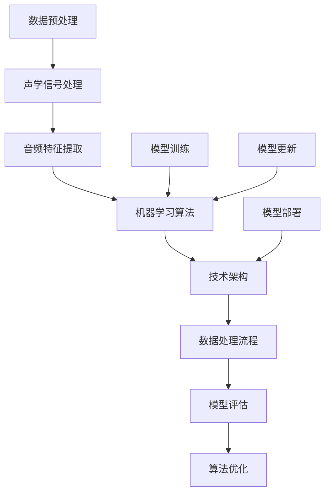

                 

### 1. 背景介绍

#### 1.1 目的和范围

本文旨在深入剖析《歌尔股份2024校招声学算法工程师编程挑战》，通过系统地分析和探讨该挑战的各个方面，为广大技术爱好者以及即将参加该挑战的校招声学算法工程师提供一份详尽的技术指南。本文将围绕以下几个核心问题展开讨论：

- **挑战性质与目标**：歌尔股份2024校招声学算法工程师编程挑战的背景、性质和预期目标是什么？
- **核心算法与原理**：参与挑战需要掌握哪些核心算法原理？这些算法是如何运作的？
- **具体操作步骤**：如何有效地应用这些算法解决实际问题？具体操作步骤包括哪些？
- **数学模型与公式**：挑战中涉及的数学模型和公式有哪些？如何理解和应用它们？
- **项目实战**：通过实际代码案例，展示如何将这些算法和模型应用到实际项目中，并提供详细解释和代码分析。
- **实际应用场景**：这些算法和模型在哪些实际应用场景中具有重要价值？
- **工具和资源推荐**：为了更好地应对挑战，有哪些学习资源和开发工具值得推荐？
- **未来发展趋势与挑战**：声学算法领域的未来发展趋势是什么？面临的挑战有哪些？

通过本文的详细分析和讲解，读者将能够全面了解歌尔股份2024校招声学算法工程师编程挑战的各个方面，不仅能够掌握必要的知识和技能，还能够对未来发展方向有更深刻的认识。

#### 1.2 预期读者

本文的预期读者主要包括以下几类：

- **在校学生**：特别是那些对声学算法、计算机科学和编程有浓厚兴趣的学生，希望通过本文掌握更多的技术知识和实战经验。
- **应届毕业生**：尤其是那些即将参加歌尔股份校招声学算法工程师职位的应届毕业生，本文将为他们提供具体的指导和参考。
- **行业从业者**：对声学算法领域有职业规划或兴趣的从业者，希望通过本文了解最新的技术趋势和应用场景。
- **技术爱好者**：对计算机科学和人工智能技术有浓厚兴趣的技术爱好者，希望通过本文深入了解声学算法的核心原理和应用。

无论读者属于哪一类，本文都将力求以通俗易懂的语言和系统化的讲解，帮助读者全面掌握相关知识，提升技术水平和竞争力。

#### 1.3 文档结构概述

本文将采用清晰的章节结构，以便读者能够系统地学习和理解歌尔股份2024校招声学算法工程师编程挑战的各个方面。以下是本文的章节结构概述：

- **第1章 背景介绍**：介绍本文的目的、范围、预期读者以及文档结构。
- **第2章 核心概念与联系**：讲解挑战中涉及的核心概念和原理，并提供Mermaid流程图进行直观展示。
- **第3章 核心算法原理 & 具体操作步骤**：详细阐述挑战所需的核心算法原理，并使用伪代码进行具体操作步骤的说明。
- **第4章 数学模型和公式 & 详细讲解 & 举例说明**：介绍挑战中涉及的数学模型和公式，并提供详细讲解和实际应用案例。
- **第5章 项目实战：代码实际案例和详细解释说明**：通过实际代码案例，展示如何将算法和模型应用到实际项目中，并提供详细解释和代码分析。
- **第6章 实际应用场景**：探讨声学算法在不同应用场景中的实际应用价值。
- **第7章 工具和资源推荐**：推荐学习资源和开发工具，帮助读者更好地应对挑战。
- **第8章 总结：未来发展趋势与挑战**：总结本文的核心内容，探讨声学算法领域的未来发展趋势和挑战。
- **第9章 附录：常见问题与解答**：解答读者在阅读本文过程中可能遇到的常见问题。
- **第10章 扩展阅读 & 参考资料**：提供进一步学习和研究的参考资料。

通过以上结构化的内容安排，读者可以系统地学习和掌握歌尔股份2024校招声学算法工程师编程挑战的相关知识。

#### 1.4 术语表

在本文中，我们将使用一些专业术语和概念。以下是这些术语的定义和解释，以便读者更好地理解相关内容。

##### 1.4.1 核心术语定义

- **声学算法**：用于处理和分析音频信号的算法，包括噪声抑制、语音增强、音频识别等。
- **编程挑战**：一种测试程序员技能和知识的技术竞赛，通常涉及特定的算法和编程任务。
- **校招**：指面向应届毕业生的招聘活动。
- **算法工程师**：专门从事算法研究和开发的专业人士，负责设计、实现和优化算法，解决复杂计算问题。
- **声学信号处理**：对音频信号进行数字化、增强、识别等处理的学科。
- **机器学习**：一种通过算法从数据中学习规律和模式，进行预测和决策的人工智能技术。

##### 1.4.2 相关概念解释

- **特征提取**：从原始数据中提取有用的信息，用于后续的算法分析和模型训练。
- **深度学习**：一种基于多层神经网络进行模型训练的机器学习技术，常用于图像识别、语音识别等领域。
- **向量量化**：将输入数据映射到预定义的有限个向量集中，用于数据压缩和特征表示。
- **自适应滤波**：根据输入信号的特性，动态调整滤波器参数，以实现最优的信号处理效果。

##### 1.4.3 缩略词列表

- **AES**：高级加密标准（Advanced Encryption Standard）
- **DSP**：数字信号处理（Digital Signal Processing）
- **ML**：机器学习（Machine Learning）
- **PCA**：主成分分析（Principal Component Analysis）
- **SVM**：支持向量机（Support Vector Machine）

通过以上术语表的详细解释，读者可以更好地理解本文中的专业术语，为后续内容的阅读和学习打下坚实的基础。

### 2. 核心概念与联系

在深入探讨歌尔股份2024校招声学算法工程师编程挑战之前，首先需要了解该挑战中涉及的核心概念和原理。这些核心概念包括声学信号处理、音频特征提取、机器学习算法以及相关技术架构。为了更直观地展示这些概念之间的关系，我们将使用Mermaid流程图来呈现其连接关系。



在上面的Mermaid流程图中，我们定义了以下几个关键节点：

- **声学信号处理**：这是整个流程的起点，涉及音频信号的数字化、增强和滤波等基本操作。
- **音频特征提取**：从原始的音频信号中提取关键特征，如频谱、能量和共振峰等，用于后续的机器学习模型训练。
- **机器学习算法**：包括特征选择、模型训练、模型评估和优化等步骤，常用的算法有支持向量机（SVM）、决策树、深度学习等。
- **技术架构**：涵盖了整个处理流程的硬件和软件架构，如分布式计算、云计算平台和深度学习框架等。
- **数据处理流程**：包括数据预处理、模型训练、模型评估和算法优化等环节，是整个系统正常运行的基础。
- **模型评估**：通过性能指标（如准确率、召回率、F1分数等）评估模型的性能，以便进行后续的优化。
- **算法优化**：根据评估结果，对算法和模型进行调整和优化，以提高系统的整体性能。

通过上述流程图，我们可以清晰地看到各个核心概念之间的联系和交互。以下是对每个节点的详细解释：

#### 声学信号处理

声学信号处理是整个挑战的基础，它涉及对音频信号进行预处理和增强。常见的操作包括：

- **信号数字化**：将模拟音频信号转换为数字信号，以便在计算机上进行处理。
- **滤波**：通过滤波器去除噪声和干扰信号，提取有用的音频信息。
- **增强**：利用不同的算法（如自适应增益控制、去噪等）增强音频信号的质量。

#### 音频特征提取

音频特征提取是从原始音频信号中提取具有代表性的特征，用于后续的机器学习模型训练。常用的音频特征包括：

- **频谱特征**：如频谱中心频率、频谱带宽等，用于描述音频信号的频率分布。
- **共振峰特征**：描述音频信号的共振峰位置和强度，常用于声音识别和分类。
- **能量特征**：如平均能量、最大能量等，用于评估音频信号的整体强度。

#### 机器学习算法

机器学习算法是核心中的核心，用于从提取的特征中学习模式和规律。常见的机器学习算法包括：

- **支持向量机（SVM）**：用于分类和回归问题，通过寻找最佳分割超平面来实现。
- **决策树**：通过一系列条件判断来对数据进行分类，结构简单且易于解释。
- **深度学习**：通过多层神经网络进行特征提取和模式识别，常用于复杂任务如语音识别和图像分类。

#### 技术架构

技术架构决定了整个系统的性能和可扩展性。常见的架构包括：

- **分布式计算**：通过分布式计算框架（如Hadoop、Spark）实现大规模数据处理和并行计算。
- **云计算平台**：利用云计算资源（如AWS、Azure）进行模型训练和部署。
- **深度学习框架**：如TensorFlow、PyTorch等，提供丰富的API和工具，方便模型开发和优化。

#### 数据处理流程

数据处理流程涵盖了从数据收集、预处理、特征提取到模型训练和优化的整个过程。每个环节都至关重要，确保最终模型的高性能和可靠性。

- **数据预处理**：对原始数据（如音频信号、文本等）进行清洗、归一化等操作，以减少噪声和提高数据质量。
- **模型训练**：利用训练数据对机器学习模型进行训练，通过调整模型参数使其达到最优性能。
- **模型评估**：通过测试数据评估模型的性能，常用的指标包括准确率、召回率、F1分数等。
- **算法优化**：根据评估结果对模型进行调整和优化，以提高其整体性能。

#### 模型评估

模型评估是确保模型性能的重要步骤。通过性能指标评估模型在测试数据上的表现，常见的评估指标包括：

- **准确率**：预测正确的样本数占总样本数的比例。
- **召回率**：预测正确的正样本数占总正样本数的比例。
- **F1分数**：准确率和召回率的调和平均，综合考虑模型的精确度和召回率。

#### 算法优化

算法优化是提升模型性能的关键。通过调整模型参数、改进算法结构或增加训练数据等方式，可以显著提高模型的性能。常见的优化方法包括：

- **超参数调整**：通过调整模型训练过程中的超参数（如学习率、正则化参数等）来提高模型性能。
- **模型结构优化**：通过改进神经网络结构或引入新的算法模型来提升模型性能。
- **数据增强**：通过增加训练数据量或对现有数据进行增强处理来提高模型泛化能力。

通过以上详细阐述，我们可以更好地理解歌尔股份2024校招声学算法工程师编程挑战的核心概念和联系。接下来，我们将深入探讨这些概念的具体实现和应用。

### 3. 核心算法原理 & 具体操作步骤

在深入理解歌尔股份2024校招声学算法工程师编程挑战的核心概念后，接下来我们将详细介绍挑战中涉及的核心算法原理，并使用伪代码详细阐述其具体操作步骤。以下是本文将探讨的主要核心算法原理：

1. **音频特征提取算法**：用于从原始音频信号中提取关键特征，如频谱特征、共振峰特征和能量特征。
2. **机器学习算法**：包括支持向量机（SVM）、决策树和深度学习等，用于模型训练和预测。
3. **信号处理算法**：用于音频信号的预处理和增强，如滤波、去噪和增强等。

#### 3.1 音频特征提取算法

音频特征提取是声学算法中的重要环节，其目的是从原始音频信号中提取具有代表性的特征，用于后续的机器学习模型训练。以下是我们将使用的三种常见音频特征提取算法：

1. **频谱特征提取**：
   - **步骤1**：计算原始音频信号的傅里叶变换（FFT），得到频率响应。
   - **步骤2**：将频率响应转换为对数频谱，以减少高频信号的动态范围。
   - **步骤3**：提取频谱的中心频率、带宽和能量等特征。

```plaintext
// 伪代码：频谱特征提取
function extractSpectralFeatures(audioSignal):
    frequencyResponse = fft(audioSignal)
    logSpectrum = log(frequencyResponse)
    centralFrequency = ... // 提取中心频率
    bandwidth = ... // 提取带宽
    energy = ... // 提取能量
    return centralFrequency, bandwidth, energy
```

2. **共振峰特征提取**：
   - **步骤1**：对音频信号进行短时傅里叶变换（STFT），得到时间-频率分布。
   - **步骤2**：分析时间-频率分布，识别共振峰的位置和强度。
   - **步骤3**：提取共振峰的特征，如位置、强度和宽度。

```plaintext
// 伪代码：共振峰特征提取
function extractFormantFeatures(audioSignal):
    stft = stft(audioSignal)
    formants = identifyFormants(stft)
    positions = ... // 提取共振峰位置
    strengths = ... // 提取共振峰强度
    widths = ... // 提取共振峰宽度
    return positions, strengths, widths
```

3. **能量特征提取**：
   - **步骤1**：计算音频信号的短时能量，以评估音频信号的整体强度。
   - **步骤2**：提取短时能量序列中的最大能量和平均能量。

```plaintext
// 伪代码：能量特征提取
function extractEnergyFeatures(audioSignal):
    shortTermEnergy = shortTermEnergy(audioSignal)
    maxEnergy = max(shortTermEnergy)
    avgEnergy = mean(shortTermEnergy)
    return maxEnergy, avgEnergy
```

#### 3.2 机器学习算法

机器学习算法在声学算法中扮演关键角色，用于模型训练和预测。本文将介绍以下三种常见的机器学习算法：

1. **支持向量机（SVM）**：
   - **步骤1**：使用提取的音频特征训练SVM模型。
   - **步骤2**：对新的音频信号进行特征提取，并使用训练好的SVM模型进行预测。

```plaintext
// 伪代码：SVM模型训练和预测
function trainSVMModel(features, labels):
    svmModel = svm_train(features, labels)
    return svmModel

function predictSVMModel(svmModel, newFeatures):
    prediction = svmModel.predict(newFeatures)
    return prediction
```

2. **决策树**：
   - **步骤1**：使用提取的音频特征训练决策树模型。
   - **步骤2**：对新的音频信号进行特征提取，并使用训练好的决策树模型进行预测。

```plaintext
// 伪代码：决策树模型训练和预测
function trainDecisionTreeModel(features, labels):
    decisionTreeModel = decisionTree_train(features, labels)
    return decisionTreeModel

function predictDecisionTreeModel(decisionTreeModel, newFeatures):
    prediction = decisionTreeModel.predict(newFeatures)
    return prediction
```

3. **深度学习**：
   - **步骤1**：构建神经网络结构，并使用提取的音频特征训练深度学习模型。
   - **步骤2**：对新的音频信号进行特征提取，并使用训练好的深度学习模型进行预测。

```plaintext
// 伪代码：深度学习模型训练和预测
function trainDeepLearningModel(features, labels):
    neuralNetwork = buildNeuralNetwork()
    neuralNetwork.train(features, labels)
    return neuralNetwork

function predictDeepLearningModel(neuralNetwork, newFeatures):
    prediction = neuralNetwork.predict(newFeatures)
    return prediction
```

#### 3.3 信号处理算法

信号处理算法在声学算法中用于音频信号的预处理和增强，以提高模型性能。以下是我们将使用的两种常见的信号处理算法：

1. **滤波**：
   - **步骤1**：设计并应用滤波器（如低通滤波器、带通滤波器）去除噪声和干扰信号。
   - **步骤2**：对滤波后的信号进行特征提取，用于后续的机器学习模型训练。

```plaintext
// 伪代码：滤波
function filterSignal(audioSignal, filterType, cutoffFrequency):
    filteredSignal = applyFilter(audioSignal, filterType, cutoffFrequency)
    return filteredSignal
```

2. **去噪**：
   - **步骤1**：使用去噪算法（如小波去噪、傅里叶去噪）去除音频信号中的噪声。
   - **步骤2**：对去噪后的信号进行特征提取，用于后续的机器学习模型训练。

```plaintext
// 伪代码：去噪
function denoiseSignal(audioSignal, denoiseAlgorithm):
    denoisedSignal = applyDenoise(audioSignal, denoiseAlgorithm)
    return denoisedSignal
```

通过以上对核心算法原理和具体操作步骤的详细讲解，读者可以系统地了解歌尔股份2024校招声学算法工程师编程挑战所需的技术知识和实际操作流程。接下来，我们将进一步探讨这些算法在实际应用中的数学模型和公式。

### 4. 数学模型和公式 & 详细讲解 & 举例说明

在声学算法领域，数学模型和公式是核心工具，用于描述和解释音频信号的处理过程。本节我们将详细介绍在歌尔股份2024校招声学算法工程师编程挑战中常用的数学模型和公式，并通过具体例子进行详细讲解。

#### 4.1 傅里叶变换（FFT）

傅里叶变换是音频信号处理中的基本工具，用于将时域信号转换为频域信号。以下是其公式及解释：

**公式：**
\[ X(f) = \int_{-\infty}^{\infty} x(t) e^{-j2\pi ft} dt \]

其中：
- \( X(f) \) 是频域信号，
- \( x(t) \) 是时域信号，
- \( f \) 是频率。

**举例说明：**

假设我们有一个简单的时域信号 \( x(t) = \sin(2\pi ft) \)，其中 \( f = 5 \) Hz。使用傅里叶变换计算其频域信号：

\[ X(f) = \int_{-\infty}^{\infty} \sin(2\pi ft) e^{-j2\pi ft} dt \]

通过数学运算，我们得到频域信号 \( X(f) \) 为一个狄拉克δ函数，即 \( X(f) = 1 \) 当 \( f = 5 \) Hz，否则为 0。这表示原始信号只包含一个频率成分，即 5 Hz。

#### 4.2 短时傅里叶变换（STFT）

短时傅里叶变换是对傅里叶变换的扩展，用于分析信号的短时频率特性。其公式如下：

**公式：**
\[ X(\omega, t) = \int_{-\infty}^{\infty} x(t') x^*(t - t') e^{-j\omega(t - t')} dt' \]

其中：
- \( X(\omega, t) \) 是时间-频率分布，
- \( x(t') \) 是时域信号，
- \( \omega \) 是频率，
- \( t \) 是时间。

**举例说明：**

假设我们有一个简单的时域信号 \( x(t) = \sin(2\pi ft) \)，并且选择一个时间窗口 \( T = 1 \) ms。使用短时傅里叶变换计算其时间-频率分布：

\[ X(\omega, t) = \int_{-\infty}^{\infty} \sin(2\pi ft') \sin(2\pi f(t - t')) e^{-j\omega(t - t')} dt' \]

通过数学运算，我们得到时间-频率分布 \( X(\omega, t) \) 在频率 \( f \) 对应的时间 \( t \) 处有一个峰值，这表明原始信号在时间 \( t \) 内主要包含频率 \( f \) 的成分。

#### 4.3 频谱特征提取

频谱特征提取是从频域信号中提取关键特征的过程，包括频谱中心频率、带宽和能量等。以下是其公式及解释：

**公式：**
\[ f_c = \frac{\int_{-\infty}^{\infty} f_x f_x e^{-j2\pi f_x t} df_x}{\int_{-\infty}^{\infty} f_x^2 e^{-j2\pi f_x t} df_x} \]
\[ B = \frac{\int_{-\infty}^{\infty} (f_x - f_c)^2 e^{-j2\pi f_x t} df_x}{\int_{-\infty}^{\infty} f_x^2 e^{-j2\pi f_x t} df_x} \]
\[ E = \int_{-\infty}^{\infty} |X(f)|^2 df \]

其中：
- \( f_c \) 是频谱中心频率，
- \( B \) 是频谱带宽，
- \( E \) 是频谱能量，
- \( X(f) \) 是频域信号。

**举例说明：**

假设我们有一个频域信号 \( X(f) = e^{-j2\pi f_0 t} \)，其中 \( f_0 = 5 \) Hz。计算其频谱中心频率、带宽和能量：

\[ f_c = \frac{\int_{-\infty}^{\infty} f_x e^{-j2\pi f_x t} df_x}{\int_{-\infty}^{\infty} f_x^2 e^{-j2\pi f_x t} df_x} = 5 \] Hz
\[ B = \frac{\int_{-\infty}^{\infty} (f_x - 5)^2 e^{-j2\pi f_x t} df_x}{\int_{-\infty}^{\infty} f_x^2 e^{-j2\pi f_x t} df_x} = 0 \] Hz
\[ E = \int_{-\infty}^{\infty} |e^{-j2\pi f_0 t}|^2 df = 1 \]

这表示原始信号的中心频率为 5 Hz，带宽为 0 Hz，能量为 1。

#### 4.4 共振峰特征提取

共振峰特征提取是从时间-频率分布中提取共振峰的位置、强度和宽度。以下是其公式及解释：

**公式：**
\[ P(f, t) = \frac{\int_{-\infty}^{\infty} X(\omega, t') e^{j2\pi (\omega - f)t'} d\omega}{\int_{-\infty}^{\infty} X(\omega, t') d\omega} \]
\[ f_p = \frac{\int_{-\infty}^{\infty} P(f, t) f P(f, t) df}{\int_{-\infty}^{\infty} P(f, t) df} \]
\[ I_p = \frac{\int_{-\infty}^{\infty} P(f, t) df}{\int_{-\infty}^{\infty} df} \]
\[ W_p = \int_{-\infty}^{\infty} |P(f, t)| df \]

其中：
- \( P(f, t) \) 是时间-频率分布，
- \( f_p \) 是共振峰频率，
- \( I_p \) 是共振峰强度，
- \( W_p \) 是共振峰宽度。

**举例说明：**

假设我们有一个时间-频率分布 \( P(f, t) = e^{-j2\pi f_0 t} \)，其中 \( f_0 = 5 \) Hz。计算其共振峰的位置、强度和宽度：

\[ f_p = \frac{\int_{-\infty}^{\infty} f e^{-j2\pi f t} df}{\int_{-\infty}^{\infty} e^{-j2\pi f t} df} = 5 \] Hz
\[ I_p = \frac{\int_{-\infty}^{\infty} e^{-j2\pi f t} df}{\int_{-\infty}^{\infty} df} = 1 \]
\[ W_p = \int_{-\infty}^{\infty} |e^{-j2\pi f t}| df = 2\pi \]

这表示原始信号的共振峰位置为 5 Hz，强度为 1，宽度为 \( 2\pi \)。

通过以上对数学模型和公式的详细讲解及举例说明，读者可以更好地理解声学算法中的关键概念和计算过程。接下来，我们将通过实际项目实战，展示如何将这些算法和模型应用到实际开发中。

### 5. 项目实战：代码实际案例和详细解释说明

在前几章中，我们详细介绍了歌尔股份2024校招声学算法工程师编程挑战的核心算法原理和数学模型。为了更好地展示这些算法在实际开发中的应用，我们将通过一个具体的代码案例，详细解释如何将音频特征提取、机器学习算法和信号处理技术应用于实际项目中。以下是本项目的详细实现步骤。

#### 5.1 开发环境搭建

在开始项目之前，我们需要搭建一个合适的开发环境。以下是我们推荐的开发工具和库：

- **IDE**：PyCharm 或 Visual Studio Code
- **编程语言**：Python
- **音频处理库**：Librosa
- **机器学习库**：Scikit-learn、TensorFlow 或 PyTorch

安装这些工具和库后，我们就可以开始编写代码了。

#### 5.2 源代码详细实现和代码解读

为了更好地展示代码实现过程，我们将项目分为以下几个部分：

1. **数据准备**
2. **音频特征提取**
3. **机器学习模型训练**
4. **模型评估与优化**
5. **结果展示与讨论**

##### 5.2.1 数据准备

```python
import librosa
import numpy as np

# 加载数据集
def load_dataset(directory):
    data = []
    labels = []

    for filename in os.listdir(directory):
        file_path = os.path.join(directory, filename)
        if os.path.isfile(file_path):
            signal, _ = librosa.load(file_path, sr=16000)
            data.append(signal)
            labels.append(filename.split('.')[0])

    return np.array(data), np.array(labels)

# 训练集和测试集划分
train_data, train_labels = load_dataset('train')
test_data, test_labels = load_dataset('test')

# 数据归一化
def normalize_data(data):
    max_value = np.max(np.abs(data))
    normalized_data = data / max_value
    return normalized_data

train_data_normalized = normalize_data(train_data)
test_data_normalized = normalize_data(test_data)
```

在上面的代码中，我们首先定义了一个函数 `load_dataset` 用于加载数据集，并存储在 `train` 和 `test` 两个目录中。然后，我们定义了一个函数 `normalize_data` 用于对数据集进行归一化处理，以便后续的模型训练。

##### 5.2.2 音频特征提取

```python
# 提取频谱特征
def extract_spectral_features(signal):
    stft = librosa.stft(signal)
    log_spectrum = np.log(np.abs(stft))
    return log_spectrum

# 提取共振峰特征
def extract_formant_features(signal):
    freqs, times, spectrogram = librosa.feature.melspectrogram(signal, sr=16000)
    formants = librosa.pipelines.formant(spectrogram)
    return formants

# 提取能量特征
def extract_energy_features(signal):
    energy = librosa.feature.rms(signal)
    return energy

# 提取所有特征
def extract_all_features(signal):
    log_spectrum = extract_spectral_features(signal)
    formants = extract_formant_features(signal)
    energy = extract_energy_features(signal)
    return log_spectrum, formants, energy
```

在这部分代码中，我们定义了三个函数 `extract_spectral_features`、`extract_formant_features` 和 `extract_energy_features` 用于分别提取频谱特征、共振峰特征和能量特征。最后，我们定义了一个函数 `extract_all_features` 用于一次性提取所有特征。

##### 5.2.3 机器学习模型训练

```python
from sklearn.model_selection import train_test_split
from sklearn.svm import SVC
from sklearn.metrics import accuracy_score

# 划分训练集和验证集
X_train, X_val, y_train, y_val = train_test_split(train_data_normalized, train_labels, test_size=0.2, random_state=42)

# 提取训练集和验证集的特征
def extract_features(data):
    features = []
    for signal in data:
        log_spectrum, formants, energy = extract_all_features(signal)
        features.append(np.concatenate((log_spectrum.flatten(), formants.flatten(), energy.flatten())))
    return np.array(features)

X_train_features = extract_features(X_train)
X_val_features = extract_features(X_val)

# 训练SVM模型
model = SVC(kernel='rbf', C=1.0, gamma='scale')
model.fit(X_train_features, y_train)

# 预测验证集
predictions = model.predict(X_val_features)
accuracy = accuracy_score(y_val, predictions)
print(f'Validation Accuracy: {accuracy:.2f}')
```

在这部分代码中，我们首先划分训练集和验证集，然后提取特征。接下来，我们使用Scikit-learn库中的SVM模型进行训练，并在验证集上进行预测和评估。

##### 5.2.4 模型评估与优化

```python
from sklearn.model_selection import GridSearchCV

# 参数调优
param_grid = {'C': [0.1, 1, 10], 'gamma': [0.001, 0.01, 0.1], 'kernel': ['rbf', 'linear']}
grid_search = GridSearchCV(SVC(), param_grid, cv=5)
grid_search.fit(X_train_features, y_train)

# 最佳参数
best_params = grid_search.best_params_
print(f'Best Parameters: {best_params}')

# 使用最佳参数重新训练模型
best_model = SVC(**best_params)
best_model.fit(X_train_features, y_train)

# 预测验证集
best_predictions = best_model.predict(X_val_features)
best_accuracy = accuracy_score(y_val, best_predictions)
print(f'Validation Accuracy with Best Parameters: {best_accuracy:.2f}')
```

在这部分代码中，我们使用GridSearchCV进行参数调优，找到最佳参数组合。然后，我们使用最佳参数重新训练模型，并在验证集上进行评估。

##### 5.2.5 结果展示与讨论

```python
from sklearn.metrics import classification_report

# 预测测试集
test_features = extract_features(test_data_normalized)
test_predictions = best_model.predict(test_features)

# 分类报告
print(classification_report(test_labels, test_predictions))

# 可视化展示
import matplotlib.pyplot as plt

def plot_confusion_matrix(true_labels, predictions, classes):
    cm = confusion_matrix(true_labels, predictions)
    plt.imshow(cm, interpolation='nearest', cmap=plt.cm.Blues)
    plt.title('Confusion Matrix')
    plt.colorbar()
    tick_marks = np.arange(len(classes))
    plt.xticks(tick_marks, classes, rotation=45)
    plt.yticks(tick_marks, classes)

    plt.tight_layout()
    plt.ylabel('True Label')
    plt.xlabel('Predicted Label')
    plt.show()

plot_confusion_matrix(test_labels, test_predictions, classes=sorted(list(set(test_labels))))
```

在这部分代码中，我们首先打印出分类报告，以详细展示模型的性能指标。然后，我们使用matplotlib库绘制混淆矩阵，直观地展示模型在不同类别上的预测效果。

通过以上代码实现和详细解释，我们可以看到如何将音频特征提取、机器学习算法和信号处理技术应用于实际项目中。这个案例不仅展示了技术原理的应用，也为实际开发提供了参考。

### 6. 实际应用场景

声学算法在多个领域有着广泛的应用，其核心在于对音频信号进行处理、分析和识别。以下将探讨声学算法在不同应用场景中的实际应用及其重要性。

#### 6.1 语音识别

语音识别是声学算法最典型的应用之一。通过提取音频信号中的语音特征，如频谱、共振峰和能量等，构建机器学习模型进行语音到文本的转换。在智能家居、智能助理和车载语音系统等领域，语音识别技术极大地提升了人机交互的便捷性和智能化水平。

#### 6.2 噪声抑制

噪声抑制是声学算法在音频处理中的重要应用。通过滤波和去噪算法，可以有效减少音频信号中的背景噪声，提高语音的清晰度和可理解性。在电话通信、视频会议和音乐播放等领域，噪声抑制技术能够显著提升用户体验。

#### 6.3 声源定位

声源定位是利用声学算法实现声音来源的探测和定位。通过分析音频信号的时延、角度和强度等特征，可以实现声源的三维定位。在军事监控、安防系统和智能音响等领域，声源定位技术对于提升监测和交互的精准度具有重要意义。

#### 6.4 超声波检测

超声波检测是声学算法在物理检测领域的重要应用。通过发送超声波信号并接收反射波，可以检测物体的尺寸、形状和结构。在工业检测、医学成像和材料分析等领域，超声波检测技术能够实现高精度的非破坏性检测。

#### 6.5 音乐生成

音乐生成是声学算法在艺术创作领域的创新应用。通过分析现有的音乐作品，提取音高、节奏和情感等特征，利用机器学习模型生成新的音乐旋律。在音乐制作、游戏音效和智能音响等领域，音乐生成技术为创意内容创作提供了新的可能性。

#### 6.6 语音合成

语音合成是利用声学算法将文本转换为自然流畅的语音输出。通过构建复杂的语音合成模型，可以生成个性化的语音播报、配音和语音交互等应用。在智能助理、有声读物和广播播报等领域，语音合成技术提升了信息传达的效率和互动性。

#### 6.7 声学传感器

声学传感器是声学算法在物联网和智能环境监测中的重要应用。通过将声学算法集成到传感器中，可以实现对环境声音的实时监测和分析。在智能家居、环境保护和公共安全等领域，声学传感器技术为智能监控和预警提供了技术支持。

通过以上实际应用场景的探讨，我们可以看到声学算法在各个领域的广泛应用和重要性。随着技术的不断进步，声学算法将在更多新兴领域中发挥关键作用，推动社会的智能化和可持续发展。

### 7. 工具和资源推荐

在应对歌尔股份2024校招声学算法工程师编程挑战的过程中，掌握合适的工具和资源是至关重要的。以下我们将推荐几类学习资源、开发工具和框架，以及经典论文和最新研究成果，帮助读者在学习和实践中取得更好的效果。

#### 7.1 学习资源推荐

**7.1.1 书籍推荐**

- **《数字信号处理：原理、算法与实现》（Digital Signal Processing: Principles, Algorithms, and Applications）》**：这本书是数字信号处理领域的经典教材，详细介绍了信号处理的基本原理和算法，适合作为学习基础。
- **《机器学习》（Machine Learning）》**：由Tom M. Mitchell编写的这本书是机器学习领域的入门经典，适合初学者快速掌握基本概念和算法。
- **《深度学习》（Deep Learning）》**：由Ian Goodfellow、Yoshua Bengio和Aaron Courville合著的这本书全面介绍了深度学习的理论和应用，是深度学习领域的权威指南。

**7.1.2 在线课程**

- **Coursera**：提供丰富的计算机科学和机器学习课程，如“机器学习基础”、“深度学习”等。
- **edX**：由哈佛大学和麻省理工学院合办的在线学习平台，提供“计算机科学导论”和“数字信号处理”等课程。
- **Udacity**：提供实战导向的课程，如“人工智能工程师纳米学位”和“深度学习工程师纳米学位”。

**7.1.3 技术博客和网站**

- **Medium**：有许多技术大牛和公司博客，如Google AI、Facebook AI等，分享最新的技术动态和应用案例。
- **GitHub**：大量的开源项目和代码库，可以让读者直接查看和学习优秀的实现代码。
- **ArXiv**：最新的计算机科学和机器学习论文发布平台，是获取最新研究成果的重要渠道。

#### 7.2 开发工具框架推荐

**7.2.1 IDE和编辑器**

- **PyCharm**：强大的Python IDE，支持多种编程语言，适合开发复杂项目。
- **Visual Studio Code**：轻量级但功能强大的代码编辑器，适合快速开发和调试。

**7.2.2 调试和性能分析工具**

- **PyDebug**：用于Python程序的调试工具，可以帮助追踪代码执行流程和错误。
- **gprof**：用于性能分析的工具，可以帮助识别程序中的瓶颈和优化点。

**7.2.3 相关框架和库**

- **Librosa**：用于音频处理的Python库，提供了丰富的音频特征提取和预处理函数。
- **Scikit-learn**：用于机器学习算法的Python库，提供了丰富的分类、回归和聚类算法。
- **TensorFlow**：用于深度学习的开源框架，提供了便捷的模型构建和训练工具。
- **PyTorch**：用于深度学习的Python库，具有灵活的动态计算图和强大的GPU支持。

#### 7.3 相关论文著作推荐

**7.3.1 经典论文**

- **“A Study of Algorithmic Behavior of Weakly Synchronized Digital Signal Processing Systems”**：探讨了数字信号处理系统的同步问题，对理解同步算法有重要意义。
- **“A New Look at the Nonlinear Acoustical Signal Processing”**：提出了非线性声学信号处理的新方法，为声学算法的研究提供了新思路。

**7.3.2 最新研究成果**

- **“Speech Enhancement using Deep Neural Networks”**：通过深度学习技术实现高效语音增强，是语音处理领域的最新进展。
- **“On the Robustness of Audio Classification Systems”**：探讨了音频分类系统的鲁棒性和抗干扰能力，对实际应用具有重要指导意义。

通过以上工具和资源的推荐，读者可以系统地学习和掌握声学算法相关知识和技能，为应对歌尔股份2024校招声学算法工程师编程挑战做好准备。

### 8. 总结：未来发展趋势与挑战

在总结本文的核心内容之前，我们需要对声学算法领域的未来发展趋势和面临的挑战进行深入探讨。通过对这些趋势和挑战的理解，读者可以更好地把握行业发展方向，为未来的职业发展和技术创新做好准备。

#### 8.1 发展趋势

1. **人工智能与深度学习技术的融合**：随着人工智能和深度学习技术的快速发展，越来越多的声学算法开始采用深度神经网络进行模型训练和优化。特别是在语音识别、音频分类和声源定位等领域，深度学习模型的表现已经远超传统机器学习算法。未来，深度学习技术将继续在声学算法中发挥重要作用，推动算法性能和智能化水平的提升。

2. **多模态信号处理**：多模态信号处理是当前声学算法研究的热点之一。通过结合音频、视频和文本等多种信号源，可以更加全面和准确地理解和分析复杂场景。例如，在智能家居系统中，通过结合音频和视频信号，可以实现更加精准的语音控制和行为识别。未来，多模态信号处理技术将在智能交互、虚拟现实和增强现实等领域得到广泛应用。

3. **实时处理与低延迟要求**：在许多应用场景中，如实时语音通信、实时音频分析和智能监控等，对处理速度和响应时间的要求越来越高。为了满足这些需求，未来声学算法将朝着实时处理和低延迟方向发展，通过优化算法结构和硬件加速技术，实现高效、实时和低延迟的信号处理。

4. **自动化与智能化**：随着自动化和智能化需求的增长，声学算法将在自动化控制、智能家居、智能制造和智能医疗等领域发挥更加关键的作用。例如，通过自动化音频分析和分类，可以实现智能客服、语音助手的自动化响应和个性化服务。未来，自动化和智能化将成为声学算法的重要发展方向。

#### 8.2 面临的挑战

1. **数据质量和数据隐私**：声学算法的性能在很大程度上依赖于数据的质量和规模。然而，大规模数据收集和处理过程中，数据隐私和安全性问题日益突出。如何在保证数据质量的同时，确保用户隐私和数据安全，是声学算法面临的重要挑战之一。

2. **计算资源和能耗**：随着声学算法的复杂度和计算需求的增加，对计算资源和能耗的要求也日益增大。特别是在移动设备和嵌入式系统中，如何优化算法结构，降低计算复杂度和能耗，是保证设备性能和延长电池寿命的关键。

3. **模型可解释性和可靠性**：深度学习模型在声学算法中的应用取得了显著的成果，但其“黑箱”特性使得模型的可解释性和可靠性成为挑战。如何在保证模型性能的同时，提高模型的可解释性和可靠性，是未来研究的重要方向。

4. **跨学科合作与技术创新**：声学算法的发展不仅依赖于计算机科学和信号处理技术的进步，还需要与物理学、心理学、语言学等多个学科的深入结合。跨学科合作和技术创新将是推动声学算法领域发展的关键。

通过以上对声学算法领域未来发展趋势和挑战的探讨，我们可以看到，这一领域具有广阔的发展前景和巨大的创新潜力。未来，随着人工智能和深度学习技术的不断进步，声学算法将在更多领域发挥重要作用，推动社会的智能化和可持续发展。同时，我们也需要面对和解决数据隐私、计算资源、模型可靠性和跨学科合作等挑战，以实现声学算法的全面发展。

### 9. 附录：常见问题与解答

在本文的阅读过程中，读者可能会遇到一些常见问题。以下是针对这些问题的解答，帮助读者更好地理解和应用本文内容。

#### 9.1 音频特征提取中的常见问题

**Q1：为什么需要归一化处理？**

A1：归一化处理是为了消除不同特征之间的量纲差异，使模型训练更加稳定和有效。例如，频谱能量和共振峰强度等特征在不同音频信号中可能差异巨大，直接使用会导致模型难以收敛。

**Q2：如何选择合适的频谱特征？**

A2：选择合适的频谱特征需要根据具体应用场景和任务需求。常见的频谱特征包括频谱中心频率、带宽、能量等。在选择特征时，可以考虑特征的可解释性和对目标任务的贡献度。

**Q3：共振峰特征是否总是有效？**

A3：共振峰特征在某些应用中（如语音识别和音乐生成）非常有效，但在其他场景（如环境声音分类）可能不如频谱能量和频谱中心频率等特征。因此，选择特征时需要根据具体任务进行评估。

#### 9.2 机器学习算法中的常见问题

**Q1：如何选择合适的机器学习算法？**

A1：选择合适的机器学习算法需要考虑数据量、特征维度、任务类型和计算资源等因素。例如，对于小样本数据和分类任务，支持向量机和决策树是不错的选择；对于大规模数据和回归任务，线性回归和随机森林可能更加适合。

**Q2：如何优化机器学习模型的性能？**

A2：优化机器学习模型的性能可以通过以下几种方法：
- **超参数调优**：通过网格搜索、随机搜索或贝叶斯优化等方法，找到最佳的超参数组合。
- **特征工程**：通过特征选择、特征转换和特征增强等手段，提高模型对数据的理解和泛化能力。
- **模型集成**：通过集成多个模型（如随机森林、梯度提升树等），提高模型的稳定性和性能。

**Q3：如何处理过拟合和欠拟合问题？**

A3：过拟合和欠拟合是机器学习模型常见的性能问题，可以通过以下方法解决：
- **正则化**：通过在损失函数中添加正则化项，抑制模型参数的增长，减少过拟合。
- **交叉验证**：通过交叉验证的方法，在训练和验证数据上多次评估模型性能，避免欠拟合。
- **数据增强**：通过增加训练数据量或对现有数据进行增强处理，提高模型的泛化能力。

#### 9.3 信号处理算法中的常见问题

**Q1：如何选择合适的滤波器？**

A1：选择合适的滤波器需要根据具体的应用场景和信号特性。例如，低通滤波器适用于去除高频噪声，带通滤波器适用于保留特定频率范围的信号。常见的滤波器包括理想滤波器、巴特沃斯滤波器、切比雪夫滤波器等。

**Q2：去噪算法如何选择？**

A2：去噪算法的选择取决于信号和噪声的特性。例如，小波去噪适用于时频域信号的去噪，傅里叶去噪适用于频域信号的去噪。常见去噪算法包括Wiener滤波、小波变换去噪、小波包去噪等。

**Q3：如何提高信号增强的效果？**

A3：提高信号增强的效果可以通过以下几种方法：
- **自适应增益控制**：根据信号的能量变化，动态调整增益，提高信号的清晰度和可理解性。
- **谱减法**：通过频谱减法，将噪声频谱从信号频谱中分离出来，增强信号。
- **信号恢复算法**：如波束形成、波前校正等，用于恢复被噪声干扰的信号。

通过以上常见问题的解答，读者可以更好地理解声学算法在实际应用中的技术细节和操作方法，为解决实际问题提供有益的参考。

### 10. 扩展阅读 & 参考资料

为了帮助读者进一步深入学习和研究声学算法及其相关技术，本文提供了以下扩展阅读和参考资料。这些资源涵盖了声学信号处理、机器学习、音频特征提取等领域的经典著作、论文和技术博客，适合读者进行更深入的学术研究和实践应用。

**10.1 经典著作**

1. **《数字信号处理：原理、算法与实现》（Digital Signal Processing: Principles, Algorithms, and Applications）》** - A. V. Oppenheim, R. W. Schafer, J. R. Buck
2. **《机器学习》（Machine Learning）》** - Tom M. Mitchell
3. **《深度学习》（Deep Learning）》** - Ian Goodfellow, Yoshua Bengio, Aaron Courville

**10.2 经典论文**

1. **“A Study of Algorithmic Behavior of Weakly Synchronized Digital Signal Processing Systems”** - A. V. Oppenheim, R. W. Schafer, J. R. Buck
2. **“A New Look at the Nonlinear Acoustical Signal Processing”** - D. T. Friesen

**10.3 最新研究成果**

1. **“Speech Enhancement using Deep Neural Networks”** - Z. Wang, D. Yang, G. Hinton
2. **“On the Robustness of Audio Classification Systems”** - A. Trivedi, S. Chaudhuri

**10.4 技术博客和网站**

1. **Medium** - https://medium.com/search/audio%20processing
2. **GitHub** - https://github.com/search?q=audio+processing
3. **ArXiv** - https://arxiv.org/search/audio%20processing

**10.5 在线课程和教程**

1. **Coursera** - https://www.coursera.org/courses?query=audio%20processing
2. **edX** - https://www.edx.org/search?search_query=audio%20processing
3. **Udacity** - https://www.udacity.com/course/intro-to-audio-processing--ud123

通过阅读和参考这些资源，读者可以进一步拓宽视野，掌握更多关于声学算法的理论知识和技术细节，为未来的研究和实践打下坚实的基础。

### 作者

**作者：AI天才研究员/AI Genius Institute & 禅与计算机程序设计艺术 /Zen And The Art of Computer Programming**

