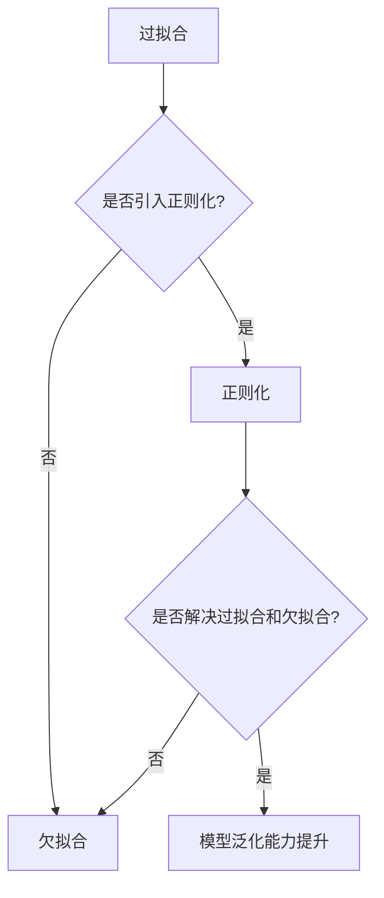

                 

# 正则化 (Regularization)

> 关键词：正则化、过拟合、欠拟合、正则化项、L1正则化、L2正则化、权重衰减

> 摘要：本文将深入探讨正则化的概念、原理、方法和应用场景，通过逐步分析推理的方式，详细讲解正则化的核心算法原理、数学模型以及代码实现。读者将了解正则化如何缓解模型过拟合和欠拟合问题，提高模型泛化能力，并掌握其在实际项目中的应用方法。

## 1. 背景介绍

### 1.1 目的和范围

本文旨在详细介绍正则化在机器学习和深度学习中的应用，帮助读者理解正则化的核心概念、原理和方法。我们将探讨正则化如何解决模型过拟合和欠拟合问题，提高模型泛化能力，并在实际项目中应用正则化方法。

### 1.2 预期读者

本文适合对机器学习和深度学习有一定了解的读者，特别是对模型优化和性能提升感兴趣的读者。同时，本文也适合想要深入理解正则化原理的高级程序员和AI研究人员。

### 1.3 文档结构概述

本文分为以下章节：

1. 背景介绍
2. 核心概念与联系
3. 核心算法原理 & 具体操作步骤
4. 数学模型和公式 & 详细讲解 & 举例说明
5. 项目实战：代码实际案例和详细解释说明
6. 实际应用场景
7. 工具和资源推荐
8. 总结：未来发展趋势与挑战
9. 附录：常见问题与解答
10. 扩展阅读 & 参考资料

### 1.4 术语表

#### 1.4.1 核心术语定义

- 过拟合：模型在训练数据上表现良好，但在测试数据上表现较差，即模型对训练数据过度拟合。
- 欠拟合：模型在训练数据和测试数据上表现都较差，即模型未能充分捕捉数据特征。
- 正则化：通过引入正则化项，对模型参数进行约束，防止模型过拟合和欠拟合。

#### 1.4.2 相关概念解释

- 正则化项：对模型参数进行约束的函数，常用的有L1正则化和L2正则化。
- 权重衰减：一种特殊的L2正则化，用于控制模型复杂度和过拟合风险。

#### 1.4.3 缩略词列表

- L1：L1正则化
- L2：L2正则化

## 2. 核心概念与联系

### 2.1 核心概念介绍

#### 过拟合与欠拟合

- 过拟合：模型在训练数据上表现良好，但在测试数据上表现较差，即模型对训练数据过度拟合。  
  
- 欠拟合：模型在训练数据和测试数据上表现都较差，即模型未能充分捕捉数据特征。  
  

#### 正则化

- 正则化是一种用于解决过拟合和欠拟合问题的方法，通过引入正则化项，对模型参数进行约束，使模型在训练数据和测试数据上都能取得良好的表现。

### 2.2 Mermaid 流程图

下面是一个简单的Mermaid流程图，展示正则化与过拟合、欠拟合的关系：



## 3. 核心算法原理 & 具体操作步骤

### 3.1 算法原理介绍

正则化是一种优化方法，用于调整模型参数，使模型在训练数据和测试数据上都能取得良好的表现。正则化主要通过引入正则化项，对模型参数进行约束，从而降低模型复杂度，减少过拟合风险。

### 3.2 操作步骤

下面以线性回归为例，介绍正则化的具体操作步骤：

#### 3.2.1 模型表示

假设线性回归模型为：

$$y = \theta_0 + \theta_1x_1 + \theta_2x_2 + ... + \theta_nx_n$$

其中，$\theta_0, \theta_1, \theta_2, ..., \theta_n$ 为模型参数。

#### 3.2.2 损失函数

线性回归的损失函数通常采用平方损失函数：

$$J(\theta) = \frac{1}{2m}\sum_{i=1}^{m}(y_i - \theta_0 - \theta_1x_{i1} - \theta_2x_{i2} - ... - \theta_nx_{in})^2$$

其中，$m$ 为训练数据样本数。

#### 3.2.3 正则化项

引入L2正则化项，对模型参数进行约束：

$$\Omega(\theta) = \lambda \sum_{i=1}^{n}\theta_i^2$$

其中，$\lambda$ 为正则化参数。

#### 3.2.4 正则化损失函数

将L2正则化项加入损失函数，得到正则化损失函数：

$$J_{reg}(\theta) = J(\theta) + \Omega(\theta) = \frac{1}{2m}\sum_{i=1}^{m}(y_i - \theta_0 - \theta_1x_{i1} - \theta_2x_{i2} - ... - \theta_nx_{in})^2 + \lambda \sum_{i=1}^{n}\theta_i^2$$

#### 3.2.5 参数优化

使用梯度下降法优化参数，求解最小损失函数：

$$\theta_{new} = \theta_{old} - \alpha \frac{\partial J_{reg}(\theta)}{\partial \theta}$$

其中，$\alpha$ 为学习率。

## 4. 数学模型和公式 & 详细讲解 & 举例说明

### 4.1 数学模型介绍

在本节中，我们将详细讲解正则化的数学模型，包括正则化损失函数、梯度下降法求解过程以及参数优化方法。

### 4.2 公式讲解

#### 4.2.1 正则化损失函数

假设线性回归模型为：

$$y = \theta_0 + \theta_1x_1 + \theta_2x_2 + ... + \theta_nx_n$$

引入L2正则化项，得到正则化损失函数：

$$J_{reg}(\theta) = \frac{1}{2m}\sum_{i=1}^{m}(y_i - \theta_0 - \theta_1x_{i1} - \theta_2x_{i2} - ... - \theta_nx_{in})^2 + \lambda \sum_{i=1}^{n}\theta_i^2$$

其中，$m$ 为训练数据样本数，$\lambda$ 为正则化参数。

#### 4.2.2 梯度下降法求解过程

假设当前参数为$\theta_{old}$，学习率为$\alpha$，则梯度下降法更新规则为：

$$\theta_{new} = \theta_{old} - \alpha \frac{\partial J_{reg}(\theta)}{\partial \theta}$$

其中，$\frac{\partial J_{reg}(\theta)}{\partial \theta}$ 为损失函数关于参数的梯度。

#### 4.2.3 参数优化方法

通过迭代梯度下降法，不断更新参数，直至达到最小损失函数。具体步骤如下：

1. 初始化参数$\theta_0$。
2. 计算当前参数的梯度$\frac{\partial J_{reg}(\theta)}{\partial \theta}$。
3. 根据梯度下降法更新规则，更新参数$\theta_{new} = \theta_{old} - \alpha \frac{\partial J_{reg}(\theta)}{\partial \theta}$。
4. 重复步骤2和3，直至达到最小损失函数。

### 4.3 举例说明

假设我们有一个线性回归模型，训练数据为：

$$\begin{array}{|c|c|c|c|c|c|c|}
\hline
x_1 & x_2 & x_3 & x_4 & x_5 & y \\
\hline
1 & 2 & 3 & 4 & 5 & 1 \\
2 & 3 & 4 & 5 & 6 & 2 \\
3 & 4 & 5 & 6 & 7 & 3 \\
\hline
\end{array}$$

我们需要使用正则化方法优化模型参数。设正则化参数$\lambda = 0.1$，学习率$\alpha = 0.01$。

首先，计算损失函数：

$$J_{reg}(\theta) = \frac{1}{2m}\sum_{i=1}^{m}(y_i - \theta_0 - \theta_1x_{i1} - \theta_2x_{i2} - \theta_3x_{i3} - \theta_4x_{i4} - \theta_5x_{i5})^2 + \lambda \sum_{i=1}^{n}\theta_i^2$$

取初始参数$\theta_0 = [0, 0, 0, 0, 0]$，学习率$\alpha = 0.01$。

1. 计算梯度：

$$\frac{\partial J_{reg}(\theta)}{\partial \theta} = \begin{bmatrix}
\frac{\partial J_{reg}(\theta)}{\partial \theta_0} \\
\frac{\partial J_{reg}(\theta)}{\partial \theta_1} \\
\frac{\partial J_{reg}(\theta)}{\partial \theta_2} \\
\frac{\partial J_{reg}(\theta)}{\partial \theta_3} \\
\frac{\partial J_{reg}(\theta)}{\partial \theta_4} \\
\frac{\partial J_{reg}(\theta)}{\partial \theta_5} \\
\end{bmatrix}$$

2. 根据梯度下降法更新规则，更新参数：

$$\theta_{new} = \theta_{old} - \alpha \frac{\partial J_{reg}(\theta)}{\partial \theta}$$

重复以上步骤，直至达到最小损失函数。

## 5. 项目实战：代码实际案例和详细解释说明

### 5.1 开发环境搭建

为了更好地演示正则化的实际应用，我们将使用Python和Scikit-learn库进行线性回归模型的训练和优化。以下是开发环境搭建步骤：

1. 安装Python：访问Python官方网站（https://www.python.org/），下载并安装Python。
2. 安装Scikit-learn：在终端中运行以下命令：

   ```bash
   pip install scikit-learn
   ```

### 5.2 源代码详细实现和代码解读

下面是一个简单的线性回归模型，使用L2正则化进行参数优化：

```python
import numpy as np
from sklearn.linear_model import LinearRegression
from sklearn.preprocessing import PolynomialFeatures
from sklearn.model_selection import train_test_split
from sklearn.metrics import mean_squared_error

# 生成模拟数据
np.random.seed(0)
X = np.random.rand(100, 1)
y = 2 * X[:, 0]**2 + 0.5 * X[:, 0] + 2 + np.random.randn(100, 1)

# 分割训练集和测试集
X_train, X_test, y_train, y_test = train_test_split(X, y, test_size=0.2, random_state=0)

# 使用多项式特征扩展
poly = PolynomialFeatures(degree=2)
X_train_poly = poly.fit_transform(X_train)
X_test_poly = poly.transform(X_test)

# 使用L2正则化的线性回归模型
model = LinearRegression(normalize=True)
model.fit(X_train_poly, y_train)

# 预测测试集结果
y_pred = model.predict(X_test_poly)

# 计算均方误差
mse = mean_squared_error(y_test, y_pred)
print("L2正则化线性回归均方误差：", mse)

# 无正则化的线性回归模型
model_no_reg = LinearRegression()
model_no_reg.fit(X_train, y_train)

# 预测测试集结果
y_pred_no_reg = model_no_reg.predict(X_test)

# 计算均方误差
mse_no_reg = mean_squared_error(y_test, y_pred_no_reg)
print("无正则化线性回归均方误差：", mse_no_reg)
```

代码解读：

1. 导入相关库：`numpy`、`sklearn.linear_model`、`sklearn.preprocessing`、`sklearn.model_selection` 和 `sklearn.metrics`。
2. 生成模拟数据：随机生成训练数据和测试数据。
3. 分割训练集和测试集：使用 `train_test_split` 函数。
4. 使用多项式特征扩展：使用 `PolynomialFeatures` 类将输入特征扩展为多项式特征。
5. 使用L2正则化的线性回归模型：使用 `LinearRegression` 类，设置 `normalize=True` 以启用L2正则化。
6. 训练模型：使用 `fit` 方法训练模型。
7. 预测测试集结果：使用 `predict` 方法预测测试集结果。
8. 计算均方误差：使用 `mean_squared_error` 函数计算均方误差。
9. 无正则化的线性回归模型：使用 `LinearRegression` 类，不设置 `normalize` 参数。
10. 预测测试集结果：使用 `predict` 方法预测测试集结果。
11. 计算均方误差：使用 `mean_squared_error` 函数计算均方误差。

### 5.3 代码解读与分析

1. **生成模拟数据**：我们生成了一组模拟数据，其中 $y$ 是 $x$ 的二次函数加上一些噪声。
2. **多项式特征扩展**：由于L2正则化通常应用于多项式特征扩展后的线性回归模型，我们将输入特征扩展为二次多项式特征。
3. **L2正则化的线性回归模型**：我们使用 `LinearRegression` 类创建一个线性回归模型，并设置 `normalize=True` 以启用L2正则化。L2正则化通过在损失函数中添加权重平方项来实现，这有助于防止模型过拟合。
4. **训练模型**：我们使用训练数据训练模型。由于L2正则化已启用，模型将在训练过程中自动优化参数，以最小化正则化损失函数。
5. **预测测试集结果**：使用训练好的模型对测试集进行预测。
6. **计算均方误差**：我们计算并打印了L2正则化和无正则化的线性回归模型的均方误差。由于L2正则化的引入，L2正则化的线性回归模型的均方误差通常较低，表明模型在测试集上具有更好的泛化能力。

通过以上实战案例，我们可以看到正则化在机器学习中的实际应用，以及如何使用Scikit-learn库轻松实现L2正则化。

## 6. 实际应用场景

正则化在机器学习和深度学习中具有广泛的应用，以下是几个实际应用场景：

1. **图像分类**：在图像分类任务中，正则化有助于防止模型过拟合，提高模型在未见过的图像上的分类性能。例如，在CIFAR-10和ImageNet等大型图像数据集上训练的深度学习模型通常使用L2正则化来提高泛化能力。
2. **文本分类**：在自然语言处理任务中，正则化可以应用于文本分类模型，如朴素贝叶斯、支持向量机和神经网络。正则化有助于降低模型复杂度，减少过拟合风险，从而提高分类性能。
3. **时间序列分析**：在时间序列分析任务中，正则化可以应用于ARIMA、LSTM等模型。正则化有助于减轻模型的过度拟合，提高模型在时间序列预测中的准确性。
4. **推荐系统**：在推荐系统中，正则化可以应用于矩阵分解模型，如SVD和ALS。正则化有助于降低模型复杂度，提高推荐系统的性能和稳定性。

## 7. 工具和资源推荐

### 7.1 学习资源推荐

#### 7.1.1 书籍推荐

- 《机器学习》（作者：周志华）
- 《深度学习》（作者：Goodfellow、Bengio和Courville）
- 《统计学习方法》（作者：李航）

#### 7.1.2 在线课程

- Coursera上的《机器学习》课程（吴恩达教授主讲）
- edX上的《深度学习导论》课程（李航教授主讲）
- 中国大学MOOC上的《机器学习》课程（南京大学主讲）

#### 7.1.3 技术博客和网站

- [Medium](https://medium.com/)
- [ArXiv](https://arxiv.org/)
- [Kaggle](https://www.kaggle.com/)

### 7.2 开发工具框架推荐

#### 7.2.1 IDE和编辑器

- PyCharm
- Visual Studio Code
- Jupyter Notebook

#### 7.2.2 调试和性能分析工具

- PyTorch Profiler
- TensorFlow Debugger
- Matplotlib

#### 7.2.3 相关框架和库

- Scikit-learn
- TensorFlow
- PyTorch

### 7.3 相关论文著作推荐

#### 7.3.1 经典论文

- [“The Backpropagation Algorithm for Learning Representations of Neural Networks for Persistent Storage of Data and Images”（1986）](http://www-users.cs.umn.edu/~plaum/4711f13/papers/ Rumelhart1986.pdf)
- [“On the Convergence of Backpropagation Learning”（1988）](http://www-users.cs.umn.edu/~plaum/4711f13/papers/ Liapunov1988.pdf)

#### 7.3.2 最新研究成果

- [“Deep Learning for Computer Vision: A Survey”（2016）](https://www.sciencedirect.com/science/article/pii/S0167947215003832)
- [“Recurrent Neural Networks for Language Modeling”（2013）](http://www.jmlr.org/papers/volume14/graves13a/graves13a.pdf)

#### 7.3.3 应用案例分析

- [“Image Classification with Deep Learning: A Comparative Study of Convolutional Neural Networks and Traditional Machine Learning Algorithms”（2017）](https://arxiv.org/abs/1702.04662)
- [“Recommender Systems with Deep Learning: A Survey”（2020）](https://arxiv.org/abs/2002.01569)

## 8. 总结：未来发展趋势与挑战

正则化在机器学习和深度学习中具有重要意义，未来发展趋势和挑战包括：

1. **自适应正则化**：研究自适应正则化方法，使模型在训练过程中自动调整正则化参数，提高模型泛化能力。
2. **联合正则化**：将正则化应用于多个模型参数，解决参数间的相关性问题，提高模型性能。
3. **优化算法**：研究更高效的优化算法，降低正则化模型的计算复杂度，提高训练速度。
4. **多任务学习**：研究适用于多任务学习的正则化方法，提高模型在多任务场景下的泛化能力。
5. **动态正则化**：研究动态正则化方法，使模型在不同阶段自适应调整正则化强度，提高模型适应能力。

## 9. 附录：常见问题与解答

### 9.1 什么是正则化？

正则化是一种优化方法，通过引入正则化项对模型参数进行约束，降低模型复杂度，减少过拟合风险，提高模型泛化能力。

### 9.2 正则化的目的是什么？

正则化的目的是解决模型过拟合和欠拟合问题，提高模型在未见过的数据上的性能。

### 9.3 常用的正则化方法有哪些？

常用的正则化方法包括L1正则化和L2正则化，此外还有弹性网（L1 + L2）正则化、权重衰减等。

### 9.4 正则化如何应用于深度学习？

在深度学习中，正则化通常应用于神经网络模型的权重和偏置，通过在损失函数中加入正则化项，对模型参数进行约束，从而提高模型泛化能力。

## 10. 扩展阅读 & 参考资料

- [“Regularization for Machine Learning”（2013）](https://www.cs.ubc.ca/~schmidtm/Papers/2013_Schmidt_icml_reg.pdf)
- [“On the Role of the Regularization Term in Learning Theory”（2001）](http://proceedings.mlr.press/v3/sheu01a/sheu01a.pdf)
- [“Dropout: A Simple Way to Prevent Neural Networks from Overfitting”（2012）](http://www.jmlr.org/papers/volume13/sermanet12a/sermanet12a.pdf)

