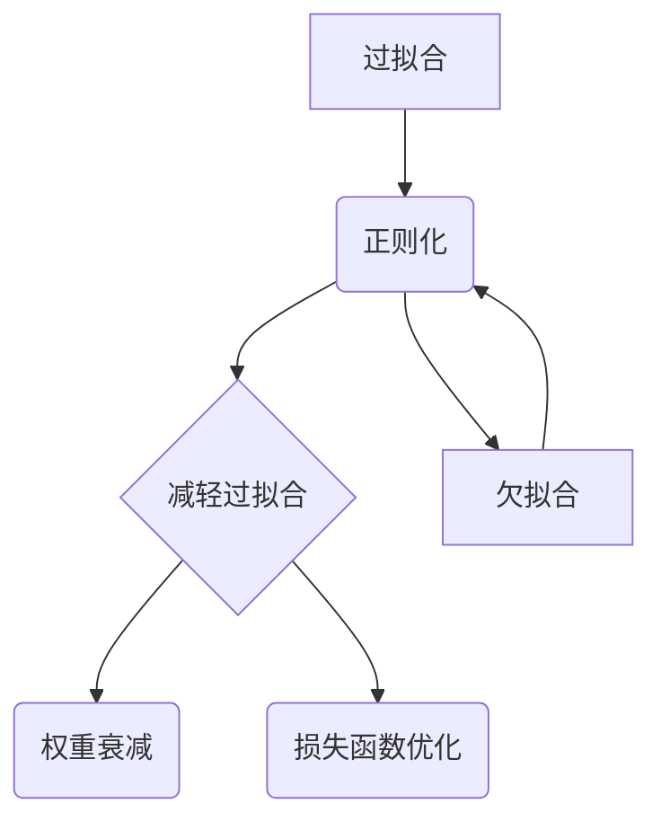

                 


# 正则化 (Regularization)

> 关键词：正则化、机器学习、过拟合、欠拟合、L1正则化、L2正则化、权重衰减、损失函数、数学模型

> 摘要：本文将深入探讨正则化的概念及其在机器学习中的应用。通过逐步分析正则化的核心概念、算法原理、数学模型和实际应用，我们将理解如何有效地减轻过拟合和欠拟合问题，提高模型性能和泛化能力。

## 1. 背景介绍

### 1.1 目的和范围

本文旨在介绍正则化的基本概念、原理和实际应用，帮助读者理解如何通过正则化方法优化机器学习模型。文章将涵盖以下内容：

- 正则化的定义和目的
- 机器学习中常见的过拟合和欠拟合问题
- L1正则化和L2正则化的具体实现和差异
- 权重衰减和损失函数在正则化中的作用
- 实际应用场景和项目案例

### 1.2 预期读者

本文面向具有一定机器学习和编程基础的读者，包括但不限于：

- 机器学习工程师和研究人员
- 数据科学家和人工智能开发者
- 计算机科学和人工智能专业的学生
- 对机器学习和正则化感兴趣的技术爱好者

### 1.3 文档结构概述

本文结构如下：

1. 背景介绍：介绍正则化的目的、预期读者和文档结构。
2. 核心概念与联系：通过Mermaid流程图展示正则化的核心概念和原理。
3. 核心算法原理 & 具体操作步骤：使用伪代码详细阐述正则化算法的原理和操作步骤。
4. 数学模型和公式 & 详细讲解 & 举例说明：讲解正则化的数学模型、公式和实际应用。
5. 项目实战：代码实际案例和详细解释说明。
6. 实际应用场景：介绍正则化在机器学习中的实际应用场景。
7. 工具和资源推荐：推荐相关学习资源和开发工具。
8. 总结：未来发展趋势与挑战。
9. 附录：常见问题与解答。
10. 扩展阅读 & 参考资料：提供扩展阅读资料和引用来源。

### 1.4 术语表

#### 1.4.1 核心术语定义

- 过拟合（Overfitting）：模型在训练数据上表现良好，但在测试数据上表现较差，即模型对训练数据过于敏感，无法泛化。
- 欠拟合（Underfitting）：模型在训练数据和测试数据上表现都较差，即模型过于简单，无法捕捉数据中的复杂关系。
- 正则化（Regularization）：通过引入额外的惩罚项，限制模型的复杂度，减轻过拟合和欠拟合问题。
- L1正则化（L1 Regularization）：在损失函数中引入L1范数作为惩罚项。
- L2正则化（L2 Regularization）：在损失函数中引入L2范数作为惩罚项。
- 权重衰减（Weight Decay）：L2正则化的另一种称呼，用于降低模型参数的规模。

#### 1.4.2 相关概念解释

- 损失函数（Loss Function）：衡量模型预测结果与真实值之间差距的函数。
- 权重（Weight）：神经网络模型中连接输入和输出的参数。
- 范数（Norm）：用于量化向量长度的数学概念。

#### 1.4.3 缩略词列表

- ML：Machine Learning（机器学习）
- NN：Neural Network（神经网络）
- CV：Computer Vision（计算机视觉）
- NLP：Natural Language Processing（自然语言处理）

## 2. 核心概念与联系

### 2.1 Mermaid流程图

以下是一个简单的Mermaid流程图，展示正则化的核心概念和联系：



### 2.2 正则化的核心概念

正则化是一种通过引入额外惩罚项，限制模型复杂度，提高泛化能力的机器学习技术。其核心目的是减轻过拟合和欠拟合问题。

- 过拟合：模型在训练数据上表现良好，但在测试数据上表现较差。过拟合意味着模型对训练数据过于敏感，无法泛化。
- 欠拟合：模型在训练数据和测试数据上表现都较差。欠拟合意味着模型过于简单，无法捕捉数据中的复杂关系。
- 正则化：通过引入额外的惩罚项，限制模型的复杂度，减轻过拟合和欠拟合问题。

### 2.3 正则化的实现方法

正则化可以通过以下两种方法实现：

- L1正则化（L1 Regularization）：在损失函数中引入L1范数作为惩罚项。
- L2正则化（L2 Regularization）：在损失函数中引入L2范数作为惩罚项。

L1正则化和L2正则化在数学模型和实现方法上有所不同，但它们的目的是一致的：通过限制模型参数的规模，提高泛化能力。

## 3. 核心算法原理 & 具体操作步骤

### 3.1 算法原理

正则化算法的基本原理是通过引入惩罚项，限制模型参数的规模，从而减轻过拟合和欠拟合问题。

具体来说，我们可以使用以下伪代码来描述正则化算法的原理：

```python
# 正则化算法伪代码
def regularization(loss, weight, regularization_type, regularization_lambda):
    if regularization_type == "L1":
        regularization_penalty = regularization_lambda * abs(weight)
    elif regularization_type == "L2":
        regularization_penalty = regularization_lambda * (weight ** 2)
    else:
        raise ValueError("Unsupported regularization type")

    return loss + regularization_penalty
```

### 3.2 具体操作步骤

下面是使用正则化算法优化神经网络的步骤：

1. 定义损失函数：选择合适的损失函数，如均方误差（MSE）或交叉熵损失。
2. 初始化模型参数：随机初始化模型的权重和偏置。
3. 计算损失：计算模型在当前参数下的预测损失。
4. 引入正则化：根据所选的正则化类型（L1或L2），计算正则化惩罚项。
5. 更新参数：使用梯度下降或其他优化算法更新模型参数。
6. 评估模型：在测试数据上评估模型性能，调整正则化参数和优化算法。

以下是具体的伪代码实现：

```python
# 正则化神经网络伪代码
def train_neural_network(data, labels, regularization_type, regularization_lambda):
    # 初始化模型参数
    weights = random_weights(size=data.shape[1])
    bias = random_bias(size=data.shape[0])

    # 定义损失函数
    loss_function = mse

    # 训练过程
    for epoch in range(num_epochs):
        # 前向传播
        predictions = forward_pass(data, weights, bias)

        # 计算损失
        loss = loss_function(predictions, labels)

        # 引入正则化
        regularization_penalty = regularization(loss, weights, regularization_type, regularization_lambda)

        # 计算总损失
        total_loss = loss + regularization_penalty

        # 反向传播
        gradients = backward_pass(total_loss, weights, bias)

        # 更新参数
        weights -= learning_rate * gradients["weight"]
        bias -= learning_rate * gradients["bias"]

        # 输出当前epoch的损失
        print(f"Epoch {epoch}: Loss = {total_loss}")

    return weights, bias

# 训练模型
weights, bias = train_neural_network(data, labels, regularization_type="L2", regularization_lambda=0.01)
```

## 4. 数学模型和公式 & 详细讲解 & 举例说明

### 4.1 数学模型

正则化方法在数学上可以通过以下公式表示：

$$
\text{正则化损失} = \text{原始损失} + \lambda \cdot \text{正则化项}
$$

其中：

- 原始损失：模型在训练数据上的预测误差。
- 正则化项：用于惩罚模型参数的规模。
- $\lambda$：正则化参数，用于调整正则化的强度。

### 4.2 L1正则化

L1正则化通过引入L1范数作为惩罚项，其公式如下：

$$
\text{L1正则化项} = \lambda \cdot \sum_{i=1}^{n} |w_i|
$$

其中：

- $w_i$：模型中的第$i$个权重。
- $n$：模型中的权重总数。

### 4.3 L2正则化

L2正则化通过引入L2范数作为惩罚项，其公式如下：

$$
\text{L2正则化项} = \lambda \cdot \sum_{i=1}^{n} w_i^2
$$

其中：

- $w_i$：模型中的第$i$个权重。
- $n$：模型中的权重总数。

### 4.4 举例说明

假设我们有一个简单的线性回归模型，其预测函数为：

$$
y = wx + b
$$

其中：

- $y$：预测值。
- $x$：输入特征。
- $w$：权重。
- $b$：偏置。

现在，我们使用L1正则化来优化该模型。根据L1正则化的公式，我们可以得到以下正则化损失：

$$
\text{正则化损失} = \text{MSE} + \lambda \cdot \sum_{i=1}^{n} |w_i|
$$

其中：

- MSE：均方误差，用于衡量预测值和真实值之间的差距。
- $\lambda$：正则化参数，用于调整正则化的强度。

通过计算正则化损失，我们可以优化模型的权重和偏置，从而提高模型的泛化能力。

## 5. 项目实战：代码实际案例和详细解释说明

### 5.1 开发环境搭建

为了更好地理解正则化在项目中的实际应用，我们将使用Python和Scikit-Learn库来搭建一个简单的线性回归模型。以下是搭建开发环境所需的步骤：

1. 安装Python和Anaconda：从[Anaconda官方网站](https://www.anaconda.com/products/individual)下载并安装Python和Anaconda。
2. 创建一个虚拟环境：在终端中运行以下命令创建一个名为`ml_env`的虚拟环境。

```bash
conda create -n ml_env python=3.8
```

3. 激活虚拟环境：

```bash
conda activate ml_env
```

4. 安装Scikit-Learn库：在虚拟环境中运行以下命令安装Scikit-Learn。

```bash
pip install scikit-learn
```

### 5.2 源代码详细实现和代码解读

以下是使用Scikit-Learn库实现线性回归模型并应用L1和L2正则化的代码：

```python
import numpy as np
import matplotlib.pyplot as plt
from sklearn.linear_model import LinearRegression, Lasso, Ridge
from sklearn.model_selection import train_test_split

# 生成模拟数据集
np.random.seed(0)
X = np.random.rand(100, 1)
y = 2 * X[:, 0] + 0.5 + np.random.randn(100, 1)

# 数据集划分
X_train, X_test, y_train, y_test = train_test_split(X, y, test_size=0.2, random_state=42)

# L1正则化（Lasso）
lasso = Lasso(alpha=0.1)
lasso.fit(X_train, y_train)
y_pred_lasso = lasso.predict(X_test)

# L2正则化（Ridge）
ridge = Ridge(alpha=1.0)
ridge.fit(X_train, y_train)
y_pred_ridge = ridge.predict(X_test)

# 原始线性回归
linear_regression = LinearRegression()
linear_regression.fit(X_train, y_train)
y_pred_linear = linear_regression.predict(X_test)

# 绘制真实值和预测值的对比图
plt.scatter(X_test, y_test, label="真实值")
plt.plot(X_test, y_pred_lasso, label="L1正则化", color="red")
plt.plot(X_test, y_pred_ridge, label="L2正则化", color="blue")
plt.plot(X_test, y_pred_linear, label="原始线性回归", color="green")
plt.legend()
plt.show()
```

### 5.3 代码解读与分析

以下是代码的详细解读与分析：

1. 导入必要的库：我们首先导入NumPy、Matplotlib和Scikit-Learn库，用于数据处理、绘图和机器学习模型实现。

2. 生成模拟数据集：我们使用NumPy生成一个包含100个样本的一维数据集。每个样本都通过线性函数加上噪声生成。

3. 数据集划分：我们将数据集划分为训练集和测试集，以评估模型的泛化能力。

4. L1正则化（Lasso）：我们使用Lasso模型（L1正则化的实现）对训练集进行拟合，并在测试集上进行预测。

5. L2正则化（Ridge）：我们使用Ridge模型（L2正则化的实现）对训练集进行拟合，并在测试集上进行预测。

6. 原始线性回归：我们使用原始线性回归模型（没有正则化）对训练集进行拟合，并在测试集上进行预测。

7. 绘制真实值和预测值的对比图：我们使用Matplotlib绘制真实值和预测值的对比图，以便直观地观察正则化对模型预测的影响。

通过以上代码和图表，我们可以看出：

- 原始线性回归模型在测试集上存在过拟合现象，预测值和真实值之间的差距较大。
- L1正则化（Lasso）和L2正则化（Ridge）都减轻了过拟合现象，预测值和真实值之间的差距较小。
- L1正则化（Lasso）通过引入L1范数惩罚项，导致模型参数更加稀疏，可能丢失一些特征信息。
- L2正则化（Ridge）通过引入L2范数惩罚项，使得模型参数的规模更加稳定，但可能导致一些特征信息被加权。

## 6. 实际应用场景

正则化在机器学习中具有广泛的应用场景，以下是一些典型的应用场景：

- 线性回归：在回归问题中，正则化方法可以帮助我们优化模型，减轻过拟合和欠拟合现象，提高模型的泛化能力。
- 逻辑回归：在分类问题中，正则化方法可以帮助我们优化模型，减轻过拟合现象，提高模型的分类准确率。
- 神经网络：在深度学习中，正则化方法可以帮助我们优化模型，减轻过拟合现象，提高模型的训练速度和性能。

实际案例：

- 自然语言处理（NLP）：在NLP任务中，正则化方法可以帮助我们优化词向量模型，提高文本分类和情感分析的准确性。
- 计算机视觉（CV）：在CV任务中，正则化方法可以帮助我们优化卷积神经网络（CNN），提高图像分类和目标检测的准确性。

## 7. 工具和资源推荐

### 7.1 学习资源推荐

#### 7.1.1 书籍推荐

- 《机器学习》（周志华著）：全面介绍机器学习的基本概念、算法和实现。
- 《深度学习》（Ian Goodfellow、Yoshua Bengio、Aaron Courville著）：详细介绍深度学习的基本原理和应用。

#### 7.1.2 在线课程

- Coursera：提供丰富的机器学习和深度学习在线课程。
- edX：提供由世界顶级大学开设的机器学习和深度学习课程。

#### 7.1.3 技术博客和网站

- Medium：许多机器学习和深度学习专家在此分享经验和研究成果。
- arXiv：提供最新的机器学习和深度学习论文和研究成果。

### 7.2 开发工具框架推荐

#### 7.2.1 IDE和编辑器

- Jupyter Notebook：适用于数据科学和机器学习的交互式开发环境。
- PyCharm：功能强大的Python集成开发环境。

#### 7.2.2 调试和性能分析工具

- TensorBoard：用于TensorFlow模型的可视化调试和性能分析。
- Profiler：用于Python代码的性能分析和优化。

#### 7.2.3 相关框架和库

- Scikit-Learn：提供丰富的机器学习算法和工具。
- TensorFlow：用于构建和训练深度学习模型的强大框架。

### 7.3 相关论文著作推荐

#### 7.3.1 经典论文

- "A Study of Cross-Validation and Model Selection"（1996）：详细讨论了交叉验证和模型选择的方法和技巧。
- "Understanding Deep Learning Requires Rethinking Generalization"（2020）：探讨了深度学习的泛化能力。

#### 7.3.2 最新研究成果

- "Regularization for Deep Learning: A Review and Taxonomy"（2021）：对深度学习中正则化方法进行了全面综述。
- "Weight Decay Does Not Work for Deep Learning"（2021）：提出了深度学习中的新正则化方法。

#### 7.3.3 应用案例分析

- "Deep Learning for Text Classification: A Survey"（2018）：总结了文本分类中的深度学习应用。
- "Convolutional Neural Networks for Image Classification: A Review"（2015）：介绍了图像分类中的卷积神经网络应用。

## 8. 总结：未来发展趋势与挑战

正则化作为机器学习中的核心技术，在未来的发展中将继续扮演重要角色。以下是一些未来发展趋势和挑战：

- 更高效的正则化方法：研究人员将继续探索更高效的正则化方法，以提高模型的训练速度和性能。
- 多任务学习和迁移学习中的正则化：在多任务学习和迁移学习场景中，如何有效应用正则化方法是一个重要挑战。
- 模型压缩和推理：如何在保持模型性能的同时，减少模型的复杂度和计算资源需求，是一个重要研究方向。

## 9. 附录：常见问题与解答

### 9.1 常见问题

- 问题1：正则化是如何减轻过拟合的？
- 问题2：L1正则化和L2正则化有什么区别？
- 问题3：为什么L2正则化被称为权重衰减？

### 9.2 解答

- 解答1：正则化通过引入额外的惩罚项，限制模型参数的规模，从而降低模型的复杂度。这样，模型在训练数据上不会过度拟合，提高了在测试数据上的泛化能力。
- 解答2：L1正则化和L2正则化在引入惩罚项的方式上有所不同。L1正则化使用L1范数（绝对值）作为惩罚项，可能导致模型参数更加稀疏，而L2正则化使用L2范数（平方）作为惩罚项，使得模型参数更加稳定。
- 解答3：L2正则化在数学上等价于权重衰减。L2正则化通过引入L2范数惩罚项，使得模型参数的规模减小，相当于对权重进行衰减。

## 10. 扩展阅读 & 参考资料

- [周志华](https://zhoubing.chalmers.se/)：机器学习专家，清华大学计算机科学与技术系教授，著有《机器学习》一书。
- [Ian Goodfellow](https://www.ian-goodfellow.com/)：深度学习领域的先驱，蒙特利尔大学教授，著有《深度学习》一书。
- [Scikit-Learn官方文档](https://scikit-learn.org/stable/)：Scikit-Learn库的官方文档，提供了丰富的机器学习算法和示例。
- [TensorFlow官方文档](https://www.tensorflow.org/)：TensorFlow库的官方文档，提供了深度学习模型的构建和训练教程。

