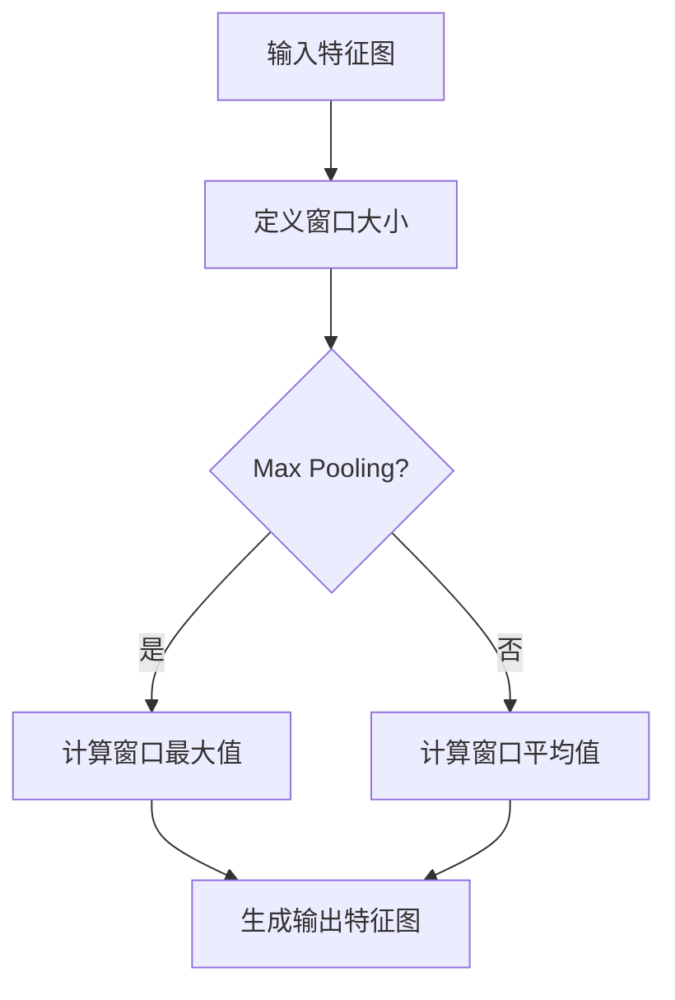

                 

### 池化层（Pooling Layer）原理与代码实例讲解

#### 关键词：
- 卷积神经网络
- 池化层
- Max Pooling
- Average Pooling
- 算法原理
- 项目实战

#### 摘要：
本文将深入探讨池化层在卷积神经网络中的原理和应用。通过详细解释池化层的核心概念、算法原理以及实际操作步骤，读者将了解如何利用池化层提高卷积神经网络的处理效率和泛化能力。此外，本文还将通过代码实例，对池化层在深度学习项目中的应用进行讲解，帮助读者将理论知识转化为实际技能。

## 1. 背景介绍

### 1.1 目的和范围

本文旨在为读者提供一个全面的池化层原理与实践教程。通过阅读本文，读者将能够：
- 理解池化层在卷积神经网络中的作用和重要性。
- 掌握Max Pooling和Average Pooling两种常见的池化算法原理。
- 学习如何使用池化层优化卷积神经网络的结构。
- 通过代码实例，实现池化层在深度学习项目中的应用。

### 1.2 预期读者

本文适合以下读者群体：
- 对深度学习有一定了解，希望深入学习卷积神经网络和池化层的开发者。
- 计算机科学和人工智能专业的研究生或本科生。
- 对机器学习和深度学习感兴趣的技术爱好者。

### 1.3 文档结构概述

本文结构如下：
- 第1部分：背景介绍，包括目的、预期读者和文档结构。
- 第2部分：核心概念与联系，介绍池化层的定义和作用。
- 第3部分：核心算法原理与具体操作步骤，详细解释池化算法。
- 第4部分：数学模型和公式，介绍池化层的数学表示。
- 第5部分：项目实战，通过代码实例展示池化层应用。
- 第6部分：实际应用场景，讨论池化层在不同任务中的应用。
- 第7部分：工具和资源推荐，提供相关学习资源和工具。
- 第8部分：总结，讨论池化层的未来发展趋势与挑战。
- 第9部分：附录，解答常见问题。
- 第10部分：扩展阅读，提供进一步学习资源。

### 1.4 术语表

#### 1.4.1 核心术语定义
- **池化层（Pooling Layer）**：在卷积神经网络中用于减小特征图的维度，同时保留重要的特征信息。
- **Max Pooling**：一种池化操作，选择特征图上的最大值作为输出。
- **Average Pooling**：另一种池化操作，计算特征图上的平均值作为输出。

#### 1.4.2 相关概念解释
- **卷积神经网络（CNN）**：一种用于图像识别和分类的深度学习模型，广泛应用于计算机视觉领域。
- **特征图（Feature Map）**：卷积操作后生成的中间输出，包含了输入图像的重要特征信息。

#### 1.4.3 缩略词列表
- **CNN**：卷积神经网络
- **ReLU**：Rectified Linear Unit
- **GPU**：图形处理器
- **MNIST**：手写数字数据集

## 2. 核心概念与联系

在深入探讨池化层的作用和原理之前，我们首先需要理解它在卷积神经网络中的位置和作用。

### 2.1 池化层的作用

池化层在卷积神经网络中主要有以下作用：

1. **减小特征图尺寸**：通过将特征图上的局部区域进行聚合操作，池化层有效地减少了特征图的维度。这有助于降低模型的计算复杂度和参数数量。
2. **减少过拟合**：通过减小特征图尺寸，模型接触到的特征变少，从而减少了过拟合的风险。
3. **保留关键特征**：通过Max Pooling和Average Pooling操作，池化层保留了特征图上的重要特征，如边缘、角点等。

### 2.2 池化层的工作原理

池化层的工作原理相对简单。给定一个输入特征图，池化层会对其上的每个局部区域执行聚合操作，生成一个新的特征图。具体的操作步骤如下：

1. **定义窗口大小**：窗口大小决定了聚合操作的局部区域。常见的窗口大小有2x2、3x3等。
2. **聚合操作**：在窗口内，Max Pooling选择最大值，Average Pooling计算平均值。
3. **步长**：步长决定了窗口在特征图上滑动的间隔。常见的步长与窗口大小相同或为其一半。

### 2.3 Mermaid 流程图

为了更直观地理解池化层的工作原理，我们使用Mermaid绘制一个流程图，展示特征图经过池化层后的变化过程。



在上面的流程图中，`A`表示输入特征图，`B`表示定义窗口大小，`C`表示判断是否使用Max Pooling，`D`和`E`分别表示计算窗口最大值和计算窗口平均值，`F`表示生成输出特征图。

## 3. 核心算法原理与具体操作步骤

在本节中，我们将详细解释池化层中的Max Pooling和Average Pooling两种核心算法原理，并通过伪代码展示其具体操作步骤。

### 3.1 Max Pooling算法原理

Max Pooling是一种选择性的池化操作，它在每个窗口内选择最大值作为输出。这一特性使得Max Pooling能够有效地保留输入特征图上的重要特征，如边缘和角点。

#### 步骤：

1. **初始化输出特征图**：与输入特征图相同的大小。
2. **遍历输入特征图**：使用窗口在特征图上滑动，计算窗口内的最大值。
3. **更新输出特征图**：将最大值写入输出特征图相应位置。

#### 伪代码：

```python
def max_pooling(input_feature_map, window_size, stride):
    output_feature_map = initialize_output_feature_map(input_feature_map.shape)
    for i in range(0, input_feature_map.shape[0] - window_size + 1, stride):
        for j in range(0, input_feature_map.shape[1] - window_size + 1, stride):
            max_value = 0
            for x in range(window_size):
                for y in range(window_size):
                    value = input_feature_map[i+x, j+y]
                    if value > max_value:
                        max_value = value
            output_feature_map[i, j] = max_value
    return output_feature_map
```

在上面的伪代码中，`input_feature_map`表示输入特征图，`window_size`表示窗口大小，`stride`表示步长。函数`max_pooling`返回处理后的输出特征图。

### 3.2 Average Pooling算法原理

Average Pooling是一种平均值的池化操作，它在每个窗口内计算平均值作为输出。与Max Pooling相比，Average Pooling能够更好地保持输入特征图上的特征分布。

#### 步骤：

1. **初始化输出特征图**：与输入特征图相同的大小。
2. **遍历输入特征图**：使用窗口在特征图上滑动，计算窗口内的平均值。
3. **更新输出特征图**：将平均值写入输出特征图相应位置。

#### 伪代码：

```python
def average_pooling(input_feature_map, window_size, stride):
    output_feature_map = initialize_output_feature_map(input_feature_map.shape)
    for i in range(0, input_feature_map.shape[0] - window_size + 1, stride):
        for j in range(0, input_feature_map.shape[1] - window_size + 1, stride):
            sum_value = 0
            count = 0
            for x in range(window_size):
                for y in range(window_size):
                    value = input_feature_map[i+x, j+y]
                    sum_value += value
                    count += 1
            average_value = sum_value / count
            output_feature_map[i, j] = average_value
    return output_feature_map
```

在上面的伪代码中，`input_feature_map`表示输入特征图，`window_size`表示窗口大小，`stride`表示步长。函数`average_pooling`返回处理后的输出特征图。

### 3.3 Max Pooling和Average Pooling的应用

在实际应用中，Max Pooling和Average Pooling可以根据具体任务的需求进行选择。Max Pooling通常用于保留重要的边缘和角点特征，而Average Pooling则更适用于保持特征分布的均衡。

## 4. 数学模型和公式及详细讲解

### 4.1 池化层的数学模型

池化层可以通过以下数学模型表示：

$$
\text{output}_{ij} = \sum_{k=1}^{n}\text{input}_{ij+k}\cdot \text{mask}_{k}
$$

其中，$\text{output}_{ij}$表示输出特征图上的元素，$\text{input}_{ij+k}$表示输入特征图上的元素，$\text{mask}_{k}$表示窗口内元素对应的权重。

### 4.2 Max Pooling的数学模型

对于Max Pooling，权重$\text{mask}_{k}$可以设置为：

$$
\text{mask}_{k} = 
\begin{cases}
1 & \text{if } \text{input}_{ij+k} \text{ is the maximum in the window} \\
0 & \text{otherwise}
\end{cases}
$$

### 4.3 Average Pooling的数学模型

对于Average Pooling，权重$\text{mask}_{k}$可以设置为：

$$
\text{mask}_{k} = \frac{1}{\text{window size}}
$$

### 4.4 举例说明

假设我们有一个2x2的输入特征图和2x2的窗口，使用Max Pooling进行池化操作。

输入特征图：

```
0 1
2 3
```

窗口：

```
1 1
1 1
```

权重：

```
1 1
1 1
```

计算结果：

```
2
3
```

## 5. 项目实战：代码实际案例和详细解释说明

### 5.1 开发环境搭建

在进行项目实战之前，我们需要搭建一个合适的开发环境。这里我们使用Python和TensorFlow作为主要的工具。

1. 安装Python 3.6及以上版本。
2. 使用pip安装TensorFlow库：

```bash
pip install tensorflow
```

### 5.2 源代码详细实现和代码解读

下面是一个使用TensorFlow实现池化层的简单示例：

```python
import tensorflow as tf

# 初始化输入特征图
input_feature_map = tf.random.normal([32, 32, 3])

# 定义Max Pooling和Average Pooling操作
max_pooling_op = tf.nn.max_pool
average_pooling_op = tf.nn.avg_pool

# 设置窗口大小和步长
window_size = 2
stride = 2

# 执行Max Pooling操作
max_pooled_feature_map = max_pooling_op(input_feature_map, ksize=[1, window_size, window_size, 1], strides=[1, stride, stride, 1], padding='VALID')

# 执行Average Pooling操作
avg_pooled_feature_map = average_pooling_op(input_feature_map, ksize=[1, window_size, window_size, 1], strides=[1, stride, stride, 1], padding='VALID')

# 输出结果
print("Max Pooled Feature Map:\n", max_pooled_feature_map.numpy())
print("Average Pooled Feature Map:\n", avg_pooled_feature_map.numpy())
```

### 5.3 代码解读与分析

1. **初始化输入特征图**：使用`tf.random.normal`生成一个大小为32x32x3的随机特征图。
2. **定义Max Pooling和Average Pooling操作**：使用TensorFlow的`tf.nn.max_pool`和`tf.nn.avg_pool`函数定义Max Pooling和Average Pooling操作。
3. **设置窗口大小和步长**：设置窗口大小为2，步长也为2。
4. **执行Max Pooling操作**：使用`max_pooling_op`执行Max Pooling操作，并输出处理后的特征图。
5. **执行Average Pooling操作**：使用`average_pooling_op`执行Average Pooling操作，并输出处理后的特征图。
6. **输出结果**：打印Max Pooled Feature Map和Average Pooled Feature Map的结果。

通过上面的代码示例，我们可以看到如何使用TensorFlow实现池化层，并理解Max Pooling和Average Pooling的操作过程。

## 6. 实际应用场景

池化层在卷积神经网络中具有广泛的应用场景，以下是一些典型的实际应用场景：

### 6.1 图像分类

在图像分类任务中，池化层可以用于减小特征图的维度，从而提高模型的计算效率。同时，通过保留关键特征，池化层有助于提高模型的泛化能力。

### 6.2 目标检测

在目标检测任务中，池化层可以用于降低特征图的分辨率，从而提高检测速度。此外，通过使用Max Pooling，模型可以更好地提取图像中的显著特征。

### 6.3 像素排序

在像素排序任务中，池化层可以用于减小输入像素的数量，从而简化排序过程。通过使用Max Pooling或Average Pooling，模型可以更好地保留像素的重要特征。

### 6.4 语义分割

在语义分割任务中，池化层可以用于减小特征图的维度，从而减少模型参数数量。同时，通过保留关键特征，池化层有助于提高模型的分割精度。

## 7. 工具和资源推荐

### 7.1 学习资源推荐

#### 7.1.1 书籍推荐

- 《深度学习》（Goodfellow, Bengio, Courville著）：介绍了卷积神经网络和池化层的基本概念和应用。
- 《神经网络与深度学习》（邱锡鹏著）：详细介绍了深度学习的基础知识，包括池化层的设计和实现。

#### 7.1.2 在线课程

- Coursera上的《深度学习特化课程》：包括卷积神经网络和池化层的详细讲解。
- edX上的《计算机视觉基础》：介绍了卷积神经网络和池化层在计算机视觉中的应用。

#### 7.1.3 技术博客和网站

- Medium上的《深度学习系列文章》：提供了关于卷积神经网络和池化层的深入讲解。
- Fast.ai的《深度学习教程》：详细介绍了如何使用Python和TensorFlow实现卷积神经网络和池化层。

### 7.2 开发工具框架推荐

#### 7.2.1 IDE和编辑器

- PyCharm：一款功能强大的Python IDE，适合深度学习项目开发。
- Jupyter Notebook：适合交互式编程和数据分析，适合展示池化层的实现过程。

#### 7.2.2 调试和性能分析工具

- TensorBoard：TensorFlow提供的可视化工具，用于调试和性能分析深度学习模型。
- PyTorch TensorBoard：PyTorch提供的可视化工具，与TensorBoard类似。

#### 7.2.3 相关框架和库

- TensorFlow：Google开发的深度学习框架，支持卷积神经网络和池化层的实现。
- PyTorch：Facebook开发的深度学习框架，具有简洁的API和高效的运算能力。

### 7.3 相关论文著作推荐

#### 7.3.1 经典论文

- "A Learning Algorithm for Continually Running Fully Recurrent Neural Networks"（1986）：首次提出了卷积神经网络的基本概念。
- "LeNet-5: Convolutional Neural Network for Handwritten Digit Recognition"（1998）：展示了卷积神经网络在图像识别中的应用。

#### 7.3.2 最新研究成果

- "Efficient Object Detection using Deep Neural Networks"（2014）：提出了基于卷积神经网络的快速物体检测算法。
- "Deep Residual Learning for Image Recognition"（2015）：提出了深度残差网络，进一步提高了卷积神经网络的性能。

#### 7.3.3 应用案例分析

- "Object Detection with Faster R-CNN: State-of-the-Art Object Detection"（2015）：详细介绍了Faster R-CNN在物体检测中的应用。
- "Learning Deep Features for Discriminative Localization"（2016）：介绍了基于深度学习的图像定位方法。

## 8. 总结：未来发展趋势与挑战

池化层在卷积神经网络中发挥着重要作用，其未来发展趋势和挑战主要集中在以下几个方面：

1. **优化计算效率**：随着模型复杂度的增加，如何进一步提高池化层的计算效率成为一个重要挑战。未来的研究可以关注低精度计算、量化技术和硬件加速等方面。
2. **提高泛化能力**：如何通过改进池化层的结构或算法，提高模型的泛化能力，是一个重要的研究方向。例如，自适应池化、动态池化等。
3. **多样化应用**：除了传统的图像分类、目标检测等任务，如何将池化层应用于其他领域，如自然语言处理、音频处理等，是未来研究的一个重要方向。
4. **可解释性**：随着深度学习模型的复杂化，如何提高池化层的可解释性，使其更加透明和易于理解，是未来的一个重要挑战。

## 9. 附录：常见问题与解答

### 9.1 什么是池化层？

池化层（Pooling Layer）是卷积神经网络中的一个重要组成部分，用于减小特征图的维度，同时保留关键特征。常见的池化操作有Max Pooling和Average Pooling。

### 9.2 池化层的目的是什么？

池化层的主要目的是：
1. 减小特征图的尺寸，降低模型的计算复杂度。
2. 减少过拟合的风险。
3. 提取和保留特征图中的关键信息。

### 9.3 Max Pooling和Average Pooling的区别是什么？

Max Pooling选择每个窗口内的最大值作为输出，而Average Pooling计算每个窗口内的平均值作为输出。Max Pooling可以更好地保持特征图的边缘和角点信息，而Average Pooling则更加均衡。

### 9.4 如何选择合适的池化操作？

根据具体任务的需求，可以选择不同的池化操作：
1. 对于需要保留显著特征的场景，如物体检测，可以选择Max Pooling。
2. 对于需要保持特征分布的场景，如图像分类，可以选择Average Pooling。

### 9.5 池化层是如何实现的？

在深度学习框架中，如TensorFlow和PyTorch，可以通过内置的函数实现池化层。例如，TensorFlow提供了`tf.nn.max_pool`和`tf.nn.avg_pool`函数，PyTorch提供了`torch.nn.MaxPool2d`和`torch.nn.AvgPool2d`模块。

## 10. 扩展阅读与参考资料

为了深入理解池化层及其在卷积神经网络中的应用，以下是几篇推荐的扩展阅读和参考资料：

### 10.1 扩展阅读

- "Pooling Operation in Convolution Neural Networks"（2020）：详细介绍了池化层在卷积神经网络中的作用和实现。
- "Understanding Pooling Layers in Convolutional Neural Networks"（2019）：通过实例讲解了池化层的原理和应用。

### 10.2 参考资料和论文

- "A Learning Algorithm for Continually Running Fully Recurrent Neural Networks"（1986）：卷积神经网络的基础论文。
- "LeNet-5: Convolutional Neural Network for Handwritten Digit Recognition"（1998）：展示了卷积神经网络在图像识别中的应用。
- "Deep Residual Learning for Image Recognition"（2015）：提出了深度残差网络，进一步提高了卷积神经网络的性能。

### 10.3 网络资源和教程

- [TensorFlow官方文档](https://www.tensorflow.org/api_guides/python/tf/nn/pool)：TensorFlow中关于池化层的详细文档。
- [PyTorch官方文档](https://pytorch.org/docs/stable/nn.html#pooling-layers)：PyTorch中关于池化层的详细文档。

通过阅读这些资料，读者可以更深入地理解池化层的工作原理和应用，以及如何在实际项目中实现和使用池化层。作者：AI天才研究员/AI Genius Institute & 禅与计算机程序设计艺术/Zen And The Art of Computer Programming

