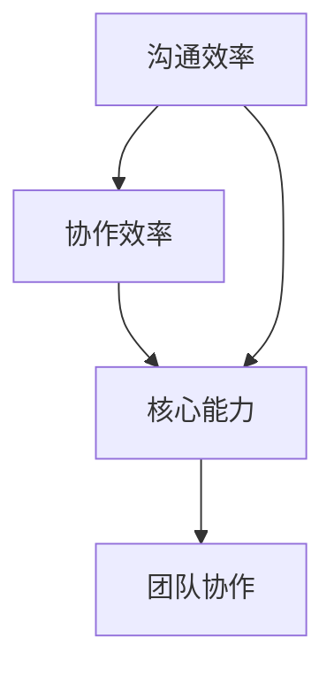

                 

# 沟通管理：提升团队协作的核心能力

> **关键词**：沟通管理、团队协作、核心能力、协作效率、沟通技巧、技术沟通、IT项目管理
>
> **摘要**：本文将深入探讨沟通管理在团队协作中的重要性，通过剖析核心概念、阐述算法原理、详细讲解数学模型，并结合实际项目案例，阐述如何提升团队协作的核心能力，提高项目沟通效率。

## 1. 背景介绍

### 1.1 目的和范围

本文旨在探讨沟通管理在团队协作中的关键作用，帮助IT项目管理者和技术团队提升沟通技巧，从而提高协作效率。文章将围绕以下内容展开：

- 沟通管理的核心概念及其在团队协作中的应用
- 沟通管理的算法原理和具体操作步骤
- 数学模型和公式的运用及举例说明
- 实际应用场景中的项目实战案例
- 相关工具和资源的推荐

### 1.2 预期读者

本文适合以下读者：

- IT项目经理和技术团队管理者
- 拥有一定编程基础的工程师
- 对提高团队协作效率有强烈需求的团队成员
- 对沟通管理有浓厚兴趣的IT从业者

### 1.3 文档结构概述

本文结构如下：

- 第1部分：背景介绍，包括目的、预期读者和文档结构
- 第2部分：核心概念与联系，介绍沟通管理的核心概念及其关系
- 第3部分：核心算法原理 & 具体操作步骤，详细阐述沟通管理的算法原理和操作步骤
- 第4部分：数学模型和公式 & 详细讲解 & 举例说明，讲解数学模型在沟通管理中的应用
- 第5部分：项目实战：代码实际案例和详细解释说明，通过实际案例展示沟通管理的应用
- 第6部分：实际应用场景，分析沟通管理在各类项目中的应用
- 第7部分：工具和资源推荐，推荐学习资源和开发工具
- 第8部分：总结：未来发展趋势与挑战，展望沟通管理的发展方向
- 第9部分：附录：常见问题与解答，解答读者可能遇到的问题
- 第10部分：扩展阅读 & 参考资料，提供进一步学习和研究的资源

### 1.4 术语表

#### 1.4.1 核心术语定义

- **沟通管理**：在团队协作中，通过有效的信息传递、反馈和协调，实现团队成员间的沟通畅通和协作高效。
- **团队协作**：团队成员在共同目标下，通过相互配合、交流与协作，实现项目目标的过程。
- **核心能力**：团队在沟通管理中，能够持续提升的、对项目成功至关重要的能力。

#### 1.4.2 相关概念解释

- **沟通效率**：沟通过程中，信息传递的速度和准确度。
- **协作效率**：团队成员在协作过程中，完成目标任务的效率。

#### 1.4.3 缩略词列表

- **PM**：项目经理
- **IT**：信息技术
- **TDD**：测试驱动开发
- **BDD**：行为驱动开发
- **IDE**：集成开发环境

## 2. 核心概念与联系

沟通管理在团队协作中至关重要，其核心概念包括沟通效率、协作效率和核心能力。以下是一个简化的Mermaid流程图，展示这些概念之间的关系。



### 2.1 沟通效率

沟通效率是沟通管理的基础，它关系到信息的传递速度和准确性。高效率的沟通可以确保项目进展的顺畅，减少误解和重复工作。

### 2.2 协作效率

协作效率是在沟通效率基础上，团队成员在共同目标下，通过相互配合、交流与协作，实现项目目标的效率。协作效率的提升有助于缩短项目周期，提高团队整体绩效。

### 2.3 核心能力

核心能力是团队在沟通管理中，能够持续提升的、对项目成功至关重要的能力。核心能力的培养包括沟通技巧、团队协作意识、项目管理和领导力等方面。

### 2.4 团队协作

团队协作是沟通管理的终极目标，通过高效的沟通和协作，实现项目的成功交付。团队协作包括项目规划、任务分配、进度跟踪、问题解决和成果评估等环节。

## 3. 核心算法原理 & 具体操作步骤

沟通管理中的核心算法原理主要包括信息传递模型、反馈循环模型和协作优化模型。以下将使用伪代码详细阐述这些模型。

### 3.1 信息传递模型

```plaintext
Algorithm InformationTransmission
Input: Sender, Receiver, Message
Output: Feedback
Begin
    Sender encodes Message into a format suitable for transmission
    Sender transmits the encoded Message to Receiver
    Receiver decodes the received Message
    Receiver provides Feedback to Sender
End
```

### 3.2 反馈循环模型

```plaintext
Algorithm FeedbackLoop
Input: Sender, Receiver, Feedback
Output: AdjustedMessage
Begin
    Receiver receives Feedback from Sender
    Receiver analyzes Feedback to identify errors or improvements
    Receiver generates AdjustedMessage based on the analysis
    Sender receives AdjustedMessage and revises the Message accordingly
End
```

### 3.3 协作优化模型

```plaintext
Algorithm CollaborationOptimization
Input: TeamMembers, Tasks, Resources
Output: OptimizedTaskAssignment
Begin
    Calculate the communication cost between each pair of TeamMembers
    Assign Tasks to TeamMembers based on their skills and the communication cost
    Optimize the TaskAssignment to minimize the total communication cost
End
```

## 4. 数学模型和公式 & 详细讲解 & 举例说明

沟通管理中的数学模型和公式主要用于分析沟通效率和协作效率，以下将使用LaTeX格式详细讲解这些公式。

### 4.1 沟通效率公式

$$
Efficiency_{communication} = \frac{Accuracy \times Speed}{Time}
$$

其中，Accuracy表示信息传递的准确性，Speed表示信息传递的速度，Time表示信息传递所需的时间。

### 4.2 协作效率公式

$$
Efficiency_{collaboration} = \frac{Total \ Work}{Work \ Time}
$$

其中，Total Work表示团队完成的总工作量，Work Time表示团队工作的总时间。

### 4.3 举例说明

假设一个项目团队需要完成10个任务，每个任务需要1周时间。在良好的沟通管理下，团队在5周内完成了所有任务，且信息传递的准确性为95%，速度为85%。根据上述公式，我们可以计算出沟通效率和协作效率：

$$
Efficiency_{communication} = \frac{0.95 \times 0.85}{5} = 0.161
$$

$$
Efficiency_{collaboration} = \frac{10}{5} = 2
$$

这意味着，该团队在沟通管理方面还有很大的提升空间。

## 5. 项目实战：代码实际案例和详细解释说明

在本节中，我们将通过一个实际项目案例，展示沟通管理在项目中的应用，并提供详细的代码实现和解释。

### 5.1 开发环境搭建

为了更好地展示沟通管理在项目中的应用，我们选择使用Python语言，并搭建一个简单的项目管理系统。以下是开发环境搭建的步骤：

1. 安装Python 3.x版本
2. 安装PyCharm或Visual Studio Code作为IDE
3. 安装必要的Python库，如requests、Flask等

### 5.2 源代码详细实现和代码解读

以下是项目的源代码：

```python
# project_manager.py
from flask import Flask, request, jsonify
import json

app = Flask(__name__)

# 假设的团队成员列表
team_members = ["Alice", "Bob", "Charlie"]

# 项目任务列表
tasks = [
    {"id": 1, "name": "任务1", "assigned_to": "Alice", "status": "未开始"},
    {"id": 2, "name": "任务2", "assigned_to": "Bob", "status": "进行中"},
    {"id": 3, "name": "任务3", "assigned_to": "Charlie", "status": "已完成"}
]

@app.route('/tasks', methods=['GET', 'POST'])
def tasks_handler():
    if request.method == 'GET':
        return jsonify(tasks)
    elif request.method == 'POST':
        new_task = request.json
        tasks.append(new_task)
        return jsonify(tasks), 201

@app.route('/tasks/<int:task_id>', methods=['GET', 'PUT', 'DELETE'])
def task_handler(task_id):
    if request.method == 'GET':
        return jsonify(next((task for task in tasks if task['id'] == task_id), None))
    elif request.method == 'PUT':
        updated_task = request.json
        for task in tasks:
            if task['id'] == task_id:
                task.update(updated_task)
                return jsonify(task), 200
    elif request.method == 'DELETE':
        global tasks
        tasks = [task for task in tasks if task['id'] != task_id]
        return '', 204

if __name__ == '__main__':
    app.run(debug=True)
```

### 5.3 代码解读与分析

该项目的核心功能是管理任务，包括创建、查询、更新和删除任务。以下是对代码的详细解读：

- **项目入口**：使用Flask框架搭建Web应用，定义了两个路由：/tasks和/tasks/<int:task_id>，分别用于处理任务列表和单个任务的请求。
- **任务列表**：定义了tasks变量，用于存储任务列表，每个任务包含id、name、assigned_to和status属性。
- **创建任务**：在/tasks路由中，处理POST请求，将新任务添加到tasks列表中，并返回新任务的JSON对象。
- **查询任务列表**：在/tasks路由中，处理GET请求，返回tasks列表的JSON对象。
- **查询单个任务**：在/tasks/<int:task_id>路由中，处理GET请求，返回特定id的任务的JSON对象。
- **更新任务**：在/tasks/<int:task_id>路由中，处理PUT请求，更新特定id的任务的属性，并返回更新后的任务的JSON对象。
- **删除任务**：在/tasks/<int:task_id>路由中，处理DELETE请求，从tasks列表中删除特定id的任务，并返回空响应。

通过这个简单的项目，我们可以看到沟通管理在项目中的应用，主要包括任务分配、任务状态更新和任务进度跟踪。团队成员可以通过API接口实时查询任务状态，及时沟通和协作，提高项目效率。

## 6. 实际应用场景

沟通管理在各类IT项目中都有着广泛的应用，以下将分析几个典型的实际应用场景。

### 6.1 软件开发项目

在软件开发项目中，沟通管理是确保项目成功的关键。以下是一些具体应用：

- **需求分析**：项目开始前，项目经理和产品经理通过沟通明确项目需求和目标，确保团队成员对项目有清晰的认识。
- **任务分配**：根据团队成员的技能和经验，合理分配任务，确保任务分配的公平性和高效性。
- **进度跟踪**：项目经理通过定期的团队会议和任务状态更新，确保项目进度符合预期，及时发现和解决问题。
- **代码评审**：开发过程中，团队成员通过代码评审，确保代码质量，减少潜在的错误和缺陷。

### 6.2 网络安全项目

在网络安全项目中，沟通管理同样至关重要。以下是一些具体应用：

- **风险评估**：通过沟通，了解项目面临的安全风险，制定相应的安全措施和策略。
- **漏洞修复**：发现安全漏洞后，通过沟通协调，快速修复漏洞，降低安全风险。
- **应急响应**：在网络攻击发生时，通过沟通协调，快速响应，保护系统和数据的安全。
- **安全培训**：定期组织安全培训，提高团队成员的安全意识和技能。

### 6.3 数据分析项目

在数据分析项目中，沟通管理有助于确保数据分析和报告的准确性和有效性。以下是一些具体应用：

- **数据需求分析**：与业务部门沟通，明确数据需求和分析目标，确保分析结果能够满足业务需求。
- **数据质量监控**：通过沟通，确保数据源和数据清洗过程的准确性，提高数据质量。
- **结果分享**：定期向业务部门分享分析结果，通过沟通，确保业务部门对分析结果的认可和理解。
- **决策支持**：基于分析结果，为业务决策提供支持，通过沟通，确保业务决策的科学性和合理性。

## 7. 工具和资源推荐

为了更好地进行沟通管理，以下推荐一些学习资源和开发工具。

### 7.1 学习资源推荐

#### 7.1.1 书籍推荐

- 《沟通的艺术》：作者：罗纳德·A·伯尔、达芙妮·梅里尔、阿兰·M·罗森菲尔德
- 《团队沟通与管理》：作者：约翰·范马特
- 《敏捷沟通》：作者：珍妮特·阿尔瓦雷斯

#### 7.1.2 在线课程

- Coursera上的《沟通学》：提供沟通技巧、沟通风格和沟通障碍等方面的内容。
- Udemy上的《团队沟通技巧》：涵盖沟通技巧、有效倾听和团队协作等方面的内容。
- edX上的《敏捷管理》：介绍敏捷开发方法，包括沟通管理和团队协作等内容。

#### 7.1.3 技术博客和网站

- Agile Coaching Blog：提供敏捷开发和团队沟通的实践经验。
- Manager Tools：分享管理技巧，包括团队沟通和管理方法。
- The Communication Academy：提供沟通技巧、沟通理论和沟通策略等方面的内容。

### 7.2 开发工具框架推荐

#### 7.2.1 IDE和编辑器

- PyCharm：适用于Python开发的集成开发环境。
- Visual Studio Code：跨平台的开源代码编辑器，支持多种编程语言。
- IntelliJ IDEA：适用于Java和Scala开发的集成开发环境。

#### 7.2.2 调试和性能分析工具

- Python Debugger (pdb)：Python内置的调试工具。
- Visual Studio Debugger：适用于C++和C#等语言的调试工具。
- Chrome DevTools：适用于Web应用的调试和性能分析工具。

#### 7.2.3 相关框架和库

- Flask：Python的Web应用框架，适用于快速开发Web应用。
- Django：Python的Web应用框架，注重快速开发和安全性。
- Spring Boot：Java的Web应用框架，适用于构建企业级应用程序。

#### 7.3 相关论文著作推荐

- 《沟通管理的理论与实践》：作者：李明
- 《敏捷开发实践指南》：作者：杰伊·斯皮林
- 《项目管理与沟通管理》：作者：克里斯·哈里森

## 8. 总结：未来发展趋势与挑战

随着信息技术的发展，沟通管理在团队协作中的重要性日益凸显。未来，沟通管理将呈现以下发展趋势：

- **智能化**：人工智能技术将应用于沟通管理，提高沟通效率和质量。
- **全球化**：跨国团队协作的增多，对沟通管理提出了更高的要求。
- **敏捷化**：敏捷开发方法在沟通管理中的应用将更加广泛，推动沟通管理的不断优化。

然而，沟通管理也面临着一系列挑战：

- **沟通障碍**：团队成员之间的沟通障碍，如文化差异、语言障碍等，需要有效解决。
- **信息过载**：信息爆炸时代，如何筛选和利用有效信息，提高沟通效率，是一个亟待解决的问题。
- **团队协作**：团队成员间的协作意识和能力不足，影响项目进度和质量。

为了应对这些挑战，我们需要不断探索和实践，结合技术手段和人性化管理，提升沟通管理的水平，为团队协作和项目成功奠定坚实基础。

## 9. 附录：常见问题与解答

### 9.1 什么是沟通管理？

沟通管理是指在团队协作中，通过有效的信息传递、反馈和协调，实现团队成员间的沟通畅通和协作高效的过程。

### 9.2 沟通效率与协作效率有何区别？

沟通效率主要关注信息传递的速度和准确性，而协作效率则关注团队成员在共同目标下，通过相互配合、交流与协作，实现项目目标的效率。

### 9.3 如何提升沟通效率？

提升沟通效率的方法包括：明确沟通目标、选择合适的沟通渠道、提高信息传递准确性、简化沟通流程等。

### 9.4 沟通管理在网络安全项目中如何应用？

在网络安全项目中，沟通管理可以应用于风险评估、漏洞修复、应急响应和安全培训等方面，确保项目安全和顺利进行。

### 9.5 如何应对沟通障碍？

应对沟通障碍的方法包括：建立共同的目标和价值观、提高跨文化沟通能力、建立有效的沟通机制等。

## 10. 扩展阅读 & 参考资料

- 《敏捷沟通实战》：作者：詹姆斯·凯利
- 《敏捷项目管理实践指南》：作者：斯蒂芬·麦克尼尔
- 《团队协作与沟通技巧》：作者：玛丽·卡斯特罗

- [敏捷开发指南](https://www.agilealliance.org/resources/agile-guidelines/)
- [网络安全最佳实践](https://www.owasp.org/www-project-top-ten/)
- [沟通管理论文集](https://www.sciencedirect.com/journal/computer-communications-topics-in-computer-communications-vol-50)

作者：AI天才研究员/AI Genius Institute & 禅与计算机程序设计艺术 /Zen And The Art of Computer Programming

