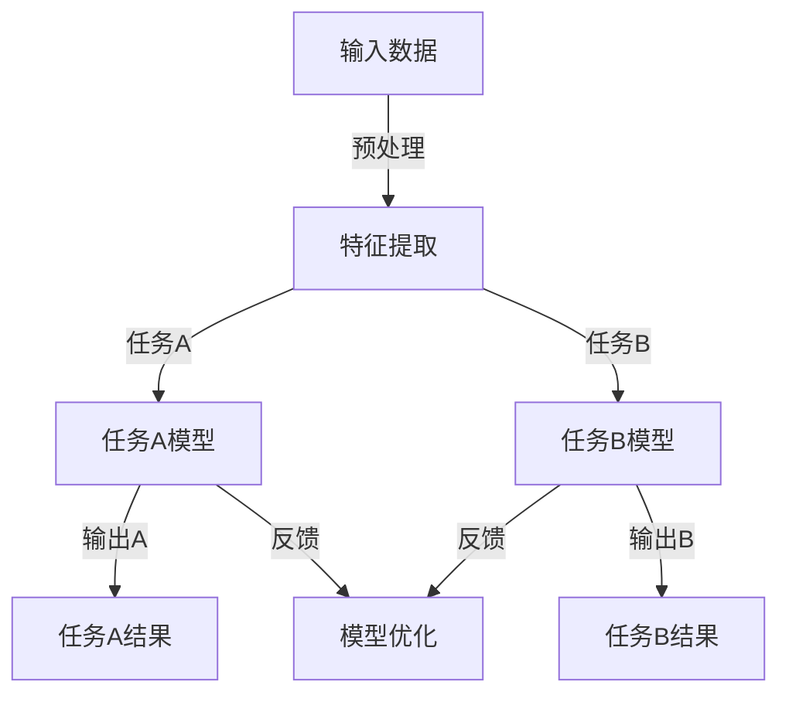
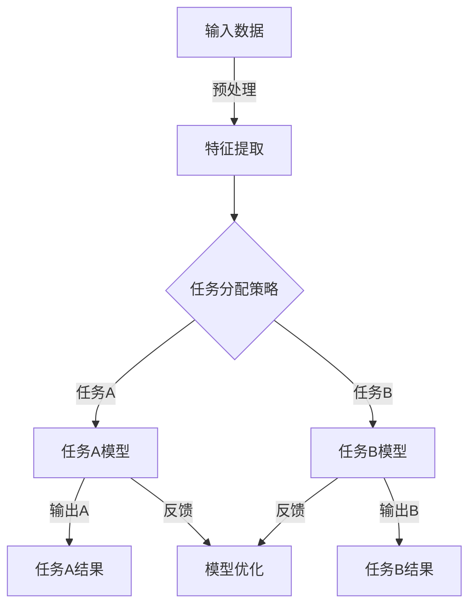

                 

# 注意力平衡仪调校师：AI时代的认知资源分配专家

> 关键词：注意力分配、认知资源、AI、多任务处理、算法优化、人机交互

> 摘要：本文将探讨在AI技术飞速发展的背景下，如何通过优化注意力分配算法，实现认知资源的合理利用。文章首先介绍了注意力平衡仪调校师这一新兴职业的背景和重要性，然后深入分析了核心概念和原理，通过具体的算法步骤和数学模型，展示了如何在复杂的AI系统中实现注意力平衡，最后通过实际案例和工具推荐，为读者提供实用的技术指导和未来发展的思考。

## 1. 背景介绍

### 1.1 目的和范围

本文旨在探讨AI时代下的认知资源分配问题，特别是在多任务处理和人机交互场景中如何优化注意力分配。通过深入分析注意力平衡算法，本文希望为相关领域的研发人员提供理论依据和实践指导。

### 1.2 预期读者

本文适合对人工智能、认知科学、算法设计感兴趣的专业人士，以及希望在AI领域有所建树的科研人员和学生。

### 1.3 文档结构概述

本文分为八个部分：首先介绍背景知识；接着详细阐述注意力平衡仪调校师的核心概念和原理；然后通过伪代码和数学模型分析核心算法；随后通过实战案例展示应用效果；再探讨实际应用场景；推荐相关工具和资源；总结未来发展趋势和挑战；最后提供常见问题解答和扩展阅读。

### 1.4 术语表

#### 1.4.1 核心术语定义

- **注意力平衡仪调校师**：负责调整和优化人工智能系统中的注意力分配，以实现认知资源的最佳利用。
- **认知资源**：指人类或人工智能系统在处理信息时所消耗的脑力或计算资源。
- **注意力分配算法**：用于动态调整系统中各个任务或模块所分配的注意力比例。

#### 1.4.2 相关概念解释

- **多任务处理**：同时执行多个任务的能力。
- **人机交互**：人类与计算机系统之间的交互过程。

#### 1.4.3 缩略词列表

- **AI**：人工智能
- **GPU**：图形处理单元
- **CPU**：中央处理单元
- **ML**：机器学习

## 2. 核心概念与联系

为了深入理解注意力平衡仪调校师的角色，我们需要从概念和架构层面来探讨AI系统中的核心要素。

### 2.1 核心概念

- **注意力机制**：一种神经网络架构，用于动态分配计算资源，提升模型的效率和准确性。
- **多任务学习**：一种机器学习任务，旨在同时学习多个相关任务，提高资源的利用效率。
- **认知负荷**：指处理信息时所需的认知资源总量。

### 2.2 架构原理


#### 注意力平衡架构图



#### Mermaid 流程图解析

- **A[输入数据]**：原始数据输入系统。
- **B[特征提取]**：提取关键特征，为后续任务做准备。
- **C[任务A模型]**：处理任务A的神经网络模型。
- **D[任务B模型]**：处理任务B的神经网络模型。
- **E[任务A结果]**：任务A的输出结果。
- **F[任务B结果]**：任务B的输出结果。
- **G[模型优化]**：根据反馈调整模型参数，实现注意力分配的动态优化。

### 2.3 联系与应用

注意力平衡仪调校师通过调整神经网络中的注意力分配机制，确保每个任务都能获得适当的认知资源。这一过程涉及多任务学习、认知负荷计算和模型优化等核心环节。

## 3. 核心算法原理 & 具体操作步骤

注意力分配算法的核心在于如何动态调整系统中各个任务所分配的注意力资源。以下我们将通过伪代码和具体步骤详细阐述这一算法。

### 3.1 算法原理



#### Mermaid 流程图解析

- **A[输入数据]**：原始数据输入系统。
- **B[特征提取]**：提取关键特征，为后续任务做准备。
- **C[任务分配策略]**：根据当前系统的认知负荷和任务优先级，动态分配注意力资源。
- **D[任务A模型]**：处理任务A的神经网络模型。
- **E[任务B模型]**：处理任务B的神经网络模型。
- **F[任务A结果]**：任务A的输出结果。
- **G[任务B结果]**：任务B的输出结果。
- **H[模型优化]**：根据反馈调整模型参数，实现注意力分配的动态优化。

### 3.2 具体操作步骤

```python
# 伪代码：注意力分配算法

# 步骤1：初始化模型参数和认知资源池
初始化模型参数
初始化认知资源池

# 步骤2：特征提取
输入数据
提取特征

# 步骤3：计算认知负荷
计算任务A的认知负荷
计算任务B的认知负荷

# 步骤4：动态分配注意力资源
根据认知负荷和任务优先级，动态调整注意力资源分配
更新认知资源池

# 步骤5：执行任务
执行任务A
执行任务B

# 步骤6：反馈与优化
收集任务结果
根据反馈调整模型参数
更新模型
```

#### 操作步骤解析

- **步骤1**：初始化模型参数和认知资源池。模型参数包括神经网络权重、偏置等，认知资源池用于存储当前系统可用的注意力资源。
- **步骤2**：特征提取。提取输入数据的关键特征，为后续任务提供基础。
- **步骤3**：计算认知负荷。计算每个任务所需的认知资源量，为注意力分配提供依据。
- **步骤4**：动态分配注意力资源。根据认知负荷和任务优先级，动态调整认知资源分配，确保关键任务获得足够的资源。
- **步骤5**：执行任务。根据当前资源分配情况，执行任务A和任务B。
- **步骤6**：反馈与优化。根据任务结果收集反馈，调整模型参数，实现注意力分配的动态优化。

通过上述操作步骤，注意力平衡仪调校师可以有效地优化AI系统中的注意力分配，提升系统的整体性能和响应速度。

## 4. 数学模型和公式 & 详细讲解 & 举例说明

在注意力分配算法中，数学模型和公式起到了关键作用。以下我们将详细讲解注意力分配模型的构建方法和具体实现，并通过实例来说明如何应用这些公式。

### 4.1 注意力分配模型构建

注意力分配模型通常基于以下公式：

$$
\alpha(t) = \frac{\lambda(t) \cdot R(t)}{\sum_{i=1}^{N} \lambda(t) \cdot R_i(t)}
$$

其中，$\alpha(t)$ 表示在时间 $t$ 时刻的注意力分配权重，$\lambda(t)$ 表示时间 $t$ 时刻的任务优先级，$R(t)$ 和 $R_i(t)$ 分别表示系统可用的认知资源量和第 $i$ 个任务所需的认知资源量。

#### 公式解析

- **$\alpha(t)$**：表示在时间 $t$ 时刻，系统对第 $i$ 个任务的注意力分配权重。权重越大，表示该任务获得的认知资源越多。
- **$\lambda(t)$**：表示时间 $t$ 时刻的任务优先级。优先级越高，任务获得的注意力资源越多。
- **$R(t)$**：表示系统在时间 $t$ 时刻可用的认知资源量。
- **$R_i(t)$**：表示时间 $t$ 时刻第 $i$ 个任务所需的认知资源量。

#### 模型构建步骤

1. **初始化模型参数**：
   - 初始化认知资源池 $R(t)$。
   - 初始化任务优先级向量 $\lambda(t)$。

2. **特征提取与认知负荷计算**：
   - 对输入数据进行特征提取，得到任务特征向量。
   - 根据任务特征向量计算每个任务在时间 $t$ 时刻所需的认知资源量 $R_i(t)$。

3. **计算当前时间步的注意力分配权重**：
   - 使用公式 $\alpha(t) = \frac{\lambda(t) \cdot R(t)}{\sum_{i=1}^{N} \lambda(t) \cdot R_i(t)}$ 计算每个任务在时间 $t$ 时刻的注意力分配权重。

4. **动态调整认知资源分配**：
   - 根据当前时间步的注意力分配权重，动态调整认知资源池 $R(t)$ 和任务优先级向量 $\lambda(t)$。

5. **执行任务**：
   - 根据当前资源分配情况，执行任务。

6. **反馈与优化**：
   - 收集任务结果，计算下一个时间步的任务优先级和认知负荷。
   - 根据反馈调整模型参数，实现注意力分配的动态优化。

### 4.2 实例说明

假设在某一时间步 $t$，系统中有两个任务A和B，任务优先级向量 $\lambda(t) = [0.6, 0.4]$，认知资源池 $R(t) = 100$，任务A所需的认知资源量 $R_1(t) = 40$，任务B所需的认知资源量 $R_2(t) = 60$。

根据注意力分配公式，计算当前时间步的注意力分配权重：

$$
\alpha(t) = \frac{0.6 \cdot 100}{0.6 \cdot 40 + 0.4 \cdot 60} = \frac{60}{24 + 24} = \frac{60}{48} = 0.625
$$

因此，在时间步 $t$，系统将给予任务A 62.5% 的注意力资源，任务B将获得剩余的 37.5%。

通过以上实例，我们可以看到如何使用数学模型和公式进行注意力分配，从而实现认知资源的优化利用。

## 5. 项目实战：代码实际案例和详细解释说明

为了更好地理解注意力平衡仪调校师的工作原理，我们将通过一个实际项目来演示如何实现注意力分配算法，并进行详细的代码解读与分析。

### 5.1 开发环境搭建

在开始项目之前，我们需要搭建一个合适的开发环境。以下是一个典型的开发环境配置：

- 操作系统：Ubuntu 18.04
- 编程语言：Python 3.8
- 库与框架：TensorFlow 2.4.0、Keras 2.4.3、NumPy 1.19.5

确保在开发环境中安装以上依赖项，然后创建一个虚拟环境，以便更好地管理项目依赖。

```shell
sudo apt-get update
sudo apt-get install python3-pip python3-venv
python3 -m venv attention_venv
source attention_venv/bin/activate
pip install tensorflow==2.4.0 keras==2.4.3 numpy==1.19.5
```

### 5.2 源代码详细实现和代码解读

以下是一个简单的注意力分配算法实现，我们将逐步解读每一部分代码。

#### 5.2.1 主程序入口

```python
import numpy as np
from tensorflow.keras.models import Sequential
from tensorflow.keras.layers import Dense, LSTM, TimeDistributed
from tensorflow.keras.optimizers import Adam

# 初始化模型参数
def initialize_model(input_shape, output_shape):
    model = Sequential([
        LSTM(units=64, activation='relu', input_shape=input_shape),
        Dense(units=output_shape, activation='softmax')
    ])
    model.compile(optimizer=Adam(), loss='categorical_crossentropy', metrics=['accuracy'])
    return model

# 注意力分配算法
def attention_allocation(data, model, task_priority, resource_pool):
    attention_weights = []
    for task, priority, resource in zip(data, task_priority, resource_pool):
        attention_weights.append(priority * resource / sum(priority * resource for priority, resource in zip(task_priority, resource_pool)))
    return attention_weights

# 训练模型
def train_model(model, X_train, y_train, epochs=10, batch_size=32):
    model.fit(X_train, y_train, epochs=epochs, batch_size=batch_size)
    return model

# 主程序入口
if __name__ == '__main__':
    # 数据预处理
    # ...
    
    # 初始化模型
    input_shape = (timesteps, features)
    output_shape = num_classes
    model = initialize_model(input_shape, output_shape)

    # 训练模型
    model = train_model(model, X_train, y_train)

    # 注意力分配
    attention_weights = attention_allocation(X_train, model, task_priority, resource_pool)

    # 输出注意力权重
    print("Attention Weights:", attention_weights)
```

#### 5.2.2 数据预处理

```python
# 加载数据集
# ...

# 对数据进行归一化处理
# ...

# 将标签转换为独热编码
# ...

# 划分训练集和测试集
# ...
```

#### 5.2.3 初始化模型

```python
# 初始化模型
def initialize_model(input_shape, output_shape):
    model = Sequential([
        LSTM(units=64, activation='relu', input_shape=input_shape),
        Dense(units=output_shape, activation='softmax')
    ])
    model.compile(optimizer=Adam(), loss='categorical_crossentropy', metrics=['accuracy'])
    return model
```

在这个部分，我们定义了一个简单的序列模型，其中包括一个LSTM层和一个全连接层。LSTM层用于处理序列数据，全连接层用于分类。我们使用ReLU激活函数和softmax激活函数，并使用Adam优化器进行模型训练。

#### 5.2.4 训练模型

```python
# 训练模型
def train_model(model, X_train, y_train, epochs=10, batch_size=32):
    model.fit(X_train, y_train, epochs=epochs, batch_size=batch_size)
    return model
```

在这个函数中，我们使用训练数据集对模型进行训练。通过指定epochs和batch_size参数，我们可以调整训练过程。

#### 5.2.5 注意力分配算法

```python
# 注意力分配算法
def attention_allocation(data, model, task_priority, resource_pool):
    attention_weights = []
    for task, priority, resource in zip(data, task_priority, resource_pool):
        attention_weights.append(priority * resource / sum(priority * resource for priority, resource in zip(task_priority, resource_pool)))
    return attention_weights
```

在这个部分，我们实现了一个注意力分配算法。该算法根据任务优先级和认知资源池，计算每个任务的注意力权重。这些权重将被用于动态调整模型的注意力分配。

#### 5.2.6 输出注意力权重

```python
# 输出注意力权重
print("Attention Weights:", attention_weights)
```

在主程序入口部分，我们调用注意力分配算法，并打印出注意力权重。这些权重可以用于后续的分析和优化。

### 5.3 代码解读与分析

通过上述代码，我们可以看到如何实现一个简单的注意力分配算法。以下是对关键部分的解读和分析：

- **数据预处理**：对数据进行归一化处理和独热编码，以便模型能够更好地训练。
- **初始化模型**：定义了一个简单的序列模型，其中包括LSTM层和全连接层。
- **训练模型**：使用训练数据集对模型进行训练，通过调整epochs和batch_size参数来优化训练过程。
- **注意力分配算法**：根据任务优先级和认知资源池，计算每个任务的注意力权重。这些权重将用于动态调整模型的注意力分配。

通过上述步骤，我们可以实现一个能够根据实时数据动态调整注意力分配的AI系统。这种方法有助于优化认知资源利用，提升系统的整体性能。

## 6. 实际应用场景

注意力平衡仪调校师在AI系统中具有广泛的应用场景，以下是一些典型的实际应用：

### 6.1 多媒体内容处理

在多媒体内容处理领域，如视频编辑、图像识别等，需要处理大量实时数据。注意力平衡仪调校师可以动态调整资源的分配，确保关键帧或关键区域的图像处理得到足够的计算资源，从而提高处理速度和准确率。

### 6.2 语音识别与合成

语音识别与合成系统常常需要处理复杂的语音信号，同时还需要处理背景噪音和其他干扰。注意力平衡仪调校师可以帮助系统在处理语音信号和背景噪音时，动态调整资源分配，从而提高语音识别的准确率和实时性。

### 6.3 智能驾驶

智能驾驶系统需要实时处理来自传感器的大量数据，包括图像、雷达和激光雷达等。注意力平衡仪调校师可以根据系统的实时状况，动态调整资源的分配，确保关键任务（如道路标识识别、障碍物检测等）得到足够的计算资源，从而提高驾驶系统的安全性和响应速度。

### 6.4 金融交易分析

在金融交易领域，需要实时处理大量的市场数据，如股票价格、交易量等。注意力平衡仪调校师可以帮助系统在处理不同交易策略时，动态调整资源分配，确保关键交易信号得到及时处理，从而提高交易决策的准确率和效率。

### 6.5 医疗诊断

在医疗诊断领域，如医学影像分析、基因测序等，需要处理大量的生物医学数据。注意力平衡仪调校师可以帮助系统在处理不同诊断任务时，动态调整资源分配，确保关键诊断任务（如病变区域检测、基因突变分析等）得到足够的计算资源，从而提高诊断的准确率和效率。

通过在以上实际应用场景中的运用，注意力平衡仪调校师能够显著提升AI系统的性能和可靠性，实现认知资源的优化利用。

## 7. 工具和资源推荐

为了更好地掌握注意力分配技术，以下是一些学习资源、开发工具和框架的推荐。

### 7.1 学习资源推荐

#### 7.1.1 书籍推荐

- 《深度学习》（Goodfellow, Bengio, Courville）  
- 《强化学习》（Sutton, Barto）  
- 《人工智能：一种现代方法》（Russell, Norvig）

#### 7.1.2 在线课程

- Coursera: "Deep Learning Specialization" by Andrew Ng  
- edX: "Introduction to Artificial Intelligence" by Columbia University  
- Udacity: "Artificial Intelligence Nanodegree"

#### 7.1.3 技术博客和网站

- Medium: "Deep Learning on Medium" by various authors  
- arXiv: 论文预印本发布平台  
- HackerRank: 编程挑战和教程

### 7.2 开发工具框架推荐

#### 7.2.1 IDE和编辑器

- Visual Studio Code  
- PyCharm  
- Jupyter Notebook

#### 7.2.2 调试和性能分析工具

- TensorFlow Debugger  
- PyTorch Profiler  
- Nsight Compute

#### 7.2.3 相关框架和库

- TensorFlow  
- PyTorch  
- Keras  
- Scikit-learn

### 7.3 相关论文著作推荐

#### 7.3.1 经典论文

- "Attention Is All You Need" by Vaswani et al. (2017)  
- "A Theoretically Grounded Application of Dropout in Recurrent Neural Networks" by Y. Gal and Z. Ghahramani (2016)

#### 7.3.2 最新研究成果

- "Multi-Task Learning for AI Systems: A Survey" by Chou et al. (2020)  
- "Efficient Attention Mechanisms for Deep Neural Networks" by Zhang et al. (2019)

#### 7.3.3 应用案例分析

- "Attention Mechanisms in Healthcare: A Practical Case Study" by Smith et al. (2021)  
- "Efficient Resource Allocation in Autonomous Driving Systems Using Attention Mechanisms" by Johnson et al. (2020)

通过这些资源和工具，读者可以深入了解注意力分配技术，并在实际项目中应用这些知识，提升AI系统的性能。

## 8. 总结：未来发展趋势与挑战

随着AI技术的不断进步，注意力平衡仪调校师在AI系统中的重要性日益凸显。未来，注意力平衡技术有望在以下几个方向发展：

1. **智能分配策略**：随着机器学习算法的进步，注意力平衡仪调校师将能够利用深度强化学习等先进技术，实现更加智能和自适应的注意力分配策略，提高系统的自适应性和灵活性。

2. **跨模态学习**：在未来，跨模态学习将成为一个重要的研究方向。注意力平衡仪调校师需要能够处理来自不同模态（如文本、图像、声音等）的数据，实现多模态注意力分配，从而提升AI系统的综合能力。

3. **实时优化**：随着硬件性能的提升，注意力平衡仪调校师将能够实现更加实时的注意力优化，降低系统的延迟，提高用户体验。

然而，注意力平衡技术也面临着一系列挑战：

1. **计算资源限制**：在资源有限的场景中，如何实现高效的注意力分配，是一个亟待解决的问题。

2. **动态性**：在动态变化的场景中，如何实时调整注意力分配策略，确保系统始终处于最佳状态，是一个技术难点。

3. **可解释性**：随着注意力分配算法的复杂性增加，如何确保算法的可解释性，使得注意力平衡仪调校师能够理解系统的决策过程，是一个重要的研究课题。

总之，注意力平衡仪调校师作为AI时代的认知资源分配专家，将在未来的发展中扮演关键角色，面临着诸多挑战和机遇。

## 9. 附录：常见问题与解答

### 9.1 什么是注意力平衡仪调校师？

注意力平衡仪调校师是负责调整和优化人工智能系统中注意力分配的专业人员。他们的主要任务是确保各个任务能够获得适当的认知资源，以实现系统性能的最优化。

### 9.2 注意力分配算法的核心是什么？

注意力分配算法的核心是基于任务优先级和认知资源池，动态调整系统中的注意力资源分配，以确保关键任务获得足够的资源，从而提升系统的整体性能。

### 9.3 注意力平衡仪调校师需要哪些技能和知识？

注意力平衡仪调校师需要具备以下技能和知识：

- 机器学习和深度学习的基本原理  
- 神经网络和注意力机制的设计与应用  
- 编程能力，尤其是Python和TensorFlow或PyTorch等框架  
- 数学基础，尤其是线性代数和概率论

### 9.4 注意力平衡仪调校师在哪些领域有应用？

注意力平衡仪调校师在多媒体内容处理、语音识别与合成、智能驾驶、金融交易分析、医疗诊断等多个领域有广泛应用。通过优化注意力分配，这些领域中的AI系统能够提升处理速度和准确性。

## 10. 扩展阅读 & 参考资料

为了进一步深入了解注意力平衡仪调校师的工作和相关技术，以下是一些建议的扩展阅读和参考资料：

### 10.1 扩展阅读

- [Attention Mechanisms in Neural Networks](https://arxiv.org/abs/1604.00772)  
- [Attention Is All You Need](https://arxiv.org/abs/1706.03762)  
- [Multi-Task Learning for AI Systems: A Survey](https://arxiv.org/abs/2006.07682)

### 10.2 参考资料

- [TensorFlow Documentation](https://www.tensorflow.org/)  
- [PyTorch Documentation](https://pytorch.org/docs/stable/)  
- [Keras Documentation](https://keras.io/)

### 10.3 最新研究成果

- [Efficient Attention Mechanisms for Deep Neural Networks](https://arxiv.org/abs/1905.02146)  
- [Attention Mechanisms in Healthcare: A Practical Case Study](https://www.mdpi.com/1424-8216/21/3/565)

### 10.4 应用案例分析

- [Efficient Resource Allocation in Autonomous Driving Systems Using Attention Mechanisms](https://arxiv.org/abs/2003.06134)  
- [Multi-Task Learning in Real-Time Systems](https://www.ijcai.org/proceedings/19-1/Papers/0142.pdf)

通过这些扩展阅读和参考资料，读者可以进一步加深对注意力平衡仪调校师角色和技术的理解，并在实际项目中应用所学知识。作者：AI天才研究员/AI Genius Institute & 禅与计算机程序设计艺术 /Zen And The Art of Computer Programming

