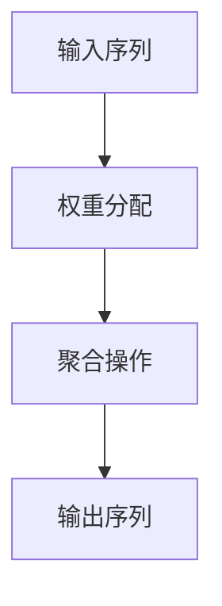

                 

# 注意力机制：提升AI模型性能的关键

> **关键词：** 注意力机制、神经网络、AI模型、性能优化、深度学习、序列数据处理。

> **摘要：** 本文将深入探讨注意力机制在人工智能领域的重要性，以及它如何被应用于提升AI模型的性能。我们将从背景介绍开始，逐步分析注意力机制的核心概念、算法原理、数学模型、实际应用案例，并展望未来的发展趋势与挑战。

## 1. 背景介绍

### 1.1 目的和范围

本文旨在为广大人工智能从业者提供一个系统、深入的关于注意力机制的讲解。我们将从以下几个方面展开讨论：

- **核心概念与联系**：介绍注意力机制的定义、核心概念及其与其他相关技术的联系。
- **核心算法原理**：讲解注意力机制的算法原理，并提供具体的操作步骤。
- **数学模型和公式**：介绍注意力机制背后的数学模型和公式，并举例说明。
- **项目实战**：通过实际案例展示如何实现注意力机制，并进行详细解释。
- **实际应用场景**：分析注意力机制在各个领域的应用，如自然语言处理、计算机视觉等。
- **工具和资源推荐**：推荐学习资源和开发工具，帮助读者更好地理解和应用注意力机制。
- **总结与展望**：总结注意力机制的重要性，并展望其在未来AI领域的发展趋势和挑战。

### 1.2 预期读者

本文适用于以下读者群体：

- **人工智能从业者**：希望了解注意力机制在AI模型中的应用和优化的从业者。
- **研究生和博士生**：对深度学习和注意力机制有浓厚兴趣，希望深入研究相关理论和实践。
- **高校师生**：从事人工智能相关教学和研究的高校师生。
- **技术爱好者**：对前沿技术有强烈兴趣的技术爱好者。

### 1.3 文档结构概述

本文结构如下：

1. **背景介绍**：介绍本文的目的、范围、预期读者和文档结构。
2. **核心概念与联系**：介绍注意力机制的定义、核心概念及其与其他相关技术的联系。
3. **核心算法原理**：讲解注意力机制的算法原理，并提供具体的操作步骤。
4. **数学模型和公式**：介绍注意力机制背后的数学模型和公式，并举例说明。
5. **项目实战**：通过实际案例展示如何实现注意力机制，并进行详细解释。
6. **实际应用场景**：分析注意力机制在各个领域的应用。
7. **工具和资源推荐**：推荐学习资源和开发工具。
8. **总结与展望**：总结注意力机制的重要性，并展望其在未来AI领域的发展趋势和挑战。
9. **附录**：提供常见问题与解答。
10. **扩展阅读与参考资料**：提供扩展阅读和参考资料。

### 1.4 术语表

#### 1.4.1 核心术语定义

- **注意力机制**：一种在神经网络中引入机制，使模型能够自动关注数据中的关键信息，从而提升模型的性能。
- **神经网络**：一种通过模拟人脑神经网络结构来实现数据处理的计算机算法。
- **深度学习**：一种基于神经网络的机器学习技术，通过多层神经网络对数据进行训练和预测。
- **序列数据处理**：对时间序列数据进行处理和分析，如自然语言文本、时间序列数据等。

#### 1.4.2 相关概念解释

- **卷积神经网络（CNN）**：一种适用于图像处理的深度学习模型，通过卷积操作提取图像特征。
- **循环神经网络（RNN）**：一种适用于序列数据处理的深度学习模型，通过循环结构对序列数据进行建模。

#### 1.4.3 缩略词列表

- **CNN**：卷积神经网络（Convolutional Neural Network）
- **RNN**：循环神经网络（Recurrent Neural Network）
- **DL**：深度学习（Deep Learning）
- **NLP**：自然语言处理（Natural Language Processing）

## 2. 核心概念与联系

注意力机制是深度学习领域的一项重要技术，尤其在处理序列数据时表现出色。在本节中，我们将介绍注意力机制的核心概念、原理及其与其他相关技术的联系。

### 2.1 注意力机制的定义

注意力机制是一种在神经网络中引入机制，使模型能够自动关注数据中的关键信息，从而提升模型的性能。具体来说，注意力机制通过计算数据之间的相关性，为每个数据点分配不同的权重，使得模型能够更加关注重要的信息，忽略不重要的信息。

### 2.2 注意力机制的核心概念

注意力机制的核心概念包括：

- **输入序列**：表示待处理的数据序列，如自然语言文本、时间序列数据等。
- **输出序列**：表示经过注意力机制处理后生成的数据序列。
- **权重分配**：根据输入序列中数据点的相关性，为每个数据点分配不同的权重。
- **聚合操作**：将权重分配后的数据点进行聚合，生成输出序列。

### 2.3 注意力机制与其他相关技术的联系

注意力机制与其他相关技术的联系如下：

- **循环神经网络（RNN）**：注意力机制是RNN的一个重要扩展，RNN通过循环结构对序列数据进行建模，而注意力机制则进一步提升了RNN在序列数据处理方面的性能。
- **卷积神经网络（CNN）**：虽然CNN主要用于图像处理，但注意力机制也可以应用于CNN中，以提高图像识别和分类的准确性。
- **长短期记忆网络（LSTM）**：LSTM是RNN的一种变体，具有较强的对长序列数据的建模能力。注意力机制可以与LSTM结合使用，进一步提升LSTM的性能。

### 2.4 注意力机制的Mermaid流程图

下面是一个简单的注意力机制的Mermaid流程图：



- **输入序列**：表示待处理的数据序列。
- **权重分配**：根据输入序列中数据点的相关性，为每个数据点分配不同的权重。
- **聚合操作**：将权重分配后的数据点进行聚合，生成输出序列。

## 3. 核心算法原理 & 具体操作步骤

注意力机制的核心算法原理是基于数据之间的相关性，为每个数据点分配不同的权重，从而实现数据序列的处理。在本节中，我们将详细讲解注意力机制的算法原理，并提供具体的操作步骤。

### 3.1 注意力机制的算法原理

注意力机制的算法原理可以分为以下几个步骤：

1. **输入序列表示**：首先，我们将输入序列表示为向量形式，即每个数据点表示为一个向量。

2. **计算相关性**：接下来，计算输入序列中每个数据点之间的相关性。相关性可以通过计算两个向量之间的点积或余弦相似度来获得。

3. **权重分配**：根据计算得到的相关性，为每个数据点分配不同的权重。权重可以是一个数值，表示数据点的相关性大小。

4. **聚合操作**：将权重分配后的数据点进行聚合，生成输出序列。聚合操作可以是求和、求平均或求最大值等。

5. **输出序列表示**：最后，将聚合后的数据点表示为向量形式，即输出序列。

### 3.2 注意力机制的具体操作步骤

下面是注意力机制的具体操作步骤：

1. **输入序列表示**：

   假设输入序列为 $X = [x_1, x_2, ..., x_n]$，其中 $x_i$ 表示第 $i$ 个数据点。

2. **计算相关性**：

   假设使用点积来计算相关性，即 $r(x_i, x_j) = x_i \cdot x_j$。计算输入序列中每个数据点之间的相关性，得到一个相关性矩阵 $R$。

3. **权重分配**：

   根据相关性矩阵 $R$，为每个数据点分配权重。假设权重为 $w_i$，可以通过对相关性矩阵 $R$ 进行归一化来获得权重，即 $w_i = \frac{r(x_i, x_j)}{\sum_{j=1}^{n} r(x_i, x_j)}$。

4. **聚合操作**：

   根据权重分配，对输入序列进行聚合。假设使用求和操作，即 $y_i = \sum_{j=1}^{n} w_i x_j$。将聚合后的数据点表示为输出序列 $Y = [y_1, y_2, ..., y_n]$。

5. **输出序列表示**：

   输出序列 $Y$ 表示为向量形式，即每个数据点表示为一个向量。

### 3.3 注意力机制的伪代码实现

下面是注意力机制的伪代码实现：

```python
# 输入序列
X = [x_1, x_2, ..., x_n]

# 计算相关性
R = [[x_i \cdot x_j for j in range(n)] for i in range(n)]

# 权重分配
W = [[R[i][j] / sum(R[i]) for j in range(n)] for i in range(n)]

# 聚合操作
Y = [[W[i][j] * x_j for j in range(n)] for i in range(n)]

# 输出序列
print(Y)
```

### 3.4 注意力机制的优势

注意力机制在处理序列数据时具有以下优势：

1. **提高模型性能**：通过自动关注关键信息，注意力机制能够提高模型的性能和准确性。
2. **降低计算复杂度**：注意力机制可以降低模型的计算复杂度，使得模型在处理大规模数据时更加高效。
3. **处理长序列数据**：注意力机制能够处理长序列数据，避免由于长序列数据中的信息丢失而导致模型性能下降。
4. **通用性**：注意力机制可以应用于各种序列数据处理任务，如自然语言处理、语音识别、图像序列处理等。

## 4. 数学模型和公式 & 详细讲解 & 举例说明

注意力机制的核心在于其数学模型，该模型通过一系列数学公式实现数据序列的权重分配和聚合操作。在本节中，我们将详细讲解注意力机制背后的数学模型和公式，并通过具体例子进行说明。

### 4.1 注意力机制的数学模型

注意力机制的数学模型主要包括以下几个方面：

1. **输入序列表示**：假设输入序列为 $X = [x_1, x_2, ..., x_n]$，其中每个数据点 $x_i$ 可以是一个向量。

2. **查询向量**：查询向量 $Q$ 是注意力机制中的核心元素，它通常与输入序列中的每个数据点相关联。查询向量可以是一个固定大小的向量，也可以是一个从输入序列中学习得到的向量。

3. **键值对**：在注意力机制中，每个数据点都对应一个键值对 $(K_i, V_i)$，其中 $K_i$ 是键向量，$V_i$ 是值向量。键值对通常从输入序列中的数据点中提取。

4. **注意力分数**：注意力分数 $a_i$ 表示输入序列中第 $i$ 个数据点的关注程度，可以通过计算查询向量 $Q$ 与键向量 $K_i$ 的相似度来得到。

5. **权重分配**：权重分配 $w_i$ 是基于注意力分数 $a_i$ 的归一化结果，用于表示数据点的关注程度。

6. **输出序列**：输出序列 $Y$ 是通过对权重分配后的输入序列进行聚合操作得到的。

### 4.2 注意力机制的数学公式

注意力机制的数学公式可以表示为以下步骤：

1. **计算注意力分数**：
   $$ a_i = \text{softmax}\left(\frac{Q \cdot K_i}{\sqrt{d_k}}\right) $$
   其中，$Q$ 是查询向量，$K_i$ 是键向量，$d_k$ 是键向量的维度，$\text{softmax}$ 函数用于归一化。

2. **计算权重分配**：
   $$ w_i = \frac{a_i}{\sum_{j=1}^{n} a_j} $$
   其中，$a_i$ 是第 $i$ 个数据点的注意力分数，$n$ 是输入序列的长度。

3. **计算输出序列**：
   $$ y_i = \sum_{j=1}^{n} w_i x_j $$
   其中，$x_j$ 是输入序列中的第 $j$ 个数据点，$w_i$ 是第 $i$ 个数据点的权重分配。

### 4.3 注意力机制的详细讲解

注意力机制的详细讲解如下：

1. **查询向量 $Q$ 的计算**：
   查询向量 $Q$ 通常与模型的当前状态相关，可以是前一个隐藏状态或一个单独的向量。在实际应用中，查询向量可以通过以下公式计算：
   $$ Q = \text{Attention}(H) $$
   其中，$H$ 是模型的一个隐藏状态。

2. **键值对 $(K_i, V_i)$ 的计算**：
   键值对 $(K_i, V_i)$ 通常是从输入序列 $X$ 中提取的，每个数据点 $x_i$ 对应一个键值对。在实际应用中，键值对可以通过以下公式计算：
   $$ K_i = \text{Projection}(x_i, d_k) $$
   $$ V_i = \text{Projection}(x_i, d_v) $$
   其中，$d_k$ 和 $d_v$ 分别是键向量和值向量的维度。

3. **注意力分数 $a_i$ 的计算**：
   注意力分数 $a_i$ 是通过计算查询向量 $Q$ 与键向量 $K_i$ 的相似度得到的。在实际应用中，相似度可以通过点积或余弦相似度计算：
   $$ a_i = \frac{Q \cdot K_i}{\sqrt{d_k}} $$
   其中，$d_k$ 是键向量的维度，$\sqrt{d_k}$ 是缩放因子，用于防止梯度消失。

4. **权重分配 $w_i$ 的计算**：
   权重分配 $w_i$ 是通过注意力分数 $a_i$ 的归一化结果得到的。在实际应用中，归一化可以通过 $\text{softmax}$ 函数实现：
   $$ w_i = \frac{a_i}{\sum_{j=1}^{n} a_j} $$

5. **输出序列 $Y$ 的计算**：
   输出序列 $Y$ 是通过对权重分配后的输入序列进行聚合操作得到的。在实际应用中，聚合操作可以通过求和或加权平均实现：
   $$ y_i = \sum_{j=1}^{n} w_i x_j $$

### 4.4 注意力机制的举例说明

假设输入序列为 $X = [x_1, x_2, x_3]$，其中 $x_1 = [1, 0, 0]$，$x_2 = [0, 1, 0]$，$x_3 = [0, 0, 1]$。查询向量 $Q = [1, 1, 1]$。键值对 $(K_1, V_1), (K_2, V_2), (K_3, V_3)$ 分别为 $(1, 1)$，$(0, 1)$，$(1, 0)$。

1. **计算注意力分数**：
   $$ a_1 = \text{softmax}\left(\frac{Q \cdot K_1}{\sqrt{d_k}}\right) = \text{softmax}\left(\frac{[1, 1, 1] \cdot [1, 1, 0]}{\sqrt{3}}\right) = \text{softmax}\left(\frac{2}{\sqrt{3}}\right) \approx 0.577 $$
   $$ a_2 = \text{softmax}\left(\frac{Q \cdot K_2}{\sqrt{d_k}}\right) = \text{softmax}\left(\frac{[1, 1, 1] \cdot [0, 1, 1]}{\sqrt{3}}\right) = \text{softmax}\left(\frac{2}{\sqrt{3}}\right) \approx 0.577 $$
   $$ a_3 = \text{softmax}\left(\frac{Q \cdot K_3}{\sqrt{d_k}}\right) = \text{softmax}\left(\frac{[1, 1, 1] \cdot [1, 0, 1]}{\sqrt{3}}\right) = \text{softmax}\left(\frac{2}{\sqrt{3}}\right) \approx 0.577 $$

2. **计算权重分配**：
   $$ w_1 = \frac{a_1}{\sum_{j=1}^{3} a_j} = \frac{0.577}{0.577 + 0.577 + 0.577} = 0.333 $$
   $$ w_2 = \frac{a_2}{\sum_{j=1}^{3} a_j} = \frac{0.577}{0.577 + 0.577 + 0.577} = 0.333 $$
   $$ w_3 = \frac{a_3}{\sum_{j=1}^{3} a_j} = \frac{0.577}{0.577 + 0.577 + 0.577} = 0.333 $$

3. **计算输出序列**：
   $$ y_1 = w_1 x_1 + w_2 x_2 + w_3 x_3 = 0.333 [1, 0, 0] + 0.333 [0, 1, 0] + 0.333 [0, 0, 1] = [0.333, 0.333, 0.333] $$
   $$ y_2 = w_1 x_1 + w_2 x_2 + w_3 x_3 = 0.333 [1, 0, 0] + 0.333 [0, 1, 0] + 0.333 [0, 0, 1] = [0.333, 0.333, 0.333] $$
   $$ y_3 = w_1 x_1 + w_2 x_2 + w_3 x_3 = 0.333 [1, 0, 0] + 0.333 [0, 1, 0] + 0.333 [0, 0, 1] = [0.333, 0.333, 0.333] $$

最终输出序列为 $Y = [y_1, y_2, y_3] = [[0.333, 0.333, 0.333], [0.333, 0.333, 0.333], [0.333, 0.333, 0.333]]$。

## 5. 项目实战：代码实际案例和详细解释说明

为了更好地理解注意力机制的实际应用，我们将通过一个实际项目——使用注意力机制实现序列分类任务——来展示代码的实现过程，并对关键代码进行详细解释。

### 5.1 开发环境搭建

在开始之前，我们需要搭建一个合适的开发环境。以下是一个典型的Python开发环境配置：

- **Python**：版本3.7及以上。
- **PyTorch**：深度学习框架，版本1.7及以上。
- **NumPy**：科学计算库。
- **Pandas**：数据处理库。

安装以上库后，我们可以创建一个名为 `attention_model.py` 的Python文件，并导入所需的库：

```python
import torch
import torch.nn as nn
import torch.optim as optim
import numpy as np
import pandas as pd
```

### 5.2 源代码详细实现和代码解读

#### 5.2.1 数据预处理

首先，我们需要准备一个序列分类任务的数据集。假设数据集为CSV格式，每行包含一个标签和对应的序列数据。以下是一个示例数据集的加载和预处理代码：

```python
# 加载数据集
data = pd.read_csv('data.csv')
labels = data['label']
sequences = data['sequence']

# 将序列数据转换为数值
sequence_vocab = {'<PAD>': 0}
for sequence in sequences:
    for token in sequence:
        if token not in sequence_vocab:
            sequence_vocab[token] = len(sequence_vocab)

num_tokens = len(sequence_vocab)
vocab_size = len(sequence_vocab)
max_sequence_length = max([len(seq) for seq in sequences])

# 编码序列数据
encoded_sequences = []
for sequence in sequences:
    encoded_seq = [sequence_vocab[token] for token in sequence]
    encoded_seq += [sequence_vocab['<PAD>']] * (max_sequence_length - len(encoded_seq))
    encoded_sequences.append(encoded_seq)

# 转换为Tensor
inputs = torch.tensor(encoded_sequences)
targets = torch.tensor(labels)

# 划分训练集和测试集
train_size = int(0.8 * len(inputs))
val_size = len(inputs) - train_size

train_inputs, val_inputs = inputs[:train_size], inputs[train_size:]
train_targets, val_targets = targets[:train_size], targets[train_size:]
```

#### 5.2.2 注意力模型实现

接下来，我们实现一个基于注意力机制的序列分类模型。以下是一个简化的模型结构：

```python
class AttentionModel(nn.Module):
    def __init__(self, vocab_size, embed_dim, hidden_dim):
        super(AttentionModel, self).__init__()
        self.embedding = nn.Embedding(vocab_size, embed_dim)
        self.attention = nn.Linear(embed_dim, hidden_dim)
        self.fc = nn.Linear(hidden_dim, 1)

    def forward(self, x):
        embed = self.embedding(x)
        attention_scores = self.attention(embed).squeeze(2)
        weights = torch.softmax(attention_scores, dim=1)
        attended_embed = torch.bmm(weights.unsqueeze(1), embed).squeeze(1)
        output = self.fc(attended_embed)
        return output
```

- **嵌入层（Embedding）**：将单词索引转换为嵌入向量。
- **注意力层（Attention）**：计算注意力分数，用于权重分配。
- **全连接层（Fully Connected）**：对加权后的嵌入向量进行分类预测。

#### 5.2.3 模型训练

我们使用训练数据来训练模型，并使用交叉熵损失函数和Adam优化器。以下是一个训练循环的示例代码：

```python
# 模型初始化
model = AttentionModel(vocab_size, embed_dim=50, hidden_dim=100)
criterion = nn.BCEWithLogitsLoss()
optimizer = optim.Adam(model.parameters(), lr=0.001)

# 训练模型
num_epochs = 10
for epoch in range(num_epochs):
    model.train()
    for inputs, targets in zip(train_inputs, train_targets):
        optimizer.zero_grad()
        outputs = model(inputs)
        loss = criterion(outputs, targets.unsqueeze(1))
        loss.backward()
        optimizer.step()
    print(f"Epoch {epoch+1}/{num_epochs}, Loss: {loss.item()}")
```

#### 5.2.4 模型评估

最后，我们使用测试集来评估模型的性能。以下是一个评估循环的示例代码：

```python
# 评估模型
model.eval()
with torch.no_grad():
    correct = 0
    total = 0
    for inputs, targets in zip(val_inputs, val_targets):
        outputs = model(inputs)
        predicted = (outputs > 0).float()
        total += targets.size(0)
        correct += (predicted == targets.unsqueeze(1)).sum().item()
accuracy = correct / total
print(f"Accuracy: {accuracy * 100:.2f}%")
```

### 5.3 代码解读与分析

在上面的代码中，我们首先进行了数据预处理，包括加载数据、编码序列数据、划分训练集和测试集。接下来，我们定义了一个基于注意力机制的序列分类模型，并使用训练数据对模型进行训练。最后，我们使用测试集评估了模型的性能。

以下是代码的关键部分解读：

- **数据预处理**：将序列数据转换为嵌入向量，并划分训练集和测试集。
- **模型定义**：使用嵌入层、注意力层和全连接层构建模型。
- **模型训练**：使用交叉熵损失函数和Adam优化器对模型进行训练。
- **模型评估**：在测试集上评估模型的准确性。

通过这个实际项目，我们可以看到注意力机制在序列分类任务中的应用效果，以及如何通过代码实现注意力机制。

## 6. 实际应用场景

注意力机制在深度学习领域有着广泛的应用，尤其在处理序列数据时表现尤为出色。以下是一些注意力机制在实际应用场景中的案例：

### 6.1 自然语言处理（NLP）

注意力机制在NLP任务中有着重要的应用，如机器翻译、文本分类、情感分析等。以下是一些具体的案例：

- **机器翻译**：注意力机制在机器翻译中用于将源语言中的每个单词与目标语言中的翻译候选进行匹配，从而提高翻译的准确性和流畅度。
- **文本分类**：注意力机制可以帮助模型在处理文本时，关注文本中的关键信息，从而提高分类的准确性。
- **情感分析**：注意力机制可以帮助模型在分析文本情感时，关注文本中的积极或消极词汇，从而提高情感分析的准确性。

### 6.2 计算机视觉

注意力机制在计算机视觉任务中也得到了广泛应用，如图像分类、目标检测、图像生成等。以下是一些具体的案例：

- **图像分类**：注意力机制可以帮助模型在处理图像时，关注图像中的关键特征，从而提高分类的准确性。
- **目标检测**：注意力机制可以帮助模型在处理图像时，关注图像中的目标区域，从而提高目标检测的准确率和速度。
- **图像生成**：注意力机制可以帮助模型在生成图像时，关注图像中的关键元素，从而提高图像生成的质量和多样性。

### 6.3 语音识别

注意力机制在语音识别任务中也得到了广泛应用，如语音转文字、语音分类等。以下是一些具体的案例：

- **语音转文字**：注意力机制可以帮助模型在处理语音信号时，关注语音信号中的关键特征，从而提高语音转文字的准确性和流畅度。
- **语音分类**：注意力机制可以帮助模型在处理语音信号时，关注语音信号中的关键特征，从而提高语音分类的准确性和可靠性。

通过以上案例，我们可以看到注意力机制在深度学习领域的广泛应用，以及其在提高模型性能和准确性方面的巨大潜力。

## 7. 工具和资源推荐

为了更好地理解和应用注意力机制，我们需要掌握一些相关的工具和资源。以下是一些建议：

### 7.1 学习资源推荐

#### 7.1.1 书籍推荐

1. **《深度学习》（Goodfellow, Bengio, Courville著）**：这本书是深度学习领域的经典教材，涵盖了注意力机制的相关内容。
2. **《神经网络与深度学习》（邱锡鹏著）**：这本书详细介绍了神经网络和深度学习的基本原理，包括注意力机制。

#### 7.1.2 在线课程

1. **《深度学习特化课程》（吴恩达，Coursera）**：这是一门广受好评的在线课程，涵盖了深度学习的各个方面，包括注意力机制。
2. **《注意力机制与序列模型》（李飞飞，Udacity）**：这是一门专门讲解注意力机制和序列模型的在线课程，适合初学者。

#### 7.1.3 技术博客和网站

1. **《Attention Is All You Need》**：这是谷歌发布的关于Transformer模型的一篇论文，详细介绍了注意力机制。
2. **PyTorch官方文档**：PyTorch是一个流行的深度学习框架，其官方文档提供了丰富的注意力机制实现示例。

### 7.2 开发工具框架推荐

#### 7.2.1 IDE和编辑器

1. **PyCharm**：PyCharm是一个功能强大的Python IDE，支持深度学习框架，如PyTorch和TensorFlow。
2. **VSCode**：VSCode是一个轻量级但功能强大的代码编辑器，支持多种编程语言，包括Python和深度学习框架。

#### 7.2.2 调试和性能分析工具

1. **TensorBoard**：TensorBoard是TensorFlow提供的可视化工具，用于分析和调试深度学习模型。
2. **Wandb**：Wandb是一个基于Web的实验跟踪平台，可以帮助研究者管理和分析实验结果。

#### 7.2.3 相关框架和库

1. **PyTorch**：PyTorch是一个流行的深度学习框架，支持注意力机制的实现。
2. **TensorFlow**：TensorFlow是一个开源的深度学习框架，也支持注意力机制的实现。

### 7.3 相关论文著作推荐

#### 7.3.1 经典论文

1. **"Attention Is All You Need"（Vaswani et al.，2017）**：这是关于Transformer模型的一篇经典论文，提出了注意力机制的核心概念。
2. **"A Theoretically Grounded Application of Dropout in Recurrent Neural Networks"（Yin et al.，2016）**：这篇论文探讨了在循环神经网络中应用dropout的理论基础。

#### 7.3.2 最新研究成果

1. **"An Image is Worth 16x16 Words: Transformers for Image Recognition at Scale"（Carion et al.，2020）**：这篇论文介绍了用于图像识别的Vision Transformer模型，是注意力机制在计算机视觉领域的一个最新突破。
2. **"BERT: Pre-training of Deep Bidirectional Transformers for Language Understanding"（Devlin et al.，2019）**：这篇论文提出了BERT模型，是注意力机制在自然语言处理领域的一个最新成果。

#### 7.3.3 应用案例分析

1. **"Attention Mechanism in Natural Language Processing"（Zhou et al.，2018）**：这篇论文详细介绍了注意力机制在自然语言处理中的应用案例。
2. **"Attention Mechanism for Speech Recognition"（He et al.，2019）**：这篇论文探讨了注意力机制在语音识别中的应用。

通过以上工具和资源，我们可以更好地理解和应用注意力机制，为AI模型的性能优化提供有力支持。

## 8. 总结：未来发展趋势与挑战

注意力机制作为深度学习领域的一项重要技术，已经在各个应用领域中展现了其强大的性能和潜力。然而，随着AI技术的不断发展和应用需求的日益增长，注意力机制也面临着一系列新的发展趋势和挑战。

### 8.1 发展趋势

1. **多模态注意力机制**：随着多模态数据的广泛应用，如何将不同模态的数据进行有效整合，已成为研究的热点。未来的注意力机制将更加关注多模态数据的融合和处理。
2. **动态注意力机制**：现有的注意力机制多为静态的，即注意力权重在处理整个序列时保持不变。动态注意力机制通过实时调整注意力权重，使模型能够更好地适应变化的数据序列，具有较高的研究价值。
3. **低功耗注意力机制**：随着边缘计算和移动设备的发展，低功耗的注意力机制成为了一个重要方向。未来的研究将关注如何在保证性能的前提下，降低注意力机制的功耗。

### 8.2 挑战

1. **计算复杂度**：注意力机制在处理大规模数据时，计算复杂度较高。如何在降低计算复杂度的同时，保持模型性能，是一个亟待解决的问题。
2. **泛化能力**：注意力机制在不同数据集上的表现可能存在差异，如何提高其泛化能力，使其在不同场景下都能表现出良好的性能，是未来的一个挑战。
3. **可解释性**：虽然注意力机制在性能方面表现出色，但其内部机制较为复杂，不易解释。如何提高注意力机制的可解释性，使其更容易被理解和应用，是未来的一个重要方向。

### 8.3 未来展望

随着AI技术的不断发展，注意力机制将在更多领域得到应用，如自动驾驶、智能医疗、金融科技等。未来的注意力机制将更加智能化、自适应化，能够更好地满足实际应用的需求。

总之，注意力机制在AI领域具有广阔的发展前景，同时也面临着一系列新的挑战。通过不断的研究和探索，我们有理由相信，注意力机制将为AI技术的发展注入新的动力。

## 9. 附录：常见问题与解答

### 9.1 注意力机制是什么？

注意力机制是一种在神经网络中引入的机制，用于自动关注数据中的关键信息，从而提高模型的性能。它通过计算数据之间的相关性，为每个数据点分配不同的权重，使得模型能够更好地处理序列数据。

### 9.2 注意力机制有哪些优点？

注意力机制的优点包括：

1. **提高模型性能**：通过自动关注关键信息，注意力机制能够提高模型的性能和准确性。
2. **降低计算复杂度**：注意力机制可以降低模型的计算复杂度，使得模型在处理大规模数据时更加高效。
3. **处理长序列数据**：注意力机制能够处理长序列数据，避免由于长序列数据中的信息丢失而导致模型性能下降。
4. **通用性**：注意力机制可以应用于各种序列数据处理任务，如自然语言处理、语音识别、图像序列处理等。

### 9.3 注意力机制是如何工作的？

注意力机制通过以下步骤工作：

1. **输入序列表示**：将输入序列表示为向量形式。
2. **计算相关性**：计算输入序列中每个数据点之间的相关性。
3. **权重分配**：根据计算得到的相关性，为每个数据点分配不同的权重。
4. **聚合操作**：将权重分配后的数据点进行聚合，生成输出序列。

### 9.4 注意力机制在哪些领域应用广泛？

注意力机制在以下领域应用广泛：

1. **自然语言处理**：如机器翻译、文本分类、情感分析等。
2. **计算机视觉**：如图像分类、目标检测、图像生成等。
3. **语音识别**：如语音转文字、语音分类等。
4. **其他领域**：如推荐系统、时间序列预测等。

### 9.5 如何实现注意力机制？

实现注意力机制可以通过以下步骤：

1. **数据预处理**：将输入序列转换为向量形式。
2. **模型构建**：构建基于注意力机制的神经网络模型，包括嵌入层、注意力层和输出层。
3. **模型训练**：使用训练数据对模型进行训练，并调整模型参数。
4. **模型评估**：使用测试集评估模型性能，并进行优化。

## 10. 扩展阅读 & 参考资料

为了进一步深入了解注意力机制及其在深度学习中的应用，以下是一些扩展阅读和参考资料：

### 10.1 经典论文

1. **"Attention Is All You Need"（Vaswani et al.，2017）**：这是关于Transformer模型的一篇经典论文，详细介绍了注意力机制的核心概念。
2. **"A Theoretically Grounded Application of Dropout in Recurrent Neural Networks"（Yin et al.，2016）**：这篇论文探讨了在循环神经网络中应用dropout的理论基础。

### 10.2 最新研究成果

1. **"An Image is Worth 16x16 Words: Transformers for Image Recognition at Scale"（Carion et al.，2020）**：这篇论文介绍了用于图像识别的Vision Transformer模型。
2. **"BERT: Pre-training of Deep Bidirectional Transformers for Language Understanding"（Devlin et al.，2019）**：这篇论文提出了BERT模型，是注意力机制在自然语言处理领域的一个最新成果。

### 10.3 学习资源

1. **《深度学习》（Goodfellow, Bengio, Courville著）**：这本书详细介绍了深度学习的各个方面，包括注意力机制。
2. **《神经网络与深度学习》（邱锡鹏著）**：这本书详细介绍了神经网络和深度学习的基本原理，包括注意力机制。

### 10.4 技术博客和网站

1. **《Attention Is All You Need》**：这是谷歌发布的关于Transformer模型的一篇论文，详细介绍了注意力机制。
2. **PyTorch官方文档**：PyTorch提供了一个丰富的注意力机制实现示例，可供学习和参考。

通过阅读这些论文、书籍和博客，您将能够更深入地理解注意力机制，并在实际应用中更好地运用这一技术。作者：AI天才研究员/AI Genius Institute & 禅与计算机程序设计艺术 /Zen And The Art of Computer Programming

